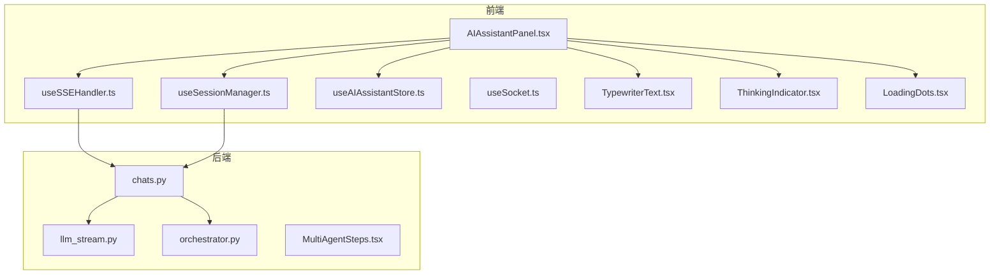
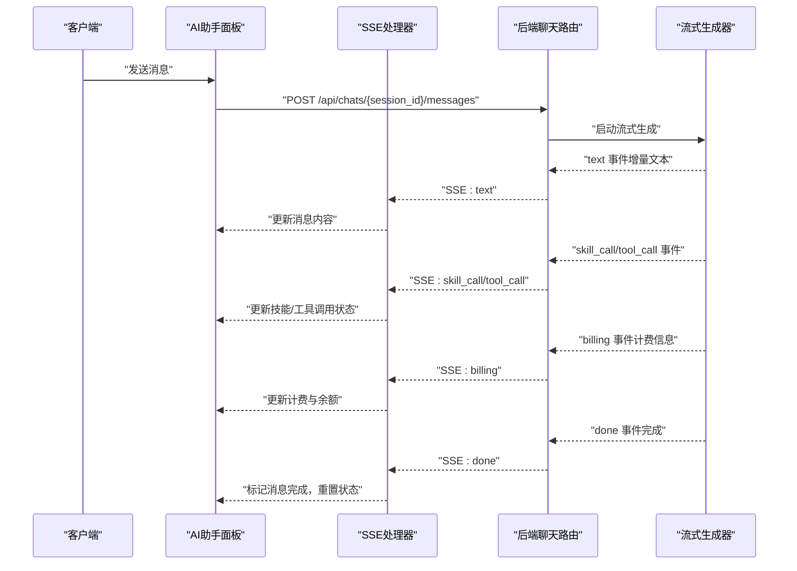
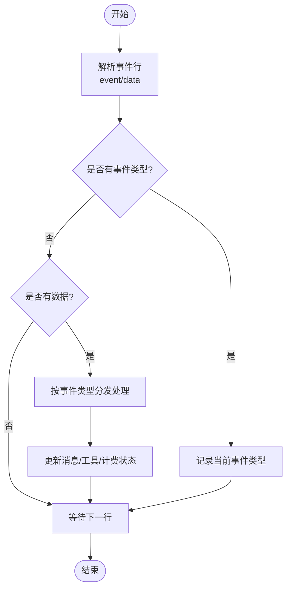
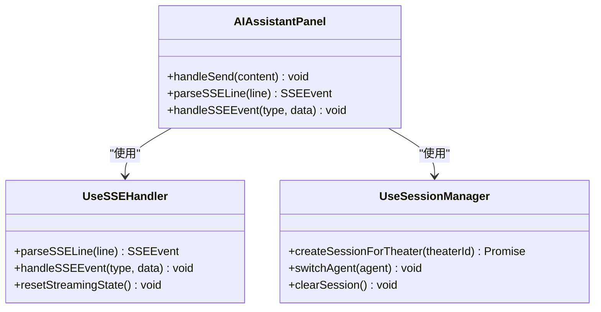
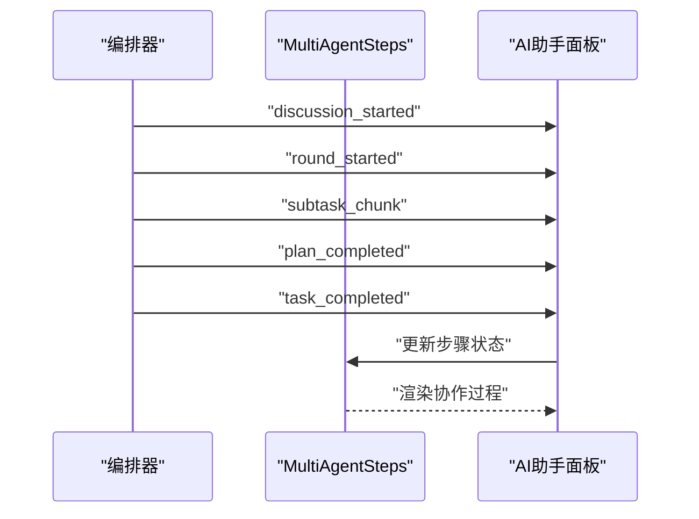
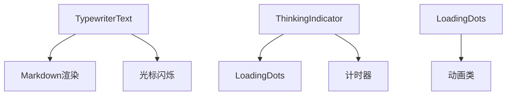
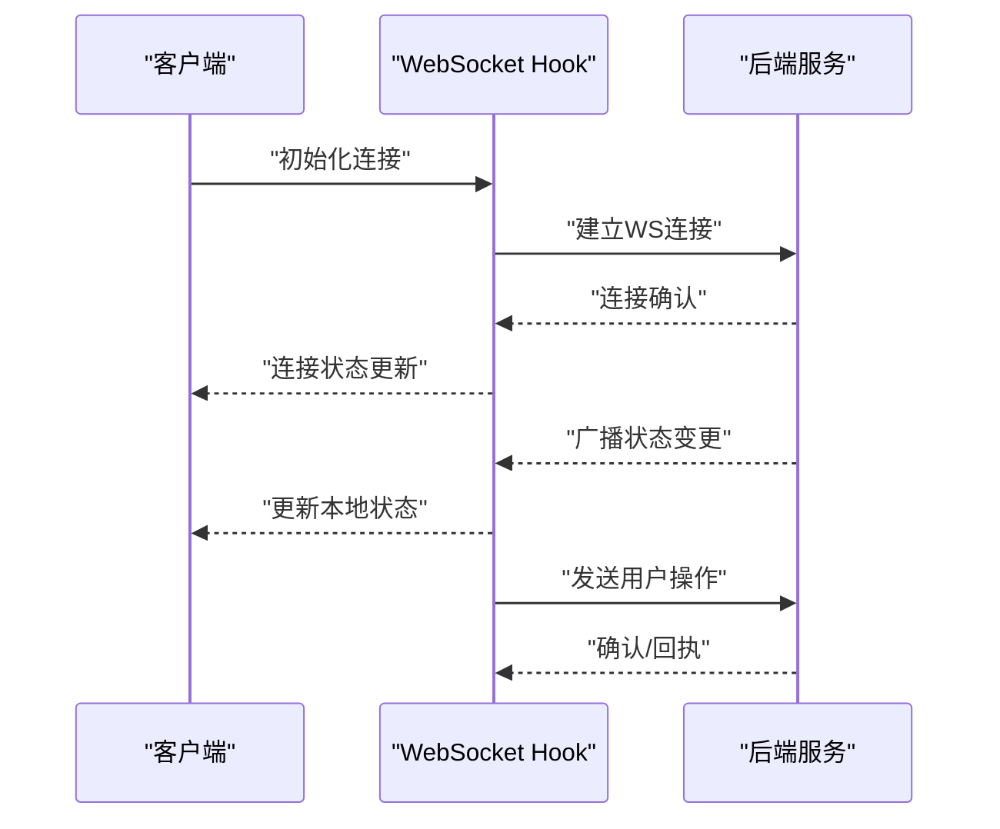
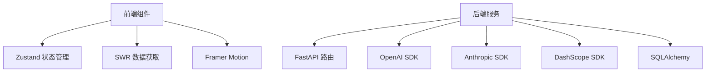

# 实时预览功能

<cite>
**本文档引用的文件**
- [AIAssistantPanel.tsx](file://frontend/src/components/canvas/AIAssistantPanel.tsx)
- [useSSEHandler.ts](file://frontend/src/components/ai-assistant/hooks/useSSEHandler.ts)
- [useSessionManager.ts](file://frontend/src/components/ai-assistant/hooks/useSessionManager.ts)
- [useAIAssistantStore.ts](file://frontend/src/store/useAIAssistantStore.ts)
- [useSocket.ts](file://frontend/src/hooks/useSocket.ts)
- [chats.py](file://backend/routers/chats.py)
- [llm_stream.py](file://backend/services/llm_stream.py)
- [orchestrator.py](file://backend/services/orchestrator.py)
- [MultiAgentSteps.tsx](file://frontend/src/components/canvas/MultiAgentSteps.tsx)
- [TypewriterText.tsx](file://frontend/src/components/ai-assistant/TypewriterText.tsx)
- [ThinkingIndicator.tsx](file://frontend/src/components/ai-assistant/ThinkingIndicator.tsx)
- [LoadingDots.tsx](file://frontend/src/components/ai-assistant/LoadingDots.tsx)
- [_keyframe-animations.scss](file://frontend/src/styles/_keyframe-animations.scss)
- [VideoPreviewModal.tsx](file://backend/admin/src/app/admin/videos/VideoPreviewModal.tsx)
- [videos.py](file://backend/routers/videos.py)
- [useVideoTasks.ts](file://backend/admin/src/hooks/useVideoTasks.ts)
</cite>

## 目录
1. [简介](#简介)
2. [项目结构](#项目结构)
3. [核心组件](#核心组件)
4. [架构概览](#架构概览)
5. [详细组件分析](#详细组件分析)
6. [依赖关系分析](#依赖关系分析)
7. [性能考虑](#性能考虑)
8. [故障排除指南](#故障排除指南)
9. [结论](#结论)
10. [附录](#附录)

## 简介
本文件全面阐述实时预览功能的实现机制，涵盖以下关键方面：
- SSE（Server-Sent Events）流式响应的实现原理与事件流管理
- WebSocket 在实时协作中的应用场景与连接管理
- 前端流式数据处理的 Hook 设计模式与事件监听机制
- 实时预览的用户体验优化（LoadingDots 动画、打字机文本显示、进度指示器）
- 完整的实时通信 API 文档（事件类型、消息格式、错误处理策略）
- 性能优化方案（节流控制、缓冲区管理、连接池管理）
- 实时预览在不同场景的应用（AI 生成过程展示、协作编辑同步、状态通知）

## 项目结构
实时预览功能主要分布在前端组件与后端路由服务两个层面：
- 前端负责事件监听、状态管理、UI 动画与用户交互
- 后端负责流式生成、事件分发与多智能体协作编排

**图表来源**
- [AIAssistantPanel.tsx:1-326](file://frontend/src/components/canvas/AIAssistantPanel.tsx#L1-L326)
- [useSSEHandler.ts:1-334](file://frontend/src/components/ai-assistant/hooks/useSSEHandler.ts#L1-L334)
- [useSessionManager.ts:1-179](file://frontend/src/components/ai-assistant/hooks/useSessionManager.ts#L1-L179)
- [useAIAssistantStore.ts:1-274](file://frontend/src/store/useAIAssistantStore.ts#L1-L274)
- [useSocket.ts:1-42](file://frontend/src/hooks/useSocket.ts#L1-L42)
- [chats.py:1-807](file://backend/routers/chats.py#L1-L807)
- [llm_stream.py:1-977](file://backend/services/llm_stream.py#L1-L977)
- [orchestrator.py:76-444](file://backend/services/orchestrator.py#L76-L444)
- [MultiAgentSteps.tsx:1-44](file://frontend/src/components/canvas/MultiAgentSteps.tsx#L1-L44)
- [TypewriterText.tsx:1-81](file://frontend/src/components/ai-assistant/TypewriterText.tsx#L1-L81)
- [ThinkingIndicator.tsx:1-55](file://frontend/src/components/ai-assistant/ThinkingIndicator.tsx#L1-L55)
- [LoadingDots.tsx:1-49](file://frontend/src/components/ai-assistant/LoadingDots.tsx#L1-L49)

**章节来源**
- [AIAssistantPanel.tsx:1-326](file://frontend/src/components/canvas/AIAssistantPanel.tsx#L1-L326)
- [chats.py:1-807](file://backend/routers/chats.py#L1-L807)

## 核心组件
- SSE 事件处理器：负责解析服务器推送的事件行，按事件类型分发到对应处理逻辑
- 会话管理器：负责创建/切换会话、加载代理列表、维护消息历史
- AI 助手 Store：集中管理消息、会话、面板尺寸与画布上下文
- WebSocket Hook：提供基础的 WebSocket 连接与消息收发能力
- 流式渲染组件：提供打字机文本显示、思考指示器与加载点动画
- 后端流式生成器：统一的 LLM 流式接口与工具调用循环
- 多智能体编排器：支持讨论式协作与子任务编排

**章节来源**
- [useSSEHandler.ts:1-334](file://frontend/src/components/ai-assistant/hooks/useSSEHandler.ts#L1-L334)
- [useSessionManager.ts:1-179](file://frontend/src/components/ai-assistant/hooks/useSessionManager.ts#L1-L179)
- [useAIAssistantStore.ts:1-274](file://frontend/src/store/useAIAssistantStore.ts#L1-L274)
- [useSocket.ts:1-42](file://frontend/src/hooks/useSocket.ts#L1-L42)
- [TypewriterText.tsx:1-81](file://frontend/src/components/ai-assistant/TypewriterText.tsx#L1-L81)
- [ThinkingIndicator.tsx:1-55](file://frontend/src/components/ai-assistant/ThinkingIndicator.tsx#L1-L55)
- [LoadingDots.tsx:1-49](file://frontend/src/components/ai-assistant/LoadingDots.tsx#L1-L49)
- [llm_stream.py:1-977](file://backend/services/llm_stream.py#L1-L977)
- [orchestrator.py:76-444](file://backend/services/orchestrator.py#L76-L444)

## 架构概览
实时预览采用前后端分离的流式架构：
- 前端通过 Fetch API 以流式方式接收 SSE 事件
- 后端基于 FastAPI 的 StreamingResponse 逐段推送事件
- 事件类型覆盖文本流、工具调用、计费信息与完成信号
- 多智能体模式下，后端通过编排器产生协作事件并推送给前端

**图表来源**
- [AIAssistantPanel.tsx:87-179](file://frontend/src/components/canvas/AIAssistantPanel.tsx#L87-L179)
- [useSSEHandler.ts:63-327](file://frontend/src/components/ai-assistant/hooks/useSSEHandler.ts#L63-L327)
- [chats.py:202-258](file://backend/routers/chats.py#L202-L258)
- [llm_stream.py:80-146](file://backend/services/llm_stream.py#L80-L146)

**章节来源**
- [AIAssistantPanel.tsx:87-179](file://frontend/src/components/canvas/AIAssistantPanel.tsx#L87-L179)
- [useSSEHandler.ts:63-327](file://frontend/src/components/ai-assistant/hooks/useSSEHandler.ts#L63-L327)
- [chats.py:202-258](file://backend/routers/chats.py#L202-L258)

## 详细组件分析

### SSE 事件处理机制
SSE 事件处理分为两层：
- 前端解析层：将原始事件行解析为事件类型与数据对象
- 事件分发层：根据事件类型更新消息状态、工具调用与计费信息

**图表来源**
- [useSSEHandler.ts:52-61](file://frontend/src/components/ai-assistant/hooks/useSSEHandler.ts#L52-L61)
- [useSSEHandler.ts:63-327](file://frontend/src/components/ai-assistant/hooks/useSSEHandler.ts#L63-L327)

**章节来源**
- [useSSEHandler.ts:52-61](file://frontend/src/components/ai-assistant/hooks/useSSEHandler.ts#L52-L61)
- [useSSEHandler.ts:63-327](file://frontend/src/components/ai-assistant/hooks/useSSEHandler.ts#L63-L327)

### 流式数据处理前端实现
- useSSEHandler Hook：封装事件解析与状态更新逻辑，提供 resetStreamingState 重置能力
- AIAssistantPanel：负责发起请求、读取流式响应、分发事件到处理器
- useSessionManager：管理会话生命周期与代理切换

**图表来源**
- [useSSEHandler.ts:24-334](file://frontend/src/components/ai-assistant/hooks/useSSEHandler.ts#L24-L334)
- [AIAssistantPanel.tsx:14-51](file://frontend/src/components/canvas/AIAssistantPanel.tsx#L14-L51)
- [useSessionManager.ts:12-179](file://frontend/src/components/ai-assistant/hooks/useSessionManager.ts#L12-L179)

**章节来源**
- [useSSEHandler.ts:24-334](file://frontend/src/components/ai-assistant/hooks/useSSEHandler.ts#L24-L334)
- [AIAssistantPanel.tsx:14-51](file://frontend/src/components/canvas/AIAssistantPanel.tsx#L14-L51)
- [useSessionManager.ts:12-179](file://frontend/src/components/ai-assistant/hooks/useSessionManager.ts#L12-L179)

### 多智能体协作与状态广播
- 后端编排器：支持讨论式协作，按回合推进并产出协作事件
- 前端 MultiAgentSteps：展示协作步骤、状态与令牌消耗
- 事件类型：discussion_started、round_started、subtask_chunk、plan_completed、task_completed

**图表来源**
- [orchestrator.py:412-444](file://backend/services/orchestrator.py#L412-L444)
- [MultiAgentSteps.tsx:28-44](file://frontend/src/components/canvas/MultiAgentSteps.tsx#L28-L44)

**章节来源**
- [orchestrator.py:412-444](file://backend/services/orchestrator.py#L412-L444)
- [MultiAgentSteps.tsx:28-44](file://frontend/src/components/canvas/MultiAgentSteps.tsx#L28-L44)

### 实时预览用户体验优化
- 打字机文本显示：TypewriterText 组件提供光标闪烁与 Markdown 渲染
- 思考指示器：ThinkingIndicator 展示加载动画与计时
- 加载点动画：LoadingDots 提供多种尺寸的点状加载效果
- CSS 动画：内置 bounce、cursorBlink、thinkingWave 等动画类

**图表来源**
- [TypewriterText.tsx:46-80](file://frontend/src/components/ai-assistant/TypewriterText.tsx#L46-L80)
- [ThinkingIndicator.tsx:13-54](file://frontend/src/components/ai-assistant/ThinkingIndicator.tsx#L13-L54)
- [LoadingDots.tsx:23-48](file://frontend/src/components/ai-assistant/LoadingDots.tsx#L23-L48)
- [_keyframe-animations.scss:103-175](file://frontend/src/styles/_keyframe-animations.scss#L103-L175)

**章节来源**
- [TypewriterText.tsx:46-80](file://frontend/src/components/ai-assistant/TypewriterText.tsx#L46-L80)
- [ThinkingIndicator.tsx:13-54](file://frontend/src/components/ai-assistant/ThinkingIndicator.tsx#L13-L54)
- [LoadingDots.tsx:23-48](file://frontend/src/components/ai-assistant/LoadingDots.tsx#L23-L48)
- [_keyframe-animations.scss:103-175](file://frontend/src/styles/_keyframe-animations.scss#L103-L175)

### WebSocket 在实时协作中的应用
- 基础连接：useSocket 提供 WebSocket 连接、消息收发与断开处理
- 应用场景：可用于多用户同步、状态广播与冲突解决（需后端配合）
- 注意事项：WebSocket 与 SSE 并行使用时需避免事件冲突与状态竞态

**图表来源**
- [useSocket.ts:3-42](file://frontend/src/hooks/useSocket.ts#L3-L42)

**章节来源**
- [useSocket.ts:3-42](file://frontend/src/hooks/useSocket.ts#L3-L42)

### 实时通信 API 文档
- SSE 事件类型
  - text：增量文本内容
  - skill_call/skill_loaded：技能调用开始与完成
  - tool_call/tool_result：工具调用开始与结果
  - canvas_updated：画布更新事件
  - billing：计费信息（信用点消耗、剩余余额）
  - done：流式生成完成
  - error：错误事件
- 请求与响应
  - 请求：POST /api/chats/{session_id}/messages
  - 响应：text/event-stream，事件格式为 event: type 与 data: JSON
- 错误处理
  - HTTP 402：余额不足
  - HTTP 401/403：认证/授权失败
  - HTTP 429：请求过于频繁
  - SSE error：前端捕获并显示错误消息

**章节来源**
- [chats.py:29-31](file://backend/routers/chats.py#L29-L31)
- [chats.py:577-640](file://backend/routers/chats.py#L577-L640)
- [AIAssistantPanel.tsx:133-141](file://frontend/src/components/canvas/AIAssistantPanel.tsx#L133-L141)

## 依赖关系分析
- 前端依赖
  - Zustand：集中状态管理
  - SWR：视频任务列表轮询
  - Framer Motion：面板动画与拖拽
- 后端依赖
  - FastAPI：流式响应与路由
  - OpenAI/Anthropic/DashScope：多供应商流式调用
  - SQLAlchemy：数据库事务与计费

**图表来源**
- [useAIAssistantStore.ts:145-274](file://frontend/src/store/useAIAssistantStore.ts#L145-L274)
- [useVideoTasks.ts:17-41](file://backend/admin/src/hooks/useVideoTasks.ts#L17-L41)
- [chats.py:93-97](file://backend/routers/chats.py#L93-L97)
- [llm_stream.py:80-146](file://backend/services/llm_stream.py#L80-L146)

**章节来源**
- [useAIAssistantStore.ts:145-274](file://frontend/src/store/useAIAssistantStore.ts#L145-L274)
- [useVideoTasks.ts:17-41](file://backend/admin/src/hooks/useVideoTasks.ts#L17-L41)
- [chats.py:93-97](file://backend/routers/chats.py#L93-L97)
- [llm_stream.py:80-146](file://backend/services/llm_stream.py#L80-L146)

## 性能考虑
- 节流控制
  - 前端：对高频事件（如工具调用）进行去抖/节流，避免 UI 抖动
  - 后端：限制工具调用轮次上限，防止无限循环
- 缓冲区管理
  - SSE 解析：使用缓冲区拼接事件块，确保事件完整性
  - 文本流：按行解析，避免大块数据阻塞
- 连接池管理
  - LLM SDK：复用客户端实例，减少连接开销
  - 数据库：使用异步会话，避免阻塞
- 资源释放
  - 请求取消：使用 AbortController 取消未完成请求
  - WebSocket：组件卸载时主动关闭连接

**章节来源**
- [AIAssistantPanel.tsx:108-109](file://frontend/src/components/canvas/AIAssistantPanel.tsx#L108-L109)
- [chats.py:548-556](file://backend/routers/chats.py#L548-L556)

## 故障排除指南
- SSE 连接异常
  - 检查网络与 CORS 配置
  - 确认后端返回正确的 Content-Type 与头部
- 事件解析失败
  - 校验事件行格式（event: / data:）
  - 处理 JSON 解析异常
- 计费与余额问题
  - 核对 billing 事件中的 credit_cost 与 remaining_credits
  - 处理余额不足与冻结状态
- 多智能体协作异常
  - 检查编排器配置与成员代理状态
  - 关注 round_started 与 subtask_chunk 事件的连续性

**章节来源**
- [useSSEHandler.ts:318-323](file://frontend/src/components/ai-assistant/hooks/useSSEHandler.ts#L318-L323)
- [chats.py:734-735](file://backend/routers/chats.py#L734-L735)

## 结论
实时预览功能通过 SSE 与多智能体编排实现了流畅的 AI 生成体验，结合前端动画与状态管理提供了良好的用户反馈。WebSocket 可作为补充用于多用户协作场景。通过合理的性能优化与错误处理策略，系统能够在复杂场景下保持稳定与高效。

## 附录
- 实时预览应用场景
  - AI 生成过程展示：文本流、工具调用与计费信息实时呈现
  - 协作编辑同步：多智能体讨论与子任务执行状态广播
  - 状态通知：视频生成进度与结果通知
- 相关文件
  - 视频生成预览：VideoPreviewModal 与 videos 路由
  - 任务轮询：useVideoTasks 与自动刷新机制

**章节来源**
- [VideoPreviewModal.tsx:25-72](file://backend/admin/src/app/admin/videos/VideoPreviewModal.tsx#L25-L72)
- [videos.py:26-71](file://backend/routers/videos.py#L26-L71)
- [useVideoTasks.ts:17-41](file://backend/admin/src/hooks/useVideoTasks.ts#L17-L41)