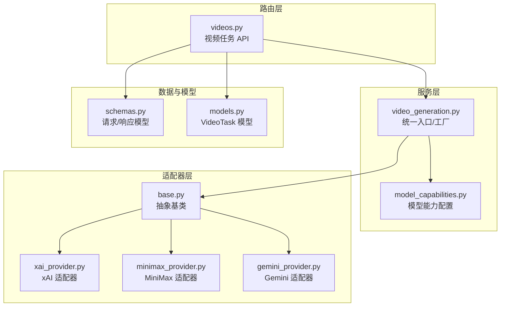
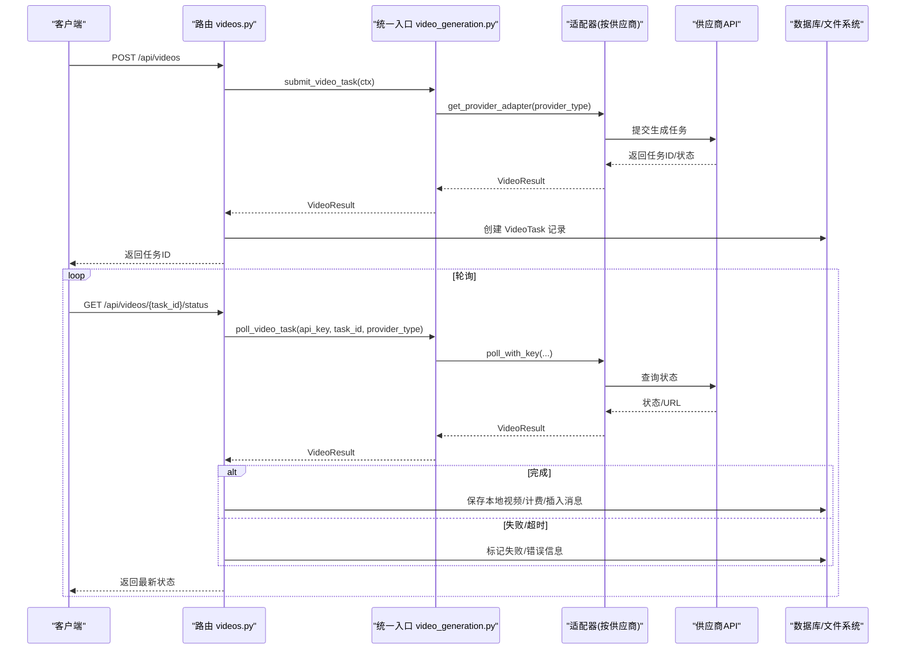
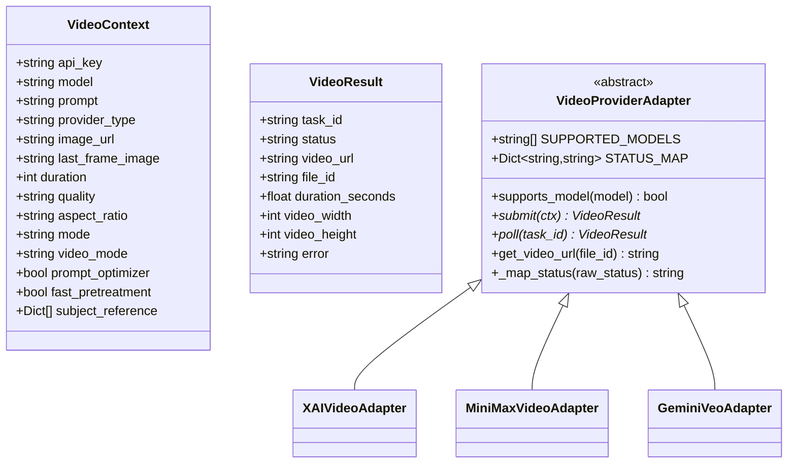
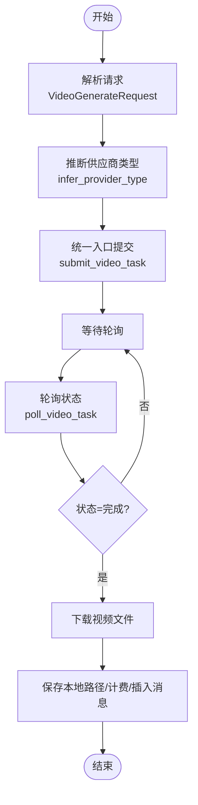
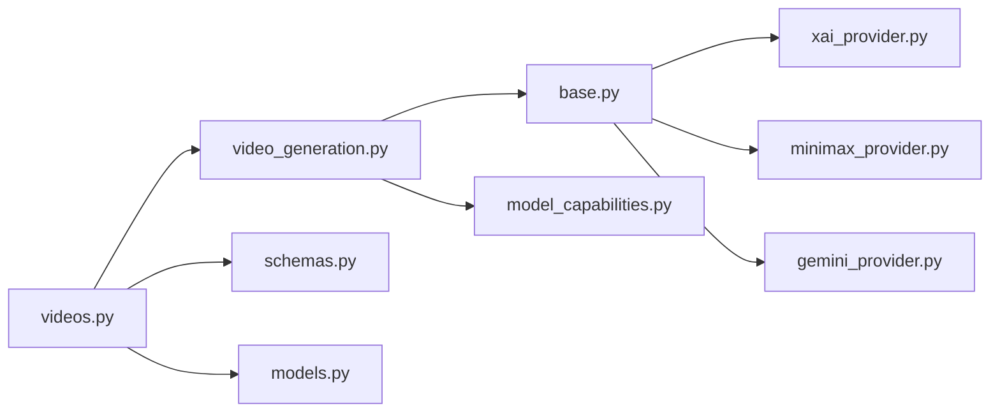
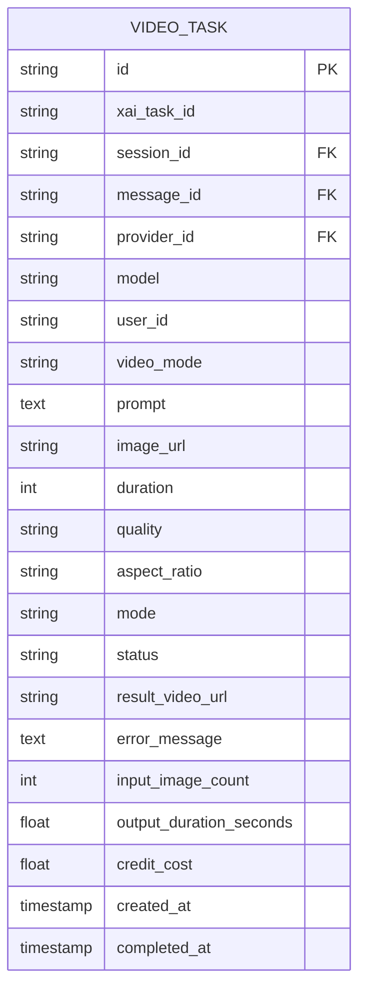

# 视频生成功能

<cite>
**本文引用的文件**
- [video_generation.py](file://backend/services/video_generation.py)
- [base.py](file://backend/services/video_providers/base.py)
- [gemini_provider.py](file://backend/services/video_providers/gemini_provider.py)
- [minimax_provider.py](file://backend/services/video_providers/minimax_provider.py)
- [xai_provider.py](file://backend/services/video_providers/xai_provider.py)
- [videos.py](file://backend/routers/videos.py)
- [model_capabilities.py](file://backend/services/video_providers/model_capabilities.py)
- [schemas.py](file://backend/schemas.py)
- [models.py](file://backend/models.py)
</cite>

## 目录
1. [简介](#简介)
2. [项目结构](#项目结构)
3. [核心组件](#核心组件)
4. [架构总览](#架构总览)
5. [组件详解](#组件详解)
6. [依赖关系分析](#依赖关系分析)
7. [性能考量](#性能考量)
8. [故障排查指南](#故障排查指南)
9. [结论](#结论)
10. [附录](#附录)

## 简介
本文件系统性梳理视频生成功能的整体架构与实现细节，涵盖任务调度、状态管理、结果聚合、供应商适配器设计模式、视频生成流程、API 使用指南、文件管理策略以及故障转移与降级机制。目标读者既包括需要快速上手的开发者，也包括希望理解系统设计的非技术读者。

## 项目结构
视频生成功能主要由三层组成：
- 路由层：对外暴露 REST API，负责请求校验、鉴权、计费与结果落库。
- 服务层：统一的视频生成服务与供应商适配器，屏蔽不同供应商差异。
- 适配器层：对 xAI、MiniMax、Gemini 三大供应商的适配实现，遵循统一抽象接口。

图表来源
- [videos.py:1-343](file://backend/routers/videos.py#L1-L343)
- [video_generation.py:1-160](file://backend/services/video_generation.py#L1-L160)
- [base.py:1-114](file://backend/services/video_providers/base.py#L1-L114)
- [xai_provider.py:1-164](file://backend/services/video_providers/xai_provider.py#L1-L164)
- [minimax_provider.py:1-318](file://backend/services/video_providers/minimax_provider.py#L1-L318)
- [gemini_provider.py:1-276](file://backend/services/video_providers/gemini_provider.py#L1-L276)
- [model_capabilities.py:1-223](file://backend/services/video_providers/model_capabilities.py#L1-L223)
- [schemas.py:631-699](file://backend/schemas.py#L631-L699)
- [models.py:390-447](file://backend/models.py#L390-L447)

章节来源
- [videos.py:1-343](file://backend/routers/videos.py#L1-L343)
- [video_generation.py:1-160](file://backend/services/video_generation.py#L1-L160)

## 核心组件
- 统一入口与工厂：提供任务提交与轮询的统一入口，并按供应商类型自动选择适配器。
- 抽象适配器：定义 VideoProviderAdapter 抽象类，统一 submit/poll/get_video_url 等接口。
- 供应商适配器：分别实现 xAI、MiniMax、Gemini 的适配逻辑。
- 路由与业务：负责鉴权、计费、状态轮询、结果落库与本地文件管理。
- 模型能力配置：提供各模型支持的模式、分辨率、时长、特性等配置。
- 数据模型与序列化：定义 VideoTask 模型与 API 响应模型。

章节来源
- [video_generation.py:44-76](file://backend/services/video_generation.py#L44-L76)
- [base.py:49-114](file://backend/services/video_providers/base.py#L49-L114)
- [videos.py:74-147](file://backend/routers/videos.py#L74-L147)
- [model_capabilities.py:22-223](file://backend/services/video_providers/model_capabilities.py#L22-L223)
- [schemas.py:631-699](file://backend/schemas.py#L631-L699)
- [models.py:390-447](file://backend/models.py#L390-L447)

## 架构总览
视频生成采用“统一入口 + 适配器模式”的架构，路由层接收请求后，通过统一入口将请求分发给对应适配器；适配器负责与第三方供应商交互；完成后由路由层进行计费、落库与本地文件保存。

图表来源
- [videos.py:74-233](file://backend/routers/videos.py#L74-L233)
- [video_generation.py:84-124](file://backend/services/video_generation.py#L84-L124)
- [xai_provider.py:113-164](file://backend/services/video_providers/xai_provider.py#L113-L164)
- [minimax_provider.py:243-287](file://backend/services/video_providers/minimax_provider.py#L243-L287)
- [gemini_provider.py:178-223](file://backend/services/video_providers/gemini_provider.py#L178-L223)

## 组件详解

### 统一入口与工厂
- 提供 submit_video_task 与 poll_video_task 两个统一入口，内部通过注册表按 provider_type 选择适配器。
- infer_provider_type 可根据模型名自动推断供应商类型，便于兼容历史调用。
- 对 MiniMax 的轮询结果补充 video_url，确保对外返回一致的 VideoResult。

章节来源
- [video_generation.py:44-76](file://backend/services/video_generation.py#L44-L76)
- [video_generation.py:84-124](file://backend/services/video_generation.py#L84-L124)
- [video_generation.py:129-160](file://backend/services/video_generation.py#L129-L160)

### 抽象适配器与数据模型
- VideoContext：封装统一的请求上下文，包含 API Key、模型、提示词、图片、时长、分辨率、宽高比、视频模式等。
- VideoResult：封装统一的返回结果，包含任务ID、状态、视频URL、文件ID、时长、尺寸、错误信息等。
- VideoProviderAdapter：定义 submit/poll/get_video_url 等抽象方法，子类需实现模型支持列表与状态映射。

图表来源
- [base.py:15-114](file://backend/services/video_providers/base.py#L15-L114)
- [xai_provider.py:22-46](file://backend/services/video_providers/xai_provider.py#L22-L46)
- [minimax_provider.py:30-90](file://backend/services/video_providers/minimax_provider.py#L30-L90)
- [gemini_provider.py:31-80](file://backend/services/video_providers/gemini_provider.py#L31-L80)

章节来源
- [base.py:15-114](file://backend/services/video_providers/base.py#L15-L114)

### 供应商适配器实现

#### xAI 适配器
- 支持 grok-imagine-video 模型，模式包括 text_to_video、image_to_video、edit。
- 提交与轮询均需携带 API Key；轮询时进行内容审核检查，拒绝则标记失败。
- 时长范围 1-15 秒，分辨率 480p/720p，支持首帧图片。

章节来源
- [xai_provider.py:22-164](file://backend/services/video_providers/xai_provider.py#L22-L164)

#### MiniMax 适配器
- 支持多种模型（Hailuo、T2V-01、I2V-01、S2V-01），区分 T2V/I2V/S2V 能力。
- 提交前进行模型能力校验，I2V 模型必须提供首帧图片；S2V 模型需提供主题参考。
- 轮询完成后需额外调用 get_video_url 获取下载地址，文件有效期约 1 小时。

章节来源
- [minimax_provider.py:30-318](file://backend/services/video_providers/minimax_provider.py#L30-L318)

#### Gemini 适配器
- 支持 veo-3.1-generate-preview、veo-3.1-fast-generate-preview、veo-2.0-generate-001 等模型。
- 通过 Long Running Operation 方式提交，轮询通过 operation_name 获取状态。
- 完成后返回 video_uri，可通过 API Key 下载视频文件。

章节来源
- [gemini_provider.py:31-276](file://backend/services/video_providers/gemini_provider.py#L31-L276)

### 视频生成流程（从提示词到文件）
- 请求进入路由层，解析 VideoGenerateRequest 并合并配置。
- 推断供应商类型（优先使用提供者配置，其次根据模型名推断）。
- 统一入口提交任务，得到任务ID。
- 轮询阶段：根据 provider_type 选择适配器轮询，处理状态映射与错误。
- 完成后下载视频至本地，计算时长与计费，插入聊天消息，更新任务状态。

图表来源
- [videos.py:95-147](file://backend/routers/videos.py#L95-L147)
- [videos.py:149-233](file://backend/routers/videos.py#L149-L233)
- [video_generation.py:84-124](file://backend/services/video_generation.py#L84-L124)

章节来源
- [videos.py:74-233](file://backend/routers/videos.py#L74-L233)

### 视频任务状态跟踪机制
- 终态：completed、failed；中间态：pending、processing。
- 路由层对终态直接返回缓存结果，避免重复轮询。
- 超时保护：若 pending 且存在错误且超过 5 分钟，判定失败。
- 成功后写入本地路径、输出时长、完成时间、计费金额等。

章节来源
- [videos.py:163-187](file://backend/routers/videos.py#L163-L187)
- [videos.py:188-225](file://backend/routers/videos.py#L188-L225)

### 视频生成 API 使用指南
- 路由：/api/videos
- 提交任务
  - 方法：POST
  - 请求体：VideoGenerateRequest
  - 响应体：VideoTaskResponse
- 查询状态
  - 方法：GET /api/videos/{task_id}/status
  - 响应体：VideoTaskResponse
- 列表查询
  - 方法：GET /api/videos
  - 查询参数：page/page_size/status/video_mode/provider_id
  - 响应体：VideoTaskListResponse
- 模型能力查询
  - 方法：GET /api/videos/model-capabilities/{model_name}
  - 响应体：VideoModelCapabilities
- 删除任务
  - 方法：DELETE /api/videos/{task_id}
  - 仅允许删除已完成或失败的任务

请求参数与配置项
- VideoGenerateRequest
  - provider_id：供应商提供者 ID
  - model：模型名称
  - session_id：可选，关联聊天会话
  - video_mode：text_to_video / image_to_video / edit
  - prompt：提示词
  - image_url：首帧图片（image_to_video/edit）
  - last_frame_image：尾帧图片（MiniMax-Hailuo-02 支持）
  - config：VideoConfig
- VideoConfig
  - duration：1-15 秒
  - quality：480p / 720p / 768p / 1080p
  - aspect_ratio：16:9 / 9:16 / 1:1
  - prompt_optimizer：MiniMax 提示词优化开关
  - fast_pretreatment：MiniMax 快速预处理开关

响应格式
- VideoTaskResponse：包含任务 ID、状态、视频 URL、计费金额、错误信息、创建/完成时间等。
- VideoTaskListResponse：分页列表，包含 items、total、page、page_size。

章节来源
- [videos.py:26-72](file://backend/routers/videos.py#L26-L72)
- [videos.py:74-147](file://backend/routers/videos.py#L74-L147)
- [videos.py:149-233](file://backend/routers/videos.py#L149-L233)
- [videos.py:251-259](file://backend/routers/videos.py#L251-L259)
- [schemas.py:642-699](file://backend/schemas.py#L642-L699)

### 视频文件管理策略
- 本地存储：完成时通过工具函数将远端 URL 下载到本地 MEDIA_DIR，返回相对路径 /api/media/{uuid}.mp4。
- 清理机制：删除任务时，仅允许终态任务，同时尝试删除本地文件；并删除关联的聊天消息。
- 下载头：Gemini 需要 API Key 头下载视频。

章节来源
- [videos.py:196-200](file://backend/routers/videos.py#L196-L200)
- [videos.py:272-297](file://backend/routers/videos.py#L272-L297)

### 不同供应商特性与限制
- xAI
  - 模型：grok-imagine-video
  - 支持：text_to_video、image_to_video、edit
  - 时长：1-15 秒
  - 分辨率：480p / 720p
  - 图片：支持首帧图片
- MiniMax
  - 模型：Hailuo、T2V-01、I2V-01、S2V-01 等
  - 能力：T2V/I2V/S2V；部分模型支持首尾帧；支持提示词优化与快速预处理
  - 时长：6/10 秒（受模型与分辨率影响）
  - 额外步骤：完成轮询后需调用 get_video_url 获取下载地址
- Gemini
  - 模型：veo-3.1-generate-preview/fast、veo-2.0-generate-001
  - 能力：支持首尾帧、参考图片、视频扩展（部分模型）；Veo 3+ 支持原生音频
  - 时长：4/6/8 秒
  - 分辨率：720p / 1080p / 4k
  - 额外步骤：完成轮询后返回 video_uri，需 API Key 下载

章节来源
- [model_capabilities.py:22-223](file://backend/services/video_providers/model_capabilities.py#L22-L223)
- [xai_provider.py:25-46](file://backend/services/video_providers/xai_provider.py#L25-L46)
- [minimax_provider.py:33-90](file://backend/services/video_providers/minimax_provider.py#L33-L90)
- [gemini_provider.py:34-80](file://backend/services/video_providers/gemini_provider.py#L34-L80)

### 故障转移与降级处理
- 供应商类型推断：优先使用提供者配置，其次根据模型名推断，降低误判风险。
- 轮询超时保护：pending 且带错误超过 5 分钟，判定失败，避免无限轮询。
- 内容审核：xAI 完成后检查 moderation，拒绝则失败。
- 错误透传：适配器层捕获异常并设置 error 字段，路由层统一处理。

章节来源
- [video_generation.py:129-160](file://backend/services/video_generation.py#L129-L160)
- [videos.py:179-187](file://backend/routers/videos.py#L179-L187)
- [xai_provider.py:142-146](file://backend/services/video_providers/xai_provider.py#L142-L146)

## 依赖关系分析
- 路由层依赖统一入口与适配器层，同时依赖数据库模型与序列化模型。
- 统一入口依赖适配器注册表与适配器抽象类。
- 适配器层彼此独立，共享抽象接口，便于扩展新供应商。
- 模型能力配置为只读配置，被路由层与适配器层共同使用。

图表来源
- [videos.py:1-343](file://backend/routers/videos.py#L1-L343)
- [video_generation.py:1-160](file://backend/services/video_generation.py#L1-L160)
- [base.py:1-114](file://backend/services/video_providers/base.py#L1-L114)
- [xai_provider.py:1-164](file://backend/services/video_providers/xai_provider.py#L1-L164)
- [minimax_provider.py:1-318](file://backend/services/video_providers/minimax_provider.py#L1-L318)
- [gemini_provider.py:1-276](file://backend/services/video_providers/gemini_provider.py#L1-L276)
- [model_capabilities.py:1-223](file://backend/services/video_providers/model_capabilities.py#L1-L223)
- [schemas.py:631-699](file://backend/schemas.py#L631-L699)
- [models.py:390-447](file://backend/models.py#L390-L447)

章节来源
- [videos.py:1-343](file://backend/routers/videos.py#L1-L343)
- [video_generation.py:1-160](file://backend/services/video_generation.py#L1-L160)

## 性能考量
- 异步 HTTP 客户端：适配器层普遍使用 httpx.AsyncClient，提升并发与吞吐。
- 轮询频率与超时：路由层对轮询设置合理超时与重试策略，避免阻塞。
- 终态缓存：对已完成/失败任务直接返回，减少不必要的轮询。
- 本地下载：完成即下载，避免长时间持有远端资源。

## 故障排查指南
- 提交失败：检查 VideoContext 字段与供应商 API Key；查看适配器日志与错误信息。
- 轮询异常：确认 provider_type 与模型匹配；检查网络连通性与供应商限流。
- 内容审核拒绝：xAI 完成但 moderation 失败，需调整提示词或参数。
- MiniMax 缺少图片：I2V 模型必须提供首帧图片，否则直接失败。
- 文件清理：删除任务时确认本地文件是否存在，避免残留。

章节来源
- [xai_provider.py:142-146](file://backend/services/video_providers/xai_provider.py#L142-L146)
- [minimax_provider.py:95-107](file://backend/services/video_providers/minimax_provider.py#L95-L107)
- [videos.py:272-297](file://backend/routers/videos.py#L272-L297)

## 结论
该视频生成功能以统一入口与适配器模式为核心，实现了对 xAI、MiniMax、Gemini 三大供应商的统一接入与差异化处理。通过完善的任务状态跟踪、计费与本地文件管理，以及清晰的 API 设计与错误处理机制，能够稳定支撑多场景的视频生成需求。建议后续持续完善模型能力配置与供应商扩展点，增强可观测性与可维护性。

## 附录

### 数据模型概览

图表来源
- [models.py:390-447](file://backend/models.py#L390-L447)