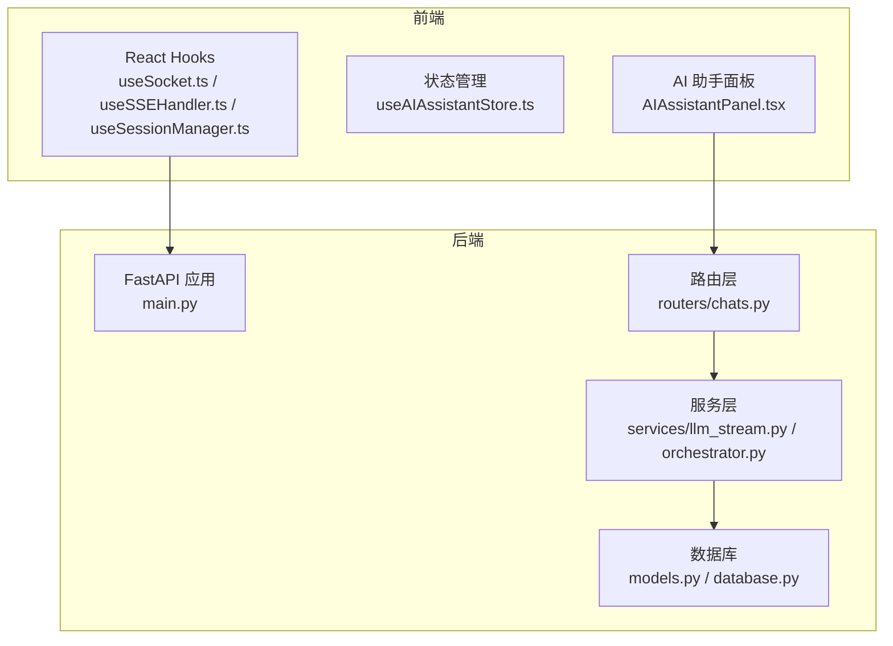
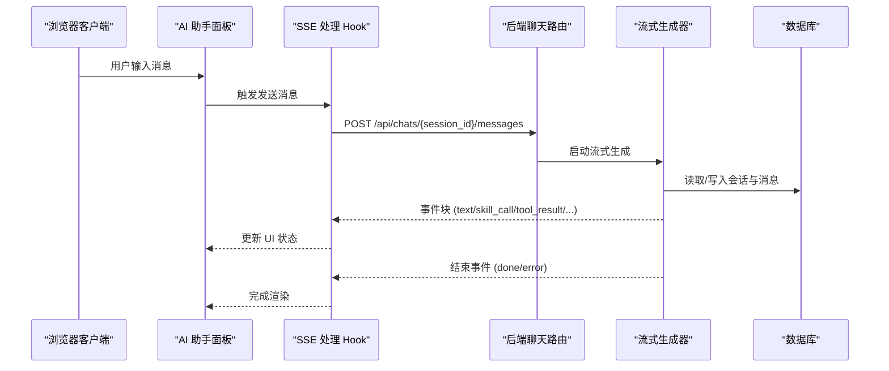
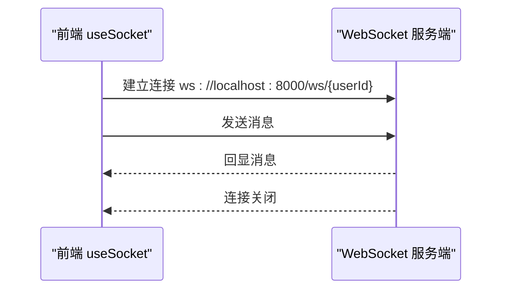
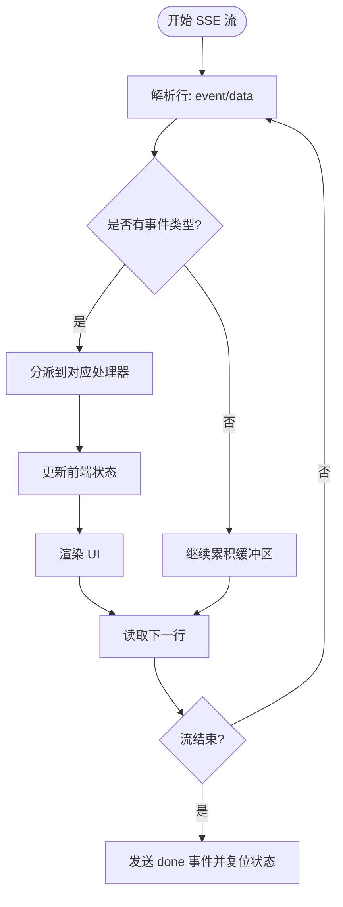
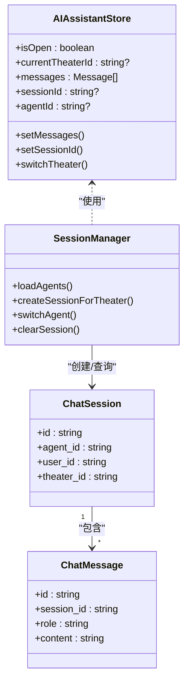
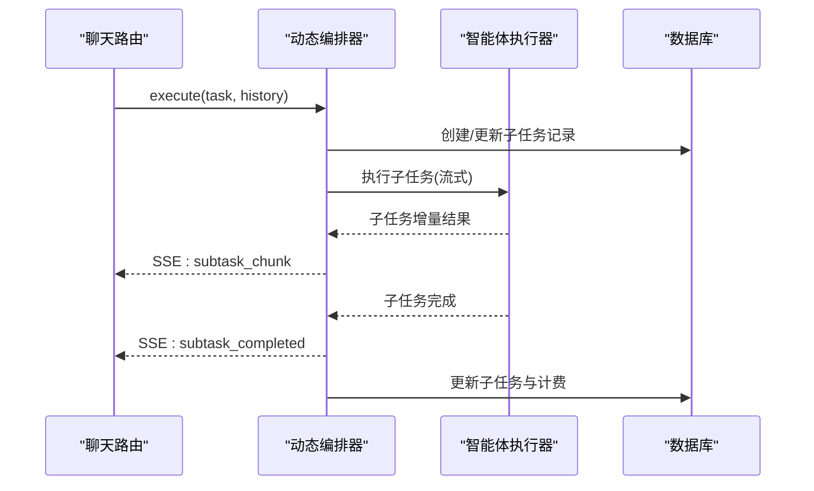
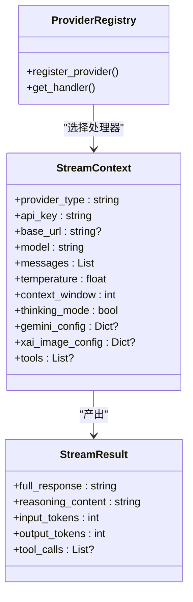
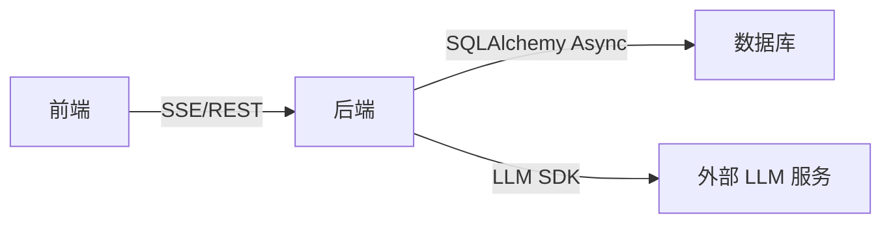

# 实时通信系统

<cite>
**本文档引用的文件**
- [main.py](file://backend/main.py)
- [chats.py](file://backend/routers/chats.py)
- [useSocket.ts](file://frontend/src/hooks/useSocket.ts)
- [useSSEHandler.ts](file://frontend/src/components/ai-assistant/hooks/useSSEHandler.ts)
- [useSessionManager.ts](file://frontend/src/components/ai-assistant/hooks/SessionManager.ts)
- [llm_stream.py](file://backend/services/llm_stream.py)
- [orchestrator.py](file://backend/services/orchestrator.py)
- [models.py](file://backend/models.py)
- [database.py](file://backend/database.py)
- [AIAssistantPanel.tsx](file://frontend/src/components/canvas/AIAssistantPanel.tsx)
- [useAIAssistantStore.ts](file://frontend/src/store/useAIAssistantStore.ts)
</cite>

## 目录
1. [简介](#简介)
2. [项目结构](#项目结构)
3. [核心组件](#核心组件)
4. [架构总览](#架构总览)
5. [详细组件分析](#详细组件分析)
6. [依赖关系分析](#依赖关系分析)
7. [性能考虑](#性能考虑)
8. [故障排查指南](#故障排查指南)
9. [结论](#结论)
10. [附录](#附录)

## 简介
本文件面向实时通信系统的架构与实现，重点覆盖以下方面：
- WebSocket 架构设计：连接管理、消息路由、会话管理与错误处理
- 实时协作功能：并发控制、状态同步与冲突解决策略
- SSE（Server-Sent Events）使用场景：流式响应与实时预览
- 性能优化：连接池管理、消息队列与负载均衡
- 错误处理与重连机制：在网络不稳定时保障用户体验
- 安全考虑：消息加密、访问控制与防滥用机制
- 调试工具与监控指标：辅助开发者诊断与优化实时功能

## 项目结构
系统采用前后端分离架构，后端基于 FastAPI 提供 REST API 与 SSE 流式接口，前端使用 React Hooks 管理会话与 SSE 事件处理。

**图表来源**
- [main.py](file://backend/main.py)
- [chats.py](file://backend/routers/chats.py)
- [useSocket.ts](file://frontend/src/hooks/useSocket.ts)
- [useSSEHandler.ts](file://frontend/src/components/ai-assistant/hooks/useSSEHandler.ts)
- [useSessionManager.ts](file://frontend/src/components/ai-assistant/hooks/SessionManager.ts)
- [llm_stream.py](file://backend/services/llm_stream.py)
- [orchestrator.py](file://backend/services/orchestrator.py)
- [models.py](file://backend/models.py)
- [database.py](file://backend/database.py)

**章节来源**
- [main.py](file://backend/main.py)
- [chats.py](file://backend/routers/chats.py)

## 核心组件
- WebSocket 端点：提供基础双向通信能力，用于演示与测试
- SSE 流式接口：提供多模态、多智能体协作的实时流式响应
- 会话管理：前端状态管理与后端数据库会话持久化
- 并发控制与协作编排：多智能体任务分解与执行
- 连接池与数据库事务：高并发下的稳定性保障

**章节来源**
- [main.py](file://backend/main.py)
- [chats.py](file://backend/routers/chats.py)
- [useSSEHandler.ts](file://frontend/src/components/ai-assistant/hooks/useSSEHandler.ts)
- [useSessionManager.ts](file://frontend/src/components/ai-assistant/hooks/SessionManager.ts)

## 架构总览
系统通过 SSE 实现“服务器推送、客户端拉取”的实时通信，结合前端状态管理与后端数据库，形成完整的实时协作闭环。

**图表来源**
- [AIAssistantPanel.tsx](file://frontend/src/components/canvas/AIAssistantPanel.tsx)
- [useSSEHandler.ts](file://frontend/src/components/ai-assistant/hooks/useSSEHandler.ts)
- [chats.py](file://backend/routers/chats.py)

## 详细组件分析

### WebSocket 组件分析
- 连接建立：前端通过 WebSocket 连接到后端 `/ws/{user_id}`，后端接受连接并进入循环等待消息
- 消息处理：接收文本消息并回显，异常捕获与连接关闭
- 适用场景：演示与测试，生产环境建议使用 SSE 以获得更好的流式控制与浏览器兼容性

**图表来源**
- [useSocket.ts](file://frontend/src/hooks/useSocket.ts)
- [main.py](file://backend/main.py)

**章节来源**
- [main.py](file://backend/main.py)
- [useSocket.ts](file://frontend/src/hooks/useSocket.ts)

### SSE 流式组件分析
- 事件格式：后端使用标准 SSE 格式（event/data），前端逐行解析
- 事件类型：
  - 文本流：text（增量文本）
  - 技能调用：skill_call/skill_loaded（加载技能）
  - 工具调用：tool_call/tool_result（执行工具）
  - 多智能体：subtask_created/started/completed/failed（子任务生命周期）
  - 结束与错误：done/error
  - 计费：billing（积分余额与状态）
  - 画布更新：canvas_updated（画布节点变更）
- 前端处理：useSSEHandler 负责解析与状态更新，AIAssistantPanel 负责读取流并渲染

**图表来源**
- [useSSEHandler.ts](file://frontend/src/components/ai-assistant/hooks/useSSEHandler.ts)
- [AIAssistantPanel.tsx](file://frontend/src/components/canvas/AIAssistantPanel.tsx)

**章节来源**
- [chats.py](file://backend/routers/chats.py)
- [useSSEHandler.ts](file://frontend/src/components/ai-assistant/hooks/useSSEHandler.ts)
- [AIAssistantPanel.tsx](file://frontend/src/components/canvas/AIAssistantPanel.tsx)

### 会话管理组件分析
- 前端状态：useAIAssistantStore 管理消息、会话、代理切换、面板尺寸等
- 会话初始化：useSessionManager 负责创建/加载会话、切换剧场、清空消息
- 后端会话：ChatSession/ChatMessage 模型持久化消息历史

**图表来源**
- [useAIAssistantStore.ts](file://frontend/src/store/useAIAssistantStore.ts)
- [useSessionManager.ts](file://frontend/src/components/ai-assistant/hooks/SessionManager.ts)
- [models.py](file://backend/models.py)

**章节来源**
- [useAIAssistantStore.ts](file://frontend/src/store/useAIAssistantStore.ts)
- [useSessionManager.ts](file://frontend/src/components/ai-assistant/hooks/SessionManager.ts)
- [models.py](file://backend/models.py)

### 多智能体协作组件分析
- 任务分解：Leader 智能体根据输入进行任务拆解，生成子任务
- 执行策略：流水线/计划/讨论等策略通过注册表模式实现
- 流式反馈：子任务执行过程通过 SSE 事件实时反馈进度
- 计费与审计：子任务完成后计算积分消耗并持久化

**图表来源**
- [orchestrator.py](file://backend/services/orchestrator.py)
- [chats.py](file://backend/routers/chats.py)

**章节来源**
- [orchestrator.py](file://backend/services/orchestrator.py)
- [chats.py](file://backend/routers/chats.py)

### LLM 流式生成组件分析
- 供应商注册表：OpenAI、xAI、Azure、Anthropic、DashScope、Gemini 等
- 统一上下文：StreamContext 封装模型、消息、工具、配置等
- 工具调用：收集工具调用并在流中分发事件
- 多模态：Gemini 支持文本/图片；xAI 支持图像生成/编辑

**图表来源**
- [llm_stream.py](file://backend/services/llm_stream.py)

**章节来源**
- [llm_stream.py](file://backend/services/llm_stream.py)

## 依赖关系分析
- 前端依赖：React Hooks、Zustand 状态管理、浏览器 SSE API
- 后端依赖：FastAPI、SQLAlchemy Async、第三方 LLM SDK
- 数据库：AsyncSession 连接池、事务隔离与行级权限控制

**图表来源**
- [useSSEHandler.ts](file://frontend/src/components/ai-assistant/hooks/useSSEHandler.ts)
- [chats.py](file://backend/routers/chats.py)
- [database.py](file://backend/database.py)

**章节来源**
- [database.py](file://backend/database.py)
- [chats.py](file://backend/routers/chats.py)

## 性能考虑
- 连接池管理
  - 数据库连接池：pool_size=10，max_overflow=20，pool_pre_ping=true，提升并发与稳定性
  - 建议：根据 QPS 与峰值内存调整 pool_size 与 max_overflow
- 消息队列
  - SSE 事件按块推送，前端逐块渲染，降低单次渲染压力
  - 建议：对高频事件（如 subtask_chunk）做节流或批量合并
- 负载均衡
  - 前端通过多代理切换与会话复用减少后端压力
  - 建议：后端增加限流与熔断，避免雪崩
- 缓存与去重
  - 媒体资源使用内容哈希去重，减少存储与传输
- 并发控制
  - 多智能体子任务并发执行，使用数据库事务保证一致性
  - 建议：对共享资源加锁或使用乐观锁

**章节来源**
- [database.py](file://backend/database.py)
- [chats.py](file://backend/routers/chats.py)
- [models.py](file://backend/models.py)

## 故障排查指南
- WebSocket 连接问题
  - 检查后端是否正确接受连接与异常捕获
  - 前端确认 ws 地址与 user_id
- SSE 流中断
  - 查看浏览器 Network 面板 SSE 请求与事件流
  - 后端日志定位异常事件（error）与结束事件（done）
- 会话丢失
  - 确认 useAIAssistantStore 是否持久化到 localStorage
  - 后端 ChatSession/ChatMessage 是否正确持久化
- 积分不足
  - SSE billing 事件中包含 insufficient/frozen 标记，前端显示友好提示
- 多智能体失败
  - 查看 subtask_failed 事件，定位具体子任务与错误信息

**章节来源**
- [useSocket.ts](file://frontend/src/hooks/useSocket.ts)
- [useSSEHandler.ts](file://frontend/src/components/ai-assistant/hooks/useSSEHandler.ts)
- [chats.py](file://backend/routers/chats.py)
- [useAIAssistantStore.ts](file://frontend/src/store/useAIAssistantStore.ts)

## 结论
本系统通过 SSE 实现高性能、低延迟的实时通信，结合前端状态管理与后端数据库，提供了完整的多智能体协作与流式预览能力。通过连接池、事件节流与并发控制等手段，系统在高并发场景下仍能保持稳定与可扩展性。建议后续引入更完善的重连机制、安全认证与监控告警体系，进一步提升用户体验与运维效率。

## 附录
- 调试工具
  - 浏览器 Network 面板查看 SSE 事件流
  - 后端日志：INFO 级别输出关键流程与错误
  - 前端 Zustand DevTools：追踪状态变化
- 监控指标（建议）
  - SSE 事件速率、平均延迟、错误率
  - 数据库连接池利用率、事务提交成功率
  - 多智能体子任务执行时延与失败率
- 安全建议
  - 传输层：HTTPS + WSS（WebSocket Secure）
  - 认证：JWT 令牌校验与角色权限控制
  - 防滥用：速率限制、IP 黑名单、请求体大小限制
  - 数据保护：敏感字段脱敏、最小权限原则