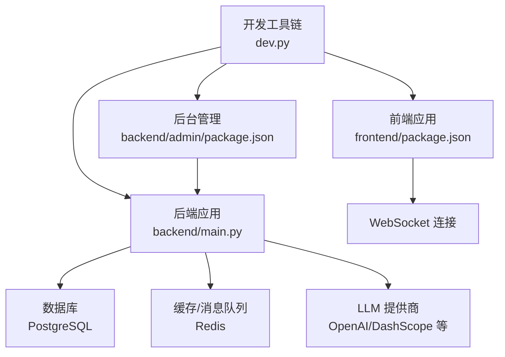
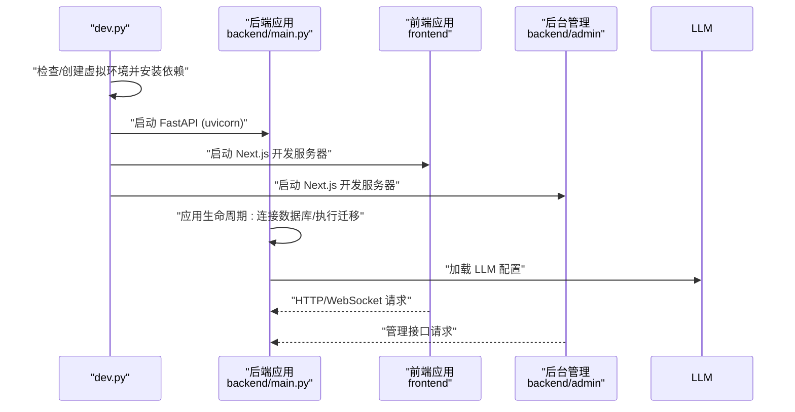
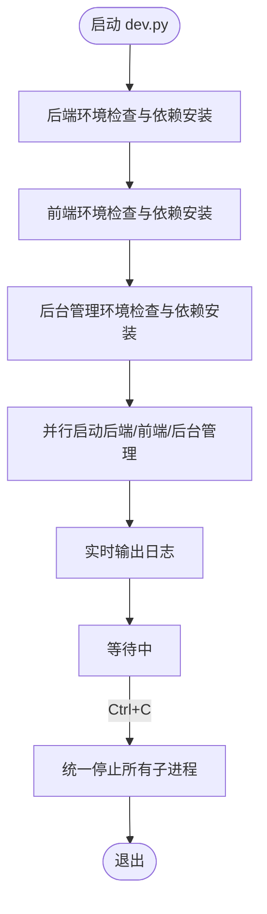
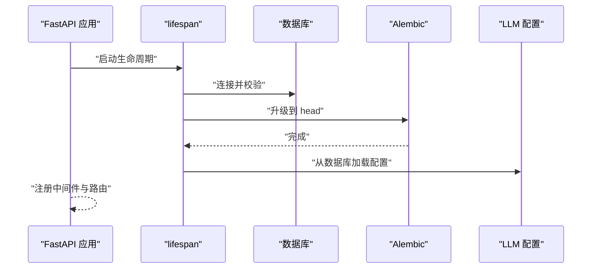
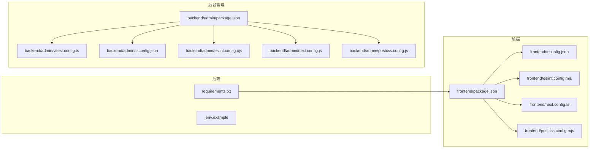

# 开发工具链

<cite>
**本文引用的文件**
- [dev.py](file://dev.py)
- [README.md](file://README.md)
- [backend/main.py](file://backend/main.py)
- [backend/requirements.txt](file://backend/requirements.txt)
- [backend/.env.example](file://backend/.env.example)
- [frontend/package.json](file://frontend/package.json)
- [frontend/tsconfig.json](file://frontend/tsconfig.json)
- [backend/admin/package.json](file://backend/admin/package.json)
- [backend/admin/vitest.config.ts](file://backend/admin/vitest.config.ts)
- [backend/admin/tsconfig.json](file://backend/admin/tsconfig.json)
- [backend/admin/eslint.config.cjs](file://backend/admin/eslint.config.cjs)
- [frontend/eslint.config.mjs](file://frontend/eslint.config.mjs)
- [backend/admin/next.config.js](file://backend/admin/next.config.js)
- [frontend/next.config.ts](file://frontend/next.config.ts)
- [backend/admin/postcss.config.js](file://backend/admin/postcss.config.js)
- [frontend/postcss.config.mjs](file://frontend/postcss.config.mjs)
</cite>

## 目录
1. [简介](#简介)
2. [项目结构](#项目结构)
3. [核心组件](#核心组件)
4. [架构总览](#架构总览)
5. [详细组件分析](#详细组件分析)
6. [依赖关系分析](#依赖关系分析)
7. [性能考虑](#性能考虑)
8. [故障排查指南](#故障排查指南)
9. [结论](#结论)
10. [附录](#附录)

## 简介
本指南面向开发工具链的使用者与维护者，围绕一键启动脚本 dev.py 的功能与使用方法展开，覆盖测试策略与测试框架配置、调试技巧、代码质量与静态分析、版本控制与分支管理、代码审查流程、开发环境与 IDE 设置、性能分析与并发调试、常见问题与团队协作实践，以及持续集成与自动化测试建议。文档同时给出与仓库实际文件对应的架构图、序列图与流程图，帮助读者快速理解并高效使用该工具链。

## 项目结构
项目采用前后端分离与多子系统的组织方式：
- 顶层入口脚本 dev.py 负责统一初始化与并行启动后端、前端与后台管理子系统。
- 后端 backend：Python/FastAPI 应用，包含路由、服务、模型与数据库迁移工具。
- 前端 frontend：Next.js 16 应用，负责游戏客户端界面与交互。
- 后台管理 backend/admin：Next.js 16 应用，提供可视化管理界面。
- 文档 docs/wiki：包含架构、后端/前端开发指南、数据库迁移等文档。

图表来源
- [dev.py](file://dev.py#L91-L150)
- [backend/main.py](file://backend/main.py#L30-L103)
- [frontend/package.json](file://frontend/package.json#L1-L35)
- [backend/admin/package.json](file://backend/admin/package.json#L1-L72)

章节来源
- [README.md](file://README.md#L34-L51)
- [dev.py](file://dev.py#L1-L150)
- [backend/main.py](file://backend/main.py#L1-L173)

## 核心组件
- 一键启动脚本 dev.py
  - 功能：自动检测并创建/激活后端虚拟环境、安装依赖；安装前端与后台管理依赖；并行启动后端 FastAPI、前端 Next.js 与后台管理 Next.js；支持 Ctrl+C 统一停止所有子进程。
  - 关键点：跨平台兼容（Windows 使用 asyncio 循环与特定 Python 可执行路径）、实时输出、异常处理与优雅退出。
- 后端应用 backend/main.py
  - 功能：FastAPI 应用入口，注册路由、CORS 中间件、生命周期钩子（含数据库迁移与 LLM 配置加载）、WebSocket 接入点。
  - 关键点：Windows 下事件循环策略与 UTF-8 输出修复、SQLAlchemy 日志抑制、Alembic 升级头版本。
- 前端与后台管理
  - 前端与后台管理均基于 Next.js，分别通过各自的 package.json scripts 控制开发与构建；TypeScript 配置与 ESLint 配置分别位于各自根目录。

章节来源
- [dev.py](file://dev.py#L16-L150)
- [backend/main.py](file://backend/main.py#L1-L173)
- [frontend/package.json](file://frontend/package.json#L1-L35)
- [backend/admin/package.json](file://backend/admin/package.json#L1-L72)

## 架构总览
下图展示 dev.py 如何协调三个子系统，并与后端应用、数据库与外部 LLM 提供商交互：

图表来源
- [dev.py](file://dev.py#L91-L150)
- [backend/main.py](file://backend/main.py#L45-L103)

## 详细组件分析

### 一键启动脚本 dev.py
- 初始化阶段
  - 后端：检测 venv 是否存在，不存在则创建；安装 requirements.txt；选择 venv 中的 Python 可执行文件。
  - 前端与后台管理：检测 node_modules 是否存在，不存在则安装依赖。
- 并行启动阶段
  - 后端：使用 uvicorn 启动 FastAPI，指定主机、端口与 asyncio 循环以适配 Windows。
  - 前端与后台管理：分别执行 npm run dev。
  - 实时输出：通过子进程捕获 stdout/stderr 并逐行打印，便于观察各子系统日志。
- 信号处理
  - 捕获 Ctrl+C，按平台区分终止策略（Windows 使用 taskkill，其他平台使用 terminate），确保所有子进程被清理。

图表来源
- [dev.py](file://dev.py#L25-L150)

章节来源
- [dev.py](file://dev.py#L1-L150)

### 后端应用 backend/main.py
- 生命周期与数据库迁移
  - 使用 lifespan 钩子在启动时尝试连接数据库并执行 Alembic 升级到 head，失败时重试若干次。
  - 加载 LLM 配置（从数据库）。
- CORS 与路由
  - 注册 CORS 中间件，允许前端与后台管理访问。
  - 包含 llm_config、admin、agents、chats 等路由。
- WebSocket
  - 提供 /ws/{player_id} 接入点，用于实时推送与交互。

图表来源
- [backend/main.py](file://backend/main.py#L45-L103)

章节来源
- [backend/main.py](file://backend/main.py#L1-L173)

### 测试框架与配置
- 后台管理测试（Vitest）
  - 使用 Vitest 作为测试运行器，配合 @testing-library 与 happy-dom 等生态。
  - 配置文件位于 backend/admin/vitest.config.ts，TypeScript 配置位于 backend/admin/tsconfig.json。
- 前端测试（概念性建议）
  - 建议在 frontend 目录引入 Vitest 或 Jest 生态，结合 @testing-library/react 进行组件与集成测试。
- ESLint 静态分析
  - 前端与后台管理均提供 ESLint 配置文件，分别位于 frontend/eslint.config.mjs 与 backend/admin/eslint.config.cjs。
  - 建议在 CI 中执行 lint 与类型检查，保证代码风格一致与类型安全。

章节来源
- [backend/admin/vitest.config.ts](file://backend/admin/vitest.config.ts#L1-L173)
- [backend/admin/tsconfig.json](file://backend/admin/tsconfig.json#L1-L200)
- [frontend/package.json](file://frontend/package.json#L1-L35)
- [backend/admin/package.json](file://backend/admin/package.json#L1-L72)
- [frontend/eslint.config.mjs](file://frontend/eslint.config.mjs#L1-L200)
- [backend/admin/eslint.config.cjs](file://backend/admin/eslint.config.cjs#L1-L200)

### 代码质量与静态分析
- ESLint
  - 前端与后台管理分别使用 eslint.config.mjs 与 eslint.config.cjs，结合 @next/eslint-plugin-next 与 @typescript-eslint 规则集。
- TypeScript
  - 前端 tsconfig.json 启用严格模式与增量编译，路径别名 @/* 指向 src/*。
- 建议
  - 在本地与 CI 中统一执行 lint 与类型检查；对新增模块强制开启严格模式与必要的 ESLint 规则。

章节来源
- [frontend/tsconfig.json](file://frontend/tsconfig.json#L1-L35)
- [frontend/eslint.config.mjs](file://frontend/eslint.config.mjs#L1-L200)
- [backend/admin/eslint.config.cjs](file://backend/admin/eslint.config.cjs#L1-L200)

### 版本控制、分支管理与代码审查
- 分支策略建议
  - 主分支仅允许通过合并请求（Merge Request/Pull Request）合并，hotfix 与 release 分支从主分支切出，feature 从 develop 切出。
- 提交规范
  - 使用约定式提交（如 feat/fix/docs/chore 等前缀），并在 MR 描述中引用相关 Issue。
- 代码审查
  - 至少一名 reviewer 通过 CI 与本地验证后方可合并；对涉及数据库迁移与 LLM 配置变更的 MR，要求额外评审。
- CI 集成
  - 建议在 CI 中执行：安装依赖、类型检查、ESLint、单元测试（Vitest）、端到端测试（可选）与构建检查。

章节来源
- [README.md](file://README.md#L138-L141)

### 开发环境配置与 IDE 设置
- Python
  - 使用 backend/requirements.txt 安装依赖；建议在 IDE 中指向 venv 的 Python 解释器。
- Node.js
  - 前端与后台管理分别安装依赖；VS Code 可启用 ESLint 与 Prettier 扩展以提升开发体验。
- TypeScript
  - 前端 tsconfig.json 已配置严格模式与路径别名，建议在 IDE 中启用“使用项目设置”。
- PostCSS/Tailwind
  - 前端与后台管理均提供 postcss.config.*，确保样式工具链正常工作。

章节来源
- [backend/requirements.txt](file://backend/requirements.txt#L1-L20)
- [frontend/package.json](file://frontend/package.json#L1-L35)
- [backend/admin/package.json](file://backend/admin/package.json#L1-L72)
- [frontend/tsconfig.json](file://frontend/tsconfig.json#L1-L35)
- [frontend/postcss.config.mjs](file://frontend/postcss.config.mjs#L1-L200)
- [backend/admin/postcss.config.js](file://backend/admin/postcss.config.js#L1-L200)

### 性能分析、内存泄漏检测与并发调试
- 性能分析
  - 后端：使用 uvicorn 的 --log-level 与自定义日志级别控制输出；对关键路径（如数据库查询、LLM 调用）增加日志与耗时统计。
  - 前端：利用浏览器性能面板与 React DevTools Profiler 分析渲染与重渲染热点。
- 内存泄漏检测
  - 后端：定期检查数据库连接池与 Redis 连接数；对长时间运行的任务使用上下文管理器与超时控制。
  - 前端：使用 React DevTools Memory 面板与浏览器内存快照对比，定位未释放的引用。
- 并发调试
  - Windows 下已设置 asyncio 事件循环策略；WebSocket 与后台任务应避免阻塞主线程，必要时使用异步队列与限流。

章节来源
- [backend/main.py](file://backend/main.py#L6-L28)
- [backend/main.py](file://backend/main.py#L157-L169)

### 常见问题与团队协作实践
- 端口冲突
  - 前端默认 3000，后台管理默认 3001；若冲突可在对应 package.json scripts 中调整端口。
- 跨平台兼容
  - Windows 下使用 dev.py 的 asyncio 循环与 venv Python 路径；避免直接调用系统命令导致路径问题。
- 依赖安装失败
  - 后端依赖安装失败时检查 requirements.txt 与网络；前端依赖失败时检查 npm/yarn 缓存与代理。
- 团队协作
  - 统一代码风格与提交规范；MR 合并前确保 CI 通过与本地验证。

章节来源
- [dev.py](file://dev.py#L19-L23)
- [dev.py](file://dev.py#L56-L61)
- [backend/admin/package.json](file://backend/admin/package.json#L5-L9)

## 依赖关系分析
- 后端依赖
  - FastAPI、Uvicorn、SQLAlchemy、Pydantic、AgentScope、OpenAI、Alembic、PostgreSQL/asyncpg、Redis、WebSockets、dotenv、loguru 等。
- 前端与后台管理依赖
  - Next.js、React、Pixi.js、Ant Design、Axios、Socket.IO、SWR、TailwindCSS、ESLint、TypeScript、Vitest 等。
- 配置文件
  - 后端：requirements.txt、.env.example。
  - 前端：package.json、tsconfig.json、eslint.config.mjs、next.config.ts、postcss.config.mjs。
  - 后台管理：package.json、vitest.config.ts、tsconfig.json、eslint.config.cjs、next.config.js、postcss.config.js。

图表来源
- [backend/requirements.txt](file://backend/requirements.txt#L1-L20)
- [backend/.env.example](file://backend/.env.example#L1-L4)
- [frontend/package.json](file://frontend/package.json#L1-L35)
- [frontend/tsconfig.json](file://frontend/tsconfig.json#L1-L35)
- [frontend/eslint.config.mjs](file://frontend/eslint.config.mjs#L1-L200)
- [frontend/next.config.ts](file://frontend/next.config.ts#L1-L200)
- [frontend/postcss.config.mjs](file://frontend/postcss.config.mjs#L1-L200)
- [backend/admin/package.json](file://backend/admin/package.json#L1-L72)
- [backend/admin/vitest.config.ts](file://backend/admin/vitest.config.ts#L1-L173)
- [backend/admin/tsconfig.json](file://backend/admin/tsconfig.json#L1-L200)
- [backend/admin/eslint.config.cjs](file://backend/admin/eslint.config.cjs#L1-L200)
- [backend/admin/next.config.js](file://backend/admin/next.config.js#L1-L200)
- [backend/admin/postcss.config.js](file://backend/admin/postcss.config.js#L1-L200)

章节来源
- [backend/requirements.txt](file://backend/requirements.txt#L1-L20)
- [frontend/package.json](file://frontend/package.json#L1-L35)
- [backend/admin/package.json](file://backend/admin/package.json#L1-L72)

## 性能考虑
- 后端
  - 使用异步 ORM 与连接池，避免阻塞；对数据库与外部 LLM 调用增加超时与重试策略。
  - WebSocket 保持短连接与心跳，避免大包与频繁广播。
- 前端
  - 使用 React 18 的并发特性与 Suspense；对重型计算使用 Web Workers 或分片处理。
  - Tailwind 与 PostCSS 按需引入，减少打包体积。
- 构建与缓存
  - Next.js 开发模式下合理利用缓存；生产构建开启压缩与 Tree Shaking。

## 故障排查指南
- 后端无法启动或迁移失败
  - 检查 DATABASE_URL 与 .env 配置；确认 PostgreSQL 服务可用；查看 lifespan 中的重试日志。
- 前端或后台管理端口占用
  - 修改对应 package.json scripts 中的端口参数；或关闭占用端口的进程。
- Windows 下启动异常
  - 确认使用 dev.py 启动；检查 asyncio 循环策略与 UTF-8 输出修复是否生效。
- 测试失败
  - 确认 Vitest 配置正确；在 CI 中添加类型检查与 ESLint 步骤；对异步测试使用合适的等待与清理。

章节来源
- [backend/.env.example](file://backend/.env.example#L1-L4)
- [backend/main.py](file://backend/main.py#L45-L103)
- [dev.py](file://dev.py#L111-L117)
- [backend/admin/vitest.config.ts](file://backend/admin/vitest.config.ts#L1-L173)

## 结论
本指南提供了从一键启动到测试、质量保障、版本控制与性能优化的完整工具链使用路径。建议团队在本地与 CI 中统一执行依赖安装、类型检查、ESLint、单元测试与构建检查，确保交付质量与协作效率。

## 附录
- 快速开始
  - 使用 dev.py 启动后端、前端与后台管理；根据 README 的前置要求准备数据库与 Redis。
- 数据库迁移
  - 修改模型后使用 manage_db.py 生成并应用迁移；启动时自动执行 Alembic 升级。
- 文档与贡献
  - 详细文档位于 docs/wiki；欢迎提交 Issue 与 MR 改进项目。

章节来源
- [README.md](file://README.md#L53-L101)
- [backend/main.py](file://backend/main.py#L61-L64)