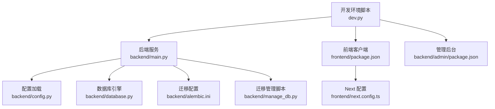
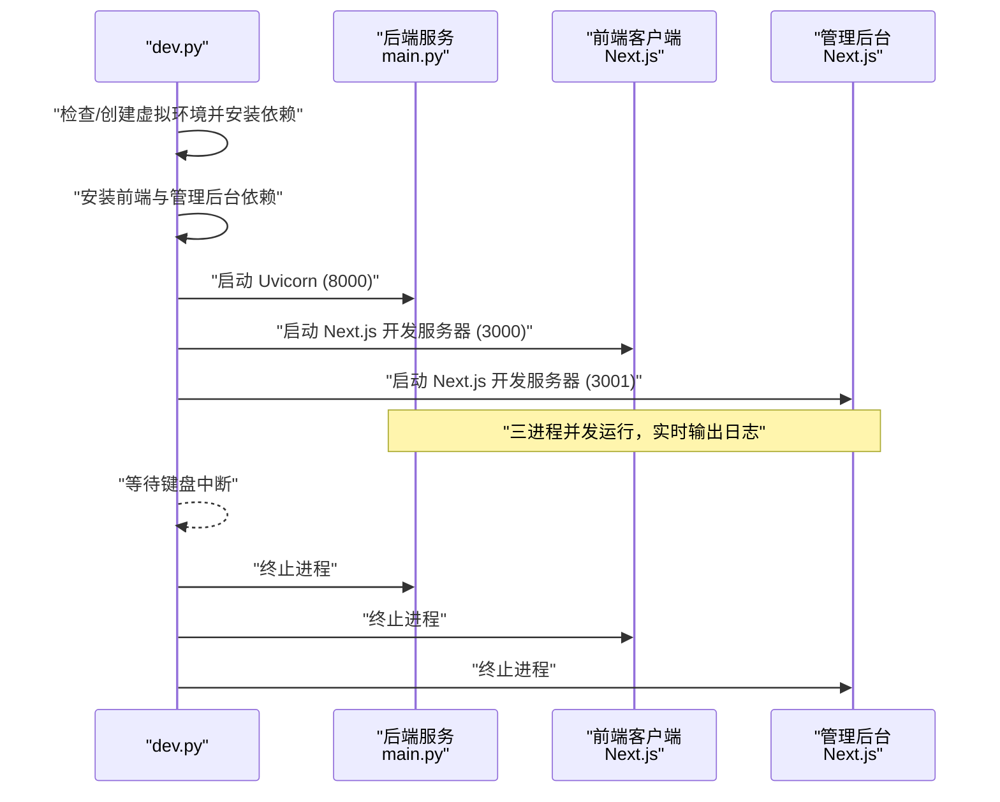
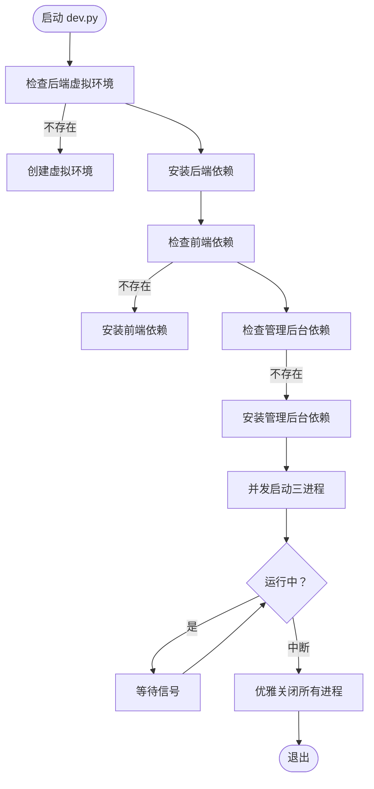
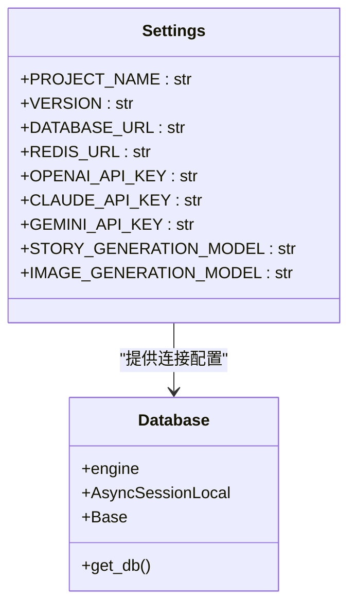
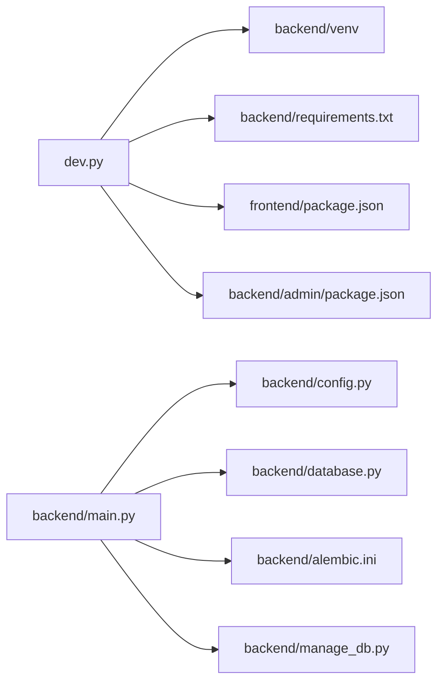

# 开发环境配置

<cite>
**本文引用的文件**
- [dev.py](file://dev.py)
- [.env.example](file://backend/.env.example)
- [requirements.txt](file://backend/requirements.txt)
- [package.json (前端)](file://frontend/package.json)
- [package.json (管理后台)](file://backend/admin/package.json)
- [main.py](file://backend/main.py)
- [config.py](file://backend/config.py)
- [database.py](file://backend/database.py)
- [alembic.ini](file://backend/alembic.ini)
- [manage_db.py](file://backend/manage_db.py)
- [README.md](file://README.md)
- [next.config.ts](file://frontend/next.config.ts)
</cite>

## 目录
1. [简介](#简介)
2. [项目结构](#项目结构)
3. [核心组件](#核心组件)
4. [架构总览](#架构总览)
5. [详细组件分析](#详细组件分析)
6. [依赖关系分析](#依赖关系分析)
7. [性能考虑](#性能考虑)
8. [故障排除指南](#故障排除指南)
9. [结论](#结论)
10. [附录](#附录)

## 简介
本指南面向开发环境的完整配置与一键启动流程，重点围绕 dev.py 脚本展开，涵盖：
- 虚拟环境创建与依赖安装
- 后端 Python 环境、前端 Node.js 环境与数据库连接配置
- 环境变量管理与配置文件模板
- 本地开发服务器启动流程与多进程并发启动机制
- 跨平台兼容性处理、进程管理与优雅关闭
- 常见问题排查与调试技巧

## 项目结构
项目采用前后端分离与独立管理的目录组织方式：
- backend：后端服务（FastAPI + SQLAlchemy 异步 ORM + Uvicorn）
- frontend：游戏客户端前端（Next.js）
- backend/admin：管理后台前端（Next.js，端口 3001）
- docs/wiki：开发文档与指南
- dev.py：一键启动脚本，负责环境准备与多进程并发启动

图表来源
- [dev.py](file://dev.py#L91-L150)
- [main.py](file://backend/main.py#L83-L173)
- [config.py](file://backend/config.py#L7-L34)
- [database.py](file://backend/database.py#L1-L31)
- [alembic.ini](file://backend/alembic.ini#L1-L115)
- [manage_db.py](file://backend/manage_db.py#L1-L67)
- [package.json (前端)](file://frontend/package.json#L1-L35)
- [package.json (管理后台)](file://backend/admin/package.json#L1-L72)
- [next.config.ts](file://frontend/next.config.ts#L1-L8)

章节来源
- [README.md](file://README.md#L34-L51)
- [dev.py](file://dev.py#L1-L150)

## 核心组件
- 一键启动脚本 dev.py
  - 虚拟环境检测与创建（后端）
  - 依赖安装（后端 requirements.txt；前端与管理后台 package.json）
  - 多进程并发启动（后端、前端、管理后台）
  - 跨平台兼容（Windows 事件循环策略、终端编码处理）
  - 优雅关闭（键盘中断时终止所有子进程）

- 后端配置与数据库
  - 环境变量加载（pydantic-settings + .env）
  - 数据库连接（SQLite 默认，PostgreSQL 可选）
  - 迁移管理（Alembic + manage_db.py）
  - FastAPI 应用生命周期（启动时迁移与 LLM 配置初始化）

- 前端与管理后台
  - Next.js 开发服务器（前端端口 3000；管理后台端口 3001）
  - 依赖安装与脚本命令（package.json）

章节来源
- [dev.py](file://dev.py#L19-L42)
- [dev.py](file://dev.py#L44-L62)
- [dev.py](file://dev.py#L63-L90)
- [dev.py](file://dev.py#L91-L150)
- [config.py](file://backend/config.py#L7-L34)
- [database.py](file://backend/database.py#L1-L31)
- [alembic.ini](file://backend/alembic.ini#L1-L115)
- [manage_db.py](file://backend/manage_db.py#L20-L38)
- [package.json (前端)](file://frontend/package.json#L5-L10)
- [package.json (管理后台)](file://backend/admin/package.json#L5-L10)

## 架构总览
dev.py 作为入口，协调三个子系统：
- 后端服务：FastAPI 应用，监听 8000 端口，使用异步事件循环
- 前端客户端：Next.js 开发服务器，监听 3000 端口
- 管理后台：Next.js 开发服务器，监听 3001 端口

图表来源
- [dev.py](file://dev.py#L91-L150)
- [main.py](file://backend/main.py#L171-L173)
- [package.json (前端)](file://frontend/package.json#L5-L10)
- [package.json (管理后台)](file://backend/admin/package.json#L5-L10)

## 详细组件分析

### 一键启动脚本 dev.py 工作原理
- 路径与常量
  - 定义 BASE_DIR、BACKEND_DIR、FRONTEND_DIR、ADMIN_DIR
- 日志与全局状态
  - 统一日志前缀与全局进程列表 PROCESSES
- Python 解释器选择
  - Windows 使用 venv/Scripts/python.exe；其他平台使用 venv/bin/python
- 后端环境准备
  - 检测 venv 是否存在，不存在则创建
  - pip 安装 requirements.txt
- 前端与管理后台准备
  - 检测 node_modules，不存在则执行 npm install
- 并发启动
  - 后端：uvicorn 主机 127.0.0.1，端口 8000，事件循环 asyncio
  - 前端：npm run dev（端口 3000）
  - 管理后台：npm run dev（端口 3001）
  - 线程池并发运行，守护线程，实时输出
- 优雅关闭
  - 捕获 KeyboardInterrupt
  - Windows 使用 taskkill /F /T /PID；类 Unix 使用 terminate
  - 逐个清理进程列表

图表来源
- [dev.py](file://dev.py#L19-L42)
- [dev.py](file://dev.py#L44-L62)
- [dev.py](file://dev.py#L91-L150)

章节来源
- [dev.py](file://dev.py#L1-L150)

### 后端 Python 环境配置
- 虚拟环境与依赖
  - 虚拟环境路径：backend/venv
  - 依赖清单：backend/requirements.txt
  - 安装命令：pip install -r requirements.txt
- 环境变量与配置
  - 配置类 Settings：从 .env 加载 DATABASE_URL、REDIS_URL、OPENAI_API_KEY 等
  - 默认数据库：SQLite（绝对路径），可覆盖为 PostgreSQL
- 数据库连接
  - 异步引擎：SQLAlchemy + asyncpg/aiosqlite
  - 连接池参数：pool_pre_ping、pool_size、max_overflow
  - SQLite 特殊参数：check_same_thread=False
- 应用生命周期与迁移
  - FastAPI lifespan：启动时重试数据库连接，执行 Alembic 升级到 head
  - LLM 配置初始化：从数据库加载

图表来源
- [config.py](file://backend/config.py#L7-L34)
- [database.py](file://backend/database.py#L1-L31)
- [main.py](file://backend/main.py#L45-L82)

章节来源
- [config.py](file://backend/config.py#L1-L34)
- [database.py](file://backend/database.py#L1-L31)
- [requirements.txt](file://backend/requirements.txt#L1-L20)
- [main.py](file://backend/main.py#L45-L82)

### 前端 Node.js 环境设置
- 依赖与脚本
  - 依赖清单：frontend/package.json
  - 开发脚本：npm run dev（端口 3000）
- Next.js 配置
  - 基础配置：frontend/next.config.ts（空配置占位）
- 管理后台
  - 依赖清单：backend/admin/package.json
  - 开发脚本：npm run dev（端口 3001）

章节来源
- [package.json (前端)](file://frontend/package.json#L1-L35)
- [package.json (管理后台)](file://backend/admin/package.json#L1-L72)
- [next.config.ts](file://frontend/next.config.ts#L1-L8)

### 数据库连接配置
- 连接字符串
  - 示例：backend/.env.example（包含 OPENAI_API_KEY、DATABASE_URL、REDIS_URL）
  - 默认 SQLite：绝对路径，避免工作目录差异
  - 可选 PostgreSQL：通过 .env 覆盖
- 迁移与管理
  - Alembic 配置：backend/alembic.ini
  - 迁移脚本位置：backend/migrations
  - 管理脚本：backend/manage_db.py（migrate/upgrade/downgrade）
- 启动时迁移
  - FastAPI lifespan 中调用 Alembic 升级 head

章节来源
- [.env.example](file://backend/.env.example#L1-L4)
- [config.py](file://backend/config.py#L11-L16)
- [alembic.ini](file://backend/alembic.ini#L1-L115)
- [manage_db.py](file://backend/manage_db.py#L20-L38)
- [main.py](file://backend/main.py#L59-L65)

### 环境变量管理与配置文件模板
- 模板文件
  - 后端示例：backend/.env.example
- 加载机制
  - pydantic-settings 从 .env 文件加载键值
  - Settings.Config.env_file 指定 .env 路径
- 常用键
  - OPENAI_API_KEY：用于 LLM 调用
  - DATABASE_URL：数据库连接串（默认 SQLite）
  - REDIS_URL：缓存与消息队列

章节来源
- [.env.example](file://backend/.env.example#L1-L4)
- [config.py](file://backend/config.py#L30-L32)

### 本地开发服务器启动流程
- 后端
  - Uvicorn 运行 main:app，主机 127.0.0.1，端口 8000，事件循环 asyncio
  - Windows 下设置事件循环策略以兼容 asyncpg
- 前端与管理后台
  - Next.js 开发服务器分别监听 3000 与 3001
- CORS 配置
  - 允许前端与管理后台访问后端 API

章节来源
- [dev.py](file://dev.py#L111-L117)
- [main.py](file://backend/main.py#L6-L11)
- [main.py](file://backend/main.py#L85-L91)

### 跨平台兼容性处理
- Python 解释器路径
  - Windows：venv/Scripts/python.exe
  - 类 Unix：venv/bin/python
- 终端编码
  - Windows：重定向 stdout/stderr 为 UTF-8
- 事件循环
  - Windows：设置 WindowsSelectorEventLoopPolicy
- 进程终止
  - Windows：taskkill /F /T /PID
  - 类 Unix：terminate

章节来源
- [dev.py](file://dev.py#L19-L23)
- [dev.py](file://dev.py#L140-L145)
- [main.py](file://backend/main.py#L6-L11)

### 进程管理与优雅关闭机制
- 并发启动
  - 三个线程分别运行 run_process，实时输出子进程日志
- 进程跟踪
  - 全局列表 PROCESSES 记录所有子进程
- 优雅关闭
  - 捕获 KeyboardInterrupt
  - 遍历 PROCESSES，按平台选择终止方式
  - 退出主进程

章节来源
- [dev.py](file://dev.py#L63-L90)
- [dev.py](file://dev.py#L133-L146)

## 依赖关系分析
- dev.py 依赖
  - 后端：venv、requirements.txt、main.py
  - 前端：frontend/package.json
  - 管理后台：backend/admin/package.json
- 后端依赖
  - FastAPI、Uvicorn、SQLAlchemy、Pydantic、asyncpg/aiosqlite、Redis、Alembic、dotenv 等
- 前端与管理后台依赖
  - Next.js、React、Ant Design、Tailwind CSS、Socket.IO 客户端等

图表来源
- [dev.py](file://dev.py#L1-L150)
- [requirements.txt](file://backend/requirements.txt#L1-L20)
- [package.json (前端)](file://frontend/package.json#L1-L35)
- [package.json (管理后台)](file://backend/admin/package.json#L1-L72)
- [config.py](file://backend/config.py#L1-L34)
- [database.py](file://backend/database.py#L1-L31)
- [alembic.ini](file://backend/alembic.ini#L1-L115)
- [manage_db.py](file://backend/manage_db.py#L1-L67)

章节来源
- [requirements.txt](file://backend/requirements.txt#L1-L20)
- [dev.py](file://dev.py#L1-L150)

## 性能考虑
- 连接池与重连
  - pool_pre_ping：自动重连，提升稳定性
  - pool_size/max_overflow：根据并发请求调整
- 异步事件循环
  - Windows 使用 asyncio WindowsSelectorEventLoopPolicy，避免异步驱动问题
- 日志级别
  - 关闭 SQLAlchemy 与 Uvicorn 访问日志，降低终端噪声
- 迁移与启动
  - 启动时重试数据库连接与迁移，避免冷启动失败

章节来源
- [database.py](file://backend/database.py#L8-L17)
- [main.py](file://backend/main.py#L14-L28)
- [main.py](file://backend/main.py#L47-L74)

## 故障排除指南
- 后端依赖安装失败
  - 检查 requirements.txt 语法与网络可达性
  - 确认虚拟环境已创建并激活
- 前端依赖安装失败
  - 检查 package.json 语法与 npm/yarn 可用性
  - 确认 node_modules 未被占用
- 数据库连接异常
  - 检查 .env 中 DATABASE_URL 是否正确
  - 确认 PostgreSQL/Redis 服务已启动
  - 使用 manage_db.py 手动执行升级 head
- Windows 启动问题
  - 确认已设置 WindowsSelectorEventLoopPolicy
  - 检查 UTF-8 输出是否正常
- 进程无法优雅关闭
  - 确认 PROCESSES 列表中进程 PID 正确
  - 尝试手动 taskkill /F /T /PID 或进程管理器结束任务

章节来源
- [dev.py](file://dev.py#L36-L41)
- [dev.py](file://dev.py#L56-L62)
- [dev.py](file://dev.py#L133-L146)
- [config.py](file://backend/config.py#L11-L16)
- [manage_db.py](file://backend/manage_db.py#L30-L38)
- [main.py](file://backend/main.py#L6-L11)

## 结论
dev.py 提供了从环境准备到多进程并发启动的一站式开发体验，结合后端配置与数据库迁移机制，能够快速搭建并稳定运行本地开发环境。通过合理的日志控制、跨平台兼容与优雅关闭策略，显著提升了开发效率与可维护性。

## 附录
- 快速开始
  - 后端：创建虚拟环境、安装依赖、复制并编辑 .env、启动后端服务
  - 前端：安装依赖、启动开发服务器
  - 管理后台：安装依赖、启动开发服务器
- 数据库迁移
  - 生成迁移：python manage_db.py migrate "描述变更内容"
  - 应用迁移：python manage_db.py upgrade
  - 回滚迁移：python manage_db.py downgrade

章节来源
- [README.md](file://README.md#L53-L127)
- [manage_db.py](file://backend/manage_db.py#L40-L63)