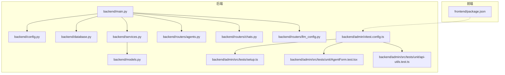
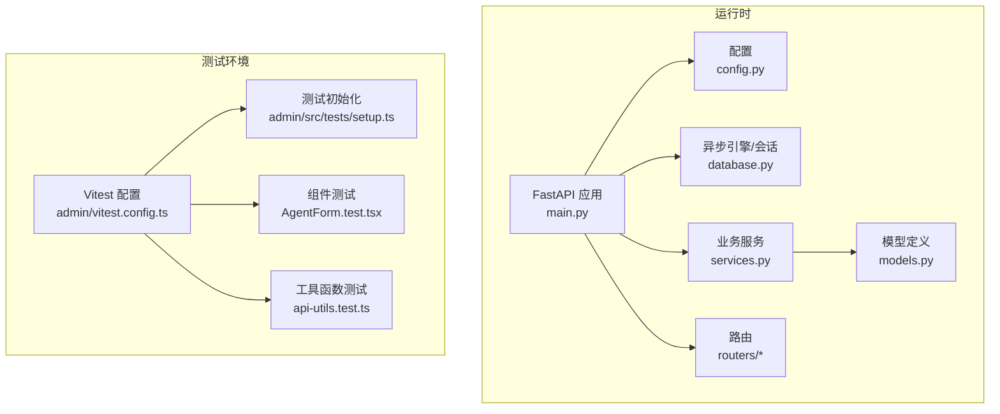
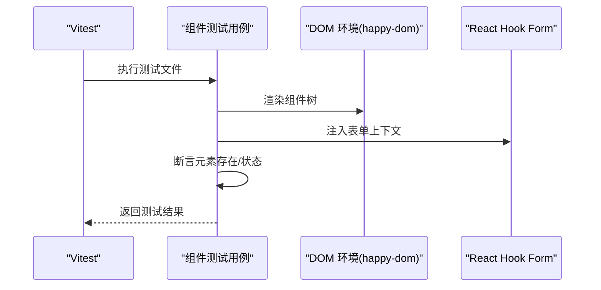
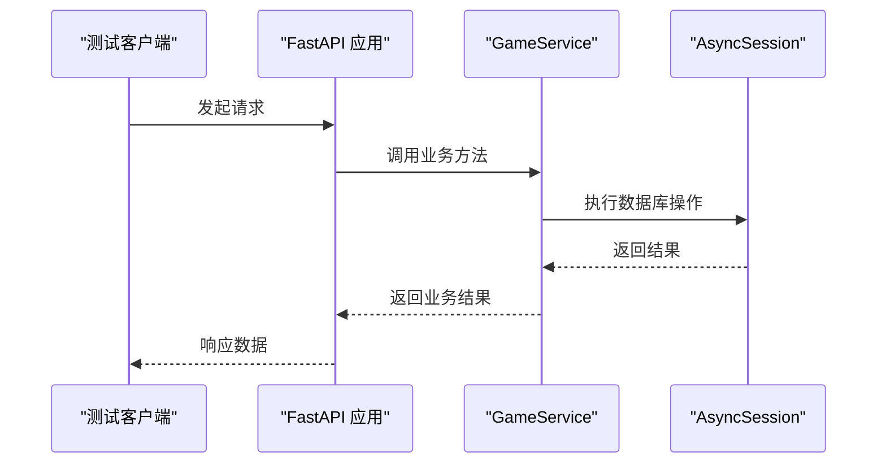
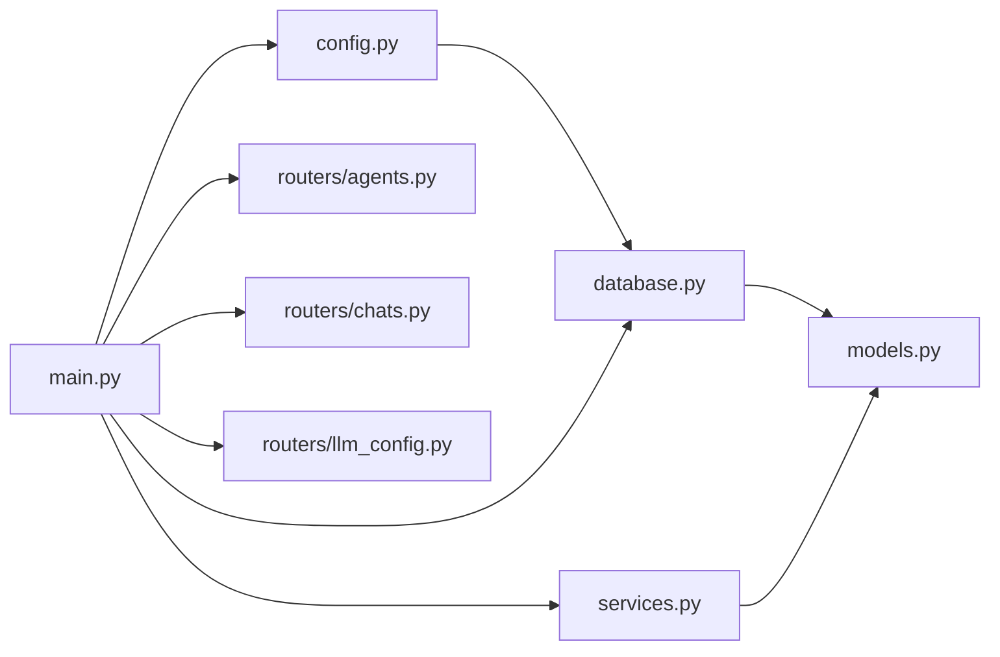

# 测试框架

<cite>
**本文引用的文件**
- [backend/main.py](file://backend/main.py)
- [backend/config.py](file://backend/config.py)
- [backend/database.py](file://backend/database.py)
- [backend/services.py](file://backend/services.py)
- [backend/models.py](file://backend/models.py)
- [backend/routers/agents.py](file://backend/routers/agents.py)
- [backend/routers/chats.py](file://backend/routers/chats.py)
- [backend/routers/llm_config.py](file://backend/routers/llm_config.py)
- [backend/admin/vitest.config.ts](file://backend/admin/vitest.config.ts)
- [backend/admin/src/tests/setup.ts](file://backend/admin/src/tests/setup.ts)
- [backend/admin/src/tests/unit/AgentForm.test.tsx](file://backend/admin/src/tests/unit/AgentForm.test.tsx)
- [backend/admin/src/tests/unit/api-utils.test.ts](file://backend/admin/src/tests/unit/api-utils.test.ts)
- [frontend/package.json](file://frontend/package.json)
</cite>

## 目录
1. [简介](#简介)
2. [项目结构](#项目结构)
3. [核心组件](#核心组件)
4. [架构总览](#架构总览)
5. [详细组件分析](#详细组件分析)
6. [依赖关系分析](#依赖关系分析)
7. [性能考量](#性能考量)
8. [故障排查指南](#故障排查指南)
9. [结论](#结论)
10. [附录](#附录)

## 简介
本指南面向测试框架的使用者与维护者，系统性介绍后端与前端的测试组织方式与最佳实践。内容涵盖：
- 后端单元测试与集成测试：pytest 配置、测试用例编写、模拟对象使用、数据库隔离与测试数据管理
- 前端测试策略：Vitest 配置、组件测试、端到端测试
- 测试环境搭建、数据库测试隔离与测试数据管理
- 测试覆盖率报告、持续集成测试配置建议与测试最佳实践
- 调试技巧与常见问题解决方案

## 项目结构
本仓库包含后端（FastAPI + SQLAlchemy Async）与前端（Next.js + Vitest）两套测试体系：
- 后端测试位于 admin 子项目中，采用 Vitest 进行组件与工具函数测试，并通过 Alembic 迁移管理数据库模式
- 前端测试位于 frontend 目录，当前主要以工具函数测试为主；可按需扩展组件与端到端测试

图表来源
- [backend/main.py](file://backend/main.py#L1-L173)
- [backend/config.py](file://backend/config.py#L1-L34)
- [backend/database.py](file://backend/database.py#L1-L31)
- [backend/services.py](file://backend/services.py#L1-L66)
- [backend/models.py](file://backend/models.py#L1-L122)
- [backend/admin/vitest.config.ts](file://backend/admin/vitest.config.ts#L1-L16)
- [backend/admin/src/tests/setup.ts](file://backend/admin/src/tests/setup.ts#L1-L2)
- [backend/admin/src/tests/unit/AgentForm.test.tsx](file://backend/admin/src/tests/unit/AgentForm.test.tsx#L1-L55)
- [backend/admin/src/tests/unit/api-utils.test.ts](file://backend/admin/src/tests/unit/api-utils.test.ts#L1-L22)
- [frontend/package.json](file://frontend/package.json#L1-L35)

章节来源
- [backend/main.py](file://backend/main.py#L1-L173)
- [backend/admin/vitest.config.ts](file://backend/admin/vitest.config.ts#L1-L16)

## 核心组件
- 应用入口与生命周期：应用启动时执行数据库迁移与 LLM 配置加载，提供根路径、玩家创建、故事初始化与 WebSocket 接入点
- 配置与数据库：统一从配置读取数据库 URL，支持 SQLite 与 PostgreSQL；异步引擎与会话工厂用于测试隔离
- 服务层：封装业务逻辑（玩家创建、世界初始化、章节生成等），便于在测试中注入依赖或替换
- 模型层：定义玩家、章节、资产、LLM 提供商、聊天会话与消息等实体，支撑测试数据建模
- 路由器：暴露管理端与聊天接口，便于集成测试覆盖

章节来源
- [backend/main.py](file://backend/main.py#L45-L173)
- [backend/config.py](file://backend/config.py#L1-L34)
- [backend/database.py](file://backend/database.py#L1-L31)
- [backend/services.py](file://backend/services.py#L1-L66)
- [backend/models.py](file://backend/models.py#L1-L122)

## 架构总览
下图展示后端测试与运行时的关键交互，以及 Vitest 在 admin 子项目中的测试配置与用例位置。

图表来源
- [backend/main.py](file://backend/main.py#L45-L173)
- [backend/config.py](file://backend/config.py#L1-L34)
- [backend/database.py](file://backend/database.py#L1-L31)
- [backend/services.py](file://backend/services.py#L1-L66)
- [backend/models.py](file://backend/models.py#L1-L122)
- [backend/admin/vitest.config.ts](file://backend/admin/vitest.config.ts#L1-L16)
- [backend/admin/src/tests/setup.ts](file://backend/admin/src/tests/setup.ts#L1-L2)
- [backend/admin/src/tests/unit/AgentForm.test.tsx](file://backend/admin/src/tests/unit/AgentForm.test.tsx#L1-L55)
- [backend/admin/src/tests/unit/api-utils.test.ts](file://backend/admin/src/tests/unit/api-utils.test.ts#L1-L22)

## 详细组件分析

### 后端测试组织与配置
- pytest 配置建议
  - 使用独立的测试数据库或内存数据库（如 SQLite 内存库）以实现完全隔离
  - 在测试前执行 Alembic 迁移，确保表结构与生产一致
  - 使用夹具（fixture）管理数据库连接、会话与测试数据清理
- 测试用例编写
  - 单元测试：针对服务方法（如创建玩家、初始化世界）进行断言
  - 集成测试：通过客户端测试路由行为（如玩家创建接口、故事初始化接口）
  - 模拟对象：对外部依赖（如 LLM 引擎、WebSocket）进行模拟，保证测试稳定性
- 模拟对象使用
  - 对叙事引擎与外部 API 进行 mock，避免真实调用
  - 使用 patch 或自定义 stub 替换异步调用，确保返回可控结果

章节来源
- [backend/main.py](file://backend/main.py#L45-L173)
- [backend/config.py](file://backend/config.py#L1-L34)
- [backend/database.py](file://backend/database.py#L1-L31)
- [backend/services.py](file://backend/services.py#L1-L66)

### 前端测试策略（Vitest）
- Vitest 配置
  - 环境：happy-dom 提供 DOM 兼容能力
  - 全局：启用全局测试 API
  - 设置文件：引入测试样式库，统一断言风格
  - 别名：@ 指向 src，便于组件导入
- 组件测试
  - 示例：对表单组件进行渲染与交互断言，结合 react-hook-form 的 useForm 与 FormProvider
  - 注意：对浏览器兼容性 API（如 matchMedia）进行 mock
- 工具函数测试
  - 示例：对字符串/JSON 解析工具进行边界条件测试

图表来源
- [backend/admin/vitest.config.ts](file://backend/admin/vitest.config.ts#L1-L16)
- [backend/admin/src/tests/setup.ts](file://backend/admin/src/tests/setup.ts#L1-L2)
- [backend/admin/src/tests/unit/AgentForm.test.tsx](file://backend/admin/src/tests/unit/AgentForm.test.tsx#L1-L55)

章节来源
- [backend/admin/vitest.config.ts](file://backend/admin/vitest.config.ts#L1-L16)
- [backend/admin/src/tests/setup.ts](file://backend/admin/src/tests/setup.ts#L1-L2)
- [backend/admin/src/tests/unit/AgentForm.test.tsx](file://backend/admin/src/tests/unit/AgentForm.test.tsx#L1-L55)
- [backend/admin/src/tests/unit/api-utils.test.ts](file://backend/admin/src/tests/unit/api-utils.test.ts#L1-L22)

### 数据库测试隔离与测试数据管理
- 隔离策略
  - 使用独立的测试数据库或临时数据库实例
  - 在每个测试用例前后清理数据，避免副作用
- 迁移与模式
  - 在测试启动阶段执行 Alembic 迁移，确保测试环境与生产一致
- 会话与依赖注入
  - 在测试中注入异步会话，确保事务可回滚或可清理
- 测试数据
  - 使用工厂或构造器生成最小化、可重复的数据集
  - 对外键约束敏感的场景，注意插入顺序与依赖关系

章节来源
- [backend/config.py](file://backend/config.py#L1-L34)
- [backend/database.py](file://backend/database.py#L1-L31)
- [backend/models.py](file://backend/models.py#L1-L122)

### API 行为与路由测试流程
以下序列图展示了典型 API 测试流程：客户端发起请求，应用处理并返回响应，测试断言结果。

图表来源
- [backend/main.py](file://backend/main.py#L128-L155)
- [backend/services.py](file://backend/services.py#L12-L58)
- [backend/database.py](file://backend/database.py#L28-L30)

## 依赖关系分析
后端模块之间的依赖关系如下：

图表来源
- [backend/config.py](file://backend/config.py#L1-L34)
- [backend/database.py](file://backend/database.py#L1-L31)
- [backend/models.py](file://backend/models.py#L1-L122)
- [backend/main.py](file://backend/main.py#L1-L173)
- [backend/services.py](file://backend/services.py#L1-L66)
- [backend/routers/agents.py](file://backend/routers/agents.py)
- [backend/routers/chats.py](file://backend/routers/chats.py)
- [backend/routers/llm_config.py](file://backend/routers/llm_config.py)

章节来源
- [backend/main.py](file://backend/main.py#L1-L173)
- [backend/services.py](file://backend/services.py#L1-L66)
- [backend/models.py](file://backend/models.py#L1-L122)

## 性能考量
- 测试并发与隔离：使用独立数据库实例或容器化数据库，避免并发写导致的锁竞争
- 模拟外部依赖：对外部 LLM 与第三方服务进行 mock，减少网络延迟与不可靠因素
- 快速失败：在测试前置条件中尽早断言，避免无效计算
- 并行执行：在不共享状态的前提下，合理并行运行无冲突的测试用例

## 故障排查指南
- 数据库连接失败
  - 检查数据库 URL 是否正确，确认 SQLite 文件路径或 PostgreSQL 可达性
  - 在测试启动阶段执行 Alembic 迁移，确保表结构存在
- WebSocket 测试
  - 使用模拟客户端或 Vitest 的网络模拟能力，避免真实连接
- Vitest 环境问题
  - 确认 happy-dom 环境已正确安装，设置文件已加载
  - 对浏览器兼容性 API（如 matchMedia）进行 mock
- 前端脚本缺失
  - 若缺少测试脚本，请在前端 package.json 中添加测试命令并安装必要依赖

章节来源
- [backend/config.py](file://backend/config.py#L1-L34)
- [backend/main.py](file://backend/main.py#L45-L81)
- [backend/admin/vitest.config.ts](file://backend/admin/vitest.config.ts#L1-L16)
- [backend/admin/src/tests/setup.ts](file://backend/admin/src/tests/setup.ts#L1-L2)
- [frontend/package.json](file://frontend/package.json#L1-L35)

## 结论
本指南提供了后端与前端测试的系统化方法论与实操建议。通过合理的隔离策略、模拟对象使用与配置管理，可以构建稳定、可维护且高覆盖率的测试体系。建议在持续集成中引入覆盖率统计与自动化测试流程，以保障代码质量与交付效率。

## 附录
- 持续集成测试配置建议
  - 在 CI 中分别执行后端与前端测试任务
  - 使用专用数据库实例或容器，确保迁移与隔离
  - 配置覆盖率报告（如后端使用 pytest-cov，前端使用 Vitest 覆盖率选项）
- 测试最佳实践
  - 小而精的单元测试优先，配合少量关键集成测试
  - 明确测试职责，避免“测试地狱”
  - 使用稳定的断言风格与一致的命名规范
  - 定期审查与重构测试代码，保持可读性与可维护性