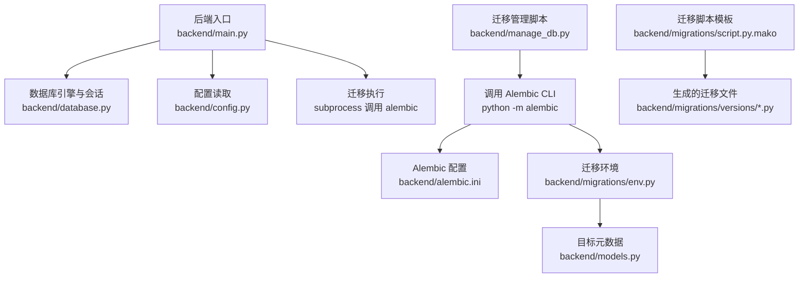
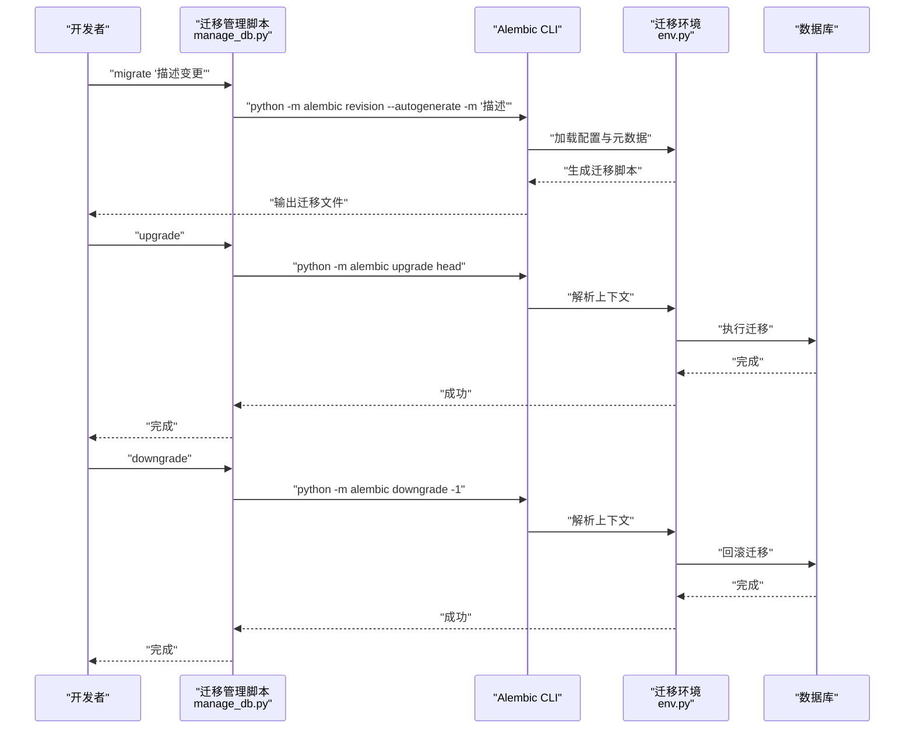
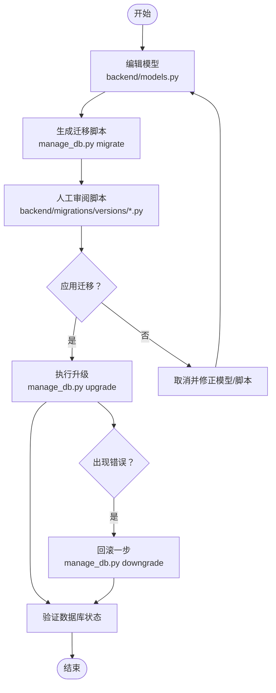
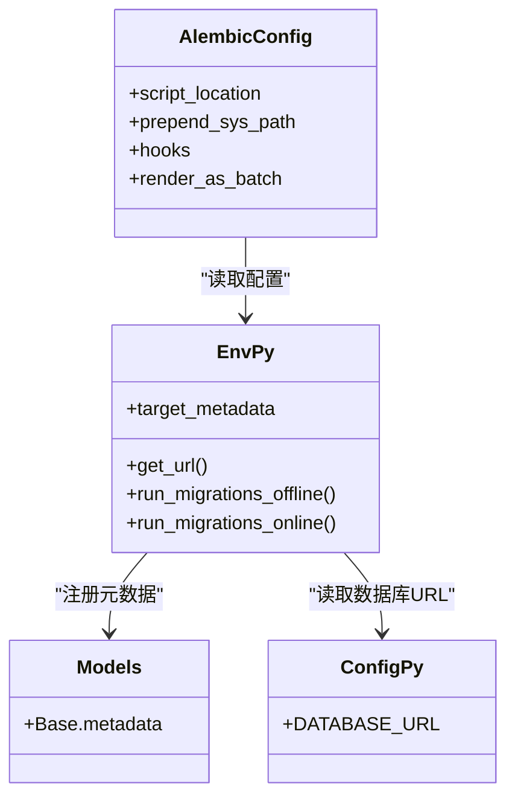
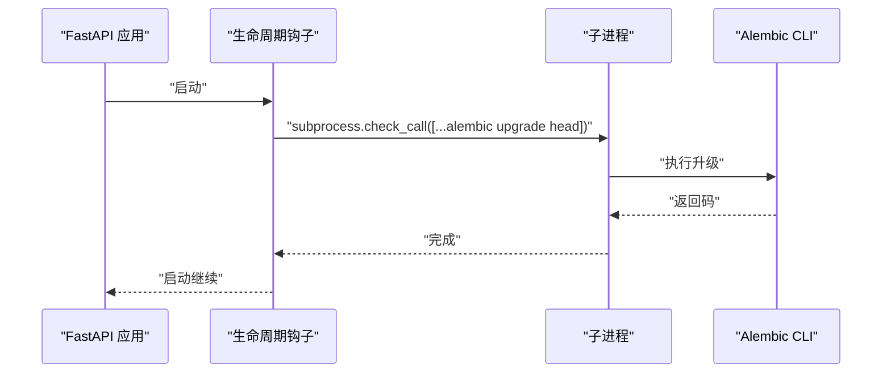
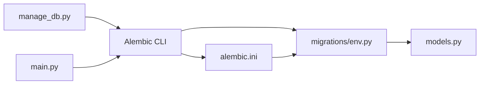

# 版本控制与协作

<cite>
**本文引用的文件**
- [README.md](file://README.md)
- [Database-Migration.md](file://docs/wiki/Database-Migration.md)
- [Deployment.md](file://docs/wiki/Deployment.md)
- [alembic.ini](file://backend/alembic.ini)
- [env.py](file://backend/migrations/env.py)
- [manage_db.py](file://backend/manage_db.py)
- [config.py](file://backend/config.py)
- [database.py](file://backend/database.py)
- [models.py](file://backend/models.py)
- [main.py](file://backend/main.py)
- [14746eaf1c81_initial.py](file://backend/migrations/versions/14746eaf1c81_initial.py)
- [82e927e1cf80_add_agent_model.py](file://backend/migrations/versions/82e927e1cf80_add_agent_model.py)
- [a3b8c9d0e1f2_convert_ids_to_uuid.py](file://backend/migrations/versions/a3b8c9d0e1f2_convert_ids_to_uuid.py)
- [script.py.mako](file://backend/migrations/script.py.mako)
</cite>

## 目录
1. [引言](#引言)
2. [项目结构](#项目结构)
3. [核心组件](#核心组件)
4. [架构总览](#架构总览)
5. [详细组件分析](#详细组件分析)
6. [依赖关系分析](#依赖关系分析)
7. [性能考量](#性能考量)
8. [故障排查指南](#故障排查指南)
9. [结论](#结论)
10. [附录](#附录)

## 引言
本指南面向版本控制与协作的最佳实践，围绕 Git 分支管理、提交规范、代码审查流程展开；同时覆盖数据库迁移版本控制（Alembic）、迁移脚本管理、回滚策略；并给出团队协作中的分支命名约定、合并策略与冲突解决方法；最后补充持续集成、自动化测试与部署流程建议，以及版本发布与标签标注的实践要点。

## 项目结构
本仓库采用前后端分离的多模块组织方式，后端使用 FastAPI + SQLAlchemy 异步 ORM + Alembic 进行数据库迁移管理；前端与后台管理分别独立运行。数据库迁移相关的关键位置如下：
- Alembic 配置与入口：backend/alembic.ini、backend/migrations/env.py
- 迁移脚本模板：backend/migrations/script.py.mako
- 迁移脚本目录：backend/migrations/versions/*.py
- 数据库封装脚本：backend/manage_db.py
- 后端入口与启动迁移：backend/main.py
- 配置与模型：backend/config.py、backend/database.py、backend/models.py

图表来源
- [main.py](file://backend/main.py#L45-L81)
- [database.py](file://backend/database.py#L1-L31)
- [config.py](file://backend/config.py#L1-L34)
- [manage_db.py](file://backend/manage_db.py#L20-L38)
- [alembic.ini](file://backend/alembic.ini#L1-L115)
- [env.py](file://backend/migrations/env.py#L1-L105)
- [models.py](file://backend/models.py#L1-L122)
- [script.py.mako](file://backend/migrations/script.py.mako#L1-L27)

章节来源
- [README.md](file://README.md#L34-L51)
- [alembic.ini](file://backend/alembic.ini#L1-L115)
- [env.py](file://backend/migrations/env.py#L1-L105)
- [manage_db.py](file://backend/manage_db.py#L1-L67)
- [main.py](file://backend/main.py#L45-L81)
- [config.py](file://backend/config.py#L1-L34)
- [database.py](file://backend/database.py#L1-L31)
- [models.py](file://backend/models.py#L1-L122)
- [script.py.mako](file://backend/migrations/script.py.mako#L1-L27)

## 核心组件
- Alembic 配置与环境
  - 配置文件 backend/alembic.ini 指定迁移脚本路径、版本目录分隔符、日志级别等；支持通过 hooks 在生成迁移后自动格式化。
  - 环境文件 backend/migrations/env.py 注册模型元数据、读取配置、区分离线/在线迁移模式，并启用批量渲染以兼容 SQLite 的 ALTER 限制。
- 迁移管理脚本
  - backend/manage_db.py 封装 migrate/upgrade/downgrade 命令，统一调用 Alembic CLI，便于团队成员按固定流程执行。
- 后端启动时迁移
  - backend/main.py 在应用生命周期内执行 Alembic 升级，确保每次启动都能将数据库同步到最新版本。
- 数据库模型与配置
  - backend/models.py 定义各表结构；backend/config.py 与 backend/database.py 提供数据库连接与引擎配置。

章节来源
- [alembic.ini](file://backend/alembic.ini#L1-L115)
- [env.py](file://backend/migrations/env.py#L1-L105)
- [manage_db.py](file://backend/manage_db.py#L1-L67)
- [main.py](file://backend/main.py#L45-L81)
- [config.py](file://backend/config.py#L1-L34)
- [database.py](file://backend/database.py#L1-L31)
- [models.py](file://backend/models.py#L1-L122)

## 架构总览
下图展示了从“模型变更”到“数据库版本演进”的完整流程，涵盖 Alembic 的模板生成、环境解析、脚本执行与回滚策略。

图表来源
- [manage_db.py](file://backend/manage_db.py#L20-L38)
- [alembic.ini](file://backend/alembic.ini#L1-L115)
- [env.py](file://backend/migrations/env.py#L1-L105)
- [main.py](file://backend/main.py#L59-L65)

## 详细组件分析

### 数据库迁移工作流
- 模型变更 → 生成迁移 → 应用迁移 → 验证与回滚
  - 模型变更：在 backend/models.py 中修改 SQLAlchemy 模型。
  - 生成迁移：使用 backend/manage_db.py 的 migrate 子命令触发 Alembic 自动检测并生成脚本。
  - 应用迁移：使用 upgrade 子命令将数据库升级至最新版本；后端启动时也会自动执行。
  - 回滚策略：当迁移异常时，使用 downgrade 子命令回退一步。
- 迁移脚本模板与版本链
  - 使用 backend/migrations/script.py.mako 作为模板生成脚本骨架，版本 ID 与上下游依赖由 Alembic 自动生成。
  - 示例迁移文件展示如何处理字段类型变更、新增表、以及复杂的数据迁移（如 UUID 迁移）。

图表来源
- [Database-Migration.md](file://docs/wiki/Database-Migration.md#L30-L62)
- [manage_db.py](file://backend/manage_db.py#L20-L38)
- [a3b8c9d0e1f2_convert_ids_to_uuid.py](file://backend/migrations/versions/a3b8c9d0e1f2_convert_ids_to_uuid.py#L22-L221)

章节来源
- [Database-Migration.md](file://docs/wiki/Database-Migration.md#L1-L85)
- [manage_db.py](file://backend/manage_db.py#L1-L67)
- [script.py.mako](file://backend/migrations/script.py.mako#L1-L27)
- [14746eaf1c81_initial.py](file://backend/migrations/versions/14746eaf1c81_initial.py#L1-L43)
- [82e927e1cf80_add_agent_model.py](file://backend/migrations/versions/82e927e1cf80_add_agent_model.py#L1-L54)
- [a3b8c9d0e1f2_convert_ids_to_uuid.py](file://backend/migrations/versions/a3b8c9d0e1f2_convert_ids_to_uuid.py#L1-L327)

### Alembic 配置与环境
- 配置要点
  - script_location 指向 migrations 目录；prepend_sys_path 保证导入 backend 下的配置与模型。
  - 支持 hooks（如 black、ruff）在生成脚本后自动格式化，提升一致性。
  - render_as_batch=True 用于兼容 SQLite 的批量 DDL。
- 环境要点
  - env.py 注册 Base.metadata，读取 settings.DATABASE_URL，区分离线/在线迁移模式。
  - 通过异步引擎连接数据库，确保与 FastAPI/SQLAlchemy 异步生态一致。

图表来源
- [alembic.ini](file://backend/alembic.ini#L1-L115)
- [env.py](file://backend/migrations/env.py#L1-L105)
- [models.py](file://backend/models.py#L1-L122)
- [config.py](file://backend/config.py#L1-L34)

章节来源
- [alembic.ini](file://backend/alembic.ini#L1-L115)
- [env.py](file://backend/migrations/env.py#L1-L105)
- [config.py](file://backend/config.py#L1-L34)
- [database.py](file://backend/database.py#L1-L31)

### 后端启动与迁移集成
- 生命周期钩子在应用启动时执行 Alembic 升级，确保数据库与代码版本一致。
- 若迁移失败，内置重试机制，避免偶发性连接问题导致启动失败。

图表来源
- [main.py](file://backend/main.py#L45-L81)

章节来源
- [main.py](file://backend/main.py#L45-L81)

### 迁移脚本示例与最佳实践
- 初始迁移：字段类型调整示例，展示如何使用批量 DDL。
- 新增模型：创建表与索引，演示标准迁移流程。
- 复杂迁移：UUID 迁移示例，展示数据读取、重建表、回写数据的完整流程，以及降级的破坏性提示。

章节来源
- [14746eaf1c81_initial.py](file://backend/migrations/versions/14746eaf1c81_initial.py#L1-L43)
- [82e927e1cf80_add_agent_model.py](file://backend/migrations/versions/82e927e1cf80_add_agent_model.py#L1-L54)
- [a3b8c9d0e1f2_convert_ids_to_uuid.py](file://backend/migrations/versions/a3b8c9d0e1f2_convert_ids_to_uuid.py#L1-L327)

## 依赖关系分析
- 组件耦合
  - manage_db.py 依赖 Alembic CLI 与 Python 环境，间接依赖 backend/config.py 与 backend/models.py。
  - main.py 通过 subprocess 调用 Alembic，耦合度较低，便于维护。
  - env.py 与 models.py 强耦合（元数据注册），确保迁移脚本能正确识别模型变更。
- 外部依赖
  - Alembic、SQLAlchemy 异步引擎、PostgreSQL/SQLite。
- 潜在循环依赖
  - 当前结构未见循环依赖；若后续扩展，应避免在 models.py 中引入对 manage_db.py 的直接依赖。

图表来源
- [manage_db.py](file://backend/manage_db.py#L1-L67)
- [alembic.ini](file://backend/alembic.ini#L1-L115)
- [env.py](file://backend/migrations/env.py#L1-L105)
- [models.py](file://backend/models.py#L1-L122)
- [main.py](file://backend/main.py#L45-L81)

章节来源
- [manage_db.py](file://backend/manage_db.py#L1-L67)
- [alembic.ini](file://backend/alembic.ini#L1-L115)
- [env.py](file://backend/migrations/env.py#L1-L105)
- [models.py](file://backend/models.py#L1-L122)
- [main.py](file://backend/main.py#L45-L81)

## 性能考量
- 迁移性能
  - 批量 DDL（render_as_batch）可降低 SQLite 的 ALTER 限制带来的性能损耗，但涉及全表复制时仍需谨慎评估数据规模。
  - 大表迁移建议在低峰期执行，并提前备份数据库。
- 启动迁移
  - 后端启动时执行 Alembic 升级会增加启动时间；可通过外部 CI/CD 在部署前预热数据库，减少线上启动压力。
- 连接池与并发
  - 异步引擎与连接池参数已在 database.py 中配置，建议根据实际并发需求调整 pool_size 与 max_overflow。

[本节为通用指导，不直接分析具体文件]

## 故障排查指南
- 数据库未更新
  - 现象：“Target database is not up to date.”
  - 处理：执行 upgrade；若后端已集成自动升级，确认启动日志与重试机制是否生效。
- SQLite 限制
  - 现象：复杂 ALTER 操作失败。
  - 处理：使用 render_as_batch；必要时手动编写迁移脚本或拆分为多次简单迁移。
- 多人协作冲突
  - 现象：出现多个 head。
  - 处理：调整 down_revision 或合并迁移脚本，确保版本链连续。
- 迁移失败回滚
  - 处理：执行 downgrade；若数据已损坏，结合备份恢复。
- 环境变量与连接
  - 现象：连接失败或凭据错误。
  - 处理：核对 DATABASE_URL 与 .env 配置；确保数据库服务可用。

章节来源
- [Database-Migration.md](file://docs/wiki/Database-Migration.md#L71-L85)
- [main.py](file://backend/main.py#L45-L81)
- [alembic.ini](file://backend/alembic.ini#L1-L115)

## 结论
本项目通过 Alembic 与封装脚本实现了标准化的数据库迁移流程，配合后端启动时的自动升级，提升了开发与运维效率。建议团队在模型变更前先审阅自动生成的脚本，遵循“小步快跑、及时合并”的原则，配合 CI/CD 在部署前预热数据库，确保迁移过程可控、可回滚。

[本节为总结性内容，不直接分析具体文件]

## 附录

### Git 分支管理策略与协作规范
- 分支命名约定
  - feat/xxx：新功能
  - fix/xxx：缺陷修复
  - refactor/xxx：重构
  - docs/xxx：文档更新
  - test/xxx：测试相关
  - hotfix/xxx：紧急修复
- 合并策略
  - 使用 Rebase 合并以保持线性历史；或使用 Squash 合并以整合多个提交。
  - 合并前必须通过 CI/CD 与代码审查。
- 冲突解决
  - 频繁与主干同步；优先解决模型相关冲突，确保迁移脚本版本链连续。
  - 多人同时生成迁移时，协调 down_revision 或合并脚本。

[本节为通用指导，不直接分析具体文件]

### 提交规范与代码审查流程
- 提交信息
  - 类型(scope): 概要
  - 例如：feat(models): 添加玩家偏好字段
- 代码审查
  - 至少一名同事审查；关注迁移脚本的正确性与可回滚性。
  - 重大模型变更需附带迁移验证步骤。

[本节为通用指导，不直接分析具体文件]

### 持续集成、自动化测试与部署
- CI/CD 建议
  - 触发条件：push 到 feat/*、fix/*、refactor/*；PR 合并到主干。
  - 步骤：安装依赖、运行单元测试、运行迁移（离线模式）、打包镜像、部署到测试环境。
- 自动化测试
  - 后端：pytest/vitest；数据库测试使用独立测试库与迁移隔离。
- 部署流程
  - 预发布：在 staging 执行 Alembic 升级并验证。
  - 生产发布：灰度发布，回滚预案与备份策略到位。

[本节为通用指导，不直接分析具体文件]

### 版本发布管理、标签与回滚
- 版本号
  - 使用语义化版本（如 1.0.0、1.0.1），在 backend/config.py 中维护 VERSION。
- 标签
  - 发布前打 tag，如 v1.0.0；关联发布说明与迁移变更摘要。
- 回滚
  - 通过 downgrade 回退；若涉及数据破坏，结合备份恢复。
  - 回滚前评估影响范围与数据一致性。

章节来源
- [config.py](file://backend/config.py#L7-L9)