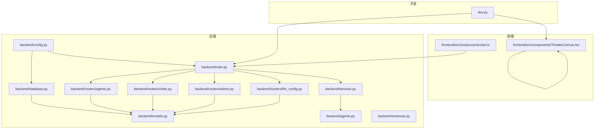
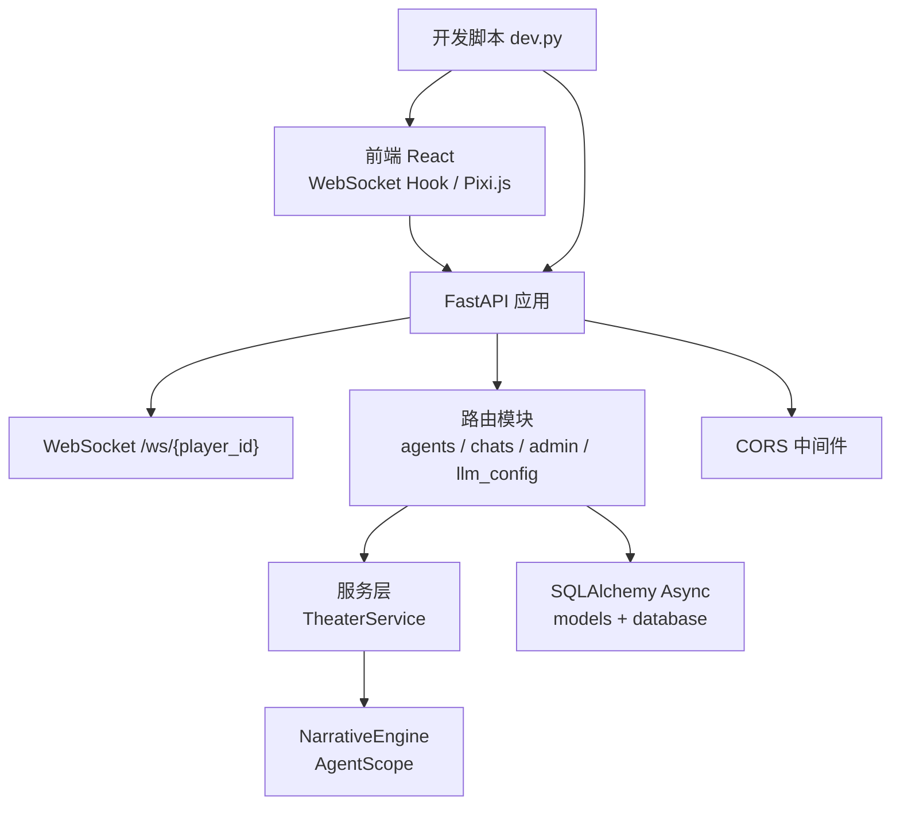
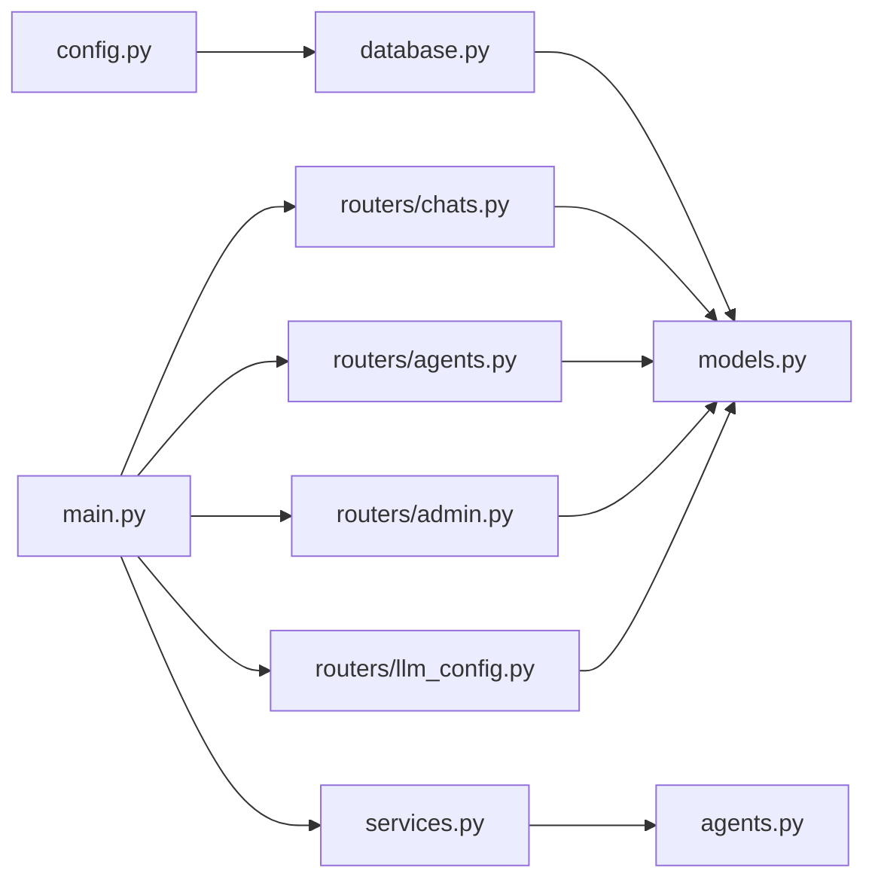

# 调试工具

<cite>
**本文引用的文件**
- [backend/main.py](file://backend/main.py)
- [backend/config.py](file://backend/config.py)
- [backend/database.py](file://backend/database.py)
- [backend/models.py](file://backend/models.py)
- [backend/services.py](file://backend/services.py)
- [backend/routers/agents.py](file://backend/routers/agents.py)
- [backend/routers/chats.py](file://backend/routers/chats.py)
- [backend/routers/admin.py](file://backend/routers/admin.py)
- [backend/routers/llm_config.py](file://backend/routers/llm_config.py)
- [backend/agents.py](file://backend/agents.py)
- [backend/schemas.py](file://backend/schemas.py)
- [frontend/src/hooks/useSocket.ts](file://frontend/src/hooks/useSocket.ts)
- [frontend/src/components/TheaterCanvas.tsx](file://frontend/src/components/TheaterCanvas.tsx)
- [dev.py](file://dev.py)
</cite>

## 目录
1. [简介](#简介)
2. [项目结构](#项目结构)
3. [核心组件](#核心组件)
4. [架构总览](#架构总览)
5. [组件详解与调试要点](#组件详解与调试要点)
6. [依赖关系分析](#依赖关系分析)
7. [性能与内存调试](#性能与内存调试)
8. [故障排查指南](#故障排查指南)
9. [结论](#结论)
10. [附录](#附录)

## 简介
本指南面向开发者与测试工程师，系统性讲解本项目的调试方法与最佳实践，覆盖后端 Python（FastAPI + SQLAlchemy Async + Uvicorn）、前端 JavaScript/TypeScript（React + Pixi.js + WebSocket）、多智能体与 LLM 调用链路、实时通信与数据库交互等关键环节。文档提供断点设置、变量检查、异步调试、日志分析、性能与内存问题定位、常见场景排障与效率提升技巧。

## 项目结构
项目采用前后端分离与模块化路由组织：
- 后端：FastAPI 应用、数据库模型与服务层、API 路由（管理员、代理、聊天、LLM 配置）、异步数据库引擎、配置与环境变量、开发脚本。
- 前端：React 客户端、WebSocket Hook、Pixi.js 剧场画布组件。
- 开发脚本：统一启动后端、前端与管理后台，支持并发与日志聚合。

图表来源
- [backend/main.py](file://backend/main.py#L83-L98)
- [backend/routers/chats.py](file://backend/routers/chats.py#L16-L20)
- [backend/routers/agents.py](file://backend/routers/agents.py#L9-L13)
- [backend/routers/admin.py](file://backend/routers/admin.py#L10-L14)
- [backend/routers/llm_config.py](file://backend/routers/llm_config.py#L14-L18)
- [backend/services.py](file://backend/services.py#L8-L11)
- [backend/agents.py](file://backend/agents.py#L43-L47)
- [backend/database.py](file://backend/database.py#L6-L23)
- [backend/config.py](file://backend/config.py#L1-L34)
- [frontend/src/hooks/useSocket.ts](file://frontend/src/hooks/useSocket.ts#L3-L33)
- [frontend/src/components/TheaterCanvas.tsx](file://frontend/src/components/TheaterCanvas.tsx#L10-L44)
- [dev.py](file://dev.py#L108-L131)

章节来源
- [backend/main.py](file://backend/main.py#L83-L98)
- [dev.py](file://dev.py#L108-L131)

## 核心组件
- 应用入口与生命周期：FastAPI 应用、CORS 中间件、数据库迁移与启动加载、根路由、WebSocket 端点。
- 数据层：异步引擎、会话工厂、模型定义（玩家、章节、资产、LLM 提供商、聊天会话与消息）。
- 业务服务：剧场服务封装世界初始化、章节生成与后续流程。
- 路由模块：代理 CRUD、聊天流式响应、管理员统计与数据管理、LLM 提供商配置与连通性测试。
- 多智能体与 LLM：基于 AgentScope 的对话代理、叙事引擎按数据库配置动态初始化模型。
- 前端：WebSocket Hook、Pixi.js 画布组件。
- 开发脚本：统一安装与并发启动后端、前端、管理后台。

章节来源
- [backend/main.py](file://backend/main.py#L14-L28)
- [backend/database.py](file://backend/database.py#L6-L23)
- [backend/models.py](file://backend/models.py#L9-L122)
- [backend/services.py](file://backend/services.py#L8-L66)
- [backend/routers/agents.py](file://backend/routers/agents.py#L15-L55)
- [backend/routers/chats.py](file://backend/routers/chats.py#L72-L258)
- [backend/routers/admin.py](file://backend/routers/admin.py#L16-L31)
- [backend/routers/llm_config.py](file://backend/routers/llm_config.py#L20-L111)
- [backend/agents.py](file://backend/agents.py#L43-L196)
- [frontend/src/hooks/useSocket.ts](file://frontend/src/hooks/useSocket.ts#L3-L42)
- [frontend/src/components/TheaterCanvas.tsx](file://frontend/src/components/TheaterCanvas.tsx#L10-L44)
- [dev.py](file://dev.py#L108-L131)

## 架构总览
后端通过 FastAPI 暴露 REST 与 WebSocket 接口；前端通过 React 与 WebSocket 交互；数据库采用 SQLAlchemy Async；LLM 通过 AgentScope 动态加载提供商配置；管理员面板用于统计与配置管理。

图表来源
- [backend/main.py](file://backend/main.py#L157-L169)
- [backend/routers/chats.py](file://backend/routers/chats.py#L72-L258)
- [backend/services.py](file://backend/services.py#L19-L59)
- [backend/agents.py](file://backend/agents.py#L43-L196)
- [backend/database.py](file://backend/database.py#L6-L23)
- [frontend/src/hooks/useSocket.ts](file://frontend/src/hooks/useSocket.ts#L3-L42)
- [dev.py](file://dev.py#L108-L131)

## 组件详解与调试要点

### 后端调试：断点、变量检查与异步
- 入口与生命周期
  - 在应用生命周期中进行数据库迁移与 LLM 配置加载，便于定位启动阶段异常。
  - 参考路径：[backend/main.py](file://backend/main.py#L45-L81)
- 日志与错误
  - 精细的日志级别控制，关闭 SQLAlchemy 与 Uvicorn 访问日志，保留应用日志，便于聚焦。
  - 参考路径：[backend/main.py](file://backend/main.py#L14-L28)
- WebSocket 调试
  - 在 WebSocket 循环中捕获异常并记录，便于排查连接中断与消息处理问题。
  - 参考路径：[backend/main.py](file://backend/main.py#L157-L169)
- 异步数据库与会话
  - 使用异步引擎与会话工厂，注意事务与连接池参数，避免死锁与超时。
  - 参考路径：[backend/database.py](file://backend/database.py#L6-L23)
- 服务层调试
  - 在服务层对关键流程（如世界初始化、章节生成）设置断点，检查状态与返回值。
  - 参考路径：[backend/services.py](file://backend/services.py#L19-L59)

调试技巧
- 断点设置
  - 在路由处理函数入口、服务层方法、WebSocket 接收/发送处设置断点。
  - 在数据库查询与提交前后设置断点，检查数据一致性。
- 变量检查
  - 检查请求体、会话对象、模型实例字段、LLM 返回内容与 token 统计。
- 异步调试
  - 使用事件循环兼容策略（Windows），关注协程挂起与异常传播。
  - 参考路径：[backend/main.py](file://backend/main.py#L7-L11)

章节来源
- [backend/main.py](file://backend/main.py#L14-L28)
- [backend/main.py](file://backend/main.py#L45-L81)
- [backend/main.py](file://backend/main.py#L157-L169)
- [backend/database.py](file://backend/database.py#L6-L23)
- [backend/services.py](file://backend/services.py#L19-L59)

### LLM 与多智能体调试：配置加载、连通性与调用链
- 配置加载
  - 从数据库加载活动提供商，回退到配置文件，初始化 AgentScope 模型。
  - 参考路径：[backend/agents.py](file://backend/agents.py#L49-L99)
- 连通性测试
  - 通过管理员接口测试不同提供商连通性，快速定位密钥、URL、模型名等问题。
  - 参考路径：[backend/routers/llm_config.py](file://backend/routers/llm_config.py#L20-L111)
- 调用链路
  - 导演（Outline）→ 叙述者（Content）→ NPC 管理（关系更新），逐层断点验证。
  - 参考路径：[backend/agents.py](file://backend/agents.py#L154-L191)
- 流式响应与日志
  - 路由层记录输入字符数、上下文窗口、温度、token 统计与最终输出摘要，便于性能与成本分析。
  - 参考路径：[backend/routers/chats.py](file://backend/routers/chats.py#L133-L234)

调试技巧
- 断点设置
  - 在提供商初始化、对话代理 reply、章节生成三处设置断点。
- 变量检查
  - 检查提供商类型、模型名、系统提示词、历史消息拼接、token 统计。
- 错误处理
  - 捕获并记录 LLM 调用异常，区分网络、鉴权、模型不可用等场景。

章节来源
- [backend/agents.py](file://backend/agents.py#L49-L99)
- [backend/routers/llm_config.py](file://backend/routers/llm_config.py#L20-L111)
- [backend/agents.py](file://backend/agents.py#L154-L191)
- [backend/routers/chats.py](file://backend/routers/chats.py#L133-L234)

### 路由与数据库调试：CRUD 与一致性
- 代理管理
  - 创建/更新时校验提供商与模型可用性，避免无效配置写入。
  - 参考路径：[backend/routers/agents.py](file://backend/routers/agents.py#L15-L55)
- 聊天会话与消息
  - 发送消息前保存用户消息，流式生成助手回复并落库，注意并发与事务边界。
  - 参考路径：[backend/routers/chats.py](file://backend/routers/chats.py#L72-L258)
- 管理员接口
  - 统计与列表查询，删除玩家时注意关联清理。
  - 参考路径：[backend/routers/admin.py](file://backend/routers/admin.py#L16-L31)

调试技巧
- 断点设置
  - 在路由入口、数据库查询与提交前后、异常分支。
- 变量检查
  - 检查模型列表解析、JSON 字段、外键约束、级联行为。
- 一致性
  - 对比历史消息顺序、会话时间戳更新、章节状态流转。

章节来源
- [backend/routers/agents.py](file://backend/routers/agents.py#L15-L55)
- [backend/routers/chats.py](file://backend/routers/chats.py#L72-L258)
- [backend/routers/admin.py](file://backend/routers/admin.py#L16-L31)

### 前端调试：React DevTools、WebSocket 与 Pixi.js
- WebSocket Hook
  - 在连接、消息接收、关闭回调中添加日志，验证连接状态与消息队列。
  - 参考路径：[frontend/src/hooks/useSocket.ts](file://frontend/src/hooks/useSocket.ts#L8-L33)
- Pixi.js 画布
  - 动态导入与初始化，清理阶段销毁应用，避免内存泄漏。
  - 参考路径：[frontend/src/components/TheaterCanvas.tsx](file://frontend/src/components/TheaterCanvas.tsx#L14-L44)

调试技巧
- React DevTools
  - 使用组件树与状态面板检查 props、state、effects 生命周期。
- WebSocket
  - 打开浏览器开发者工具 Network → WS，观察握手、帧与断线重连。
- Pixi.js
  - 检查容器与纹理资源释放，避免重复创建导致内存增长。

章节来源
- [frontend/src/hooks/useSocket.ts](file://frontend/src/hooks/useSocket.ts#L8-L33)
- [frontend/src/components/TheaterCanvas.tsx](file://frontend/src/components/TheaterCanvas.tsx#L14-L44)

### 开发脚本与并发调试
- 并发启动
  - 后端、前端、管理后台并行启动，统一输出与终止信号处理。
  - 参考路径：[dev.py](file://dev.py#L108-L131)
- 环境准备
  - 自动创建虚拟环境、安装依赖，跨平台兼容。
  - 参考路径：[dev.py](file://dev.py#L25-L62)

调试技巧
- 观察日志分组，区分后端、前端、管理后台输出。
- 快速重启：修改代码触发热重载，结合断点快速迭代。

章节来源
- [dev.py](file://dev.py#L25-L62)
- [dev.py](file://dev.py#L108-L131)

## 依赖关系分析
后端模块之间存在清晰的分层与耦合关系：路由依赖服务层与数据库；服务层依赖多智能体引擎；数据库提供模型与会话；配置驱动数据库与 LLM 初始化。

图表来源
- [backend/config.py](file://backend/config.py#L1-L34)
- [backend/database.py](file://backend/database.py#L6-L23)
- [backend/models.py](file://backend/models.py#L9-L122)
- [backend/main.py](file://backend/main.py#L83-L98)
- [backend/routers/agents.py](file://backend/routers/agents.py#L15-L55)
- [backend/routers/chats.py](file://backend/routers/chats.py#L72-L258)
- [backend/routers/admin.py](file://backend/routers/admin.py#L16-L31)
- [backend/routers/llm_config.py](file://backend/routers/llm_config.py#L112-L138)
- [backend/services.py](file://backend/services.py#L8-L11)
- [backend/agents.py](file://backend/agents.py#L43-L47)

章节来源
- [backend/main.py](file://backend/main.py#L83-L98)
- [backend/routers/chats.py](file://backend/routers/chats.py#L72-L258)
- [backend/services.py](file://backend/services.py#L8-L11)
- [backend/agents.py](file://backend/agents.py#L43-L47)
- [backend/database.py](file://backend/database.py#L6-L23)
- [backend/config.py](file://backend/config.py#L1-L34)

## 性能与内存调试
- 日志与指标
  - 利用聊天路由中的输入字符数、输出字符数、token 统计与上下文占比，评估成本与性能瓶颈。
  - 参考路径：[backend/routers/chats.py](file://backend/routers/chats.py#L129-L234)
- 数据库性能
  - 连接池参数与 pre_ping 生效，避免长时间空闲连接失效；在高并发下观察等待与超时。
  - 参考路径：[backend/database.py](file://backend/database.py#L8-L17)
- 前端渲染
  - Pixi.js 清理阶段销毁应用与纹理，避免重复创建；监控帧率与内存峰值。
  - 参考路径：[frontend/src/components/TheaterCanvas.tsx](file://frontend/src/components/TheaterCanvas.tsx#L39-L43)

调试建议
- 使用浏览器性能面板与内存快照对比，定位泄漏点。
- 后端开启轻量日志，逐步定位慢查询与阻塞点。

章节来源
- [backend/routers/chats.py](file://backend/routers/chats.py#L129-L234)
- [backend/database.py](file://backend/database.py#L8-L17)
- [frontend/src/components/TheaterCanvas.tsx](file://frontend/src/components/TheaterCanvas.tsx#L39-L43)

## 故障排查指南
- 启动失败与数据库迁移
  - 观察启动日志中的迁移步骤与重试机制，确认数据库可达与权限正确。
  - 参考路径：[backend/main.py](file://backend/main.py#L45-L81)
- WebSocket 连接问题
  - 检查端点路径、CORS 配置、客户端连接与断开回调日志。
  - 参考路径：[backend/main.py](file://backend/main.py#L85-L91)
  - 参考路径：[frontend/src/hooks/useSocket.ts](file://frontend/src/hooks/useSocket.ts#L11-L26)
- LLM 连接失败
  - 使用管理员接口测试提供商连通性，核对密钥、URL、模型名与提供商类型。
  - 参考路径：[backend/routers/llm_config.py](file://backend/routers/llm_config.py#L20-L111)
- 聊天流式响应异常
  - 检查历史消息拼接、系统提示词、提供商类型分支与异常分支日志。
  - 参考路径：[backend/routers/chats.py](file://backend/routers/chats.py#L112-L216)
- 代理/会话/提供商 CRUD 失败
  - 校验模型列表解析、唯一性约束、外键与默认值。
  - 参考路径：[backend/routers/agents.py](file://backend/routers/agents.py#L28-L50)
  - 参考路径：[backend/routers/llm_config.py](file://backend/routers/llm_config.py#L112-L138)

章节来源
- [backend/main.py](file://backend/main.py#L45-L81)
- [backend/main.py](file://backend/main.py#L85-L91)
- [frontend/src/hooks/useSocket.ts](file://frontend/src/hooks/useSocket.ts#L11-L26)
- [backend/routers/llm_config.py](file://backend/routers/llm_config.py#L20-L111)
- [backend/routers/chats.py](file://backend/routers/chats.py#L112-L216)
- [backend/routers/agents.py](file://backend/routers/agents.py#L28-L50)
- [backend/routers/llm_config.py](file://backend/routers/llm_config.py#L112-L138)

## 结论
本指南提供了从后端到前端、从数据库到 LLM 的全链路调试方法。通过合理的断点位置、变量检查、日志分析与性能观测，可高效定位问题并优化体验。建议在开发流程中持续集成这些调试实践，以提升迭代效率与系统稳定性。

## 附录
- 常见调试场景
  - 启动阶段：检查迁移与配置加载日志，确认数据库与 LLM 配置。
  - 实时通信：验证 WebSocket 握手、消息收发与断线恢复。
  - LLM 调用：使用连通性测试接口快速验证提供商可用性。
  - 前端渲染：监控 Pixi.js 资源释放与内存变化。
- 开发效率提升
  - 使用开发脚本统一启动，配合热重载与断点调试。
  - 将关键日志标准化，形成可复现的最小问题集。