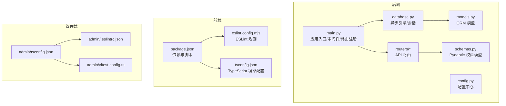
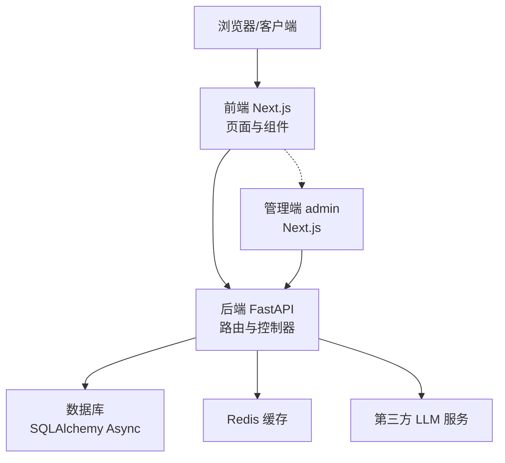
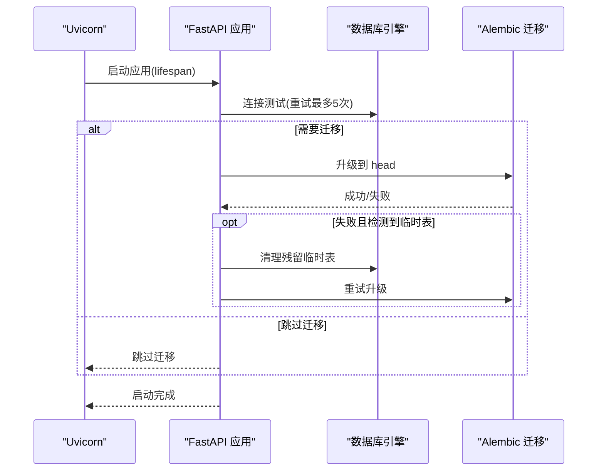
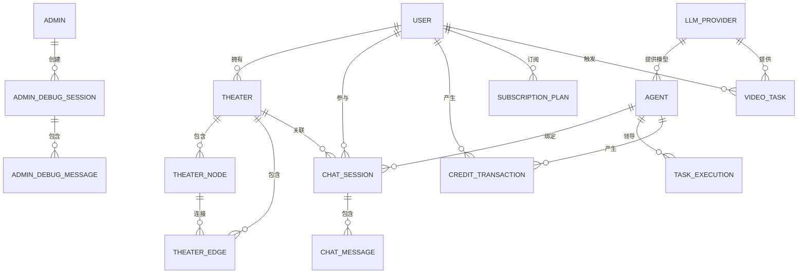
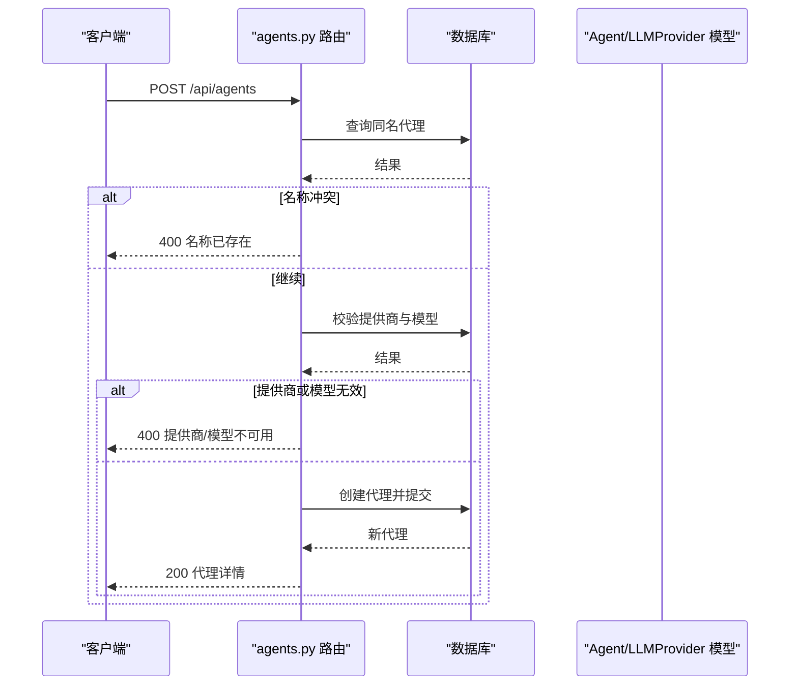
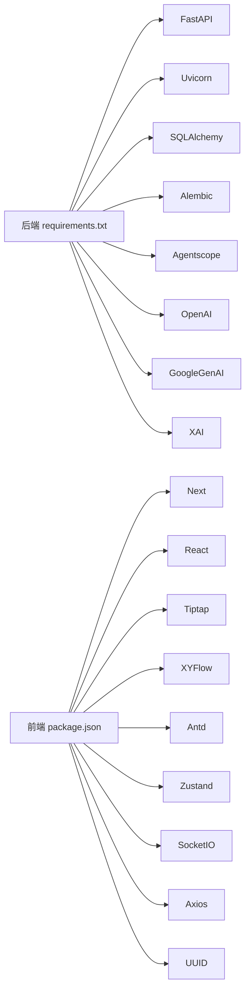

# 开发者指南

<cite>
**本文引用的文件**   
- [backend/main.py](file://backend/main.py)
- [backend/config.py](file://backend/config.py)
- [backend/database.py](file://backend/database.py)
- [backend/models.py](file://backend/models.py)
- [backend/schemas.py](file://backend/schemas.py)
- [backend/routers/agents.py](file://backend/routers/agents.py)
- [backend/requirements.txt](file://backend/requirements.txt)
- [frontend/package.json](file://frontend/package.json)
- [frontend/eslint.config.mjs](file://frontend/eslint.config.mjs)
- [frontend/tsconfig.json](file://frontend/tsconfig.json)
- [backend/admin/tsconfig.json](file://backend/admin/tsconfig.json)
- [backend/admin/.eslintrc.json](file://backend/admin/.eslintrc.json)
- [backend/admin/vitest.config.ts](file://backend/admin/vitest.config.ts)
</cite>

## 目录
1. [简介](#简介)
2. [项目结构](#项目结构)
3. [核心组件](#核心组件)
4. [架构总览](#架构总览)
5. [详细组件分析](#详细组件分析)
6. [依赖分析](#依赖分析)
7. [性能考虑](#性能考虑)
8. [故障排查指南](#故障排查指南)
9. [结论](#结论)
10. [附录](#附录)

## 简介
本指南面向贡献者，提供从代码规范到开发流程、从调试技巧到版本管理的完整开发手册。项目采用前后端分离架构：后端基于 FastAPI + SQLAlchemy Async + Alembic，前端基于 Next.js 16 + TypeScript。后端负责 API、数据库与业务服务，前端负责可视化画布、剧场编辑与用户交互。

## 项目结构
- 后端 backend
  - 应用入口与生命周期：backend/main.py
  - 配置中心：backend/config.py
  - 数据库引擎与会话：backend/database.py
  - ORM 模型：backend/models.py
  - Pydantic 数据校验模型：backend/schemas.py
  - 路由与控制器：backend/routers/*
  - 依赖声明：backend/requirements.txt
- 前端 frontend
  - 依赖与脚本：frontend/package.json
  - ESLint 配置：frontend/eslint.config.mjs
  - TS 配置：frontend/tsconfig.json
- 管理端 admin（Next.js）
  - TS 配置：backend/admin/tsconfig.json
  - ESLint 配置：backend/admin/.eslintrc.json
  - Vitest 配置：backend/admin/vitest.config.ts

**图表来源**
- [backend/main.py:110-152](file://backend/main.py#L110-L152)
- [backend/database.py:1-31](file://backend/database.py#L1-31)
- [backend/models.py:1-447](file://backend/models.py#L1-L447)
- [backend/schemas.py:1-800](file://backend/schemas.py#L1-L800)
- [frontend/package.json:1-92](file://frontend/package.json#L1-L92)
- [frontend/eslint.config.mjs:1-19](file://frontend/eslint.config.mjs#L1-L19)
- [frontend/tsconfig.json:1-35](file://frontend/tsconfig.json#L1-L35)
- [backend/admin/tsconfig.json:1-42](file://backend/admin/tsconfig.json#L1-L42)
- [backend/admin/.eslintrc.json:1-4](file://backend/admin/.eslintrc.json#L1-L4)
- [backend/admin/vitest.config.ts:1-16](file://backend/admin/vitest.config.ts#L1-L16)

**章节来源**
- [backend/main.py:110-152](file://backend/main.py#L110-L152)
- [backend/database.py:1-31](file://backend/database.py#L1-L31)
- [backend/models.py:1-447](file://backend/models.py#L1-L447)
- [backend/schemas.py:1-800](file://backend/schemas.py#L1-L800)
- [frontend/package.json:1-92](file://frontend/package.json#L1-L92)
- [frontend/eslint.config.mjs:1-19](file://frontend/eslint.config.mjs#L1-L19)
- [frontend/tsconfig.json:1-35](file://frontend/tsconfig.json#L1-L35)
- [backend/admin/tsconfig.json:1-42](file://backend/admin/tsconfig.json#L1-L42)
- [backend/admin/.eslintrc.json:1-4](file://backend/admin/.eslintrc.json#L1-L4)
- [backend/admin/vitest.config.ts:1-16](file://backend/admin/vitest.config.ts#L1-L16)

## 核心组件
- 应用入口与生命周期
  - 初始化日志、CORS、中间件与路由注册
  - 数据库连接重试、迁移执行与残留临时表清理
- 配置中心
  - 通过 pydantic-settings 加载 .env，支持数据库、Redis、AI 密钥、JWT、默认模型等
- 数据库层
  - 异步引擎、连接池、会话工厂；SQLite/PostgreSQL 兼容
- ORM 模型
  - 用户、管理员、剧场、节点、边、聊天、资产、代理、订阅、视频任务等
- Pydantic 校验模型
  - 请求/响应数据结构、字段校验、枚举约束
- 路由与控制器
  - 示例：代理管理路由，包含鉴权、校验、CRUD 与异常处理

**章节来源**
- [backend/main.py:15-30](file://backend/main.py#L15-L30)
- [backend/main.py:49-108](file://backend/main.py#L49-L108)
- [backend/config.py:1-43](file://backend/config.py#L1-L43)
- [backend/database.py:1-31](file://backend/database.py#L1-L31)
- [backend/models.py:10-280](file://backend/models.py#L10-L280)
- [backend/schemas.py:13-111](file://backend/schemas.py#L13-L111)
- [backend/routers/agents.py:16-65](file://backend/routers/agents.py#L16-L65)

## 架构总览
后端采用 FastAPI + SQLAlchemy Async 的异步架构，配合 Alembic 进行数据库迁移。前端 Next.js 提供可视化界面与交互能力。管理端 admin 作为独立 Next.js 应用，复用 tsconfig 与 ESLint 规则。

**图表来源**
- [backend/main.py:138-152](file://backend/main.py#L138-L152)
- [backend/config.py:18-29](file://backend/config.py#L18-L29)
- [backend/requirements.txt:1-28](file://backend/requirements.txt#L1-L28)

**章节来源**
- [backend/main.py:138-152](file://backend/main.py#L138-L152)
- [backend/config.py:18-29](file://backend/config.py#L18-L29)
- [backend/requirements.txt:1-28](file://backend/requirements.txt#L1-L28)

## 详细组件分析

### 后端应用入口与生命周期
- 生命周期管理：启动时尝试连接数据库并执行迁移，失败自动清理残留临时表后重试
- CORS 与调试中间件：允许本地开发源，记录授权头与来源便于调试
- 路由注册：集中注册认证、管理、代理、聊天、编排、媒体、订阅、提示词模板、视频、剧场、技能等路由

**图表来源**
- [backend/main.py:49-108](file://backend/main.py#L49-L108)

**章节来源**
- [backend/main.py:49-108](file://backend/main.py#L49-L108)

### 配置中心
- 支持环境变量加载，提供数据库 URL、Redis URL、AI API Key、JWT 参数、默认模型与迁移开关
- 建议生产环境务必设置安全密钥与数据库凭据

**章节来源**
- [backend/config.py:7-42](file://backend/config.py#L7-L42)

### 数据库层
- 异步引擎与连接池：开启 pool_pre_ping、合理设置 pool_size 与 max_overflow
- SQLite/PostgreSQL 兼容：针对 SQLite 设置额外连接参数
- 会话工厂：AsyncSessionLocal，expire_on_commit=False

**章节来源**
- [backend/database.py:8-23](file://backend/database.py#L8-L23)

### ORM 模型与关系
- 主要实体：Admin、User、Theater、TheaterNode、TheaterEdge、Asset、LLMProvider、ChatSession、ChatMessage、Agent、CreditTransaction、TaskExecution、SubTask、PromptTemplate、SubscriptionPlan、VideoTask、AdminDebugSession、AdminDebugMessage
- 关系：外键约束、JSON 扩展字段、时间戳字段、角色与订阅状态等

**图表来源**
- [backend/models.py:10-447](file://backend/models.py#L10-L447)

**章节来源**
- [backend/models.py:10-447](file://backend/models.py#L10-L447)

### Pydantic 校验模型
- 用户/管理员登录与响应、Token 刷新、订阅计划、LLM Provider、Agent、Chat、Credit、Orchestration、Prompt Template、Video Generation、Theater Canvas 等
- 字段范围与枚举约束，确保接口一致性与安全性

**章节来源**
- [backend/schemas.py:13-111](file://backend/schemas.py#L13-L111)
- [backend/schemas.py:239-350](file://backend/schemas.py#L239-L350)
- [backend/schemas.py:354-392](file://backend/schemas.py#L354-L392)
- [backend/schemas.py:415-420](file://backend/schemas.py#L415-L420)
- [backend/schemas.py:428-476](file://backend/schemas.py#L428-L476)
- [backend/schemas.py:559-608](file://backend/schemas.py#L559-L608)
- [backend/schemas.py:642-691](file://backend/schemas.py#L642-L691)
- [backend/schemas.py:695-800](file://backend/schemas.py#L695-L800)

### 路由与控制器示例：代理管理
- 接口：POST /api/agents、GET /api/agents、GET /api/agents/{agent_id}、PUT /api/agents/{agent_id}、DELETE /api/agents/{agent_id}
- 校验：名称唯一、提供商与模型可用性检查
- 异常：HTTP 400/404/500 明确错误信息

**图表来源**
- [backend/routers/agents.py:16-65](file://backend/routers/agents.py#L16-L65)

**章节来源**
- [backend/routers/agents.py:1-151](file://backend/routers/agents.py#L1-L151)

### 前端与管理端配置
- 前端 package.json：脚本（dev/build/start/lint/test）、依赖与开发依赖
- ESLint：基于 next 官方配置，覆盖 core-web-vitals 与 TypeScript
- TS 配置：严格模式、路径别名、Bundler 解析、JSX React 等

**章节来源**
- [frontend/package.json:5-12](file://frontend/package.json#L5-L12)
- [frontend/eslint.config.mjs:1-19](file://frontend/eslint.config.mjs#L1-L19)
- [frontend/tsconfig.json:2-23](file://frontend/tsconfig.json#L2-L23)
- [backend/admin/tsconfig.json:2-29](file://backend/admin/tsconfig.json#L2-L29)
- [backend/admin/.eslintrc.json:1-4](file://backend/admin/.eslintrc.json#L1-L4)
- [backend/admin/vitest.config.ts:1-16](file://backend/admin/vitest.config.ts#L1-L16)

## 依赖分析
- 后端依赖：FastAPI、Uvicorn、SQLAlchemy Async、Pydantic、asyncpg/aiosqlite、Redis、Websockets、Alembic、Agentscope、OpenAI、Google GenAI、xAI SDK、Requests、Pillow、bcrypt、python-jose、httpx、python-frontmatter、packaging 等
- 前端依赖：Next.js、React、@tiptap、@xyflow/react、antd、zustand、socket.io-client、axios、uuid、tailwind 等

**图表来源**
- [backend/requirements.txt:1-28](file://backend/requirements.txt#L1-L28)
- [frontend/package.json:13-67](file://frontend/package.json#L13-L67)

**章节来源**
- [backend/requirements.txt:1-28](file://backend/requirements.txt#L1-L28)
- [frontend/package.json:13-67](file://frontend/package.json#L13-L67)

## 性能考虑
- 数据库连接池：合理设置 pool_size 与 max_overflow，避免高并发下的连接争用
- SQL 日志：生产关闭 SQLAlchemy 引擎与池的日志，降低噪声
- 迁移与启动：启动阶段进行数据库连接重试与迁移，必要时清理残留临时表
- 异步化：使用 SQLAlchemy Async 与 FastAPI 异步路由，提升 I/O 密集场景吞吐
- 前端构建：使用 Next.js 生产构建，按需加载组件与资源

**章节来源**
- [backend/database.py:8-17](file://backend/database.py#L8-L17)
- [backend/main.py:22-27](file://backend/main.py#L22-L27)
- [backend/main.py:49-108](file://backend/main.py#L49-L108)

## 故障排查指南
- 启动失败与迁移问题
  - 现象：启动时报数据库连接失败或迁移失败
  - 处理：查看重试日志；若检测到残留临时表，先清理再重试
- CORS 与鉴权
  - 现象：跨域或鉴权头缺失导致访问受限
  - 处理：确认 CORS 白名单与 Authorization 头是否正确传递
- 日志与中间件
  - 现象：难以定位请求来源或授权信息
  - 处理：利用调试中间件输出请求方法、路径、Origin 与 Authorization 前缀
- 前端 Lint 与类型检查
  - 现象：ESLint 报错或 TS 编译失败
  - 处理：使用脚本 lint 与 test，检查 tsconfig 与 ESLint 配置是否匹配

**章节来源**
- [backend/main.py:60-86](file://backend/main.py#L60-L86)
- [backend/main.py:119-127](file://backend/main.py#L119-L127)
- [frontend/eslint.config.mjs:1-19](file://frontend/eslint.config.mjs#L1-L19)
- [frontend/tsconfig.json:2-23](file://frontend/tsconfig.json#L2-L23)

## 结论
本指南提供了从项目结构、核心组件到开发流程、调试与性能优化的完整指引。建议贡献者遵循本文档的代码规范与流程，确保新增功能与现有架构保持一致，并通过测试与日志保障稳定性。

## 附录

### 代码规范与命名约定
- Python（后端）
  - 文件与类命名：使用下划线命名法（如 routers/agents.py），类名使用 PascalCase（如 Agent）
  - 异常处理：明确 HTTP 状态码与错误信息，避免吞掉异常而不记录
  - 日志：使用标准 logging 模块，生产关闭冗余日志
- TypeScript（前端与管理端）
  - 文件命名：.tsx/.ts，组件文件使用 PascalCase（如 AgentForm.tsx）
  - 路径别名：@/* 对应 src/*，便于跨层级导入
  - ESLint：遵循 next 官方规则，避免忽略默认忽略项
  - 测试：使用 Vitest/JSDOM，setupFiles 指向统一初始化文件

**章节来源**
- [backend/routers/agents.py:16-65](file://backend/routers/agents.py#L16-L65)
- [backend/main.py:15-30](file://backend/main.py#L15-L30)
- [frontend/tsconfig.json:21-23](file://frontend/tsconfig.json#L21-L23)
- [frontend/eslint.config.mjs:8-16](file://frontend/eslint.config.mjs#L8-L16)
- [backend/admin/vitest.config.ts:7-11](file://backend/admin/vitest.config.ts#L7-L11)

### 开发流程与规范
- 分支管理
  - 主分支：main（受保护）
  - 功能分支：feature/xxx
  - 修复分支：fix/xxx
  - 预发布：release/X.Y.Z
- 提交规范
  - 类型：feat、fix、docs、style、refactor、perf、test、chore
  - 示例：feat(routers): 添加代理管理路由
- 代码审查
  - 至少一名维护者审查
  - 关注：安全性、可读性、性能与测试覆盖率
- 合并策略
  - Squash merge 保持提交历史整洁
  - 合并前确保 CI 通过与审查通过

[本节为通用流程建议，不直接分析具体文件，故无“章节来源”]

### 新功能开发指导
- 需求分析
  - 明确功能边界、用户角色与数据流
- 设计文档
  - 路由设计、模型扩展、权限与鉴权策略
- 实现步骤
  - 后端：添加/修改模型与路由，编写校验模型与异常处理
  - 前端：新增页面/组件，对接 API，补充类型定义
- 测试要求
  - 后端：单元测试与集成测试，覆盖异常路径
  - 前端：组件测试与 E2E（如需要）

[本节为通用流程建议，不直接分析具体文件，故无“章节来源”]

### 调试技巧与工具
- 日志分析
  - 后端：调整 logging 级别，关注 SQLAlchemy 与 uvicorn 日志
  - 前端：浏览器控制台与网络面板，检查请求与响应
- 性能分析
  - 后端：数据库慢查询、连接池使用情况
  - 前端：Next.js Profiler、React DevTools
- 错误排查
  - 使用调试中间件输出请求上下文
  - 前端使用 ESLint 与 TS 类型检查提前发现问题

**章节来源**
- [backend/main.py:15-30](file://backend/main.py#L15-L30)
- [frontend/eslint.config.mjs:1-19](file://frontend/eslint.config.mjs#L1-L19)

### 版本管理与发布流程
- 版本号
  - 语义化版本：主版本.次版本.修订
- 发布准备
  - 更新 CHANGELOG、检查依赖与测试
- 发布步骤
  - 创建标签并推送，触发 CI 构建与部署
- 回滚策略
  - 保留上一版本镜像与数据库备份

[本节为通用流程建议，不直接分析具体文件，故无“章节来源”]