# Gemini3开发者指南

<cite>
**本文档引用的文件**
- [README.md](file://README.md)
- [Gemini3开发者指南.md](file://Gemini3开发者指南.md)
- [main.py](file://backend/main.py)
- [config.py](file://backend/config.py)
- [database.py](file://backend/database.py)
- [models.py](file://backend/models.py)
- [schemas.py](file://backend/schemas.py)
- [requirements.txt](file://backend/requirements.txt)
- [agents.py](file://backend/routers/agents.py)
- [orchestrator.py](file://backend/services/orchestrator.py)
- [skills_manager.py](file://backend/skills_manager.py)
- [dev.py](file://dev.py)
- [layout.tsx](file://frontend/src/app/layout.tsx)
- [package.json](file://frontend/package.json)
- [SKILL.md](file://backend/skills/builtin_skills/canvas_tools/SKILL.md)
</cite>

## 目录
1. [项目概述](#项目概述)
2. [技术架构](#技术架构)
3. [核心组件](#核心组件)
4. [架构概览](#架构概览)
5. [详细组件分析](#详细组件分析)
6. [依赖关系分析](#依赖关系分析)
7. [性能考虑](#性能考虑)
8. [故障排除指南](#故障排除指南)
9. [结论](#结论)

## 项目概述

KunFlix是一个基于AI的影视广告创作平台，专注于影视广告与短剧创作的开放式AI内容创作生态。该项目采用前后端分离架构，后端基于FastAPI和Python，前端基于Next.js和TypeScript。

### 核心特性

- **无限画布**：人机协作或由智能体创作，无需人工干预
- **多Agent协作**：对话驱动的多智能体协作，复杂任务化繁为简  
- **Skills系统**：内置专用Skills，支持自定义扩展
- **全链路多模态**：剧本 → 角色 → 视音频 → 成片的无缝转化
- **智能计费**：基于积分的精细化消费，灵活定价
- **可视化管理**：完整的用户管理、Agent监控、数据分析

### 技术栈

**后端技术栈**：
- Python 3.10+
- FastAPI 0.100+
- SQLAlchemy + AsyncIO
- AgentScope 多智能体框架
- SQLite/PostgreSQL 数据库

**前端技术栈**：
- Next.js 16
- TypeScript 5
- Tailwind CSS 4
- Zustand + React Context
- Ant Design 6

## 技术架构

### 系统组件

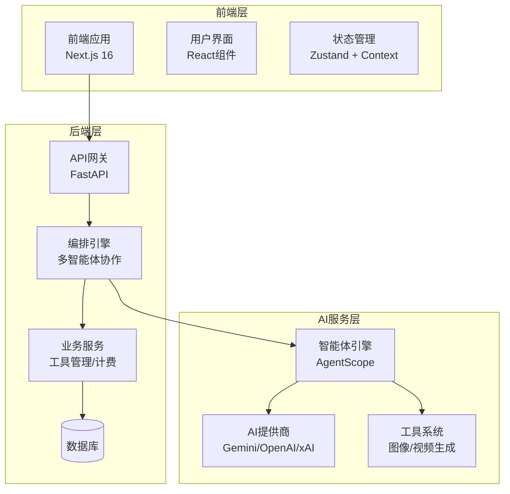

**图表来源**
- [main.py:110-180](file://backend/main.py#L110-L180)
- [config.py:7-43](file://backend/config.py#L7-L43)

### 数据流架构

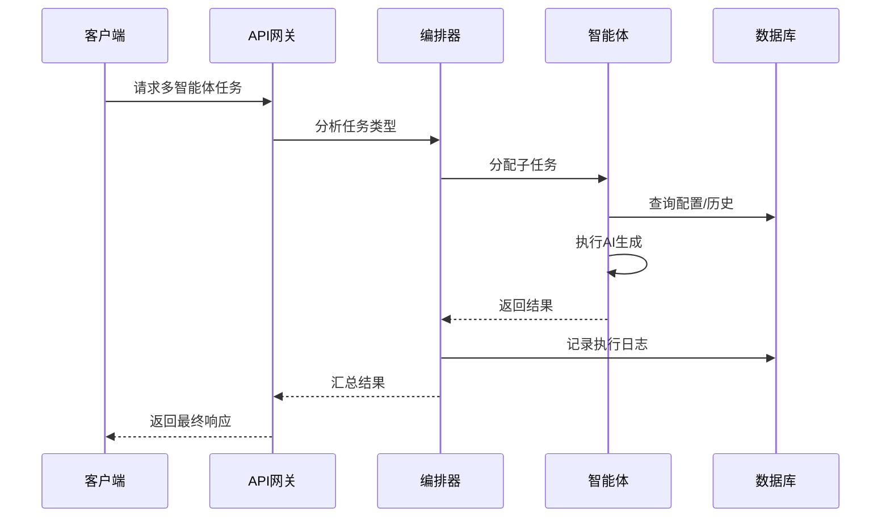

**图表来源**
- [orchestrator.py:448-534](file://backend/services/orchestrator.py#L448-L534)
- [agents.py:16-151](file://backend/routers/agents.py#L16-L151)

**章节来源**
- [README.md:86-131](file://README.md#L86-L131)
- [main.py:32-180](file://backend/main.py#L32-L180)

## 核心组件

### 智能体系统

智能体系统是整个平台的核心，基于AgentScope框架实现多智能体协作。每个智能体都有独特的配置和能力：

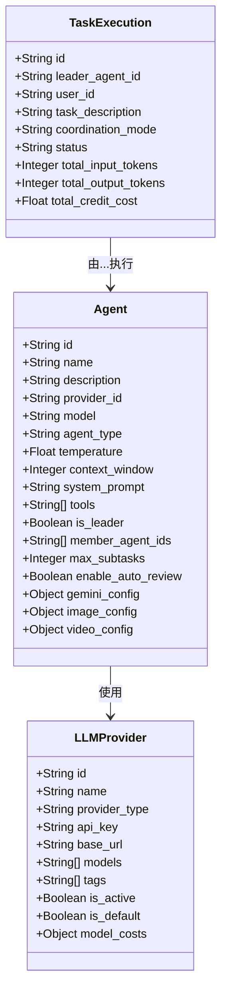

**图表来源**
- [models.py:210-276](file://backend/models.py#L210-L276)
- [models.py:152-176](file://backend/models.py#L152-L176)
- [models.py:306-327](file://backend/models.py#L306-L327)

### 编排引擎

动态编排引擎负责智能体间的任务分配和协作：

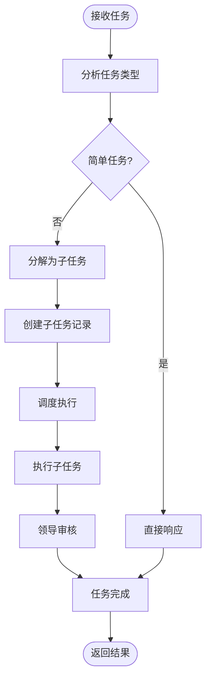

**图表来源**
- [orchestrator.py:418-534](file://backend/services/orchestrator.py#L418-L534)
- [orchestrator.py:231-367](file://backend/services/orchestrator.py#L231-L367)

**章节来源**
- [models.py:210-276](file://backend/models.py#L210-L276)
- [orchestrator.py:1-800](file://backend/services/orchestrator.py#L1-L800)

## 架构概览

### 系统架构图

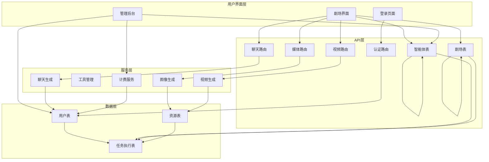

**图表来源**
- [main.py:143-158](file://backend/main.py#L143-L158)
- [database.py:1-45](file://backend/database.py#L1-L45)

### Gemini3集成架构

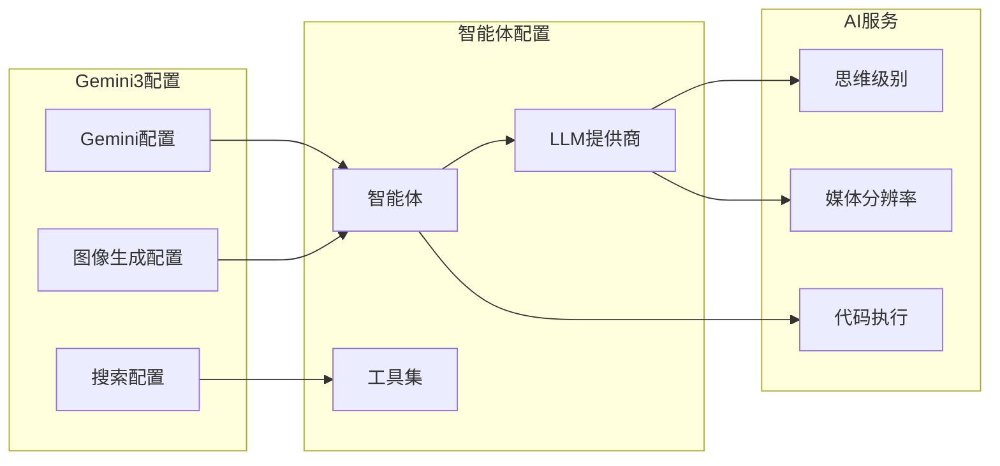

**图表来源**
- [schemas.py:175-194](file://backend/schemas.py#L175-L194)
- [models.py:252-263](file://backend/models.py#L252-L263)

**章节来源**
- [README.md:121-131](file://README.md#L121-L131)
- [Gemini3开发者指南.md:90-168](file://Gemini3开发者指南.md#L90-L168)

## 详细组件分析

### 开发环境配置

开发环境通过Python脚本自动化配置，支持一键启动所有服务：

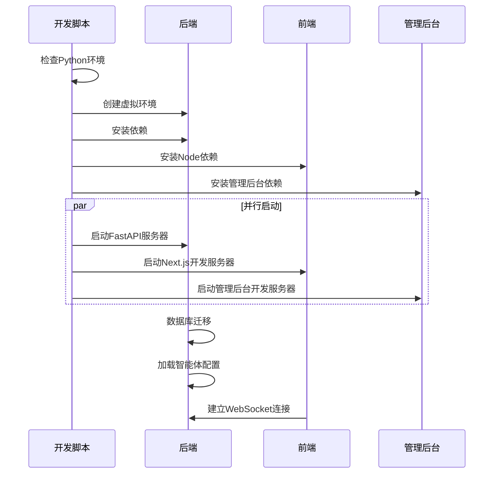

**图表来源**
- [dev.py:94-169](file://dev.py#L94-L169)
- [main.py:49-108](file://backend/main.py#L49-L108)

### 数据库设计

系统采用关系型数据库设计，支持复杂的多对多关系：

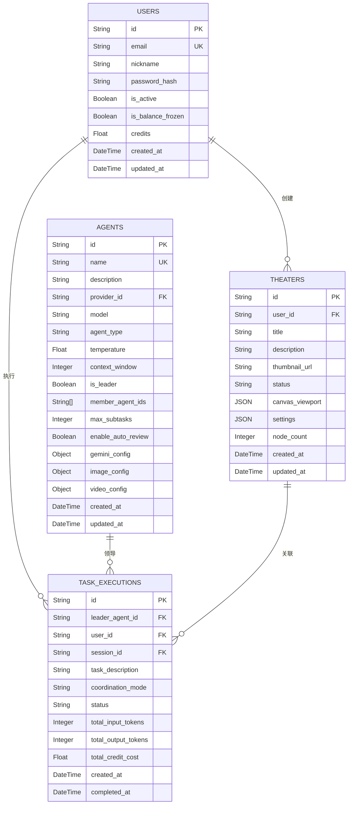

**图表来源**
- [models.py:35-73](file://backend/models.py#L35-L73)
- [models.py:210-276](file://backend/models.py#L210-L276)
- [models.py:306-327](file://backend/models.py#L306-L327)

**章节来源**
- [dev.py:1-169](file://dev.py#L1-L169)
- [database.py:1-45](file://backend/database.py#L1-L45)
- [models.py:1-506](file://backend/models.py#L1-L506)

### Skills系统

Skills系统提供了可扩展的功能模块，支持内置和自定义技能：

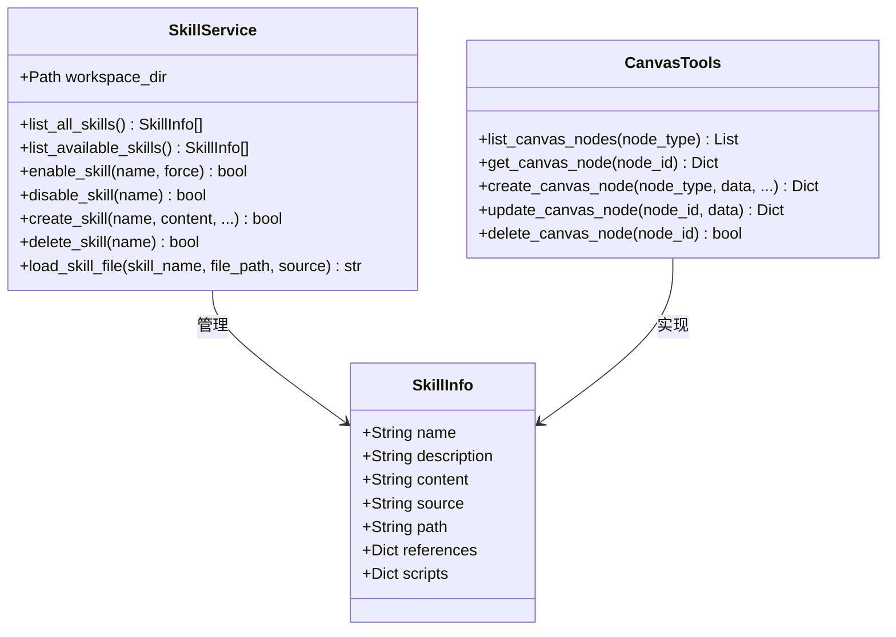

**图表来源**
- [skills_manager.py:263-408](file://backend/skills_manager.py#L263-L408)
- [SKILL.md:1-141](file://backend/skills/builtin_skills/canvas_tools/SKILL.md#L1-L141)

**章节来源**
- [skills_manager.py:1-408](file://backend/skills_manager.py#L1-L408)
- [SKILL.md:1-141](file://backend/skills/builtin_skills/canvas_tools/SKILL.md#L1-L141)

## 依赖关系分析

### 后端依赖关系

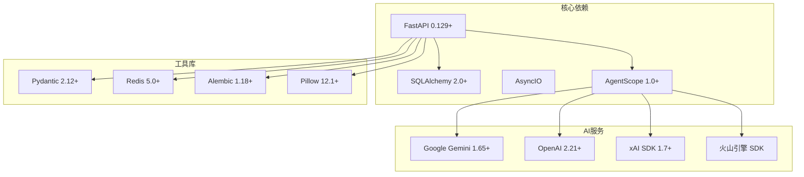

**图表来源**
- [requirements.txt:1-29](file://backend/requirements.txt#L1-L29)

### 前端依赖关系

```mermaid
graph TB
subgraph "UI框架"
NextJS[Next.js 16]
AntD[Ant Design 6]
Tailwind[Tailwind CSS 4]
end
subgraph "状态管理"
Zustand[Zustand 5.0+]
SWR[SWR 2.4+]
end
subgraph "编辑器"
Tiptap[Tiptap 3.20+]
ReactFlow[@xyflow/react 12.10+]
end
subgraph "工具库"
Axios[Axios 1.13+]
UUID[UUID 13.0+]
SocketIO[Socket.IO 4.8+]
end
NextJS --> AntD
NextJS --> Zustand
NextJS --> Tiptap
NextJS --> ReactFlow
Zustand --> SWR
Tiptap --> ReactFlow
NextJS --> Axios
NextJS --> SocketIO
```

**图表来源**
- [package.json:13-96](file://frontend/package.json#L13-L96)

**章节来源**
- [requirements.txt:1-29](file://backend/requirements.txt#L1-L29)
- [package.json:13-96](file://frontend/package.json#L13-L96)

## 性能考虑

### 数据库优化

系统采用了多项数据库优化策略：

1. **连接池配置**：SQLite使用WAL模式，PostgreSQL使用连接池
2. **异步操作**：所有数据库操作都是异步的
3. **预连接检查**：启动时验证数据库连接
4. **超时设置**：合理的连接和操作超时配置

### 缓存策略

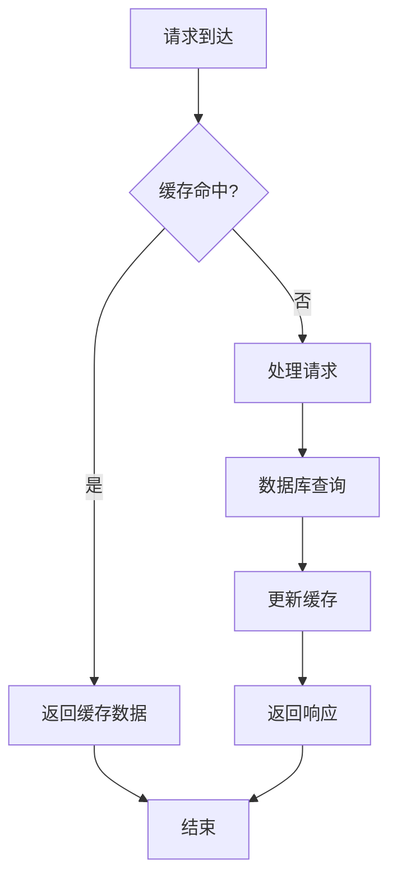

### 性能监控

系统内置了多种性能监控机制：

- **日志系统**：详细的请求日志和错误日志
- **计费统计**：实时的token使用和成本统计
- **任务监控**：多智能体任务执行状态跟踪
- **资源使用**：内存和CPU使用情况监控

## 故障排除指南

### 常见问题

1. **数据库连接失败**
   - 检查DATABASE_URL配置
   - 验证数据库服务是否启动
   - 查看连接超时设置

2. **智能体配置错误**
   - 确认provider_id存在且有效
   - 验证模型名称在提供商列表中
   - 检查API密钥配置

3. **Skills加载失败**
   - 确认SKILL.md文件格式正确
   - 检查文件权限
   - 验证工作目录配置

### 调试方法

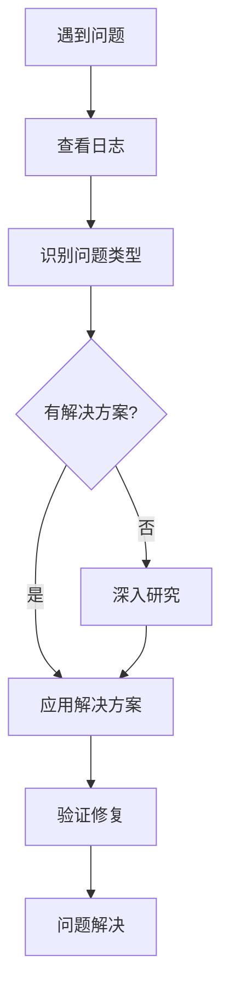

### 开发环境问题

1. **端口冲突**
   - 后端：8000端口
   - 前端：3666端口
   - 管理后台：3001端口

2. **依赖安装问题**
   - 清理缓存后重新安装
   - 检查网络连接
   - 使用代理或更换镜像源

**章节来源**
- [main.py:119-128](file://backend/main.py#L119-L128)
- [config.py:15-43](file://backend/config.py#L15-L43)

## 结论

KunFlix项目展现了现代AI内容创作平台的技术架构和实现思路。通过模块化的组件设计、强大的多智能体协作能力和完善的工具生态系统，为影视广告创作提供了全面的解决方案。

### 主要优势

1. **架构清晰**：前后端分离，职责明确
2. **扩展性强**：Skills系统支持功能扩展
3. **性能优秀**：异步架构和数据库优化
4. **开发友好**：完善的开发工具和文档

### 发展方向

1. **AI能力增强**：集成更多AI模型和服务
2. **用户体验优化**：改进界面和交互体验
3. **性能提升**：进一步优化系统性能
4. **生态建设**：构建更丰富的工具和插件生态

该项目为AI内容创作领域提供了一个优秀的参考实现，具有很高的学习价值和实用价值。