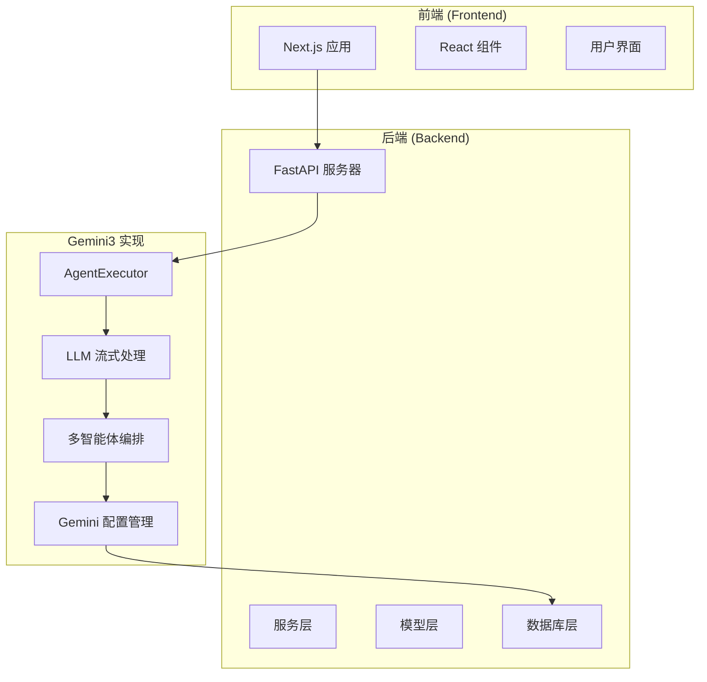
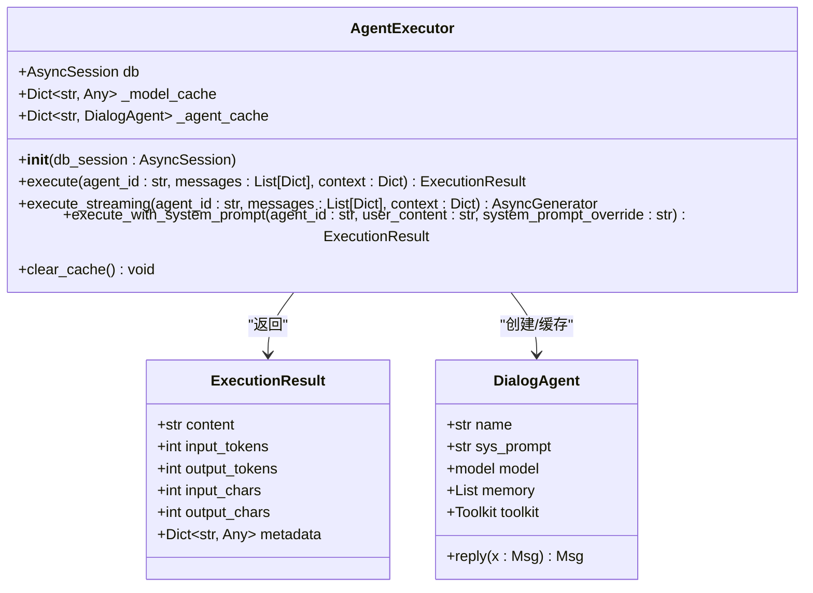
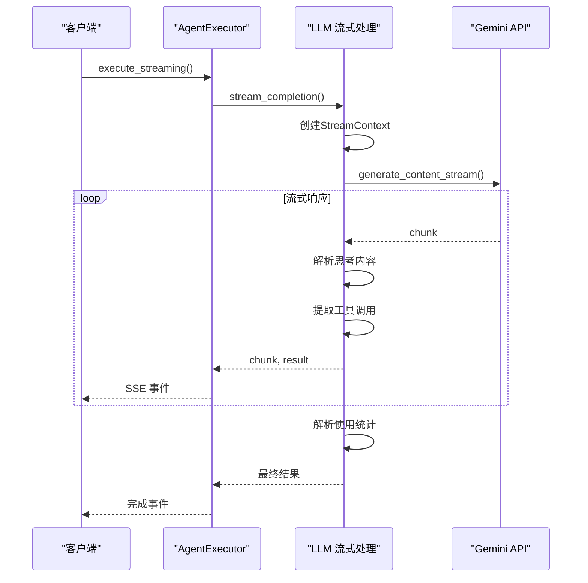
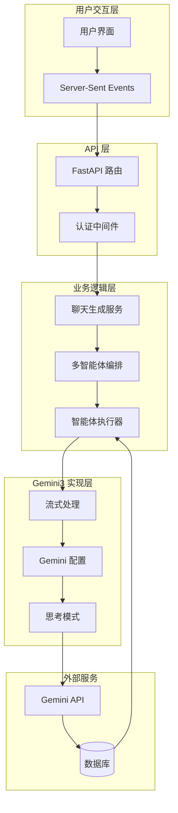
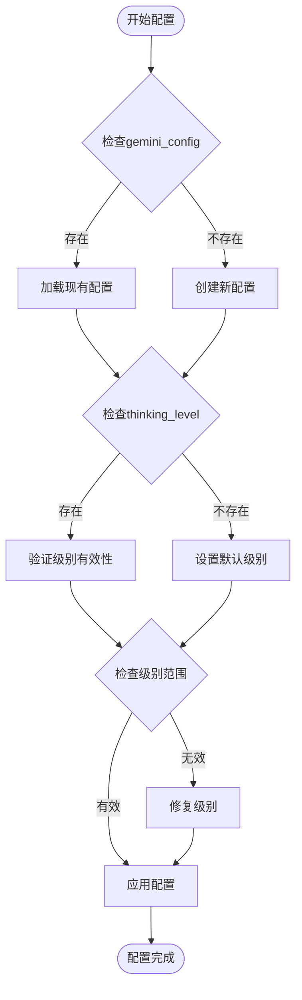
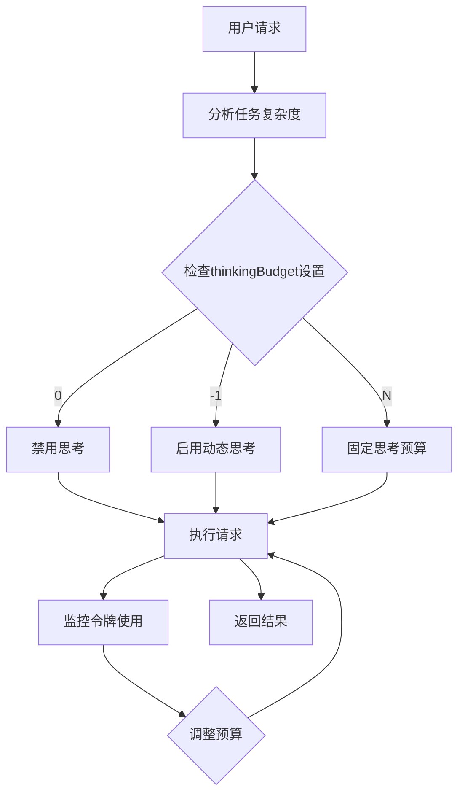
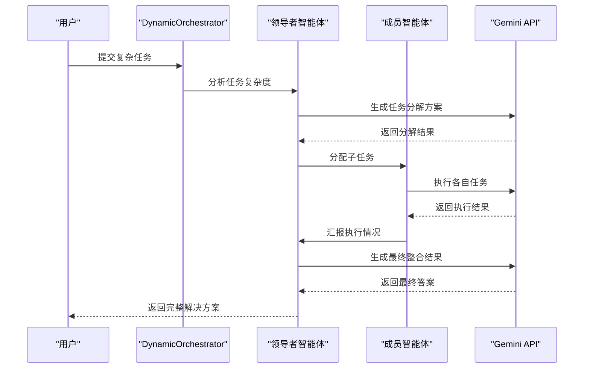
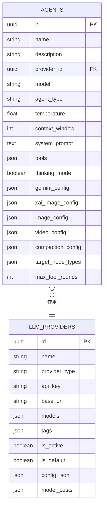
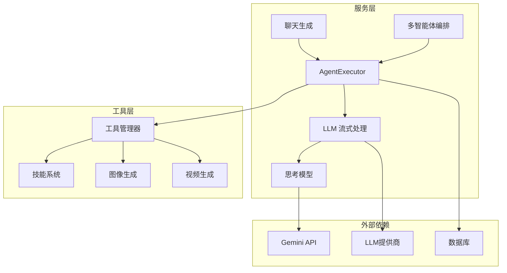

# Gemini3思考模型指南

<cite>
**本文档引用的文件**
- [Gemini3思考模型指南.md](file://Gemini3思考模型指南.md)
- [agent_executor.py](file://backend/services/agent_executor.py)
- [llm_stream.py](file://backend/services/llm_stream.py)
- [chat_generation.py](file://backend/services/chat_generation.py)
- [orchestrator.py](file://backend/services/orchestrator.py)
- [models.py](file://backend/models.py)
- [agents.py](file://backend/agents.py)
- [e1f2a3b4c5d6_add_gemini_config.py](file://backend/migrations/versions/e1f2a3b4c5d6_add_gemini_config.py)
</cite>

## 目录
1. [简介](#简介)
2. [项目结构](#项目结构)
3. [核心组件](#核心组件)
4. [架构概览](#架构概览)
5. [详细组件分析](#详细组件分析)
6. [依赖关系分析](#依赖关系分析)
7. [性能考虑](#性能考虑)
8. [故障排除指南](#故障排除指南)
9. [结论](#结论)

## 简介

Gemini3思考模型是Google开发的高级人工智能模型系列，具有强大的内部"思考过程"能力，显著提升了推理和多步骤规划能力。该模型系列特别适用于复杂的任务，如编程、高级数学和数据分析。

本文档详细介绍了如何在Infinite Game项目中实现和使用Gemini3思考模型，包括思考模式的配置、控制参数、思维过程跟踪以及在多智能体协作中的应用。

## 项目结构

Infinite Game项目采用前后端分离架构，后端使用Python FastAPI框架，前端使用Next.js。Gemini3思考模型的实现主要集中在后端的服务层。

**图表来源**
- [agent_executor.py:1-287](file://backend/services/agent_executor.py#L1-L287)
- [llm_stream.py:1-1073](file://backend/services/llm_stream.py#L1-L1073)

**章节来源**
- [agent_executor.py:1-287](file://backend/services/agent_executor.py#L1-L287)
- [llm_stream.py:1-1073](file://backend/services/llm_stream.py#L1-L1073)

## 核心组件

### AgentExecutor - 智能体执行器

AgentExecutor是Gemini3思考模型的核心执行组件，负责统一管理各种LLM提供商的对话代理执行。

**图表来源**
- [agent_executor.py:63-287](file://backend/services/agent_executor.py#L63-L287)
- [agents.py:40-175](file://backend/agents.py#L40-L175)

### LLM 流式处理系统

LLM流式处理系统实现了统一的流式调用接口，支持多种LLM提供商，包括Gemini3思考模型。

**图表来源**
- [agent_executor.py:127-162](file://backend/services/agent_executor.py#L127-L162)
- [llm_stream.py:923-1011](file://backend/services/llm_stream.py#L923-L1011)

**章节来源**
- [agent_executor.py:63-287](file://backend/services/agent_executor.py#L63-L287)
- [llm_stream.py:1016-1073](file://backend/services/llm_stream.py#L1016-L1073)

## 架构概览

Gemini3思考模型在Infinite Game项目中的整体架构如下：

**图表来源**
- [chat_generation.py:29-475](file://backend/services/chat_generation.py#L29-L475)
- [orchestrator.py:418-475](file://backend/services/orchestrator.py#L418-L475)

## 详细组件分析

### Gemini3 思考配置管理

Gemini3思考模型的配置管理是通过gemini_config字段实现的，该字段存储了思考级别的设置和其他Gemini特定的配置参数。

**图表来源**
- [models.py:252-282](file://backend/models.py#L252-L282)
- [llm_stream.py:769-836](file://backend/services/llm_stream.py#L769-L836)

### 思考级别控制机制

Gemini3支持四种思考级别：minimal、low、medium、high，每种级别对应不同的推理深度和性能特征。

| 思考级别 | Gemini 3.1 Pro | Gemini 3.1 Flash-Lite | Gemini 3 Flash | 描述 |
|---------|---------------|---------------------|---------------|------|
| `minimal` | 不支持 | 支持（默认） | 支持 | 匹配"无思考"设置，最小化延迟，注意`minimal`不保证思考关闭 |
| `low` | 支持 | 支持 | 支持 | 最小化延迟和成本，适合简单指令跟随、聊天或高吞吐量应用 |
| `medium` | 支持 | 支持 | 支持 | 大多数任务的平衡思考 |
| `high` | 支持（默认，动态） | 支持（动态） | 支持（默认，动态） | 最大化推理深度，可能需要更长时间到达第一个输出令牌 |

**章节来源**
- [Gemini3思考模型指南.md:367-483](file://Gemini3思考模型指南.md#L367-L483)
- [llm_stream.py:625-632](file://backend/services/llm_stream.py#L625-L632)

### 思考预算管理

对于Gemini 2.5系列模型，使用thinkingBudget参数来指导模型在推理中使用的特定思考令牌数量。

**图表来源**
- [Gemini3思考模型指南.md:485-614](file://Gemini3思考模型指南.md#L485-L614)

**章节来源**
- [Gemini3思考模型指南.md:485-614](file://Gemini3思考模型指南.md#L485-L614)

### 多智能体协作中的思考模型

在多智能体协作场景中，Gemini3思考模型通过DynamicOrchestrator进行统一管理，支持任务分析、子任务分解和智能体编排。

**图表来源**
- [orchestrator.py:418-475](file://backend/services/orchestrator.py#L418-L475)
- [chat_multi_agent.py:39-73](file://backend/services/chat_multi_agent.py#L39-L73)

**章节来源**
- [orchestrator.py:418-475](file://backend/services/orchestrator.py#L418-L475)
- [chat_multi_agent.py:39-73](file://backend/services/chat_multi_agent.py#L39-L73)

## 依赖关系分析

### 数据库模型依赖

Gemini3思考模型的配置信息存储在Agent模型的gemini_config字段中，通过数据库迁移实现向后兼容性。

**图表来源**
- [models.py:210-276](file://backend/models.py#L210-L276)

### 服务层依赖关系

**图表来源**
- [agent_executor.py:1-287](file://backend/services/agent_executor.py#L1-L287)
- [llm_stream.py:1-1073](file://backend/services/llm_stream.py#L1-L1073)

**章节来源**
- [models.py:210-276](file://backend/models.py#L210-L276)
- [agent_executor.py:1-287](file://backend/services/agent_executor.py#L1-L287)

## 性能考虑

### 思考模式对性能的影响

Gemini3思考模式的性能影响主要体现在以下方面：

1. **延迟增加**：思考级别越高，模型需要更多时间来生成思考过程
2. **成本增加**：思考过程会产生额外的令牌消耗
3. **内存使用**：思考过程需要更多的内存来存储中间状态

### 优化建议

1. **合理选择思考级别**：
   - 简单任务使用`low`或`minimal`
   - 复杂任务使用`medium`或`high`
   - 根据业务需求平衡性能和质量

2. **批量处理优化**：
   - 对于大量相似请求，考虑批处理以提高效率
   - 合理设置上下文窗口大小

3. **缓存策略**：
   - 缓存常用的智能体配置
   - 利用模型缓存减少初始化开销

## 故障排除指南

### 常见问题及解决方案

#### 思考模式配置错误

**问题**：思考模式无法正确启用或禁用

**解决方案**：
1. 检查gemini_config字段格式是否正确
2. 验证thinking_level值是否在允许范围内
3. 确认Gemini API版本支持所选配置

#### 思考过程丢失

**问题**：思考过程标签丢失导致内容解析错误

**解决方案**：
1. 检查Gemini API响应中的thought属性
2. 确保正确的思考状态转换逻辑
3. 验证思考标签的正确闭合

#### 思考预算超限

**问题**：思考预算设置不当导致请求失败

**解决方案**：
1. 根据任务复杂度调整thinkingBudget
2. 监控令牌使用情况
3. 设置合理的预算上限

**章节来源**
- [llm_stream.py:929-1011](file://backend/services/llm_stream.py#L929-L1011)

## 结论

Gemini3思考模型为Infinite Game项目提供了强大的推理和规划能力。通过精心设计的架构和配置管理，系统能够灵活地控制思考过程的深度和性能，满足不同场景的需求。

关键优势包括：
- **灵活的思考级别控制**：支持从minimal到high的完整范围
- **统一的执行接口**：简化了多提供商的集成
- **智能的多智能体协作**：利用思考模型提升团队协作效率
- **完善的监控和调试**：提供详细的使用统计和错误诊断

未来的发展方向包括：
- 进一步优化思考过程的性能
- 扩展对更多LLM提供商的支持
- 增强多智能体协作的智能化程度
- 提供更丰富的配置选项和监控功能

通过持续的优化和改进，Gemini3思考模型将继续为Infinite Game项目提供强大的AI能力支撑。