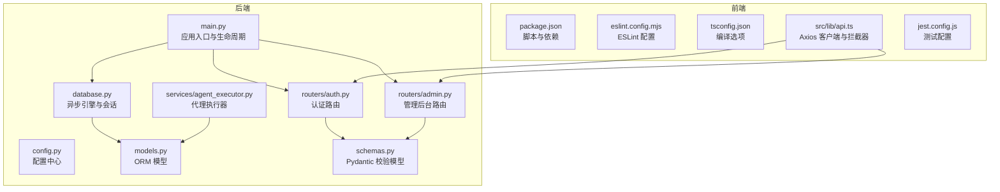
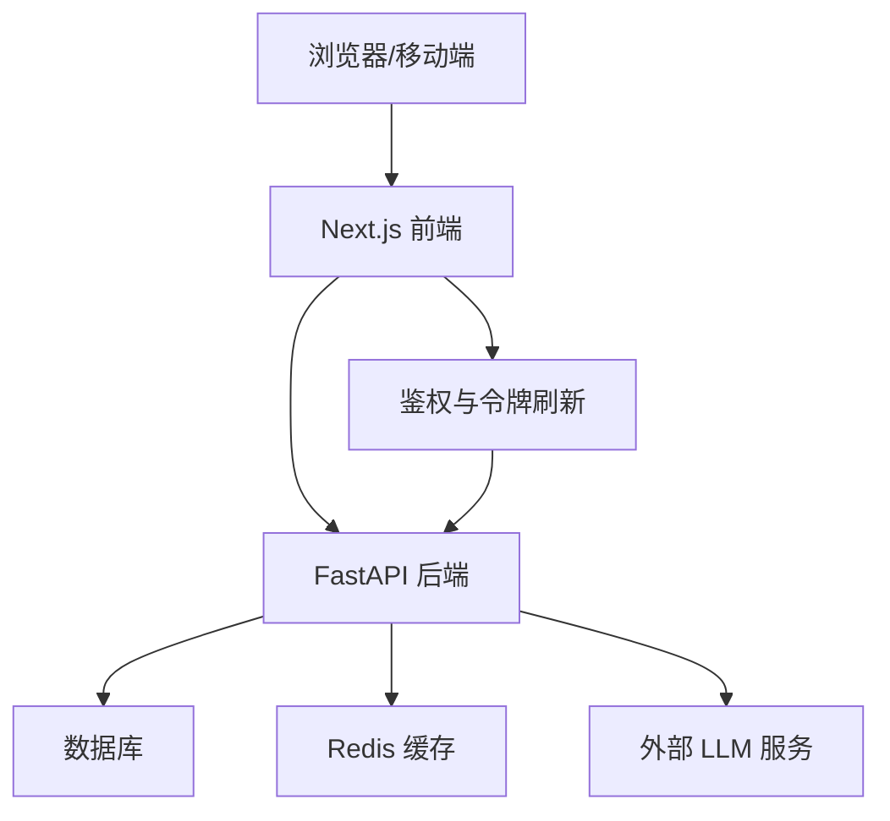
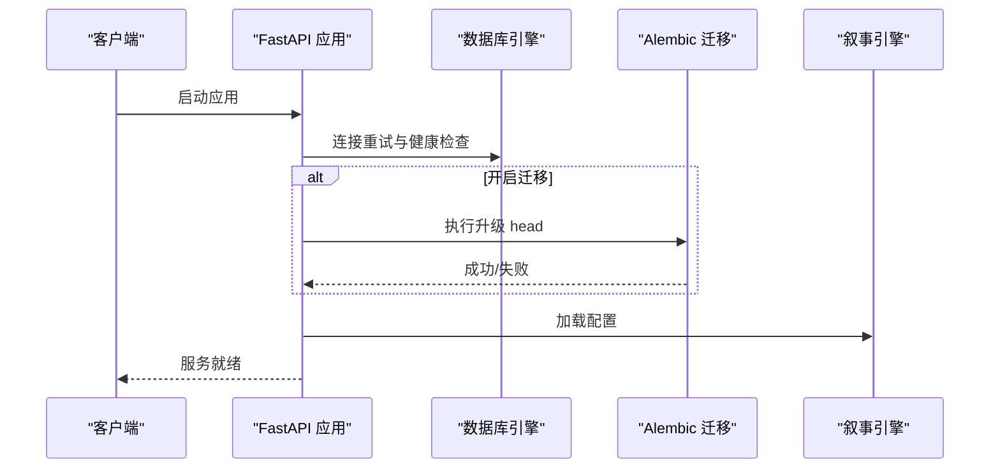
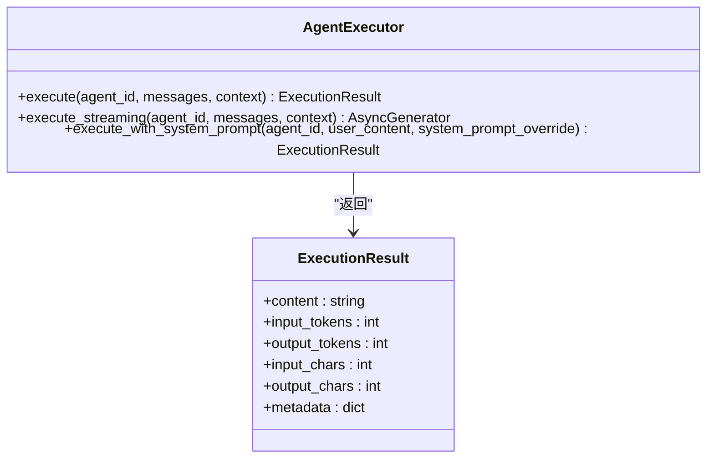
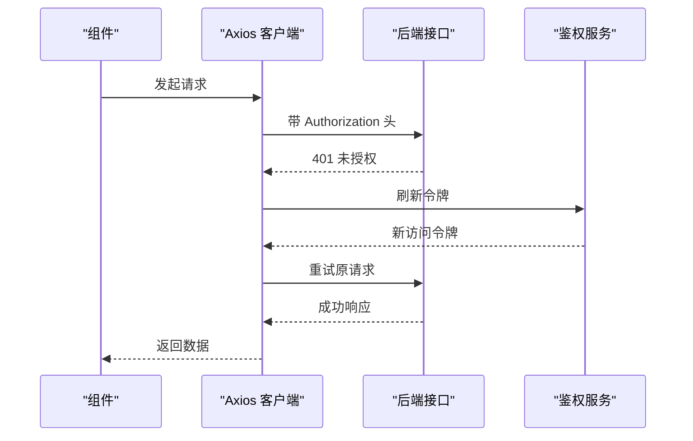
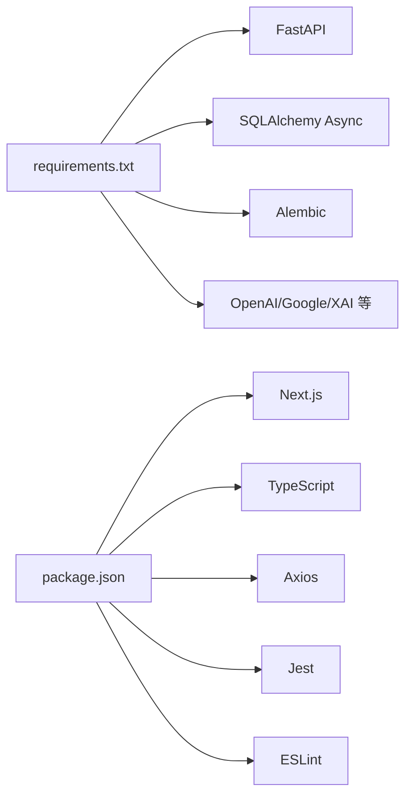

# 代码规范与最佳实践

<cite>
**本文引用的文件**
- [backend/main.py](file://backend/main.py)
- [backend/config.py](file://backend/config.py)
- [backend/requirements.txt](file://backend/requirements.txt)
- [backend/database.py](file://backend/database.py)
- [backend/models.py](file://backend/models.py)
- [backend/schemas.py](file://backend/schemas.py)
- [backend/routers/auth.py](file://backend/routers/auth.py)
- [backend/routers/admin.py](file://backend/routers/admin.py)
- [backend/services/agent_executor.py](file://backend/services/agent_executor.py)
- [backend/admin/.eslintrc.json](file://backend/admin/.eslintrc.json)
- [frontend/eslint.config.mjs](file://frontend/eslint.config.mjs)
- [frontend/package.json](file://frontend/package.json)
- [frontend/tsconfig.json](file://frontend/tsconfig.json)
- [frontend/src/lib/api.ts](file://frontend/src/lib/api.ts)
- [frontend/jest.config.js](file://frontend/jest.config.js)
</cite>

## 目录
1. [引言](#引言)
2. [项目结构](#项目结构)
3. [核心组件](#核心组件)
4. [架构总览](#架构总览)
5. [详细组件分析](#详细组件分析)
6. [依赖分析](#依赖分析)
7. [性能考虑](#性能考虑)
8. [故障排查指南](#故障排查指南)
9. [结论](#结论)
10. [附录](#附录)

## 引言
本文件面向后端 Python 与前端 TypeScript/Next.js 团队，提供统一的代码规范与最佳实践指导，涵盖 PEP 8 编码风格、类型注解、异步编程、前端编码标准、React 组件开发规范、状态管理、Git 提交规范、分支管理与代码评审流程、单元测试规范与覆盖率、测试数据管理、代码质量检查工具配置、静态分析规则、持续集成流程、性能优化、内存与并发最佳实践、重构技巧与技术债管理等。

## 项目结构
本仓库采用前后端分离架构：
- 后端基于 FastAPI + SQLAlchemy Async + Alembic，提供 REST/WebSocket 接口与数据库访问。
- 前端基于 Next.js 16 + React 19 + TypeScript，使用 Zustand 状态管理与自定义 UI 组件库。
- 管理后台位于 backend/admin 下，采用 Next.js App Router 与 ESLint 配置。

图示来源
- [backend/main.py:110-153](file://backend/main.py#L110-L153)
- [backend/database.py:39-45](file://backend/database.py#L39-L45)
- [backend/models.py:10-200](file://backend/models.py#L10-L200)
- [backend/schemas.py:1-200](file://backend/schemas.py#L1-L200)
- [backend/routers/auth.py:30-33](file://backend/routers/auth.py#L30-L33)
- [backend/routers/admin.py:19-23](file://backend/routers/admin.py#L19-L23)
- [backend/services/agent_executor.py:63-200](file://backend/services/agent_executor.py#L63-L200)
- [frontend/package.json:1-94](file://frontend/package.json#L1-L94)
- [frontend/eslint.config.mjs:1-19](file://frontend/eslint.config.mjs#L1-L19)
- [frontend/tsconfig.json:1-35](file://frontend/tsconfig.json#L1-L35)
- [frontend/src/lib/api.ts:1-84](file://frontend/src/lib/api.ts#L1-L84)
- [frontend/jest.config.js:1-20](file://frontend/jest.config.js#L1-L20)

章节来源
- [backend/main.py:110-153](file://backend/main.py#L110-L153)
- [backend/database.py:39-45](file://backend/database.py#L39-L45)
- [backend/models.py:10-200](file://backend/models.py#L10-L200)
- [backend/schemas.py:1-200](file://backend/schemas.py#L1-L200)
- [backend/routers/auth.py:30-33](file://backend/routers/auth.py#L30-L33)
- [backend/routers/admin.py:19-23](file://backend/routers/admin.py#L19-L23)
- [backend/services/agent_executor.py:63-200](file://backend/services/agent_executor.py#L63-L200)
- [frontend/package.json:1-94](file://frontend/package.json#L1-L94)
- [frontend/eslint.config.mjs:1-19](file://frontend/eslint.config.mjs#L1-L19)
- [frontend/tsconfig.json:1-35](file://frontend/tsconfig.json#L1-L35)
- [frontend/src/lib/api.ts:1-84](file://frontend/src/lib/api.ts#L1-L84)
- [frontend/jest.config.js:1-20](file://frontend/jest.config.js#L1-L20)

## 核心组件
- 应用入口与生命周期：负责启动、数据库连接与迁移、CORS、中间件注册、路由挂载与 WebSocket 入口。
- 配置中心：集中管理数据库、Redis、AI 密钥、JWT、默认模型与运行开关。
- 数据库层：异步引擎、连接池、SQLite 优化与会话工厂。
- ORM 模型：用户、管理员、剧场、节点、资产、聊天会话与消息等。
- Pydantic 校验模型：请求/响应数据结构与字段校验。
- 路由模块：认证、管理后台等 API。
- 服务层：代理执行器封装多模型提供商调用与流式输出。
- 前端 Axios 客户端：统一 baseURL、鉴权头注入、401 刷新与队列处理。
- 构建与测试：Next.js 脚本、ESLint 配置、TypeScript 编译、Jest 测试环境。

章节来源
- [backend/main.py:110-175](file://backend/main.py#L110-L175)
- [backend/config.py:7-43](file://backend/config.py#L7-L43)
- [backend/database.py:9-45](file://backend/database.py#L9-L45)
- [backend/models.py:10-200](file://backend/models.py#L10-L200)
- [backend/schemas.py:1-200](file://backend/schemas.py#L1-L200)
- [backend/routers/auth.py:30-136](file://backend/routers/auth.py#L30-L136)
- [backend/routers/admin.py:19-200](file://backend/routers/admin.py#L19-L200)
- [backend/services/agent_executor.py:63-200](file://backend/services/agent_executor.py#L63-L200)
- [frontend/src/lib/api.ts:1-84](file://frontend/src/lib/api.ts#L1-L84)

## 架构总览
后端采用 FastAPI 的异步架构，结合 SQLAlchemy Async 实现高性能数据库访问；前端通过 Next.js 与 React 构建用户界面，Axios 客户端统一处理鉴权与刷新逻辑；管理后台独立于主应用，便于权限与功能隔离。

图示来源
- [backend/main.py:130-153](file://backend/main.py#L130-L153)
- [backend/config.py:18-29](file://backend/config.py#L18-L29)
- [backend/services/agent_executor.py:46-61](file://backend/services/agent_executor.py#L46-L61)
- [frontend/src/lib/api.ts:31-81](file://frontend/src/lib/api.ts#L31-L81)

## 详细组件分析

### 后端：应用入口与生命周期
- 生命周期管理：启动时进行数据库连接重试、可选自动迁移、Narrative 引擎初始化、媒体目录确保。
- 中间件：CORS 允许本地开发源；调试中间件记录授权头与来源。
- 路由注册：按模块化挂载认证、管理、代理、聊天、视频、剧院等路由。
- WebSocket：简单回显示例，便于后续扩展实时交互。

图示来源
- [backend/main.py:49-108](file://backend/main.py#L49-L108)

章节来源
- [backend/main.py:49-175](file://backend/main.py#L49-L175)

### 后端：配置中心
- 支持 SQLite 与 PostgreSQL 两种数据库模式，默认 SQLite 便于本地开发。
- Redis、AI 密钥、JWT 参数、默认模型、是否在启动时执行迁移等集中配置。
- 从 .env 文件加载环境变量。

章节来源
- [backend/config.py:7-43](file://backend/config.py#L7-L43)

### 后端：数据库与会话
- 异步引擎：连接池预热、溢出连接、SQLite 特殊 PRAGMA 优化（WAL、busy_timeout、synchronous）。
- 会话工厂：非过期提交策略，降低事务开销。
- 依赖注入：get_db 提供异步上下文。

章节来源
- [backend/database.py:9-45](file://backend/database.py#L9-L45)

### 后端：ORM 模型
- 用户、管理员、剧场、节点、边、资产、聊天会话与消息等核心实体。
- UUID 主键、JSON 扩展字段、时间戳、外键约束与级联删除策略。
- 适合多租户与扩展场景的数据结构设计。

章节来源
- [backend/models.py:10-200](file://backend/models.py#L10-L200)

### 后端：Pydantic 校验模型
- 用户/管理员注册、登录、令牌刷新、响应模型。
- LLM 提供商配置、Gemini 图像配置、xAI 图像配置等复杂嵌套模型。
- 字段长度、枚举值、数值范围等严格校验。

章节来源
- [backend/schemas.py:13-120](file://backend/schemas.py#L13-L120)
- [backend/schemas.py:175-200](file://backend/schemas.py#L175-L200)

### 后端：认证路由
- 注册：邮箱唯一性检查、密码哈希、IP 记录。
- 登录：凭据验证、账户状态检查、签发 JWT、更新登录元数据。
- 刷新：校验刷新令牌类型与用户有效性，签发新访问令牌。
- 当前用户：基于依赖注入获取已激活用户。

章节来源
- [backend/routers/auth.py:36-136](file://backend/routers/auth.py#L36-L136)

### 后端：管理后台路由
- 仪表盘统计：用户、剧场、资产、提供商、管理员数量。
- 用户管理：分页列表、详情查询、软/硬删除（含级联清理）。
- 积分管理：手动调整、历史查询、交易记录。

章节来源
- [backend/routers/admin.py:29-200](file://backend/routers/admin.py#L29-L200)

### 后端：代理执行器
- 统一代理执行接口：加载代理配置与提供商、构建缓存 DialogAgent、标准化内容、提取 token 使用。
- 流式输出：绕过 DialogAgent，直接调用流式完成接口，逐块产出结果。
- 系统提示覆盖：支持任务分解等场景下的临时系统提示。

图示来源
- [backend/services/agent_executor.py:63-200](file://backend/services/agent_executor.py#L63-L200)

章节来源
- [backend/services/agent_executor.py:63-200](file://backend/services/agent_executor.py#L63-L200)

### 前端：ESLint 与 TypeScript 配置
- ESLint：基于 next/core-web-vitals 与 next/typescript，覆盖现代 Web 最佳实践。
- TypeScript：严格模式、JSX、路径别名、增量编译、bundler 解析。
- 依赖与脚本：Next.js、React、Ant Design、Tailwind、Jest、SWR、Zustand 等。

章节来源
- [frontend/eslint.config.mjs:1-19](file://frontend/eslint.config.mjs#L1-L19)
- [frontend/tsconfig.json:1-35](file://frontend/tsconfig.json#L1-L35)
- [frontend/package.json:1-94](file://frontend/package.json#L1-L94)

### 前端：Axios 客户端与鉴权拦截
- baseURL 统一指向 /api。
- 请求拦截：自动附加 Bearer Token。
- 响应拦截：401 时排队并发请求、刷新令牌、重试原请求、失败跳转登录页。
- 与后端路由配合，实现透明鉴权与刷新。

图示来源
- [frontend/src/lib/api.ts:31-81](file://frontend/src/lib/api.ts#L31-L81)
- [backend/routers/auth.py:102-129](file://backend/routers/auth.py#L102-L129)

章节来源
- [frontend/src/lib/api.ts:1-84](file://frontend/src/lib/api.ts#L1-84)
- [backend/routers/auth.py:102-129](file://backend/routers/auth.py#L102-L129)

### 前端：测试配置
- Jest 与 Next.js 集成，DOM 环境，模块映射到 @/src。
- 与前端覆盖率报告配合，形成端到端测试闭环。

章节来源
- [frontend/jest.config.js:1-20](file://frontend/jest.config.js#L1-L20)

## 依赖分析
- 后端依赖：FastAPI、Uvicorn、SQLAlchemy Async、Pydantic Settings、Redis、Websockets、Alembic、AI SDKs、bcrypt、JWKS 等。
- 前端依赖：Next.js、React、Ant Design、Tailwind、Axios、SWR、Zustand、Jest、ESLint、TypeScript 等。

图示来源
- [backend/requirements.txt:1-29](file://backend/requirements.txt#L1-L29)
- [frontend/package.json:13-92](file://frontend/package.json#L13-L92)

章节来源
- [backend/requirements.txt:1-29](file://backend/requirements.txt#L1-L29)
- [frontend/package.json:13-92](file://frontend/package.json#L13-L92)

## 性能考虑
- 异步与连接池：使用 SQLAlchemy Async 与连接池参数，减少阻塞与上下文切换。
- SQLite 优化：WAL 模式、busy_timeout、synchronous 平衡，降低锁竞争。
- 流式输出：代理执行器支持流式完成，降低首字节延迟与内存峰值。
- 前端缓存：SWR 与 Zustand 结合，避免重复请求与过度渲染。
- CORS 与中间件：最小化中间件数量，避免链路冗余。

章节来源
- [backend/database.py:21-31](file://backend/database.py#L21-L31)
- [backend/services/agent_executor.py:127-162](file://backend/services/agent_executor.py#L127-L162)
- [frontend/src/lib/api.ts:1-84](file://frontend/src/lib/api.ts#L1-L84)

## 故障排查指南
- 数据库连接失败：查看启动日志中的重试次数与最终错误；确认 .env 配置与数据库可达性。
- 迁移失败：若出现临时表残留，应用内置清理逻辑后重试；必要时手动清理残留表。
- WebSocket 错误：捕获异常并关闭连接，检查客户端断线重连策略。
- 401 未授权：确认本地存储的 refresh_token 是否存在；刷新失败则清空并跳转登录页。
- CORS 问题：核对允许的 origins、credentials、methods 与 headers。

章节来源
- [backend/main.py:49-108](file://backend/main.py#L49-L108)
- [backend/main.py:161-171](file://backend/main.py#L161-L171)
- [frontend/src/lib/api.ts:31-81](file://frontend/src/lib/api.ts#L31-L81)

## 结论
本项目在后端采用现代化异步架构与严格的配置管理，在前端遵循 Next.js 与 TypeScript 最佳实践，并通过 Axios 拦截器实现透明鉴权。建议在现有基础上完善单元测试覆盖率、静态分析规则与 CI 流程，持续优化性能与可维护性。

## 附录

### Python 后端编码规范与最佳实践
- PEP 8 风格
  - 行宽不超过 100；函数/类之间空两行；导入分组（标准库、第三方、本地）。
  - 变量与函数使用 snake_case；常量使用 UPPER_CASE；类名使用 PascalCase。
  - 异步函数使用 async def；回调与事件处理器命名清晰。
- 类型注解
  - 函数签名、类属性、返回值与异常类型均标注明确类型。
  - 使用 typing.Optional、typing.List、typing.Dict、typing.AsyncGenerator 等。
- 异步编程
  - 使用 SQLAlchemy Async 与 async/await；避免在事件循环中执行阻塞操作。
  - 在 main.py 中统一设置事件循环策略与 UTF-8 编码，确保 Windows 环境稳定。
  - WebSocket 与 SSE 场景中，注意异常捕获与连接关闭。
- 错误处理
  - 明确区分业务异常与系统异常；使用 HTTPException 提供清晰错误信息。
  - 对数据库操作进行 try/except 包裹，并在 finally 中释放资源。
- 配置与环境
  - 使用 Pydantic Settings 从 .env 加载配置；敏感信息不写入代码。
  - 支持 SQLite 与 PostgreSQL，生产环境优先 PostgreSQL。
- 数据库与模型
  - 使用 UUID 主键；JSON 字段用于扩展；合理设置索引与外键。
  - 迁移脚本与 Alembic 升级保持幂等与可回滚。
- 路由与服务
  - 路由按功能模块拆分；依赖注入 get_db；服务层封装业务逻辑。
  - 代理执行器统一多模型提供商调用，支持流式输出与系统提示覆盖。

章节来源
- [backend/main.py:1-175](file://backend/main.py#L1-L175)
- [backend/config.py:1-43](file://backend/config.py#L1-L43)
- [backend/database.py:1-45](file://backend/database.py#L1-L45)
- [backend/models.py:1-200](file://backend/models.py#L1-L200)
- [backend/schemas.py:1-200](file://backend/schemas.py#L1-L200)
- [backend/routers/auth.py:1-136](file://backend/routers/auth.py#L1-L136)
- [backend/routers/admin.py:1-200](file://backend/routers/admin.py#L1-L200)
- [backend/services/agent_executor.py:1-200](file://backend/services/agent_executor.py#L1-L200)

### TypeScript/React 前端编码标准与最佳实践
- 编码标准
  - ESLint 遵循 next/core-web-vitals 与 next/typescript；禁用全局忽略，确保全量检查。
  - TypeScript 严格模式，使用 JSX；路径别名 @/* 指向 src；增量编译提升构建速度。
- React 组件开发
  - 函数组件 + Hooks；组件职责单一；Props 明确类型；避免深层嵌套。
  - 使用 Radix UI 与 Ant Design 组合，保证一致性与可访问性。
- 状态管理
  - Zustand 简化状态逻辑；避免全局状态污染；按域划分 Store。
- Axios 客户端
  - 统一 baseURL 与拦截器；401 自动刷新与队列重试；失败清空本地存储并跳转登录。
- 测试
  - Jest + jsdom；模块映射到 @/src；与覆盖率报告联动。

章节来源
- [frontend/eslint.config.mjs:1-19](file://frontend/eslint.config.mjs#L1-L19)
- [frontend/tsconfig.json:1-35](file://frontend/tsconfig.json#L1-L35)
- [frontend/package.json:1-94](file://frontend/package.json#L1-L94)
- [frontend/src/lib/api.ts:1-84](file://frontend/src/lib/api.ts#L1-L84)
- [frontend/jest.config.js:1-20](file://frontend/jest.config.js#L1-L20)

### Git 提交规范、分支管理与代码评审流程
- 提交规范
  - 类型：feat、fix、docs、style、refactor、perf、test、build、ci、chore、revert
  - 格式：type(scope): subject；正文描述动机与影响；footer 关联 Issue。
- 分支管理
  - develop：集成主干；feature/*：功能开发；hotfix/*：紧急修复；release/*：发布准备。
  - Pull Request 合并前必须通过 CI 与代码评审。
- 代码评审
  - 至少一名 reviewer；关注安全性、可维护性、性能与测试覆盖。
  - 评审清单：变更范围、错误处理、日志与监控、兼容性与回归风险。

### 单元测试编写规范、覆盖率与测试数据管理
- 编写规范
  - 每个模块至少包含核心功能的单元测试；使用 describe/it 组织用例。
  - Mock 外部依赖（如数据库、HTTP 客户端）；断言清晰且可读。
- 覆盖率
  - 建议语句覆盖率 ≥ 80%，分支覆盖率 ≥ 70%，行覆盖率 ≥ 80%。
- 测试数据
  - 使用 fixtures 或工厂函数构造测试数据；确保可重复与隔离。
  - 前端测试使用 jsdom 与 Testing Library；后端使用 pytest 或 FastAPI TestClient。

章节来源
- [frontend/jest.config.js:1-20](file://frontend/jest.config.js#L1-L20)

### 代码质量检查工具配置与静态分析
- Python
  - Flake8/Black/Pylance（VS Code）；mypy 进行类型检查；bandit 安全扫描。
- TypeScript
  - ESLint + TypeScript Parser；TSLint 已被弃用，使用 ESLint 完整覆盖。
- 静态分析规则
  - 禁止 console.warn/console.error；禁止 any 类型滥用；禁止魔法数字。
  - 路由与服务层禁止直接操作数据库，必须通过依赖注入。

### 持续集成流程
- 触发条件：push 到 feature/*、hotfix/*、PR 到 develop/release/*。
- 步骤：安装依赖 → Lint 与类型检查 → 单测与覆盖率 → 构建 → 部署预览（可选）。
- 失败保护：覆盖率阈值不达标或测试失败阻止合并。

### 性能优化指南、内存管理与并发最佳实践
- 后端
  - 使用 SQLAlchemy Async 与连接池；SQLite 使用 WAL 模式与 PRAGMA 优化。
  - 代理执行器支持流式输出，降低内存峰值；缓存模型与代理实例。
- 前端
  - SWR 缓存与去重；Zustand 精简状态；虚拟滚动与懒加载。
  - 避免不必要的 re-render；使用 React.memo/useMemo/useCallback。

### 重构技巧、架构演进与技术债管理
- 重构原则：小步快跑、自动化测试护航、逐步替换。
- 架构演进：从单体到微服务（按领域拆分）、引入事件驱动（消息队列）。
- 技术债：建立债项清单与优先级；定期评估与偿还计划；在 PR 中记录债项与缓解措施。