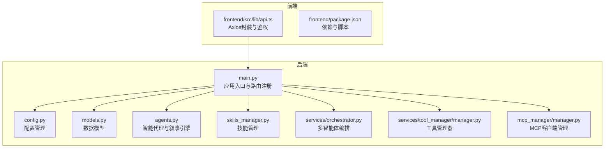
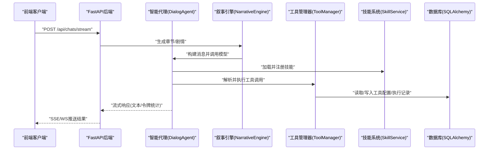
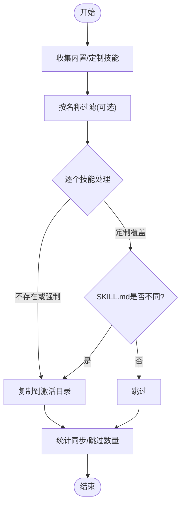
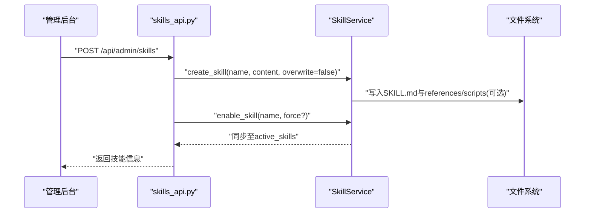
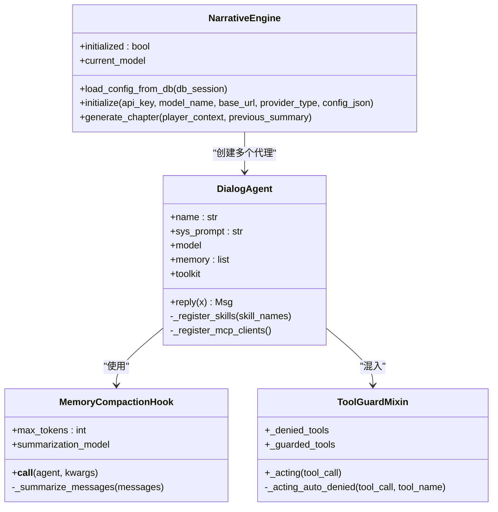
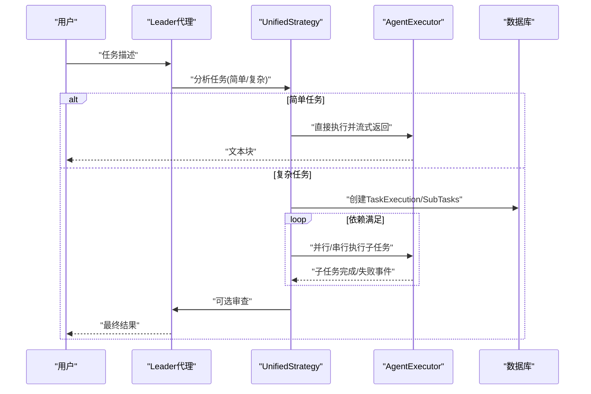
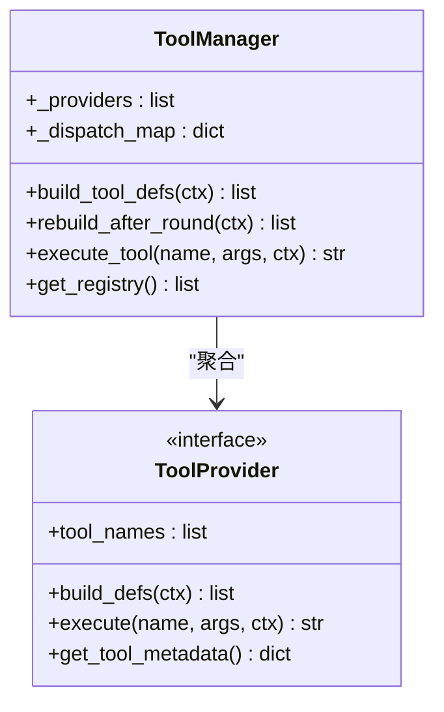
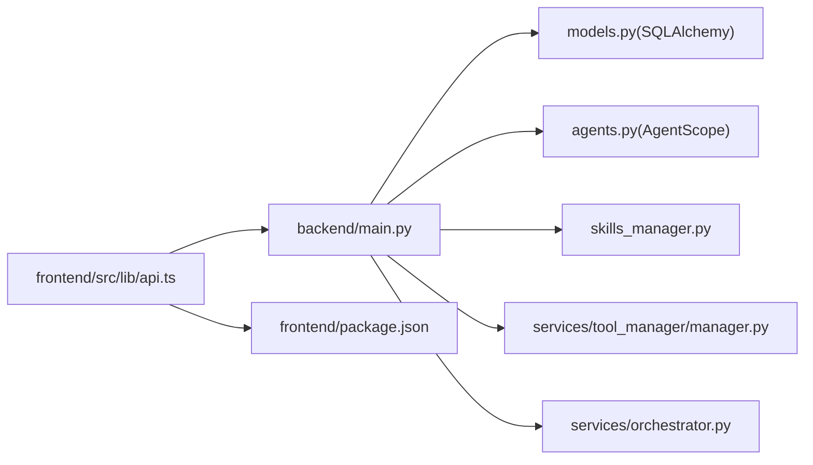

# 开发者指南

<cite>
**本文引用的文件**
- [backend/main.py](file://backend/main.py)
- [backend/config.py](file://backend/config.py)
- [backend/models.py](file://backend/models.py)
- [backend/agents.py](file://backend/agents.py)
- [backend/agent_extensions.py](file://backend/agent_extensions.py)
- [backend/skills_manager.py](file://backend/skills_manager.py)
- [backend/routers/skills_api.py](file://backend/routers/skills_api.py)
- [backend/services/orchestrator.py](file://backend/services/orchestrator.py)
- [backend/services/tool_manager/manager.py](file://backend/services/tool_manager/manager.py)
- [backend/services/tool_manager/providers/__init__.py](file://backend/services/tool_manager/providers/__init__.py)
- [backend/mcp_manager/manager.py](file://backend/mcp_manager/manager.py)
- [frontend/src/lib/api.ts](file://frontend/src/lib/api.ts)
- [frontend/package.json](file://frontend/package.json)
- [README.md](file://README.md)
</cite>

## 目录
1. [简介](#简介)
2. [项目结构](#项目结构)
3. [核心组件](#核心组件)
4. [架构总览](#架构总览)
5. [详细组件分析](#详细组件分析)
6. [依赖分析](#依赖分析)
7. [性能考虑](#性能考虑)
8. [故障排查指南](#故障排查指南)
9. [结论](#结论)
10. [附录](#附录)

## 简介
本指南面向KunFlix（鲲影）项目的开发者，围绕以下目标提供系统化的开发与扩展指导：
- 如何创建新技能、配置智能代理、扩展AI服务与开发自定义功能
- 技能开发的完整流程：从技能架构设计到实现细节
- 代理系统的扩展机制、自定义代理的创建方法与代理配置优化策略
- 插件系统的使用方法、第三方服务集成与API扩展开发
- 代码规范、提交流程、调试技巧与常见问题解决方案
- 开发环境配置、测试策略与性能优化建议

## 项目结构
KunFlix采用前后端分离架构，后端基于FastAPI + AgentScope多智能体框架，前端基于Next.js，数据库采用SQLAlchemy异步ORM，支持SQLite（开发）与PostgreSQL（生产）。核心模块包括：
- 后端主入口与路由注册：backend/main.py、routers/*
- 数据模型与数据库：backend/models.py、migrations/*
- 智能代理与叙事引擎：backend/agents.py、backend/narrative_engine
- 技能系统：backend/skills/* 与 backend/skills_manager.py
- 多智能体编排：backend/services/orchestrator.py
- 工具管理与插件：backend/services/tool_manager/*
- MCP客户端管理：backend/mcp_manager/manager.py
- 前端API封装与认证：frontend/src/lib/api.ts、frontend/package.json

**图表来源**
- [backend/main.py:110-153](file://backend/main.py#L110-L153)
- [backend/config.py:7-42](file://backend/config.py#L7-L42)
- [backend/models.py:10-503](file://backend/models.py#L10-L503)
- [backend/agents.py:176-387](file://backend/agents.py#L176-L387)
- [backend/skills_manager.py:180-231](file://backend/skills_manager.py#L180-L231)
- [backend/services/orchestrator.py:418-534](file://backend/services/orchestrator.py#L418-L534)
- [backend/services/tool_manager/manager.py:23-108](file://backend/services/tool_manager/manager.py#L23-L108)
- [backend/mcp_manager/manager.py](file://backend/mcp_manager/manager.py)
- [frontend/src/lib/api.ts:1-84](file://frontend/src/lib/api.ts#L1-L84)
- [frontend/package.json:1-94](file://frontend/package.json#L1-L94)

**章节来源**
- [backend/main.py:110-153](file://backend/main.py#L110-L153)
- [README.md:63-79](file://README.md#L63-L79)

## 核心组件
- 应用入口与生命周期：FastAPI应用初始化、CORS、中间件、数据库迁移与媒体目录准备
- 配置系统：数据库URL、Redis、AI服务密钥、JWT、生成设置与运行开关
- 数据模型：用户、剧场、节点、边、资产、LLM提供方、聊天会话与消息、代理、任务与计费、视频任务、调试会话与消息、工具配置与执行记录
- 智能代理与叙事引擎：基于AgentScope的多智能体对话代理、内存压缩钩子、工具守卫混入、MCP客户端注册
- 技能系统：技能目录结构、内置/定制/激活技能同步、技能服务与API
- 多智能体编排：统一策略、依赖调度、事件流、计费与回滚
- 工具管理：工具提供者注册、动态工具定义、执行派发
- MCP客户端管理：动态注册第三方MCP客户端
- 前端API封装：Axios基础配置、鉴权头注入、刷新令牌队列与401处理

**章节来源**
- [backend/main.py:15-108](file://backend/main.py#L15-L108)
- [backend/config.py:7-42](file://backend/config.py#L7-L42)
- [backend/models.py:10-503](file://backend/models.py#L10-L503)
- [backend/agents.py:40-175](file://backend/agents.py#L40-L175)
- [backend/skills_manager.py:180-231](file://backend/skills_manager.py#L180-L231)
- [backend/services/orchestrator.py:418-534](file://backend/services/orchestrator.py#L418-L534)
- [backend/services/tool_manager/manager.py:23-108](file://backend/services/tool_manager/manager.py#L23-L108)
- [frontend/src/lib/api.ts:1-84](file://frontend/src/lib/api.ts#L1-L84)

## 架构总览
KunFlix采用“智能体驱动 + 技能插件 + 工具编排”的多智能体架构。后端通过FastAPI提供REST接口，前端通过Next.js提供可视化创作界面。核心交互链路如下：

**图表来源**
- [backend/agents.py:114-175](file://backend/agents.py#L114-L175)
- [backend/skills_manager.py:263-408](file://backend/skills_manager.py#L263-L408)
- [backend/services/tool_manager/manager.py:87-91](file://backend/services/tool_manager/manager.py#L87-L91)
- [backend/services/orchestrator.py:448-534](file://backend/services/orchestrator.py#L448-L534)

## 详细组件分析

### 技能系统（Skills）
技能系统通过目录结构与Frontmatter元数据组织，支持内置、定制与激活三类技能，并提供API进行增删改查与启停。

- 目录结构
  - builtin_skills：内置技能，不可删除
  - customized_skills：定制技能，可创建/更新/删除
  - active_skills：激活技能，运行时生效

- 核心能力
  - 同步策略：定制覆盖内置；首次复制或强制覆盖；差异检测触发更新
  - 列表与详情：按来源与状态返回技能信息
  - 创建/更新/删除：校验Frontmatter，支持references/scripts子树创建
  - 文件加载：安全路径校验，防止路径穿越

**图表来源**
- [backend/skills_manager.py:180-226](file://backend/skills_manager.py#L180-L226)

- API端点
  - GET /api/admin/skills：列出技能与状态
  - GET /api/admin/skills/{name}：获取技能详情
  - POST /api/admin/skills：创建技能（可自动启用）
  - PUT /api/admin/skills/{name}：更新技能（必要时重新激活）
  - DELETE /api/admin/skills/{name}：删除定制技能
  - POST /api/admin/skills/{name}/toggle：切换激活状态

**图表来源**
- [backend/routers/skills_api.py:140-170](file://backend/routers/skills_api.py#L140-L170)
- [backend/skills_manager.py:304-353](file://backend/skills_manager.py#L304-L353)

**章节来源**
- [backend/skills_manager.py:19-175](file://backend/skills_manager.py#L19-L175)
- [backend/skills_manager.py:263-408](file://backend/skills_manager.py#L263-L408)
- [backend/routers/skills_api.py:123-207](file://backend/routers/skills_api.py#L123-L207)

### 智能代理与叙事引擎（Agents & NarrativeEngine）
- DialogAgent
  - 支持多种模型格式（OpenAI/Gemini/DashScope/Anthropic/Ollama）
  - 工具注册：Toolkit + 技能目录同步
  - 内存压缩钩子：超过阈值自动摘要压缩
  - 工具守卫：禁止危险工具，受控工具需审批（预留）

- NarrativeEngine
  - 从数据库加载活动LLM提供方，初始化AgentScope模型
  - 动态创建Director/Narrator/NPC_Manager三个代理
  - 生成章节：三阶段流水线，汇总令牌统计

**图表来源**
- [backend/agents.py:40-175](file://backend/agents.py#L40-L175)
- [backend/agents.py:176-387](file://backend/agents.py#L176-L387)
- [backend/agent_extensions.py:7-163](file://backend/agent_extensions.py#L7-L163)

**章节来源**
- [backend/agents.py:40-175](file://backend/agents.py#L40-L175)
- [backend/agents.py:176-387](file://backend/agents.py#L176-L387)
- [backend/agent_extensions.py:7-163](file://backend/agent_extensions.py#L7-L163)

### 多智能体编排（Orchestrator）
- 统一策略（UnifiedStrategy）：构建依赖图，同层并发、单任务串行流式输出
- 事件流：SSE事件类型（task_start、task_analyzed、subtask_*、task_result、task_completed）
- 计费与回滚：原子扣费、失败回滚、错误元数据记录
- 审查环节：可选的Leader审查，整合子任务输出

**图表来源**
- [backend/services/orchestrator.py:418-534](file://backend/services/orchestrator.py#L418-L534)
- [backend/services/orchestrator.py:558-596](file://backend/services/orchestrator.py#L558-L596)
- [backend/services/orchestrator.py:661-754](file://backend/services/orchestrator.py#L661-L754)

**章节来源**
- [backend/services/orchestrator.py:418-534](file://backend/services/orchestrator.py#L418-L534)
- [backend/services/orchestrator.py:558-596](file://backend/services/orchestrator.py#L558-L596)
- [backend/services/orchestrator.py:661-754](file://backend/services/orchestrator.py#L661-L754)

### 工具管理与插件（ToolManager）
- 工具提供者注册：Canvas、图像生成/编辑、视频生成/编辑
- 动态定义：按上下文构建工具定义，支持增量重建
- 执行派发：按名称O(1)查找并执行

**图表来源**
- [backend/services/tool_manager/manager.py:23-108](file://backend/services/tool_manager/manager.py#L23-L108)
- [backend/services/tool_manager/providers/__init__.py:4-26](file://backend/services/tool_manager/providers/__init__.py#L4-L26)

**章节来源**
- [backend/services/tool_manager/manager.py:23-108](file://backend/services/tool_manager/manager.py#L23-L108)
- [backend/services/tool_manager/providers/__init__.py:4-26](file://backend/services/tool_manager/providers/__init__.py#L4-L26)

### MCP客户端管理
- 在请求时动态注册MCP客户端到Toolkit，支持热重载
- 错误捕获与日志记录

**章节来源**
- [backend/agents.py:70-84](file://backend/agents.py#L70-L84)
- [backend/mcp_manager/manager.py](file://backend/mcp_manager/manager.py)

### 前端API封装与认证
- Axios基础配置：baseURL指向后端/api
- 请求拦截：自动附加Authorization头
- 响应拦截：401时刷新令牌并重试，失败清空本地存储并跳转登录页

**章节来源**
- [frontend/src/lib/api.ts:1-84](file://frontend/src/lib/api.ts#L1-L84)
- [frontend/package.json:1-94](file://frontend/package.json#L1-L94)

## 依赖分析
- 后端依赖
  - FastAPI：路由与ASGI服务
  - SQLAlchemy：异步ORM与数据库迁移
  - AgentScope：多智能体框架
  - Alembic：数据库迁移
  - Pydantic/Settings：配置管理
  - Frontmatter：技能MD解析
- 前端依赖
  - Next.js/Tailwind：页面与样式
  - Axios：HTTP客户端
  - Socket.IO：实时通信
  - Zustand/React Context：状态管理

**图表来源**
- [backend/main.py:138-153](file://backend/main.py#L138-L153)
- [backend/models.py:10-503](file://backend/models.py#L10-L503)
- [backend/agents.py:176-387](file://backend/agents.py#L176-L387)
- [backend/skills_manager.py:263-408](file://backend/skills_manager.py#L263-L408)
- [backend/services/tool_manager/manager.py:23-108](file://backend/services/tool_manager/manager.py#L23-L108)
- [backend/services/orchestrator.py:418-534](file://backend/services/orchestrator.py#L418-L534)
- [frontend/src/lib/api.ts:1-84](file://frontend/src/lib/api.ts#L1-L84)
- [frontend/package.json:1-94](file://frontend/package.json#L1-L94)

**章节来源**
- [backend/main.py:138-153](file://backend/main.py#L138-L153)
- [frontend/src/lib/api.ts:1-84](file://frontend/src/lib/api.ts#L1-L84)
- [frontend/package.json:1-94](file://frontend/package.json#L1-L94)

## 性能考虑
- 数据库
  - 生产环境使用PostgreSQL并开启连接池
  - 迁移失败自动清理临时表后重试
- 缓存
  - Redis用于高频数据缓存
- 限流与鉴权
  - CORS白名单、JWT鉴权、401刷新队列
- 生成与编排
  - 内存压缩钩子降低上下文开销
  - 并行执行同层子任务，串行执行单任务以保证实时性
- 存储
  - 媒体文件建议对象存储，减少本地磁盘压力

[本节为通用建议，不涉及具体文件分析]

## 故障排查指南
- 启动与迁移
  - 数据库连接失败：检查DATABASE_URL与权限；确认RUN_MIGRATIONS配置；查看迁移日志
  - 迁移异常：自动清理残留临时表后重试
- 代理与模型
  - 未初始化NarrativeEngine：检查LLM提供方是否激活；确认API Key与模型名称
  - 工具执行失败：检查ToolManager注册与dispatch_map；查看工具定义与执行日志
- 技能同步
  - 激活技能缺失：确认customized覆盖builtin；检查SKILL.md差异与同步状态
- 前端鉴权
  - 401频繁：检查刷新令牌流程与本地存储；确认后端CORS与Origin
- 计费与配额
  - 余额不足：检查CreditTransaction记录与订阅状态；冻结状态需管理员解冻

**章节来源**
- [backend/main.py:49-108](file://backend/main.py#L49-L108)
- [backend/agents.py:182-233](file://backend/agents.py#L182-L233)
- [backend/services/tool_manager/manager.py:87-91](file://backend/services/tool_manager/manager.py#L87-L91)
- [frontend/src/lib/api.ts:31-81](file://frontend/src/lib/api.ts#L31-L81)

## 结论
本指南提供了KunFlix从技能、代理、工具到编排的全栈开发与扩展路径。遵循本文的流程与最佳实践，开发者可以：
- 快速创建与发布新技能，实现影视创作的模块化扩展
- 自定义智能代理，结合内存压缩与工具守卫提升安全性与稳定性
- 通过ToolManager与MCP集成第三方服务，构建开放的插件生态
- 借助统一编排策略与事件流，实现复杂任务的高效执行与可观测性

[本节为总结，不涉及具体文件分析]

## 附录
- 开发环境配置
  - 后端：Python 3.10+、虚拟环境、安装requirements.txt、配置.env、初始化数据库、启动main.py
  - 前端：Node.js 18+、安装依赖、配置.env.local、启动dev
  - 管理后台：在backend/admin目录安装依赖并启动
- 提交流程
  - Fork仓库 → 新建分支 → 提交更改 → 推送分支 → 提交PR
- 测试策略
  - 后端：单元测试与API测试（pytest/vitest配置参考项目内tests）
  - 前端：Jest测试与UI组件测试
- 调试技巧
  - 启用DebugAuthMiddleware查看授权头与Origin
  - 使用SSE/WS观察编排事件流
  - 分析ToolExecution与CreditTransaction记录定位问题

**章节来源**
- [README.md:81-135](file://README.md#L81-L135)
- [README.md:279-286](file://README.md#L279-L286)
- [backend/main.py:119-128](file://backend/main.py#L119-L128)