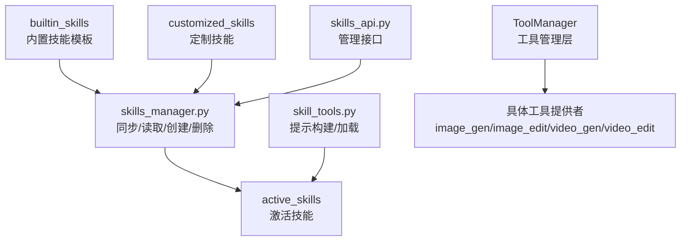
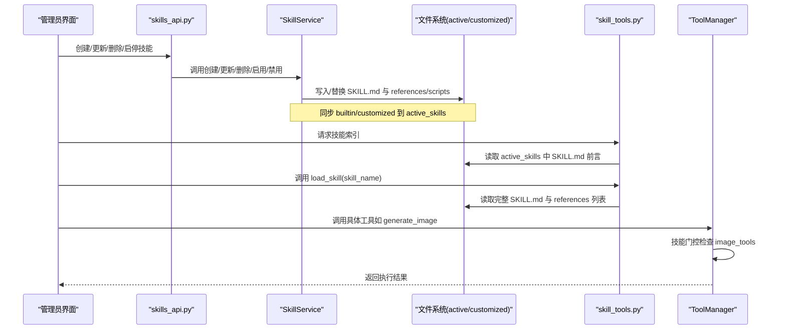
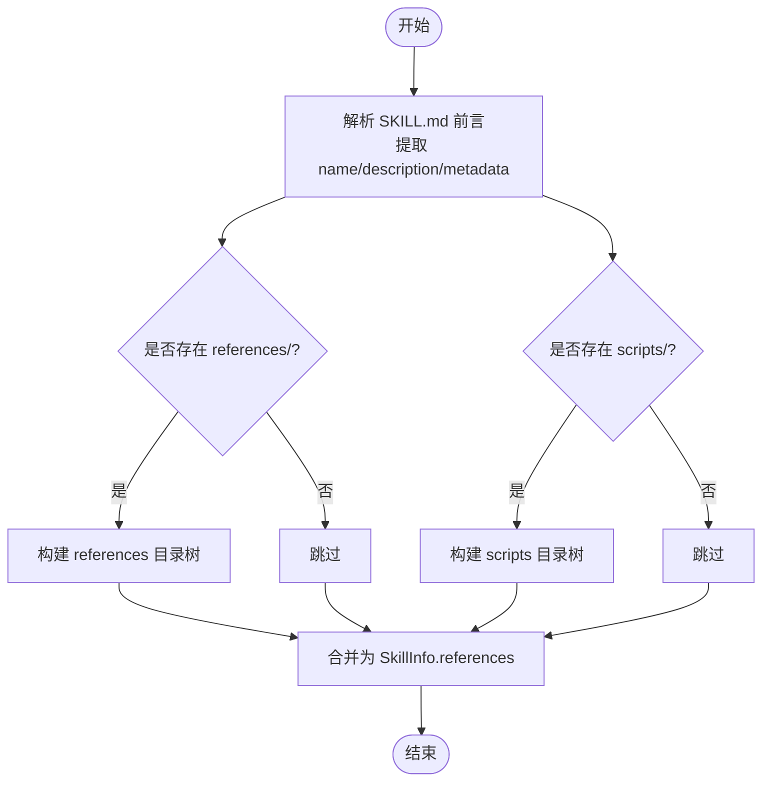
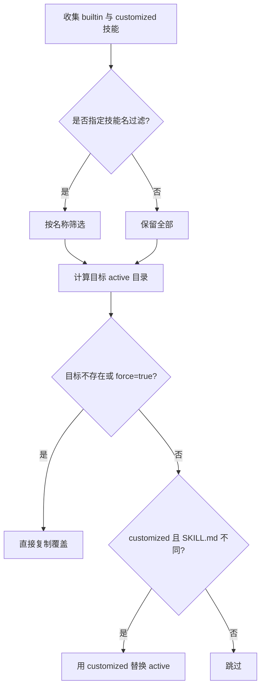
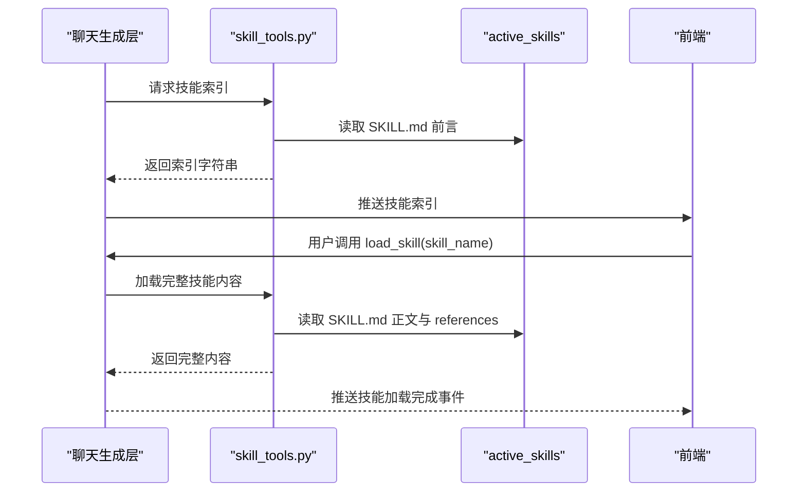
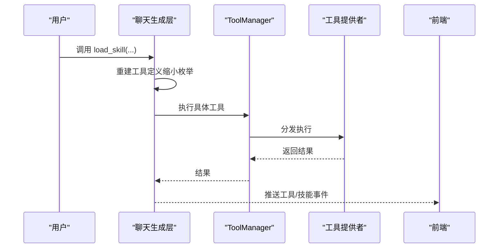
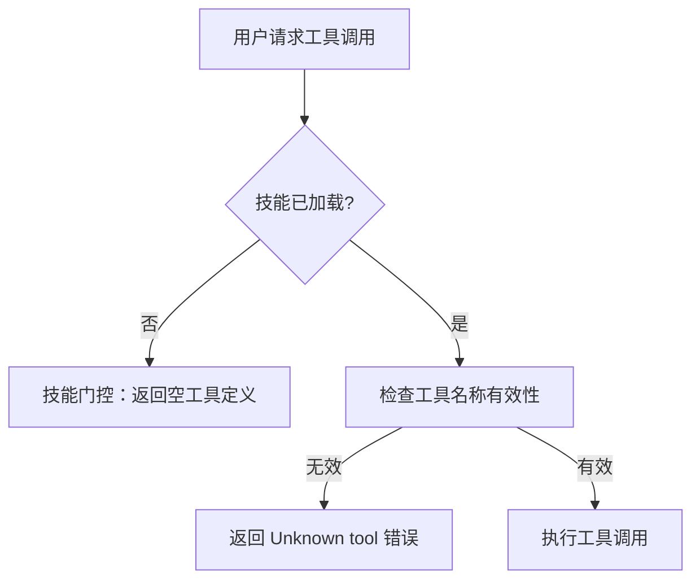
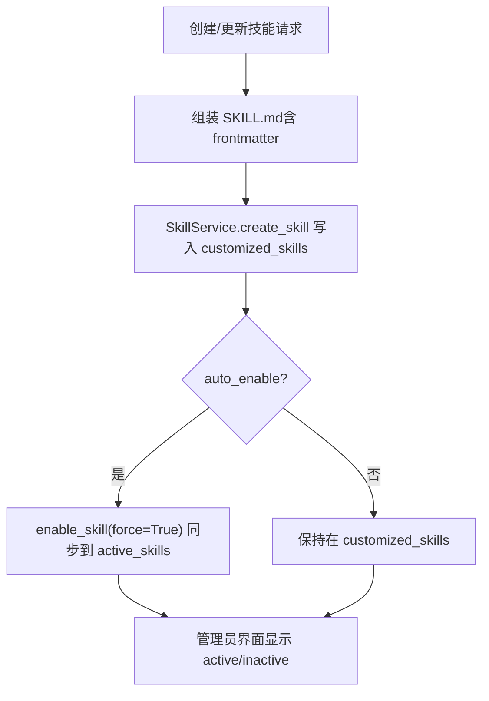

# 技能开发指南

<cite>
**本文引用的文件**   
- [skills_manager.py](file://backend/skills_manager.py)
- [skill_tools.py](file://backend/services/skill_tools.py)
- [skills_api.py](file://backend/routers/skills_api.py)
- [canvas_tools SKILL.md（内置）](file://backend/skills/active_skills/canvas_tools/SKILL.md)
- [image_tools SKILL.md（内置）](file://backend/skills/active_skills/image_tools/SKILL.md)
- [video_tools SKILL.md（内置）](file://backend/skills/active_skills/video_tools/SKILL.md)
- [manager.py](file://backend/services/tool_manager/manager.py)
- [providers/__init__.py](file://backend/services/tool_manager/providers/__init__.py)
- [admin_debug.py](file://backend/routers/admin_debug.py)
- [chat_generation.py](file://backend/services/chat_generation.py)
- [SkillCallIndicator.tsx](file://frontend/src/components/ai-assistant/SkillCallIndicator.tsx)
- [技能页面（管理员）](file://backend/admin/src/app/admin/skills/page.tsx)
- [image_gen.py](file://backend/services/tool_manager/providers/image_gen.py)
- [image_edit.py](file://backend/services/tool_manager/providers/image_edit.py)
- [video_gen.py](file://backend/services/tool_manager/providers/video_gen.py)
- [video_edit.py](file://backend/services/tool_manager/providers/video_edit.py)
</cite>

## 更新摘要
**变更内容**   
- 新增重要澄清：明确警告不要直接调用image_tools和video_tools技能，必须调用具体的generate_image、edit_image、generate_video、edit_video等工具
- 更新技能架构图以反映当前可用的内置技能和工具门控机制
- 增强了工具执行与技能门控的说明，强调技能与工具的解耦关系
- 更新了典型技能开发示例，突出正确的工具调用模式

## 目录
1. [引言](#引言)
2. [项目结构](#项目结构)
3. [核心组件](#核心组件)
4. [架构总览](#架构总览)
5. [详细组件分析](#详细组件分析)
6. [依赖分析](#依赖分析)
7. [性能考虑](#性能考虑)
8. [故障排查指南](#故障排查指南)
9. [结论](#结论)
10. [附录：开发流程与示例](#附录开发流程与示例)

## 引言
本指南面向希望在本项目中开发"技能"的工程师与产品人员。技能是通过标准化的 SKILL.md 配置文件与可选的 references/scripts 文件系统组织而成的"教程型能力包"，由系统在运行时按需加载，指导大模型如何完成特定任务。本指南将系统阐述：
- 技能架构设计原则与三类技能（内置/定制/激活）的职责边界
- SKILL.md 前言元数据规范与内容结构
- 技能文件系统、引用文件管理与脚本执行机制
- 技能创建、启用/禁用、更新与删除的完整流程
- 典型技能开发示例（画布操作、图像生成、视频编辑）
- 调试方法、错误处理与性能优化建议

**重要提醒**：请勿直接调用 image_tools 或 video_tools 技能本身，必须调用其激活的具体工具（如 generate_image、edit_image、generate_video、edit_video）。

## 项目结构
技能系统位于后端 skills 子目录，采用三层目录结构：
- builtin_skills：随代码分发的只读技能模板
- customized_skills：工作区内的自定义技能（可覆盖内置）
- active_skills：当前生效的技能集合（由管理器同步）

**图表来源**
- [skills_manager.py:43-63](file://backend/skills_manager.py#L43-L63)
- [skills_manager.py:180-225](file://backend/skills_manager.py#L180-L225)
- [skills_api.py:19](file://backend/routers/skills_api.py#L19)
- [manager.py:23-108](file://backend/services/tool_manager/manager.py#L23-L108)

**章节来源**
- [skills_manager.py:43-63](file://backend/skills_manager.py#L43-L63)
- [skills_manager.py:180-225](file://backend/skills_manager.py#L180-L225)
- [skills_api.py:19](file://backend/routers/skills_api.py#L19)

## 核心组件
- 技能服务（SkillService）：负责列出、启用/禁用、创建/删除技能，以及从 references/scripts 中安全读取文件
- 技能管理器（skills_manager）：提供路径解析、目录树构建、差异检测与同步逻辑
- 技能提示构建器（skill_tools）：构建系统提示中的技能索引、按需加载完整技能内容
- 管理接口（skills_api）：提供管理员端的技能增删改查与启停操作
- 工具管理层（tool_manager）：统一注册与调度具体工具提供者（如画布、图像、视频等），与技能解耦

**章节来源**
- [skills_manager.py:263-408](file://backend/skills_manager.py#L263-L408)
- [skill_tools.py:40-130](file://backend/services/skill_tools.py#L40-L130)
- [skills_api.py:123-207](file://backend/routers/skills_api.py#L123-L207)
- [manager.py:23-108](file://backend/services/tool_manager/manager.py#L23-L108)

## 架构总览
技能系统围绕"配置驱动 + 按需加载"的模式设计：
- 配置层：每个技能以 SKILL.md 作为唯一事实源，使用 YAML 前言承载元数据
- 文件系统层：references/scripts 作为技能的资源与脚本容器
- 同步层：将 builtin 与 customized 合并到 active，支持覆盖与强制同步
- 提示层：系统提示仅包含轻量索引；通过 meta-tool load_skill 按需拉取完整内容
- 执行层：工具提供者在获得参数后执行具体任务，与技能解耦

**图表来源**
- [skills_api.py:140-207](file://backend/routers/skills_api.py#L140-L207)
- [skills_manager.py:263-408](file://backend/skills_manager.py#L263-L408)
- [skill_tools.py:40-130](file://backend/services/skill_tools.py#L40-L130)
- [manager.py:87-91](file://backend/services/tool_manager/manager.py#L87-L91)

## 详细组件分析

### 组件一：技能配置与文件系统（SKILL.md 与 references/scripts）
- SKILL.md 必须包含 name、description 与 metadata（推荐含 builtin_skill_version）
- 可选 references 目录存放参考材料（如模板、样例）
- 可选 scripts 目录存放可被技能调用的脚本
- 加载策略：系统提示仅包含技能名与描述；完整内容通过 load_skill 动态拉取

**图表来源**
- [skills_manager.py:107-142](file://backend/skills_manager.py#L107-L142)
- [skills_manager.py:80-105](file://backend/skills_manager.py#L80-L105)

**章节来源**
- [skills_manager.py:107-142](file://backend/skills_manager.py#L107-L142)
- [skills_manager.py:80-105](file://backend/skills_manager.py#L80-L105)

### 组件二：技能同步与版本控制（builtin/customized/active）
- 同步规则：customized 覆盖 builtin；若未指定名称则全量同步
- 差异检测：基于 SKILL.md 内容差异决定是否覆盖
- 版本字段：metadata.builtin_skill_version 用于语义化版本管理
- 强制同步：支持 force 参数覆盖已有激活副本

**图表来源**
- [skills_manager.py:180-225](file://backend/skills_manager.py#L180-L225)
- [skills_manager.py:145-157](file://backend/skills_manager.py#L145-L157)

**章节来源**
- [skills_manager.py:180-225](file://backend/skills_manager.py#L180-L225)
- [skills_manager.py:145-157](file://backend/skills_manager.py#L145-L157)

### 组件三：技能提示构建与动态加载
- 系统提示仅包含技能索引（name + description），避免额外 token 成本
- load_skill meta-tool 返回完整 SKILL.md 与 references 列表
- 前端通过 SSE 事件流接收技能加载状态，实时反馈

**图表来源**
- [skill_tools.py:40-130](file://backend/services/skill_tools.py#L40-L130)
- [admin_debug.py:418-472](file://backend/routers/admin_debug.py#L418-L472)

**章节来源**
- [skill_tools.py:40-130](file://backend/services/skill_tools.py#L40-L130)
- [admin_debug.py:418-472](file://backend/routers/admin_debug.py#L418-L472)

### 组件四：工具执行与技能门控
- ToolManager 统一注册与调度工具提供者（画布、图像、视频等）
- 当用户调用 load_skill 时，聊天层会根据剩余未加载技能重新构建工具定义，实现"技能门控"
- 前端通过 SSE 接收技能调用事件，UI 展示加载状态

**图表来源**
- [manager.py:23-108](file://backend/services/tool_manager/manager.py#L23-L108)
- [chat_generation.py:261-287](file://backend/services/chat_generation.py#L261-L287)

**章节来源**
- [manager.py:23-108](file://backend/services/tool_manager/manager.py#L23-L108)
- [chat_generation.py:261-287](file://backend/services/chat_generation.py#L261-L287)

### 组件五：技能门控机制与工具调用规范
- 技能门控：当技能未加载时，对应的工具提供者不会注册到工具定义中
- 工具调用规范：必须调用具体的工具名称（如 generate_image、edit_image），而非技能名称
- 错误处理：直接调用技能名称会导致 Unknown tool 错误

**图表来源**
- [image_gen.py:288-290](file://backend/services/tool_manager/providers/image_gen.py#L288-L290)
- [image_edit.py:537-539](file://backend/services/tool_manager/providers/image_edit.py#L537-L539)
- [video_gen.py:296-298](file://backend/services/tool_manager/providers/video_gen.py#L296-L298)
- [video_edit.py:241-243](file://backend/services/tool_manager/providers/video_edit.py#L241-L243)

**章节来源**
- [image_gen.py:288-290](file://backend/services/tool_manager/providers/image_gen.py#L288-L290)
- [image_edit.py:537-539](file://backend/services/tool_manager/providers/image_edit.py#L537-L539)
- [video_gen.py:296-298](file://backend/services/tool_manager/providers/video_gen.py#L296-L298)
- [video_edit.py:241-243](file://backend/services/tool_manager/providers/video_edit.py#L241-L243)

## 依赖分析
- 技能服务依赖 frontmatter 解析 SKILL.md，依赖路径工具与文件系统进行目录遍历与树构建
- 管理接口依赖 SkillService 提供的 CRUD 与启停能力
- 工具管理层独立于技能系统，通过 ToolManager 统一调度，确保技能与工具的解耦

**图表来源**
- [skills_manager.py:8](file://backend/skills_manager.py#L8)
- [skills_api.py:4](file://backend/routers/skills_api.py#L4)
- [skill_tools.py:17](file://backend/services/skill_tools.py#L17)
- [manager.py:26-28](file://backend/services/tool_manager/manager.py#L26-L28)

**章节来源**
- [skills_manager.py:8](file://backend/skills_manager.py#L8)
- [skills_api.py:4](file://backend/routers/skills_api.py#L4)
- [skill_tools.py:17](file://backend/services/skill_tools.py#L17)
- [manager.py:26-28](file://backend/services/tool_manager/manager.py#L26-L28)

## 性能考虑
- 提示成本控制：系统提示仅包含技能索引，完整内容按需加载，避免冗余 token 消耗
- 工具定义重建：仅在技能门控触发时重建，减少不必要的工具定义组装
- 文件访问安全：严格校验 references/scripts 的路径前缀与相对路径，防止越权访问

**章节来源**
- [skill_tools.py:25-66](file://backend/services/skill_tools.py#L25-L66)
- [skills_manager.py:370-408](file://backend/skills_manager.py#L370-L408)

## 故障排查指南
- SKILL.md 解析失败：检查 frontmatter 是否正确，确保 name 与 description 存在
- 路径访问异常：确认 file_path 以 references/ 或 scripts/ 开头，且不包含路径穿越字符
- 同步未生效：确认是否使用了 force 参数，或 SKILL.md 是否存在差异
- 工具未出现：确认技能已启用，且聊天层已完成工具定义重建
- 前端无反馈：检查 SSE 事件流是否正常推送，确认前端监听的事件类型
- 工具调用错误：确认使用的是具体工具名称（如 generate_image），而非技能名称（如 image_tools）

**章节来源**
- [skills_manager.py:313-321](file://backend/skills_manager.py#L313-L321)
- [skills_manager.py:370-408](file://backend/skills_manager.py#L370-L408)
- [skills_api.py:140-170](file://backend/routers/skills_api.py#L140-L170)
- [admin_debug.py:418-472](file://backend/routers/admin_debug.py#L418-L472)

## 结论
本技能系统通过"配置即能力"的方式，将复杂任务封装为可复用的教程式技能，结合按需加载与工具门控机制，在保证安全性的同时最大化灵活性与性能。遵循本文档的规范与流程，即可高效地创建、维护与扩展各类技能。特别注意：请始终调用具体的工具名称而非技能名称，这是系统正确工作的关键。

## 附录：开发流程与示例

### 一、技能架构设计原则
- 单一职责：每个技能聚焦一类任务域（如画布操作、图像生成、视频编辑）
- 可发现性：通过 SKILL.md 前言清晰表达 name、description 与版本
- 可扩展性：通过 references/scripts 扩展静态资料与脚本能力
- 可治理性：通过管理员 API 实现启停与版本化管理

**章节来源**
- [skills_manager.py:19-29](file://backend/skills_manager.py#L19-L29)
- [skills_api.py:26-53](file://backend/routers/skills_api.py#L26-L53)

### 二、SKILL.md 配置文件格式与前言元数据规范
- 必填项：name、description
- 元数据：metadata.builtin_skill_version（建议使用语义化版本）
- 内容体：技能说明、工具清单、参数说明、示例与最佳实践
- 参考资料：references 目录下的文件将自动列在技能详情页

**章节来源**
- [canvas_tools SKILL.md（内置）:1-6](file://backend/skills/active_skills/canvas_tools/SKILL.md#L1-L6)
- [image_tools SKILL.md（内置）:1-6](file://backend/skills/active_skills/image_tools/SKILL.md#L1-L6)
- [video_tools SKILL.md（内置）:1-6](file://backend/skills/active_skills/video_tools/SKILL.md#L1-L6)

### 三、三类技能的区别与用途
- 内置技能（builtin_skills）：随代码分发的标准能力模板，不可删除
- 定制技能（customized_skills）：工作区内可修改与扩展的能力，可覆盖内置
- 激活技能（active_skills）：当前对大模型可见并可调用的能力集合

**章节来源**
- [skills_manager.py:48-62](file://backend/skills_manager.py#L48-L62)
- [skills_api.py:172-187](file://backend/routers/skills_api.py#L172-L187)

### 四、技能创建流程（含目录结构与版本管理）
- 在 customized_skills 下新建技能目录，添加 SKILL.md 与可选 references/scripts
- 使用管理员 API 创建技能，系统自动写入 SKILL.md 并可选择自动启用
- 更新时重建 SKILL.md 并可选择强制同步至 active_skills
- 删除时先禁用再删除（内置技能不可删除）

**图表来源**
- [skills_api.py:140-170](file://backend/routers/skills_api.py#L140-L170)
- [skills_manager.py:304-352](file://backend/skills_manager.py#L304-L352)

**章节来源**
- [skills_api.py:140-170](file://backend/routers/skills_api.py#L140-L170)
- [skills_manager.py:304-352](file://backend/skills_manager.py#L304-L352)

### 五、技能文件系统、引用文件管理与脚本执行机制
- 引用文件管理：通过 SkillService.load_skill_file 安全读取 references/scripts
- 脚本执行：可在 SKILL.md 中声明脚本入口，配合脚本目录实现本地能力扩展
- 安全限制：禁止路径穿越，仅允许 references/ 与 scripts/ 前缀

**章节来源**
- [skills_manager.py:370-408](file://backend/skills_manager.py#L370-L408)

### 六、典型技能开发示例

#### 示例一：画布操作技能
- 目标：提供画布节点的增删改查操作说明与参数约束
- 关键点：支持多种节点类型（text、image、video、storyboard），参数验证与错误处理
- 参考文件：[canvas_tools SKILL.md（内置）:1-139](file://backend/skills/active_skills/canvas_tools/SKILL.md#L1-L139)

**章节来源**
- [canvas_tools SKILL.md（内置）:15-139](file://backend/skills/active_skills/canvas_tools/SKILL.md#L15-L139)

#### 示例二：图像生成技能
- 目标：提供 generate_image 与 edit_image 工具的使用说明与参数约束
- 关键点：强调英文提示、参数枚举来自系统配置、返回值格式
- **重要提醒**：不要直接调用 image_tools 技能，必须调用 generate_image 或 edit_image 工具
- 参考文件：[image_tools SKILL.md（内置）:1-79](file://backend/skills/active_skills/image_tools/SKILL.md#L1-L79)

**章节来源**
- [image_tools SKILL.md（内置）:15-79](file://backend/skills/active_skills/image_tools/SKILL.md#L15-L79)

#### 示例三：视频编辑技能
- 目标：提供 generate_video 与 edit_video 工具的使用说明与异步流程
- 关键点：异步任务、模式区分（编辑/扩展）、参数枚举与质量选项
- **重要提醒**：不要直接调用 video_tools 技能，必须调用 generate_video 或 edit_video 工具
- 参考文件：[video_tools SKILL.md（内置）:1-103](file://backend/skills/active_skills/video_tools/SKILL.md#L1-L103)

**章节来源**
- [video_tools SKILL.md（内置）:17-103](file://backend/skills/active_skills/video_tools/SKILL.md#L17-L103)

### 七、调试方法与前端可视化
- 前端技能调用指示器：通过 SSE 事件流展示技能加载状态（加载中/已加载）
- 管理员界面：查看技能列表、状态与版本，支持启停与删除
- 聊天层日志：观察工具定义重建与技能门控行为

**章节来源**
- [SkillCallIndicator.tsx:18-41](file://frontend/src/components/ai-assistant/SkillCallIndicator.tsx#L18-L41)
- [技能页面（管理员）:37-42](file://backend/admin/src/app/admin/skills/page.tsx#L37-L42)
- [admin_debug.py:418-472](file://backend/routers/admin_debug.py#L418-L472)

### 八、工具调用规范与最佳实践

#### 正确的调用模式
- 图像操作：使用 `generate_image()` 或 `edit_image()` 工具
- 视频操作：使用 `generate_video()` 或 `edit_video()` 工具
- 画布操作：使用 `update_canvas_node()` 等画布专用工具

#### 错误的调用模式（应避免）
- 直接调用 `image_tools` 技能
- 直接调用 `video_tools` 技能
- 调用不存在的工具名称

#### 技能门控检查
工具提供者会在执行前检查技能门控状态，只有当相应的技能已加载时才会注册对应的工具定义。这确保了用户必须先加载技能，然后才能使用其提供的具体工具。

**章节来源**
- [image_gen.py:288-290](file://backend/services/tool_manager/providers/image_gen.py#L288-L290)
- [image_edit.py:537-539](file://backend/services/tool_manager/providers/image_edit.py#L537-L539)
- [video_gen.py:296-298](file://backend/services/tool_manager/providers/video_gen.py#L296-L298)
- [video_edit.py:241-243](file://backend/services/tool_manager/providers/video_edit.py#L241-L243)