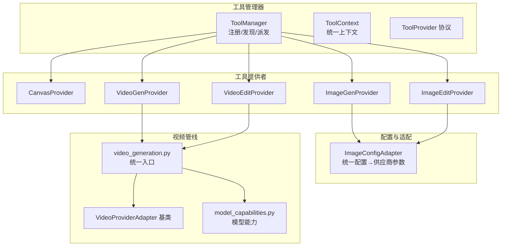
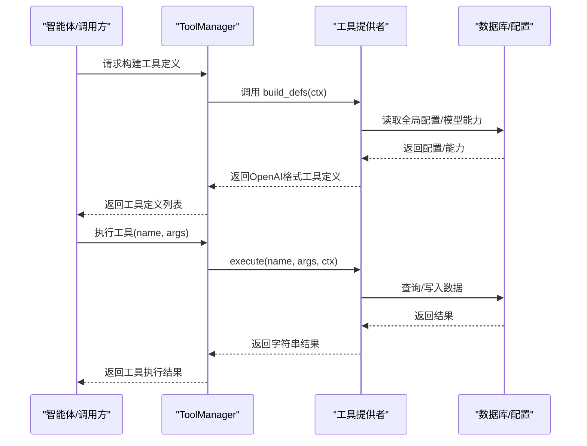
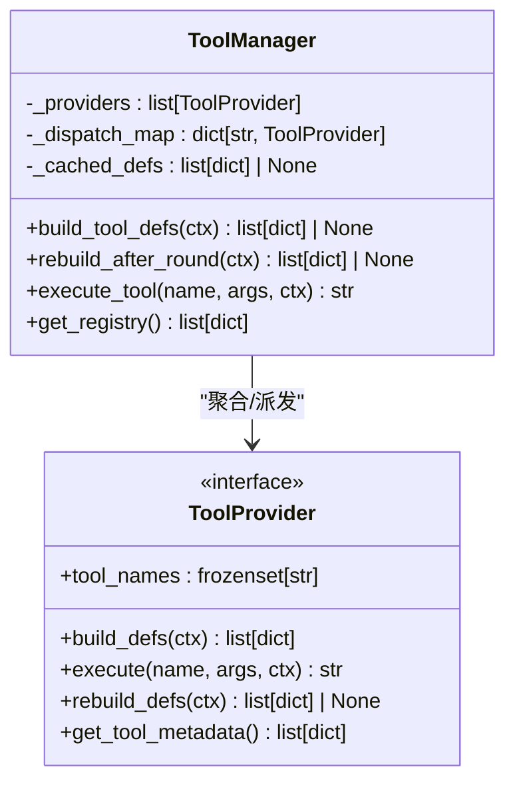
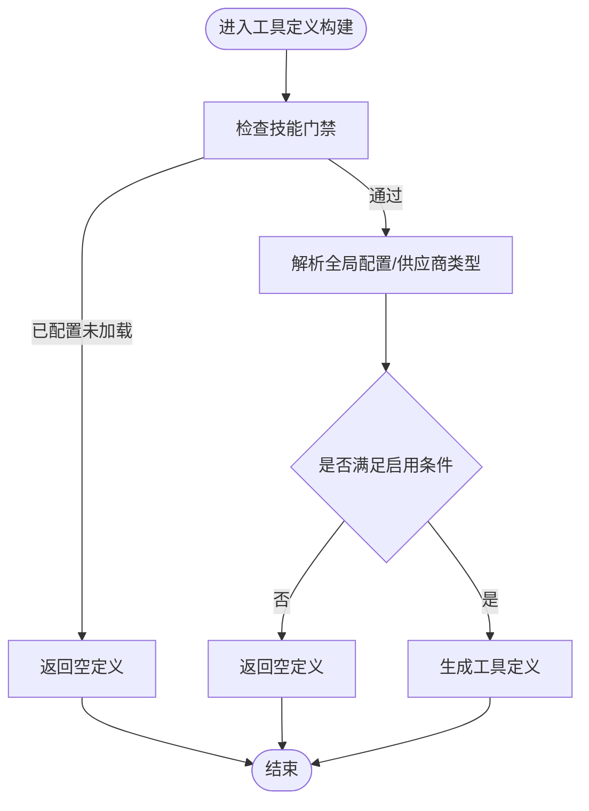
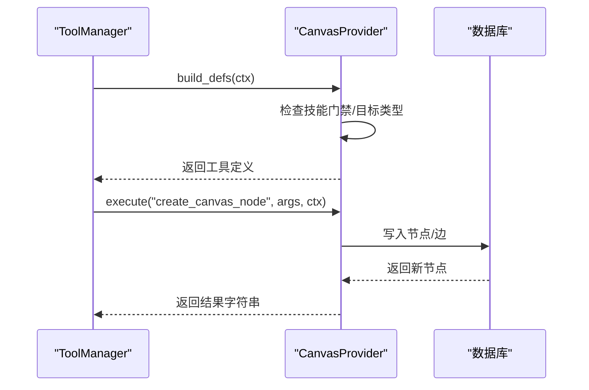
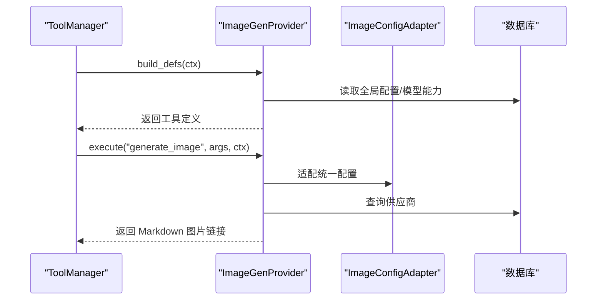
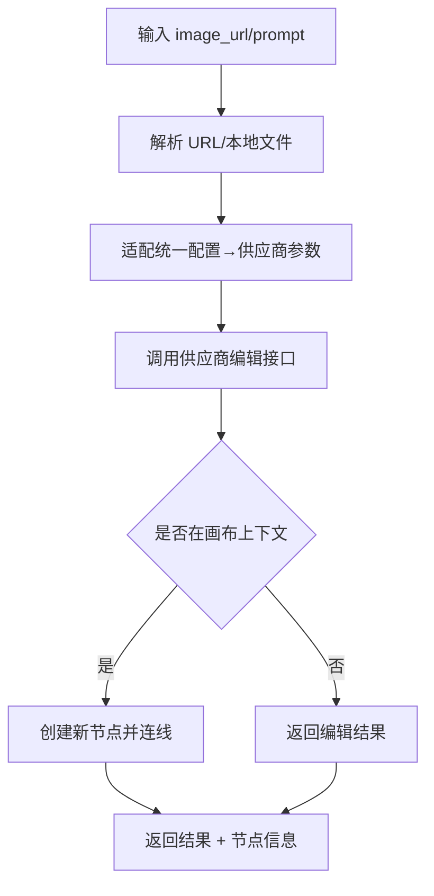
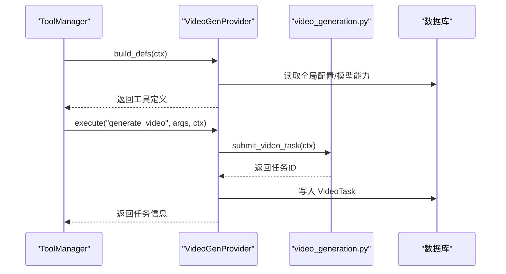
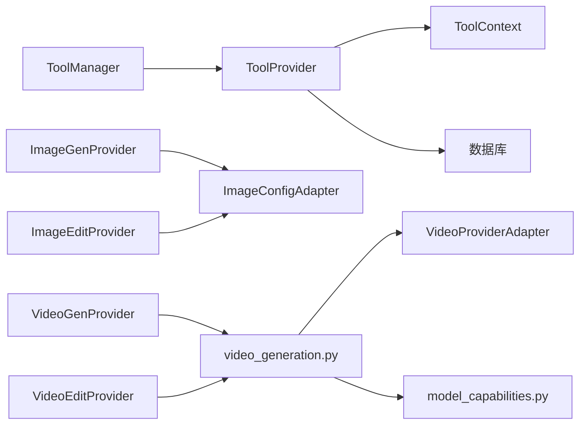

# 插件系统开发

<cite>
**本文引用的文件**
- [backend/services/tool_manager/manager.py](file://backend/services/tool_manager/manager.py)
- [backend/services/tool_manager/context.py](file://backend/services/tool_manager/context.py)
- [backend/services/tool_manager/protocol.py](file://backend/services/tool_manager/protocol.py)
- [backend/services/tool_manager/__init__.py](file://backend/services/tool_manager/__init__.py)
- [backend/services/tool_manager/providers/__init__.py](file://backend/services/tool_manager/providers/__init__.py)
- [backend/services/tool_manager/providers/canvas.py](file://backend/services/tool_manager/providers/canvas.py)
- [backend/services/tool_manager/providers/image_gen.py](file://backend/services/tool_manager/providers/image_gen.py)
- [backend/services/tool_manager/providers/image_edit.py](file://backend/services/tool_manager/providers/image_edit.py)
- [backend/services/tool_manager/providers/video_gen.py](file://backend/services/tool_manager/providers/video_gen.py)
- [backend/services/tool_manager/providers/video_edit.py](file://backend/services/tool_manager/providers/video_edit.py)
- [backend/services/image_config_adapter.py](file://backend/services/image_config_adapter.py)
- [backend/services/video_generation.py](file://backend/services/video_generation.py)
- [backend/services/video_providers/base.py](file://backend/services/video_providers/base.py)
- [backend/services/video_providers/model_capabilities.py](file://backend/services/video_providers/model_capabilities.py)
- [backend/models.py](file://backend/models.py)
</cite>

## 目录
1. [简介](#简介)
2. [项目结构](#项目结构)
3. [核心组件](#核心组件)
4. [架构总览](#架构总览)
5. [详细组件分析](#详细组件分析)
6. [依赖分析](#依赖分析)
7. [性能考量](#性能考量)
8. [故障排查指南](#故障排查指南)
9. [结论](#结论)
10. [附录](#附录)

## 简介
本指南面向插件系统开发者，系统性阐述工具插件的架构设计、接口规范与扩展机制，详解工具管理器的注册、发现与调用流程，并提供视频生成插件的开发示例，展示如何集成新的AI服务提供商。同时涵盖工具配置适配器的使用方法、自定义工具的开发流程、插件生命周期管理、依赖注入与错误处理机制，以及插件测试、性能监控与安全注意事项。最后给出图像生成、视频编辑与多媒体处理插件的具体实现思路。

## 项目结构
插件系统位于后端服务目录中，采用“工具管理器 + 工具提供者 + 适配器”的分层架构：
- 工具管理器：集中注册、发现与派发工具调用
- 工具提供者：按功能域划分（画布、图像生成、图像编辑、视频生成、视频编辑）
- 配置适配器：将统一配置转换为各供应商所需格式
- 视频适配器：统一视频生成入口与供应商适配器基类

**图表来源**
- [backend/services/tool_manager/manager.py:23-108](file://backend/services/tool_manager/manager.py#L23-L108)
- [backend/services/tool_manager/context.py:35-146](file://backend/services/tool_manager/context.py#L35-L146)
- [backend/services/tool_manager/protocol.py:11-44](file://backend/services/tool_manager/protocol.py#L11-L44)
- [backend/services/tool_manager/providers/__init__.py:4-25](file://backend/services/tool_manager/providers/__init__.py#L4-L25)
- [backend/services/image_config_adapter.py:173-185](file://backend/services/image_config_adapter.py#L173-L185)
- [backend/services/video_generation.py:52-82](file://backend/services/video_generation.py#L52-L82)
- [backend/services/video_providers/base.py:56-121](file://backend/services/video_providers/base.py#L56-L121)
- [backend/services/video_providers/model_capabilities.py:461-477](file://backend/services/video_providers/model_capabilities.py#L461-L477)

**章节来源**
- [backend/services/tool_manager/manager.py:23-108](file://backend/services/tool_manager/manager.py#L23-L108)
- [backend/services/tool_manager/context.py:35-146](file://backend/services/tool_manager/context.py#L35-L146)
- [backend/services/tool_manager/protocol.py:11-44](file://backend/services/tool_manager/protocol.py#L11-L44)
- [backend/services/tool_manager/providers/__init__.py:4-25](file://backend/services/tool_manager/providers/__init__.py#L4-L25)
- [backend/services/image_config_adapter.py:173-185](file://backend/services/image_config_adapter.py#L173-L185)
- [backend/services/video_generation.py:52-82](file://backend/services/video_generation.py#L52-L82)
- [backend/services/video_providers/base.py:56-121](file://backend/services/video_providers/base.py#L56-L121)
- [backend/services/video_providers/model_capabilities.py:461-477](file://backend/services/video_providers/model_capabilities.py#L461-L477)

## 核心组件
- 工具管理器（ToolManager）：负责收集所有工具提供者、构建工具定义、执行工具调用、重建工具定义、导出注册表
- 工具上下文（ToolContext）：承载当前请求所需的环境信息（如剧场ID、智能体、数据库会话、技能门禁、全局配置解析等）
- 工具协议（ToolProvider）：定义工具提供者的统一接口（工具名集合、构建定义、执行、重建定义、元数据）
- 工具提供者（Canvas/ImageGen/ImageEdit/VideoGen/VideoEdit）：各自实现具体工具逻辑与定义
- 配置适配器（ImageConfigAdapter）：将统一配置转换为各供应商参数
- 视频适配器（video_generation + VideoProviderAdapter + model_capabilities）：统一视频生成入口与模型能力

**章节来源**
- [backend/services/tool_manager/manager.py:23-108](file://backend/services/tool_manager/manager.py#L23-L108)
- [backend/services/tool_manager/context.py:35-146](file://backend/services/tool_manager/context.py#L35-L146)
- [backend/services/tool_manager/protocol.py:11-44](file://backend/services/tool_manager/protocol.py#L11-L44)
- [backend/services/tool_manager/providers/canvas.py:513-563](file://backend/services/tool_manager/providers/canvas.py#L513-L563)
- [backend/services/tool_manager/providers/image_gen.py:276-328](file://backend/services/tool_manager/providers/image_gen.py#L276-L328)
- [backend/services/tool_manager/providers/image_edit.py:524-581](file://backend/services/tool_manager/providers/image_edit.py#L524-L581)
- [backend/services/tool_manager/providers/video_gen.py:284-342](file://backend/services/tool_manager/providers/video_gen.py#L284-L342)
- [backend/services/tool_manager/providers/video_edit.py:228-286](file://backend/services/tool_manager/providers/video_edit.py#L228-L286)
- [backend/services/image_config_adapter.py:173-185](file://backend/services/image_config_adapter.py#L173-L185)
- [backend/services/video_generation.py:52-82](file://backend/services/video_generation.py#L52-L82)
- [backend/services/video_providers/base.py:56-121](file://backend/services/video_providers/base.py#L56-L121)
- [backend/services/video_providers/model_capabilities.py:461-477](file://backend/services/video_providers/model_capabilities.py#L461-L477)

## 架构总览
工具插件系统采用“协议驱动 + 动态定义 + 上下文感知”的设计：
- 协议驱动：所有工具提供者遵循 ToolProvider 协议，确保统一的构建/执行/重建/元数据接口
- 动态定义：根据上下文（技能门禁、全局配置、模型能力）动态生成工具定义，减少静态耦合
- 上下文感知：ToolContext 将数据库、智能体、剧场、日志溯源、缓存等贯穿工具执行全过程
- 适配与扩展：通过配置适配器与视频适配器，屏蔽供应商差异，便于新增提供商

**图表来源**
- [backend/services/tool_manager/manager.py:42-91](file://backend/services/tool_manager/manager.py#L42-L91)
- [backend/services/tool_manager/context.py:87-146](file://backend/services/tool_manager/context.py#L87-L146)
- [backend/services/tool_manager/providers/image_gen.py:287-314](file://backend/services/tool_manager/providers/image_gen.py#L287-L314)
- [backend/services/tool_manager/providers/video_gen.py:295-328](file://backend/services/tool_manager/providers/video_gen.py#L295-L328)

## 详细组件分析

### 工具管理器（ToolManager）
- 职责
  - 注册与聚合：从 providers 列表聚合所有 ToolProvider
  - 定义构建：遍历提供者构建工具定义，支持缓存与增量重建
  - 执行派发：按工具名 O(1) 查找提供者并执行
  - 注册表导出：为管理后台提供工具与提供者元数据
- 关键流程
  - 构建定义：build_tool_defs
  - 增量重建：rebuild_after_round（基于变更片段拼接）
  - 执行：execute（未知工具返回提示）

**图表来源**
- [backend/services/tool_manager/manager.py:23-108](file://backend/services/tool_manager/manager.py#L23-L108)
- [backend/services/tool_manager/protocol.py:11-44](file://backend/services/tool_manager/protocol.py#L11-L44)

**章节来源**
- [backend/services/tool_manager/manager.py:23-108](file://backend/services/tool_manager/manager.py#L23-L108)

### 工具上下文（ToolContext）
- 职责
  - 技能门禁：判断某技能是否已配置但未加载，用于延迟注入
  - 懒加载配置：全局图像/视频配置、供应商类型解析（带缓存）
  - 事件收集：在工具执行过程中收集视频任务信息，供上层通知
- 关键点
  - 通过数据库查询与缓存避免重复解析
  - 与模型能力/供应商类型解耦，便于扩展

**图表来源**
- [backend/services/tool_manager/context.py:67-146](file://backend/services/tool_manager/context.py#L67-L146)
- [backend/services/tool_manager/providers/image_gen.py:287-311](file://backend/services/tool_manager/providers/image_gen.py#L287-L311)
- [backend/services/tool_manager/providers/video_gen.py:295-325](file://backend/services/tool_manager/providers/video_gen.py#L295-L325)

**章节来源**
- [backend/services/tool_manager/context.py:35-146](file://backend/services/tool_manager/context.py#L35-L146)

### 工具协议（ToolProvider）
- 要求
  - 工具名集合：用于派发路由
  - 构建定义：返回 OpenAI 格式的函数定义
  - 执行：接收参数并返回字符串结果
  - 重建定义：在一轮工具调用后按需重建
  - 元数据：为管理后台提供简要元信息
- 设计要点
  - 使用运行时协议确保类型安全与可扩展性
  - 通过 frozenset 确保工具名唯一与不可变

**章节来源**
- [backend/services/tool_manager/protocol.py:11-44](file://backend/services/tool_manager/protocol.py#L11-L44)

### 画布工具提供者（CanvasProvider）
- 功能
  - 节点 CRUD：列出、获取、创建、更新、删除
  - 节点类型：文本、图像、视频、分镜
  - 技能门禁：canvas_tools 技能未加载时延迟注入
- 关键点
  - 节点类型枚举与参数校验
  - 自动布局与尺寸估算
  - 与数据库交互封装

**图表来源**
- [backend/services/tool_manager/providers/canvas.py:513-563](file://backend/services/tool_manager/providers/canvas.py#L513-L563)
- [backend/services/tool_manager/providers/canvas.py:300-475](file://backend/services/tool_manager/providers/canvas.py#L300-L475)

**章节来源**
- [backend/services/tool_manager/providers/canvas.py:513-563](file://backend/services/tool_manager/providers/canvas.py#L513-L563)

### 图像生成提供者（ImageGenProvider）
- 功能
  - 文本到图像生成，支持多供应商（xAI、Gemini、Ark）
  - 动态参数枚举：根据供应商能力调整 aspect_ratio、质量等
  - 统一配置：从 ToolConfig 读取全局配置
- 关键点
  - 供应商调度表：_IMAGE_GENERATORS
  - 配置适配：to_provider_config
  - 批量生成与错误处理

**图表来源**
- [backend/services/tool_manager/providers/image_gen.py:276-328](file://backend/services/tool_manager/providers/image_gen.py#L276-L328)
- [backend/services/image_config_adapter.py:173-185](file://backend/services/image_config_adapter.py#L173-L185)

**章节来源**
- [backend/services/tool_manager/providers/image_gen.py:276-328](file://backend/services/tool_manager/providers/image_gen.py#L276-L328)
- [backend/services/image_config_adapter.py:173-185](file://backend/services/image_config_adapter.py#L173-L185)

### 图像编辑提供者（ImageEditProvider）
- 功能
  - 对现有图像进行编辑（风格化、增强、修改）
  - 支持 xAI 与 Gemini 供应商
  - 画布联动：成功编辑后创建新节点并连线
- 关键点
  - URL 解析与本地文件转 data URL
  - 供应商特定参数提取
  - 与画布节点的创建与连线

**图表来源**
- [backend/services/tool_manager/providers/image_edit.py:435-518](file://backend/services/tool_manager/providers/image_edit.py#L435-L518)
- [backend/services/tool_manager/providers/image_edit.py:352-433](file://backend/services/tool_manager/providers/image_edit.py#L352-L433)

**章节来源**
- [backend/services/tool_manager/providers/image_edit.py:524-581](file://backend/services/tool_manager/providers/image_edit.py#L524-L581)

### 视频生成提供者（VideoGenProvider）
- 功能
  - 文本/图像到视频生成，异步任务
  - 统一入口：submit_video_task
  - 模型能力：动态参数枚举（模式、宽高比、时长、分辨率）
- 关键点
  - 供应商类型解析：优先 LLMProvider.provider_type，其次模型名推断
  - 本地媒体转 data URI
  - VideoTask 记录与 SSE 通知

**图表来源**
- [backend/services/tool_manager/providers/video_gen.py:284-342](file://backend/services/tool_manager/providers/video_gen.py#L284-L342)
- [backend/services/video_generation.py:90-126](file://backend/services/video_generation.py#L90-L126)

**章节来源**
- [backend/services/tool_manager/providers/video_gen.py:284-342](file://backend/services/tool_manager/providers/video_gen.py#L284-L342)
- [backend/services/video_generation.py:90-126](file://backend/services/video_generation.py#L90-L126)

### 视频编辑提供者（VideoEditProvider）
- 功能
  - 编辑/扩展已有视频，异步任务
  - 模式映射：edit/extend → video_mode
  - 模型能力检测：supports_video_edit/supported_video_extension
- 关键点
  - 与 VideoGenProvider 共享全局配置
  - VideoContext 字段映射

**章节来源**
- [backend/services/tool_manager/providers/video_edit.py:228-286](file://backend/services/tool_manager/providers/video_edit.py#L228-L286)

### 配置适配器（ImageConfigAdapter）
- 功能
  - 统一 image_config → 供应商特定参数
  - 映射表：质量→分辨率/尺寸、批次数、宽高比、输出格式
  - 能力暴露：IMAGE_PROVIDER_CAPABILITIES
- 使用建议
  - 在工具执行前调用 to_provider_config
  - 优先使用全局 ToolConfig，其次回退到历史配置

**章节来源**
- [backend/services/image_config_adapter.py:173-185](file://backend/services/image_config_adapter.py#L173-L185)

### 视频适配器与模型能力
- VideoProviderAdapter 基类
  - 统一 submit/poll 接口
  - 状态映射与模型支持检测
- video_generation.py
  - 供应商注册表与统一入口
  - 轮询与 MiniMax URL 获取
- model_capabilities.py
  - 模型能力表：支持模式、时长、分辨率、参考图、扩展/编辑能力等
  - 动态参数枚举生成

**章节来源**
- [backend/services/video_providers/base.py:56-121](file://backend/services/video_providers/base.py#L56-L121)
- [backend/services/video_generation.py:52-82](file://backend/services/video_generation.py#L52-L82)
- [backend/services/video_providers/model_capabilities.py:461-477](file://backend/services/video_providers/model_capabilities.py#L461-L477)

## 依赖分析
- 组件耦合
  - ToolManager 与 ToolProvider：松耦合，通过协议与工具名映射
  - ToolProvider 与 ToolContext：强上下文依赖，贯穿构建与执行
  - 工具提供者与数据库：按需查询，避免全局注入
  - 视频管线：VideoGenProvider/VideoEditProvider 依赖 video_generation 与 model_capabilities
- 外部依赖
  - 供应商 API：xAI、Gemini、MiniMax、Ark
  - 数据库：SQLAlchemy ORM
  - 配置存储：ToolConfig、LLMProvider

**图表来源**
- [backend/services/tool_manager/manager.py:23-108](file://backend/services/tool_manager/manager.py#L23-L108)
- [backend/services/tool_manager/providers/image_gen.py:276-328](file://backend/services/tool_manager/providers/image_gen.py#L276-L328)
- [backend/services/tool_manager/providers/image_edit.py:524-581](file://backend/services/tool_manager/providers/image_edit.py#L524-L581)
- [backend/services/tool_manager/providers/video_gen.py:284-342](file://backend/services/tool_manager/providers/video_gen.py#L284-L342)
- [backend/services/tool_manager/providers/video_edit.py:228-286](file://backend/services/tool_manager/providers/video_edit.py#L228-L286)
- [backend/services/video_generation.py:52-82](file://backend/services/video_generation.py#L52-L82)
- [backend/services/video_providers/model_capabilities.py:461-477](file://backend/services/video_providers/model_capabilities.py#L461-L477)

**章节来源**
- [backend/services/tool_manager/manager.py:23-108](file://backend/services/tool_manager/manager.py#L23-L108)
- [backend/services/tool_manager/providers/__init__.py:4-25](file://backend/services/tool_manager/providers/__init__.py#L4-L25)

## 性能考量
- 定义缓存与增量重建
  - ToolManager 缓存工具定义，rebuild_after_round 仅替换变更片段，降低重复构建成本
- 懒加载与缓存
  - ToolContext 对全局配置与供应商类型解析进行缓存，避免重复查询
- 并发与超时
  - 供应商 API 调用应设置合理超时与重试策略
- 数据库访问
  - 合理使用 select 查询与事务，避免 N+1 查询
- 模型能力预取
  - 在工具定义阶段一次性获取模型能力，减少多次查询

[本节为通用指导，无需特定文件来源]

## 故障排查指南
- 工具未出现
  - 检查技能门禁：is_skill_gated 是否导致延迟注入
  - 检查全局配置：ToolConfig 中对应工具是否启用
  - 检查供应商类型：resolve_image_provider_type/resolve_video_provider_type 是否正确
- 工具执行失败
  - 查看提供者异常捕获与错误返回
  - 检查供应商 API Key、Base URL、模型名
  - 对于视频任务，确认 VideoTask 记录与轮询流程
- 配置不生效
  - 确认统一配置已通过 to_provider_config 适配
  - 检查全局 ToolConfig 与 Agent 层配置优先级

**章节来源**
- [backend/services/tool_manager/context.py:67-146](file://backend/services/tool_manager/context.py#L67-L146)
- [backend/services/tool_manager/providers/image_gen.py:237-269](file://backend/services/tool_manager/providers/image_gen.py#L237-L269)
- [backend/services/tool_manager/providers/video_gen.py:227-237](file://backend/services/tool_manager/providers/video_gen.py#L227-L237)
- [backend/services/image_config_adapter.py:173-185](file://backend/services/image_config_adapter.py#L173-L185)

## 结论
该插件系统通过协议驱动与上下文感知，实现了工具的统一注册、动态定义与派发执行。配置适配器与视频适配器有效屏蔽了供应商差异，便于快速集成新的AI服务提供商。建议在扩展新工具时遵循 ToolProvider 协议，利用 ToolContext 进行上下文感知，结合配置适配器与模型能力表生成动态参数，确保工具定义与执行的一致性与可维护性。

[本节为总结，无需特定文件来源]

## 附录

### 开发新视频提供商的步骤
- 定义适配器
  - 继承 VideoProviderAdapter，实现 submit/poll（必要时实现 get_video_url）
  - 定义 SUPPORTED_MODELS 与 STATUS_MAP
- 注册适配器
  - 在 video_generation.py 的注册表中添加映射
- 集成工具
  - 在 VideoGenProvider/VideoEditProvider 中启用该供应商类型
  - 确保模型能力表包含对应模型配置
- 测试与验证
  - 单元测试覆盖 submit/poll 与状态映射
  - 端到端测试提交与轮询流程

**章节来源**
- [backend/services/video_providers/base.py:56-121](file://backend/services/video_providers/base.py#L56-L121)
- [backend/services/video_generation.py:52-82](file://backend/services/video_generation.py#L52-L82)
- [backend/services/video_providers/model_capabilities.py:461-477](file://backend/services/video_providers/model_capabilities.py#L461-L477)

### 自定义工具开发流程
- 实现 ToolProvider
  - 定义 tool_names、build_defs、execute、rebuild_defs、get_tool_metadata
- 注册提供者
  - 在 providers/__init__.py 的 ALL_PROVIDERS 中加入实例
- 集成到管理器
  - ToolManager 初始化时会自动加载 ALL_PROVIDERS
- 配置与测试
  - 通过 ToolConfig 与 Agent 配置启用工具
  - 编写单元测试与集成测试

**章节来源**
- [backend/services/tool_manager/protocol.py:11-44](file://backend/services/tool_manager/protocol.py#L11-L44)
- [backend/services/tool_manager/providers/__init__.py:4-25](file://backend/services/tool_manager/providers/__init__.py#L4-L25)
- [backend/services/tool_manager/manager.py:26-37](file://backend/services/tool_manager/manager.py#L26-L37)

### 工具配置适配器使用方法
- 统一配置
  - 在 ToolConfig 中设置 image_generation_enabled 与 image_config
- 适配转换
  - 调用 to_provider_config(provider_type, unified_config)
- 参数映射
  - 质量→分辨率/尺寸、批次数、宽高比、输出格式等映射
- 能力暴露
  - 使用 IMAGE_PROVIDER_CAPABILITIES 生成参数枚举

**章节来源**
- [backend/services/image_config_adapter.py:173-185](file://backend/services/image_config_adapter.py#L173-L185)

### 插件生命周期管理
- 注册期
  - 提供者实例化并加入 ALL_PROVIDERS
- 构建期
  - ToolManager.build_tool_defs 逐个调用提供者 build_defs
- 执行期
  - ToolManager.execute_tool 派发到具体提供者
- 重建期
  - ToolManager.rebuild_after_round 增量重建
- 注销期
  - 通过重新初始化 ToolManager 或移除提供者实例实现

**章节来源**
- [backend/services/tool_manager/manager.py:42-91](file://backend/services/tool_manager/manager.py#L42-L91)
- [backend/services/tool_manager/providers/__init__.py:4-25](file://backend/services/tool_manager/providers/__init__.py#L4-L25)

### 错误处理机制
- 提供者内部捕获异常并返回结构化错误
- ToolManager 在未知工具名时返回提示
- ToolContext 提供懒加载与缓存，避免重复错误
- 视频任务失败时记录错误信息并返回

**章节来源**
- [backend/services/tool_manager/providers/image_gen.py:250-269](file://backend/services/tool_manager/providers/image_gen.py#L250-L269)
- [backend/services/tool_manager/providers/image_edit.py:515-518](file://backend/services/tool_manager/providers/image_edit.py#L515-L518)
- [backend/services/tool_manager/providers/video_gen.py:227-237](file://backend/services/tool_manager/providers/video_gen.py#L227-L237)

### 性能监控与安全考虑
- 性能监控
  - 记录工具执行耗时与错误率
  - 监控供应商 API 响应时间与失败率
- 安全考虑
  - 严格校验工具参数与 URL
  - 限制批量生成数量与分辨率
  - 保护 API Key 与敏感配置

[本节为通用指导，无需特定文件来源]