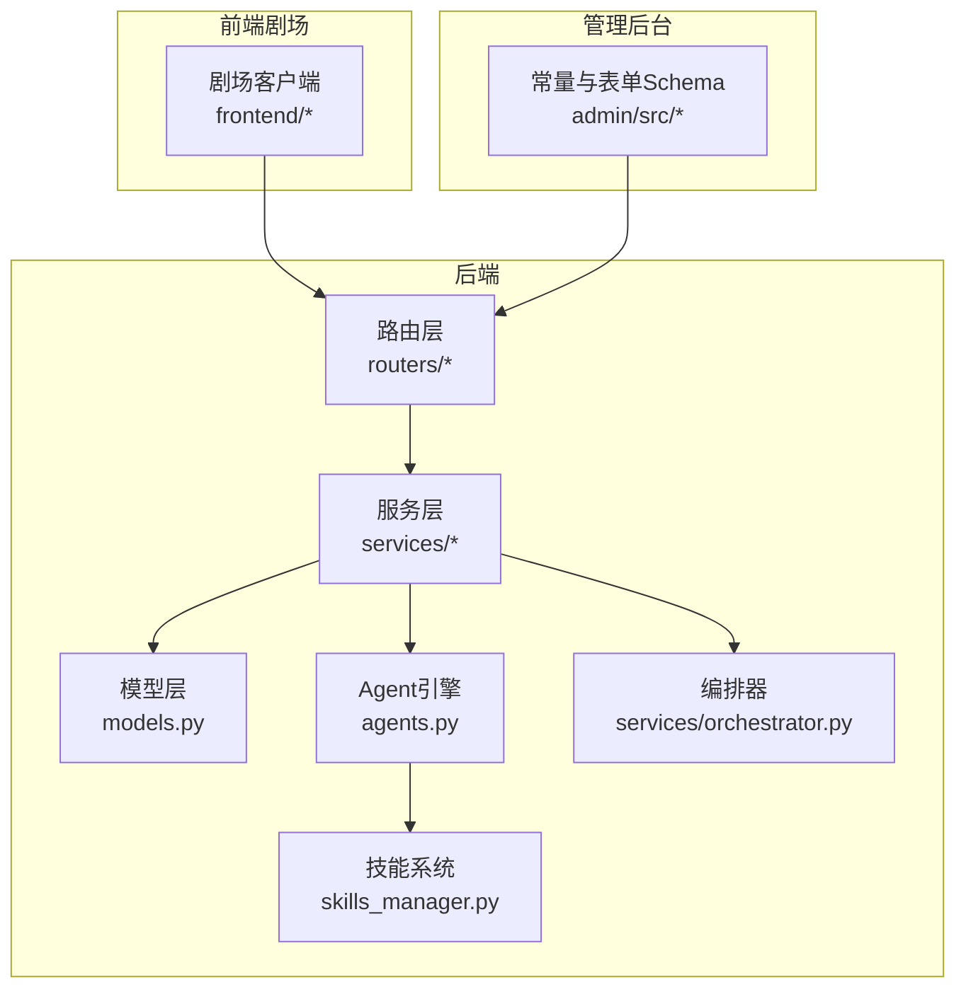
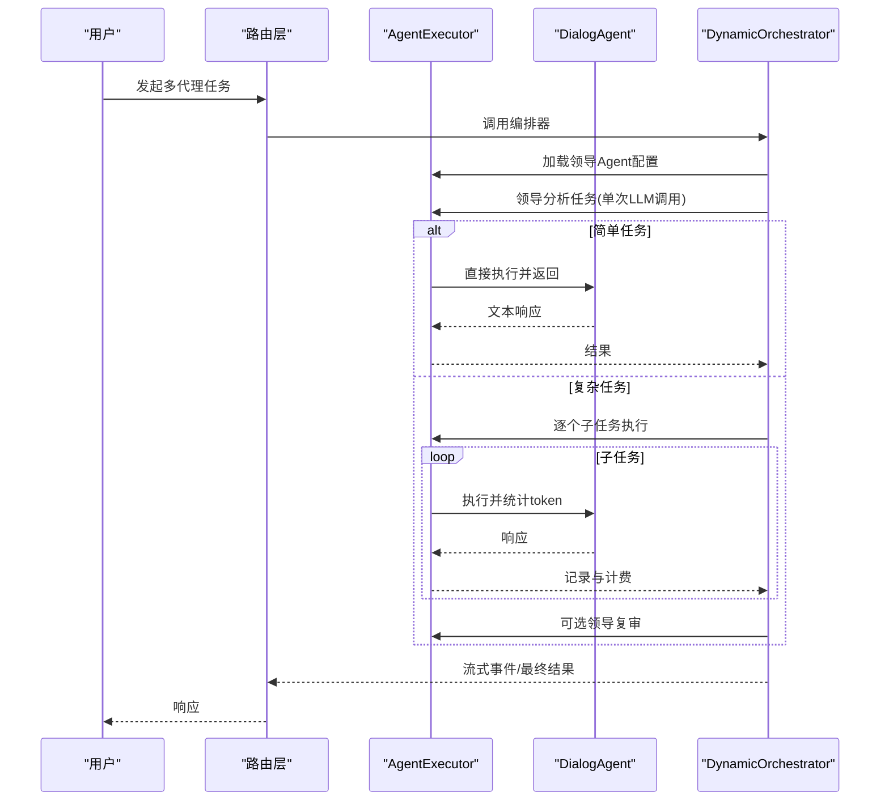
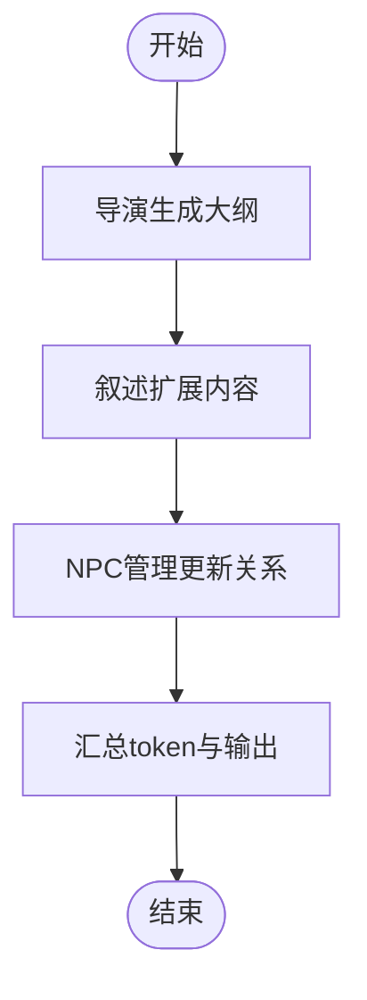
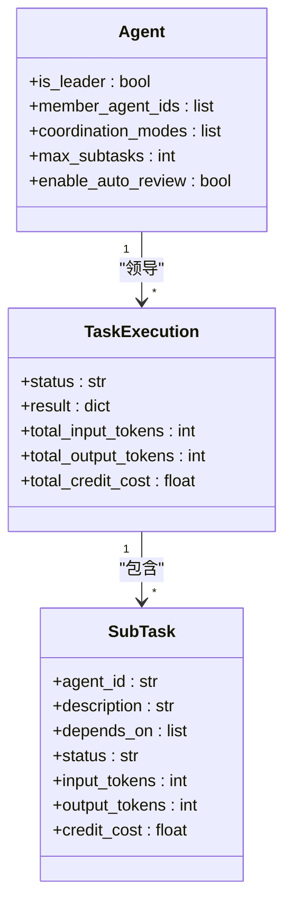
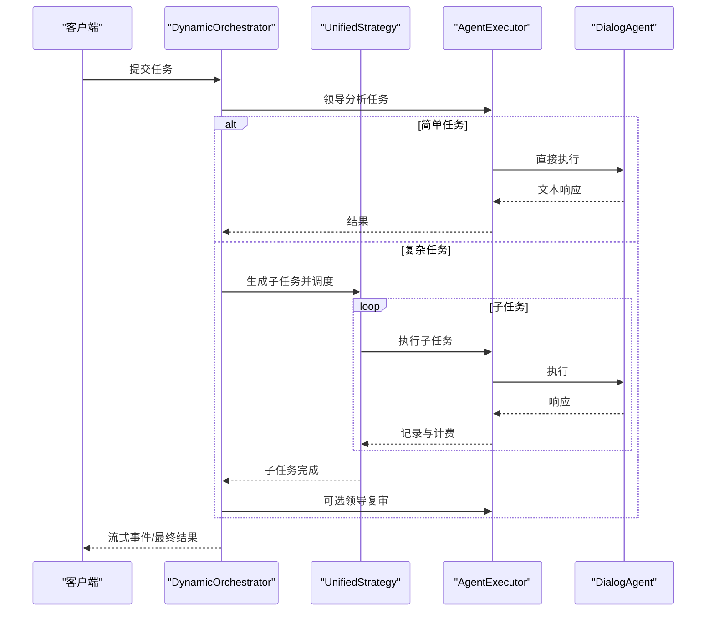
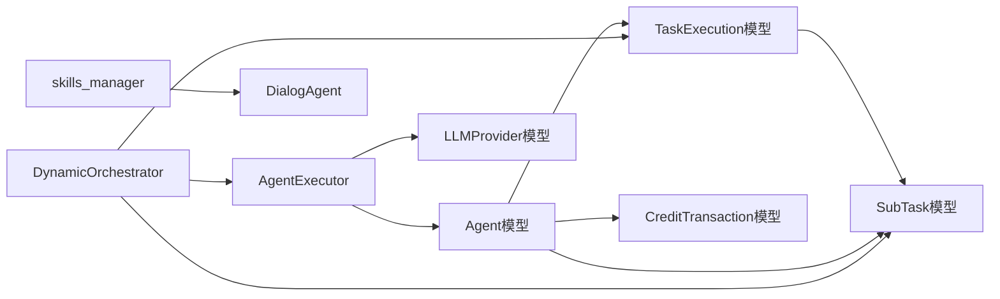

# 智能代理配置

<cite>
**本文引用的文件**
- [models.py](file://backend/models.py)
- [schemas.py](file://backend/schemas.py)
- [agents.py](file://backend/agents.py)
- [agent_extensions.py](file://backend/agent_extensions.py)
- [orchestrator.py](file://backend/services/orchestrator.py)
- [agent_executor.py](file://backend/services/agent_executor.py)
- [skills_manager.py](file://backend/skills_manager.py)
- [d8e9f0a1b2c3_add_multi_agent_collaboration.py](file://backend/migrations/versions/d8e9f0a1b2c3_add_multi_agent_collaboration.py)
- [agent.ts](file://backend/admin/src/constants/agent.ts)
- [schema.ts](file://backend/admin/src/components/admin/agents/AgentForm/schema.ts)
- [README.md](file://README.md)
</cite>

## 目录
1. [简介](#简介)
2. [项目结构](#项目结构)
3. [核心组件](#核心组件)
4. [架构总览](#架构总览)
5. [详细组件分析](#详细组件分析)
6. [依赖关系分析](#依赖关系分析)
7. [性能考虑](#性能考虑)
8. [故障排除指南](#故障排除指南)
9. [结论](#结论)
10. [附录](#附录)

## 简介
本指南面向智能代理配置与运维人员，系统阐述多智能体（Agent）的类型与职责、配置参数与调优方法、多代理协作机制、生命周期与状态管理、性能监控与日志、以及最佳实践与常见问题排查。系统基于AgentScope多智能体框架，结合FastAPI后端与Next.js管理后台，提供从配置到执行的全链路能力。

## 项目结构
后端采用分层架构：路由层(routers)、服务层(services)、模型层(models)、工具与技能层(skills_manager、skills)、以及管理后台(admin)。前端剧场客户端(frontend)与管理后台(admin)分别提供创作与配置入口。

图表来源
- [README.md: 39-46:39-46](file://README.md#L39-L46)
- [models.py: 210-273:210-273](file://backend/models.py#L210-L273)
- [agents.py: 40-388:40-388](file://backend/agents.py#L40-L388)
- [orchestrator.py: 418-534:418-534](file://backend/services/orchestrator.py#L418-L534)

章节来源
- [README.md: 63-79:63-79](file://README.md#L63-L79)

## 核心组件
- 智能体类型与职责
  - 导演代理(Director)：负责剧情大纲与任务分解，确保叙事一致性与目标达成。
  - 叙述代理(Narrator)：将大纲转化为沉浸式文本，注重细节与情感表达。
  - NPC管理员代理(NPC_Manager)：跟踪角色关系与隐藏属性，决定NPC反应与互动。
- 配置参数总览
  - 系统提示词(system_prompt)：定义角色职责与行为边界。
  - 模型选择(provider_id + model)：绑定LLM供应商与具体模型。
  - 工具配置(tools_enabled + tools)：启用技能与工具集。
  - 参数调优(temperature、context_window、thinking_mode)：影响推理稳定性与上下文容量。
  - 计费参数：按输入/输出tokens与图像/搜索/视频等维度计费。
  - 多代理协作：is_leader、coordination_modes、member_agent_ids、max_subtasks、enable_auto_review。
  - 统一图像/视频配置：跨供应商的统一参数与供应商特定配置。
  - 上下文压缩(compaction_config)：控制记忆压缩策略与阈值。
- 生命周期与状态
  - 数据持久化：Agent、TaskExecution、SubTask、CreditTransaction等模型。
  - 执行器：AgentExecutor封装对话式执行与流式输出。
  - 编排器：DynamicOrchestrator基于领导智能体分析任务并调度子任务。
  - 技能系统：skills_manager管理内置/定制/激活技能目录。

章节来源
- [agents.py: 300-316:300-316](file://backend/agents.py#L300-L316)
- [schemas.py: 239-357:239-357](file://backend/schemas.py#L239-L357)
- [models.py: 210-273:210-273](file://backend/models.py#L210-L273)
- [agent_executor.py: 63-277:63-277](file://backend/services/agent_executor.py#L63-L277)
- [orchestrator.py: 418-534:418-534](file://backend/services/orchestrator.py#L418-L534)

## 架构总览
多智能体协作通过“领导智能体 + 成员智能体”的统一策略执行，支持简单任务直返与复杂任务的子任务分解与依赖调度。执行器负责与LLM交互并统计token用量，计费系统按维度映射表计算积分消耗。

图表来源
- [orchestrator.py: 437-534:437-534](file://backend/services/orchestrator.py#L437-L534)
- [agent_executor.py: 74-126:74-126](file://backend/services/agent_executor.py#L74-L126)
- [agents.py: 114-174:114-174](file://backend/agents.py#L114-L174)

## 详细组件分析

### 导演代理、叙述代理与NPC管理员代理
- 角色分工
  - 导演：制定章节大纲，确保主线推进与目标一致性。
  - 叙述：将大纲扩展为具体文本，强调画面感与情绪。
  - NPC管理：根据剧情更新角色关系与隐藏属性。
- 配置要点
  - 系统提示词明确职责边界与协作方式。
  - 模型选择与温度参数影响创意稳定性与多样性。
  - 工具启用可增强角色设计、图像生成或视频能力。
- 执行流程
  - 导演生成大纲 → 叙述扩展内容 → NPC管理更新关系。
  - 统计各阶段token并汇总，便于计费与审计。

图表来源
- [agents.py: 322-383:322-383](file://backend/agents.py#L322-L383)

章节来源
- [agents.py: 300-316:300-316](file://backend/agents.py#L300-L316)
- [agents.py: 322-383:322-383](file://backend/agents.py#L322-L383)

### 多代理协作配置与任务分配
- 领导者配置
  - is_leader：标记为领导者。
  - member_agent_ids：可编排的成员智能体ID集合。
  - coordination_modes：统一协作模式。
  - max_subtasks：最大子任务数。
  - enable_auto_review：是否自动复审。
- 任务分析与分解
  - 领导智能体一次性分析任务，判定简单/复杂。
  - 复杂任务生成子任务规范，包含agent_id、描述与依赖索引。
- 执行策略
  - UnifiedStrategy按依赖层级并发/串行执行子任务。
  - 支持流式输出与非流式批处理两种路径。
  - 可选领导复审整合子任务输出。

图表来源
- [models.py: 303-350:303-350](file://backend/models.py#L303-L350)
- [models.py: 210-273:210-273](file://backend/models.py#L210-L273)
- [orchestrator.py: 29-58:29-58](file://backend/services/orchestrator.py#L29-L58)

章节来源
- [orchestrator.py: 418-534:418-534](file://backend/services/orchestrator.py#L418-L534)
- [d8e9f0a1b2c3_add_multi_agent_collaboration.py: 21-104:21-104](file://backend/migrations/versions/d8e9f0a1b2c3_add_multi_agent_collaboration.py#L21-L104)

### Agent配置参数详解与设置方法
- 基础参数
  - name、description：智能体标识与描述。
  - provider_id、model：绑定LLM供应商与模型。
  - system_prompt：系统提示词，定义角色职责。
  - temperature、context_window：推理温度与上下文窗口。
  - thinking_mode：思维模式开关（与Gemini兼容）。
- 工具与能力
  - tools_enabled：是否启用工具能力。
  - tools：启用的技能/工具清单。
  - target_node_types：可控制的画布节点类型集合。
- 计费参数
  - input_credit_per_1m、output_credit_per_1m、image_output_credit_per_1m、search_credit_per_query。
  - 视频计费：video_input_image_credit、video_input_second_credit、video_output_480p_credit、video_output_720p_credit。
- 统一图像/视频配置
  - image_config：统一图像生成配置（跨供应商）。
  - video_config：视频生成开关。
  - gemini_config：Gemini特定配置（思考等级、媒体分辨率、搜索开关等）。
- 上下文压缩
  - compaction_config：启用、提供者、模型、压缩比例、保留比例、工具消息阈值与最近N条保留等。

章节来源
- [schemas.py: 239-357:239-357](file://backend/schemas.py#L239-L357)
- [agent.ts: 1-27:1-27](file://backend/admin/src/constants/agent.ts#L1-L27)
- [schema.ts: 48-98:48-98](file://backend/admin/src/components/admin/agents/AgentForm/schema.ts#L48-L98)

### 执行器与编排器：对话式执行与流式输出
- AgentExecutor
  - 加载Agent与LLM Provider配置，构建DialogAgent。
  - 支持非流式execute与流式execute_streaming。
  - 统一token统计与内容归一化。
- 编排器DynamicOrchestrator
  - 领导分析任务，生成TaskAnalysis。
  - 简单任务直返；复杂任务按依赖执行并可选复审。
  - 事件驱动：task_start、task_analyzed、subtask_*、task_completed等。

图表来源
- [agent_executor.py: 74-126:74-126](file://backend/services/agent_executor.py#L74-L126)
- [agent_executor.py: 127-208:127-208](file://backend/services/agent_executor.py#L127-L208)
- [orchestrator.py: 535-596:535-596](file://backend/services/orchestrator.py#L535-L596)

章节来源
- [agent_executor.py: 63-277:63-277](file://backend/services/agent_executor.py#L63-L277)
- [orchestrator.py: 418-534:418-534](file://backend/services/orchestrator.py#L418-L534)

### 技能系统与工具配置
- 技能目录
  - builtin_skills：内置技能。
  - customized_skills：定制技能（可覆盖内置）。
  - active_skills：当前激活技能目录。
- 同步与加载
  - sync_skills_to_working_dir：将内置/定制技能同步到激活目录。
  - list_available_skills：列出可用技能名称。
  - DialogAgent注册技能：在运行时加载并注册到Toolkit。

章节来源
- [skills_manager.py: 180-226:180-226](file://backend/skills_manager.py#L180-L226)
- [skills_manager.py: 233-244:233-244](file://backend/skills_manager.py#L233-L244)
- [agents.py: 85-113:85-113](file://backend/agents.py#L85-L113)

### 上下文压缩与内存管理
- MemoryCompactionHook
  - 在推理前检查内存大小（估算token），超过阈值时进行摘要压缩。
  - 保留系统提示与最近消息，其余历史摘要替换。
- ToolGuardMixin
  - 工具拦截：严格禁止危险工具；受保护工具需审批（预留）。

章节来源
- [agent_extensions.py: 81-163:81-163](file://backend/agent_extensions.py#L81-L163)

### 计费与积分管理
- 计费维度映射表
  - 文本输入/输出、图像输出、搜索、图像生成等维度按scale映射。
- 视频计费
  - 按输入图片/秒、输出时长与质量维度计费。
- 原子扣费与退款
  - deduct_credits_atomic：并发安全扣费。
  - refund_credits_atomic：原子退款。
- 交易记录
  - CreditTransaction记录余额变化与明细。

章节来源
- [billing.py: 12-30:12-30](file://backend/services/billing.py#L12-L30)
- [billing.py: 310-351:310-351](file://backend/services/billing.py#L310-L351)
- [billing.py: 353-387:353-387](file://backend/services/billing.py#L353-L387)
- [billing.py: 178-308:178-308](file://backend/services/billing.py#L178-L308)

## 依赖关系分析
- 数据模型
  - Agent：智能体配置与协作参数。
  - TaskExecution/SubTask：多代理任务执行与子任务记录。
  - CreditTransaction：积分交易流水。
- 服务依赖
  - AgentExecutor依赖Agent与LLMProvider配置。
  - DynamicOrchestrator依赖AgentExecutor与数据库事务。
  - skills_manager与agents.py共同驱动工具注册。
- 管理后台
  - constants与AgentForm schema约束配置项范围与校验规则。

图表来源
- [models.py: 210-273:210-273](file://backend/models.py#L210-L273)
- [models.py: 303-350:303-350](file://backend/models.py#L303-L350)
- [models.py: 281-301:281-301](file://backend/models.py#L281-L301)
- [agent_executor.py: 210-225:210-225](file://backend/services/agent_executor.py#L210-L225)
- [orchestrator.py: 637-659:637-659](file://backend/services/orchestrator.py#L637-L659)
- [skills_manager.py: 228-231:228-231](file://backend/skills_manager.py#L228-L231)

章节来源
- [models.py: 210-273:210-273](file://backend/models.py#L210-L273)
- [models.py: 303-350:303-350](file://backend/models.py#L303-L350)
- [models.py: 281-301:281-301](file://backend/models.py#L281-L301)
- [agent_executor.py: 210-225:210-225](file://backend/services/agent_executor.py#L210-L225)
- [orchestrator.py: 637-659:637-659](file://backend/services/orchestrator.py#L637-L659)

## 性能考虑
- 上下文压缩
  - 合理设置compaction_config的compact_ratio与reserve_ratio，平衡精度与成本。
  - 控制context_window与temperature，避免过长上下文导致延迟与费用上升。
- 并发与流式
  - 复杂任务尽量利用并行执行（同一依赖层级），减少串行等待。
  - 流式输出提升用户体验，但需注意网络与前端渲染压力。
- 工具与技能
  - 仅启用必要工具，避免不必要的API调用与token消耗。
  - 技能同步策略避免频繁覆盖，减少冷启动开销。

## 故障排除指南
- 任务失败
  - 检查TaskExecution与SubTask状态与错误信息，定位失败子任务。
  - 查看AgentExecutor执行结果中的input/output tokens与错误堆栈。
- 余额不足或冻结
  - 使用check_balance_sufficient确认余额与冻结状态。
  - 通过deduct_credits_atomic或refund_credits_atomic修正余额。
- 工具调用被拦截
  - ToolGuardMixin会拒绝危险工具；受保护工具需审批流程。
- 计费异常
  - 核对calculate_credit_cost的维度映射与scale，确保费率正确。
  - 检查视频计费维度与质量映射是否匹配。

章节来源
- [orchestrator.py: 535-596:535-596](file://backend/services/orchestrator.py#L535-L596)
- [billing.py: 45-84:45-84](file://backend/services/billing.py#L45-L84)
- [billing.py: 178-308:178-308](file://backend/services/billing.py#L178-L308)
- [agent_extensions.py: 19-79:19-79](file://backend/agent_extensions.py#L19-L79)

## 结论
本配置指南围绕智能代理的类型划分、参数设置、协作机制、生命周期与计费体系，提供了从理论到实操的完整路径。通过合理的系统提示词、模型与工具配置、统一的编排策略与上下文压缩，可在保证质量的同时控制成本与延迟。配合完善的日志与计费审计，可实现稳定高效的多智能体创作平台。

## 附录
- 最佳实践
  - 为每个智能体明确system_prompt与职责边界，避免角色冲突。
  - 合理设置max_subtasks与依赖关系，避免环依赖与过度并发。
  - 启用上下文压缩与合适的context_window，平衡成本与效果。
  - 为高价值任务配置自动复审，确保输出质量。
- 常见问题
  - 任务卡在“分析”阶段：检查领导智能体的模型可用性与API密钥。
  - 子任务执行失败：查看子任务错误信息与对应Agent的工具权限。
  - 积分异常：核对calculate_credit_cost的维度与scale，检查交易记录。