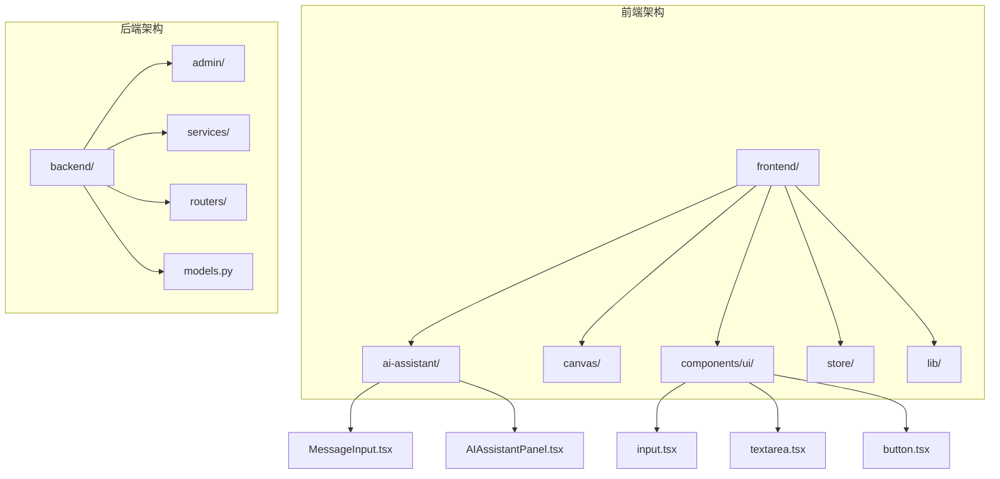
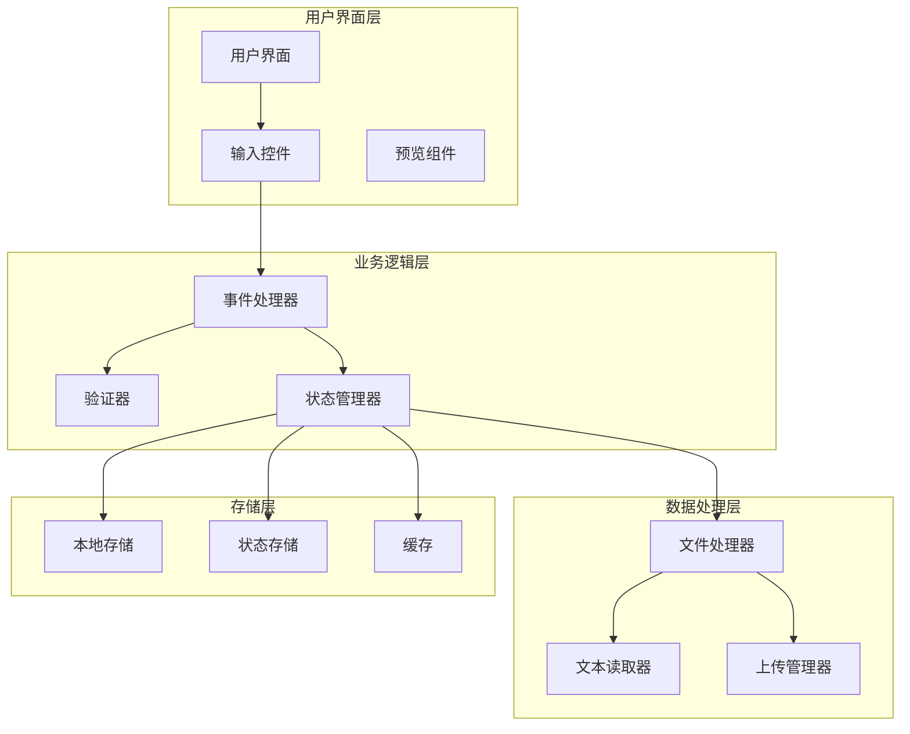
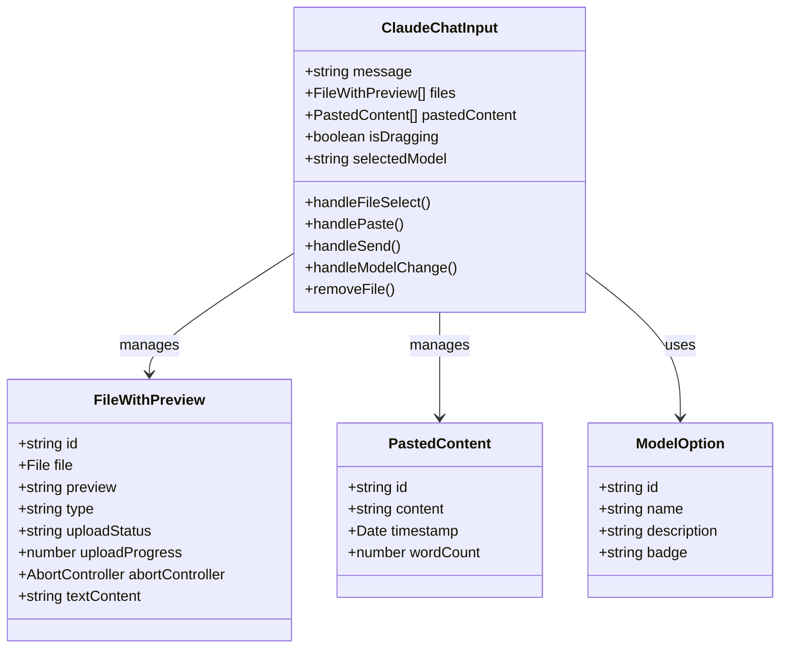
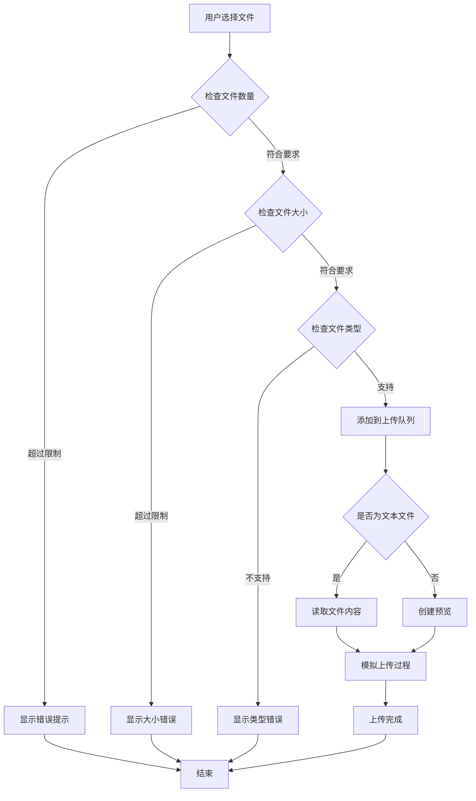
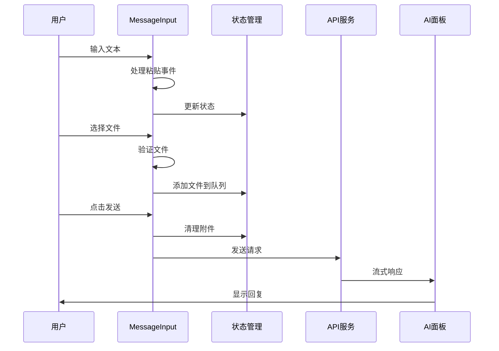
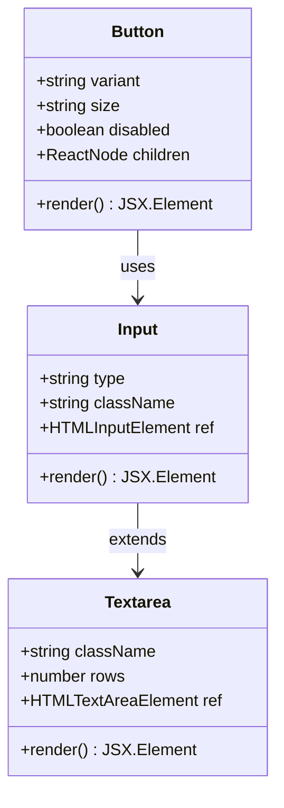
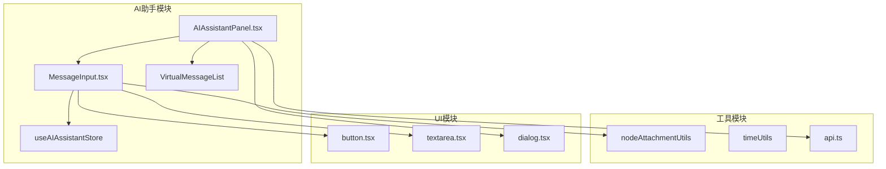
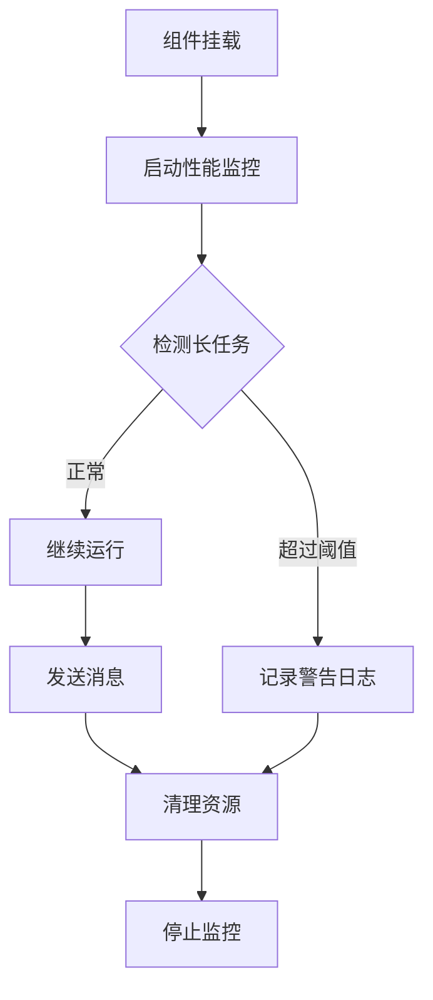

# 用户输入组件设计指南

<cite>
**本文档引用的文件**
- [用户输入组件设计指南.md](file://用户输入组件设计指南.md)
- [MessageInput.tsx](file://frontend/src/components/ai-assistant/MessageInput.tsx)
- [AIAssistantPanel.tsx](file://frontend/src/components/canvas/AIAssistantPanel.tsx)
- [textarea.tsx](file://frontend/src/components/ui/textarea.tsx)
- [input.tsx](file://frontend/src/components/ui/input.tsx)
- [button.tsx](file://frontend/src/components/ui/button.tsx)
- [UploadZone.tsx](file://frontend/src/components/resources/UploadZone.tsx)
- [ImageUploadDragArea.tsx](file://frontend/src/components/tiptap-node/image-upload-node/image-upload-node.tsx)
</cite>

## 目录
1. [简介](#简介)
2. [项目结构](#项目结构)
3. [核心组件](#核心组件)
4. [架构概览](#架构概览)
5. [详细组件分析](#详细组件分析)
6. [依赖关系分析](#依赖关系分析)
7. [性能考虑](#性能考虑)
8. [故障排除指南](#故障排除指南)
9. [结论](#结论)

## 简介

本指南旨在为用户输入组件的设计提供全面的技术文档，涵盖React组件架构、状态管理、文件处理、拖拽交互等关键方面。该系统采用现代化的前端技术栈，包括Next.js、Tailwind CSS、TypeScript和shadcn/ui组件库。

用户输入组件是整个AI助手系统的核心交互界面，支持文本输入、文件上传、粘贴内容处理、拖拽操作等多种输入方式，为用户提供丰富的交互体验。

## 项目结构

项目采用模块化的组织方式，主要分为前端和后端两个部分：



**图表来源**
- [用户输入组件设计指南.md](file://用户输入组件设计指南.md)
- [MessageInput.tsx](file://frontend/src/components/ai-assistant/MessageInput.tsx)

**章节来源**
- [用户输入组件设计指南.md](file://用户输入组件设计指南.md)
- [MessageInput.tsx](file://frontend/src/components/ai-assistant/MessageInput.tsx)

## 核心组件

### 主要组件概述

系统包含三个核心用户输入组件：

1. **Claude风格AI输入组件** - 基于设计指南实现的完整输入组件
2. **AI助手消息输入组件** - 高级功能版本，支持节点附件和代理切换
3. **基础UI组件库** - 提供标准化的输入控件

### 组件特性对比

| 特性 | Claude输入组件 | AI助手输入组件 | 基础UI组件 |
|------|----------------|----------------|------------|
| 文件上传 | ✅ 支持 | ✅ 支持 | ❌ 不支持 |
| 粘贴处理 | ✅ 支持 | ✅ 支持 | ❌ 不支持 |
| 拖拽操作 | ✅ 支持 | ✅ 支持 | ❌ 不支持 |
| 代理选择 | ❌ 不支持 | ✅ 支持 | ❌ 不支持 |
| 节点附件 | ❌ 不支持 | ✅ 支持 | ❌ 不支持 |
| 实时预览 | ✅ 支持 | ✅ 支持 | ❌ 不支持 |

**章节来源**
- [用户输入组件设计指南.md](file://用户输入组件设计指南.md)
- [MessageInput.tsx](file://frontend/src/components/ai-assistant/MessageInput.tsx)

## 架构概览

用户输入组件采用分层架构设计，确保代码的可维护性和扩展性：



**图表来源**
- [MessageInput.tsx](file://frontend/src/components/ai-assistant/MessageInput.tsx)
- [AIAssistantPanel.tsx](file://frontend/src/components/canvas/AIAssistantPanel.tsx)

## 详细组件分析

### Claude风格AI输入组件

该组件是基于设计指南实现的完整用户输入解决方案，具有以下特点：

#### 核心功能模块



**图表来源**
- [用户输入组件设计指南.md](file://用户输入组件设计指南.md)

#### 文件处理流程



**图表来源**
- [用户输入组件设计指南.md](file://用户输入组件设计指南.md)

**章节来源**
- [用户输入组件设计指南.md](file://用户输入组件设计指南.md)

### AI助手消息输入组件

这是系统中最复杂的输入组件，提供了完整的AI助手交互功能：

#### 组件架构



**图表来源**
- [MessageInput.tsx](file://frontend/src/components/ai-assistant/MessageInput.tsx)
- [AIAssistantPanel.tsx](file://frontend/src/components/canvas/AIAssistantPanel.tsx)

#### 状态管理机制

组件采用集中式状态管理模式，通过React状态钩子管理复杂的用户输入状态：

| 状态类型 | 描述 | 管理方式 |
|----------|------|----------|
| 文本输入 | 用户输入的原始文本 | useState |
| 文件队列 | 用户选择的文件列表 | useState |
| 粘贴内容 | 粘贴的文本内容 | useState |
| 代理信息 | 当前选择的AI代理 | useState |
| 节点附件 | 从画布拖拽的节点 | useState |
| 加载状态 | 请求发送状态 | useState |

**章节来源**
- [MessageInput.tsx](file://frontend/src/components/ai-assistant/MessageInput.tsx)
- [AIAssistantPanel.tsx](file://frontend/src/components/canvas/AIAssistantPanel.tsx)

### 基础UI组件库

系统提供了一套标准化的基础UI组件，确保一致的用户体验：

#### 输入组件设计



**图表来源**
- [input.tsx](file://frontend/src/components/ui/input.tsx)
- [textarea.tsx](file://frontend/src/components/ui/textarea.tsx)
- [button.tsx](file://frontend/src/components/ui/button.tsx)

**章节来源**
- [input.tsx](file://frontend/src/components/ui/input.tsx)
- [textarea.tsx](file://frontend/src/components/ui/textarea.tsx)
- [button.tsx](file://frontend/src/components/ui/button.tsx)

## 依赖关系分析

### 外部依赖

系统使用了多个重要的外部依赖包：

```mermaid
graph LR
subgraph "核心依赖"
REACT[react@18.2.0]
NEXT[next@14.0.0]
TAILWIND[tailwindcss@3.3.0]
TYPESCRIPT[typescript@5.0.0]
end
subgraph "UI组件库"
SHADCN[shadcn/ui]
RADIX[@radix-ui/react-slot]
LUCIDE[lucide-react]
end
subgraph "工具库"
FRAMER[framer-motion]
I18N[react-i18next]
ZUSTAND[zustand]
end
subgraph "开发工具"
ESLINT[eslint]
PRETTIER[prettier]
VITEST[vitest]
end
REACT --> SHADCN
REACT --> FRAMER
REACT --> I18N
SHADCN --> RADIX
SHADCN --> LUCIDE
NEXT --> TAILWIND
```

**图表来源**
- [用户输入组件设计指南.md](file://用户输入组件设计指南.md)

### 内部模块依赖



**图表来源**
- [MessageInput.tsx](file://frontend/src/components/ai-assistant/MessageInput.tsx)
- [AIAssistantPanel.tsx](file://frontend/src/components/canvas/AIAssistantPanel.tsx)

**章节来源**
- [用户输入组件设计指南.md](file://用户输入组件设计指南.md)
- [MessageInput.tsx](file://frontend/src/components/ai-assistant/MessageInput.tsx)

## 性能考虑

### 优化策略

1. **虚拟滚动优化**
   - 使用虚拟列表组件处理大量消息
   - 动态计算可见区域，减少DOM节点数量
   - 支持自定义滚动行为和过度扫描

2. **文件上传优化**
   - 模拟上传进度，提升用户体验
   - 支持文件大小限制和类型验证
   - 异步文件读取，避免阻塞主线程

3. **内存管理**
   - 及时释放文件预览URL
   - 清理事件监听器和定时器
   - 合理的状态更新策略

### 性能监控



**图表来源**
- [AIAssistantPanel.tsx](file://frontend/src/components/canvas/AIAssistantPanel.tsx)

## 故障排除指南

### 常见问题及解决方案

| 问题类型 | 症状 | 解决方案 |
|----------|------|----------|
| 文件上传失败 | 上传进度停滞 | 检查网络连接和服务器状态 |
| 文本读取错误 | 文本文件预览空白 | 验证文件编码和格式 |
| 拖拽事件异常 | 拖拽无效 | 确认浏览器兼容性和权限设置 |
| 组件渲染卡顿 | UI响应缓慢 | 检查虚拟滚动配置和状态更新频率 |

### 调试技巧

1. **开发工具使用**
   - Chrome DevTools性能面板
   - React DevTools组件树检查
   - Network面板文件上传监控

2. **日志记录**
   - 关键事件的详细日志
   - 错误堆栈跟踪
   - 性能指标收集

**章节来源**
- [MessageInput.tsx](file://frontend/src/components/ai-assistant/MessageInput.tsx)
- [AIAssistantPanel.tsx](file://frontend/src/components/canvas/AIAssistantPanel.tsx)

## 结论

用户输入组件设计指南提供了完整的前端组件架构解决方案，涵盖了从基础UI组件到复杂AI助手交互的各个方面。该系统采用现代化的技术栈和最佳实践，确保了良好的用户体验和代码可维护性。

通过模块化设计、状态管理和性能优化，系统能够处理各种复杂的用户输入场景，为后续的功能扩展奠定了坚实的基础。建议在实际开发中遵循本指南的设计原则，确保组件的一致性和可扩展性。