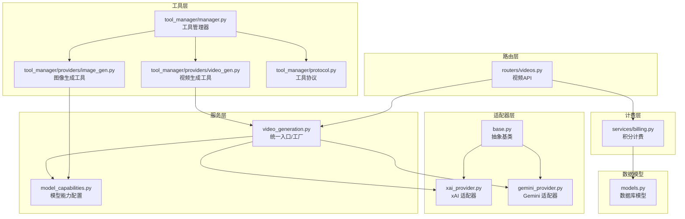
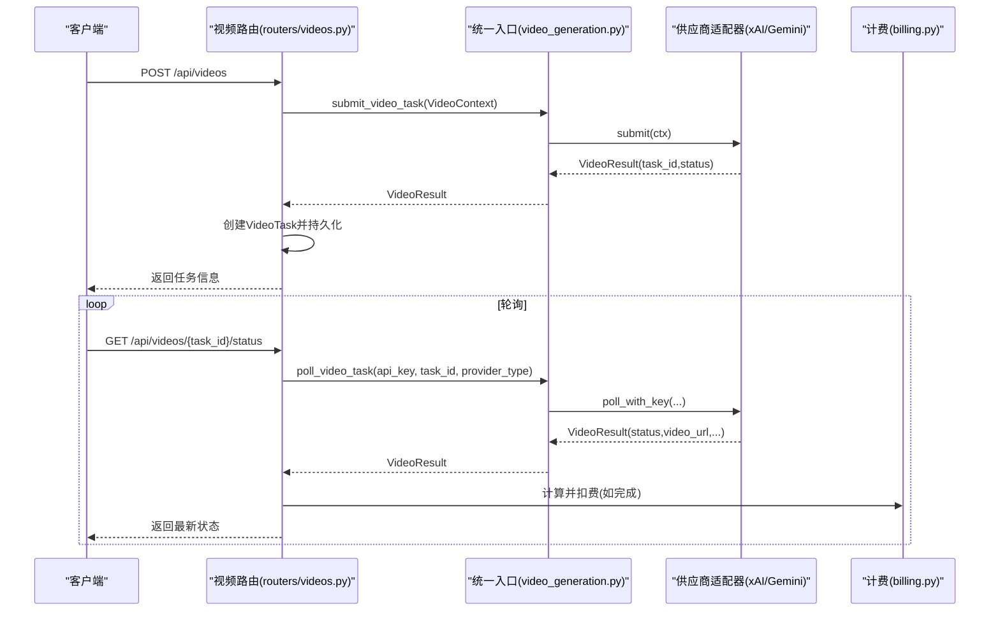
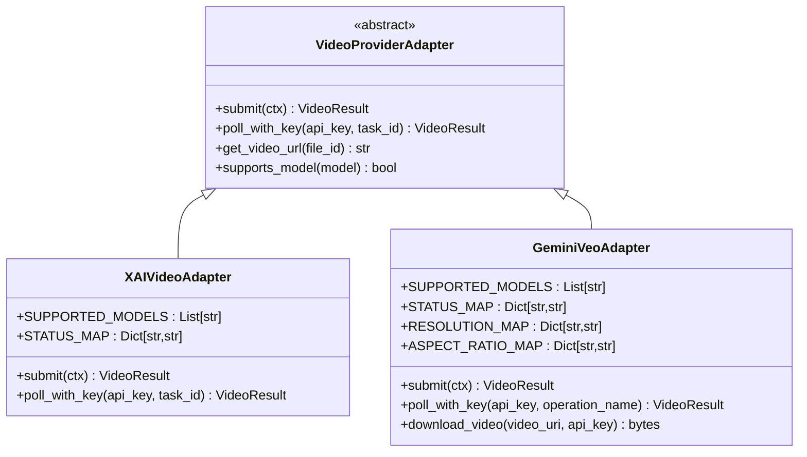
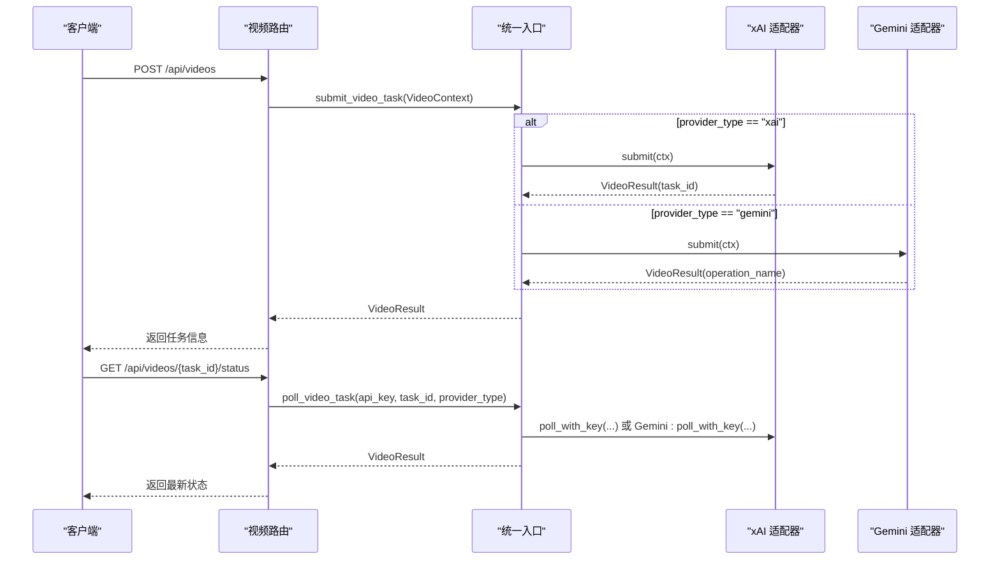
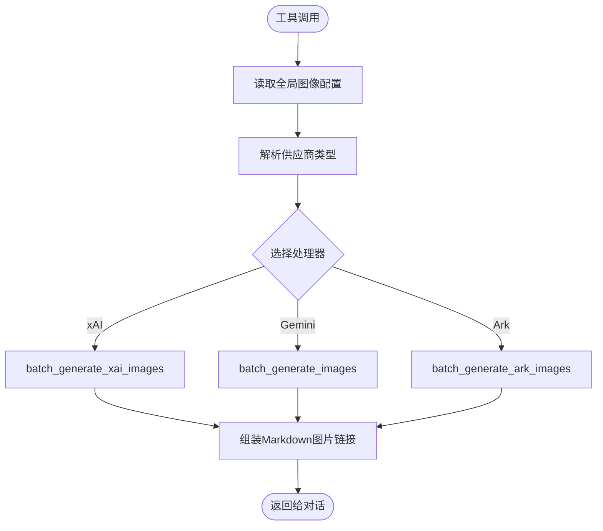
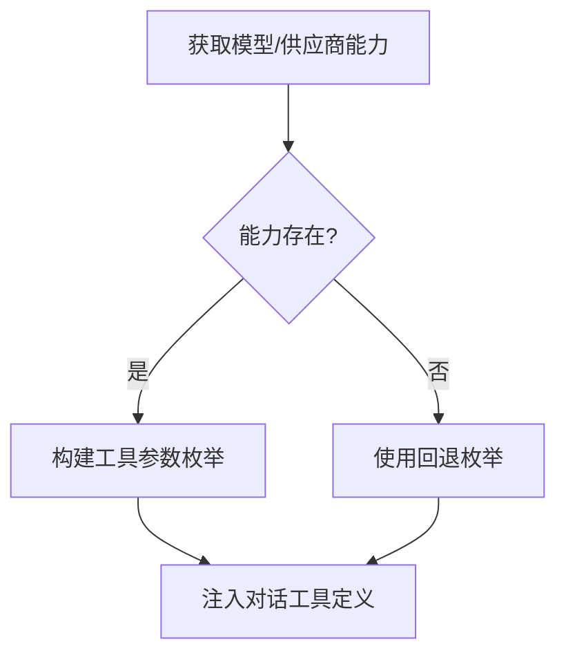
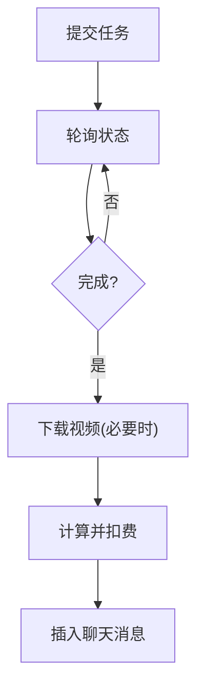
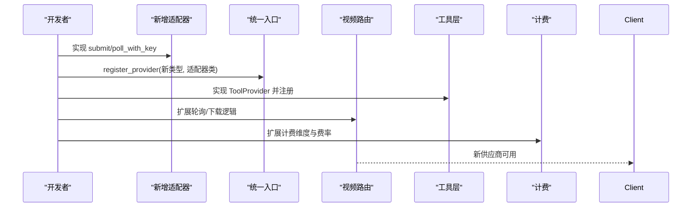
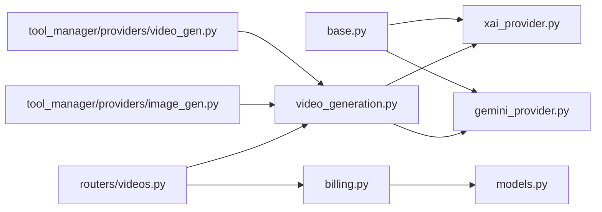

# 第三方服务集成

<cite>
**本文引用的文件**
- [backend/services/video_providers/base.py](file://backend/services/video_providers/base.py)
- [backend/services/video_providers/xai_provider.py](file://backend/services/video_providers/xai_provider.py)
- [backend/services/video_providers/gemini_provider.py](file://backend/services/video_providers/gemini_provider.py)
- [backend/services/video_providers/model_capabilities.py](file://backend/services/video_providers/model_capabilities.py)
- [backend/services/video_providers/__init__.py](file://backend/services/video_providers/__init__.py)
- [backend/services/video_generation.py](file://backend/services/video_generation.py)
- [backend/services/tool_manager/providers/video_gen.py](file://backend/services/tool_manager/providers/video_gen.py)
- [backend/services/tool_manager/providers/image_gen.py](file://backend/services/tool_manager/providers/image_gen.py)
- [backend/services/tool_manager/protocol.py](file://backend/services/tool_manager/protocol.py)
- [backend/services/tool_manager/manager.py](file://backend/services/tool_manager/manager.py)
- [backend/routers/videos.py](file://backend/routers/videos.py)
- [backend/services/billing.py](file://backend/services/billing.py)
- [backend/models.py](file://backend/models.py)
</cite>

## 目录
1. [简介](#简介)
2. [项目结构](#项目结构)
3. [核心组件](#核心组件)
4. [架构总览](#架构总览)
5. [详细组件分析](#详细组件分析)
6. [依赖分析](#依赖分析)
7. [性能考虑](#性能考虑)
8. [故障排查指南](#故障排查指南)
9. [结论](#结论)
10. [附录](#附录)

## 简介
本指南面向需要在系统中集成第三方AI服务（尤其是视频生成与图像生成）的开发者与运维人员。文档基于现有代码库，系统性阐述了视频生成与图像生成的统一抽象、适配器模式、模型能力检测、参数映射与响应处理、认证与轮询、计费与成本控制、以及如何扩展新的服务提供商与自定义API服务。

## 项目结构
系统采用“适配器 + 工厂 + 统一入口”的分层架构：
- 适配器层：针对不同供应商（xAI、Gemini Veo 等）实现统一接口，负责请求构造、参数映射、状态轮询与结果解析。
- 服务层：提供统一的提交与轮询入口，负责供应商选择、错误处理与补充逻辑（如 MiniMax 下载 URL 获取）。
- 工具层：将视频/图像生成能力以工具形式注入到智能体对话流程，动态构建参数枚举与执行。
- 路由层：对外暴露REST API，封装鉴权、权限、计费与媒体落盘。
- 计费层：基于映射表驱动的积分计算与原子化扣费，支持视频维度计费。

图表来源
- [backend/services/video_providers/base.py:56-121](file://backend/services/video_providers/base.py#L56-L121)
- [backend/services/video_providers/xai_provider.py:43-199](file://backend/services/video_providers/xai_provider.py#L43-L199)
- [backend/services/video_providers/gemini_provider.py:42-357](file://backend/services/video_providers/gemini_provider.py#L42-L357)
- [backend/services/video_generation.py:50-180](file://backend/services/video_generation.py#L50-L180)
- [backend/services/video_providers/model_capabilities.py:27-477](file://backend/services/video_providers/model_capabilities.py#L27-L477)
- [backend/services/tool_manager/providers/video_gen.py:284-342](file://backend/services/tool_manager/providers/video_gen.py#L284-L342)
- [backend/services/tool_manager/providers/image_gen.py:276-328](file://backend/services/tool_manager/providers/image_gen.py#L276-L328)
- [backend/services/tool_manager/protocol.py:11-44](file://backend/services/tool_manager/protocol.py#L11-L44)
- [backend/services/tool_manager/manager.py:23-108](file://backend/services/tool_manager/manager.py#L23-L108)
- [backend/routers/videos.py:24-344](file://backend/routers/videos.py#L24-L344)
- [backend/services/billing.py:12-388](file://backend/services/billing.py#L12-L388)
- [backend/models.py:152-200](file://backend/models.py#L152-L200)

章节来源
- [backend/services/video_providers/base.py:1-121](file://backend/services/video_providers/base.py#L1-L121)
- [backend/services/video_generation.py:1-180](file://backend/services/video_generation.py#L1-L180)
- [backend/services/tool_manager/manager.py:1-108](file://backend/services/tool_manager/manager.py#L1-L108)
- [backend/routers/videos.py:1-344](file://backend/routers/videos.py#L1-L344)

## 核心组件
- 抽象基类与数据结构
  - VideoContext：统一的视频生成请求上下文，包含模型、提示词、供应商类型、时长、分辨率、宽高比、视频模式、参考图片、首尾帧等。
  - VideoResult：统一的视频生成结果，包含任务状态、下载地址、时长、尺寸、错误信息等。
  - VideoProviderAdapter：抽象适配器，定义 submit/poll/get_video_url 等统一接口，子类负责具体供应商差异。
- 适配器实现
  - xAI 适配器：支持 Grok 视频生成，区分生成/编辑/扩展等端点，内置状态映射与内容审核处理。
  - Gemini 适配器：支持 Veo 系列，支持首尾帧插值、参考图片、视频扩展、参数映射与下载。
- 统一入口与工厂
  - video_generation：注册供应商适配器、提供 submit/poll 入口、辅助推断供应商类型。
- 工具与调度
  - ToolProvider 协议与 ToolManager：将视频/图像生成能力以工具形式注入对话流程，动态构建参数枚举。
- 路由与API
  - routers/videos：对外提供任务提交、状态轮询、能力查询、删除等REST接口。
- 计费与成本控制
  - billing：映射表驱动的视频计费维度与原子化扣费，支持视频输入图片/秒与输出分辨率维度。

章节来源
- [backend/services/video_providers/base.py:15-121](file://backend/services/video_providers/base.py#L15-L121)
- [backend/services/video_providers/xai_provider.py:43-199](file://backend/services/video_providers/xai_provider.py#L43-L199)
- [backend/services/video_providers/gemini_provider.py:42-357](file://backend/services/video_providers/gemini_provider.py#L42-L357)
- [backend/services/video_generation.py:50-180](file://backend/services/video_generation.py#L50-L180)
- [backend/services/tool_manager/protocol.py:11-44](file://backend/services/tool_manager/protocol.py#L11-L44)
- [backend/services/tool_manager/manager.py:23-108](file://backend/services/tool_manager/manager.py#L23-L108)
- [backend/routers/videos.py:75-234](file://backend/routers/videos.py#L75-L234)
- [backend/services/billing.py:22-388](file://backend/services/billing.py#L22-L388)

## 架构总览
系统通过“适配器 + 工厂 + 统一入口”实现多供应商视频生成的解耦与扩展。工具层将能力注入对话流程，路由层提供REST API，计费层保障成本可控。

图表来源
- [backend/routers/videos.py:75-234](file://backend/routers/videos.py#L75-L234)
- [backend/services/video_generation.py:90-126](file://backend/services/video_generation.py#L90-L126)
- [backend/services/billing.py:353-388](file://backend/services/billing.py#L353-L388)

## 详细组件分析

### 抽象基类与接口规范
- VideoProviderAdapter 抽象接口
  - submit(ctx): 提交任务，返回 VideoResult。
  - poll_with_key(api_key, task_id): 带密钥轮询，返回最新状态与结果。
  - get_video_url(file_id): 部分供应商需要额外获取下载链接。
  - supports_model(model): 检查是否支持指定模型。
  - STATUS_MAP: 供应商状态到内部状态的映射。
- VideoContext/VideoResult
  - 统一承载请求参数与响应字段，屏蔽供应商差异。

图表来源
- [backend/services/video_providers/base.py:56-121](file://backend/services/video_providers/base.py#L56-L121)
- [backend/services/video_providers/xai_provider.py:43-60](file://backend/services/video_providers/xai_provider.py#L43-L60)
- [backend/services/video_providers/gemini_provider.py:42-98](file://backend/services/video_providers/gemini_provider.py#L42-L98)

章节来源
- [backend/services/video_providers/base.py:56-121](file://backend/services/video_providers/base.py#L56-L121)
- [backend/services/video_providers/xai_provider.py:43-199](file://backend/services/video_providers/xai_provider.py#L43-L199)
- [backend/services/video_providers/gemini_provider.py:42-357](file://backend/services/video_providers/gemini_provider.py#L42-L357)

### 视频生成服务集成（xAI、Grok、Gemini VEO）
- 供应商适配器
  - xAI 适配器：根据 video_mode 路由到不同端点（生成/编辑/扩展），统一 payload 构造，状态映射与内容审核处理。
  - Gemini 适配器：支持首尾帧插值、参考图片、视频扩展、参数映射与下载。
- 统一入口
  - video_generation：注册供应商适配器、提供 submit/poll 入口、辅助推断供应商类型。
- 路由与API
  - routers/videos：提交任务、轮询状态、能力查询、删除任务；完成时下载视频并计费。

图表来源
- [backend/routers/videos.py:75-234](file://backend/routers/videos.py#L75-L234)
- [backend/services/video_generation.py:90-126](file://backend/services/video_generation.py#L90-L126)
- [backend/services/video_providers/xai_provider.py:62-199](file://backend/services/video_providers/xai_provider.py#L62-L199)
- [backend/services/video_providers/gemini_provider.py:100-321](file://backend/services/video_providers/gemini_provider.py#L100-L321)

章节来源
- [backend/services/video_providers/xai_provider.py:1-199](file://backend/services/video_providers/xai_provider.py#L1-L199)
- [backend/services/video_providers/gemini_provider.py:1-357](file://backend/services/video_providers/gemini_provider.py#L1-L357)
- [backend/services/video_generation.py:1-180](file://backend/services/video_generation.py#L1-L180)
- [backend/routers/videos.py:1-344](file://backend/routers/videos.py#L1-L344)

### 图像生成服务集成（多模型适配）
- 工具层
  - ImageGenProvider：将图像生成能力以工具注入对话流程，动态构建参数枚举（基于供应商能力）。
  - 支持的供应商：xAI、Gemini、Ark；通过分发映射选择对应处理器。
- 参数映射与响应处理
  - 不同供应商的参数（如分辨率、输出格式、批量数量）通过配置适配器映射到统一接口。
  - 统一返回 Markdown 图片链接，便于前端渲染。

图表来源
- [backend/services/tool_manager/providers/image_gen.py:129-328](file://backend/services/tool_manager/providers/image_gen.py#L129-L328)

章节来源
- [backend/services/tool_manager/providers/image_gen.py:1-328](file://backend/services/tool_manager/providers/image_gen.py#L1-L328)

### 模型能力检测机制与参数映射
- 模型能力配置
  - model_capabilities：集中维护各模型支持的模式、时长、分辨率、宽高比、参考图片数量、音频支持等。
- 工具定义动态构建
  - VideoGenProvider：根据模型能力动态生成工具参数枚举（模式、时长、分辨率、宽高比）。
  - ImageGenProvider：根据供应商能力动态生成参数枚举（如 aspect_ratio）。

图表来源
- [backend/services/video_providers/model_capabilities.py:27-477](file://backend/services/video_providers/model_capabilities.py#L27-L477)
- [backend/services/tool_manager/providers/video_gen.py:77-154](file://backend/services/tool_manager/providers/video_gen.py#L77-L154)
- [backend/services/tool_manager/providers/image_gen.py:58-104](file://backend/services/tool_manager/providers/image_gen.py#L58-L104)

章节来源
- [backend/services/video_providers/model_capabilities.py:1-477](file://backend/services/video_providers/model_capabilities.py#L1-L477)
- [backend/services/tool_manager/providers/video_gen.py:77-154](file://backend/services/tool_manager/providers/video_gen.py#L77-L154)
- [backend/services/tool_manager/providers/image_gen.py:58-104](file://backend/services/tool_manager/providers/image_gen.py#L58-L104)

### 服务认证、速率限制与错误重试策略
- 认证
  - xAI：使用 Bearer Token。
  - Gemini：使用 x-goog-api-key。
- 轮询与超时
  - 路由层对 pending 且带错误的任务进行超时保护（默认5分钟）。
- 错误处理
  - 适配器层捕获异常并返回失败状态与错误信息。
  - 路由层将内容审核拒绝映射为失败状态。
- 速率限制
  - 代码库未内置速率限制实现；建议在网关或上游服务侧实施限流策略。

章节来源
- [backend/services/video_providers/xai_provider.py:106-135](file://backend/services/video_providers/xai_provider.py#L106-L135)
- [backend/services/video_providers/gemini_provider.py:224-258](file://backend/services/video_providers/gemini_provider.py#L224-L258)
- [backend/routers/videos.py:180-234](file://backend/routers/videos.py#L180-L234)

### 服务监控、性能优化与成本控制
- 监控
  - 适配器层记录请求与响应摘要（敏感数据脱敏）。
  - 路由层记录任务状态变更与计费事件。
- 性能优化
  - 使用异步HTTP客户端减少阻塞。
  - 轮询时复用已缓存的终态结果，避免重复调用。
- 成本控制
  - billing：映射表驱动的视频计费维度（输入图片/秒、输出分辨率），原子化扣费，支持退款。

图表来源
- [backend/routers/videos.py:150-234](file://backend/routers/videos.py#L150-L234)
- [backend/services/billing.py:353-388](file://backend/services/billing.py#L353-L388)

章节来源
- [backend/routers/videos.py:150-234](file://backend/routers/videos.py#L150-L234)
- [backend/services/billing.py:1-388](file://backend/services/billing.py#L1-L388)

### 如何集成新的AI服务提供商与自定义API服务
- 新增适配器
  - 继承 VideoProviderAdapter，实现 submit/poll_with_key/get_video_url。
  - 定义 SUPPORTED_MODELS 与 STATUS_MAP。
  - 在 video_generation 注册新适配器。
- 工具层扩展
  - 实现 ToolProvider 协议，注册到 ALL_PROVIDERS。
  - 动态构建工具定义与执行逻辑。
- 能力配置
  - 在 model_capabilities 中添加新模型的能力配置，确保工具参数枚举正确。
- 路由与计费
  - 在 routers/videos 中处理新供应商的轮询与下载逻辑。
  - 在 billing 中扩展计费维度（如新增模型费率）。

图表来源
- [backend/services/video_generation.py:78-82](file://backend/services/video_generation.py#L78-L82)
- [backend/services/tool_manager/protocol.py:11-44](file://backend/services/tool_manager/protocol.py#L11-L44)
- [backend/services/tool_manager/manager.py:26-37](file://backend/services/tool_manager/manager.py#L26-L37)
- [backend/services/video_providers/model_capabilities.py:27-477](file://backend/services/video_providers/model_capabilities.py#L27-L477)
- [backend/routers/videos.py:176-178](file://backend/routers/videos.py#L176-L178)
- [backend/services/billing.py:22-388](file://backend/services/billing.py#L22-L388)

章节来源
- [backend/services/video_generation.py:78-82](file://backend/services/video_generation.py#L78-L82)
- [backend/services/tool_manager/protocol.py:11-44](file://backend/services/tool_manager/protocol.py#L11-L44)
- [backend/services/tool_manager/manager.py:26-37](file://backend/services/tool_manager/manager.py#L26-L37)
- [backend/services/video_providers/model_capabilities.py:27-477](file://backend/services/video_providers/model_capabilities.py#L27-L477)
- [backend/routers/videos.py:176-178](file://backend/routers/videos.py#L176-L178)
- [backend/services/billing.py:22-388](file://backend/services/billing.py#L22-L388)

## 依赖分析
- 适配器与工厂
  - 适配器依赖抽象基类；工厂通过注册表选择适配器。
- 工具与适配器
  - 工具层通过统一入口提交任务；适配器负责具体供应商差异。
- 路由与计费
  - 路由层在任务完成后调用计费模块进行扣费与记录。

图表来源
- [backend/services/video_providers/base.py:56-121](file://backend/services/video_providers/base.py#L56-L121)
- [backend/services/video_providers/xai_provider.py:27-31](file://backend/services/video_providers/xai_provider.py#L27-L31)
- [backend/services/video_providers/gemini_provider.py:35-40](file://backend/services/video_providers/gemini_provider.py#L35-L40)
- [backend/services/video_generation.py:29-38](file://backend/services/video_generation.py#L29-L38)
- [backend/services/tool_manager/providers/video_gen.py:20-27](file://backend/services/tool_manager/providers/video_gen.py#L20-L27)
- [backend/services/tool_manager/providers/image_gen.py:19-33](file://backend/services/tool_manager/providers/image_gen.py#L19-L33)
- [backend/routers/videos.py:16-21](file://backend/routers/videos.py#L16-L21)
- [backend/services/billing.py:14-21](file://backend/services/billing.py#L14-L21)
- [backend/models.py:152-176](file://backend/models.py#L152-L176)

章节来源
- [backend/services/video_providers/__init__.py:10-56](file://backend/services/video_providers/__init__.py#L10-L56)
- [backend/services/video_generation.py:50-82](file://backend/services/video_generation.py#L50-L82)
- [backend/services/tool_manager/manager.py:26-37](file://backend/services/tool_manager/manager.py#L26-L37)
- [backend/routers/videos.py:16-21](file://backend/routers/videos.py#L16-L21)

## 性能考虑
- 异步I/O：适配器与路由均使用异步HTTP客户端，降低等待时间。
- 轮询优化：终态直接返回缓存结果，避免重复调用。
- 参数映射：通过映射表与集合查找替代分支判断，提升运行时效率。
- 媒体处理：下载完成后本地落盘，减少上游服务压力。

## 故障排查指南
- 提交失败
  - 检查适配器日志与错误码；确认模型名与供应商类型匹配。
- 轮询异常
  - 关注 pending 且带错误的任务是否超时；检查上游服务状态。
- 内容审核拒绝
  - 路由层将审核拒绝映射为失败状态；可在前端提示重新生成。
- 计费问题
  - 确认用户余额充足与未冻结；检查费率映射与计费维度。

章节来源
- [backend/services/video_providers/xai_provider.py:120-135](file://backend/services/video_providers/xai_provider.py#L120-L135)
- [backend/services/video_providers/gemini_provider.py:238-258](file://backend/services/video_providers/gemini_provider.py#L238-L258)
- [backend/routers/videos.py:180-234](file://backend/routers/videos.py#L180-L234)
- [backend/services/billing.py:45-84](file://backend/services/billing.py#L45-L84)

## 结论
该系统通过抽象基类与适配器模式实现了多供应商视频生成的统一接入，结合工具层的动态参数枚举与路由层的REST API，形成了从对话到生成再到计费的完整闭环。通过模型能力配置与映射表驱动的计费体系，系统具备良好的扩展性与成本可控性。新增供应商只需实现适配器与能力配置，并在工厂与工具层注册即可快速上线。

## 附录
- 关键文件索引
  - 适配器基类与数据结构：[backend/services/video_providers/base.py:15-121](file://backend/services/video_providers/base.py#L15-L121)
  - xAI 适配器：[backend/services/video_providers/xai_provider.py:43-199](file://backend/services/video_providers/xai_provider.py#L43-L199)
  - Gemini 适配器：[backend/services/video_providers/gemini_provider.py:42-357](file://backend/services/video_providers/gemini_provider.py#L42-L357)
  - 模型能力配置：[backend/services/video_providers/model_capabilities.py:27-477](file://backend/services/video_providers/model_capabilities.py#L27-L477)
  - 统一入口与工厂：[backend/services/video_generation.py:50-180](file://backend/services/video_generation.py#L50-L180)
  - 工具与调度：[backend/services/tool_manager/protocol.py:11-44](file://backend/services/tool_manager/protocol.py#L11-L44)、[backend/services/tool_manager/manager.py:23-108](file://backend/services/tool_manager/manager.py#L23-L108)
  - 视频生成工具：[backend/services/tool_manager/providers/video_gen.py:284-342](file://backend/services/tool_manager/providers/video_gen.py#L284-L342)
  - 图像生成工具：[backend/services/tool_manager/providers/image_gen.py:276-328](file://backend/services/tool_manager/providers/image_gen.py#L276-L328)
  - 视频API路由：[backend/routers/videos.py:75-234](file://backend/routers/videos.py#L75-L234)
  - 计费模块：[backend/services/billing.py:22-388](file://backend/services/billing.py#L22-L388)
  - 数据模型：[backend/models.py:152-176](file://backend/models.py#L152-L176)