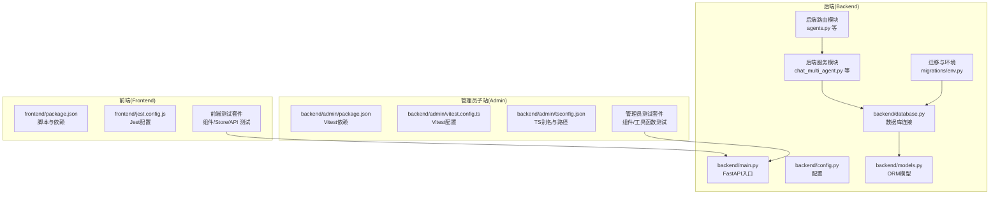
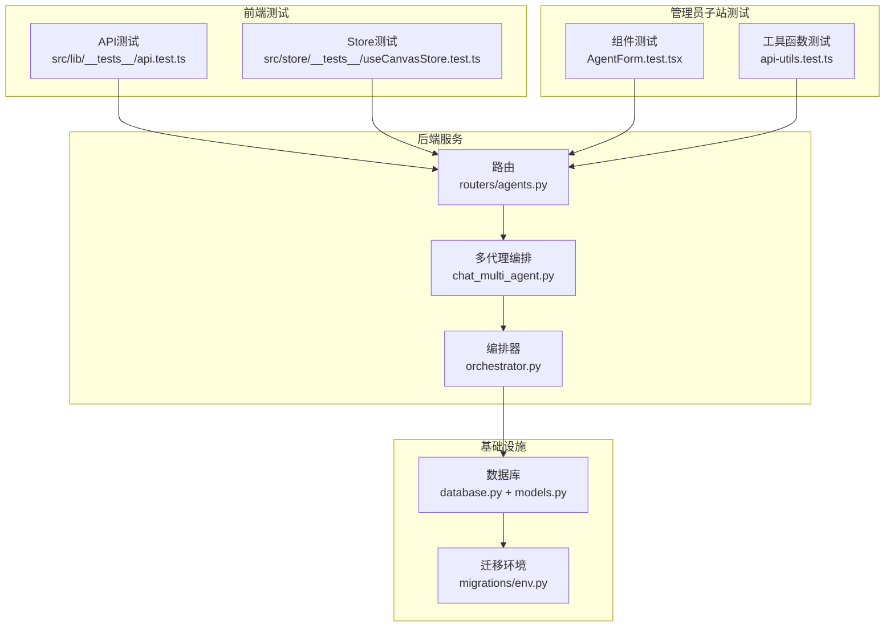
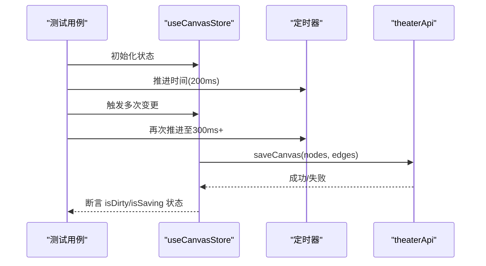
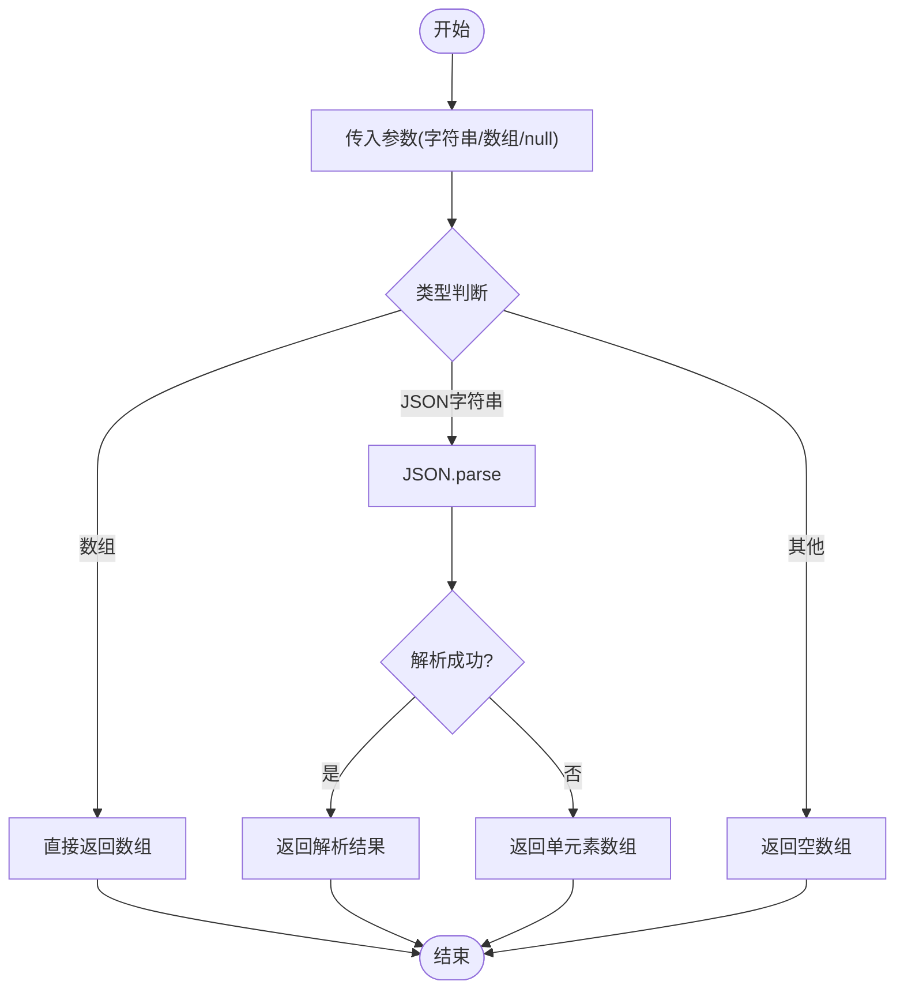
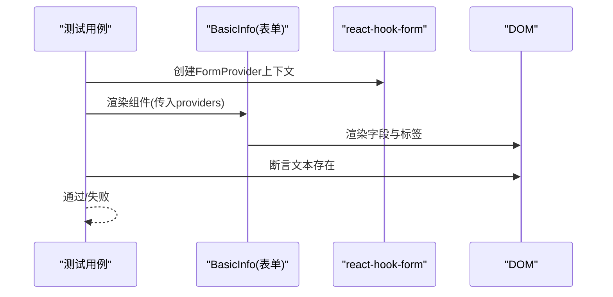
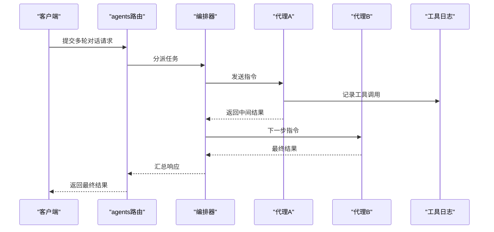
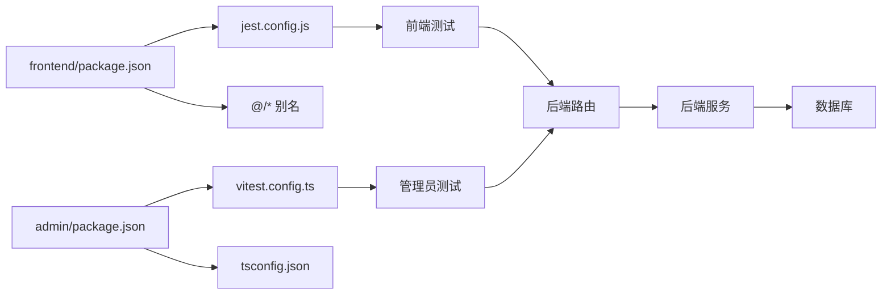

# 调试与测试

<cite>
**本文引用的文件**
- [frontend/package.json](file://frontend/package.json)
- [frontend/jest.config.js](file://frontend/jest.config.js)
- [frontend/jest.setup.js](file://frontend/jest.setup.js)
- [frontend/src/lib/__tests__/api.test.ts](file://frontend/src/lib/__tests__/api.test.ts)
- [frontend/src/store/__tests__/useCanvasStore.test.ts](file://frontend/src/store/__tests__/useCanvasStore.test.ts)
- [backend/requirements.txt](file://backend/requirements.txt)
- [backend/admin/package.json](file://backend/admin/package.json)
- [backend/admin/vitest.config.ts](file://backend/admin/vitest.config.ts)
- [backend/admin/tsconfig.json](file://backend/admin/tsconfig.json)
- [backend/admin/src/tests/setup.ts](file://backend/admin/src/tests/setup.ts)
- [backend/admin/src/tests/unit/AgentForm.test.tsx](file://backend/admin/src/tests/unit/AgentForm.test.tsx)
- [backend/admin/src/tests/unit/api-utils.test.ts](file://backend/admin/src/tests/unit/api-utils.test.ts)
- [backend/main.py](file://backend/main.py)
- [backend/config.py](file://backend/config.py)
- [backend/database.py](file://backend/database.py)
- [backend/models.py](file://backend/models.py)
- [backend/routers/agents.py](file://backend/routers/agents.py)
- [backend/services/chat_multi_agent.py](file://backend/services/chat_multi_agent.py)
- [backend/services/orchestrator.py](file://backend/services/orchestrator.py)
- [backend/skills/builtin_skills/file_reader/scripts/read.py](file://backend/skills/builtin_skills/file_reader/scripts/read.py)
- [backend/migrations/env.py](file://backend/migrations/env.py)
- [backend/manage_db.py](file://backend/manage_db.py)
- [backend/tasks.py](file://backend/tasks.py)
- [backend/auth.py](file://backend/auth.py)
- [backend/schemas.py](file://backend/schemas.py)
- [README.md](file://README.md)
</cite>

## 目录
1. [简介](#简介)
2. [项目结构](#项目结构)
3. [核心组件](#核心组件)
4. [架构总览](#架构总览)
5. [详细组件分析](#详细组件分析)
6. [依赖分析](#依赖分析)
7. [性能考虑](#性能考虑)
8. [故障排查指南](#故障排查指南)
9. [结论](#结论)
10. [附录](#附录)

## 简介
本指南面向“无限游戏”项目的调试与测试工作，覆盖前端与后端的测试体系、调试工具使用、单元测试与集成测试设计、AI代理测试要点、性能与压力测试方法，以及测试数据管理、Mock对象与测试环境配置，并结合现有配置给出在 CI/CD 中落地自动化测试与质量门禁的建议。

## 项目结构
该项目采用前后端分离架构：前端基于 Next.js（TypeScript/Jest），后端基于 FastAPI（Python）。前端包含丰富的组件与状态管理测试；后端包含管理员子站（Next.js + Vitest）与主应用（FastAPI + SQLAlchemy）。数据库迁移与模型定义位于后端目录中，便于统一测试与联调。

图表来源
- [frontend/package.json:1-94](file://frontend/package.json#L1-L94)
- [frontend/jest.config.js:1-20](file://frontend/jest.config.js#L1-L20)
- [backend/admin/package.json:1-73](file://backend/admin/package.json#L1-L73)
- [backend/admin/vitest.config.ts:1-16](file://backend/admin/vitest.config.ts#L1-L16)
- [backend/admin/tsconfig.json:1-42](file://backend/admin/tsconfig.json#L1-L42)
- [backend/main.py:1-200](file://backend/main.py#L1-L200)
- [backend/database.py:1-120](file://backend/database.py#L1-L120)
- [backend/models.py:1-200](file://backend/models.py#L1-L200)
- [backend/migrations/env.py:1-120](file://backend/migrations/env.py#L1-L120)

章节来源
- [frontend/package.json:1-94](file://frontend/package.json#L1-L94)
- [frontend/jest.config.js:1-20](file://frontend/jest.config.js#L1-L20)
- [backend/admin/package.json:1-73](file://backend/admin/package.json#L1-L73)
- [backend/admin/vitest.config.ts:1-16](file://backend/admin/vitest.config.ts#L1-L16)
- [backend/admin/tsconfig.json:1-42](file://backend/admin/tsconfig.json#L1-L42)
- [backend/main.py:1-200](file://backend/main.py#L1-L200)
- [backend/database.py:1-120](file://backend/database.py#L1-L120)
- [backend/models.py:1-200](file://backend/models.py#L1-L200)
- [backend/migrations/env.py:1-120](file://backend/migrations/env.py#L1-L120)

## 核心组件
- 前端测试栈
  - 框架：Jest + @testing-library/react + jsdom
  - 配置：jest.config.js、jest.setup.js
  - 覆盖范围：组件渲染、交互、状态钩子、API封装等
- 后端测试栈（管理员子站）
  - 框架：Vitest + happy-dom
  - 配置：vitest.config.ts、tsconfig.json、tests/setup.ts
  - 覆盖范围：表单组件、工具函数解析等
- 后端服务与路由
  - FastAPI 应用入口与路由模块
  - 服务层包含多代理编排、工具执行、视频/图像生成等
- 数据库与迁移
  - SQLAlchemy 模型与 Alembic 迁移环境

章节来源
- [frontend/jest.config.js:1-20](file://frontend/jest.config.js#L1-L20)
- [frontend/jest.setup.js:1-3](file://frontend/jest.setup.js#L1-L3)
- [backend/admin/vitest.config.ts:1-16](file://backend/admin/vitest.config.ts#L1-L16)
- [backend/admin/tsconfig.json:1-42](file://backend/admin/tsconfig.json#L1-L42)
- [backend/admin/src/tests/setup.ts:1-2](file://backend/admin/src/tests/setup.ts#L1-L2)
- [backend/main.py:1-200](file://backend/main.py#L1-L200)

## 架构总览
下图展示了前端测试、管理员子站测试与后端服务之间的关系，以及测试数据与数据库迁移的交互。

图表来源
- [frontend/src/lib/__tests__/api.test.ts](file://frontend/src/lib/__tests__/api.test.ts)
- [frontend/src/store/__tests__/useCanvasStore.test.ts](file://frontend/src/store/__tests__/useCanvasStore.test.ts)
- [backend/admin/src/tests/unit/AgentForm.test.tsx](file://backend/admin/src/tests/unit/AgentForm.test.tsx)
- [backend/admin/src/tests/unit/api-utils.test.ts](file://backend/admin/src/tests/unit/api-utils.test.ts)
- [backend/routers/agents.py:1-200](file://backend/routers/agents.py#L1-L200)
- [backend/services/chat_multi_agent.py:1-200](file://backend/services/chat_multi_agent.py#L1-L200)
- [backend/services/orchestrator.py:1-200](file://backend/services/orchestrator.py#L1-L200)
- [backend/database.py:1-120](file://backend/database.py#L1-L120)
- [backend/models.py:1-200](file://backend/models.py#L1-L200)
- [backend/migrations/env.py:1-120](file://backend/migrations/env.py#L1-L120)

## 详细组件分析

### 前端测试：组件与状态钩子
- 组件渲染与交互
  - 使用 @testing-library/react 进行 DOM 断言
  - 示例：组件是否正确渲染、文本是否存在、可访问性标签是否完整
- 状态钩子与副作用
  - 使用 renderHook 与 act 包裹副作用，确保异步更新稳定
  - 示例：自动保存逻辑、定时器推进、Promise 解析
- Mock 与外部依赖
  - 对 API 层进行 jest.mock，隔离网络请求
  - 示例：theaterApi.saveCanvas 的成功与失败场景
- 时间控制与节流
  - 使用 jest.useFakeTimers 与 advanceTimersByTime 控制防抖/节流
  - 示例：300ms 防抖窗口内多次变更仅触发一次保存

图表来源
- [frontend/src/store/__tests__/useCanvasStore.test.ts:13-104](file://frontend/src/store/__tests__/useCanvasStore.test.ts#L13-L104)

章节来源
- [frontend/src/store/__tests__/useCanvasStore.test.ts:1-124](file://frontend/src/store/__tests__/useCanvasStore.test.ts#L1-L124)

### 前端测试：API 封装与错误处理
- 目标：验证 API 工具函数在不同输入下的行为，如解析字符串或数组参数
- 方法：对工具函数进行纯函数测试，断言返回值类型与内容
- 建议：为 API 层增加统一的错误码与消息映射，便于在测试中断言

图表来源
- [backend/admin/src/tests/unit/api-utils.test.ts:1-22](file://backend/admin/src/tests/unit/api-utils.test.ts#L1-L22)

章节来源
- [frontend/src/lib/__tests__/api.test.ts](file://frontend/src/lib/__tests__/api.test.ts)
- [backend/admin/src/tests/unit/api-utils.test.ts:1-22](file://backend/admin/src/tests/unit/api-utils.test.ts#L1-L22)

### 管理员子站测试：表单组件
- 目标：验证表单组件在不同 Provider 数据下的渲染与交互
- 方法：通过 FormProvider 注入 react-hook-form 上下文，渲染被测组件并断言可见文本与控件
- 补充：为 matchMedia 添加 mock，避免媒体查询导致的渲染差异

图表来源
- [backend/admin/src/tests/unit/AgentForm.test.tsx:22-53](file://backend/admin/src/tests/unit/AgentForm.test.tsx#L22-L53)

章节来源
- [backend/admin/src/tests/unit/AgentForm.test.tsx:1-55](file://backend/admin/src/tests/unit/AgentForm.test.tsx#L1-L55)
- [backend/admin/src/tests/setup.ts:1-2](file://backend/admin/src/tests/setup.ts#L1-L2)

### 后端服务测试：多代理编排与工具执行
- 多代理协作
  - 通过 chat_multi_agent 与 orchestrator 实现代理间通信与任务分派
  - 建议：为每个代理创建独立的 Mock LLM 输出，验证消息路由与聚合
- 工具执行
  - 通过 tool_execution_logger 记录工具调用链路，便于断言工具是否按预期调用
- 数据一致性
  - 在测试前清理数据库，使用事务回滚或临时表隔离

图表来源
- [backend/routers/agents.py:1-200](file://backend/routers/agents.py#L1-L200)
- [backend/services/orchestrator.py:1-200](file://backend/services/orchestrator.py#L1-L200)
- [backend/services/chat_multi_agent.py:1-200](file://backend/services/chat_multi_agent.py#L1-L200)

章节来源
- [backend/routers/agents.py:1-200](file://backend/routers/agents.py#L1-L200)
- [backend/services/orchestrator.py:1-200](file://backend/services/orchestrator.py#L1-L200)
- [backend/services/chat_multi_agent.py:1-200](file://backend/services/chat_multi_agent.py#L1-L200)

### 数据库与迁移测试
- 目标：确保迁移脚本可重复执行且不影响生产数据
- 方法：在测试环境中使用独立数据库实例或内存数据库，运行 env.py 的迁移流程
- 建议：为迁移脚本添加幂等性检查与回滚测试

章节来源
- [backend/migrations/env.py:1-120](file://backend/migrations/env.py#L1-L120)
- [backend/database.py:1-120](file://backend/database.py#L1-L120)
- [backend/models.py:1-200](file://backend/models.py#L1-L200)

## 依赖分析
- 前端依赖与测试
  - Jest 与 @testing-library 生态用于组件与状态测试
  - TypeScript 别名 @/* 映射到 src，便于统一导入路径
- 后端依赖与测试
  - Vitest + happy-dom 用于管理员子站组件测试
  - FastAPI + SQLAlchemy 作为服务与数据层基础
- 关键耦合点
  - 前端 Store 与后端路由通过 API 交互
  - 管理员子站与主后端共享部分工具函数与类型

图表来源
- [frontend/package.json:1-94](file://frontend/package.json#L1-L94)
- [frontend/jest.config.js:1-20](file://frontend/jest.config.js#L1-L20)
- [backend/admin/package.json:1-73](file://backend/admin/package.json#L1-L73)
- [backend/admin/vitest.config.ts:1-16](file://backend/admin/vitest.config.ts#L1-L16)
- [backend/admin/tsconfig.json:1-42](file://backend/admin/tsconfig.json#L1-L42)
- [backend/routers/agents.py:1-200](file://backend/routers/agents.py#L1-L200)

章节来源
- [frontend/package.json:1-94](file://frontend/package.json#L1-L94)
- [backend/admin/package.json:1-73](file://backend/admin/package.json#L1-L73)

## 性能考虑
- 单元测试性能
  - 使用 jest.useFakeTimers 控制定时器，避免真实等待
  - 对外部依赖进行 Mock，减少 I/O 开销
- 集成测试性能
  - 使用内存数据库或 Dockerized Postgres 进行快速回放
  - 并行化不依赖共享资源的测试用例
- 压力与负载测试
  - 使用 Locust 或 k6 对关键路由（如 /agents/chat）施压
  - 结合 Prometheus/Grafana 监控 CPU、内存、数据库连接数
- 前端性能
  - 使用 React DevTools Profiler 定位重渲染热点
  - 通过覆盖率报告识别未覆盖的分支与边界条件

## 故障排查指南
- 前端常见问题
  - 组件未渲染：检查 @testing-library 的断言是否匹配实际文本或属性
  - 异步更新不稳定：确认使用 act 包裹状态变更，使用 Promise.resolve() 刷新微任务
  - 定时器相关：使用 jest.useFakeTimers 并显式推进时间
- 后端常见问题
  - 路由未生效：检查 main.py 的 include_router 注册顺序与路径前缀
  - 数据库连接异常：核对 config.py 中的连接字符串与 migrations/env.py 的目标数据库
  - 工具执行失败：查看 tool_execution_logger 的记录，定位具体工具与参数
- 日志与追踪
  - 后端使用 loguru 记录服务日志，建议在测试中捕获日志输出以断言错误路径
  - 前端可通过浏览器 Network 面板与 Console 查看请求与错误信息

章节来源
- [frontend/src/store/__tests__/useCanvasStore.test.ts:13-104](file://frontend/src/store/__tests__/useCanvasStore.test.ts#L13-L104)
- [backend/main.py:1-200](file://backend/main.py#L1-L200)
- [backend/config.py:1-200](file://backend/config.py#L1-L200)
- [backend/migrations/env.py:1-120](file://backend/migrations/env.py#L1-L120)

## 结论
本项目已具备完善的前端与管理员子站测试基础，建议在此基础上扩展后端服务测试、AI代理协作测试与性能测试，同时完善 CI/CD 中的自动化测试与质量门禁，确保代码质量与交付稳定性。

## 附录

### 调试工具使用指南
- IDE 调试器
  - VS Code：为前端 Jest 与后端 Python 设置断点，逐步执行并观察变量
  - PyCharm：针对 Python 服务设置断点，配合 uvicorn 启动参数启用调试
- 浏览器开发者工具
  - Network：检查 API 请求与响应体，定位 4xx/5xx 错误
  - Console：查看错误堆栈与警告信息
  - Performance/Profiler：分析渲染性能瓶颈
- 后端日志分析
  - 使用 loguru 输出结构化日志，结合日志级别过滤与关键词搜索
  - 在测试中捕获日志输出，断言错误路径与异常信息

### 单元测试框架配置与使用
- 前端（Jest）
  - 配置：jest.config.js 指定环境与模块映射；jest.setup.js 加载 @testing-library/jest-dom
  - 使用：在 src/**/__tests__ 下编写测试文件，使用 render/renderHook 断言
- 管理员子站（Vitest）
  - 配置：vitest.config.ts 指定 happy-dom 环境与全局 setup；tsconfig.json 配置 @/* 别名
  - 使用：在 src/tests/unit 下编写 .test.tsx/.test.ts 文件
- 后端（Python）
  - 依赖：pytest、httpx、pytest-asyncio（如需异步测试）
  - 使用：在 backend/**/tests 下编写测试文件，使用 Mock 与临时数据库

章节来源
- [frontend/jest.config.js:1-20](file://frontend/jest.config.js#L1-L20)
- [frontend/jest.setup.js:1-3](file://frontend/jest.setup.js#L1-L3)
- [backend/admin/vitest.config.ts:1-16](file://backend/admin/vitest.config.ts#L1-L16)
- [backend/admin/tsconfig.json:1-42](file://backend/admin/tsconfig.json#L1-L42)
- [backend/requirements.txt:1-29](file://backend/requirements.txt#L1-L29)

### 集成测试与端到端测试
- 集成测试
  - 使用 httpx 或 FastAPI 的 TestClient 对路由进行端到端校验
  - 通过 Mock 工具与外部服务，隔离不可靠依赖
- 端到端测试
  - 使用 Playwright/Cypress 打开浏览器，模拟用户操作（登录、创建剧场、拖拽节点、保存）
  - 与后端联调时，确保数据库与缓存处于可控状态

### AI 代理测试要点
- 模型输出验证
  - 为不同模型提供固定种子或固定提示词，确保输出可复现
  - 使用断言比较关键字段（如是否包含特定关键词、JSON 结构）
- 多代理协作
  - 为每个代理定义独立的 Mock 输出，验证消息传递与聚合逻辑
  - 检查工具调用链路与日志记录，确保无遗漏步骤

章节来源
- [backend/services/chat_multi_agent.py:1-200](file://backend/services/chat_multi_agent.py#L1-L200)
- [backend/services/orchestrator.py:1-200](file://backend/services/orchestrator.py#L1-L200)

### 性能测试、压力测试与负载测试
- 性能测试
  - 使用 Jest 的计时断言与 React Profiler，评估组件渲染与状态更新性能
- 压力测试
  - 使用 Locust 对 /agents/chat 等关键接口施压，观察吞吐量与延迟
- 负载测试
  - 搭建与生产相近的数据库与缓存环境，持续运行多代理编排任务，监控资源占用

### 测试数据管理与 Mock 对象
- 测试数据
  - 使用固定 ID 与示例数据，确保跨环境一致性
  - 对于数据库测试，使用事务回滚或临时表，避免污染基线数据
- Mock 对象
  - 前端：jest.mock('@/lib/theaterApi') 模拟网络请求
  - 后端：unittest.mock 或 pytest-mock 模拟外部服务与数据库

章节来源
- [frontend/src/store/__tests__/useCanvasStore.test.ts:5-11](file://frontend/src/store/__tests__/useCanvasStore.test.ts#L5-L11)

### CI/CD 中的自动化测试与质量门禁
- 自动化测试
  - 前端：在 CI 中执行 npm test（Jest）与 Vitest（管理员子站）
  - 后端：执行 pytest，覆盖路由、服务与工具函数
- 质量门禁
  - 代码覆盖率阈值：为关键模块设置最小覆盖率门槛
  - ESLint/Pylint：在 CI 中强制执行静态检查
  - 安全扫描：集成 SAST 工具（如 Bandit、Semgrep）

章节来源
- [frontend/package.json:5-12](file://frontend/package.json#L5-L12)
- [backend/admin/package.json:5-10](file://backend/admin/package.json#L5-L10)
- [backend/requirements.txt:1-29](file://backend/requirements.txt#L1-L29)