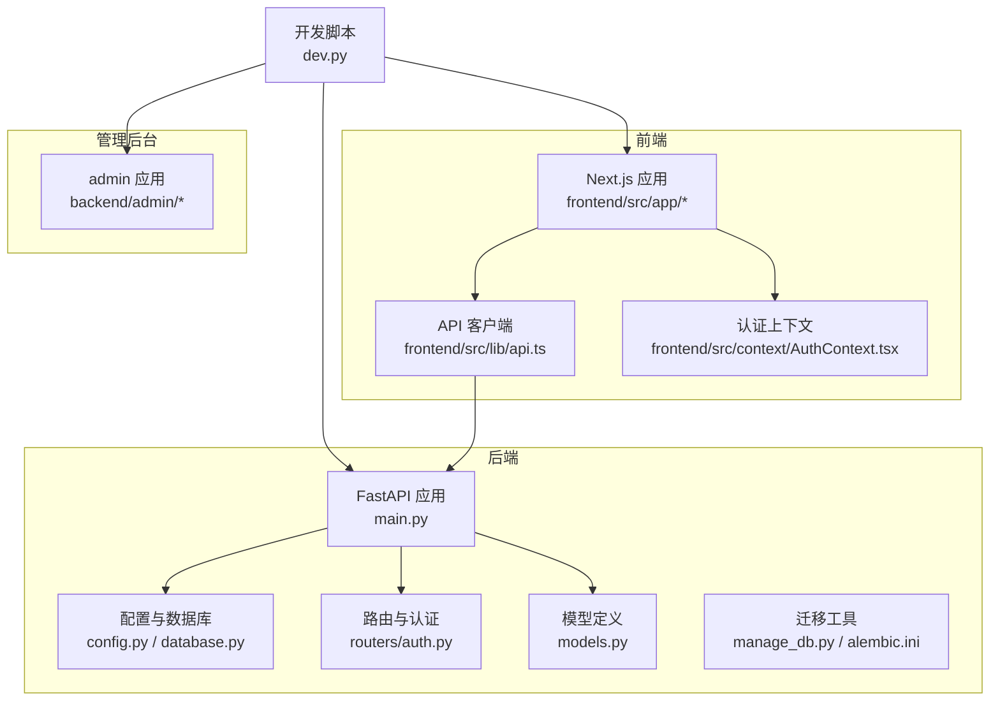
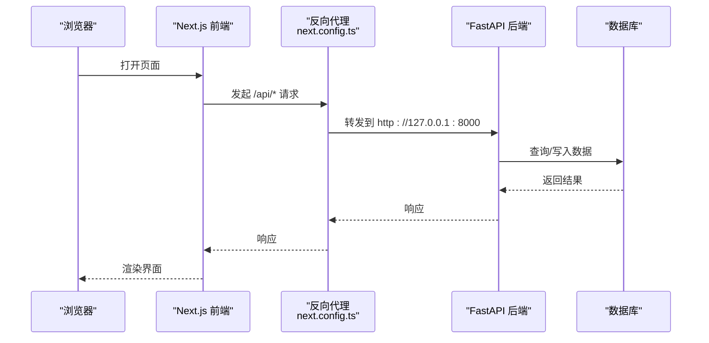
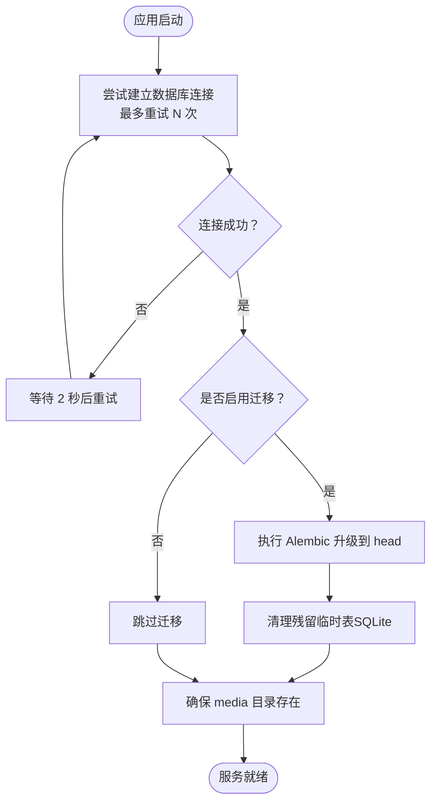
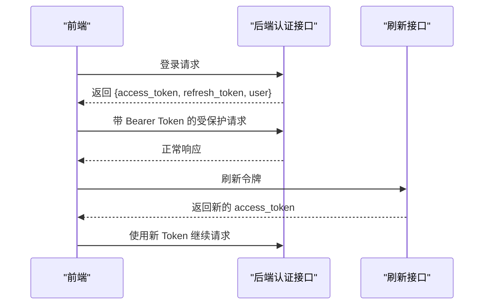
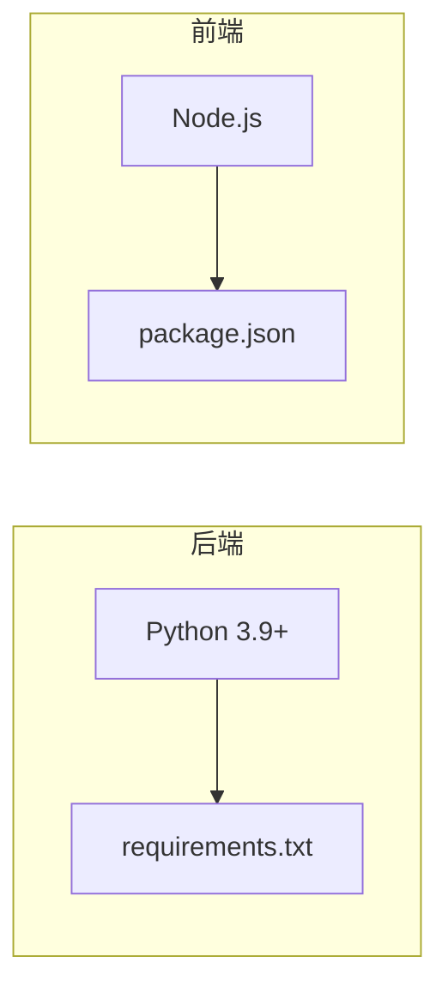

# 快速开始

<cite>
**本文引用的文件**
- [requirements.txt](file://backend/requirements.txt)
- [package.json](file://frontend/package.json)
- [main.py](file://backend/main.py)
- [config.py](file://backend/config.py)
- [database.py](file://backend/database.py)
- [manage_db.py](file://backend/manage_db.py)
- [dev.py](file://dev.py)
- [.env.example](file://backend/.env.example)
- [seed_db.py](file://backend/seed_db.py)
- [alembic.ini](file://backend/alembic.ini)
- [models.py](file://backend/models.py)
- [auth.py](file://backend/routers/auth.py)
- [layout.tsx](file://frontend/src/app/layout.tsx)
- [api.ts](file://frontend/src/lib/api.ts)
- [AuthContext.tsx](file://frontend/src/context/AuthContext.tsx)
- [next.config.ts](file://frontend/next.config.ts)
</cite>

## 目录
1. [简介](#简介)
2. [项目结构](#项目结构)
3. [核心组件](#核心组件)
4. [架构总览](#架构总览)
5. [详细组件分析](#详细组件分析)
6. [依赖关系分析](#依赖关系分析)
7. [性能注意事项](#性能注意事项)
8. [故障排除指南](#故障排除指南)
9. [结论](#结论)
10. [附录](#附录)

## 简介
本指南面向新手开发者，帮助你在约30分钟内完成 Infinite Game 项目的环境搭建、依赖安装与完整启动流程。你将学会：
- 搭建 Python 3.9+、Node.js 与数据库环境
- 安装后端 Python 包与前端 npm 包
- 初始化数据库、运行迁移与种子数据
- 同时启动后端 API、前端 Next.js 应用与管理后台
- 处理常见配置问题（数据库连接、API 密钥、端口冲突）
- 快速体验核心功能（注册登录、剧场创作）

## 项目结构
项目采用前后端分离架构：
- 后端：FastAPI + SQLAlchemy 异步 ORM，支持 SQLite/PostgreSQL，内置 Alembic 迁移与 Redis 缓存
- 前端：Next.js 16 + TypeScript，通过反向代理转发 /api 请求至后端
- 管理后台：独立的 Next.js 应用，位于 backend/admin 目录
- 开发脚本：统一的 dev.py 脚本负责虚拟环境、依赖安装与并行启动

图表来源
- [main.py:110-174](file://backend/main.py#L110-L174)
- [config.py:7-43](file://backend/config.py#L7-L43)
- [database.py:1-31](file://backend/database.py#L1-L31)
- [auth.py:1-136](file://backend/routers/auth.py#L1-L136)
- [models.py:1-200](file://backend/models.py#L1-L200)
- [manage_db.py:1-80](file://backend/manage_db.py#L1-L80)
- [alembic.ini:1-115](file://backend/alembic.ini#L1-L115)
- [layout.tsx:1-42](file://frontend/src/app/layout.tsx#L1-L42)
- [api.ts:1-84](file://frontend/src/lib/api.ts#L1-L84)
- [AuthContext.tsx:1-110](file://frontend/src/context/AuthContext.tsx#L1-L110)
- [dev.py:94-169](file://dev.py#L94-L169)

章节来源
- [main.py:110-174](file://backend/main.py#L110-L174)
- [dev.py:94-169](file://dev.py#L94-L169)

## 核心组件
- 后端应用入口与生命周期：负责数据库连接重试、自动迁移、媒体目录准备、CORS 配置与路由注册
- 配置中心：集中管理数据库、Redis、AI API 密钥、JWT、默认模型与迁移开关
- 数据库层：异步引擎、会话工厂与基础模型基类
- 认证路由：注册、登录、刷新令牌与当前用户查询
- 前端 Next.js：根布局、API 客户端拦截器与认证上下文
- 开发脚本：统一安装依赖与并行启动后端、前端、管理后台

章节来源
- [main.py:49-108](file://backend/main.py#L49-L108)
- [config.py:7-43](file://backend/config.py#L7-L43)
- [database.py:1-31](file://backend/database.py#L1-L31)
- [auth.py:30-136](file://backend/routers/auth.py#L30-L136)
- [layout.tsx:18-41](file://frontend/src/app/layout.tsx#L18-L41)
- [api.ts:1-84](file://frontend/src/lib/api.ts#L1-L84)
- [AuthContext.tsx:1-110](file://frontend/src/context/AuthContext.tsx#L1-L110)
- [dev.py:25-108](file://dev.py#L25-L108)

## 架构总览
下图展示了从浏览器到后端 API 的请求链路，以及开发模式下的本地代理策略。

图表来源
- [next.config.ts:9-16](file://frontend/next.config.ts#L9-L16)
- [api.ts:3-6](file://frontend/src/lib/api.ts#L3-L6)
- [main.py:130-152](file://backend/main.py#L130-L152)
- [database.py:8-17](file://backend/database.py#L8-L17)

## 详细组件分析

### 后端应用与生命周期
- 生命周期钩子在启动时进行数据库连接重试与迁移执行；若启用迁移，会在启动时自动升级到最新版本，并对 SQLite 的临时表进行清理
- 默认允许来自前端开发端口的跨域请求，便于本地联调
- 提供根路径与 WebSocket 接口占位，实际业务由各路由模块提供

图表来源
- [main.py:49-108](file://backend/main.py#L49-L108)
- [alembic.ini:1-115](file://backend/alembic.ini#L1-L115)

章节来源
- [main.py:49-108](file://backend/main.py#L49-L108)

### 配置与数据库
- 默认使用 SQLite（本地开发友好），可通过环境变量切换为 PostgreSQL
- 支持 Redis 连接、多平台事件循环兼容、日志级别精细控制
- 数据库引擎开启 pre_ping 与连接池参数，提升稳定性

章节来源
- [config.py:7-43](file://backend/config.py#L7-L43)
- [database.py:8-23](file://backend/database.py#L8-L23)

### 认证与用户体系
- 提供注册、登录、刷新令牌与当前用户查询接口
- 使用 JWT 令牌，支持刷新队列避免并发刷新导致的重复请求
- 前端通过拦截器自动附加 Authorization 头，并在 401 时触发刷新流程

图表来源
- [auth.py:36-136](file://backend/routers/auth.py#L36-L136)
- [api.ts:31-81](file://frontend/src/lib/api.ts#L31-L81)
- [AuthContext.tsx:75-94](file://frontend/src/context/AuthContext.tsx#L75-L94)

章节来源
- [auth.py:30-136](file://backend/routers/auth.py#L30-L136)
- [api.ts:1-84](file://frontend/src/lib/api.ts#L1-L84)
- [AuthContext.tsx:1-110](file://frontend/src/context/AuthContext.tsx#L1-L110)

### 开发脚本与并行启动
- 自动创建后端虚拟环境并安装 requirements.txt
- 安装前端与管理后台依赖
- 并发启动后端（Uvicorn）、前端（Next.js dev）与管理后台（Next.js dev）
- Windows 下针对 asyncio 与 asyncpg 做了兼容处理

章节来源
- [dev.py:25-108](file://dev.py#L25-L108)
- [dev.py:112-137](file://dev.py#L112-L137)

## 依赖关系分析
- 后端依赖：FastAPI、Uvicorn、SQLAlchemy、Pydantic、asyncpg/aiosqlite、Redis、Alembic、Agentscope、OpenAI、Google GenAI、XAI SDK、Pillow、bcrypt、python-jose、httpx、requests、python-multipart、loguru、greenlet、psycopg2-binary、python-dotenv、packaging、aiofiles、python-frontmatter
- 前端依赖：Next.js、React、Ant Design、Radix UI、Tiptap、XYFlow、Socket.IO、SWR、TailwindCSS、Jest、TypeScript、Axios、Zustand、Framer Motion、UUID、Lodash、Pixi.js 等

图表来源
- [requirements.txt:1-28](file://backend/requirements.txt#L1-L28)
- [package.json:1-92](file://frontend/package.json#L1-L92)

章节来源
- [requirements.txt:1-28](file://backend/requirements.txt#L1-L28)
- [package.json:1-92](file://frontend/package.json#L1-L92)

## 性能注意事项
- 数据库连接池：后端默认启用连接池与 pre_ping，建议在生产环境根据并发量调整 pool_size 与 max_overflow
- 日志级别：开发阶段已降低 SQLAlchemy 与 Uvicorn 访问日志噪声，避免影响调试
- 媒体缓存：后端启动时确保 media 目录存在，避免文件写入失败
- 前端代理：Next.js 通过 rewrite 将 /api 请求转发至后端，避免跨域与代理复杂度

章节来源
- [database.py:8-23](file://backend/database.py#L8-L23)
- [main.py:16-30](file://backend/main.py#L16-L30)
- [main.py:104-106](file://backend/main.py#L104-L106)
- [next.config.ts:9-16](file://frontend/next.config.ts#L9-L16)

## 故障排除指南
- 数据库连接失败
  - 症状：启动时报数据库连接错误或迁移失败
  - 排查：确认 DATABASE_URL 是否正确；若使用 PostgreSQL，请确保服务运行且凭据无误；若使用 SQLite，请确认路径有效
  - 解决：在 .env 中设置 DATABASE_URL 或保持默认 SQLite；必要时手动运行迁移工具
  - 参考
    - [config.py:11-16](file://backend/config.py#L11-L16)
    - [main.py:50-96](file://backend/main.py#L50-L96)
    - [manage_db.py:30-38](file://backend/manage_db.py#L30-L38)

- 迁移失败或残留临时表
  - 症状：Alembic 升级失败，提示临时表残留
  - 排查：启动时会尝试清理 SQLite 的临时表，若仍失败请手动删除残留表
  - 解决：按启动日志提示清理临时表后重试
  - 参考
    - [main.py:64-86](file://backend/main.py#L64-L86)
    - [alembic.ini:1-115](file://backend/alembic.ini#L1-L115)

- 端口冲突
  - 症状：端口 8000、3000、3001 被占用
  - 排查：确认是否有其他进程占用
  - 解决：释放端口或修改 dev.py 中的端口配置
  - 参考
    - [dev.py:117-123](file://dev.py#L117-L123)
    - [main.py:172-174](file://backend/main.py#L172-L174)
    - [next.config.ts:12-14](file://frontend/next.config.ts#L12-L14)

- API 密钥缺失
  - 症状：图像生成或 LLM 调用失败
  - 排查：确认 .env 中 OPENAI_API_KEY、GEMINI_API_KEY、CLAUDE_API_KEY 是否填写
  - 解决：复制 .env.example 并填入有效密钥
  - 参考
    - [.env.example:1-4](file://backend/.env.example#L1-L4)
    - [config.py:21-25](file://backend/config.py#L21-L25)

- CORS 与鉴权头
  - 症状：前端跨域失败或鉴权头缺失
  - 排查：确认前端已携带 Authorization 头，后端已允许前端源
  - 解决：检查前端拦截器与后端 CORS 配置
  - 参考
    - [api.ts:8-17](file://frontend/src/lib/api.ts#L8-L17)
    - [main.py:130-136](file://backend/main.py#L130-L136)

- 管理后台无法访问
  - 症状：访问管理后台 3001 端口失败
  - 排查：确认已安装管理后台依赖并正确启动
  - 解决：先安装依赖再启动，或检查端口占用
  - 参考
    - [dev.py:102-108](file://dev.py#L102-L108)

## 结论
按照本指南，你可以在 30 分钟内完成环境搭建、依赖安装与项目启动。建议在本地先使用 SQLite 快速验证功能，后续再切换到 PostgreSQL 并补齐 API 密钥以体验完整能力。

## 附录

### 环境要求与安装步骤
- Python 3.9+
- Node.js（推荐使用与项目匹配的版本）
- 数据库：SQLite（默认）或 PostgreSQL
- Redis（可选，用于缓存）

章节来源
- [requirements.txt:1-28](file://backend/requirements.txt#L1-L28)
- [package.json:1-92](file://frontend/package.json#L1-L92)
- [config.py:11-16](file://backend/config.py#L11-L16)

### 依赖安装
- 后端依赖
  - 在 backend 目录创建并激活虚拟环境，安装 requirements.txt
  - 参考
    - [dev.py:25-42](file://dev.py#L25-L42)
    - [requirements.txt:1-28](file://backend/requirements.txt#L1-L28)
- 前端依赖
  - 在 frontend 目录执行 npm install
  - 参考
    - [dev.py:44-62](file://dev.py#L44-L62)
    - [package.json:1-92](file://frontend/package.json#L1-L92)
- 管理后台依赖
  - 在 backend/admin 目录执行 npm install
  - 参考
    - [dev.py:102-108](file://dev.py#L102-L108)

### 数据库初始化与迁移
- 方式一：启动时自动迁移（需在配置中启用）
  - 参考
    - [main.py:59-88](file://backend/main.py#L59-L88)
    - [config.py:37-37](file://backend/config.py#L37-L37)
- 方式二：使用迁移管理脚本
  - 新建迁移：python manage_db.py migrate "描述"
  - 应用迁移：python manage_db.py upgrade
  - 回滚迁移：python manage_db.py downgrade
  - 参考
    - [manage_db.py:20-38](file://backend/manage_db.py#L20-L38)
    - [alembic.ini:1-115](file://backend/alembic.ini#L1-L115)

### 种子数据
- 运行种子脚本创建默认 LLM 提供商与管理员账户
- 参考
  - [seed_db.py:21-57](file://backend/seed_db.py#L21-L57)

### 启动项目
- 方法一：使用统一开发脚本
  - 在仓库根目录运行 dev.py，自动安装依赖并并行启动后端、前端与管理后台
  - 参考
    - [dev.py:94-169](file://dev.py#L94-L169)
- 方法二：分别启动
  - 后端：uvicorn main:app --host 127.0.0.1 --port 8000
    - 参考
      - [main.py:172-174](file://backend/main.py#L172-L174)
  - 前端：npm run dev
    - 参考
      - [package.json:5-12](file://frontend/package.json#L5-L12)
  - 管理后台：在 backend/admin 目录执行 npm run dev
    - 参考
      - [dev.py:122-123](file://dev.py#L122-L123)

### 基本使用示例
- 注册与登录
  - 前端访问 /login，使用后端 /api/auth 接口完成注册与登录
  - 参考
    - [auth.py:36-99](file://backend/routers/auth.py#L36-L99)
    - [AuthContext.tsx:75-94](file://frontend/src/context/AuthContext.tsx#L75-L94)
- 创建剧场
  - 登录后进入主页面，使用画布组件创建节点与故事板
  - 参考
    - [layout.tsx:18-41](file://frontend/src/app/layout.tsx#L18-L41)