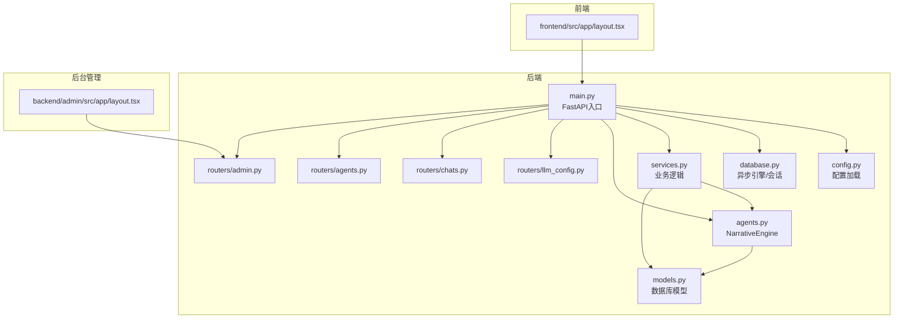
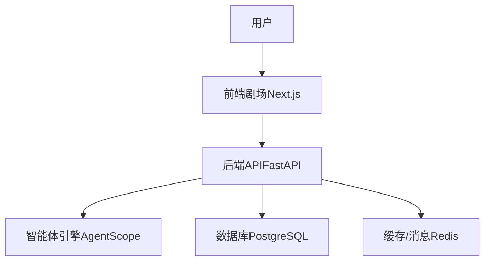
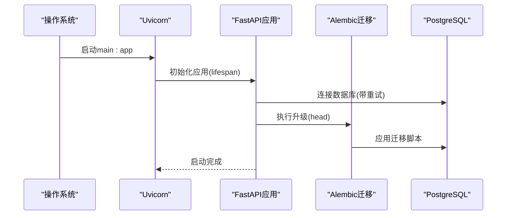
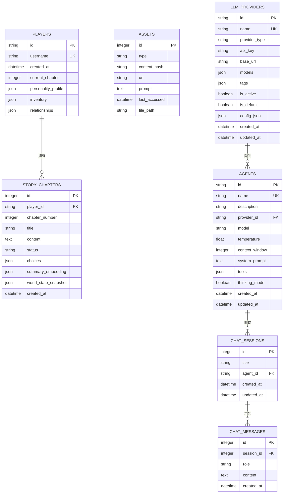
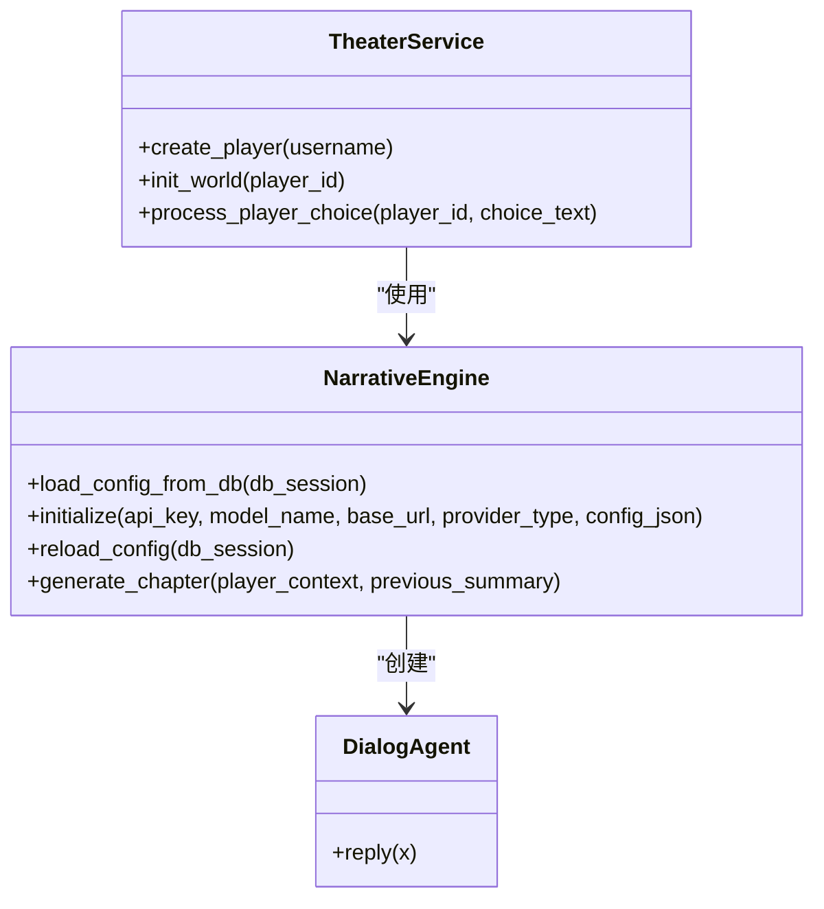
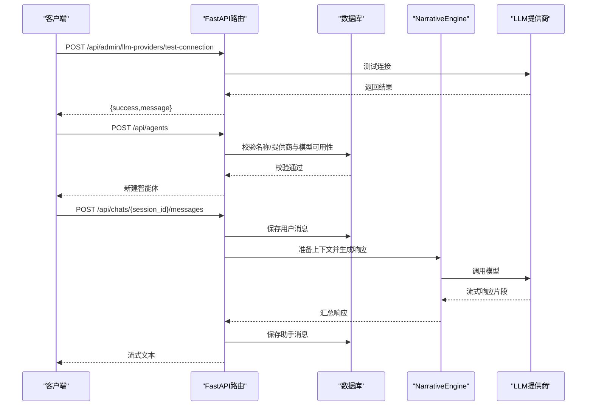
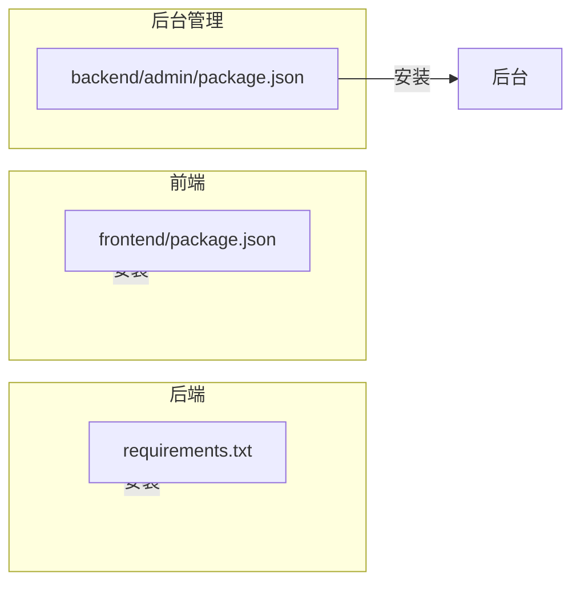

# 快速开始

<cite>
**本文引用的文件**
- [README.md](file://README.md)
- [.env.example](file://backend/.env.example)
- [requirements.txt](file://backend/requirements.txt)
- [package.json（前端）](file://frontend/package.json)
- [package.json（后台管理）](file://backend/admin/package.json)
- [main.py](file://backend/main.py)
- [config.py](file://backend/config.py)
- [database.py](file://backend/database.py)
- [models.py](file://backend/models.py)
- [manage_db.py](file://backend/manage_db.py)
- [services.py](file://backend/services.py)
- [agents.py](file://backend/agents.py)
- [routers/llm_config.py](file://backend/routers/llm_config.py)
- [routers/chats.py](file://backend/routers/chats.py)
- [routers/agents.py](file://backend/routers/agents.py)
- [routers/admin.py](file://backend/routers/admin.py)
- [layout.tsx（前端根布局）](file://frontend/src/app/layout.tsx)
- [layout.tsx（后台管理根布局）](file://backend/admin/src/app/layout.tsx)
</cite>

## 目录
1. [简介](#简介)
2. [项目结构](#项目结构)
3. [核心组件](#核心组件)
4. [架构总览](#架构总览)
5. [详细组件分析](#详细组件分析)
6. [依赖关系分析](#依赖关系分析)
7. [性能注意事项](#性能注意事项)
8. [故障排查指南](#故障排查指南)
9. [结论](#结论)
10. [附录](#附录)

## 简介
本指南面向希望在30分钟内成功运行“无限剧情剧场系统”的开发者与用户，覆盖后端FastAPI服务、前端Next.js客户端与后台管理系统的完整安装与启动流程。你将了解前置环境要求、环境变量配置、数据库初始化与依赖安装步骤，并掌握常见问题的排查与验证方法。

## 项目结构
该仓库采用前后端分离与模块化组织方式：
- backend：后端服务（FastAPI + AgentScope + PostgreSQL + Redis）
- frontend：剧场客户端（Next.js 16 + Pixi.js）
- backend/admin：后台管理系统（Next.js 16）
- docs/wiki：项目文档（架构、后端/前端开发指南、部署与迁移）

图表来源
- [main.py](file://backend/main.py#L83-L98)
- [config.py](file://backend/config.py#L7-L34)
- [database.py](file://backend/database.py#L1-L31)
- [models.py](file://backend/models.py#L1-L122)
- [services.py](file://backend/services.py#L1-L66)
- [agents.py](file://backend/agents.py#L43-L196)
- [routers/llm_config.py](file://backend/routers/llm_config.py#L1-L203)
- [routers/chats.py](file://backend/routers/chats.py#L1-L275)
- [routers/agents.py](file://backend/routers/agents.py#L1-L141)
- [routers/admin.py](file://backend/routers/admin.py#L1-L112)
- [layout.tsx（前端根布局）](file://frontend/src/app/layout.tsx#L1-L35)
- [layout.tsx（后台管理根布局）](file://backend/admin/src/app/layout.tsx#L1-L25)

章节来源
- [README.md](file://README.md#L34-L51)
- [main.py](file://backend/main.py#L83-L98)

## 核心组件
- 后端服务（FastAPI）：提供REST API与WebSocket接口，注册路由并挂载CORS；启动时自动执行数据库迁移。
- 数据库与模型：使用SQLAlchemy异步ORM，定义玩家、章节、资产、LLM提供商、聊天会话与消息等表。
- 业务服务：封装玩家创建、世界初始化、章节生成等业务逻辑。
- 智能体引擎（AgentScope）：负责剧情导演、叙述者与NPC管理等角色，支持从数据库动态加载LLM配置。
- 前端与后台：分别提供剧场交互与系统管理能力，均基于Next.js 16。

章节来源
- [main.py](file://backend/main.py#L1-L173)
- [models.py](file://backend/models.py#L1-L122)
- [services.py](file://backend/services.py#L1-L66)
- [agents.py](file://backend/agents.py#L1-L196)
- [routers/llm_config.py](file://backend/routers/llm_config.py#L1-L203)
- [routers/chats.py](file://backend/routers/chats.py#L1-L275)
- [routers/agents.py](file://backend/routers/agents.py#L1-L141)
- [routers/admin.py](file://backend/routers/admin.py#L1-L112)

## 架构总览
系统采用“后端API + 前端剧场 + 后台管理”的三层结构，后端通过AgentScope驱动剧情生成，使用PostgreSQL存储结构化数据，Redis用于缓存与消息队列。

图表来源
- [main.py](file://backend/main.py#L83-L98)
- [config.py](file://backend/config.py#L11-L25)
- [database.py](file://backend/database.py#L8-L23)
- [agents.py](file://backend/agents.py#L43-L196)

## 详细组件分析

### 后端服务（FastAPI）
- 生命周期与迁移：在应用启动时尝试连接数据库并执行Alembic迁移，最多重试若干次；随后从数据库加载LLM配置。
- CORS：允许前端（3000）与后台（3001）访问。
- 路由注册：包括LLM配置、管理员、智能体与聊天相关接口。
- WebSocket：提供与客户端的实时通信通道（占位）。

图表来源
- [main.py](file://backend/main.py#L45-L82)
- [manage_db.py](file://backend/manage_db.py#L30-L38)

章节来源
- [main.py](file://backend/main.py#L45-L82)
- [manage_db.py](file://backend/manage_db.py#L1-L67)

### 数据库与模型
- 引擎与会话：使用异步引擎，启用连接池与预检查；SQLite作为本地开发回退。
- 模型设计：涵盖玩家、故事章节、资产、LLM提供商、聊天会话与消息等，支持JSON字段与时间戳。

图表来源
- [database.py](file://backend/database.py#L1-L31)
- [models.py](file://backend/models.py#L9-L122)

章节来源
- [database.py](file://backend/database.py#L1-L31)
- [models.py](file://backend/models.py#L1-L122)

### 业务服务与智能体引擎
- 业务服务：封装玩家创建、世界初始化（调用NarrativeEngine）、章节生成与一致性校验等。
- 智能体引擎：根据数据库中的活跃LLM提供商动态初始化AgentScope模型，创建导演、叙述者与NPC管理Agent，并支持章节生成。

图表来源
- [services.py](file://backend/services.py#L8-L66)
- [agents.py](file://backend/agents.py#L11-L196)

章节来源
- [services.py](file://backend/services.py#L1-L66)
- [agents.py](file://backend/agents.py#L1-L196)

### 路由与接口
- LLM配置管理：提供测试连接、创建、查询、更新与删除LLM提供商的接口，并在激活时触发引擎重载。
- 聊天与会话：支持创建会话、列出会话、获取消息历史、发送消息并流式返回响应，同时保存助手回复。
- 智能体管理：提供智能体的增删改查与搜索。
- 后台管理：提供统计数据、玩家列表、删除玩家与故事列表等。

图表来源
- [routers/llm_config.py](file://backend/routers/llm_config.py#L20-L111)
- [routers/agents.py](file://backend/routers/agents.py#L15-L55)
- [routers/chats.py](file://backend/routers/chats.py#L72-L258)

章节来源
- [routers/llm_config.py](file://backend/routers/llm_config.py#L1-L203)
- [routers/agents.py](file://backend/routers/agents.py#L1-L141)
- [routers/chats.py](file://backend/routers/chats.py#L1-L275)
- [routers/admin.py](file://backend/routers/admin.py#L1-L112)

### 前端与后台管理
- 前端根布局：定义全局字体与元数据。
- 后台管理根布局：提供国际化语言设置与Provider包装器（用于状态与主题等）。

章节来源
- [layout.tsx（前端根布局）](file://frontend/src/app/layout.tsx#L1-L35)
- [layout.tsx（后台管理根布局）](file://backend/admin/src/app/layout.tsx#L1-L25)

## 依赖关系分析
- 后端依赖：FastAPI、Uvicorn、SQLAlchemy异步、Pydantic、AgentScope、OpenAI、Redis、WebSockets、Alembic、PostgreSQL驱动等。
- 前端依赖：Next.js 16、React、Pixi.js、Ant Design、Socket.IO客户端等。
- 后台管理依赖：Next.js 16、Radix UI、Monaco编辑器、SWR、Tailwind等。

图表来源
- [requirements.txt](file://backend/requirements.txt#L1-L20)
- [package.json（前端）](file://frontend/package.json#L1-L35)
- [package.json（后台管理）](file://backend/admin/package.json#L1-L72)

章节来源
- [requirements.txt](file://backend/requirements.txt#L1-L20)
- [package.json（前端）](file://frontend/package.json#L1-L35)
- [package.json（后台管理）](file://backend/admin/package.json#L1-L72)

## 性能注意事项
- 数据库连接池：已配置连接池大小与溢出连接数，建议在生产环境中根据并发请求调整。
- 异步I/O：后端采用异步ORM与WebSocket，降低阻塞风险。
- LLM调用：聊天接口支持流式返回，减少首字节延迟；注意不同提供商的Token统计与上下文窗口限制。
- 缓存与队列：Redis可用于会话状态与消息队列，建议在生产中启用并配置合适的过期策略。

## 故障排查指南
- 数据库连接失败
  - 症状：启动时报数据库连接错误或迁移失败。
  - 排查：确认PostgreSQL服务运行、数据库存在且凭据正确；检查环境变量DATABASE_URL；查看重试日志。
  - 参考：[main.py](file://backend/main.py#L47-L74)、[config.py](file://backend/config.py#L11-L16)、[database.py](file://backend/database.py#L8-L17)
- Alembic迁移未执行
  - 症状：模型变更后数据库未更新。
  - 排查：使用迁移管理脚本生成并应用迁移；或在启动时确认迁移执行日志。
  - 参考：[manage_db.py](file://backend/manage_db.py#L20-L38)、[main.py](file://backend/main.py#L59-L65)
- LLM提供商未激活
  - 症状：章节生成报错提示未初始化。
  - 排查：在后台管理创建并激活LLM提供商；或在启动时从数据库加载默认配置。
  - 参考：[agents.py](file://backend/agents.py#L49-L76)、[routers/llm_config.py](file://backend/routers/llm_config.py#L112-L138)
- 前端或后台无法访问
  - 症状：浏览器无法打开3000或3001端口。
  - 排查：确认Node.js版本满足要求；检查端口占用；查看各项目的启动日志。
  - 参考：[README.md](file://README.md#L55-L59)、[package.json（前端）](file://frontend/package.json#L5-L10)、[package.json（后台管理）](file://backend/admin/package.json#L5-L10)
- WebSocket连接异常
  - 症状：客户端WS连接失败或无消息推送。
  - 排查：检查CORS配置是否允许对应源；确认后端WebSocket端点逻辑与客户端连接参数一致。
  - 参考：[main.py](file://backend/main.py#L85-L91)、[main.py](file://backend/main.py#L157-L169)

章节来源
- [main.py](file://backend/main.py#L47-L82)
- [manage_db.py](file://backend/manage_db.py#L20-L38)
- [agents.py](file://backend/agents.py#L49-L76)
- [README.md](file://README.md#L55-L59)
- [package.json（前端）](file://frontend/package.json#L5-L10)
- [package.json（后台管理）](file://backend/admin/package.json#L5-L10)

## 结论
按照本指南，你可以在30分钟内完成环境准备、依赖安装、数据库初始化与系统启动。建议先完成数据库与Redis的准备工作，再依次启动后端、前端与后台管理，最后在后台配置LLM提供商以启用剧情生成能力。

## 附录

### 前置环境要求
- Python 3.10+
- Node.js 18+
- PostgreSQL（需创建数据库）
- Redis

章节来源
- [README.md](file://README.md#L55-L59)

### 分步骤安装与启动

1) 后端设置
- 进入后端目录，创建并激活虚拟环境（可选但推荐）
- 安装依赖
- 复制并编辑环境变量文件
- 启动后端服务（自动执行数据库迁移）

章节来源
- [README.md](file://README.md#L61-L84)
- [.env.example](file://backend/.env.example#L1-L4)
- [requirements.txt](file://backend/requirements.txt#L1-L20)

2) 数据库迁移
- 生成迁移脚本
- 应用迁移
- 回滚迁移（如需）

章节来源
- [README.md](file://README.md#L86-L99)
- [manage_db.py](file://backend/manage_db.py#L20-L38)

3) 剧场前端设置
- 进入前端目录
- 安装依赖
- 启动开发服务器

章节来源
- [README.md](file://README.md#L103-L114)
- [package.json（前端）](file://frontend/package.json#L5-L10)

4) 后台管理系统设置
- 进入后台目录
- 安装依赖
- 启动开发服务器

章节来源
- [README.md](file://README.md#L116-L127)
- [package.json（后台管理）](file://backend/admin/package.json#L5-L10)

### 环境变量配置
- DATABASE_URL：数据库连接字符串（默认SQLite，生产建议PostgreSQL）
- REDIS_URL：Redis连接字符串
- OPENAI_API_KEY、CLAUDE_API_KEY、GEMINI_API_KEY：可选，可在后台管理中配置

章节来源
- [.env.example](file://backend/.env.example#L1-L4)
- [config.py](file://backend/config.py#L11-L25)

### 验证方法
- 后端健康检查：访问根路径或列出路由
- 数据库：确认迁移执行日志与表结构
- 前端：访问 http://localhost:3000
- 后台：访问 http://localhost:3001
- LLM配置：在后台创建并激活提供商，测试连接

章节来源
- [main.py](file://backend/main.py#L128-L131)
- [README.md](file://README.md#L116-L127)
- [routers/llm_config.py](file://backend/routers/llm_config.py#L20-L111)