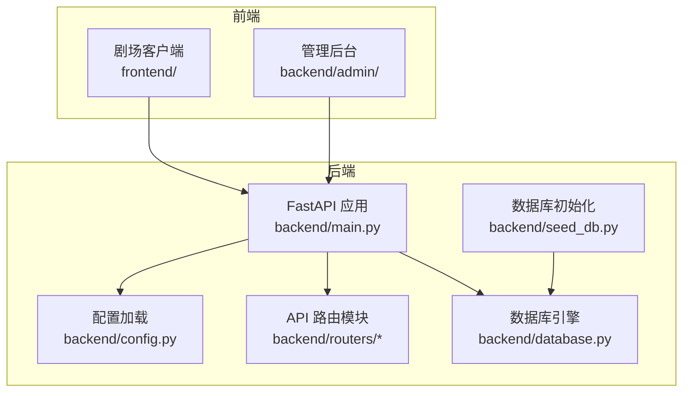
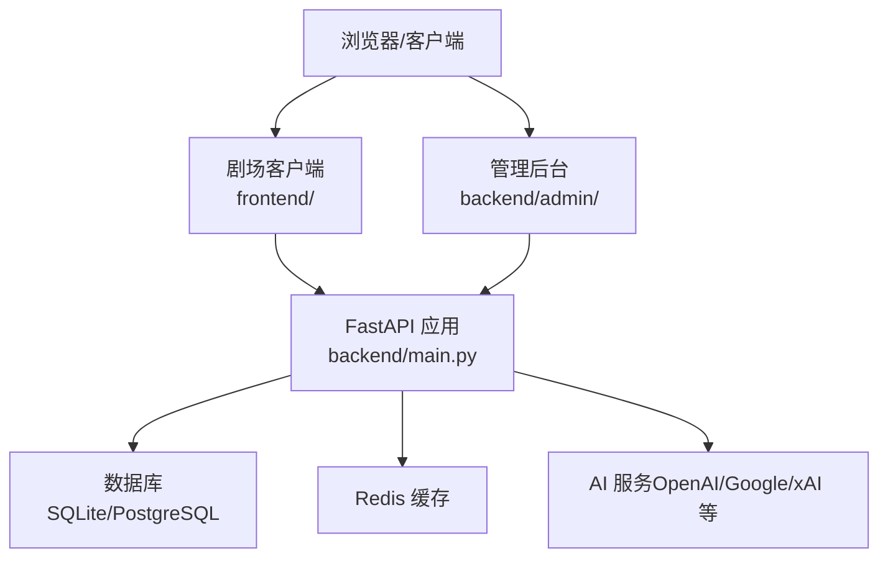
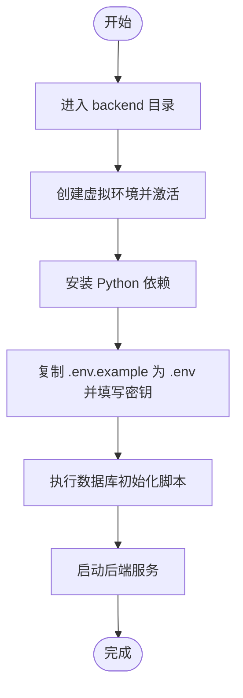
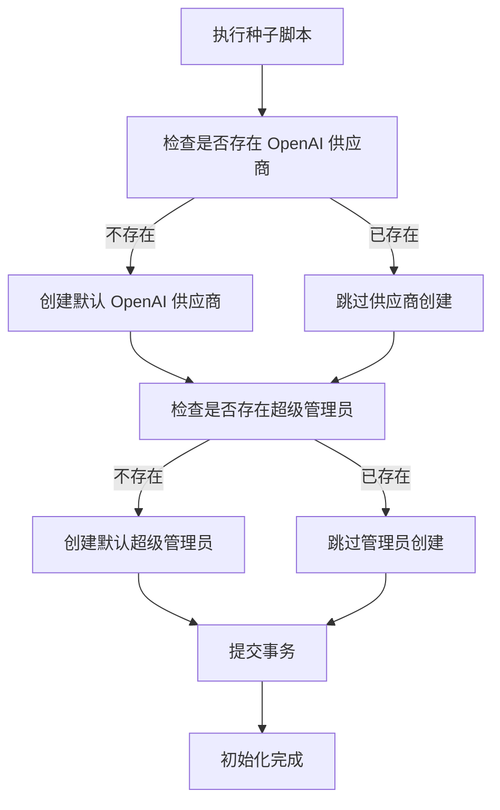
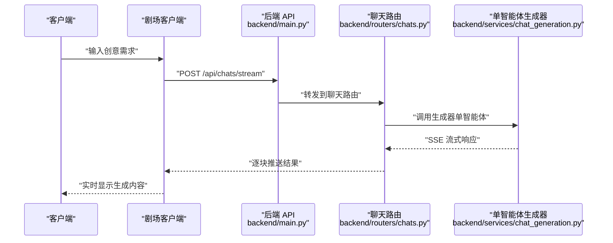
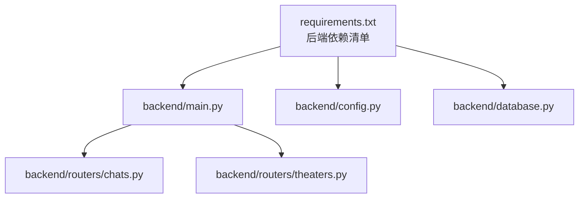

# 快速开始

<cite>
**本文引用的文件**
- [README.md](file://README.md)
- [backend/main.py](file://backend/main.py)
- [backend/config.py](file://backend/config.py)
- [backend/database.py](file://backend/database.py)
- [backend/requirements.txt](file://backend/requirements.txt)
- [backend/seed_db.py](file://backend/seed_db.py)
- [backend/routers/chats.py](file://backend/routers/chats.py)
- [backend/routers/theaters.py](file://backend/routers/theaters.py)
- [backend/.env.example](file://backend/.env.example)
- [frontend/package.json](file://frontend/package.json)
- [backend/admin/package.json](file://backend/admin/package.json)
</cite>

## 目录
1. [简介](#简介)
2. [项目结构](#项目结构)
3. [核心组件](#核心组件)
4. [架构总览](#架构总览)
5. [详细组件分析](#详细组件分析)
6. [依赖关系分析](#依赖关系分析)
7. [性能考虑](#性能考虑)
8. [故障排查指南](#故障排查指南)
9. [结论](#结论)
10. [附录](#附录)

## 简介
本指南面向新手开发者，帮助你在本地快速搭建 KunFlix（鲲影）开发环境，涵盖系统环境要求、安装步骤、环境变量配置、数据库初始化、前后端启动方式以及访问地址说明，并提供实际的 API 使用示例（如生成广告剧本的请求示例），确保你能顺利运行项目并进行后续开发。

## 项目结构
KunFlix 采用前后端分离架构：
- 后端：Python + FastAPI，提供 REST API、WebSocket、数据库与 AI 服务集成
- 前端剧场客户端：Next.js（用户创作界面）
- 管理后台：Next.js（可视化管理界面）

**图表来源**
- [backend/main.py:110-175](file://backend/main.py#L110-L175)
- [backend/config.py:7-43](file://backend/config.py#L7-L43)
- [backend/database.py:1-45](file://backend/database.py#L1-L45)
- [backend/seed_db.py:21-57](file://backend/seed_db.py#L21-L57)
- [frontend/package.json:1-94](file://frontend/package.json#L1-L94)
- [backend/admin/package.json:1-73](file://backend/admin/package.json#L1-L73)

**章节来源**
- [README.md:63-79](file://README.md#L63-L79)
- [backend/main.py:110-175](file://backend/main.py#L110-L175)
- [frontend/package.json:1-94](file://frontend/package.json#L1-L94)
- [backend/admin/package.json:1-73](file://backend/admin/package.json#L1-L73)

## 核心组件
- 后端服务入口与生命周期管理：负责数据库连接重试、迁移执行、媒体目录初始化、CORS 配置、路由注册与 WebSocket 端点
- 配置系统：集中管理数据库、AI 服务密钥、JWT、Redis、生成模型等配置项
- 数据库层：支持 SQLite（开发）与 PostgreSQL（生产），内置 WAL 模式优化与连接池配置
- 数据初始化：提供默认 LLM 供应商与超级管理员账号的种子数据
- API 路由：包含聊天、剧场、视频、代理、订阅等核心业务接口
- 前端与管理后台：分别提供用户创作界面与可视化管理界面

**章节来源**
- [backend/main.py:49-108](file://backend/main.py#L49-L108)
- [backend/config.py:7-43](file://backend/config.py#L7-L43)
- [backend/database.py:9-37](file://backend/database.py#L9-L37)
- [backend/seed_db.py:21-57](file://backend/seed_db.py#L21-L57)
- [backend/routers/chats.py:18-22](file://backend/routers/chats.py#L18-L22)
- [backend/routers/theaters.py:14-17](file://backend/routers/theaters.py#L14-L17)

## 架构总览
后端以 FastAPI 为核心，通过路由模块组织业务接口；数据库层采用 SQLAlchemy 异步 ORM；前端与管理后台通过 Next.js 提供 Web 界面；WebSocket 支持实时通信；CORS 允许本地开发跨域访问。

**图表来源**
- [backend/main.py:130-136](file://backend/main.py#L130-L136)
- [backend/config.py:15-29](file://backend/config.py#L15-L29)
- [backend/requirements.txt:1-29](file://backend/requirements.txt#L1-L29)

**章节来源**
- [backend/main.py:130-136](file://backend/main.py#L130-L136)
- [backend/config.py:15-29](file://backend/config.py#L15-L29)
- [backend/requirements.txt:1-29](file://backend/requirements.txt#L1-L29)

## 详细组件分析

### 环境准备与系统要求
- Python 3.10+
- Node.js 18+
- 数据库：开发环境使用 SQLite，生产环境推荐 PostgreSQL
- 可选：Redis（用于缓存）、AI 服务密钥（OpenAI/Google/xAI 等）

**章节来源**
- [README.md:85-88](file://README.md#L85-L88)

### 安装步骤

#### 1) 克隆项目
- 在项目根目录执行克隆与进入命令
- 后续步骤均在项目根目录下进行

**章节来源**
- [README.md:92-96](file://README.md#L92-L96)

#### 2) 后端配置
- 进入后端目录，创建虚拟环境并安装依赖
- 复制环境变量示例文件并按需编辑
- 初始化数据库（创建默认管理员与 LLM 供应商）
- 启动后端服务

**图表来源**
- [backend/requirements.txt:1-29](file://backend/requirements.txt#L1-L29)
- [backend/.env.example:1-4](file://backend/.env.example#L1-L4)
- [backend/seed_db.py:21-57](file://backend/seed_db.py#L21-L57)
- [backend/main.py:173-175](file://backend/main.py#L173-L175)

**章节来源**
- [README.md:98-108](file://README.md#L98-L108)
- [backend/requirements.txt:1-29](file://backend/requirements.txt#L1-L29)
- [backend/.env.example:1-4](file://backend/.env.example#L1-L4)
- [backend/seed_db.py:21-57](file://backend/seed_db.py#L21-L57)
- [backend/main.py:173-175](file://backend/main.py#L173-L175)

#### 3) 前端配置
- 进入前端目录，安装依赖
- 复制环境变量示例文件并配置后端 API 地址
- 启动开发服务器

**章节来源**
- [README.md:110-117](file://README.md#L110-L117)
- [frontend/package.json:1-94](file://frontend/package.json#L1-L94)

#### 4) 管理后台配置
- 进入后端管理后台目录
- 安装依赖并启动开发服务器

**章节来源**
- [README.md:119-124](file://README.md#L119-L124)
- [backend/admin/package.json:1-73](file://backend/admin/package.json#L1-L73)

### 环境变量配置方法
- 后端环境变量文件：backend/.env
  - 示例字段：OPENAI_API_KEY、DATABASE_URL、REDIS_URL
  - 默认使用 SQLite（可通过注释切换为 PostgreSQL）
- 前端环境变量文件：frontend/.env.local
  - 示例字段：NEXT_PUBLIC_API_BASE_URL（指向后端 API 基础地址）
- 管理后台环境变量：backend/admin/.env（若无示例文件可直接运行）

**章节来源**
- [backend/.env.example:1-4](file://backend/.env.example#L1-L4)
- [backend/config.py:15-16](file://backend/config.py#L15-L16)

### 初始化数据库操作
- 使用数据库初始化脚本创建默认 LLM 供应商与超级管理员账号
- 启动时可选择是否自动执行数据库迁移（RUN_MIGRATIONS）

**图表来源**
- [backend/seed_db.py:21-57](file://backend/seed_db.py#L21-L57)

**章节来源**
- [backend/seed_db.py:21-57](file://backend/seed_db.py#L21-L57)
- [backend/config.py:37-37](file://backend/config.py#L37-L37)

### 访问地址说明
- 剧场客户端：http://localhost:3000
- 管理后台：http://localhost:3001
- API 文档：http://localhost:8000/docs

**章节来源**
- [README.md:126-129](file://README.md#L126-L129)

### 实际 API 使用示例
以下示例展示如何通过后端 API 生成广告剧本。请求将发送至后端的聊天流式接口，后端根据指定智能体生成内容并通过 SSE 返回。

**图表来源**
- [backend/routers/chats.py:127-183](file://backend/routers/chats.py#L127-L183)
- [backend/services/chat_generation.py:32-69](file://backend/services/chat_generation.py#L32-L69)

**章节来源**
- [README.md:131-139](file://README.md#L131-L139)
- [backend/routers/chats.py:127-183](file://backend/routers/chats.py#L127-L183)

## 依赖关系分析
后端依赖主要围绕异步 Web 框架、数据库 ORM、AI 服务 SDK、WebSocket、Redis 与配置管理等模块。前端与管理后台分别依赖 Next.js 生态与 UI 组件库。

**图表来源**
- [backend/requirements.txt:1-29](file://backend/requirements.txt#L1-L29)
- [backend/main.py:42-44](file://backend/main.py#L42-L44)
- [backend/routers/chats.py:1-16](file://backend/routers/chats.py#L1-L16)
- [backend/routers/theaters.py:1-8](file://backend/routers/theaters.py#L1-L8)

**章节来源**
- [backend/requirements.txt:1-29](file://backend/requirements.txt#L1-L29)
- [backend/main.py:42-44](file://backend/main.py#L42-L44)
- [backend/routers/chats.py:1-16](file://backend/routers/chats.py#L1-L16)
- [backend/routers/theaters.py:1-8](file://backend/routers/theaters.py#L1-L8)

## 性能考虑
- 数据库：生产环境建议使用 PostgreSQL 并开启连接池；开发环境 SQLite 已内置 WAL 模式与超时优化
- 缓存：可启用 Redis 缓存热点数据
- 负载均衡：多实例部署配合反向代理
- GPU：视频生成任务建议配置 GPU 服务器
- 存储：媒体文件建议使用对象存储服务

**章节来源**
- [README.md:250-256](file://README.md#L250-L256)
- [backend/database.py:21-31](file://backend/database.py#L21-L31)

## 故障排查指南
- 数据库连接失败：检查 DATABASE_URL 是否正确；确认 SQLite 文件路径或 PostgreSQL 服务可用性
- 迁移失败：查看启动日志中的迁移错误；必要时清理残留临时表后重试
- CORS 问题：确认前端与管理后台访问地址已在 CORS 白名单中
- WebSocket 连接异常：检查后端 WebSocket 端点与网络连通性
- 环境变量未生效：确认 .env 文件已复制并填写完整，后端重启后重新加载

**章节来源**
- [backend/main.py:49-96](file://backend/main.py#L49-L96)
- [backend/main.py:130-136](file://backend/main.py#L130-L136)
- [backend/config.py:15-16](file://backend/config.py#L15-L16)

## 结论
按照本指南完成环境准备、安装与配置后，你可以在本地成功启动后端、前端与管理后台，并通过 API 体验生成广告剧本等核心功能。建议在开发过程中逐步完善环境变量与数据库配置，为后续功能扩展与生产部署打下基础。

## 附录

### 常用命令速查
- 后端：安装依赖、复制环境变量、初始化数据库、启动服务
- 前端：安装依赖、复制环境变量、启动开发服务器
- 管理后台：安装依赖、启动开发服务器

**章节来源**
- [README.md:98-124](file://README.md#L98-L124)