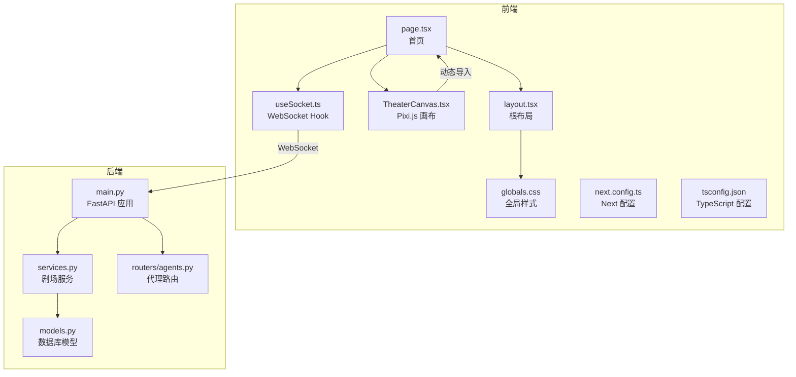
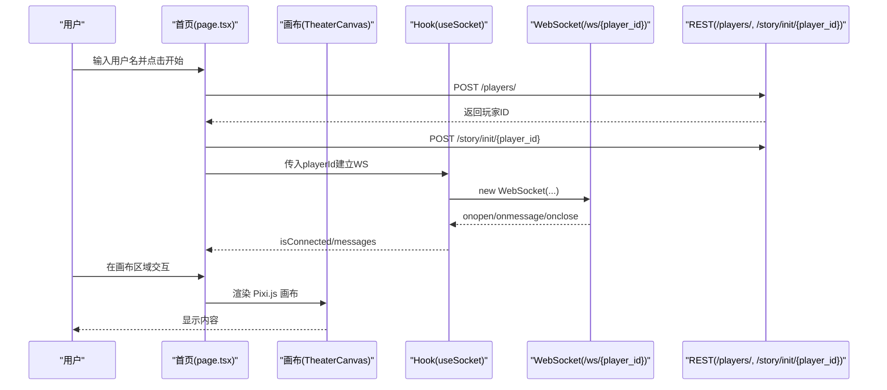
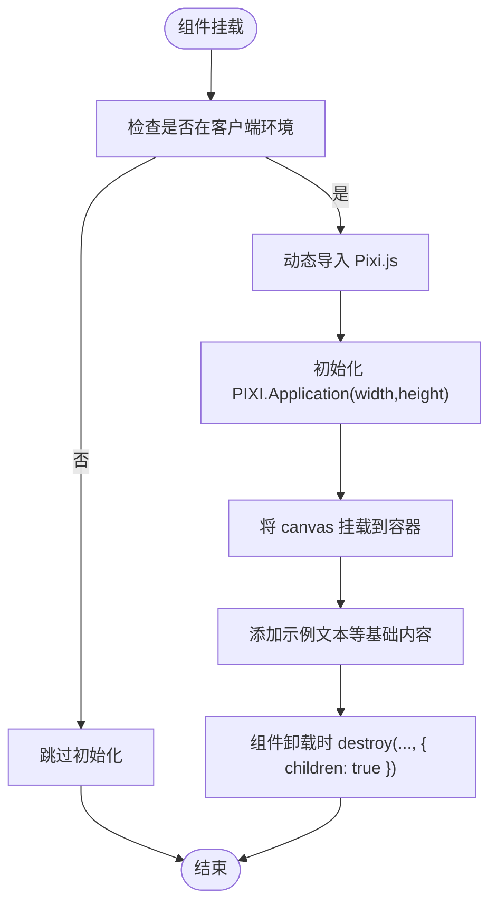
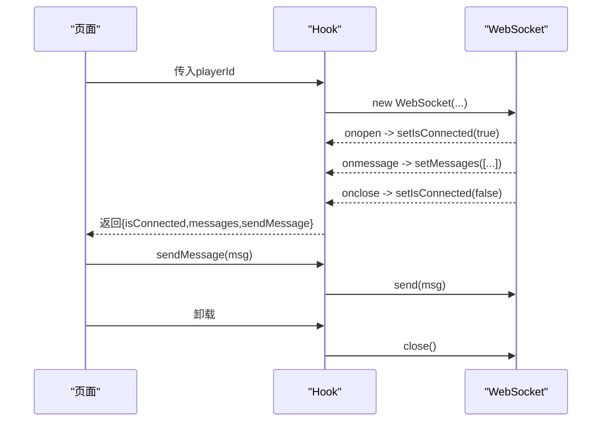
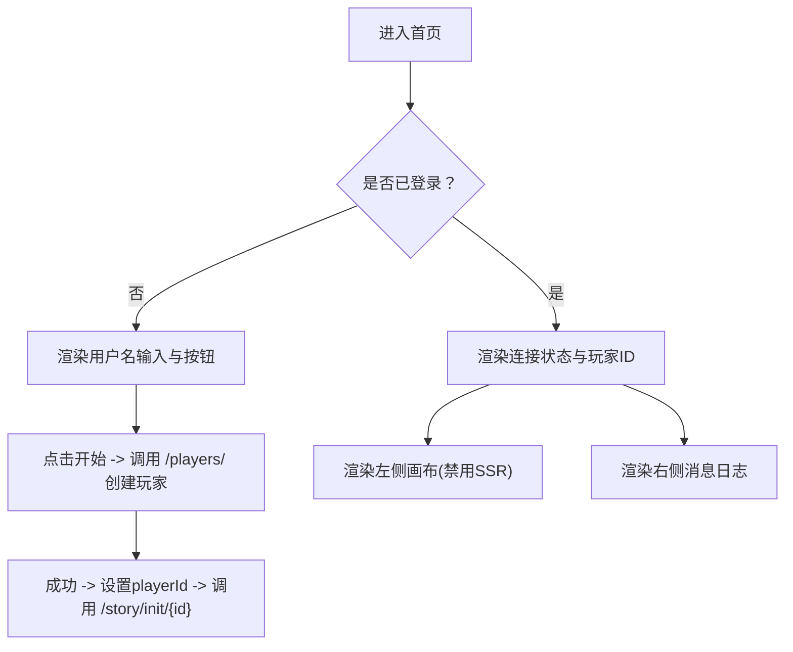
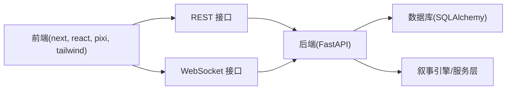

# 前端渲染问题

<cite>
**本文引用的文件**
- [frontend/src/app/layout.tsx](file://frontend/src/app/layout.tsx)
- [frontend/src/app/page.tsx](file://frontend/src/app/page.tsx)
- [frontend/src/components/TheaterCanvas.tsx](file://frontend/src/components/TheaterCanvas.tsx)
- [frontend/src/hooks/useSocket.ts](file://frontend/src/hooks/useSocket.ts)
- [frontend/next.config.ts](file://frontend/next.config.ts)
- [frontend/package.json](file://frontend/package.json)
- [frontend/tsconfig.json](file://frontend/tsconfig.json)
- [frontend/src/app/globals.css](file://frontend/src/app/globals.css)
- [backend/main.py](file://backend/main.py)
- [backend/services.py](file://backend/services.py)
- [backend/models.py](file://backend/models.py)
- [backend/routers/agents.py](file://backend/routers/agents.py)
</cite>

## 目录
1. [简介](#简介)
2. [项目结构](#项目结构)
3. [核心组件](#核心组件)
4. [架构总览](#架构总览)
5. [详细组件分析](#详细组件分析)
6. [依赖关系分析](#依赖关系分析)
7. [性能考量](#性能考量)
8. [故障排除指南](#故障排除指南)
9. [结论](#结论)
10. [附录](#附录)

## 简介
本指南聚焦于前端渲染相关问题的系统化排查与修复，覆盖以下场景：
- Next.js 应用崩溃与组件渲染异常
- Pixi.js 画布显示问题
- WebSocket 连接状态异常
- TypeScript 编译错误、React 组件挂起、样式加载失败、资源路径错误
- 浏览器兼容性、性能瓶颈、内存泄漏、动画卡顿
- 开发者工具使用技巧、性能分析方法与调试最佳实践
- SSR/CSR 混合渲染、静态资源优化与用户体验提升

## 项目结构
前端采用 Next.js App Router 结构，核心页面与组件如下：
- 页面：根布局与首页
- 组件：剧场画布（Pixi.js）
- 自定义 Hook：WebSocket 状态与消息管理
- 样式：Tailwind CSS 与主题变量
- 构建与类型：Next 配置、TypeScript 配置

图表来源
- [frontend/src/app/layout.tsx](file://frontend/src/app/layout.tsx#L1-L35)
- [frontend/src/app/page.tsx](file://frontend/src/app/page.tsx#L1-L85)
- [frontend/src/components/TheaterCanvas.tsx](file://frontend/src/components/TheaterCanvas.tsx#L1-L50)
- [frontend/src/hooks/useSocket.ts](file://frontend/src/hooks/useSocket.ts#L1-L43)
- [frontend/src/app/globals.css](file://frontend/src/app/globals.css#L1-L27)
- [frontend/next.config.ts](file://frontend/next.config.ts#L1-L8)
- [frontend/tsconfig.json](file://frontend/tsconfig.json#L1-L35)
- [backend/main.py](file://backend/main.py#L1-L173)
- [backend/services.py](file://backend/services.py#L1-L66)
- [backend/models.py](file://backend/models.py#L1-L122)
- [backend/routers/agents.py](file://backend/routers/agents.py#L1-L141)

章节来源
- [frontend/src/app/layout.tsx](file://frontend/src/app/layout.tsx#L1-L35)
- [frontend/src/app/page.tsx](file://frontend/src/app/page.tsx#L1-L85)
- [frontend/src/components/TheaterCanvas.tsx](file://frontend/src/components/TheaterCanvas.tsx#L1-L50)
- [frontend/src/hooks/useSocket.ts](file://frontend/src/hooks/useSocket.ts#L1-L43)
- [frontend/src/app/globals.css](file://frontend/src/app/globals.css#L1-L27)
- [frontend/next.config.ts](file://frontend/next.config.ts#L1-L8)
- [frontend/tsconfig.json](file://frontend/tsconfig.json#L1-L35)
- [backend/main.py](file://backend/main.py#L1-L173)
- [backend/services.py](file://backend/services.py#L1-L66)
- [backend/models.py](file://backend/models.py#L1-L122)
- [backend/routers/agents.py](file://backend/routers/agents.py#L1-L141)

## 核心组件
- 根布局与字体注入：在根节点设置语言与字体变量，确保全局样式一致。
- 首页页面：条件渲染登录表单与剧场区域；动态加载 Pixi.js 画布；通过自定义 Hook 管理 WebSocket。
- 剧场画布组件：客户端侧初始化 Pixi.js Application，动态挂载 Canvas 并清理资源。
- WebSocket Hook：基于 playerId 建立连接，维护连接状态与消息列表，提供发送消息能力。
- 全局样式：Tailwind 初始化与深色模式支持，主题变量绑定字体与背景。

章节来源
- [frontend/src/app/layout.tsx](file://frontend/src/app/layout.tsx#L1-L35)
- [frontend/src/app/page.tsx](file://frontend/src/app/page.tsx#L1-L85)
- [frontend/src/components/TheaterCanvas.tsx](file://frontend/src/components/TheaterCanvas.tsx#L1-L50)
- [frontend/src/hooks/useSocket.ts](file://frontend/src/hooks/useSocket.ts#L1-L43)
- [frontend/src/app/globals.css](file://frontend/src/app/globals.css#L1-L27)

## 架构总览
前端通过 Next.js 提供 SSR/CSR 混合渲染，页面按需加载组件；剧场画布采用动态导入以避免 SSR 环境缺失 DOM；WebSocket 用于实时通信；后端提供 REST 与 WebSocket 接口。

图表来源
- [frontend/src/app/page.tsx](file://frontend/src/app/page.tsx#L14-L35)
- [frontend/src/hooks/useSocket.ts](file://frontend/src/hooks/useSocket.ts#L8-L33)
- [frontend/src/components/TheaterCanvas.tsx](file://frontend/src/components/TheaterCanvas.tsx#L14-L44)
- [backend/main.py](file://backend/main.py#L138-L156)
- [backend/main.py](file://backend/main.py#L157-L169)

## 详细组件分析

### 渲染与动态导入（TheaterCanvas）
- 动态导入策略：在客户端侧异步加载 Pixi.js，避免 SSR 环境中缺少 DOM 导致初始化失败。
- 生命周期清理：组件卸载时销毁 Pixi Application，释放纹理与子对象，防止内存泄漏。
- 尺寸参数：通过 props 控制画布尺寸，副作用依赖数组触发重建。

图表来源
- [frontend/src/components/TheaterCanvas.tsx](file://frontend/src/components/TheaterCanvas.tsx#L14-L44)

章节来源
- [frontend/src/components/TheaterCanvas.tsx](file://frontend/src/components/TheaterCanvas.tsx#L1-L50)

### WebSocket 状态管理（useSocket）
- 连接建立：根据 playerId 动态创建 WebSocket，监听 open/message/close 事件。
- 状态同步：维护 isConnected 与 messages 列表，便于 UI 展示连接状态与消息历史。
- 发送消息：仅在连接处于 OPEN 状态时发送，避免异常。
- 资源清理：组件卸载时关闭连接，防止后台持续占用。

图表来源
- [frontend/src/hooks/useSocket.ts](file://frontend/src/hooks/useSocket.ts#L8-L33)

章节来源
- [frontend/src/hooks/useSocket.ts](file://frontend/src/hooks/useSocket.ts#L1-L43)

### 页面与条件渲染（page.tsx）
- 登录阶段：输入用户名，调用后端接口创建玩家并初始化故事。
- 渲染阶段：展示连接状态与玩家 ID；左侧渲染画布，右侧展示消息日志。
- 动态组件：通过动态导入禁用 SSR，确保客户端特性可用。

图表来源
- [frontend/src/app/page.tsx](file://frontend/src/app/page.tsx#L9-L35)
- [frontend/src/app/page.tsx](file://frontend/src/app/page.tsx#L37-L84)

章节来源
- [frontend/src/app/page.tsx](file://frontend/src/app/page.tsx#L1-L85)

### 样式与字体（layout.tsx, globals.css）
- 字体注入：通过 next/font 注入 Geist Sans/Mono，并暴露 CSS 变量。
- 主题切换：基于 prefers-color-scheme 的深色模式支持。
- Tailwind 初始化：在全局样式中引入 Tailwind，确保组件样式生效。

章节来源
- [frontend/src/app/layout.tsx](file://frontend/src/app/layout.tsx#L1-L35)
- [frontend/src/app/globals.css](file://frontend/src/app/globals.css#L1-L27)

### 类型与构建配置（tsconfig.json, next.config.ts）
- TypeScript：严格模式、隔离模块、路径别名、增量编译等配置。
- Next：默认配置项，可扩展图像优化、实验特性等。

章节来源
- [frontend/tsconfig.json](file://frontend/tsconfig.json#L1-L35)
- [frontend/next.config.ts](file://frontend/next.config.ts#L1-L8)

## 依赖关系分析
- 前端依赖：Next.js、React、Pixi.js、Ant Design、TailwindCSS、socket.io-client、SWR 等。
- 后端依赖：FastAPI、SQLAlchemy 异步、Uvicorn、Alembic 迁移等。
- 前后端接口：REST（创建玩家、初始化故事）、WebSocket（实时消息）。

图表来源
- [frontend/package.json](file://frontend/package.json#L11-L23)
- [backend/main.py](file://backend/main.py#L138-L156)
- [backend/main.py](file://backend/main.py#L157-L169)
- [backend/services.py](file://backend/services.py#L1-L66)
- [backend/models.py](file://backend/models.py#L1-L122)

章节来源
- [frontend/package.json](file://frontend/package.json#L1-L35)
- [backend/main.py](file://backend/main.py#L1-L173)
- [backend/services.py](file://backend/services.py#L1-L66)
- [backend/models.py](file://backend/models.py#L1-L122)

## 性能考量
- 客户端渲染优先：动态导入与禁用 SSR 的组件减少首屏阻塞与 SSR 不兼容风险。
- 资源懒加载：Pixi.js 按需加载，降低初始包体积。
- 内存管理：组件卸载时销毁 Pixi Application，避免内存泄漏。
- 样式与字体：预注入字体变量，减少运行时计算与闪烁。
- 图像与静态资源：建议启用 Next 图像优化与静态导出（如需），结合 CDN 使用。
- 动画与帧率：避免在主线程执行高负载任务，必要时使用 Web Workers 或分帧处理。

## 故障排除指南

### 一、Next.js 应用崩溃
常见症状
- SSR 环境下访问 DOM API 抛错
- 动态导入未生效导致运行时缺失模块
- 样式或字体未正确注入

排查步骤
- 确认动态导入与客户端标记：组件需标注客户端并在客户端环境初始化。
- 检查根布局字体注入与全局样式是否正确加载。
- 查看开发日志与浏览器控制台错误堆栈定位具体文件与行号。
- 若出现 SSR 不兼容，确认组件是否被正确标记为客户端组件。

章节来源
- [frontend/src/components/TheaterCanvas.tsx](file://frontend/src/components/TheaterCanvas.tsx#L1-L50)
- [frontend/src/app/layout.tsx](file://frontend/src/app/layout.tsx#L1-L35)
- [frontend/src/app/globals.css](file://frontend/src/app/globals.css#L1-L27)

### 二、组件渲染异常
常见症状
- 画布不显示、空白或报错
- 消息列表不更新、连接状态不变化
- 页面布局错位、样式冲突

排查步骤
- Pixi.js 画布：确认动态导入成功、容器存在、应用初始化完成且已挂载 canvas。
- WebSocket：检查 playerId 是否有效、WebSocket 地址与端口、后端是否接受连接。
- 样式：确认 Tailwind 已正确初始化、字体变量已注入、无覆盖冲突。
- 条件渲染：检查登录状态与 playerId 的传递链路。

章节来源
- [frontend/src/components/TheaterCanvas.tsx](file://frontend/src/components/TheaterCanvas.tsx#L14-L44)
- [frontend/src/hooks/useSocket.ts](file://frontend/src/hooks/useSocket.ts#L8-L33)
- [frontend/src/app/page.tsx](file://frontend/src/app/page.tsx#L37-L84)
- [frontend/src/app/globals.css](file://frontend/src/app/globals.css#L1-L27)

### 三、Pixi.js 画布显示问题
常见症状
- 画布元素不渲染、白屏
- 销毁后仍残留资源
- 尺寸不匹配或缩放异常

排查步骤
- 确保在客户端环境初始化，避免在 SSR 中调用。
- 初始化时设置宽高并正确挂载 canvas。
- 卸载时彻底销毁应用与纹理、子对象。
- 检查容器尺寸与 CSS 样式，避免溢出或裁剪。

章节来源
- [frontend/src/components/TheaterCanvas.tsx](file://frontend/src/components/TheaterCanvas.tsx#L14-L44)

### 四、WebSocket 连接状态异常
常见症状
- 无法连接、频繁断开
- 消息不显示、状态不更新
- 发送消息无效

排查步骤
- 确认 playerId 有效后再建立连接。
- 检查后端 WebSocket 端点与 CORS 配置。
- 在浏览器网络面板查看握手与数据帧。
- 在 Hook 中仅在 OPEN 状态发送消息。

章节来源
- [frontend/src/hooks/useSocket.ts](file://frontend/src/hooks/useSocket.ts#L8-L33)
- [backend/main.py](file://backend/main.py#L157-L169)

### 五、TypeScript 编译错误
常见症状
- 严格模式下的类型不匹配
- 模块解析失败
- JSX/TSX 解析异常

排查步骤
- 检查 tsconfig 的严格模式、模块解析策略与路径别名。
- 确认插件与 include/exclude 规则。
- 更新依赖版本以匹配 Next 版本要求。

章节来源
- [frontend/tsconfig.json](file://frontend/tsconfig.json#L1-L35)
- [frontend/package.json](file://frontend/package.json#L1-L35)

### 六、React 组件挂起
常见症状
- useEffect 未清理或循环依赖
- 动态导入未完成导致渲染空内容

排查步骤
- 检查副作用依赖数组，确保清理函数正确释放资源。
- 对动态导入进行状态管理，避免在未加载完成时渲染子组件。
- 使用 React DevTools 分析渲染树与状态变更。

章节来源
- [frontend/src/components/TheaterCanvas.tsx](file://frontend/src/components/TheaterCanvas.tsx#L14-L44)
- [frontend/src/hooks/useSocket.ts](file://frontend/src/hooks/useSocket.ts#L8-L33)

### 七、样式加载失败与资源路径错误
常见症状
- 字体未生效、样式闪烁
- Tailwind 类不生效
- 静态资源 404

排查步骤
- 确认全局样式文件引入顺序与 @theme inline 使用。
- 检查字体变量是否注入到根节点。
- 校验静态资源路径与 public 目录结构。

章节来源
- [frontend/src/app/globals.css](file://frontend/src/app/globals.css#L1-L27)
- [frontend/src/app/layout.tsx](file://frontend/src/app/layout.tsx#L1-L35)

### 八、浏览器兼容性问题
常见症状
- 某些浏览器不支持新语法或 API
- WebSocket 行为差异

排查步骤
- 使用 Babel/Transpile 降级至目标浏览器支持范围。
- 在 CI 中针对关键浏览器版本进行测试。
- 对 WebSocket 进行降级方案或 polyfill 处理。

### 九、性能瓶颈与内存泄漏
常见症状
- 页面卡顿、滚动掉帧
- 内存持续增长

排查步骤
- 使用浏览器性能面板分析主线程占用与重排重绘。
- 检查 Pixi.js 资源释放与组件卸载清理。
- 减少不必要的状态更新与渲染次数。

章节来源
- [frontend/src/components/TheaterCanvas.tsx](file://frontend/src/components/TheaterCanvas.tsx#L39-L43)

### 十、动画卡顿
常见症状
- 帧率下降、动画抖动

排查步骤
- 将高负载逻辑移出主线程或分帧执行。
- 使用 requestAnimationFrame 控制渲染节奏。
- 降低画布复杂度或启用硬件加速。

### 十一、开发者工具与调试最佳实践
- 浏览器 DevTools：Network 面板检查 WebSocket 握手与消息；Performance 面板分析性能；Elements/Styles 检查样式与字体变量。
- React DevTools：检查组件树、状态与渲染次数。
- Next.js 日志：查看开发服务器日志与构建输出。
- 后端日志：关注数据库连接、迁移与 WebSocket 错误信息。

章节来源
- [backend/main.py](file://backend/main.py#L14-L28)
- [backend/main.py](file://backend/main.py#L157-L169)

### 十二、SSR/CSR 混合渲染与静态资源优化
- 混合渲染：对需要 DOM/浏览器 API 的组件使用客户端标记与动态导入。
- 静态资源：利用 Next 图像优化、静态导出与 CDN 加速。
- 用户体验：骨架屏、渐进增强与错误边界提升稳定性。

章节来源
- [frontend/src/app/page.tsx](file://frontend/src/app/page.tsx#L7-L7)
- [frontend/next.config.ts](file://frontend/next.config.ts#L1-L8)

## 结论
通过明确的客户端渲染策略、完善的资源生命周期管理与严格的前后端接口约定，可显著降低前端渲染问题的发生概率。建议在开发过程中持续使用浏览器与 React DevTools 进行调试，并结合性能分析工具定位瓶颈，逐步完善静态资源优化与兼容性保障。

## 附录
- 快速检查清单
  - 客户端组件是否正确标记与动态导入
  - Pixi.js 初始化与销毁是否成对出现
  - WebSocket 连接状态与发送条件判断
  - 样式与字体变量是否正确注入
  - TypeScript 配置与依赖版本匹配
  - 性能面板与网络面板的关键指标