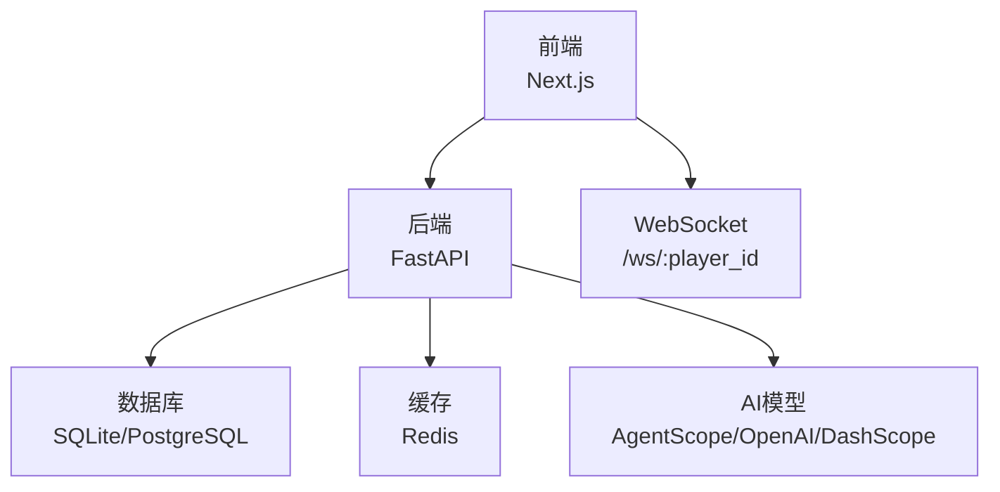
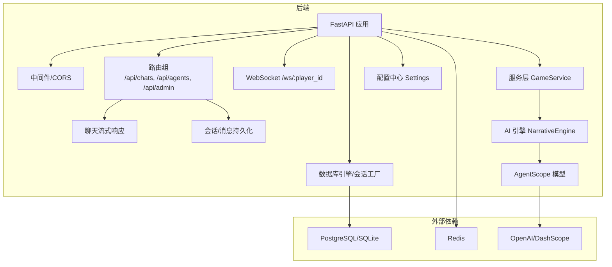
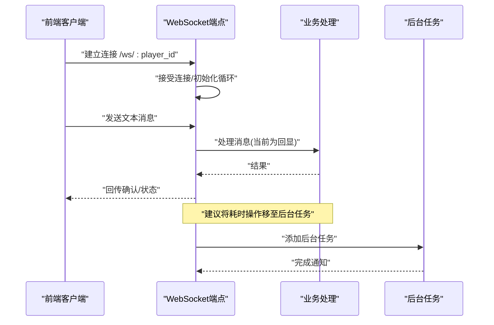
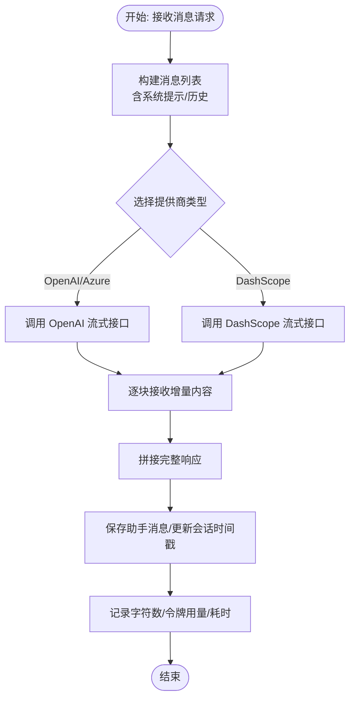
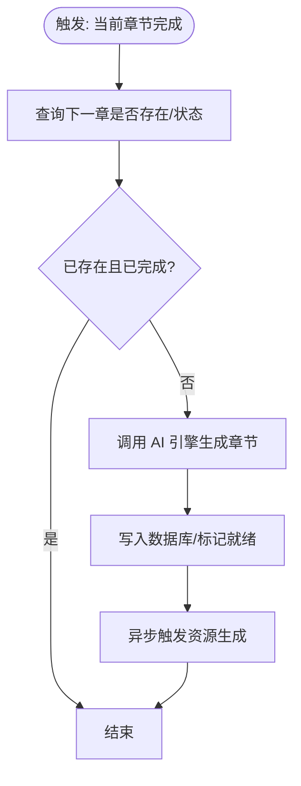
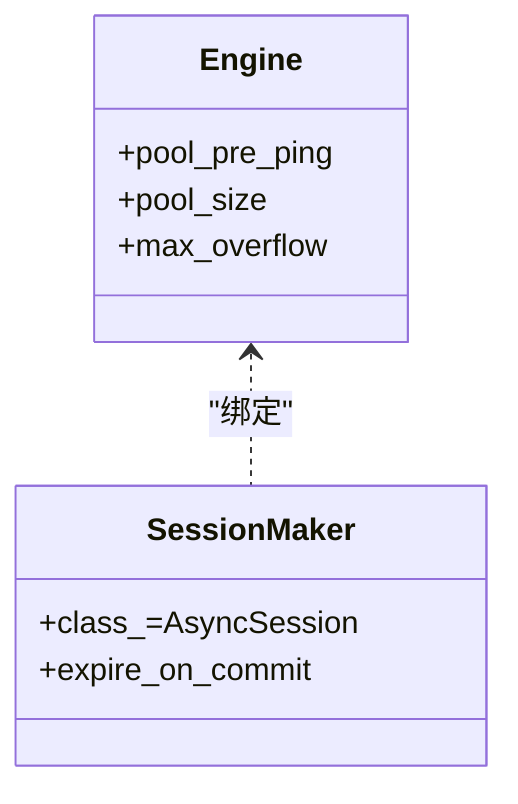
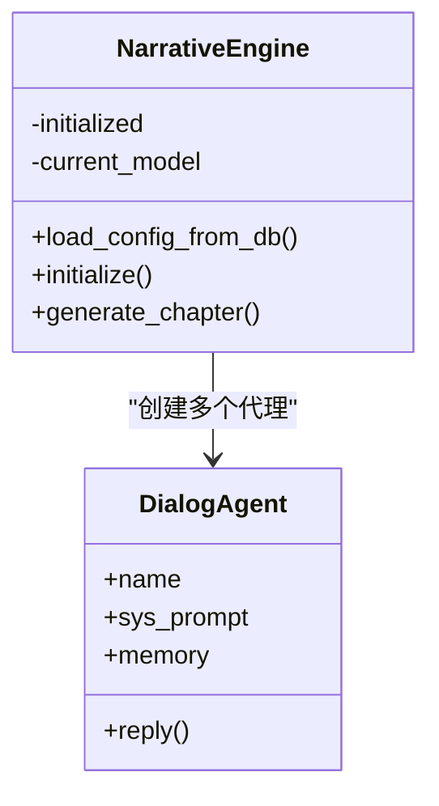
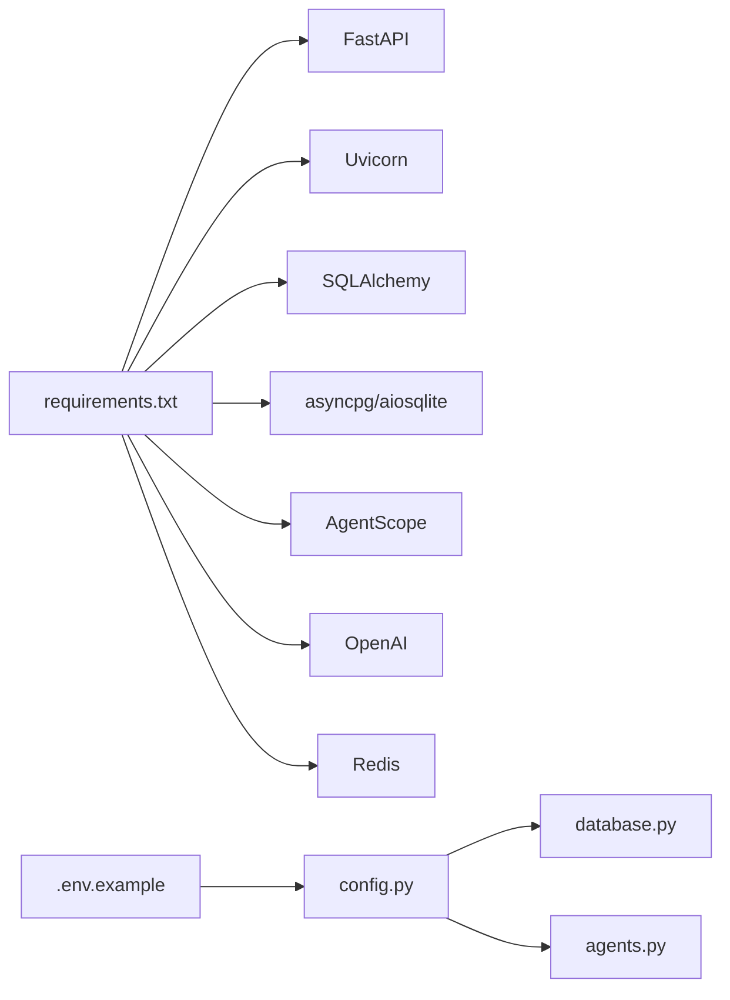

# 性能优化与监控

<cite>
**本文引用的文件**
- [backend/main.py](file://backend/main.py)
- [backend/config.py](file://backend/config.py)
- [backend/database.py](file://backend/database.py)
- [backend/services.py](file://backend/services.py)
- [backend/models.py](file://backend/models.py)
- [backend/routers/chats.py](file://backend/routers/chats.py)
- [backend/routers/agents.py](file://backend/routers/agents.py)
- [backend/routers/admin.py](file://backend/routers/admin.py)
- [backend/tasks.py](file://backend/tasks.py)
- [backend/agents.py](file://backend/agents.py)
- [backend/schemas.py](file://backend/schemas.py)
- [backend/requirements.txt](file://backend/requirements.txt)
- [backend/.env.example](file://backend/.env.example)
- [docs/wiki/Deployment.md](file://docs/wiki/Deployment.md)
- [frontend/src/hooks/useSocket.ts](file://frontend/src/hooks/useSocket.ts)
</cite>

## 目录
1. [简介](#简介)
2. [项目结构](#项目结构)
3. [核心组件](#核心组件)
4. [架构总览](#架构总览)
5. [详细组件分析](#详细组件分析)
6. [依赖关系分析](#依赖关系分析)
7. [性能考量与优化建议](#性能考量与优化建议)
8. [故障排查指南](#故障排查指南)
9. [结论](#结论)
10. [附录](#附录)

## 简介
本指导文档面向“无限叙事游戏”项目的性能优化与监控，聚焦以下关键瓶颈：CPU 使用率过高、内存泄漏风险、数据库查询缓慢、WebSocket 连接数过多。同时覆盖监控指标设定、告警阈值、性能基准测试、缓存策略、异步任务调度、连接池与负载均衡调优、APM 工具集成、性能报告解读与容量规划，并给出生产环境监控仪表板、自动化告警与应急响应流程的落地建议。

## 项目结构
系统采用前后端分离架构：前端基于 Next.js，后端基于 FastAPI + SQLAlchemy 异步 ORM；AI 生成由 AgentScope 驱动；数据库支持 SQLite 与 PostgreSQL；通过 Redis 提供缓存能力；聊天接口支持流式输出；WebSocket 用于实时交互。

图表来源
- [backend/main.py](file://backend/main.py#L128-L173)
- [frontend/src/hooks/useSocket.ts](file://frontend/src/hooks/useSocket.ts#L1-L43)
- [backend/config.py](file://backend/config.py#L15-L19)
- [backend/database.py](file://backend/database.py#L8-L17)

章节来源
- [backend/main.py](file://backend/main.py#L1-L173)
- [docs/wiki/Deployment.md](file://docs/wiki/Deployment.md#L1-L65)

## 核心组件
- 应用入口与生命周期：FastAPI 应用、CORS 中间件、数据库迁移与连接池初始化、WebSocket 端点。
- 数据层：异步引擎、会话工厂、模型定义与索引设计。
- 业务服务：玩家与故事章节的创建、世界初始化、章节预生成与资源生成。
- 路由与流式响应：聊天会话、消息流式输出、令牌用量统计。
- AI 引擎：NarrativeEngine 基于 AgentScope 的多代理协作与模型初始化。
- 异步任务：章节预生成与资源生成的后台处理。
- 前端 WebSocket 客户端钩子。

章节来源
- [backend/main.py](file://backend/main.py#L30-L173)
- [backend/database.py](file://backend/database.py#L1-L31)
- [backend/models.py](file://backend/models.py#L1-L122)
- [backend/services.py](file://backend/services.py#L1-L66)
- [backend/routers/chats.py](file://backend/routers/chats.py#L1-L275)
- [backend/agents.py](file://backend/agents.py#L1-L196)
- [backend/tasks.py](file://backend/tasks.py#L1-L62)
- [frontend/src/hooks/useSocket.ts](file://frontend/src/hooks/useSocket.ts#L1-L43)

## 架构总览
后端以 FastAPI 为核心，通过异步数据库连接池与流式响应提升吞吐；AI 生成链路通过 AgentScope 抽象不同 LLM 提供商；WebSocket 为实时交互提供通道；Redis 作为可扩展的缓存层；管理员路由提供基础统计与数据清理。

图表来源
- [backend/main.py](file://backend/main.py#L83-L173)
- [backend/routers/chats.py](file://backend/routers/chats.py#L16-L258)
- [backend/agents.py](file://backend/agents.py#L43-L196)
- [backend/database.py](file://backend/database.py#L8-L23)
- [backend/config.py](file://backend/config.py#L7-L34)

## 详细组件分析

### WebSocket 实时交互与连接数控制
- 当前实现：单连接循环接收文本消息并回显，未做心跳、断线重连与并发连接上限控制。
- 性能风险：大量客户端同时连接可能导致 CPU 与内存压力上升；无背压与超时保护易引发资源泄露。
- 优化要点：
  - 心跳与空闲超时：定期发送 ping/pong，超时关闭。
  - 连接配额：按用户或租户限制最大连接数。
  - 消息队列：将长耗时处理放入后台任务，避免阻塞主循环。
  - 日志与指标：记录连接数、消息速率、错误率。

图表来源
- [backend/main.py](file://backend/main.py#L157-L169)
- [frontend/src/hooks/useSocket.ts](file://frontend/src/hooks/useSocket.ts#L11-L32)

章节来源
- [backend/main.py](file://backend/main.py#L157-L169)
- [frontend/src/hooks/useSocket.ts](file://frontend/src/hooks/useSocket.ts#L1-L43)

### 流式聊天与令牌统计
- 实现：根据提供商类型选择 OpenAI 或 DashScope，开启流式输出并聚合增量内容；记录输入/输出字符数与令牌用量。
- 性能影响：长历史消息与高上下文窗口会显著增加计算与网络开销；未做分页/截断策略易导致延迟与成本上升。
- 优化要点：
  - 上下文截断：按窗口大小与令牌预算进行滚动截断。
  - 流式合并：减少小块传输次数，提升吞吐。
  - 错误恢复：异常时记录并回退到非流式路径。
  - 指标采集：输入/输出字符、令牌用量、首字节时间、总耗时。

图表来源
- [backend/routers/chats.py](file://backend/routers/chats.py#L113-L258)

章节来源
- [backend/routers/chats.py](file://backend/routers/chats.py#L1-L275)

### 异步任务与预生成
- 章节预生成：检查下一章是否存在与状态，若不存在则调用 AI 引擎生成并入库，随后触发资源生成。
- 资源生成：内容分析与图片生成的异步化，避免阻塞主线程。
- 优化要点：
  - 任务队列：引入消息队列（如 Celery/RQ）解耦生成与请求。
  - 幂等性：基于章节号与状态判断，避免重复生成。
  - 超时与重试：为外部 API 调用设置合理超时与指数退避。

图表来源
- [backend/tasks.py](file://backend/tasks.py#L7-L56)
- [backend/agents.py](file://backend/agents.py#L154-L191)

章节来源
- [backend/tasks.py](file://backend/tasks.py#L1-L62)
- [backend/agents.py](file://backend/agents.py#L1-L196)

### 数据库连接池与查询优化
- 连接池参数：池大小、溢出连接、pre_ping、线程安全（SQLite 特殊参数）。
- 查询模式：聊天路由中多次查询会话与消息，建议：
  - 为会话 ID 与创建时间建立索引（已有）。
  - 分页与限制返回数量，避免全表扫描。
  - 对历史消息按时间排序并限制长度。
- 优化要点：
  - 连接池上限与超时：结合并发与硬件资源设定。
  - 读写分离：对只读报表类查询走只读副本。
  - SQL 日志：生产关闭，开发开启以便定位慢查询。

图表来源
- [backend/database.py](file://backend/database.py#L8-L23)

章节来源
- [backend/database.py](file://backend/database.py#L1-L31)
- [backend/routers/chats.py](file://backend/routers/chats.py#L64-L70)

### AI 引擎与模型初始化
- 初始化：从数据库加载活动提供商，解析模型列表，按提供商类型初始化模型。
- 性能影响：模型切换与初始化成本较高，应避免频繁重建。
- 优化要点：
  - 懒加载与热切换：仅在配置变更时重建。
  - 多代理复用同一模型实例。
  - 配置热更新：通过后台任务或事件触发 reload。

图表来源
- [backend/agents.py](file://backend/agents.py#L43-L196)

章节来源
- [backend/agents.py](file://backend/agents.py#L1-L196)

### 管理与统计接口
- 统计：玩家、故事、资产、提供商数量。
- 列表与删除：分页列出玩家与故事，删除玩家时需注意关联清理。
- 优化要点：
  - 统计接口可加缓存与定时刷新。
  - 删除操作建议使用事务与级联约束，避免悬挂数据。

章节来源
- [backend/routers/admin.py](file://backend/routers/admin.py#L16-L112)

## 依赖关系分析
- 运行时依赖：FastAPI、Uvicorn、SQLAlchemy 异步、asyncpg/aiosqlite、AgentScope、OpenAI、Redis、Alembic。
- 环境变量：数据库 URL、Redis URL、AI API Key。
- 部署要求：PostgreSQL/Redis/Node.js/Python 环境。

图表来源
- [backend/requirements.txt](file://backend/requirements.txt#L1-L20)
- [backend/.env.example](file://backend/.env.example#L1-L4)
- [backend/config.py](file://backend/config.py#L7-L34)
- [backend/database.py](file://backend/database.py#L1-L31)
- [backend/agents.py](file://backend/agents.py#L1-L10)

章节来源
- [backend/requirements.txt](file://backend/requirements.txt#L1-L20)
- [backend/.env.example](file://backend/.env.example#L1-L4)
- [backend/config.py](file://backend/config.py#L1-L34)

## 性能考量与优化建议

### CPU 使用率过高
- 瓶颈定位
  - AI 生成链路：对话代理与模型调用的同步等待与内存复制。
  - 流式响应：消息拼接与日志输出频率。
  - WebSocket 循环：未做背压与心跳，导致事件循环阻塞。
- 优化策略
  - 异步化：确保所有外部调用均为异步，避免阻塞事件循环。
  - 批量与合并：减少小块消息传输次数，合并增量输出。
  - 资源隔离：将长耗时任务放入后台队列，WebSocket 仅负责转发。
  - 上下文截断：严格限制历史消息长度与令牌预算。
  - 日志降级：生产关闭 SQL/Uvicorn 访问日志，降低 CPU 开销。

章节来源
- [backend/routers/chats.py](file://backend/routers/chats.py#L113-L258)
- [backend/main.py](file://backend/main.py#L14-L28)

### 内存泄漏
- 风险点
  - WebSocket 连接未释放、消息累积。
  - 代理记忆数组增长过快。
  - 大对象未及时释放（如历史消息列表）。
- 防范措施
  - 心跳与超时：主动关闭长时间空闲连接。
  - 记忆上限：限制代理 memory 长度，定期清理。
  - 分页与去重：聊天历史按时间与长度分页，避免重复加载。
  - GC 与监控：启用内存指标，观察堆增长趋势。

章节来源
- [backend/agents.py](file://backend/agents.py#L11-L42)
- [frontend/src/hooks/useSocket.ts](file://frontend/src/hooks/useSocket.ts#L1-L43)

### 数据库查询缓慢
- 瓶颈定位
  - 未使用索引的过滤字段（如按会话 ID 查询消息）。
  - 未限制返回数量与分页。
  - 多次往返数据库导致延迟。
- 优化策略
  - 索引优化：为会话 ID、创建时间、章节号等常用过滤字段建立索引（模型中已具备）。
  - 分页与限额：统一使用 offset/limit，限制每页最大条数。
  - 读写分离：报表统计类查询走只读副本。
  - SQL 日志：开发阶段开启，生产关闭。

章节来源
- [backend/models.py](file://backend/models.py#L24-L44)
- [backend/routers/chats.py](file://backend/routers/chats.py#L64-L70)

### WebSocket 连接数过多
- 瓶颈定位
  - 未做连接配额与心跳检测。
  - 主循环阻塞导致无法及时处理新连接。
- 优化策略
  - 连接配额：按用户/租户限制最大连接数。
  - 心跳与断线重连：定期 ping/pong，超时关闭。
  - 负载均衡：多实例部署，配合反向代理分发。
  - 背压与限速：对高频消息进行速率限制。

章节来源
- [backend/main.py](file://backend/main.py#L157-L169)
- [frontend/src/hooks/useSocket.ts](file://frontend/src/hooks/useSocket.ts#L1-L43)

### 监控指标与告警阈值
- 指标建议
  - 后端：请求 QPS、P95/P99 延迟、错误率、连接数、队列长度、内存/CPU 使用率。
  - 数据库：连接池活跃数、等待时间、慢查询数、锁等待。
  - AI 服务：调用成功率、平均/尾延迟、令牌用量、费用估算。
  - WebSocket：连接数、消息速率、丢包率、重连次数。
- 告警阈值
  - QPS 突增/突降、延迟 P95 超过 2s、错误率 > 1%、连接池耗尽、慢查询占比 > 5%、AI 调用失败率 > 3%。
- 基准测试
  - 使用 wrk/JMeter 对关键接口（/api/chats/...）进行并发压测，记录延迟分布与资源占用。

章节来源
- [backend/routers/chats.py](file://backend/routers/chats.py#L133-L234)

### 缓存策略优化
- 场景
  - 常用配置与提供商信息：Redis 缓存，带过期时间。
  - 历史消息与会话元数据：短期缓存，热点数据驻留。
  - 图片/音频等资产：CDN 缓存 + 本地缓存，按访问频率淘汰。
- 策略
  - 读多写少场景使用缓存穿透防护与互斥锁。
  - 写后失效：更新后主动失效相关键。

章节来源
- [backend/config.py](file://backend/config.py#L18-L19)
- [backend/agents.py](file://backend/agents.py#L49-L75)

### 异步任务调度
- 背景任务
  - 章节预生成、资源生成、统计刷新。
- 调度建议
  - 使用队列（Celery/RQ）+ 限速 + 重试策略。
  - 任务幂等：基于唯一键去重。
  - 监控：队列长度、失败任务、重试次数。

章节来源
- [backend/tasks.py](file://backend/tasks.py#L1-L62)

### 连接池与负载均衡
- 连接池
  - 根据并发与硬件设定 pool_size/max_overflow，启用 pool_pre_ping。
- 负载均衡
  - 多实例部署 + 反向代理（Nginx/Traefik），健康检查与自动摘除。
  - 会话粘性：WebSocket 连接与长轮询场景考虑粘性策略。

章节来源
- [backend/database.py](file://backend/database.py#L8-L17)
- [backend/main.py](file://backend/main.py#L85-L91)

### APM 工具集成与报告解读
- 工具建议
  - 后端：OpenTelemetry + Jaeger/Tempo + Grafana。
  - 前端：浏览器性能面板 + APM SDK。
- 报告关注点
  - 端到端时延分解、数据库与外部服务耗时占比、错误根因定位。
- 容量规划
  - 基于峰值 QPS、P99 延迟与资源利用率推导节点数与实例规格。

章节来源
- [backend/routers/chats.py](file://backend/routers/chats.py#L133-L234)

## 故障排查指南
- WebSocket 连接断开
  - 检查后端日志与连接循环异常；确认前端重连逻辑。
- 聊天响应缓慢
  - 查看历史消息长度、上下文窗口、提供商延迟与令牌用量。
- 数据库连接失败
  - 检查 DATABASE_URL、网络连通性、PostgreSQL 服务状态。
- AI 调用失败
  - 核对 API Key、提供商类型、模型名称与限额。

章节来源
- [docs/wiki/Deployment.md](file://docs/wiki/Deployment.md#L60-L65)
- [backend/main.py](file://backend/main.py#L14-L28)

## 结论
通过连接池与流式响应优化、AI 生成链路异步化、WebSocket 心跳与配额控制、缓存与任务队列策略，以及完善的监控与告警体系，可有效缓解 CPU 占用、内存泄漏、数据库慢查询与连接数膨胀等性能瓶颈。建议以基准测试驱动容量规划，以 APM 报告持续迭代优化。

## 附录

### 生产环境监控仪表板建议
- 后端：请求 QPS、P95/P99 延迟、错误率、连接数、队列长度、内存/CPU。
- 数据库：连接池使用率、慢查询、锁等待、缓冲池命中率。
- AI 服务：调用成功率、平均/尾延迟、令牌用量、费用。
- WebSocket：连接数、消息速率、重连次数、丢包率。

### 自动化告警与应急响应
- 告警规则
  - 延迟与错误率阈值、连接池耗尽、慢查询占比、队列积压。
- 应急流程
  - 快速降级（限流/熔断）、扩容/扩缩容、回滚与修复、事后复盘。

### 容量规划建议
- 基于峰值 QPS 与 P99 延迟，结合 CPU/内存/IO 饱和度，确定节点数量与实例规格；预留 30%-50% 安全余量。