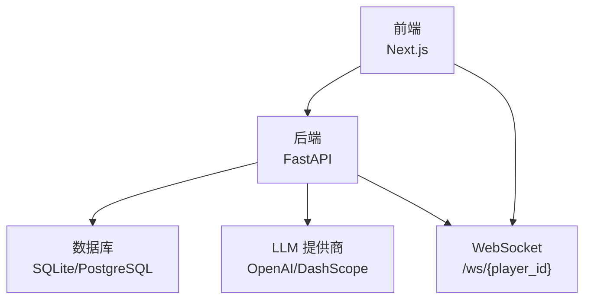
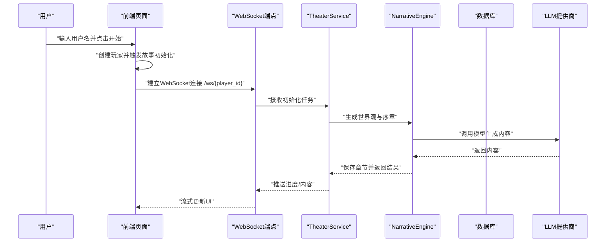
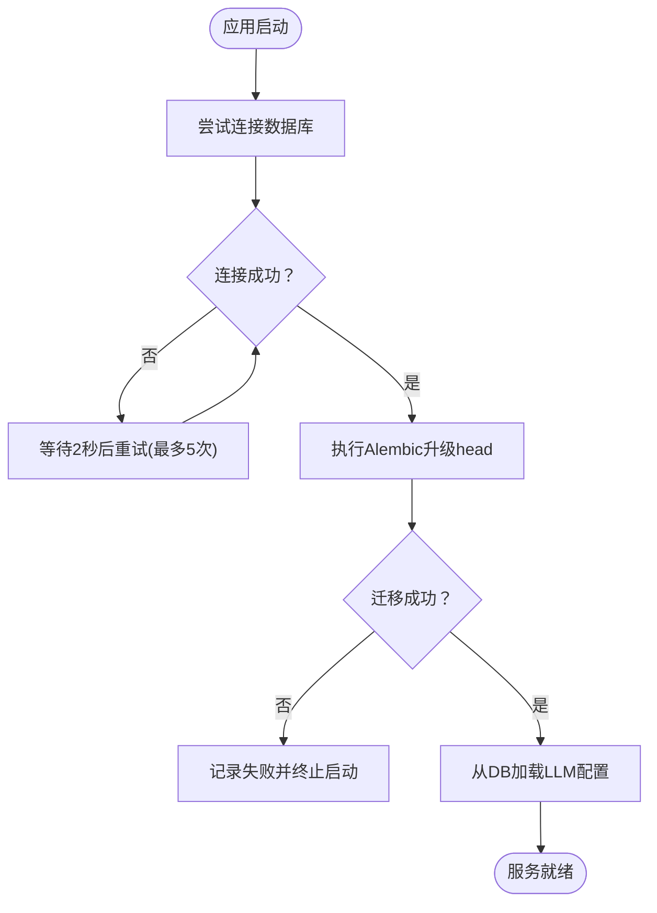
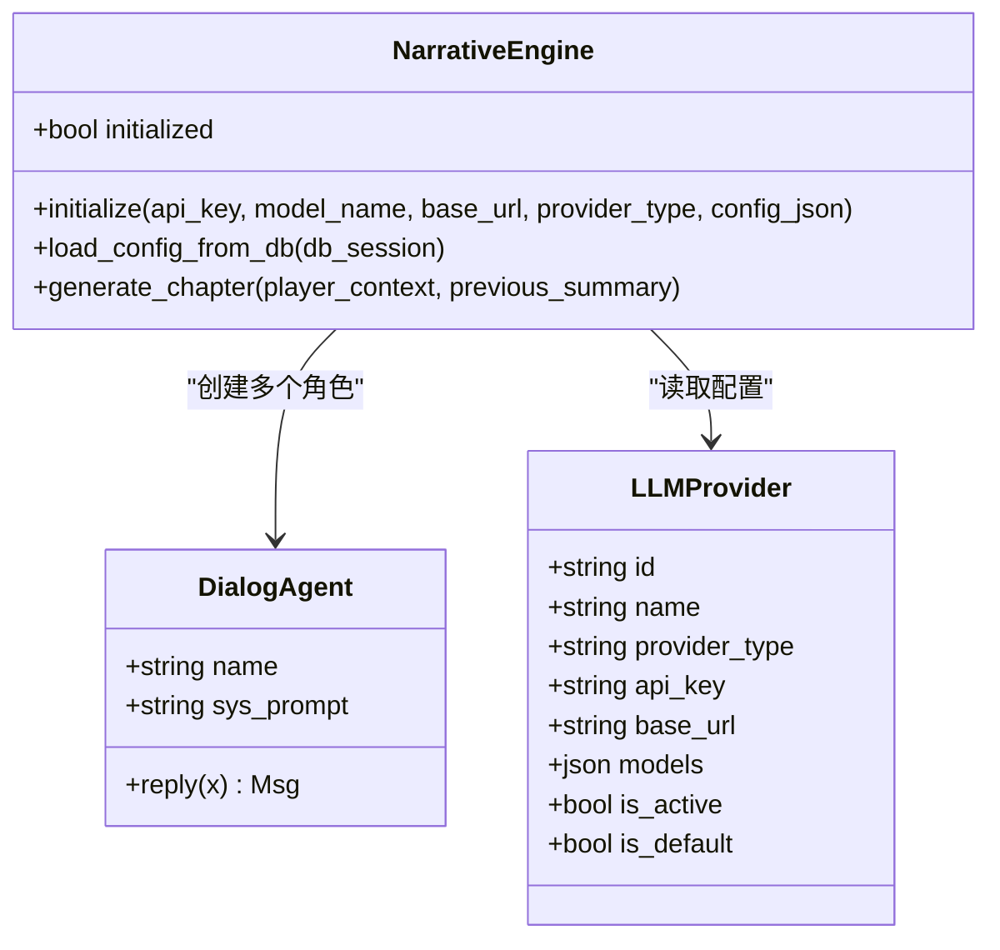
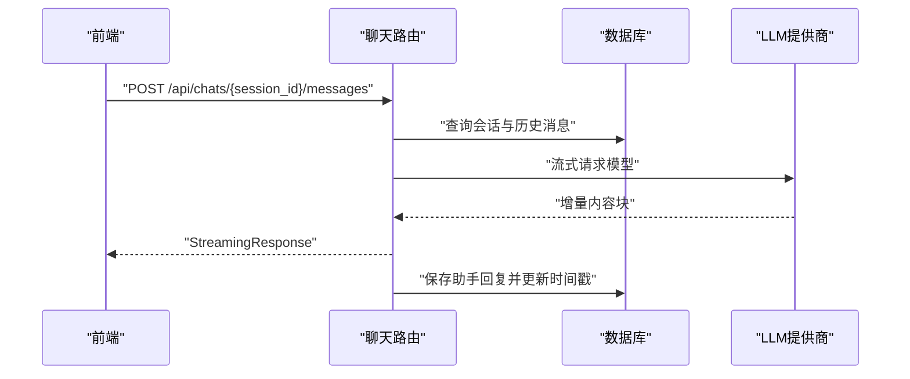
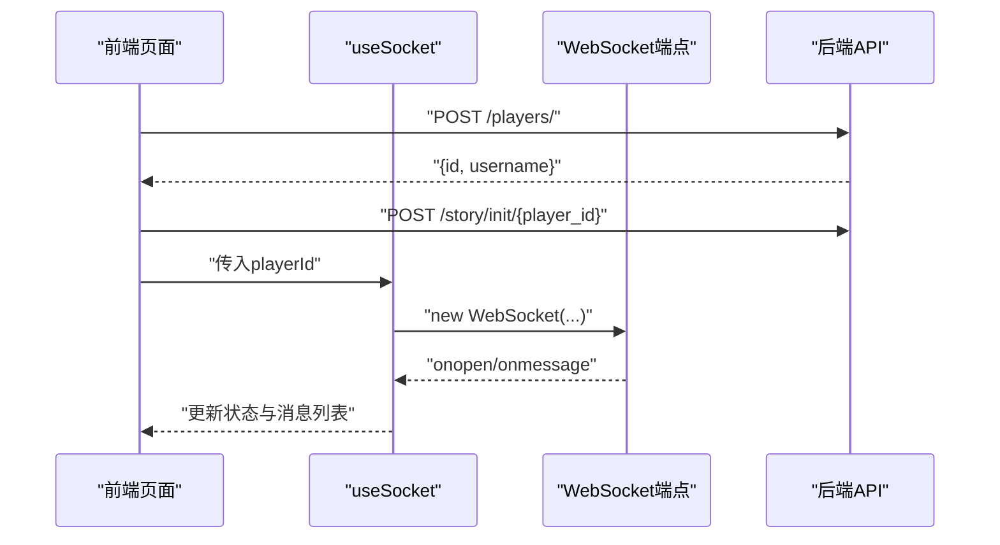
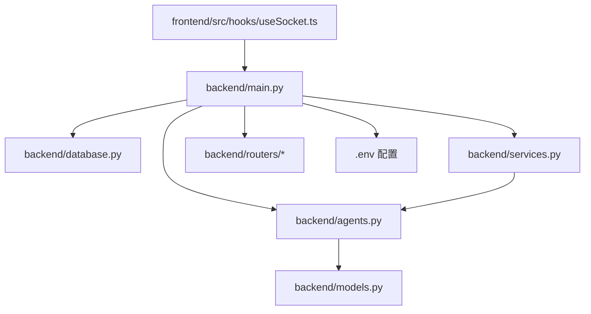

# 故障排除

<cite>
**本文引用的文件**
- [backend/main.py](file://backend/main.py)
- [backend/config.py](file://backend/config.py)
- [backend/database.py](file://backend/database.py)
- [backend/services.py](file://backend/services.py)
- [backend/models.py](file://backend/models.py)
- [backend/routers/agents.py](file://backend/routers/agents.py)
- [backend/routers/chats.py](file://backend/routers/chats.py)
- [backend/agents.py](file://backend/agents.py)
- [backend/tasks.py](file://backend/tasks.py)
- [backend/.env.example](file://backend/.env.example)
- [backend/requirements.txt](file://backend/requirements.txt)
- [frontend/src/hooks/useSocket.ts](file://frontend/src/hooks/useSocket.ts)
- [frontend/src/app/page.tsx](file://frontend/src/app/page.tsx)
- [docs/wiki/Deployment.md](file://docs/wiki/Deployment.md)
</cite>

## 目录
1. [简介](#简介)
2. [项目结构](#项目结构)
3. [核心组件](#核心组件)
4. [架构总览](#架构总览)
5. [详细组件分析](#详细组件分析)
6. [依赖关系分析](#依赖关系分析)
7. [性能考虑](#性能考虑)
8. [故障排除指南](#故障排除指南)
9. [结论](#结论)
10. [附录](#附录)

## 简介
本指南面向系统管理员与开发者，聚焦于“无限叙事剧场”项目的故障排除与运维。内容覆盖网络连接、数据库连接、WebSocket 断开、智能体运行异常、API 调用错误、前端渲染问题、系统监控与告警、备份恢复与回滚、跨平台兼容与依赖冲突等。文档以实际源码为依据，提供症状、原因分析、定位步骤与修复建议，并辅以可视化图示帮助快速定位问题。

## 项目结构
系统采用前后端分离架构：后端基于 FastAPI + SQLAlchemy 异步 ORM，提供 REST 与 WebSocket；前端基于 Next.js，通过 React Hooks 管理 WebSocket 连接与状态；智能体引擎基于 AgentScope，支持多 LLM 提供商；数据库默认使用 SQLite（便于本地开发），亦支持 PostgreSQL；Redis 用于缓存（当前未在代码中直接使用）。

**图表来源**
- [backend/main.py](file://backend/main.py#L128-L173)
- [frontend/src/hooks/useSocket.ts](file://frontend/src/hooks/useSocket.ts#L1-L43)

**章节来源**
- [backend/main.py](file://backend/main.py#L1-L173)
- [backend/config.py](file://backend/config.py#L1-L34)
- [backend/database.py](file://backend/database.py#L1-L31)
- [backend/agents.py](file://backend/agents.py#L1-L196)
- [frontend/src/hooks/useSocket.ts](file://frontend/src/hooks/useSocket.ts#L1-L43)

## 核心组件
- 应用入口与生命周期：后端主程序负责日志配置、CORS、路由注册、数据库迁移与启动时 LLM 配置加载。
- 数据层：异步引擎、连接池、会话工厂与模型定义。
- 业务服务：玩家创建、世界初始化、故事章节生成与持久化。
- 智能体引擎：从数据库动态加载活跃 LLM 提供商，按提供商类型初始化模型，创建导演、叙述者、NPC 管理员等角色。
- 路由器：代理管理、聊天会话与消息流式输出。
- 前端钩子：WebSocket 连接、消息收发与状态展示。

**章节来源**
- [backend/main.py](file://backend/main.py#L45-L82)
- [backend/database.py](file://backend/database.py#L1-L31)
- [backend/services.py](file://backend/services.py#L1-L66)
- [backend/agents.py](file://backend/agents.py#L43-L196)
- [backend/routers/agents.py](file://backend/routers/agents.py#L1-L141)
- [backend/routers/chats.py](file://backend/routers/chats.py#L1-L275)
- [frontend/src/hooks/useSocket.ts](file://frontend/src/hooks/useSocket.ts#L1-L43)

## 架构总览
下图展示了从用户交互到后端处理、数据库与 LLM 提供商的整体流程。

**图表来源**
- [backend/main.py](file://backend/main.py#L147-L156)
- [backend/services.py](file://backend/services.py#L19-L59)
- [backend/agents.py](file://backend/agents.py#L154-L191)
- [backend/routers/chats.py](file://backend/routers/chats.py#L112-L258)

## 详细组件分析

### 数据库连接与迁移
- 连接策略：异步引擎、连接池预检测、SQLite/PostgreSQL 兼容参数。
- 生命周期迁移：应用启动时通过子进程执行 Alembic 升级，失败重试最多五次。
- 会话管理：异步会话工厂，避免线程绑定问题。

**图表来源**
- [backend/main.py](file://backend/main.py#L45-L82)
- [backend/database.py](file://backend/database.py#L8-L23)

**章节来源**
- [backend/main.py](file://backend/main.py#L45-L82)
- [backend/database.py](file://backend/database.py#L1-L31)

### 智能体引擎与LLM配置
- 动态加载：启动时或按需从数据库读取活跃 LLM 提供商，解析模型列表，初始化 AgentScope 模型。
- 角色分工：导演负责大纲、叙述者生成正文、NPC 管理员维护关系。
- 容错：若无可用提供商，记录警告并回退至设置项（如存在）。

**图表来源**
- [backend/agents.py](file://backend/agents.py#L43-L196)
- [backend/models.py](file://backend/models.py#L58-L78)

**章节来源**
- [backend/agents.py](file://backend/agents.py#L43-L196)
- [backend/models.py](file://backend/models.py#L58-L78)

### 聊天流式响应与令牌统计
- 流式输出：根据提供商类型选择 OpenAI 或 DashScope，逐块返回增量内容。
- 令牌统计：优先使用提供商返回的 usage 信息，其次计算字符数。
- 异常处理：捕获异常并记录日志，同时向前端返回错误提示。

**图表来源**
- [backend/routers/chats.py](file://backend/routers/chats.py#L72-L258)

**章节来源**
- [backend/routers/chats.py](file://backend/routers/chats.py#L1-L275)

### WebSocket 连接与前端交互
- 连接地址：ws://localhost:8000/ws/{player_id}。
- 前端钩子：建立连接、接收消息、关闭清理、发送消息。
- 页面集成：创建玩家后触发故事初始化，随后进入实时故事流。

**图表来源**
- [frontend/src/app/page.tsx](file://frontend/src/app/page.tsx#L14-L35)
- [frontend/src/hooks/useSocket.ts](file://frontend/src/hooks/useSocket.ts#L1-L43)
- [backend/main.py](file://backend/main.py#L157-L169)

**章节来源**
- [frontend/src/app/page.tsx](file://frontend/src/app/page.tsx#L1-L85)
- [frontend/src/hooks/useSocket.ts](file://frontend/src/hooks/useSocket.ts#L1-L43)
- [backend/main.py](file://backend/main.py#L157-L169)

## 依赖关系分析
- 后端依赖：FastAPI、SQLAlchemy 异步、Uvicorn、AgentScope、OpenAI、Alembic、asyncpg/aiosqlite、Pydantic/Settings。
- 环境变量：数据库 URL、Redis URL、各提供商 API Key。
- 默认数据库：SQLite（绝对路径），生产可切换 PostgreSQL。

**图表来源**
- [backend/main.py](file://backend/main.py#L30-L43)
- [backend/database.py](file://backend/database.py#L1-L31)
- [backend/agents.py](file://backend/agents.py#L1-L196)
- [backend/routers/agents.py](file://backend/routers/agents.py#L1-L141)
- [backend/routers/chats.py](file://backend/routers/chats.py#L1-L275)
- [frontend/src/hooks/useSocket.ts](file://frontend/src/hooks/useSocket.ts#L1-L43)

**章节来源**
- [backend/requirements.txt](file://backend/requirements.txt#L1-L20)
- [backend/.env.example](file://backend/.env.example#L1-L4)
- [backend/config.py](file://backend/config.py#L1-L34)

## 性能考虑
- 连接池与预热：启用 pool_pre_ping，合理设置 pool_size 与 max_overflow，避免高并发下的连接耗尽。
- 异步 I/O：统一使用异步 ORM 与异步客户端，减少阻塞。
- 日志级别：关闭 SQLAlchemy 与 Uvicorn 访问日志噪声，仅保留应用日志，降低 I/O 压力。
- 流式输出：聊天接口采用流式响应，前端增量渲染，提升用户体验与首包速度。
- 令牌统计：优先使用提供商返回的 usage，避免重复计算，便于成本控制与限流。

**章节来源**
- [backend/database.py](file://backend/database.py#L8-L23)
- [backend/main.py](file://backend/main.py#L14-L28)
- [backend/routers/chats.py](file://backend/routers/chats.py#L112-L258)

## 故障排除指南

### 一、网络连接问题
- 症状
  - 前端无法连接 WebSocket：页面显示断开、无消息流。
  - API 请求超时或 502/504。
- 原因分析
  - 后端未监听 0.0.0.0 或端口被占用。
  - CORS 配置不匹配前端域名。
  - 防火墙或代理拦截。
- 排查步骤
  - 检查后端启动日志与监听地址。
  - 使用浏览器开发者工具 Network 面板确认 WebSocket 握手与断开原因。
  - 在后端机器上使用 telnet 或 curl 验证端口可达。
  - 对比 CORS 白名单与前端访问地址。
- 修复建议
  - 确保后端监听 0.0.0.0 并使用正确端口。
  - 更新 CORS 允许的 origins 列表。
  - 临时关闭防火墙验证，再放通必要端口。

**章节来源**
- [backend/main.py](file://backend/main.py#L85-L91)
- [frontend/src/hooks/useSocket.ts](file://frontend/src/hooks/useSocket.ts#L11-L32)

### 二、数据库连接失败
- 症状
  - 应用启动时报数据库连接错误或迁移失败。
  - 查询/写入报错：连接池耗尽、连接断开。
- 原因分析
  - DATABASE_URL 配置错误（协议、主机、端口、数据库名、凭据）。
  - PostgreSQL 未启动或权限不足。
  - SQLite 文件被占用或路径不正确。
  - 连接池过小导致高并发阻塞。
- 排查步骤
  - 校验 .env 中 DATABASE_URL 是否与实际数据库一致。
  - 手动连接数据库验证凭据与网络。
  - 查看启动日志中的重试次数与最后一次错误。
  - 检查连接池参数与并发量。
- 修复建议
  - 更正 DATABASE_URL，优先使用绝对路径的 SQLite。
  - 启动并授权 PostgreSQL，确保网络连通。
  - 调整 pool_size 与 max_overflow，开启 pool_pre_ping。
  - 如使用 SQLite，避免多进程并发写入。

**章节来源**
- [backend/config.py](file://backend/config.py#L11-L16)
- [backend/database.py](file://backend/database.py#L8-L23)
- [backend/main.py](file://backend/main.py#L45-L82)

### 三、WebSocket 断开
- 症状
  - 页面显示 Disconnected，故事流停止。
  - 控制台打印 WebSocket 错误并关闭。
- 原因分析
  - 后端未接受连接或异常抛出。
  - 前端未传入有效 player_id。
  - 网络不稳定或代理超时。
- 排查步骤
  - 确认 /ws/{player_id} 路由已注册且端口开放。
  - 在前端页面创建玩家后再建立连接。
  - 使用浏览器 Network 面板查看握手与帧。
- 修复建议
  - 确保 player_id 存在且非空。
  - 优化网络链路，缩短代理超时。
  - 前端增加重连机制与错误提示。

**章节来源**
- [backend/main.py](file://backend/main.py#L157-L169)
- [frontend/src/hooks/useSocket.ts](file://frontend/src/hooks/useSocket.ts#L8-L33)
- [frontend/src/app/page.tsx](file://frontend/src/app/page.tsx#L14-L35)

### 四、智能体运行异常
- 症状
  - 生成内容为空或报“未初始化”。
  - LLM 调用失败或无响应。
- 原因分析
  - 数据库中无活跃 LLM 提供商，且未配置环境变量回退。
  - API Key 缺失或无效。
  - 模型名称不在提供商模型列表中。
- 排查步骤
  - 检查 LLMProvider 表是否有 is_active=True 的记录。
  - 校验 .env 中 OPENAI_API_KEY 等是否填写。
  - 确认 Agent.model 与提供商 models 列表匹配。
- 修复建议
  - 在后台添加并激活一个 LLM 提供商。
  - 填写正确的 API Key 与 base_url。
  - 选择提供商支持的模型名称。

**章节来源**
- [backend/agents.py](file://backend/agents.py#L49-L75)
- [backend/routers/agents.py](file://backend/routers/agents.py#L22-L50)
- [backend/.env.example](file://backend/.env.example#L1-L4)

### 五、API 调用错误
- 症状
  - /players/ 400 错误：创建失败。
  - /api/chats/ 404/400：会话不存在或提供商不可用。
  - 流式响应中断或无令牌统计。
- 原因分析
  - 用户名重复或缺失。
  - 会话不存在或关联 Agent 已删除。
  - 提供商未激活或模型不匹配。
  - LLM 调用异常被捕获并记录日志。
- 排查步骤
  - 检查请求体与响应详情。
  - 校验会话与 Agent 关系。
  - 查看后端日志中的错误堆栈。
- 修复建议
  - 更换唯一用户名或清理重复数据。
  - 重新创建会话并选择有效 Agent。
  - 激活提供商并选择受支持模型。

**章节来源**
- [backend/main.py](file://backend/main.py#L138-L146)
- [backend/routers/agents.py](file://backend/routers/agents.py#L15-L55)
- [backend/routers/chats.py](file://backend/routers/chats.py#L22-L111)

### 六、前端渲染问题
- 症状
  - 页面空白或白屏。
  - “Connected”状态不出现。
  - 故事日志不更新。
- 原因分析
  - 前端未正确创建玩家或未触发初始化。
  - WebSocket 地址或端口错误。
  - SSR 与 WebSocket 不兼容（当前页面禁用了SSR）。
- 排查步骤
  - 确认页面已创建玩家并获得 player_id。
  - 检查浏览器控制台与网络面板。
  - 验证后端 WebSocket 路由与端口。
- 修复建议
  - 确保先创建玩家再建立连接。
  - 使用固定端口与正确路径。
  - 检查 Next.js 开发服务器日志。

**章节来源**
- [frontend/src/app/page.tsx](file://frontend/src/app/page.tsx#L14-L35)
- [frontend/src/hooks/useSocket.ts](file://frontend/src/hooks/useSocket.ts#L1-L43)

### 七、日志分析方法
- 后端日志
  - INFO 级别：应用关键流程（启动、迁移、LLM 初始化）。
  - ERROR 级别：异常与错误信息（聊天流、保存消息）。
- 分析要点
  - 启动阶段：关注数据库连接与 Alembic 升级日志。
  - 运行阶段：关注聊天流日志中的输入/输出字符数、令牌统计与异常堆栈。
- 建议
  - 生产环境将日志输出到文件并集中收集。
  - 设置日志轮转，避免磁盘占满。

**章节来源**
- [backend/main.py](file://backend/main.py#L14-L28)
- [backend/routers/chats.py](file://backend/routers/chats.py#L133-L234)

### 八、系统监控指标与告警阈值
- 指标建议
  - 数据库：连接池使用率、平均连接时间、慢查询数。
  - API：请求延迟 P95/P99、错误率、流式响应耗时。
  - LLM：平均响应时间、令牌使用量、错误率。
  - WebSocket：连接数、消息吞吐、断开率。
- 告警阈值示例
  - 数据库连接池使用率 > 80% 持续 5 分钟。
  - API 错误率 > 5% 或 P95 > 2 秒。
  - LLM 5xx 错误率 > 1%。
  - WebSocket 断开率 > 2%。
- 收集方式
  - 结合日志与指标库（如 Prometheus/Grafana）采集。

[本节为通用指导，无需特定文件引用]

### 九、应急响应流程
- 快速止损
  - 停止新流量进入，隔离故障模块（如禁用相关路由或降级）。
  - 回滚最近变更（数据库迁移、配置变更、依赖升级）。
- 诊断与修复
  - 依据日志定位根因，修复配置或依赖。
  - 验证数据库与 LLM 提供商连通性。
- 恢复验证
  - 回归测试关键路径（创建玩家、初始化故事、WebSocket、聊天流）。
  - 观察监控指标回归正常。

[本节为通用指导，无需特定文件引用]

### 十、备份恢复与系统回滚
- 备份策略
  - 数据库：定期导出（PostgreSQL 使用逻辑备份，SQLite 复制文件）。
  - 配置：.env 与 Alembic 版本号纳入版本控制。
- 恢复步骤
  - 停机 -> 恢复数据库 -> 运行 Alembic down 再 up -> 启动服务。
- 回滚步骤
  - 使用 Alembic 回退到上一个版本，确保数据一致性。
  - 如需回滚依赖，使用 requirements.txt 的锁定版本进行 pip install --force-reinstall。

**章节来源**
- [backend/main.py](file://backend/main.py#L61-L64)
- [docs/wiki/Deployment.md](file://docs/wiki/Deployment.md#L1-L65)

### 十一、跨平台兼容性与依赖冲突
- 跨平台
  - Windows：事件循环策略与 UTF-8 输出已适配。
  - Linux/macOS：注意文件路径分隔符与权限。
- 依赖冲突
  - 使用虚拟环境隔离依赖。
  - 锁定关键依赖版本（如 FastAPI、SQLAlchemy、AgentScope）。
  - 避免在同一环境中安装不同版本的相同包。
- 环境配置错误
  - DATABASE_URL、REDIS_URL、API Key 必须在 .env 中正确配置。
  - 确保数据库与 Redis 服务已启动并可访问。

**章节来源**
- [backend/main.py](file://backend/main.py#L7-L11)
- [backend/.env.example](file://backend/.env.example#L1-L4)
- [backend/requirements.txt](file://backend/requirements.txt#L1-L20)
- [docs/wiki/Deployment.md](file://docs/wiki/Deployment.md#L23-L49)

## 结论
本指南基于实际代码与配置，提供了从网络、数据库、WebSocket 到智能体与前端的全链路故障排除方法。建议在生产环境中结合日志与监控体系，建立完善的告警与回滚机制，确保系统稳定运行。

## 附录
- 常用命令参考
  - 启动后端：uvicorn 运行 main:app。
  - 启动前端：Next.js 开发服务器。
  - 数据库迁移：Alembic 升级到最新版本。
- 参考文档
  - 部署与环境配置指南。

**章节来源**
- [backend/main.py](file://backend/main.py#L171-L173)
- [docs/wiki/Deployment.md](file://docs/wiki/Deployment.md#L1-L65)