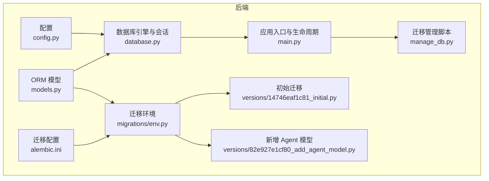
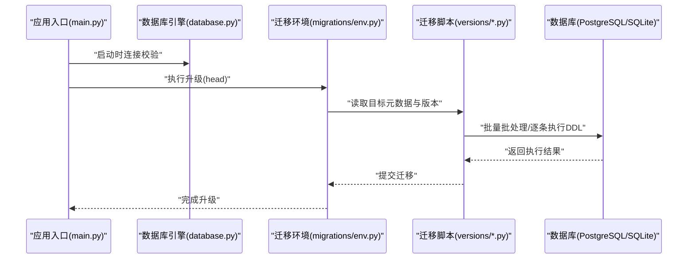
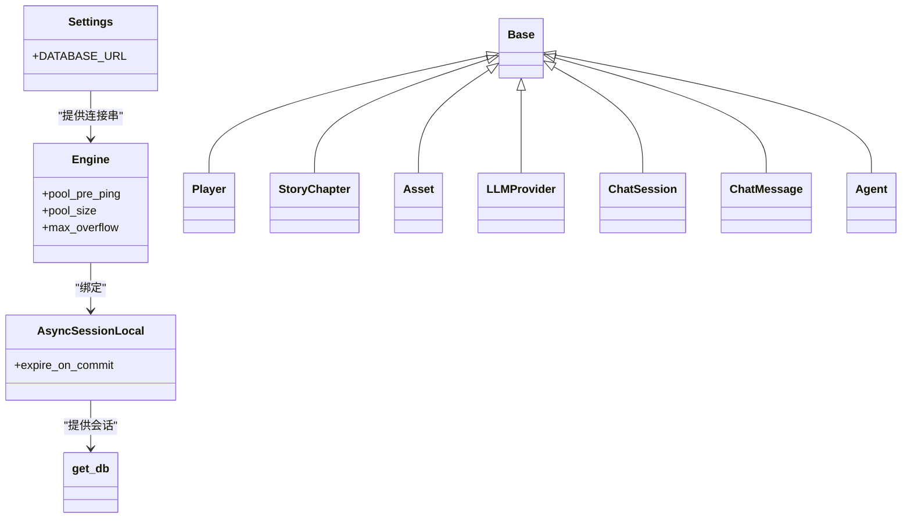
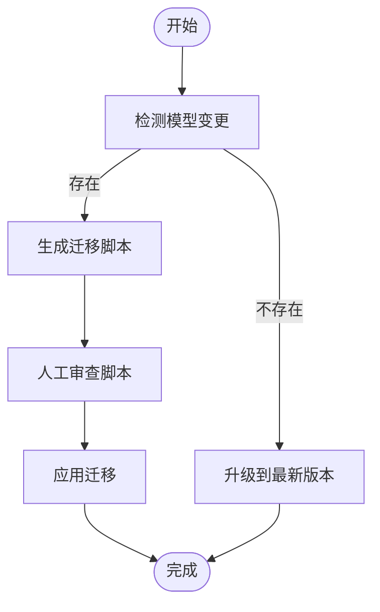
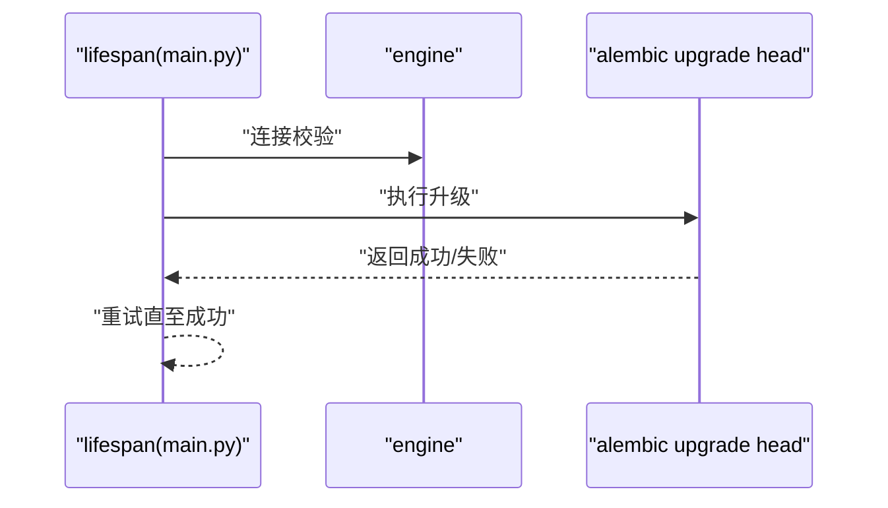
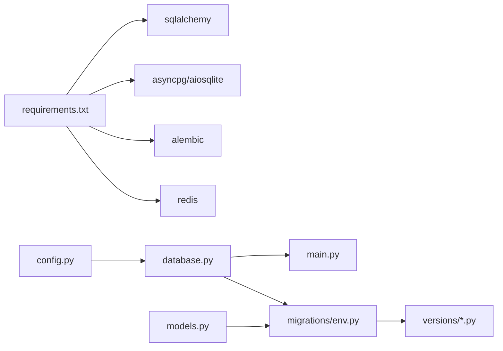

# 数据库问题

<cite>
**本文引用的文件**
- [backend/database.py](file://backend/database.py)
- [backend/config.py](file://backend/config.py)
- [backend/main.py](file://backend/main.py)
- [backend/manage_db.py](file://backend/manage_db.py)
- [backend/alembic.ini](file://backend/alembic.ini)
- [backend/migrations/env.py](file://backend/migrations/env.py)
- [backend/migrations/versions/14746eaf1c81_initial.py](file://backend/migrations/versions/14746eaf1c81_initial.py)
- [backend/migrations/versions/82e927e1cf80_add_agent_model.py](file://backend/migrations/versions/82e927e1cf80_add_agent_model.py)
- [backend/models.py](file://backend/models.py)
- [backend/services.py](file://backend/services.py)
- [backend/requirements.txt](file://backend/requirements.txt)
- [backend/.env.example](file://backend/.env.example)
- [docs/wiki/Database-Migration.md](file://docs/wiki/Database-Migration.md)
- [docs/wiki/Backend-Guide.md](file://docs/wiki/Backend-Guide.md)
</cite>

## 目录
1. [简介](#简介)
2. [项目结构](#项目结构)
3. [核心组件](#核心组件)
4. [架构总览](#架构总览)
5. [详细组件分析](#详细组件分析)
6. [依赖分析](#依赖分析)
7. [性能考虑](#性能考虑)
8. [故障排除指南](#故障排除指南)
9. [结论](#结论)
10. [附录](#附录)

## 简介
本指南聚焦于数据库问题的系统化故障排除，覆盖 PostgreSQL 连接失败、数据库迁移错误、表结构不一致、数据完整性问题；解释 Alembic 迁移脚本执行失败、版本冲突、回滚异常的原因与修复步骤；并提供数据库性能问题、锁等待超时、连接池耗尽、内存溢出的排查方法，以及 SQL 查询优化、索引重建、数据备份恢复、事务管理的最佳实践，最后给出数据库监控指标、慢查询分析与容量规划建议。

## 项目结构
该项目基于 FastAPI + SQLAlchemy Async + Alembic 的异步数据库架构。核心文件与职责如下：
- 配置与连接：config.py 定义 DATABASE_URL；database.py 构建异步引擎与会话工厂；main.py 在启动时进行连接校验与迁移。
- 模型与迁移：models.py 定义 ORM 模型；migrations/versions 下存放迁移脚本；migrations/env.py 与 alembic.ini 配置迁移环境。
- 运维脚本：manage_db.py 封装 migrate/upgrade/downgrade 命令，便于本地开发与 CI 使用。
- 依赖：requirements.txt 明确异步数据库驱动与 Alembic 版本要求。

图表来源
- [backend/config.py](file://backend/config.py#L1-L34)
- [backend/database.py](file://backend/database.py#L1-L31)
- [backend/main.py](file://backend/main.py#L1-L173)
- [backend/models.py](file://backend/models.py#L1-L122)
- [backend/alembic.ini](file://backend/alembic.ini#L1-L115)
- [backend/migrations/env.py](file://backend/migrations/env.py#L1-L105)
- [backend/migrations/versions/14746eaf1c81_initial.py](file://backend/migrations/versions/14746eaf1c81_initial.py#L1-L43)
- [backend/migrations/versions/82e927e1cf80_add_agent_model.py](file://backend/migrations/versions/82e927e1cf80_add_agent_model.py#L1-L54)
- [backend/manage_db.py](file://backend/manage_db.py#L1-L67)

章节来源
- [backend/config.py](file://backend/config.py#L1-L34)
- [backend/database.py](file://backend/database.py#L1-L31)
- [backend/main.py](file://backend/main.py#L1-L173)
- [backend/models.py](file://backend/models.py#L1-L122)
- [backend/alembic.ini](file://backend/alembic.ini#L1-L115)
- [backend/migrations/env.py](file://backend/migrations/env.py#L1-L105)
- [backend/migrations/versions/14746eaf1c81_initial.py](file://backend/migrations/versions/14746eaf1c81_initial.py#L1-L43)
- [backend/migrations/versions/82e927e1cf80_add_agent_model.py](file://backend/migrations/versions/82e927e1cf80_add_agent_model.py#L1-L54)
- [backend/manage_db.py](file://backend/manage_db.py#L1-L67)
- [docs/wiki/Database-Migration.md](file://docs/wiki/Database-Migration.md#L1-L85)
- [docs/wiki/Backend-Guide.md](file://docs/wiki/Backend-Guide.md#L1-L108)

## 核心组件
- 异步数据库引擎与会话
  - 使用异步引擎与异步会话工厂，启用 pool_pre_ping、设置连接池大小与溢出连接数，并针对 SQLite 在连接参数中禁用线程检查。
- 配置中心
  - 默认使用 SQLite（便于本地开发），可通过 DATABASE_URL 切换至 PostgreSQL；.env.example 提供示例连接串。
- 迁移体系
  - Alembic 配置位于 alembic.ini；迁移环境在 migrations/env.py；manage_db.py 提供 migrate/upgrade/downgrade 命令封装。
- 应用生命周期
  - main.py 在启动时进行数据库连接重试与迁移执行，确保数据库处于最新版本。

章节来源
- [backend/database.py](file://backend/database.py#L1-L31)
- [backend/config.py](file://backend/config.py#L1-L34)
- [backend/alembic.ini](file://backend/alembic.ini#L1-L115)
- [backend/migrations/env.py](file://backend/migrations/env.py#L1-L105)
- [backend/manage_db.py](file://backend/manage_db.py#L1-L67)
- [backend/main.py](file://backend/main.py#L1-L173)

## 架构总览
下图展示从应用启动到数据库迁移与连接的关键流程，以及 Alembic 迁移脚本与版本文件的关系。

图表来源
- [backend/main.py](file://backend/main.py#L45-L81)
- [backend/migrations/env.py](file://backend/migrations/env.py#L74-L104)
- [backend/migrations/versions/14746eaf1c81_initial.py](file://backend/migrations/versions/14746eaf1c81_initial.py#L21-L30)
- [backend/migrations/versions/82e927e1cf80_add_agent_model.py](file://backend/migrations/versions/82e927e1cf80_add_agent_model.py#L21-L43)

## 详细组件分析

### 组件A：数据库连接与会话管理
- 设计要点
  - 异步引擎与会话工厂分离，支持异步事务与并发请求。
  - 连接池参数：pool_pre_ping、pool_size、max_overflow，适配高并发与网络抖动。
  - SQLite 专用连接参数：禁用线程检查，避免跨线程访问限制。
- 错误处理
  - 启动阶段进行连接重试，降低临时不可用风险。
- 性能影响
  - 连接池大小与溢出连接数直接影响并发吞吐与内存占用。
  - pool_pre_ping 可提升连接可用性，但增加少量往返开销。

图表来源
- [backend/config.py](file://backend/config.py#L7-L16)
- [backend/database.py](file://backend/database.py#L8-L23)
- [backend/models.py](file://backend/models.py#L9-L122)

章节来源
- [backend/database.py](file://backend/database.py#L1-L31)
- [backend/config.py](file://backend/config.py#L1-L34)

### 组件B：迁移管理与脚本执行
- 管理脚本
  - manage_db.py 封装 migrate/upgrade/downgrade，统一在 backend 目录执行，保证 Python 环境与路径一致。
- 迁移环境
  - migrations/env.py 注册模型元数据、设置异步迁移上下文、开启批处理模式以兼容 SQLite 的 ALTER 限制。
- 版本脚本
  - versions/* 包含初始迁移与后续增量脚本，定义升级/降级 DDL。
- 常见问题
  - 自动检测不完美：重命名列、删除列、修改约束等可能需要手工修正。
  - 多人协作冲突：出现多个 head 时需调整 down_revision 或合并脚本。

图表来源
- [backend/manage_db.py](file://backend/manage_db.py#L20-L38)
- [backend/migrations/env.py](file://backend/migrations/env.py#L39-L40)
- [docs/wiki/Database-Migration.md](file://docs/wiki/Database-Migration.md#L30-L61)

章节来源
- [backend/manage_db.py](file://backend/manage_db.py#L1-L67)
- [backend/migrations/env.py](file://backend/migrations/env.py#L1-L105)
- [backend/migrations/versions/14746eaf1c81_initial.py](file://backend/migrations/versions/14746eaf1c81_initial.py#L1-L43)
- [backend/migrations/versions/82e927e1cf80_add_agent_model.py](file://backend/migrations/versions/82e927e1cf80_add_agent_model.py#L1-L54)
- [docs/wiki/Database-Migration.md](file://docs/wiki/Database-Migration.md#L1-L85)

### 组件C：应用启动与迁移集成
- 生命周期
  - main.py 在 lifespan 中进行数据库连接重试与 Alembic 升级，确保服务启动时数据库处于最新状态。
- 错误处理
  - 多次重试与异常捕获，避免因短暂不可用导致启动失败。
- 与迁移脚本的衔接
  - 通过 subprocess 调用 alembic，避免与异步事件循环产生上下文冲突。

图表来源
- [backend/main.py](file://backend/main.py#L45-L81)

章节来源
- [backend/main.py](file://backend/main.py#L1-L173)

## 依赖分析
- 外部依赖
  - SQLAlchemy 2.x、aiopg/asyncpg、psycopg2-binary、Alembic、Redis 等。
- 内部耦合
  - config.py 与 database.py 强耦合（连接串来源）；models.py 与 migrations/env.py 弱耦合（通过元数据注册）。
- 潜在环路
  - 无直接循环导入；迁移脚本独立于应用逻辑，通过 Alembic 上下文执行。

图表来源
- [backend/requirements.txt](file://backend/requirements.txt#L1-L20)
- [backend/config.py](file://backend/config.py#L1-L34)
- [backend/database.py](file://backend/database.py#L1-L31)
- [backend/migrations/env.py](file://backend/migrations/env.py#L1-L105)
- [backend/models.py](file://backend/models.py#L1-L122)

章节来源
- [backend/requirements.txt](file://backend/requirements.txt#L1-L20)
- [backend/config.py](file://backend/config.py#L1-L34)
- [backend/database.py](file://backend/database.py#L1-L31)
- [backend/migrations/env.py](file://backend/migrations/env.py#L1-L105)
- [backend/models.py](file://backend/models.py#L1-L122)

## 性能考虑
- 连接池与并发
  - pool_pre_ping 提升连接可用性；pool_size 与 max_overflow 需结合 QPS 与平均事务时长评估。
- 异步 I/O
  - 异步引擎与会话适合高并发低延迟场景；避免阻塞操作。
- SQLite 限制
  - ALTER 语句受限，Alembic 已开启批处理模式；复杂重构建议迁移至 PostgreSQL。
- 索引与查询
  - 为高频过滤/关联字段建立索引；避免 SELECT *；使用 EXPLAIN/EXPLAIN ANALYZE 分析计划。
- 内存与锁
  - 大事务拆分；避免长事务持有行锁；监控共享缓冲区与 WAL。

## 故障排除指南

### 一、PostgreSQL 连接失败
- 常见原因
  - DATABASE_URL 配置错误或环境变量未生效；网络不可达；认证失败；数据库未创建。
- 诊断步骤
  - 检查 .env 与 DATABASE_URL；确认数据库服务运行；验证凭据；使用 psql/pgAdmin 连接测试。
  - 查看应用日志与 Alembic 日志级别，定位连接阶段错误。
- 修复建议
  - 使用 .env.example 校准连接串；确保数据库实例可达；为用户授予必要权限；创建数据库。
- 相关配置
  - DATABASE_URL 来源于 config.py；连接参数由 database.py 设置。

章节来源
- [backend/.env.example](file://backend/.env.example#L1-L4)
- [backend/config.py](file://backend/config.py#L11-L16)
- [backend/database.py](file://backend/database.py#L8-L17)

### 二、数据库迁移错误
- 常见问题
  - 自动迁移不完整（重命名列、删除列、修改约束）；多人协作导致多 head；批处理模式下的兼容性问题。
- 诊断步骤
  - 查看 manage_db.py 输出与 Alembic 日志；核对生成的迁移脚本；确认目标数据库版本。
- 修复步骤
  - 修正迁移脚本（如添加手动 DDL）；调整 down_revision 或合并脚本；确保只存在一个 head。
- 参考文档
  - Database-Migration.md 提供 migrate/upgrade/downgrade 的使用说明与常见问题。

章节来源
- [docs/wiki/Database-Migration.md](file://docs/wiki/Database-Migration.md#L30-L85)
- [backend/manage_db.py](file://backend/manage_db.py#L20-L38)
- [backend/migrations/env.py](file://backend/migrations/env.py#L67-L71)

### 三、表结构不一致
- 常见表现
  - 模型字段与数据库不匹配；缺失索引；外键约束缺失。
- 诊断步骤
  - 对比 models.py 与实际表结构；检查迁移历史；确认索引与约束是否应用。
- 修复步骤
  - 生成新迁移脚本；在脚本中显式添加缺失索引/约束；升级迁移；必要时重建索引。
- 参考脚本
  - versions/* 展示了如何创建表与索引、如何降级。

章节来源
- [backend/migrations/versions/82e927e1cf80_add_agent_model.py](file://backend/migrations/versions/82e927e1cf80_add_agent_model.py#L21-L53)
- [backend/models.py](file://backend/models.py#L1-L122)

### 四、数据完整性问题
- 常见表现
  - 外键约束失败；唯一约束冲突；空值违反非空约束。
- 诊断步骤
  - 捕获异常并记录 SQL 与参数；检查关联字段是否为空；核对唯一键冲突项。
- 修复步骤
  - 在插入/更新前校验数据；补充缺失关联；删除重复唯一键项；必要时回滚并重试。
- 事务管理
  - 使用异步事务包裹写入操作；失败即回滚；避免长事务。

章节来源
- [backend/services.py](file://backend/services.py#L12-L17)

### 五、Alembic 迁移执行失败、版本冲突、回滚异常
- 执行失败
  - 检查 Alembic 配置与 Python 环境；确认 migrations/env.py 中的元数据注册；查看日志定位具体 DDL。
- 版本冲突（多 head）
  - 合并迁移脚本或调整 down_revision；确保版本链连续。
- 回滚异常
  - 检查 downgrade 脚本是否完整；必要时手工补全缺失的逆向 DDL；确认回滚顺序。

章节来源
- [backend/migrations/env.py](file://backend/migrations/env.py#L32-L32)
- [docs/wiki/Database-Migration.md](file://docs/wiki/Database-Migration.md#L80-L85)

### 六、数据库性能问题
- 锁等待超时
  - 分析锁等待日志；缩短事务；避免热点行；使用合适的隔离级别。
- 连接池耗尽
  - 增大 pool_size 与 max_overflow；优化慢查询；减少长连接；监控活跃连接数。
- 内存溢出
  - 减少一次性加载的数据量；使用分页；释放大对象；检查共享缓冲区与 WAL。

章节来源
- [backend/database.py](file://backend/database.py#L11-L16)

### 七、SQL 查询优化与索引重建
- 优化建议
  - 使用 EXPLAIN/EXPLAIN ANALYZE 分析计划；为 WHERE/JOIN/ORDER BY 字段加索引；避免函数作用于索引列；定期更新统计信息。
- 索引重建
  - 在维护窗口执行重建；使用并发索引（若数据库支持）；重建后更新统计信息。

章节来源
- [backend/models.py](file://backend/models.py#L12-L14)
- [backend/models.py](file://backend/models.py#L48-L50)
- [backend/models.py](file://backend/models.py#L83-L96)

### 八、数据备份与恢复
- 备份策略
  - 使用数据库自带工具进行逻辑/物理备份；定期验证备份文件完整性。
- 恢复演练
  - 在测试环境验证恢复流程；记录恢复时间目标（RTO/RPO）。

章节来源
- [backend/config.py](file://backend/config.py#L5-L5)

### 九、事务管理最佳实践
- 事务原则
  - 短事务、明确边界、失败即回滚；避免在事务内执行长时间 I/O。
- 异常处理
  - 捕获数据库异常并回滚；重试幂等操作；记录事务上下文。

章节来源
- [backend/services.py](file://backend/services.py#L12-L17)

### 十、监控指标与慢查询分析
- 监控指标
  - 连接数、查询延迟、锁等待、缓存命中率、WAL 写入速率。
- 慢查询分析
  - 使用数据库内置慢查询日志；定位高频/长时查询；优化索引与 SQL。

章节来源
- [backend/main.py](file://backend/main.py#L14-L28)

### 十一、容量规划建议
- 规划维度
  - 数据量增长、并发连接峰值、存储与备份空间、网络带宽。
- 建议措施
  - 定期评估与扩容；分库分表（视业务）；冷热数据分离。

章节来源
- [backend/requirements.txt](file://backend/requirements.txt#L1-L20)

## 结论
本指南围绕数据库连接、迁移、结构一致性与完整性、性能与运维等方面提供了系统化的诊断与修复路径。建议在开发与生产环境中遵循严格的迁移流程、完善的监控与备份策略，并持续优化索引与查询，以保障系统的稳定性与可扩展性。

## 附录
- 快速命令参考
  - 生成迁移：在 backend 目录执行 manage_db.py 的 migrate 子命令。
  - 应用迁移：执行 upgrade；或启动应用让生命周期自动执行。
  - 回滚迁移：执行 downgrade。
- 参考文档
  - Database-Migration.md 与 Backend-Guide.md 提供更详细的背景与使用说明。

章节来源
- [docs/wiki/Database-Migration.md](file://docs/wiki/Database-Migration.md#L63-L85)
- [docs/wiki/Backend-Guide.md](file://docs/wiki/Backend-Guide.md#L102-L108)
- [backend/manage_db.py](file://backend/manage_db.py#L40-L63)