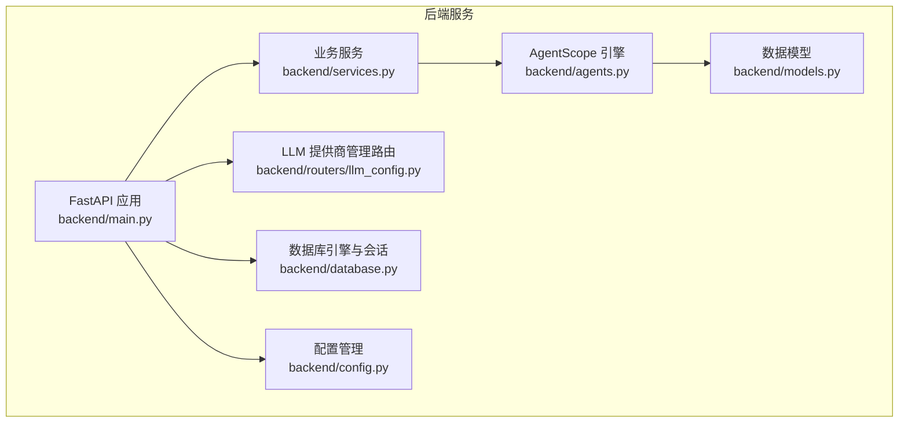
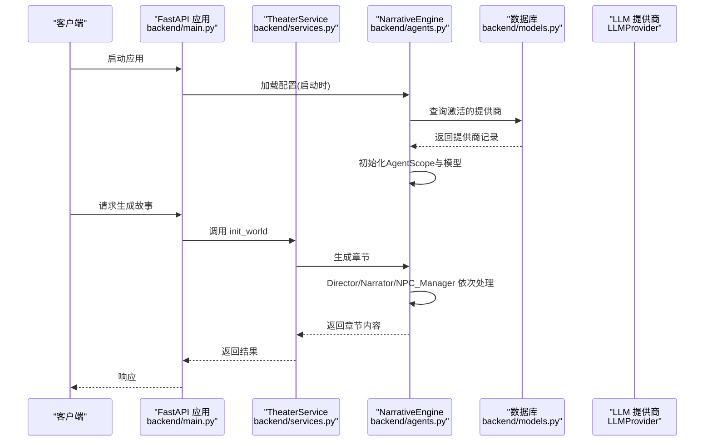
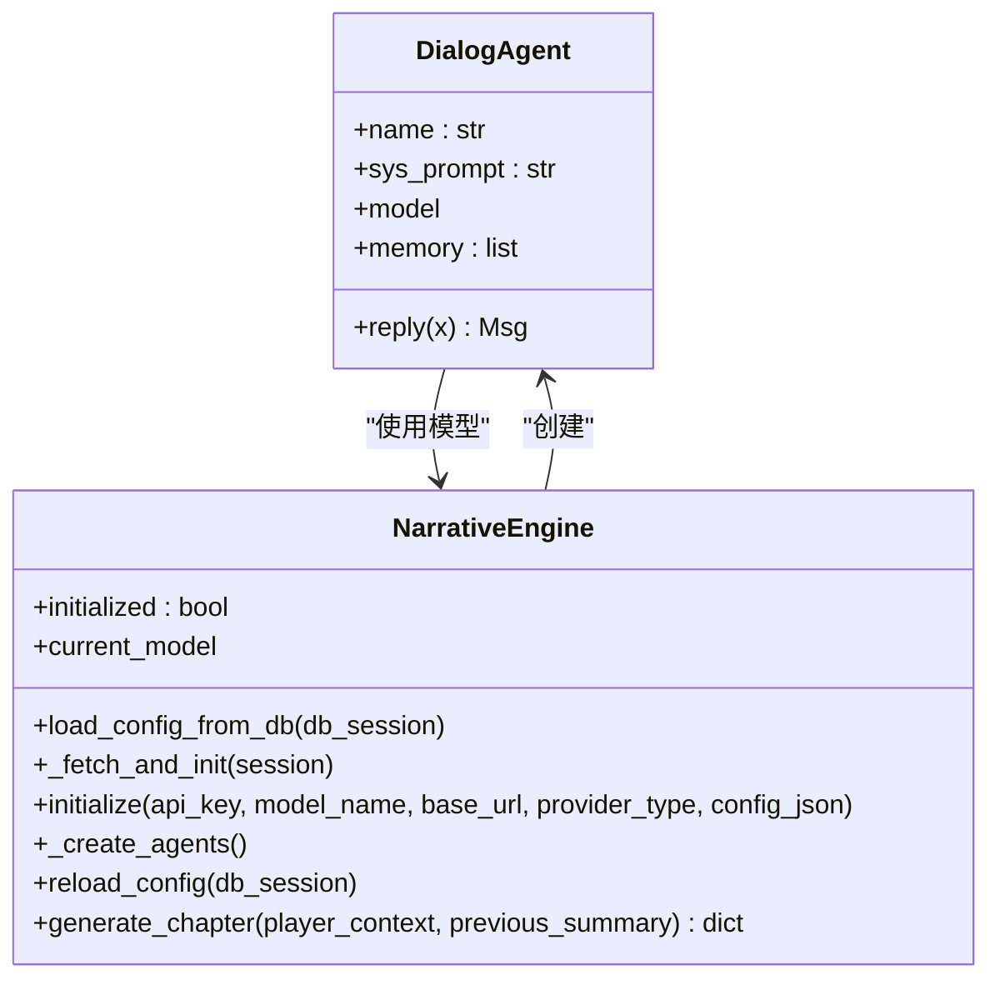
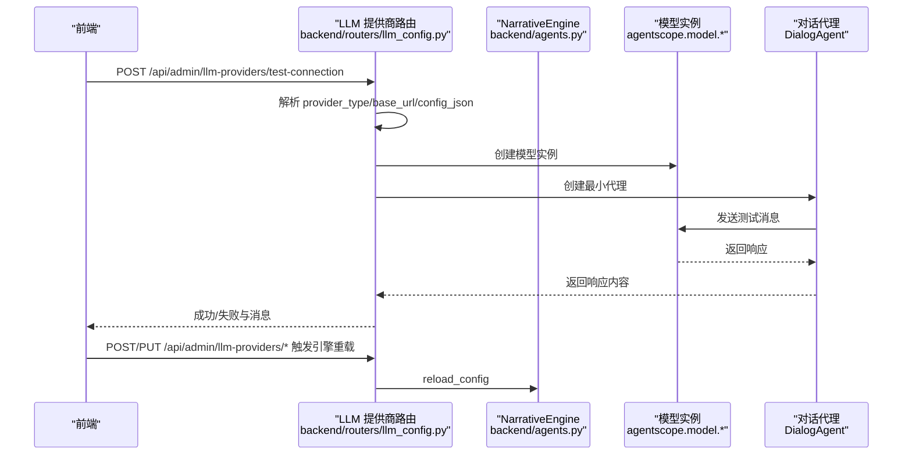
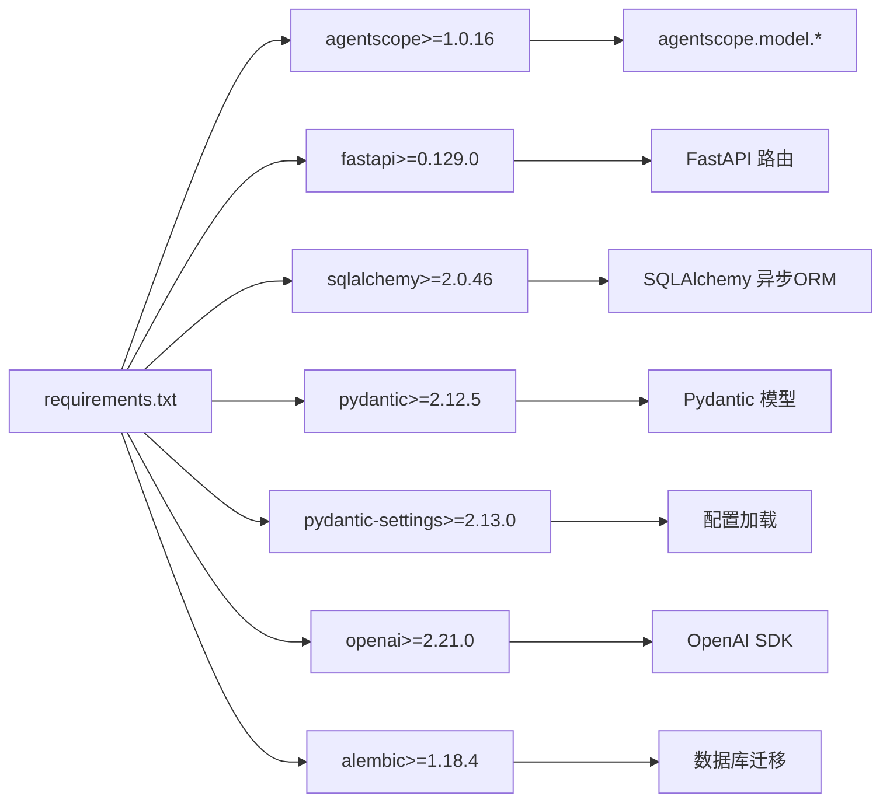

# AgentScope集成问题

<cite>
**本文引用的文件**
- [backend/main.py](file://backend/main.py)
- [backend/config.py](file://backend/config.py)
- [backend/agents.py](file://backend/agents.py)
- [backend/services.py](file://backend/services.py)
- [backend/models.py](file://backend/models.py)
- [backend/routers/llm_config.py](file://backend/routers/llm_config.py)
- [backend/database.py](file://backend/database.py)
- [backend/schemas.py](file://backend/schemas.py)
- [backend/requirements.txt](file://backend/requirements.txt)
- [backend/.env.example](file://backend/.env.example)
</cite>

## 目录
1. [简介](#简介)
2. [项目结构](#项目结构)
3. [核心组件](#核心组件)
4. [架构总览](#架构总览)
5. [详细组件分析](#详细组件分析)
6. [依赖关系分析](#依赖关系分析)
7. [性能考量](#性能考量)
8. [故障排除指南](#故障排除指南)
9. [结论](#结论)
10. [附录](#附录)

## 简介
本指南聚焦于AgentScope在本项目中的集成与常见问题排查，覆盖以下关键场景：
- AgentScope初始化失败
- 模型加载错误
- 代理创建异常
- API密钥验证失败
- 模型名称不匹配
- 基础URL配置错误
- 版本兼容性与依赖冲突
- 环境变量与配置校验流程

目标是帮助开发者快速定位问题根因，并提供可操作的诊断步骤与修复建议。

## 项目结构
后端采用FastAPI + SQLAlchemy异步ORM + Alembic迁移的架构，AgentScope作为LLM客户端接入层，通过数据库中的LLMProvider配置动态初始化模型与代理。

图表来源
- [backend/main.py](file://backend/main.py#L30-L103)
- [backend/config.py](file://backend/config.py#L1-L34)
- [backend/database.py](file://backend/database.py#L1-L31)
- [backend/models.py](file://backend/models.py#L1-L122)
- [backend/services.py](file://backend/services.py#L1-L66)
- [backend/agents.py](file://backend/agents.py#L1-L196)
- [backend/routers/llm_config.py](file://backend/routers/llm_config.py#L1-L203)

章节来源
- [backend/main.py](file://backend/main.py#L1-L173)
- [backend/config.py](file://backend/config.py#L1-L34)
- [backend/database.py](file://backend/database.py#L1-L31)

## 核心组件
- 配置系统：集中管理数据库、Redis、AI模型与API密钥等设置，支持从环境文件读取。
- 数据模型：定义玩家、故事章节、资产、LLM提供商、聊天会话与消息、代理等实体。
- 业务服务：封装世界生成、章节生成等业务逻辑，调用NarrativeEngine。
- AgentScope引擎：负责根据数据库配置动态初始化模型与代理，支持多提供商类型。
- LLM提供商管理：提供创建、更新、删除、测试连接等API，用于验证配置有效性。

章节来源
- [backend/config.py](file://backend/config.py#L1-L34)
- [backend/models.py](file://backend/models.py#L1-L122)
- [backend/services.py](file://backend/services.py#L1-L66)
- [backend/agents.py](file://backend/agents.py#L1-L196)
- [backend/routers/llm_config.py](file://backend/routers/llm_config.py#L1-L203)

## 架构总览
下图展示从FastAPI启动到故事生成的关键路径，以及AgentScope初始化与模型选择的决策流。

图表来源
- [backend/main.py](file://backend/main.py#L45-L81)
- [backend/services.py](file://backend/services.py#L19-L59)
- [backend/agents.py](file://backend/agents.py#L49-L191)
- [backend/models.py](file://backend/models.py#L58-L79)

## 详细组件分析

### 组件A：NarrativeEngine（AgentScope引擎）
- 职责：从数据库加载当前活跃LLM提供商，解析模型列表，初始化AgentScope模型实例，并创建多个对话代理（Director、Narrator、NPC_Manager）。
- 关键点：
  - 支持多种提供商类型（OpenAI、Azure、DashScope、Anthropic、Gemini），默认回退到OpenAI兼容。
  - 支持自定义base_url以适配不同厂商或代理网关。
  - 若数据库无可用提供商，回退到配置中的API密钥与模型名。
  - 初始化失败时打印错误信息并保持未就绪状态，后续生成章节时返回错误提示。

图表来源
- [backend/agents.py](file://backend/agents.py#L11-L196)

章节来源
- [backend/agents.py](file://backend/agents.py#L43-L191)

### 组件B：LLM提供商管理（API）
- 职责：提供LLM提供商的增删改查与连接测试接口；测试时根据provider_type动态选择对应模型类，构造最小化代理并发送简单消息验证连通性。
- 关键点：
  - 测试连接成功后返回响应内容，便于前端确认模型可用性。
  - 更新/新增提供商时，若设为默认或激活，触发引擎重新加载配置。

图表来源
- [backend/routers/llm_config.py](file://backend/routers/llm_config.py#L20-L111)
- [backend/agents.py](file://backend/agents.py#L101-L130)

章节来源
- [backend/routers/llm_config.py](file://backend/routers/llm_config.py#L1-L203)

### 组件C：配置与环境变量
- 配置项：
  - 数据库URL、Redis URL
  - 多个AI提供商API密钥（OpenAI、Claude、Gemini）
  - 默认故事生成模型与图片生成模型
- 环境文件示例：提供OPENAI_API_KEY、DATABASE_URL、REDIS_URL等键位。

章节来源
- [backend/config.py](file://backend/config.py#L1-L34)
- [backend/.env.example](file://backend/.env.example#L1-L4)

## 依赖关系分析
- Python依赖：FastAPI、SQLAlchemy、Pydantic、AgentScope、OpenAI SDK、Alembic、Redis等。
- AgentScope版本要求：requirements中明确agentscope>=1.0.16，需确保与项目其他依赖兼容。
- 数据库驱动：SQLite（本地开发）与PostgreSQL（生产）均可，通过配置切换。

图表来源
- [backend/requirements.txt](file://backend/requirements.txt#L1-L20)

章节来源
- [backend/requirements.txt](file://backend/requirements.txt#L1-L20)

## 性能考量
- 数据库连接池：启用pool_pre_ping与合理配置pool_size/max_overflow，提升连接稳定性。
- 异步I/O：使用异步SQLAlchemy与异步FastAPI，避免阻塞。
- 模型初始化成本：仅在配置变更或首次使用时初始化，避免重复开销。
- 日志级别：降低SQLAlchemy与Uvicorn访问日志，减少噪声，便于定位问题。

章节来源
- [backend/database.py](file://backend/database.py#L8-L23)
- [backend/main.py](file://backend/main.py#L14-L28)

## 故障排除指南

### 一、AgentScope初始化失败
- 可能原因
  - 缺少API密钥或密钥无效
  - 模型名称不被提供商支持
  - 基础URL配置错误或网络不可达
  - AgentScope版本与SDK不兼容
- 诊断步骤
  - 在启动阶段检查是否成功加载数据库配置并完成初始化。
  - 使用“测试连接”接口验证提供商类型、模型名与基础URL组合是否正确。
  - 查看初始化日志输出，确认是否抛出异常并记录错误信息。
- 解决方案
  - 补充或修正API密钥，确保密钥有效且有相应配额。
  - 校验模型名称与提供商支持列表一致，必要时在提供商管理界面更新模型列表。
  - 检查base_url格式与可达性，必要时使用官方网关或代理地址。
  - 升级AgentScope至兼容版本，确保与OpenAI SDK等依赖版本匹配。

章节来源
- [backend/agents.py](file://backend/agents.py#L101-L130)
- [backend/routers/llm_config.py](file://backend/routers/llm_config.py#L20-L111)
- [backend/main.py](file://backend/main.py#L75-L81)

### 二、模型加载错误
- 可能原因
  - 数据库中提供商的models字段格式不正确或为空
  - 模型名称解析失败导致默认模型被选中但不匹配
- 诊断步骤
  - 在加载配置时打印当前使用的模型名，确认是否符合预期。
  - 检查LLMProvider.models字段，支持字符串或JSON数组两种形式。
- 解决方案
  - 将models字段改为标准JSON数组格式，确保至少包含一个可用模型。
  - 如使用字符串，请确保能被正确解析为数组；否则回退为单模型处理。

章节来源
- [backend/agents.py](file://backend/agents.py#L79-L99)

### 三、代理创建异常
- 可能原因
  - 模型实例未初始化成功
  - 代理内存或消息格式异常
- 诊断步骤
  - 确认initialize后initialized标志为True。
  - 在生成章节前尝试lazy load配置，若仍失败则返回错误提示。
- 解决方案
  - 优先通过“测试连接”接口验证模型可用性。
  - 检查代理的系统提示词与消息序列，确保角色映射正确。

章节来源
- [backend/agents.py](file://backend/agents.py#L154-L191)

### 四、API密钥验证失败
- 可能原因
  - 密钥为空或拼写错误
  - 密钥权限不足或账户欠费
- 诊断步骤
  - 在配置中核对OPENAI_API_KEY等密钥字段。
  - 使用“测试连接”接口传入相同密钥与模型进行连通性测试。
- 解决方案
  - 在环境文件中正确填写密钥，并确保其具有调用对应模型的权限。
  - 如为DashScope等其他提供商，使用对应API密钥。

章节来源
- [backend/config.py](file://backend/config.py#L22-L24)
- [backend/routers/llm_config.py](file://backend/routers/llm_config.py#L20-L111)

### 五、模型名称不匹配
- 可能原因
  - 前端或数据库中保存的模型名与实际提供商支持列表不符
- 诊断步骤
  - 在LLM提供商管理界面查看models字段，确认是否包含目标模型。
  - 对于代理更新，检查是否对当前提供商的模型列表进行了校验。
- 解决方案
  - 在提供商管理中添加或修正模型列表，确保与实际可用模型一致。
  - 代理更新时如发现不匹配，返回400并提示具体错误。

章节来源
- [backend/routers/llm_config.py](file://backend/routers/llm_config.py#L107-L126)
- [backend/schemas.py](file://backend/schemas.py#L4-L13)

### 六、基础URL配置错误
- 可能原因
  - base_url格式不正确或指向不可达地址
- 诊断步骤
  - 在“测试连接”请求中传入base_url，观察是否能成功创建模型实例。
  - 检查网络连通性与代理设置。
- 解决方案
  - 使用提供商官方base_url或正确的代理地址。
  - 如为OpenAI/Azure，确保client_type与base_url匹配。

章节来源
- [backend/routers/llm_config.py](file://backend/routers/llm_config.py#L32-L87)

### 七、版本兼容性问题
- 当前依赖
  - agentscope>=1.0.16
  - openai>=2.21.0
  - fastapi>=0.129.0
  - sqlalchemy>=2.0.46
- 排查要点
  - 确认AgentScope版本满足最低要求。
  - 检查OpenAI SDK版本与AgentScope的兼容性。
  - 避免同时安装多个不同版本的AgentScope或OpenAI包导致冲突。
- 解决方案
  - 清理虚拟环境后重新安装requirements.txt。
  - 锁定关键依赖版本，避免自动升级破坏兼容性。

章节来源
- [backend/requirements.txt](file://backend/requirements.txt#L1-L20)

### 八、依赖库冲突与环境变量配置最佳实践
- 依赖冲突
  - 同时存在agentscope与旧版agentscope包会导致导入冲突。
  - OpenAI SDK与AgentScope内部依赖的HTTP库版本不一致可能引发异常。
- 环境变量
  - 使用.env文件统一管理密钥与URL，避免硬编码。
  - 不同环境（开发/测试/生产）使用不同的DATABASE_URL与REDIS_URL。
- 最佳实践
  - 使用独立虚拟环境隔离依赖。
  - 定期运行pip list | grep -E "(agentscope|openai|fastapi)"核对版本。
  - 在CI中加入依赖一致性检查与最小化安装测试。

章节来源
- [backend/.env.example](file://backend/.env.example#L1-L4)
- [backend/requirements.txt](file://backend/requirements.txt#L1-L20)

### 九、日志分析与错误代码示例
- 启动阶段
  - 数据库连接与迁移失败：查看启动日志中的重试次数与最终错误。
  - LLM配置加载失败：检查是否打印了“Failed to load LLM config on startup”的错误信息。
- 运行阶段
  - AgentScope初始化错误：查看“AgentScope init error”的错误信息。
  - 生成章节失败：检查返回的错误提示，确认是否因未初始化或缺少活跃提供商。
- 建议的日志级别
  - 保留应用日志，降低SQLAlchemy与Uvicorn访问日志，便于聚焦问题。

章节来源
- [backend/main.py](file://backend/main.py#L45-L81)
- [backend/agents.py](file://backend/agents.py#L123-L125)

### 十、配置验证步骤清单
- 必备项
  - 确认OPENAI_API_KEY/Claude/Gemini等密钥已填写。
  - 确认DATABASE_URL与REDIS_URL正确。
  - 确认LLMProvider表中有至少一个is_active=True的提供商。
- 验证流程
  - 使用“测试连接”接口，传入provider_type、api_key、base_url、model与config_json。
  - 若测试失败，逐步缩小范围：先验证密钥，再验证模型名，最后验证base_url。
  - 更新提供商后，确认是否触发了引擎重载。

章节来源
- [backend/routers/llm_config.py](file://backend/routers/llm_config.py#L20-L111)
- [backend/agents.py](file://backend/agents.py#L150-L153)

## 结论
本项目通过数据库驱动的LLM提供商配置与AgentScope动态初始化机制，实现了灵活的多提供商接入。故障排除的关键在于：
- 明确初始化失败的根因（密钥、模型、URL、版本）
- 利用“测试连接”接口进行端到端验证
- 严格遵循配置格式与依赖版本要求
- 建立完善的日志与重试策略

按本文提供的诊断步骤与最佳实践执行，可显著降低AgentScope集成风险并提升系统稳定性。

## 附录
- 相关文件路径与职责概览
  - backend/main.py：应用生命周期、数据库迁移与启动配置加载
  - backend/config.py：全局配置与环境变量加载
  - backend/database.py：异步数据库引擎与会话
  - backend/models.py：LLM提供商、代理、聊天等数据模型
  - backend/services.py：世界与章节生成的业务逻辑
  - backend/agents.py：AgentScope引擎与代理创建
  - backend/routers/llm_config.py：LLM提供商管理与连接测试
  - backend/schemas.py：Pydantic数据模型与校验
  - backend/requirements.txt：依赖版本约束
  - backend/.env.example：环境变量模板