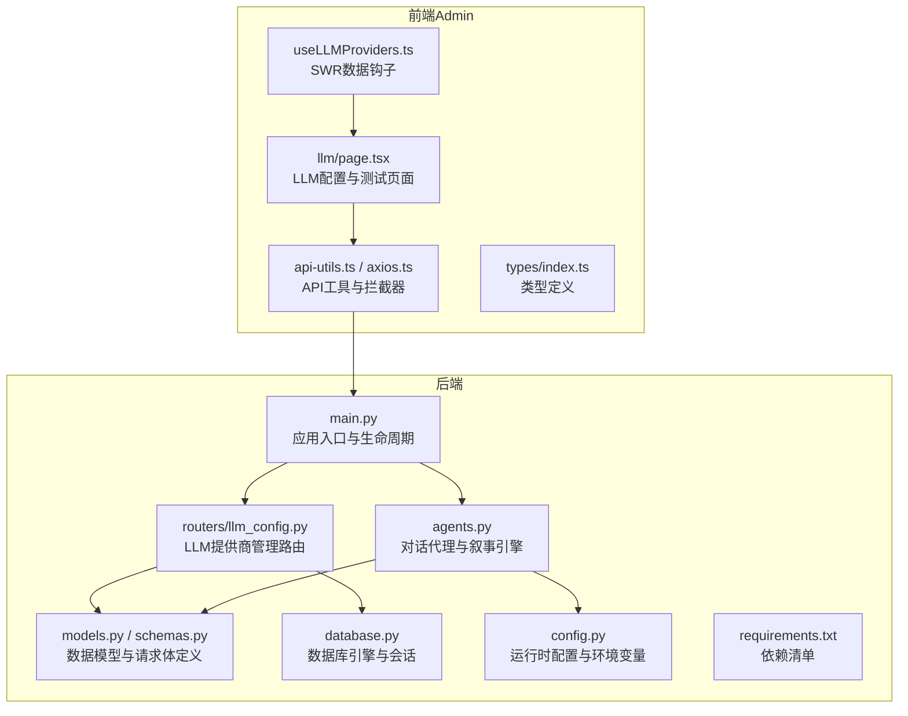
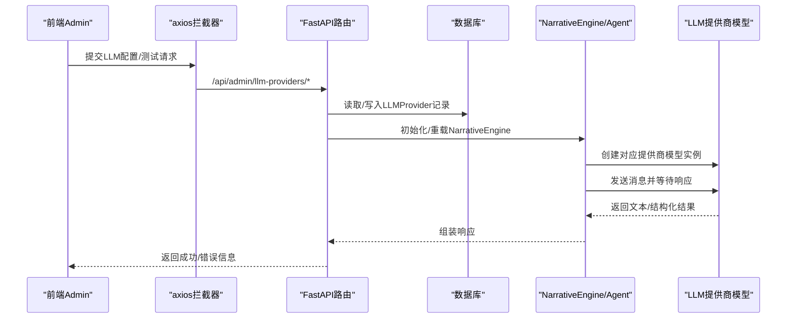
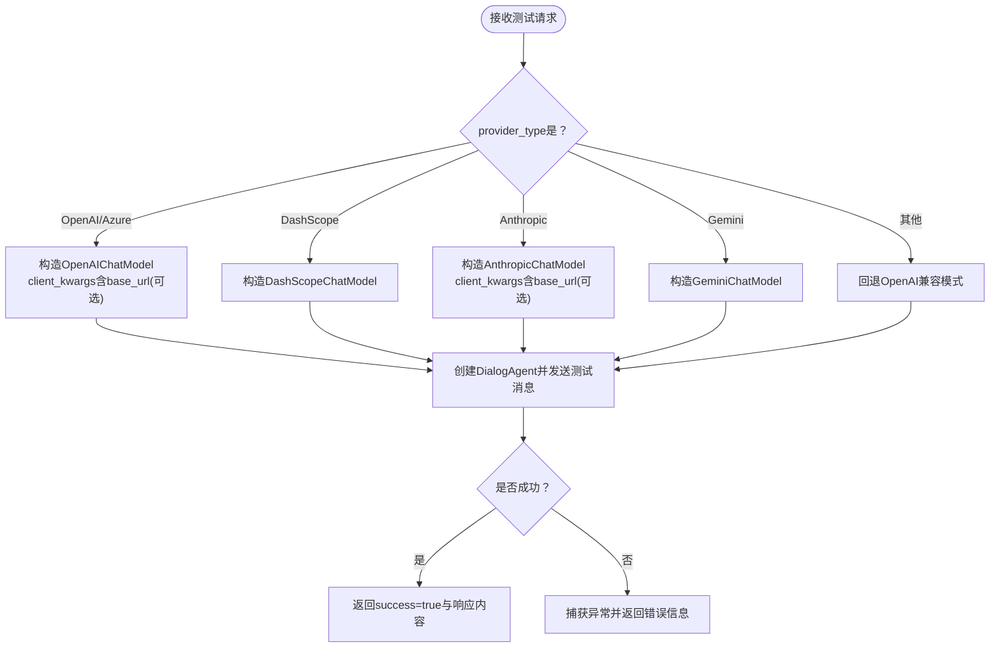
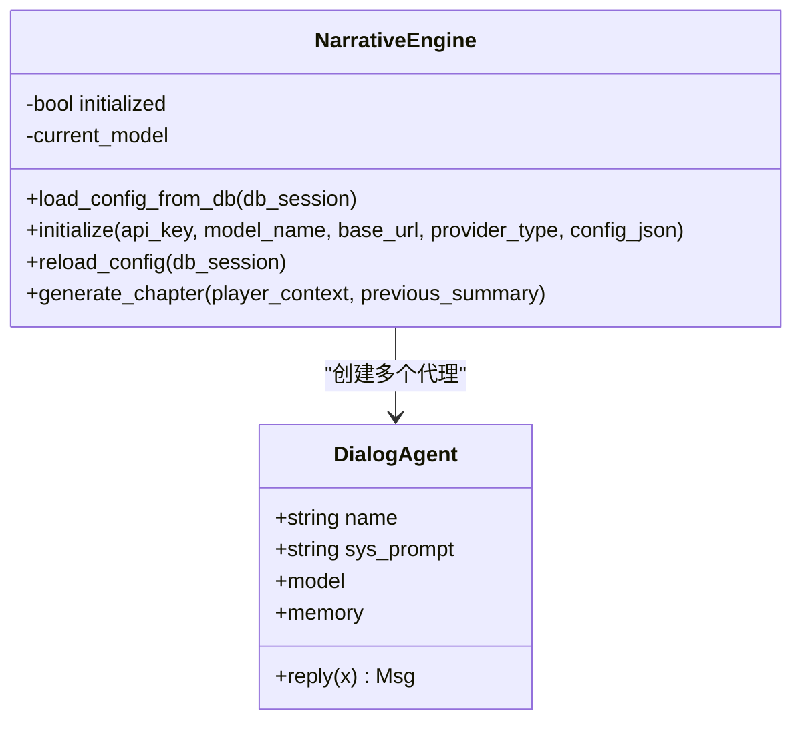
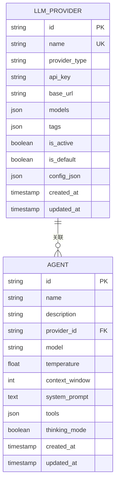
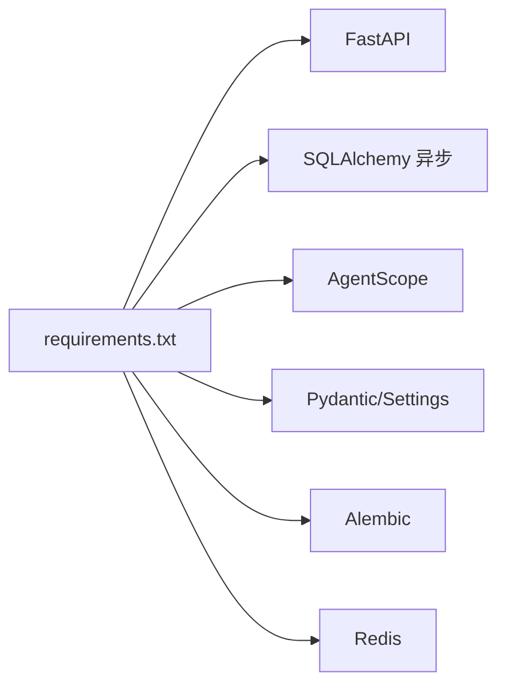

# LLM提供商集成问题

<cite>
**本文引用的文件**
- [backend/main.py](file://backend/main.py)
- [backend/config.py](file://backend/config.py)
- [backend/.env.example](file://backend/.env.example)
- [backend/database.py](file://backend/database.py)
- [backend/models.py](file://backend/models.py)
- [backend/schemas.py](file://backend/schemas.py)
- [backend/routers/llm_config.py](file://backend/routers/llm_config.py)
- [backend/agents.py](file://backend/agents.py)
- [backend/requirements.txt](file://backend/requirements.txt)
- [backend/admin/src/hooks/useLLMProviders.ts](file://backend/admin/src/hooks/useLLMProviders.ts)
- [backend/admin/src/app/admin/llm/page.tsx](file://backend/admin/src/app/admin/llm/page.tsx)
- [backend/admin/src/lib/api-utils.ts](file://backend/admin/src/lib/api-utils.ts)
- [backend/admin/src/lib/axios.ts](file://backend/admin/src/lib/axios.ts)
- [backend/admin/src/types/index.ts](file://backend/admin/src/types/index.ts)
</cite>

## 目录
1. [简介](#简介)
2. [项目结构](#项目结构)
3. [核心组件](#核心组件)
4. [架构总览](#架构总览)
5. [详细组件分析](#详细组件分析)
6. [依赖关系分析](#依赖关系分析)
7. [性能考虑](#性能考虑)
8. [故障排除指南](#故障排除指南)
9. [结论](#结论)
10. [附录](#附录)

## 简介
本文件面向LLM提供商集成与运维人员，系统性梳理在本项目中对接多家LLM提供商（OpenAI、Azure、DashScope、Anthropic、Gemini）时的差异点、常见问题与排障方法。内容覆盖API密钥验证、模型列表获取、请求限流与响应解析、网络连接与代理、SSL证书、错误码对照、调试技巧、性能优化、提供商切换流程、配置备份与回滚策略等。

## 项目结构
后端采用FastAPI + SQLAlchemy异步ORM + AgentScope模型封装，通过统一的LLM提供商管理接口完成配置、测试与动态加载；前端Admin页面提供可视化配置与测试能力。

图表来源
- [backend/main.py](file://backend/main.py#L83-L98)
- [backend/routers/llm_config.py](file://backend/routers/llm_config.py#L14-L18)
- [backend/agents.py](file://backend/agents.py#L43-L130)
- [backend/models.py](file://backend/models.py#L58-L79)
- [backend/schemas.py](file://backend/schemas.py#L4-L41)
- [backend/database.py](file://backend/database.py#L8-L23)
- [backend/config.py](file://backend/config.py#L7-L33)
- [backend/admin/src/hooks/useLLMProviders.ts](file://backend/admin/src/hooks/useLLMProviders.ts#L5-L16)
- [backend/admin/src/app/admin/llm/page.tsx](file://backend/admin/src/app/admin/llm/page.tsx#L96-L191)
- [backend/admin/src/lib/api-utils.ts](file://backend/admin/src/lib/api-utils.ts#L3-L18)
- [backend/admin/src/lib/axios.ts](file://backend/admin/src/lib/axios.ts#L3-L17)

章节来源
- [backend/main.py](file://backend/main.py#L83-L98)
- [backend/routers/llm_config.py](file://backend/routers/llm_config.py#L14-L18)
- [backend/agents.py](file://backend/agents.py#L43-L130)
- [backend/models.py](file://backend/models.py#L58-L79)
- [backend/schemas.py](file://backend/schemas.py#L4-L41)
- [backend/database.py](file://backend/database.py#L8-L23)
- [backend/config.py](file://backend/config.py#L7-L33)
- [backend/admin/src/hooks/useLLMProviders.ts](file://backend/admin/src/hooks/useLLMProviders.ts#L5-L16)
- [backend/admin/src/app/admin/llm/page.tsx](file://backend/admin/src/app/admin/llm/page.tsx#L96-L191)
- [backend/admin/src/lib/api-utils.ts](file://backend/admin/src/lib/api-utils.ts#L3-L18)
- [backend/admin/src/lib/axios.ts](file://backend/admin/src/lib/axios.ts#L3-L17)

## 核心组件
- 应用入口与生命周期：负责数据库迁移、启动时从数据库加载LLM配置、注册路由与中间件。
- LLM提供商管理路由：提供创建/查询/更新/删除/测试连接等接口，支持多提供商类型与可选base_url。
- 叙事引擎与对话代理：按数据库中的活动提供商动态初始化AgentScope模型，并生成章节内容。
- 数据模型与请求体：定义LLMProvider、Agent、ChatSession等实体及创建/更新/测试请求体。
- 前端Admin：提供LLM配置列表、新增/编辑/删除、连接测试与状态展示。

章节来源
- [backend/main.py](file://backend/main.py#L45-L81)
- [backend/routers/llm_config.py](file://backend/routers/llm_config.py#L20-L111)
- [backend/agents.py](file://backend/agents.py#L43-L130)
- [backend/models.py](file://backend/models.py#L58-L79)
- [backend/schemas.py](file://backend/schemas.py#L4-L41)

## 架构总览
下图展示了从Admin页面到后端路由、数据库、AgentScope模型封装以及外部LLM服务的整体调用链路。

图表来源
- [backend/admin/src/lib/axios.ts](file://backend/admin/src/lib/axios.ts#L3-L17)
- [backend/routers/llm_config.py](file://backend/routers/llm_config.py#L20-L111)
- [backend/agents.py](file://backend/agents.py#L101-L130)
- [backend/models.py](file://backend/models.py#L58-L79)

## 详细组件分析

### LLM提供商管理路由（/api/admin/llm-providers）
- 支持的提供商类型：OpenAI、Azure、DashScope、Anthropic、Gemini；默认回退到OpenAI兼容模式。
- 关键功能：
  - 测试连接：根据provider_type与config_json构造对应模型实例，发送简单消息并返回响应内容。
  - 创建/更新/删除：维护LLMProvider记录，支持设置默认与激活状态，必要时触发NarrativeEngine重载。
  - 查询：分页列出提供商，支持按ID查询单个。

图表来源
- [backend/routers/llm_config.py](file://backend/routers/llm_config.py#L32-L87)
- [backend/routers/llm_config.py](file://backend/routers/llm_config.py#L91-L110)

章节来源
- [backend/routers/llm_config.py](file://backend/routers/llm_config.py#L20-L111)
- [backend/routers/llm_config.py](file://backend/routers/llm_config.py#L112-L202)

### 叙事引擎与对话代理（NarrativeEngine/DialogAgent）
- 动态加载：启动或更新时从数据库读取活动提供商，解析模型名与配置，初始化AgentScope模型。
- 模型选择：优先使用数据库中provider.models的第一个条目，若为空则回退到配置项。
- 代理角色：Director（大纲）、Narrator（正文）、NPC_Manager（关系），按顺序生成章节内容。

图表来源
- [backend/agents.py](file://backend/agents.py#L43-L130)
- [backend/agents.py](file://backend/agents.py#L11-L42)

章节来源
- [backend/agents.py](file://backend/agents.py#L43-L130)
- [backend/agents.py](file://backend/agents.py#L11-L42)

### 数据模型与请求体
- LLMProvider：存储提供商名称、类型、API Key、base_url、可用模型列表、标签、默认/激活状态与扩展配置。
- 请求体：LLMProviderCreate/Update/Response与TestConnectionRequest，用于前端提交与后端校验。

图表来源
- [backend/models.py](file://backend/models.py#L58-L79)
- [backend/models.py](file://backend/models.py#L100-L122)

章节来源
- [backend/models.py](file://backend/models.py#L58-L79)
- [backend/schemas.py](file://backend/schemas.py#L4-L41)

### 前端Admin集成
- useLLMProviders：基于SWR拉取活动提供商列表。
- LLM配置页面：表单校验（JSON格式、至少一个模型）、测试连接调用后端接口。
- axios拦截器：统一设置baseURL与错误处理。

章节来源
- [backend/admin/src/hooks/useLLMProviders.ts](file://backend/admin/src/hooks/useLLMProviders.ts#L5-L16)
- [backend/admin/src/app/admin/llm/page.tsx](file://backend/admin/src/app/admin/llm/page.tsx#L63-L81)
- [backend/admin/src/app/admin/llm/page.tsx](file://backend/admin/src/app/admin/llm/page.tsx#L168-L191)
- [backend/admin/src/lib/api-utils.ts](file://backend/admin/src/lib/api-utils.ts#L3-L18)
- [backend/admin/src/lib/axios.ts](file://backend/admin/src/lib/axios.ts#L3-L17)
- [backend/admin/src/types/index.ts](file://backend/admin/src/types/index.ts#L16-L21)

## 依赖关系分析
- 后端依赖：FastAPI、SQLAlchemy异步、AgentScope、Pydantic/Settings、Alembic迁移、Redis等。
- 前端依赖：axios、SWR、Zod（表单校验）、Next.js（Admin页面）。

图表来源
- [backend/requirements.txt](file://backend/requirements.txt#L1-L20)

章节来源
- [backend/requirements.txt](file://backend/requirements.txt#L1-L20)

## 性能考虑
- 连接池与重连：数据库引擎启用pool_pre_ping与合理大小，提升稳定性。
- 异步I/O：全栈采用异步编程模型，避免阻塞。
- 缓存与预热：NarrativeEngine按需初始化，避免无活动提供商时的开销。
- 超时与重试：建议在AgentScope层或HTTP客户端增加超时与指数退避策略（当前未见显式实现）。

章节来源
- [backend/database.py](file://backend/database.py#L8-L23)
- [backend/agents.py](file://backend/agents.py#L49-L75)

## 故障排除指南

### 通用排查步骤
- 确认数据库迁移已执行且LLMProvider表存在。
- 在Admin页面“LLM配置”中检查提供商记录是否正确、是否标记为激活。
- 使用“测试连接”按钮快速验证提供商配置是否有效。
- 查看后端日志定位异常堆栈与错误信息。

章节来源
- [backend/main.py](file://backend/main.py#L59-L64)
- [backend/routers/llm_config.py](file://backend/routers/llm_config.py#L20-L111)

### API密钥验证
- OpenAI/Azure/DashScope/Anthropic/Gemini均通过各自模型封装传入api_key。
- 若测试失败，优先检查密钥是否正确、是否具备相应模型权限与配额。
- 建议在后端打印最小化请求参数以辅助定位（当前测试接口已开启异常堆栈打印）。

章节来源
- [backend/routers/llm_config.py](file://backend/routers/llm_config.py#L32-L87)
- [backend/routers/llm_config.py](file://backend/routers/llm_config.py#L107-L110)

### 模型列表获取
- 当前实现不直接暴露“模型列表”接口；可通过测试连接验证模型可用性。
- 若provider.models为空，NarrativeEngine会回退到配置项中的默认模型名。
- 建议在Admin页面中为每个提供商维护准确的可用模型列表，便于前端选择。

章节来源
- [backend/agents.py](file://backend/agents.py#L79-L99)
- [backend/admin/src/app/admin/llm/page.tsx](file://backend/admin/src/app/admin/llm/page.tsx#L63-L81)

### 请求限流与速率限制
- 项目未内置显式的全局限流策略；建议在AgentScope或HTTP客户端层增加令牌桶/漏桶算法与重试退避。
- 对于第三方API（如OpenAI、DashScope等），应遵循其官方速率限制并实现指数退避与熔断。

[本节为通用指导，无需特定文件引用]

### 响应解析与错误处理
- 测试连接返回内容会转换为字符串以确保JSON安全序列化。
- 前端对config_json字段进行JSON格式校验，避免无效配置导致初始化失败。
- 建议在AgentScope层对响应结构进行更严格的校验与字段提取（如text字段存在性）。

章节来源
- [backend/routers/llm_config.py](file://backend/routers/llm_config.py#L102-L105)
- [backend/admin/src/app/admin/llm/page.tsx](file://backend/admin/src/app/admin/llm/page.tsx#L70-L78)

### 网络连接问题
- base_url：OpenAI/Azure/Anthropic支持通过base_url自定义网关；请确认URL格式与可达性。
- 代理：若部署在受限网络，请在运行环境中配置HTTP/HTTPS代理；确保DNS解析与TLS握手正常。
- 防火墙：检查出站访问策略，允许访问对应提供商域名。

章节来源
- [backend/routers/llm_config.py](file://backend/routers/llm_config.py#L35-L36)
- [backend/routers/llm_config.py](file://backend/routers/llm_config.py#L57-L58)

### SSL证书错误
- 使用自签名或私有CA时，确保系统信任链完整；或在运行环境设置SSL相关环境变量。
- 如需绕过校验仅用于开发（不推荐生产），请评估风险并尽快修复证书链。

[本节为通用指导，无需特定文件引用]

### 代理配置问题
- 在容器或云环境中，确保容器内代理环境变量（HTTP_PROXY/HTTPS_PROXY）与系统一致。
- 若使用SOCKS代理，需确认Python/HTTP库支持并正确配置。

[本节为通用指导，无需特定文件引用]

### 调试技巧
- 后端：开启详细日志，观察AgentScope初始化与模型调用过程；利用测试连接接口输出最小复现。
- 前端：在表单中逐步填写字段，先测试最小配置（仅provider_type、api_key、model），再逐步加入config_json。
- 数据库：确认LLMProvider.is_active唯一且与预期一致；必要时手动清理历史配置。

章节来源
- [backend/main.py](file://backend/main.py#L14-L28)
- [backend/routers/llm_config.py](file://backend/routers/llm_config.py#L20-L111)
- [backend/admin/src/app/admin/llm/page.tsx](file://backend/admin/src/app/admin/llm/page.tsx#L168-L191)

### 错误码对照（示例）
- 400：提供商名称重复（创建时）。
- 404：提供商不存在（查询/更新/删除时）。
- 服务器内部错误：测试连接抛出异常时返回通用错误信息。

章节来源
- [backend/routers/llm_config.py](file://backend/routers/llm_config.py#L117-L120)
- [backend/routers/llm_config.py](file://backend/routers/llm_config.py#L154-L158)
- [backend/routers/llm_config.py](file://backend/routers/llm_config.py#L107-L110)

### 性能优化建议
- 将常用模型与配置缓存至内存，减少数据库频繁读取。
- 对长文本生成任务，适当降低上下文窗口或拆分请求。
- 在AgentScope层引入并发控制与队列，避免瞬时高并发导致第三方限流。

[本节为通用指导，无需特定文件引用]

### 提供商切换流程
- 在Admin页面新增目标提供商记录，设置is_active与is_default（若需要）。
- 点击“测试连接”，确认成功后再保存。
- 更新完成后，NarrativeEngine会自动重载配置并生效。

章节来源
- [backend/routers/llm_config.py](file://backend/routers/llm_config.py#L112-L138)
- [backend/routers/llm_config.py](file://backend/routers/llm_config.py#L160-L188)
- [backend/agents.py](file://backend/agents.py#L150-L152)

### 配置备份与回滚策略
- 备份：导出LLMProvider表记录（含api_key、base_url、models、config_json），建议加密存储。
- 回滚：若新配置导致异常，恢复上一版本记录并重新触发NarrativeEngine重载。
- 版本化：结合数据库迁移脚本，确保配置变更可追踪与可逆。

章节来源
- [backend/models.py](file://backend/models.py#L58-L79)
- [backend/agents.py](file://backend/agents.py#L150-L152)

## 结论
本项目通过统一的LLM提供商管理接口与AgentScope模型封装，实现了对多家LLM提供商的灵活接入与动态切换。建议在生产环境中完善限流、重试、代理与证书校验机制，并建立完善的配置备份与回滚流程，以保障系统的稳定性与可维护性。

## 附录

### 环境变量与默认值
- OPENAI_API_KEY：可在.env中配置，作为回退场景下的默认密钥来源之一。
- DATABASE_URL/REDIS_URL：数据库与缓存连接串，支持SQLite与PostgreSQL。

章节来源
- [backend/.env.example](file://backend/.env.example#L1-L4)
- [backend/config.py](file://backend/config.py#L21-L24)
- [backend/config.py](file://backend/config.py#L14-L16)