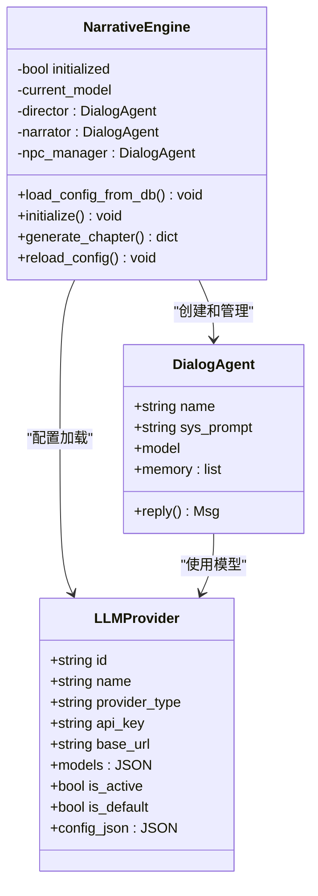
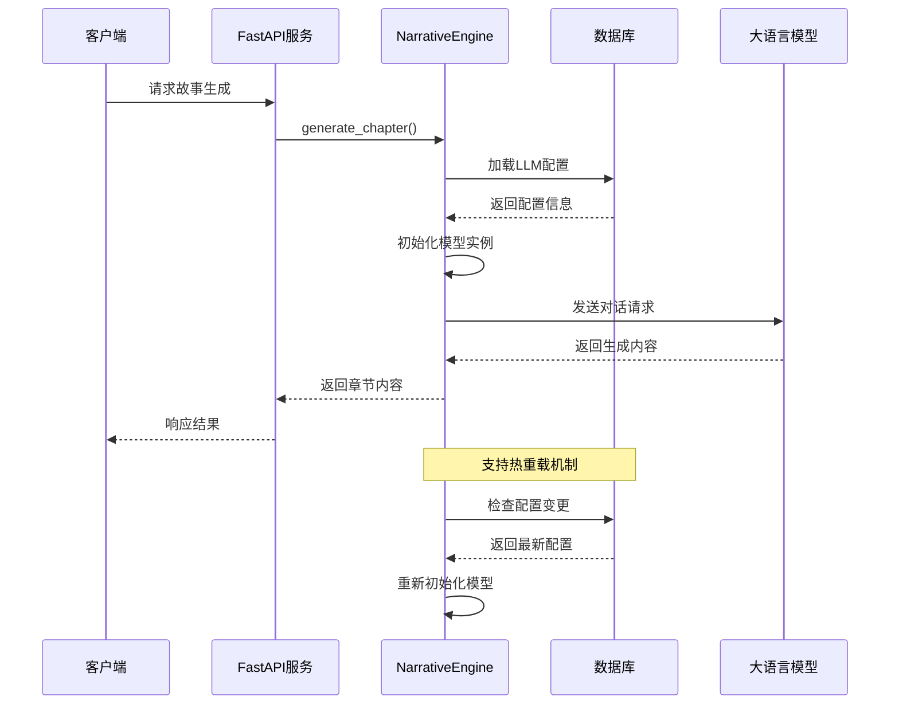
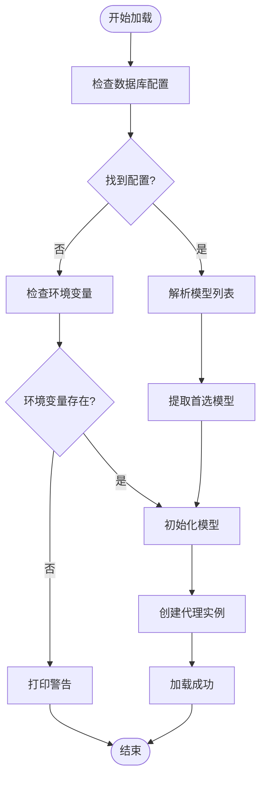
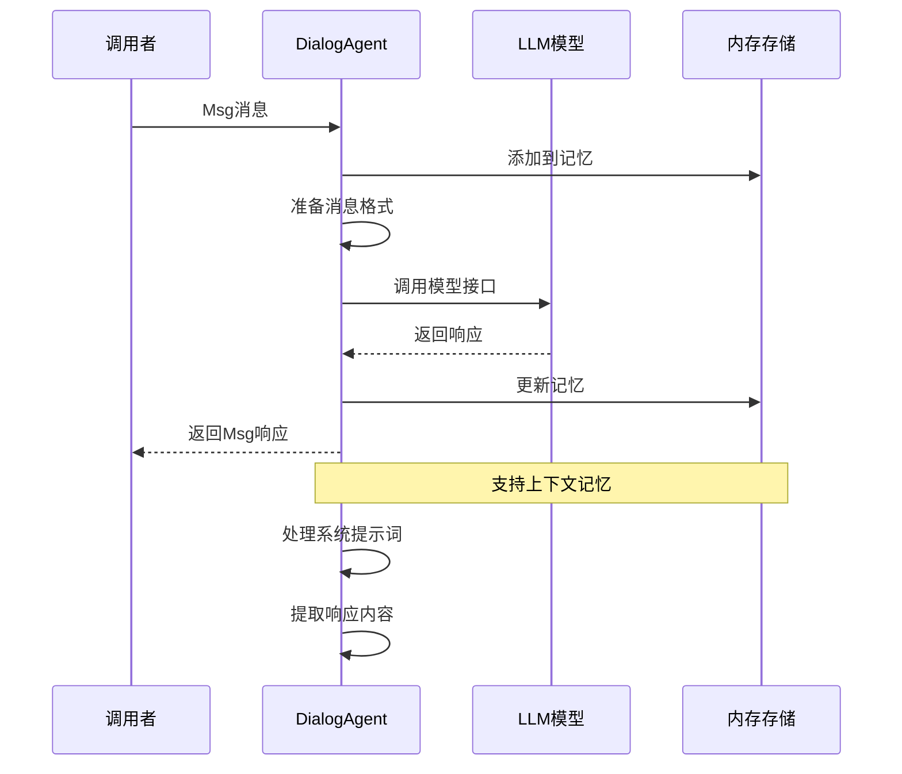
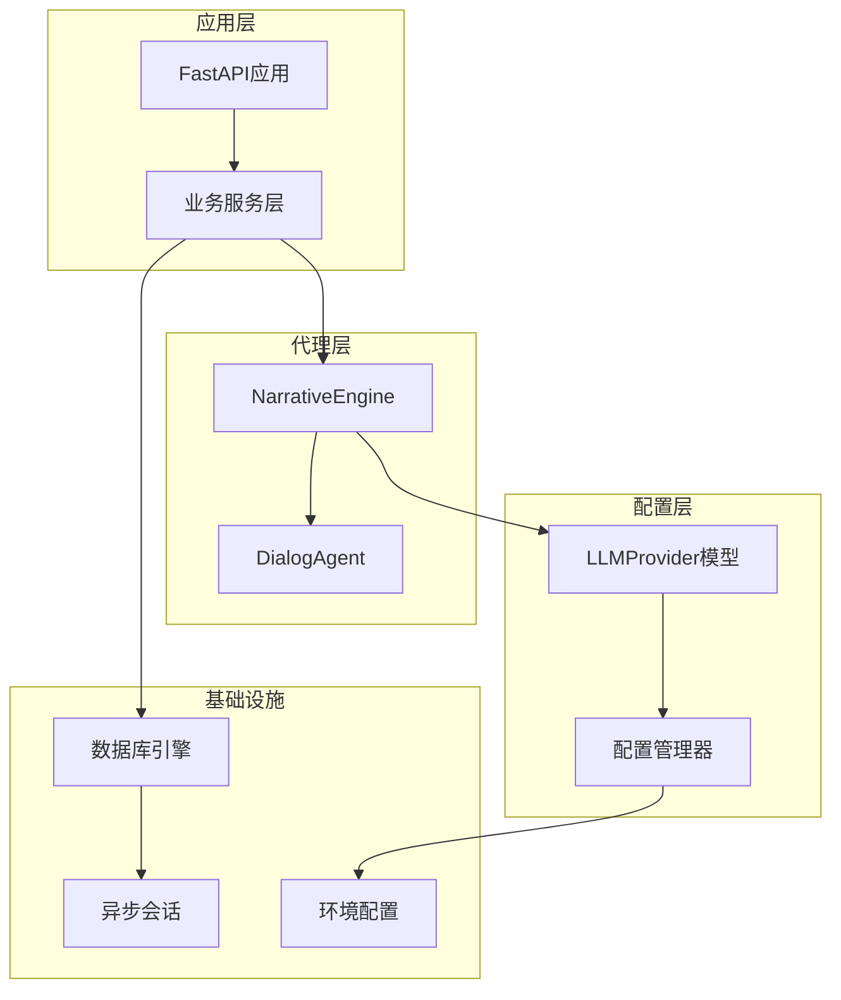
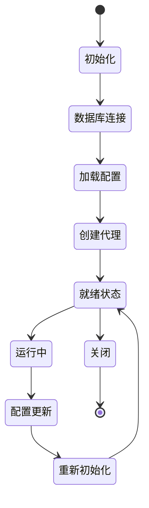

# Qoder代理配置问题

<cite>
**本文档引用的文件**
- [backend/agents.py](file://backend/agents.py)
- [backend/main.py](file://backend/main.py)
- [backend/config.py](file://backend/config.py)
- [backend/models.py](file://backend/models.py)
- [backend/routers/agents.py](file://backend/routers/agents.py)
- [backend/routers/llm_config.py](file://backend/routers/llm_config.py)
- [backend/services.py](file://backend/services.py)
- [backend/database.py](file://backend/database.py)
- [backend/schemas.py](file://backend/schemas.py)
- [backend/.env.example](file://backend/.env.example)
</cite>

## 目录
1. [简介](#简介)
2. [项目结构](#项目结构)
3. [核心组件](#核心组件)
4. [架构概览](#架构概览)
5. [详细组件分析](#详细组件分析)
6. [依赖关系分析](#依赖关系分析)
7. [性能考虑](#性能考虑)
8. [故障排除指南](#故障排除指南)
9. [结论](#结论)
10. [附录](#附录)

## 简介

本文档为Qoder代理配置问题提供专门的故障排除指南。Qoder是一个基于AgentScope框架的交互式叙事游戏平台，通过代理（Agent）系统实现智能故事生成和对话管理。该指南详细说明了代理文件结构、技能定义和配置参数的验证方法，解释代理加载失败、技能调用错误和配置解析异常的排查步骤，并提供代理调试工具、配置验证脚本和日志分析方法。

## 项目结构

Qoder项目采用分层架构设计，主要包含以下核心目录：

```mermaid
graph TB
subgraph "后端服务"
A[backend/] --> B[main.py<br/>主应用入口]
A --> C[agents.py<br/>代理引擎]
A --> D[routers/]<br/>路由模块]
A --> E[services.py<br/>业务服务]
A --> F[models.py<br/>数据模型]
A --> G[database.py<br/>数据库配置]
A --> H[config.py<br/>配置管理]
end
subgraph "前端界面"
I[frontend/]<br/>Next.js应用]
end
subgraph "文档"
J[docs/]<br/>技术文档]
end
subgraph "配置文件"
K[.env.example<br/>环境配置]
L[requirements.txt<br/>依赖包]
end
A --> I
A --> J
A --> K
A --> L
```

**图表来源**
- [backend/main.py](file://backend/main.py#L1-L173)
- [backend/agents.py](file://backend/agents.py#L1-L196)

**章节来源**
- [backend/main.py](file://backend/main.py#L1-L173)
- [backend/agents.py](file://backend/agents.py#L1-L196)

## 核心组件

### 代理引擎架构

Qoder的核心是NarrativeEngine类，负责管理多个专用代理：



**图表来源**
- [backend/agents.py](file://backend/agents.py#L11-L196)
- [backend/models.py](file://backend/models.py#L58-L79)

### 配置管理系统

系统采用多层配置管理策略：

| 配置层级 | 文件位置 | 用途 | 优先级 |
|---------|----------|------|--------|
| 环境变量 | `.env` | 运行时配置 | 最高 |
| 应用设置 | `config.py` | 默认值和基础配置 | 中等 |
| 数据库配置 | `LLMProvider`表 | 动态配置 | 最低 |

**章节来源**
- [backend/agents.py](file://backend/agents.py#L49-L99)
- [backend/config.py](file://backend/config.py#L7-L34)
- [backend/models.py](file://backend/models.py#L58-L79)

## 架构概览

Qoder采用事件驱动的异步架构，支持实时故事生成和动态配置更新：



**图表来源**
- [backend/agents.py](file://backend/agents.py#L150-L191)
- [backend/main.py](file://backend/main.py#L45-L81)

**章节来源**
- [backend/main.py](file://backend/main.py#L45-L81)
- [backend/agents.py](file://backend/agents.py#L150-L191)

## 详细组件分析

### 代理加载机制

代理加载过程包含完整的错误处理和回退机制：



**图表来源**
- [backend/agents.py](file://backend/agents.py#L49-L99)

**章节来源**
- [backend/agents.py](file://backend/agents.py#L49-L99)

### 配置验证流程

系统提供多层次的配置验证机制：

| 验证阶段 | 验证内容 | 实现位置 | 错误处理 |
|---------|----------|----------|----------|
| 格式验证 | JSON格式正确性 | `json.loads()` | 异常捕获 |
| 类型验证 | 数据类型匹配 | Pydantic模型 | 字段校验 |
| 业务验证 | 业务规则约束 | 自定义验证逻辑 | HTTP异常 |
| 连接验证 | 服务可用性测试 | `test_connection` | 超时处理 |

**章节来源**
- [backend/routers/llm_config.py](file://backend/routers/llm_config.py#L20-L111)
- [backend/schemas.py](file://backend/schemas.py#L15-L42)

### 技能调用机制

代理技能调用遵循统一的消息传递模式：



**图表来源**
- [backend/agents.py](file://backend/agents.py#L19-L41)

**章节来源**
- [backend/agents.py](file://backend/agents.py#L19-L41)

## 依赖关系分析

系统依赖关系呈现清晰的分层结构：



**图表来源**
- [backend/main.py](file://backend/main.py#L30-L43)
- [backend/agents.py](file://backend/agents.py#L1-L10)

**章节来源**
- [backend/main.py](file://backend/main.py#L30-L43)
- [backend/agents.py](file://backend/agents.py#L1-L10)

## 性能考虑

### 异步处理优化

系统采用异步编程模式提升并发性能：

- **事件循环优化**: Windows平台使用`WindowsSelectorEventLoopPolicy`
- **数据库连接池**: 配置最大连接数和溢出连接数
- **内存管理**: 代理记忆的自动清理机制
- **缓存策略**: LLM响应的智能缓存

### 资源管理最佳实践

| 资源类型 | 管理策略 | 性能影响 |
|---------|----------|----------|
| 数据库连接 | 连接池预检测 | 减少连接失败 |
| 代理实例 | 按需创建 | 降低内存占用 |
| 模型加载 | 单例模式 | 提升响应速度 |
| 日志输出 | 分级控制 | 减少I/O开销 |

**章节来源**
- [backend/main.py](file://backend/main.py#L6-L28)
- [backend/database.py](file://backend/database.py#L8-L23)

## 故障排除指南

### 代理加载失败排查

#### 常见症状
- 启动时出现"AI Engine not initialized"错误
- 故事生成接口返回配置错误
- WebSocket连接正常但无响应

#### 排查步骤

1. **检查数据库连接**
   ```bash
   # 验证数据库可访问性
   python -c "from backend.database import engine; import asyncio; asyncio.run(engine.connect())"
   ```

2. **验证LLM配置**
   ```bash
   # 检查默认提供者状态
   curl -X GET http://localhost:8000/api/admin/llm-providers/
   ```

3. **查看启动日志**
   ```
   # 关注以下关键信息
   [sqlalchemy.engine] INFO - Database migrations completed.
   [agents] INFO - Initializing NarrativeEngine with provider: ...
   [agents] ERROR - AgentScope init error: ...
   ```

#### 解决方案

| 问题类型 | 可能原因 | 解决方案 |
|---------|----------|----------|
| 数据库连接失败 | 网络或凭据错误 | 检查DATABASE_URL配置 |
| API密钥无效 | 密钥过期或格式错误 | 更新.env文件中的API密钥 |
| 模型不可用 | 模型名称不匹配 | 验证provider.models配置 |
| 权限不足 | 数据库权限配置错误 | 检查数据库用户权限 |

**章节来源**
- [backend/agents.py](file://backend/agents.py#L66-L75)
- [backend/main.py](file://backend/main.py#L75-L80)

### 技能调用错误诊断

#### 错误分类与处理

1. **模型调用异常**
   ```python
   # 检查模型初始化
   try:
       narrative_engine.load_config_from_db()
       print("模型初始化状态:", narrative_engine.initialized)
   except Exception as e:
       print("初始化失败:", e)
   ```

2. **消息格式错误**
   ```python
   # 验证消息结构
   from backend.agents import DialogAgent
   from backend.agentscope.message import Msg
   
   agent = DialogAgent("Test", "system prompt", model_instance)
   msg = Msg(name="User", content="test", role="user")
   ```

3. **内存溢出问题**
   ```python
   # 监控代理内存使用
   print("代理记忆长度:", len(dialog_agent.memory))
   ```

#### 调试工具

1. **配置验证脚本**
   ```python
   # 验证代理配置
   def validate_agent_config():
       from backend.routers.agents import create_agent
       from backend.schemas import AgentCreate
       
       test_agent = AgentCreate(
           name="test_agent",
           description="test",
           provider_id="valid_provider_id",
           model="gpt-4",
           system_prompt="test prompt"
       )
       return test_agent
   ```

2. **连接测试工具**
   ```python
   # 测试LLM连接
   def test_llm_connection():
       from backend.routers.llm_config import test_connection
       from backend.schemas import TestConnectionRequest
       
       request = TestConnectionRequest(
           provider_type="openai",
           api_key="your_api_key",
           model="gpt-4",
           config_json={}
       )
       return request
   ```

**章节来源**
- [backend/routers/agents.py](file://backend/routers/agents.py#L15-L55)
- [backend/routers/llm_config.py](file://backend/routers/llm_config.py#L20-L111)

### 配置解析异常处理

#### JSON配置格式验证

1. **配置文件检查**
   ```python
   import json
   
   def validate_json_config(config_string):
       try:
           parsed = json.loads(config_string)
           return True, parsed
       except json.JSONDecodeError as e:
           return False, str(e)
   ```

2. **模型列表解析**
   ```python
   def parse_model_list(provider_models):
       if isinstance(provider_models, list):
           return provider_models
       elif isinstance(provider_models, str):
           try:
               return json.loads(provider_models)
           except:
               return [provider_models]
       return []
   ```

#### 环境变量配置

1. **.env文件验证**
   ```bash
   # 检查必需的环境变量
   cat .env | grep -E '^(OPENAI_API_KEY|DATABASE_URL|REDIS_URL)'
   ```

2. **配置加载顺序**
   ```python
   # 验证配置优先级
   from backend.config import settings
   print("当前配置:")
   print("- OPENAI_API_KEY:", bool(settings.OPENAI_API_KEY))
   print("- DATABASE_URL:", settings.DATABASE_URL)
   print("- REDIS_URL:", settings.REDIS_URL)
   ```

**章节来源**
- [backend/routers/agents.py](file://backend/routers/agents.py#L28-L49)
- [backend/.env.example](file://backend/.env.example#L1-L4)

### 代理生命周期管理

#### 启动流程监控



**图表来源**
- [backend/main.py](file://backend/main.py#L45-L81)
- [backend/agents.py](file://backend/agents.py#L150-L152)

#### 热重载机制

1. **配置变更检测**
   ```python
   async def hot_reload_config():
       """热重载配置"""
       await narrative_engine.load_config_from_db()
       print("配置已更新")
   ```

2. **代理实例重建**
   ```python
   def recreate_agents():
       """重建代理实例"""
       if hasattr(narrative_engine, '_create_agents'):
           narrative_engine._create_agents()
           print("代理已重建")
   ```

**章节来源**
- [backend/agents.py](file://backend/agents.py#L150-L152)
- [backend/agents.py](file://backend/agents.py#L127-L129)

### 日志分析方法

#### 日志配置优化

1. **详细日志级别**
   ```python
   import logging
   
   # 配置详细的日志输出
   logging.basicConfig(
       level=logging.DEBUG,
       format='%(asctime)s - %(name)s - %(levelname)s - %(message)s'
   )
   
   # 特定模块的日志控制
   logging.getLogger('backend.agents').setLevel(logging.DEBUG)
   logging.getLogger('sqlalchemy').setLevel(logging.DEBUG)
   ```

2. **关键日志点**
   ```
   # 代理相关日志
   [agents] INFO - Initializing NarrativeEngine with provider: ...
   [agents] INFO - AgentScope initialized with model: ...
   [agents] ERROR - AgentScope init error: ...
   
   # 数据库相关日志
   [sqlalchemy.engine] INFO - CREATE TABLE ...
   [sqlalchemy.engine] WARNING - DDL Drop table ...
   
   # 应用相关日志
   [uvicorn.error] INFO - Application startup complete
   [uvicorn.error] ERROR - Exception in ASGI application
   ```

#### 性能监控

1. **响应时间跟踪**
   ```python
   import time
   
   def monitor_request_time(func):
       def wrapper(*args, **kwargs):
           start_time = time.time()
           result = func(*args, **kwargs)
           end_time = time.time()
           print(f"{func.__name__} 执行时间: {end_time - start_time:.2f}s")
           return result
       return wrapper
   ```

2. **内存使用监控**
   ```python
   import psutil
   import os
   
   def get_memory_usage():
       process = psutil.Process(os.getpid())
       return process.memory_info().rss / 1024 / 1024  # MB
   ```

**章节来源**
- [backend/main.py](file://backend/main.py#L13-L28)
- [backend/agents.py](file://backend/agents.py#L102-L125)

## 结论

Qoder代理配置问题的故障排除需要从多个维度进行系统性分析。通过理解代理引擎架构、配置管理机制和错误处理流程，可以有效地定位和解决配置相关问题。

关键要点包括：
- 建立完善的日志监控体系
- 实施多层次的配置验证机制
- 设计健壮的错误恢复策略
- 优化代理生命周期管理
- 建立配置热更新的自动化流程

建议在生产环境中实施持续监控和定期健康检查，确保代理系统的稳定运行。

## 附录

### 快速参考清单

#### 启动检查清单
- [ ] 数据库连接正常
- [ ] LLM API密钥有效
- [ ] 代理配置完整
- [ ] 环境变量正确
- [ ] 权限配置正确

#### 常用命令
```bash
# 启动开发服务器
uvicorn backend.main:app --host 0.0.0.0 --port 8000 --reload

# 运行数据库迁移
alembic upgrade head

# 检查依赖安装
pip install -r requirements.txt

# 查看日志
tail -f backend.log
```

#### 调试技巧
- 使用`--reload`选项启用热重载
- 启用详细日志级别进行调试
- 实施分阶段的功能测试
- 建立配置备份和恢复机制