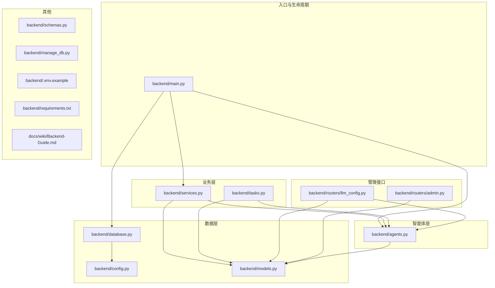
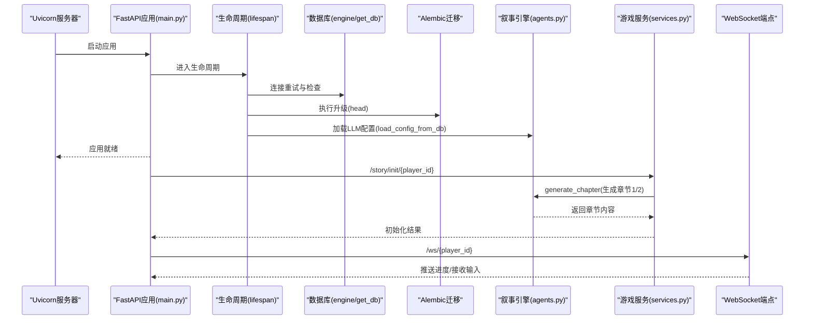
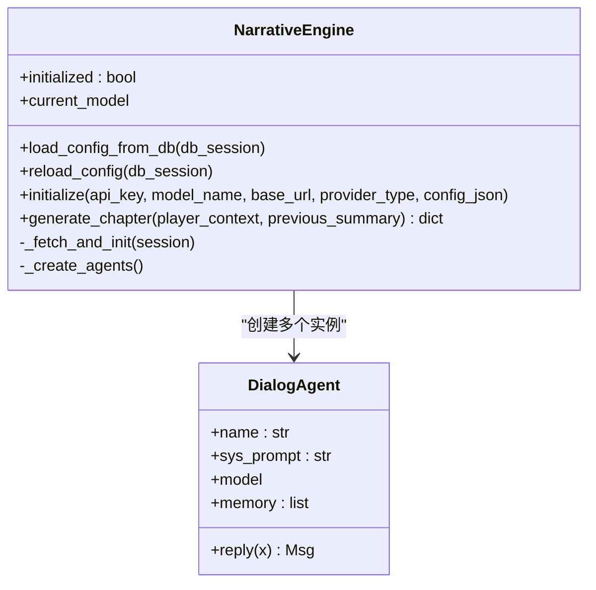
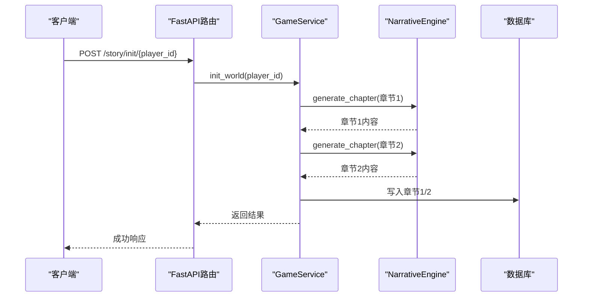
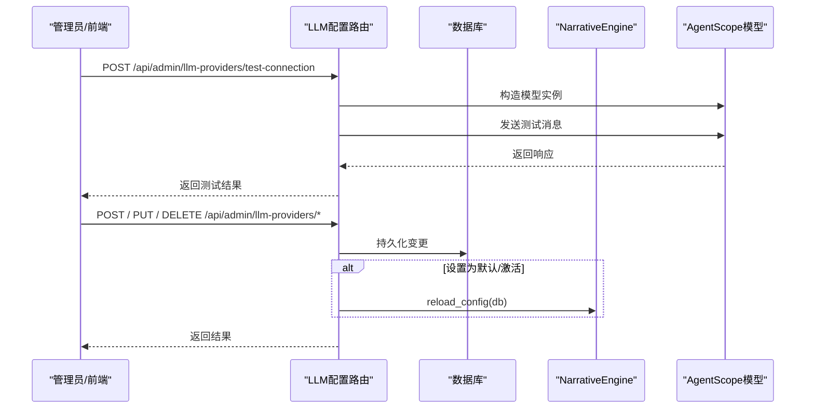
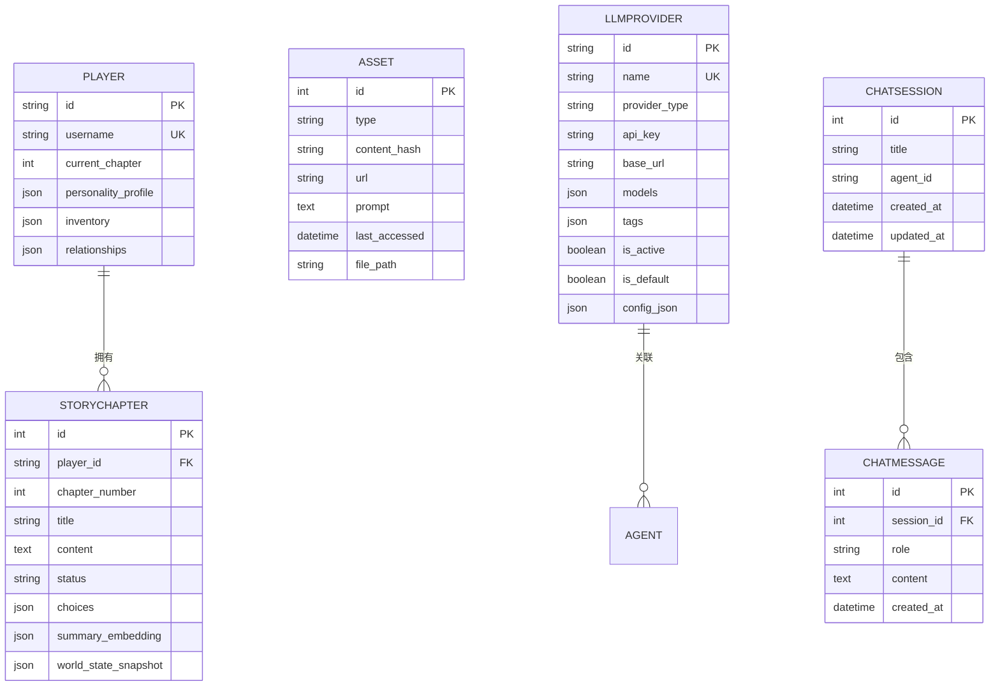
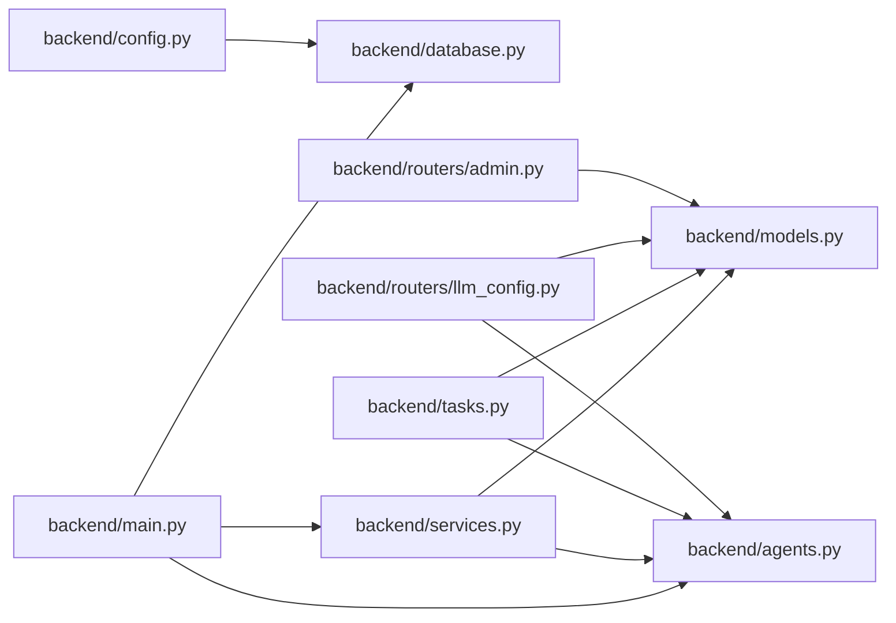
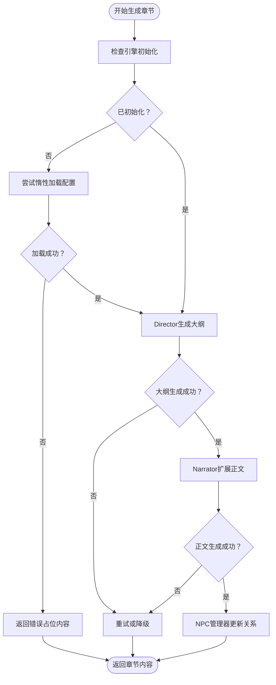

# 叙事引擎故障

<cite>
**本文引用的文件**
- [backend/main.py](file://backend/main.py)
- [backend/agents.py](file://backend/agents.py)
- [backend/config.py](file://backend/config.py)
- [backend/database.py](file://backend/database.py)
- [backend/models.py](file://backend/models.py)
- [backend/services.py](file://backend/services.py)
- [backend/tasks.py](file://backend/tasks.py)
- [backend/routers/llm_config.py](file://backend/routers/llm_config.py)
- [backend/routers/admin.py](file://backend/routers/admin.py)
- [backend/schemas.py](file://backend/schemas.py)
- [backend/manage_db.py](file://backend/manage_db.py)
- [backend/.env.example](file://backend/.env.example)
- [backend/requirements.txt](file://backend/requirements.txt)
- [docs/wiki/Backend-Guide.md](file://docs/wiki/Backend-Guide.md)
</cite>

## 目录
1. [简介](#简介)
2. [项目结构](#项目结构)
3. [核心组件](#核心组件)
4. [架构总览](#架构总览)
5. [详细组件分析](#详细组件分析)
6. [依赖分析](#依赖分析)
7. [性能考虑](#性能考虑)
8. [故障排除指南](#故障排除指南)
9. [结论](#结论)
10. [附录](#附录)

## 简介
本文件面向“叙事引擎故障”场景，聚焦以下关键问题：
- 叙事引擎初始化失败：数据库连接、LLM提供商配置缺失或错误导致的初始化失败。
- 配置加载错误：数据库中未正确设置活动LLM提供商，或模型类型不匹配。
- 章节生成异常：引擎未初始化、模型调用失败、并发访问冲突、状态不同步。
- 引擎重载机制：通过管理接口触发配置重载，避免重启。
- 生命周期管理与错误恢复：启动阶段的数据库迁移与连接重试、运行期异常捕获与降级。
- 性能监控指标与调试技巧：日志级别、连接池参数、异步并发与超时控制。

## 项目结构
后端采用FastAPI + SQLAlchemy异步ORM + AgentScope智能体编排的分层架构：
- 入口与生命周期：FastAPI应用在入口文件中完成数据库连接重试、迁移与叙事引擎配置加载。
- 数据层：异步引擎、会话工厂与ORM模型。
- 业务层：游戏服务封装故事初始化、章节生成与后续章节预生成。
- 智能体层：叙事引擎负责从数据库加载LLM配置并协调多智能体生成章节。
- 管理接口：LLM提供商的增删改查与连接测试，支持触发引擎重载。
- 文档与脚本：后端开发指南、数据库迁移工具。

图表来源
- [backend/main.py](file://backend/main.py#L45-L82)
- [backend/database.py](file://backend/database.py#L1-L31)
- [backend/config.py](file://backend/config.py#L1-L34)
- [backend/models.py](file://backend/models.py#L1-L122)
- [backend/services.py](file://backend/services.py#L1-L66)
- [backend/tasks.py](file://backend/tasks.py#L1-L62)
- [backend/agents.py](file://backend/agents.py#L1-L196)
- [backend/routers/llm_config.py](file://backend/routers/llm_config.py#L1-L203)
- [backend/routers/admin.py](file://backend/routers/admin.py#L1-L112)

章节来源
- [backend/main.py](file://backend/main.py#L1-L173)
- [docs/wiki/Backend-Guide.md](file://docs/wiki/Backend-Guide.md#L1-L108)

## 核心组件
- 叙事引擎（NarrativeEngine）：负责从数据库加载LLM提供商配置，初始化AgentScope模型，创建Director/Narrator/NPC管理智能体，并协调章节生成。
- 游戏服务（GameService）：封装玩家创建、世界初始化（含章节1/2生成）、玩家选择处理等业务流程。
- LLM配置路由器：提供LLM提供商的CRUD与连接测试接口，支持触发引擎重载。
- 数据库与模型：异步引擎、会话工厂与玩家、章节、资产、LLM提供商等模型。
- 后台管理接口：统计、玩家与故事查询、删除等管理能力。

章节来源
- [backend/agents.py](file://backend/agents.py#L43-L196)
- [backend/services.py](file://backend/services.py#L8-L66)
- [backend/routers/llm_config.py](file://backend/routers/llm_config.py#L1-L203)
- [backend/database.py](file://backend/database.py#L1-L31)
- [backend/models.py](file://backend/models.py#L1-L122)
- [backend/routers/admin.py](file://backend/routers/admin.py#L1-L112)

## 架构总览
下图展示从FastAPI启动到章节生成的关键调用链路与数据流。

图表来源
- [backend/main.py](file://backend/main.py#L45-L82)
- [backend/database.py](file://backend/database.py#L1-L31)
- [backend/agents.py](file://backend/agents.py#L49-L99)
- [backend/services.py](file://backend/services.py#L19-L59)

## 详细组件分析

### 叙事引擎（NarrativeEngine）分析
- 初始化流程
  - 从数据库查询活动且优先默认的LLM提供商；若无则回退至环境配置（如存在）。
  - 基于提供商类型与模型名初始化AgentScope模型（DashScope/OpenAI等）。
  - 创建Director/Narrator/NPC管理智能体实例。
- 章节生成流程
  - Director生成大纲 → Narrator扩展为完整文本 → NPC管理器更新NPC关系。
  - 若未初始化，尝试惰性加载；若仍失败，返回错误占位内容。
- 重载机制
  - 通过LLM配置路由器触发reload_config，重新从数据库加载配置。

图表来源
- [backend/agents.py](file://backend/agents.py#L11-L196)

章节来源
- [backend/agents.py](file://backend/agents.py#L43-L196)

### 游戏服务（GameService）分析
- 创建玩家：写入玩家表并返回。
- 初始化世界：先生成世界观消息，再生成章节1与预生成章节2，保存到数据库。
- 处理玩家选择：预留扩展点，当前为空实现。

图表来源
- [backend/services.py](file://backend/services.py#L19-L59)
- [backend/agents.py](file://backend/agents.py#L154-L191)

章节来源
- [backend/services.py](file://backend/services.py#L8-L66)

### LLM配置路由器（LLM Config Router）分析
- 提供LLM提供商的增删改查与连接测试接口。
- 创建/更新时若设为默认/激活，触发引擎重载。
- 连接测试：根据提供商类型动态构造模型实例并发送简单消息以验证连通性。

图表来源
- [backend/routers/llm_config.py](file://backend/routers/llm_config.py#L20-L111)
- [backend/routers/llm_config.py](file://backend/routers/llm_config.py#L112-L203)
- [backend/agents.py](file://backend/agents.py#L150-L153)

章节来源
- [backend/routers/llm_config.py](file://backend/routers/llm_config.py#L1-L203)
- [backend/schemas.py](file://backend/schemas.py#L36-L42)

### 数据库与模型分析
- 异步引擎与会话工厂：启用pool_pre_ping、连接池大小与溢出配置，SQLite使用线程检查参数。
- 模型设计：玩家、章节、资产、LLM提供商、聊天会话与消息等，章节状态字段用于生成阶段跟踪。
- 管理脚本：提供基于Alembic的迁移命令封装。

图表来源
- [backend/models.py](file://backend/models.py#L9-L122)
- [backend/database.py](file://backend/database.py#L1-L31)

章节来源
- [backend/database.py](file://backend/database.py#L1-L31)
- [backend/models.py](file://backend/models.py#L1-L122)
- [backend/manage_db.py](file://backend/manage_db.py#L1-L67)

### 后台管理接口分析
- 统计与列表：玩家数、故事数、资产数、提供商数；玩家与故事列表。
- 删除玩家：删除玩家与其故事（可结合外键约束或显式清理）。

章节来源
- [backend/routers/admin.py](file://backend/routers/admin.py#L16-L112)

## 依赖分析
- 外部依赖：FastAPI、Uvicorn、SQLAlchemy异步、AgentScope、Alembic、Redis等。
- 内部耦合：入口文件依赖数据库、服务与叙事引擎；服务层依赖模型与叙事引擎；管理接口依赖模型与叙事引擎；任务模块依赖模型与叙事引擎。

图表来源
- [backend/main.py](file://backend/main.py#L30-L43)
- [backend/database.py](file://backend/database.py#L1-L31)
- [backend/services.py](file://backend/services.py#L1-L7)
- [backend/tasks.py](file://backend/tasks.py#L1-L6)
- [backend/routers/llm_config.py](file://backend/routers/llm_config.py#L1-L12)
- [backend/routers/admin.py](file://backend/routers/admin.py#L1-L8)
- [backend/config.py](file://backend/config.py#L1-L34)

章节来源
- [backend/requirements.txt](file://backend/requirements.txt#L1-L20)

## 性能考虑
- 连接池与重连：启用pool_pre_ping，合理设置pool_size与max_overflow，降低连接失效导致的请求失败。
- 异步并发：所有数据库与IO密集型操作采用异步模式，避免阻塞事件循环。
- 超时与重试：启动阶段对数据库连接进行有限次重试；模型调用应设置合理的超时与重试策略（可在AgentScope模型层配置）。
- 日志级别：关闭SQLAlchemy与Uvicorn访问日志噪声，保留应用日志以便定位问题。

章节来源
- [backend/database.py](file://backend/database.py#L8-L23)
- [backend/main.py](file://backend/main.py#L14-L28)

## 故障排除指南

### 一、叙事引擎初始化失败
- 根本原因
  - 数据库未连接或迁移未完成，导致无法加载LLM提供商配置。
  - 数据库中无活动LLM提供商，且环境配置未提供有效API密钥。
  - AgentScope初始化失败（模型类型不支持、网络不可达）。
- 诊断步骤
  - 检查数据库连接URL与可达性；确认迁移已执行。
  - 在启动日志中确认是否成功加载LLM配置；若无活动提供商，检查LLM提供商表记录。
  - 验证环境变量API密钥与模型名称；若回退路径未生效，检查配置文件。
- 解决方案
  - 使用管理脚本执行迁移；确保数据库可用。
  - 在管理界面创建并激活一个LLM提供商；必要时设置为默认。
  - 如需临时恢复，可在配置文件中提供API密钥与模型名称。

章节来源
- [backend/main.py](file://backend/main.py#L45-L82)
- [backend/agents.py](file://backend/agents.py#L49-L99)
- [backend/config.py](file://backend/config.py#L7-L34)
- [backend/manage_db.py](file://backend/manage_db.py#L30-L38)

### 二、配置加载错误
- 根本原因
  - 数据库中LLM提供商的provider_type与实际模型不匹配。
  - models字段格式错误或为空，导致选择默认模型失败。
  - 多个提供商同时标记为默认，排序优先级导致非预期选择。
- 诊断步骤
  - 查看LLM提供商表记录，确认provider_type与base_url、models字段格式。
  - 观察初始化日志，确认最终使用的模型名称。
  - 检查是否同时存在多个is_default=true的记录。
- 解决方案
  - 修正provider_type与models格式；确保至少包含一个可用模型。
  - 仅保留一个is_default=true的提供商，或确保其优先级正确。

章节来源
- [backend/agents.py](file://backend/agents.py#L60-L99)
- [backend/models.py](file://backend/models.py#L58-L79)

### 三、章节生成异常
- 根本原因
  - 引擎未初始化（无活动提供商或初始化失败）。
  - 模型调用失败（网络超时、API密钥无效、配额限制）。
  - 并发访问冲突：同一玩家的章节生成任务未做幂等与状态检查。
  - 状态不同步：章节状态字段未按生成流程更新，导致重复生成或跳过。
- 诊断步骤
  - 检查generate_chapter返回内容是否为错误占位；查看初始化日志。
  - 在生成流程中增加阶段检查点（大纲、正文、NPC更新），记录中间结果。
  - 对并发生成任务增加幂等判断与状态锁，避免重复生成。
- 解决方案
  - 在生成前尝试惰性初始化；失败时返回明确错误并引导用户配置提供商。
  - 为每个阶段增加超时与重试；对模型调用异常进行捕获与降级。
  - 使用章节状态字段与唯一索引/锁机制，保证N+1预生成的幂等性。

图表来源
- [backend/agents.py](file://backend/agents.py#L154-L191)
- [backend/tasks.py](file://backend/tasks.py#L7-L56)

章节来源
- [backend/agents.py](file://backend/agents.py#L154-L191)
- [backend/tasks.py](file://backend/tasks.py#L7-L56)

### 四、数据库连接问题
- 根本原因
  - 连接字符串错误、数据库服务未启动、权限不足。
  - 连接池耗尽或连接失效未自动恢复。
- 诊断步骤
  - 检查DATABASE_URL与环境变量；确认数据库可达。
  - 查看连接池参数与pool_pre_ping效果；观察连接异常日志。
  - 使用迁移脚本验证数据库版本与表结构。
- 解决方案
  - 修正连接字符串；确保数据库服务正常。
  - 调整pool_size与max_overflow；启用pool_pre_ping。
  - 使用迁移脚本统一管理数据库版本。

章节来源
- [backend/config.py](file://backend/config.py#L11-L16)
- [backend/database.py](file://backend/database.py#L8-L23)
- [backend/manage_db.py](file://backend/manage_db.py#L30-L38)

### 五、LLM提供商配置错误与模型调用失败
- 根本原因
  - provider_type与模型不匹配；base_url错误；API密钥无效或过期。
  - 模型名称不存在或已被停用；网络超时或限流。
- 诊断步骤
  - 使用LLM配置测试接口验证连通性与模型可用性。
  - 检查provider_type映射与模型实例构造参数。
  - 记录模型调用异常堆栈与响应内容。
- 解决方案
  - 在管理界面创建正确的LLM提供商记录；设置为默认并激活。
  - 使用测试接口先行验证；失败时返回具体错误信息便于定位。

章节来源
- [backend/routers/llm_config.py](file://backend/routers/llm_config.py#L20-L111)
- [backend/agents.py](file://backend/agents.py#L101-L126)

### 六、引擎重载机制与状态同步
- 重载触发
  - 管理接口在创建/更新LLM提供商时，若设为默认或激活，触发reload_config。
- 状态同步
  - 章节状态字段用于跟踪生成阶段；预生成任务需检查目标章节是否存在且状态为ready。
- 并发冲突
  - 对同一玩家的章节生成任务加锁或使用幂等写入；避免重复生成。

章节来源
- [backend/routers/llm_config.py](file://backend/routers/llm_config.py#L133-L137)
- [backend/routers/llm_config.py](file://backend/routers/llm_config.py#L184-L187)
- [backend/tasks.py](file://backend/tasks.py#L7-L22)

### 七、生命周期管理、错误恢复与性能监控
- 生命周期
  - 启动阶段：数据库连接重试、迁移执行、叙事引擎配置加载。
- 错误恢复
  - 初始化失败时返回占位内容并提示配置提供商；模型调用失败时进行重试或降级。
- 性能监控
  - 连接池参数、日志级别、异步并发与超时设置；WebSocket实时推送进度。
- 调试技巧
  - 降低日志级别以便快速定位；在关键节点打印阶段结果；使用测试接口验证LLM连通性。

章节来源
- [backend/main.py](file://backend/main.py#L45-L82)
- [backend/agents.py](file://backend/agents.py#L154-L191)
- [backend/routers/llm_config.py](file://backend/routers/llm_config.py#L20-L111)

## 结论
本指南围绕叙事引擎的初始化、配置加载、章节生成与运行期稳定性提供了系统化的故障排除方法。通过数据库连接与迁移保障、LLM提供商配置校验、引擎重载机制与幂等生成策略，以及完善的日志与监控，可显著提升系统的可靠性与可维护性。

## 附录
- 环境变量示例：数据库URL、Redis URL、各平台API密钥。
- 依赖清单：FastAPI、SQLAlchemy、AgentScope、Alembic等。
- 后端开发指南：组件职责、数据模型与API概览。

章节来源
- [backend/.env.example](file://backend/.env.example#L1-L4)
- [backend/requirements.txt](file://backend/requirements.txt#L1-L20)
- [docs/wiki/Backend-Guide.md](file://docs/wiki/Backend-Guide.md#L1-L108)