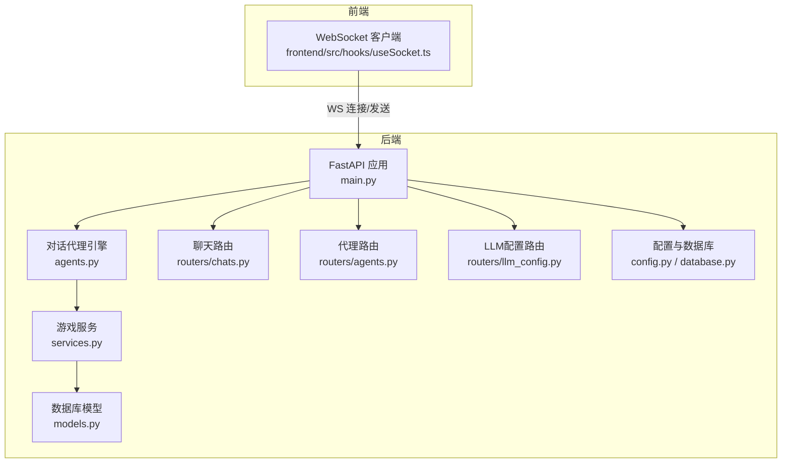
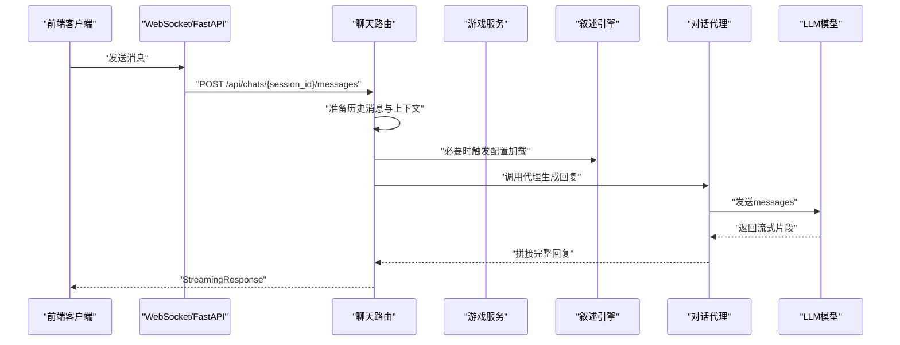
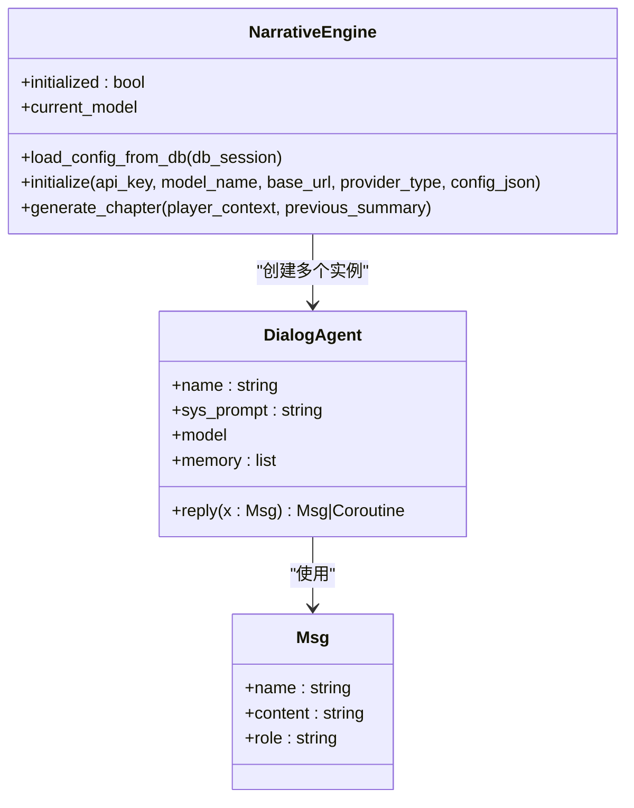
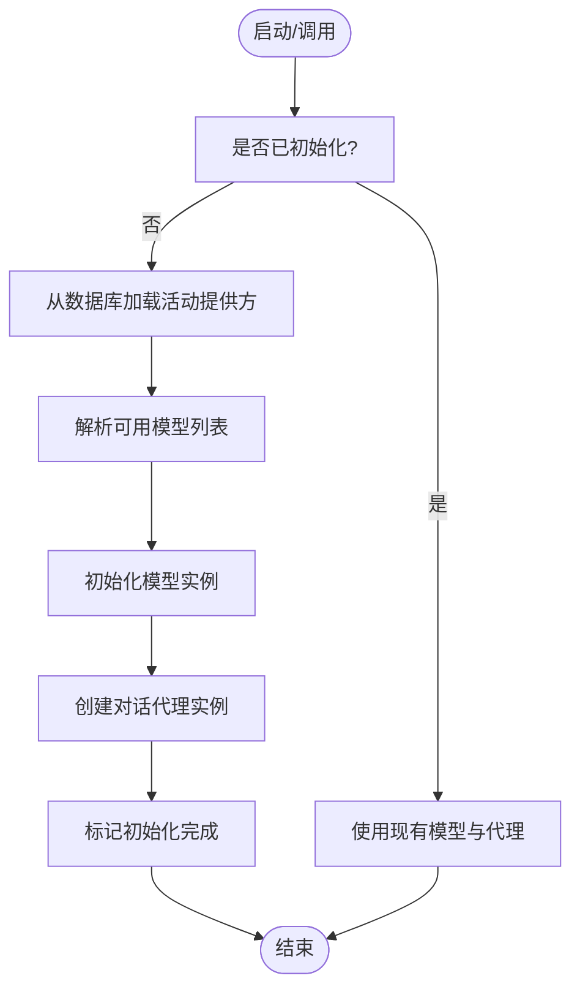
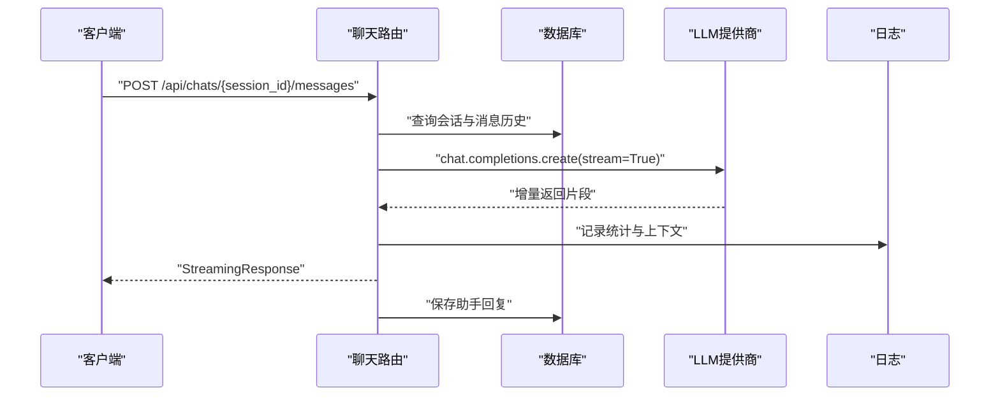
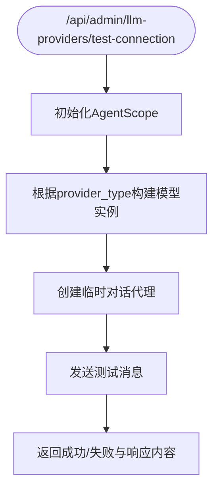
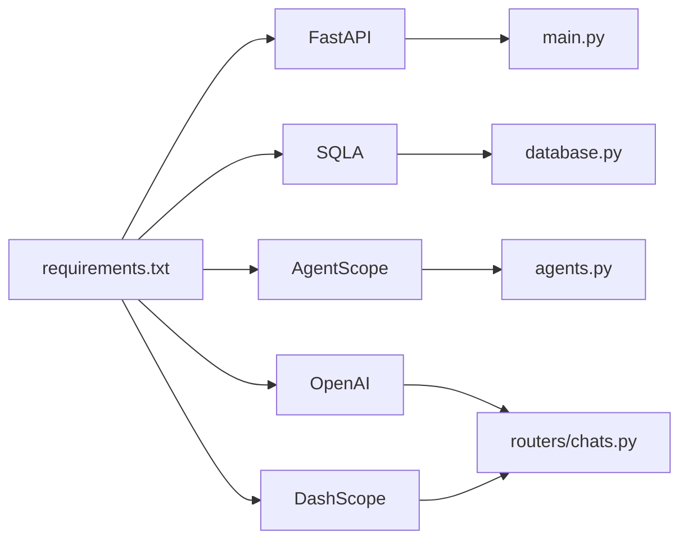

# 对话代理错误

<cite>
**本文引用的文件**
- [backend/agents.py](file://backend/agents.py)
- [backend/main.py](file://backend/main.py)
- [backend/services.py](file://backend/services.py)
- [backend/models.py](file://backend/models.py)
- [backend/routers/agents.py](file://backend/routers/agents.py)
- [backend/routers/chats.py](file://backend/routers/chats.py)
- [backend/routers/llm_config.py](file://backend/routers/llm_config.py)
- [backend/schemas.py](file://backend/schemas.py)
- [backend/config.py](file://backend/config.py)
- [backend/database.py](file://backend/database.py)
- [backend/requirements.txt](file://backend/requirements.txt)
- [frontend/src/hooks/useSocket.ts](file://frontend/src/hooks/useSocket.ts)
</cite>

## 目录
1. [简介](#简介)
2. [项目结构](#项目结构)
3. [核心组件](#核心组件)
4. [架构总览](#架构总览)
5. [详细组件分析](#详细组件分析)
6. [依赖关系分析](#依赖关系分析)
7. [性能考量](#性能考量)
8. [故障排除指南](#故障排除指南)
9. [结论](#结论)
10. [附录](#附录)

## 简介
本指南聚焦于“对话代理”相关错误的系统性故障排除，覆盖以下关键场景：
- 初始化失败：包括系统提示词加载失败、模型初始化失败、引擎懒加载失败等
- 消息处理异常：包括消息格式不匹配、角色映射错误、上下文窗口超限
- 回复生成错误：包括异步调用超时、流式响应中断、内容提取失败
- 内存管理问题：包括对话记忆增长过快、重复消息未去重
- 序列化与反序列化问题：包括数据库JSON字段解析、前端WebSocket消息格式
- 调试与状态检查：包括日志级别、状态追踪、调试工具使用
- 常见错误重现与修复：提供可操作的步骤、修复方案与预防措施

## 项目结构
后端采用FastAPI + SQLAlchemy异步架构，对话代理基于AgentScope封装，提供故事叙述与聊天能力；前端通过WebSocket与后端交互。

图表来源
- [backend/main.py](file://backend/main.py#L30-L103)
- [backend/agents.py](file://backend/agents.py#L11-L196)
- [backend/services.py](file://backend/services.py#L8-L66)
- [backend/models.py](file://backend/models.py#L9-L122)
- [backend/routers/chats.py](file://backend/routers/chats.py#L16-L275)
- [backend/routers/agents.py](file://backend/routers/agents.py#L9-L141)
- [backend/routers/llm_config.py](file://backend/routers/llm_config.py#L14-L203)
- [backend/config.py](file://backend/config.py#L7-L34)
- [backend/database.py](file://backend/database.py#L1-L31)
- [frontend/src/hooks/useSocket.ts](file://frontend/src/hooks/useSocket.ts#L1-L42)

章节来源
- [backend/main.py](file://backend/main.py#L30-L103)
- [backend/agents.py](file://backend/agents.py#L11-L196)
- [backend/routers/chats.py](file://backend/routers/chats.py#L16-L275)

## 核心组件
- 对话代理类：负责维护系统提示词、消息记忆、调用模型生成回复
- 叙述引擎：负责从数据库加载LLM提供方配置，初始化模型实例，并创建多个对话代理
- 游戏服务：负责世界构建与章节生成流程编排
- 聊天路由：负责会话创建、消息历史读取、流式回复生成
- LLM配置路由：负责提供方测试连接、创建/更新/删除提供方
- 数据模型：定义玩家、章节、资产、LLM提供方、聊天会话与消息等实体
- 配置与数据库：提供设置项与异步数据库连接池

章节来源
- [backend/agents.py](file://backend/agents.py#L11-L196)
- [backend/services.py](file://backend/services.py#L8-L66)
- [backend/models.py](file://backend/models.py#L9-L122)
- [backend/routers/chats.py](file://backend/routers/chats.py#L16-L275)
- [backend/routers/llm_config.py](file://backend/routers/llm_config.py#L14-L203)
- [backend/config.py](file://backend/config.py#L7-L34)
- [backend/database.py](file://backend/database.py#L1-L31)

## 架构总览
对话代理的请求链路从WebSocket或聊天接口进入，经由路由层准备消息与上下文，调用叙述引擎或直接调用模型，最终以流式方式返回给客户端。

图表来源
- [backend/routers/chats.py](file://backend/routers/chats.py#L72-L258)
- [backend/agents.py](file://backend/agents.py#L19-L41)
- [backend/services.py](file://backend/services.py#L19-L59)

## 详细组件分析

### 对话代理类（DialogAgent）
职责与行为
- 维护名称、系统提示词、模型实例与消息记忆
- 将传入消息加入记忆，按角色映射构造messages数组
- 调用模型生成回复，提取文本内容，写回记忆并返回Msg对象

图表来源
- [backend/agents.py](file://backend/agents.py#L11-L41)
- [backend/agents.py](file://backend/agents.py#L43-L196)

章节来源
- [backend/agents.py](file://backend/agents.py#L11-L41)

### 叙述引擎（NarrativeEngine）
职责与行为
- 从数据库加载活动的LLM提供方，解析模型列表，初始化AgentScope模型实例
- 创建Director/Narrator/NPC_Manager三个对话代理
- 提供懒加载与重载配置的能力，支持生成章节大纲与正文

图表来源
- [backend/agents.py](file://backend/agents.py#L49-L130)
- [backend/agents.py](file://backend/agents.py#L150-L196)

章节来源
- [backend/agents.py](file://backend/agents.py#L49-L130)

### 聊天路由（Chats）
职责与行为
- 创建会话、列出会话、获取消息历史
- 发送消息时准备历史消息与系统提示，调用对应LLM提供商进行流式生成
- 支持OpenAI/Azure/DashScope等提供商的流式输出与token统计
- 保存助手回复到数据库

图表来源
- [backend/routers/chats.py](file://backend/routers/chats.py#L72-L258)

章节来源
- [backend/routers/chats.py](file://backend/routers/chats.py#L72-L258)

### LLM配置路由（LLM配置）
职责与行为
- 测试连接：根据请求参数动态初始化模型实例并调用对话代理验证连通性
- 创建/更新/删除提供方：支持默认提供方互斥、活动提供方触发重载

图表来源
- [backend/routers/llm_config.py](file://backend/routers/llm_config.py#L20-L110)

章节来源
- [backend/routers/llm_config.py](file://backend/routers/llm_config.py#L20-L110)

## 依赖关系分析
- 后端依赖：FastAPI、SQLAlchemy异步、AgentScope、OpenAI/DashScope等
- 数据库：异步引擎与会话工厂，连接池配置
- 前端：WebSocket客户端，用于实时消息收发

图表来源
- [backend/requirements.txt](file://backend/requirements.txt#L1-L20)
- [backend/database.py](file://backend/database.py#L1-L31)
- [backend/agents.py](file://backend/agents.py#L1-L10)
- [backend/routers/chats.py](file://backend/routers/chats.py#L146-L206)

章节来源
- [backend/requirements.txt](file://backend/requirements.txt#L1-L20)
- [backend/database.py](file://backend/database.py#L1-L31)

## 性能考量
- 异步事件循环：Windows平台使用选择器事件循环策略，避免某些平台问题
- 数据库连接池：SQLite/PostgreSQL均配置连接池与预检，提升并发稳定性
- 流式响应：聊天路由采用流式返回，降低首字节延迟
- 上下文窗口：代理与聊天路由均记录上下文长度与token使用，便于容量规划

章节来源
- [backend/main.py](file://backend/main.py#L6-L11)
- [backend/database.py](file://backend/database.py#L8-L23)
- [backend/routers/chats.py](file://backend/routers/chats.py#L133-L234)

## 故障排除指南

### 一、初始化失败
常见症状
- 启动阶段无法加载LLM配置
- 叙述引擎未初始化导致章节生成失败
- 提供方不存在或未激活

排查步骤
1. 检查数据库中是否存在活动的LLM提供方
   - 若无，检查是否配置了回退设置（如环境变量中的API Key）
2. 观察启动日志，确认是否打印“初始化NarrativeEngine”的信息
3. 使用LLM配置测试接口验证提供方连通性
4. 如需热重载，调用重载接口确保配置生效

修复方案
- 在数据库中创建并激活一个LLM提供方
- 确保提供方的模型列表包含目标模型
- 使用测试接口验证连通性后再进行业务调用

预防措施
- 在部署脚本中先执行数据库迁移
- 在应用启动时捕获并记录初始化异常
- 对提供方变更增加审计与通知

章节来源
- [backend/agents.py](file://backend/agents.py#L49-L130)
- [backend/main.py](file://backend/main.py#L75-L81)
- [backend/routers/llm_config.py](file://backend/routers/llm_config.py#L20-L110)

### 二、消息处理异常
常见症状
- 角色映射错误导致messages结构异常
- 历史消息格式不规范引发流式生成失败
- 上下文长度超限导致截断或报错

排查步骤
1. 检查聊天路由的消息准备逻辑，确认系统提示、用户与助手消息的角色映射
2. 查看日志中记录的输入字符数、历史条数与上下文窗口
3. 确认消息历史按时间升序排列且包含当前用户消息
4. 检查前端WebSocket发送的消息格式是否符合预期

修复方案
- 修正角色映射分支，确保仅接受合法角色
- 对历史消息进行严格校验与清洗
- 调整温度、上下文窗口参数，或裁剪历史消息

预防措施
- 在路由层增加输入校验与默认兜底
- 对长历史进行分页或摘要化处理
- 前端统一消息格式，避免自定义扩展字段

章节来源
- [backend/routers/chats.py](file://backend/routers/chats.py#L118-L142)
- [backend/routers/chats.py](file://backend/routers/chats.py#L144-L209)
- [frontend/src/hooks/useSocket.ts](file://frontend/src/hooks/useSocket.ts#L11-L39)

### 三、回复生成错误
常见症状
- 模型调用抛出异常，流式响应中断
- 内容提取失败导致返回空或非字符串
- 异步调用超时或未正确等待协程

排查步骤
1. 捕获模型调用异常，记录错误信息与上下文
2. 确认代理reply方法中对响应对象的属性访问安全
3. 检查异步调用链是否正确await协程结果
4. 对流式响应进行完整性校验与错误透传

修复方案
- 在模型调用处增加try/catch并返回可识别的错误消息
- 对响应对象进行健壮性判断，保证content为字符串
- 明确异步调用边界，避免遗漏await

预防措施
- 为所有异步路径添加超时与重试策略
- 对外部API调用增加熔断与降级
- 记录详细的调用链日志与指标

章节来源
- [backend/agents.py](file://backend/agents.py#L34-L41)
- [backend/routers/chats.py](file://backend/routers/chats.py#L211-L215)

### 四、内存管理问题
常见症状
- 代理记忆无限增长，占用内存过高
- 重复消息未去重，导致上下文冗余

排查步骤
1. 检查代理memory的追加逻辑，确认是否仅在必要时加入新消息
2. 对历史消息进行去重与长度限制
3. 定期清理旧会话或压缩历史

修复方案
- 实现固定长度的记忆窗口，超出部分丢弃或摘要
- 对重复消息进行哈希比较，避免重复存储

预防措施
- 设定最大记忆条数与最大上下文长度
- 引入LRU缓存策略或定期归档

章节来源
- [backend/agents.py](file://backend/agents.py#L17-L41)

### 五、消息格式不匹配与角色映射错误
常见症状
- messages数组缺少必需字段或角色非法
- 前端发送的消息未包含必要字段

排查步骤
1. 在聊天路由中对每条历史消息的角色进行合法性校验
2. 对前端WebSocket消息进行Schema校验
3. 统一消息结构，确保role/content/name存在

修复方案
- 对非法角色进行回退到user或其他默认值
- 前端发送前进行表单校验与序列化

预防措施
- 在路由层与前端均实施严格的输入校验
- 使用Pydantic模型统一数据契约

章节来源
- [backend/routers/chats.py](file://backend/routers/chats.py#L123-L127)
- [backend/schemas.py](file://backend/schemas.py#L89-L101)

### 六、系统提示词加载失败
常见症状
- 叙述引擎未初始化，章节生成返回错误提示
- 代理reply时系统提示缺失

排查步骤
1. 确认NarrativeEngine是否已从数据库加载配置
2. 检查代理构造时sys_prompt是否正确传递
3. 观察启动日志与错误堆栈

修复方案
- 在生成章节前主动触发配置加载
- 为代理提供默认系统提示作为兜底

预防措施
- 在业务入口统一初始化检查
- 对系统提示词进行版本化管理

章节来源
- [backend/agents.py](file://backend/agents.py#L154-L164)
- [backend/agents.py](file://backend/agents.py#L132-L148)

### 七、消息序列化问题
常见症状
- 数据库JSON字段解析失败
- WebSocket消息反序列化异常

排查步骤
1. 检查数据库JSON字段的存储与读取
2. 校验前端发送的JSON结构是否符合后端Schema
3. 对异常字段进行容错处理

修复方案
- 对JSON字段进行严格校验与默认值填充
- 在路由层对异常JSON进行捕获与友好提示

预防措施
- 使用Pydantic模型自动校验
- 前后端保持一致的数据契约

章节来源
- [backend/models.py](file://backend/models.py#L16-L22)
- [backend/schemas.py](file://backend/schemas.py#L4-L14)

### 八、异步调用超时
常见症状
- 代理reply或聊天流式响应长时间无响应
- WebSocket连接被中间件超时中断

排查步骤
1. 检查模型调用是否阻塞或未正确await
2. 查看日志中是否有超时或网络错误
3. 对外部API调用增加超时与重试

修复方案
- 为模型调用设置合理超时
- 在路由层对异常进行快速失败与错误返回

预防措施
- 统一异步调用模式，避免混用同步/异步
- 引入超时与重试中间件

章节来源
- [backend/routers/chats.py](file://backend/routers/chats.py#L211-L215)

### 九、对话代理状态检查与调试工具
建议做法
- 启用详细日志，记录会话ID、历史条数、输入字符数、token统计
- 使用LLM配置测试接口验证提供方连通性
- 通过WebSocket客户端观察消息往返与错误提示
- 在开发环境开启SQLAlchemy与Uvicorn访问日志以便定位

章节来源
- [backend/routers/chats.py](file://backend/routers/chats.py#L133-L234)
- [backend/routers/llm_config.py](file://backend/routers/llm_config.py#L20-L110)
- [frontend/src/hooks/useSocket.ts](file://frontend/src/hooks/useSocket.ts#L13-L26)

## 结论
通过对对话代理初始化、消息处理、回复生成、内存管理、格式与序列化、异步超时等关键环节的系统化排查与修复，可以显著提升系统的稳定性与可维护性。建议在生产环境中引入完善的日志、监控与告警机制，并持续优化上下文管理与资源配额，确保在高并发场景下的可靠运行。

## 附录

### 常见错误场景与重现步骤
- 场景1：启动后章节生成失败
  - 步骤：启动应用 → 访问章节生成接口 → 观察返回错误
  - 修复：创建活动LLM提供方 → 触发重载 → 再次调用
- 场景2：聊天流式响应中断
  - 步骤：WebSocket发送消息 → 观察响应是否中断
  - 修复：检查模型调用异常与网络状况 → 增加重试与超时
- 场景3：角色映射错误
  - 步骤：发送含非法角色的消息 → 观察生成结果
  - 修复：在路由层对角色进行合法性校验与回退

### 预防措施清单
- 在部署脚本中执行数据库迁移
- 使用测试接口验证提供方连通性
- 对输入进行Schema校验与默认兜底
- 设置合理的上下文长度与记忆窗口
- 为异步调用配置超时与重试
- 开启详细日志并定期巡检