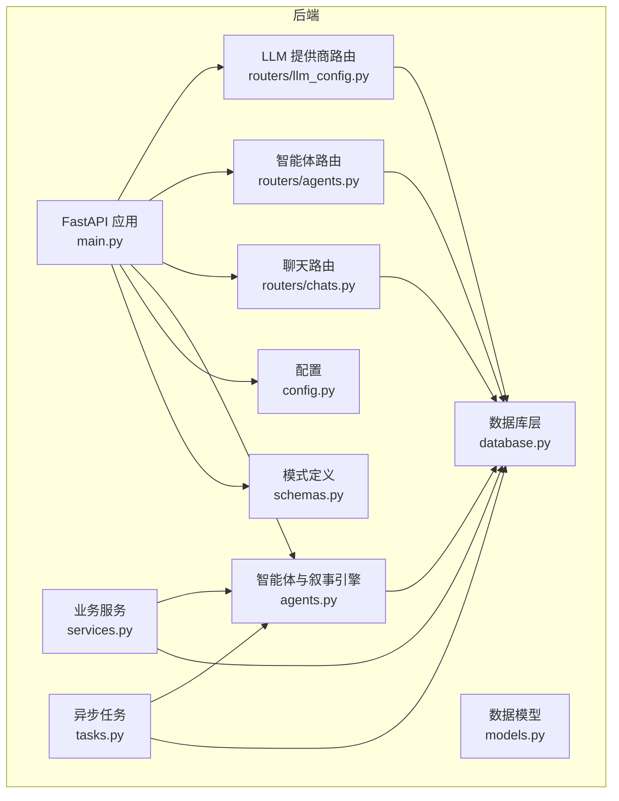
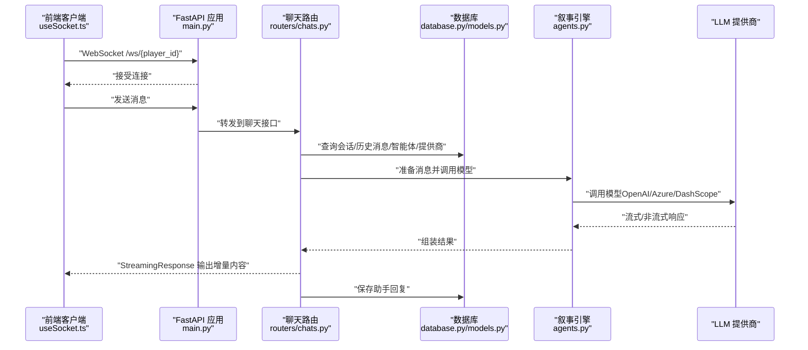
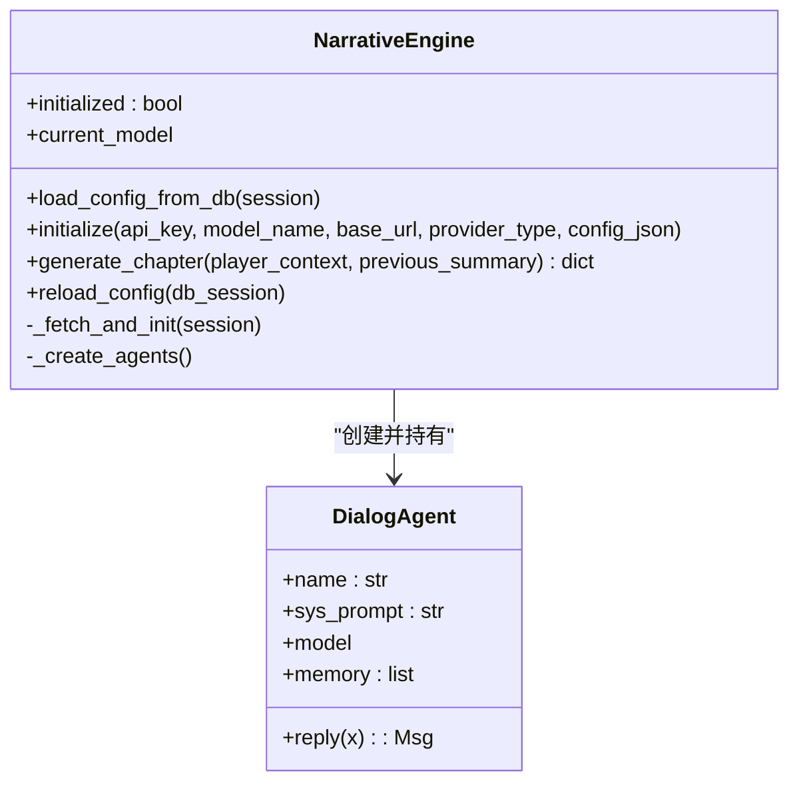
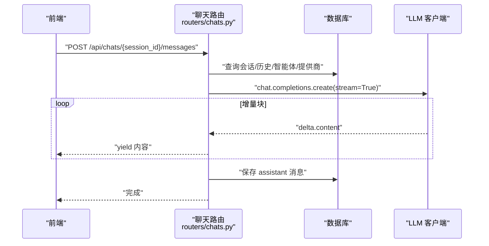
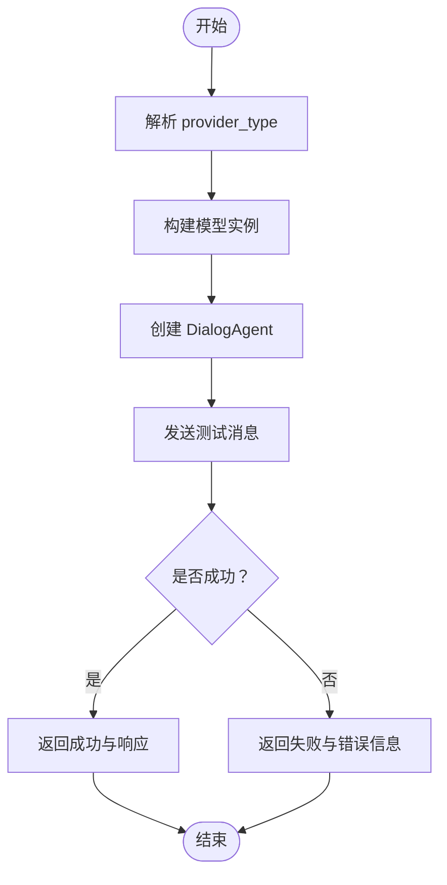
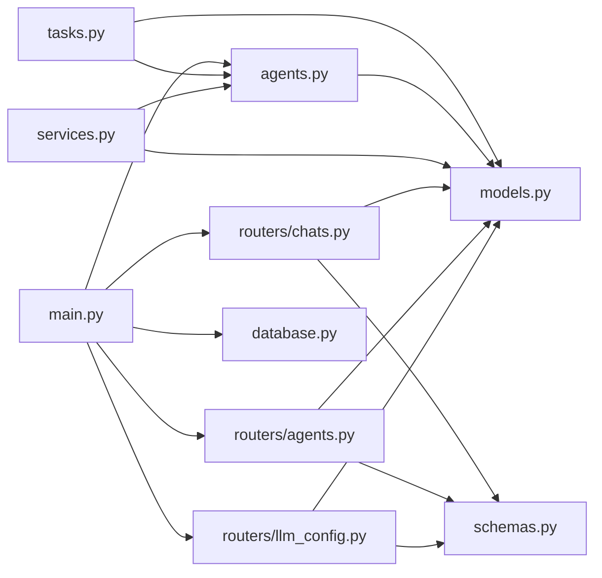

# 智能体系统问题

<cite>
**本文引用的文件**
- [backend/main.py](file://backend/main.py)
- [backend/agents.py](file://backend/agents.py)
- [backend/services.py](file://backend/services.py)
- [backend/models.py](file://backend/models.py)
- [backend/config.py](file://backend/config.py)
- [backend/routers/agents.py](file://backend/routers/agents.py)
- [backend/routers/chats.py](file://backend/routers/chats.py)
- [backend/routers/llm_config.py](file://backend/routers/llm_config.py)
- [backend/database.py](file://backend/database.py)
- [backend/tasks.py](file://backend/tasks.py)
- [backend/schemas.py](file://backend/schemas.py)
- [backend/requirements.txt](file://backend/requirements.txt)
- [frontend/src/hooks/useSocket.ts](file://frontend/src/hooks/useSocket.ts)
</cite>

## 目录
1. [简介](#简介)
2. [项目结构](#项目结构)
3. [核心组件](#核心组件)
4. [架构总览](#架构总览)
5. [详细组件分析](#详细组件分析)
6. [依赖关系分析](#依赖关系分析)
7. [性能考量](#性能考量)
8. [故障排除指南](#故障排除指南)
9. [结论](#结论)
10. [附录](#附录)

## 简介
本文件面向“智能体系统问题”的专项故障排除，聚焦以下场景：
- 智能体运行异常：包括初始化失败、技能调用错误、状态同步异常等
- 多智能体协作失败：包括任务分配冲突、角色职责不清导致的交互阻塞
- NarrativeEngine 执行错误：包括配置加载失败、模型初始化失败、章节生成中断
- Qoder 代理配置问题：包括 LLM 提供商未激活、模型不可用、API 密钥过期或无效
- LLM 提供商集成问题：包括 Azure/OpenAI/DashScope/Gemini/Anthropic 的适配与兼容性
- 响应解析错误与超时处理：包括流式响应中断、token 统计缺失、上下文窗口溢出
- 调试工具、日志分析与性能监控：包括日志级别、StreamingResponse 流式输出、token 使用统计
- 生命周期管理、错误恢复与系统稳定性：包括数据库连接池、Alembic 迁移、AgentScope 初始化与重试

## 项目结构
后端采用 FastAPI + SQLAlchemy Async 架构，核心模块如下：
- 应用入口与生命周期：FastAPI 应用、CORS 中间件、数据库迁移与启动事件
- 智能体与叙事引擎：AgentScope 封装的对话型智能体、NarrativeEngine 章节生成流水线
- 业务服务：TheaterService 负责玩家世界初始化与章节生成调度
- 数据模型与路由：LLM 提供商、智能体、聊天会话与消息的 CRUD 接口
- 异步任务：章节预生成与资源生成
- 前端 WebSocket 客户端：用于与后端 WS 通信

图表来源
- [backend/main.py](file://backend/main.py#L83-L98)
- [backend/database.py](file://backend/database.py#L1-L31)
- [backend/models.py](file://backend/models.py#L1-L122)
- [backend/agents.py](file://backend/agents.py#L43-L196)
- [backend/services.py](file://backend/services.py#L8-L66)
- [backend/routers/llm_config.py](file://backend/routers/llm_config.py#L14-L203)
- [backend/routers/agents.py](file://backend/routers/agents.py#L9-L141)
- [backend/routers/chats.py](file://backend/routers/chats.py#L16-L275)
- [backend/tasks.py](file://backend/tasks.py#L7-L62)
- [backend/config.py](file://backend/config.py#L7-L34)
- [backend/schemas.py](file://backend/schemas.py#L4-L102)

章节来源
- [backend/main.py](file://backend/main.py#L1-L173)
- [backend/database.py](file://backend/database.py#L1-L31)
- [backend/models.py](file://backend/models.py#L1-L122)

## 核心组件
- 应用入口与生命周期
  - 启动阶段执行数据库连接与 Alembic 升级，失败自动重试；尝试从数据库加载 LLM 配置
  - 注册 CORS、路由与静态资源挂载点
- 智能体与叙事引擎
  - DialogAgent：基于 AgentScope 的对话智能体，维护记忆并调用模型
  - NarrativeEngine：负责加载 LLM 提供商配置、初始化模型、协调 Director/Narrator/NPC_Manager 三智能体生成章节内容
- 业务服务
  - TheaterService：创建玩家、初始化世界、生成首章与次章
- 路由与配置
  - LLM 提供商路由：提供测试连接、创建/更新/删除提供商、默认提供商切换
  - 智能体路由：校验提供商与模型可用性，防止越权配置
  - 聊天路由：支持 OpenAI/Azure/DashScope 流式响应，记录 token 使用与上下文统计
- 异步任务
  - 预生成下一章内容，触发资源生成
- 前端 WebSocket
  - 通过 /ws/player_id 与后端交互，当前实现为回显消息

章节来源
- [backend/main.py](file://backend/main.py#L45-L82)
- [backend/agents.py](file://backend/agents.py#L11-L196)
- [backend/services.py](file://backend/services.py#L8-L66)
- [backend/routers/llm_config.py](file://backend/routers/llm_config.py#L20-L111)
- [backend/routers/agents.py](file://backend/routers/agents.py#L15-L55)
- [backend/routers/chats.py](file://backend/routers/chats.py#L72-L258)
- [backend/tasks.py](file://backend/tasks.py#L7-L62)
- [frontend/src/hooks/useSocket.ts](file://frontend/src/hooks/useSocket.ts#L1-L43)

## 架构总览
下图展示从客户端到后端服务、数据库与 LLM 提供商的整体调用链路。

图表来源
- [backend/main.py](file://backend/main.py#L157-L169)
- [backend/routers/chats.py](file://backend/routers/chats.py#L72-L258)
- [backend/agents.py](file://backend/agents.py#L154-L191)
- [backend/database.py](file://backend/database.py#L1-L31)
- [backend/models.py](file://backend/models.py#L80-L122)

## 详细组件分析

### 组件一：NarrativeEngine 与 DialogAgent
- 设计要点
  - Lazy 初始化：首次使用时从数据库加载活动提供商并初始化模型
  - 三智能体流水线：Director 负责大纲、Narrator 负责润色、NPC_Manager 负责关系更新
  - 支持多种提供商类型（OpenAI、DashScope 等），通过 AgentScope 抽象统一调用
- 关键路径
  - 加载配置：从数据库查询活动提供商，解析模型列表，初始化模型实例
  - 生成章节：按顺序调用三个智能体，返回大纲、正文与 NPC 更新
- 错误点
  - 无活动提供商：返回错误提示，避免空指针
  - 模型初始化失败：捕获异常并记录，保持可恢复状态

图表来源
- [backend/agents.py](file://backend/agents.py#L11-L196)

章节来源
- [backend/agents.py](file://backend/agents.py#L43-L196)

### 组件二：聊天路由与流式响应
- 设计要点
  - 支持 OpenAI/Azure 与 DashScope 的流式输出，聚合增量内容并统计 token
  - 记录输入字符数、上下文窗口、温度、历史条数等日志，便于性能分析
  - 保存助手回复至数据库，并更新会话时间戳
- 关键路径
  - 发送消息：校验会话与智能体存在性，准备历史消息与系统提示
  - 选择客户端：根据提供商类型选择 OpenAI 或 DashScope 客户端
  - 流式生成：逐块推送增量内容，最后汇总完整响应
  - 保存消息：在新会话中写入助手回复并刷新会话时间
- 错误点
  - 提供商不可用：返回错误提示
  - 异常捕获：记录错误并返回错误消息，保证流式通道可继续

图表来源
- [backend/routers/chats.py](file://backend/routers/chats.py#L72-L258)

章节来源
- [backend/routers/chats.py](file://backend/routers/chats.py#L72-L258)

### 组件三：LLM 提供商路由与连接测试
- 设计要点
  - 提供商 CRUD：名称唯一、默认提供商互斥、活动变更触发引擎重载
  - 连接测试：动态构造模型实例，调用 DialogAgent 发送测试消息，返回成功/失败与响应内容
- 关键路径
  - 创建/更新提供商：校验唯一性与默认互斥，必要时触发重载
  - 连接测试：根据 provider_type 选择模型类型，构造 DialogAgent 并发起一次对话
- 错误点
  - API 密钥无效或过期：测试失败
  - 模型不匹配：前端需确保从提供商模型列表中选择

图表来源
- [backend/routers/llm_config.py](file://backend/routers/llm_config.py#L20-L111)

章节来源
- [backend/routers/llm_config.py](file://backend/routers/llm_config.py#L112-L188)

### 组件四：智能体路由与配置校验
- 设计要点
  - 创建/更新智能体时，严格校验提供商存在性与模型可用性（来自提供商模型列表）
  - 名称唯一性与更新时的冲突处理
- 关键路径
  - 校验提供商与模型列表，若列表为空则跳过严格校验
  - 写入数据库并返回最新对象
- 错误点
  - 选择的模型不在提供商列表：返回 400
  - 提供商不存在：返回 400

章节来源
- [backend/routers/agents.py](file://backend/routers/agents.py#L15-L55)
- [backend/routers/agents.py](file://backend/routers/agents.py#L81-L126)

### 组件五：业务服务与世界初始化
- 设计要点
  - 创建玩家后，调用 NarrativeEngine 生成世界观与首章、次章
  - 将生成结果持久化到 StoryChapter 表
- 关键路径
  - 生成世界：Director 生成世界观
  - 生成首章与次章：Narrator 生成正文
  - 保存章节：设置状态与快照
- 错误点
  - 引擎未初始化：返回错误提示
  - 数据库写入异常：上抛 HTTP 异常

章节来源
- [backend/services.py](file://backend/services.py#L19-L59)

### 组件六：异步任务与章节预生成
- 设计要点
  - 预生成下一章：检查是否存在、状态是否 ready，否则生成并保存
  - 触发资源生成（占位）
- 关键路径
  - 查询上下文章节摘要
  - 调用 NarrativeEngine 生成新章节
  - 写入数据库并标记状态
- 错误点
  - 上游章节缺失：直接返回
  - 已存在且状态 ready：跳过

章节来源
- [backend/tasks.py](file://backend/tasks.py#L7-L62)

## 依赖关系分析
- 外部依赖
  - FastAPI、SQLAlchemy Async、AgentScope、OpenAI、DashScope、Alembic、Redis
- 内部耦合
  - routers 依赖 models 与 schemas，依赖 database 获取会话
  - services 依赖 agents 与 models
  - agents 依赖 database 与 models
  - tasks 依赖 agents 与 models
- 循环依赖
  - 未发现循环导入；模块职责清晰

图表来源
- [backend/routers/llm_config.py](file://backend/routers/llm_config.py#L1-L203)
- [backend/routers/agents.py](file://backend/routers/agents.py#L1-L141)
- [backend/routers/chats.py](file://backend/routers/chats.py#L1-L275)
- [backend/services.py](file://backend/services.py#L1-L66)
- [backend/agents.py](file://backend/agents.py#L1-L196)
- [backend/tasks.py](file://backend/tasks.py#L1-L62)
- [backend/models.py](file://backend/models.py#L1-L122)
- [backend/schemas.py](file://backend/schemas.py#L1-L102)
- [backend/main.py](file://backend/main.py#L40-L98)
- [backend/database.py](file://backend/database.py#L1-L31)

章节来源
- [backend/requirements.txt](file://backend/requirements.txt#L1-L20)

## 性能考量
- 日志级别与噪声控制
  - 关闭 SQLAlchemy 与 Uvicorn 访问日志，仅保留应用日志，降低终端噪声
- 数据库连接池
  - AsyncEngine 使用连接池与 pool_pre_ping，提升稳定性
- 流式响应
  - 聊天路由支持增量输出，结合 token 统计与上下文窗口评估，避免超限
- 异步任务
  - 章节预生成与资源生成分离，避免主线程阻塞

章节来源
- [backend/main.py](file://backend/main.py#L14-L28)
- [backend/database.py](file://backend/database.py#L8-L23)
- [backend/routers/chats.py](file://backend/routers/chats.py#L144-L234)

## 故障排除指南

### 一、智能体运行异常
- 症状
  - 智能体无法回复、报错“AI Engine not initialized”
  - 对话无响应或返回错误提示
- 根因定位
  - 未配置活动 LLM 提供商：NarrativeEngine 初始化失败
  - API 密钥为空或无效：模型初始化失败
  - 模型名称不匹配：提供商模型列表中未包含该模型
- 诊断步骤
  - 检查数据库中 LLMProvider 是否存在且 is_active=True
  - 在管理员面板测试连接，确认提供商类型与模型可用
  - 查看启动日志与聊天日志中的错误信息
- 解决方案
  - 在管理员界面创建/启用提供商，设置为 is_active=True
  - 确保 provider_type 与模型名称匹配
  - 若本地开发，检查 .env 中 OPENAI_API_KEY 等配置

章节来源
- [backend/agents.py](file://backend/agents.py#L49-L100)
- [backend/agents.py](file://backend/agents.py#L154-L164)
- [backend/routers/llm_config.py](file://backend/routers/llm_config.py#L20-L111)

### 二、多智能体协作失败
- 症状
  - 章节生成卡住、NPC 更新未生效
  - 三智能体流水线中断
- 根因定位
  - 模型调用失败导致后续智能体无法继续
  - 上下文窗口不足引发截断
- 诊断步骤
  - 查看聊天日志中的输入字符数、上下文窗口与 token 使用
  - 检查前一章内容长度与 truncation 设置
- 解决方案
  - 适当降低 temperature 或缩短历史消息
  - 调整 context_window 或分段生成
  - 优化系统提示与角色职责边界

章节来源
- [backend/routers/chats.py](file://backend/routers/chats.py#L129-L234)
- [backend/agents.py](file://backend/agents.py#L154-L191)

### 三、NarrativeEngine 执行错误
- 症状
  - 启动时报“Failed to load LLM config on startup”
  - 生成章节返回错误提示
- 根因定位
  - 数据库迁移未完成或 Alembic 升级失败
  - 启动阶段重试机制未成功
- 诊断步骤
  - 查看启动日志中数据库连接与迁移输出
  - 手动执行 Alembic 升级 head
- 解决方案
  - 确保数据库可达且权限正确
  - 手动运行迁移命令，确认表结构完整

章节来源
- [backend/main.py](file://backend/main.py#L45-L82)
- [backend/agents.py](file://backend/agents.py#L76-L78)

### 四、Qoder 代理配置问题
- 症状
  - 创建/更新智能体时报“Provider not found”或“Model not available”
  - 智能体无法对话
- 根因定位
  - 提供商不存在或未激活
  - 智能体 model 不在提供商 models 列表中
- 诊断步骤
  - 在智能体路由中查看校验逻辑
  - 确认提供商 models 字段格式（JSON 列表或字符串）
- 解决方案
  - 重新选择提供商与模型，确保模型在列表内
  - 若 models 为字符串，确保 JSON 可解析

章节来源
- [backend/routers/agents.py](file://backend/routers/agents.py#L22-L50)
- [backend/routers/agents.py](file://backend/routers/agents.py#L96-L120)

### 五、LLM 提供商集成问题
- 症状
  - “Provider not supported for streaming yet.” 或连接失败
  - Azure/OpenAI/DashScope 调用异常
- 根因定位
  - provider_type 与实际实现不一致
  - base_url、api_key 配置错误
- 诊断步骤
  - 使用管理员面板“测试连接”，验证 provider_type 与模型
  - 查看聊天日志中的提供商类型与请求参数
- 解决方案
  - 正确设置 provider_type（openai、azure、dashscope、anthropic、gemini）
  - 确保 base_url 与 api_key 正确
  - 对 DashScope 使用增量输出参数

章节来源
- [backend/routers/chats.py](file://backend/routers/chats.py#L144-L209)
- [backend/routers/llm_config.py](file://backend/routers/llm_config.py#L32-L87)

### 六、API 密钥过期与模型调用失败
- 症状
  - 测试连接失败、聊天接口返回错误
- 根因定位
  - OPENAI_API_KEY、CLAUDE_API_KEY、GEMINI_API_KEY 为空或过期
  - 模型名称不存在或被禁用
- 诊断步骤
  - 检查 .env 文件与环境变量
  - 使用测试连接接口快速验证
- 解决方案
  - 更新 .env 中的密钥
  - 在管理员界面更新提供商配置并设为 is_active

章节来源
- [backend/config.py](file://backend/config.py#L21-L28)
- [backend/routers/llm_config.py](file://backend/routers/llm_config.py#L20-L111)

### 七、响应解析错误与超时处理
- 症状
  - 流式响应中断、token 统计缺失、上下文超限
- 根因定位
  - LLM 返回格式异常或网络波动
  - 历史消息过多导致上下文窗口不足
- 诊断步骤
  - 查看聊天日志中的 usage 与上下文使用率
  - 检查历史消息条数与字符数
- 解决方案
  - 分段生成、裁剪历史、降低 temperature
  - 增加 context_window 或改用更高规格模型

章节来源
- [backend/routers/chats.py](file://backend/routers/chats.py#L217-L234)

### 八、调试工具、日志分析与性能监控
- 调试工具
  - 管理员面板“测试连接”接口：快速验证提供商连通性
  - 聊天日志：记录输入字符数、上下文窗口、token 使用与输出摘要
- 日志分析
  - 启动阶段：关注数据库连接与 Alembic 升级日志
  - 运行阶段：关注聊天路由中的错误日志与异常栈
- 性能监控指标
  - 输入/输出字符数、总字符数、token 使用总量、上下文使用率
  - 历史消息条数与温度设置

章节来源
- [backend/routers/llm_config.py](file://backend/routers/llm_config.py#L20-L111)
- [backend/routers/chats.py](file://backend/routers/chats.py#L133-L234)
- [backend/main.py](file://backend/main.py#L14-L28)

### 九、智能体生命周期管理与错误恢复
- 生命周期
  - 启动：数据库连接与迁移、NarrativeEngine 配置加载
  - 运行：聊天流式生成、章节预生成、资源生成
  - 关闭：WS 连接关闭、会话清理
- 错误恢复
  - 数据库连接失败自动重试
  - 提供商变更时触发配置重载
  - 流式响应异常时记录错误并返回错误消息
- 系统稳定性
  - 连接池与 pool_pre_ping
  - Alembic 迁移独立执行，避免与异步上下文冲突

章节来源
- [backend/main.py](file://backend/main.py#L45-L82)
- [backend/database.py](file://backend/database.py#L8-L23)
- [backend/routers/llm_config.py](file://backend/routers/llm_config.py#L133-L137)

## 结论
本故障排除文档围绕智能体系统的关键路径与常见问题，提供了从根因定位到解决方案的闭环流程。建议在生产环境中：
- 严格管理 LLM 提供商配置与密钥轮换
- 使用测试连接接口进行上线前验证
- 建立完善的日志与监控体系，关注上下文使用率与 token 统计
- 通过异步任务与流式响应提升用户体验与系统吞吐

## 附录
- 快速检查清单
  - 是否存在活动提供商且 is_active=True
  - provider_type 与模型名称是否匹配
  - .env 中密钥是否有效
  - 数据库迁移是否完成
  - 聊天日志中是否有 usage 与上下文使用率
  - WebSocket 是否正常连接与收发