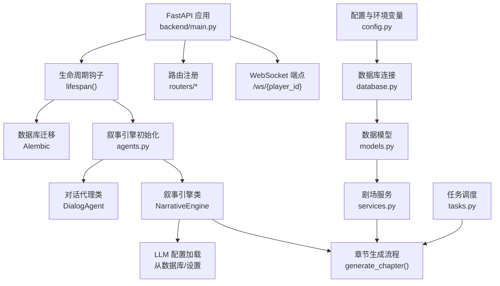
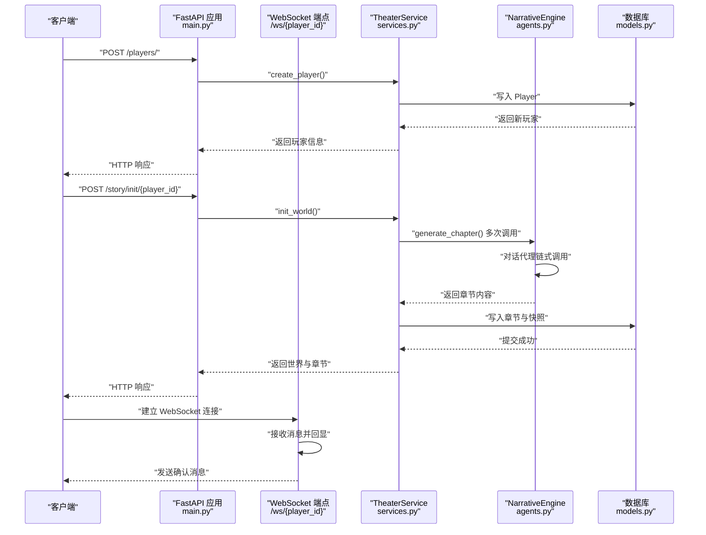
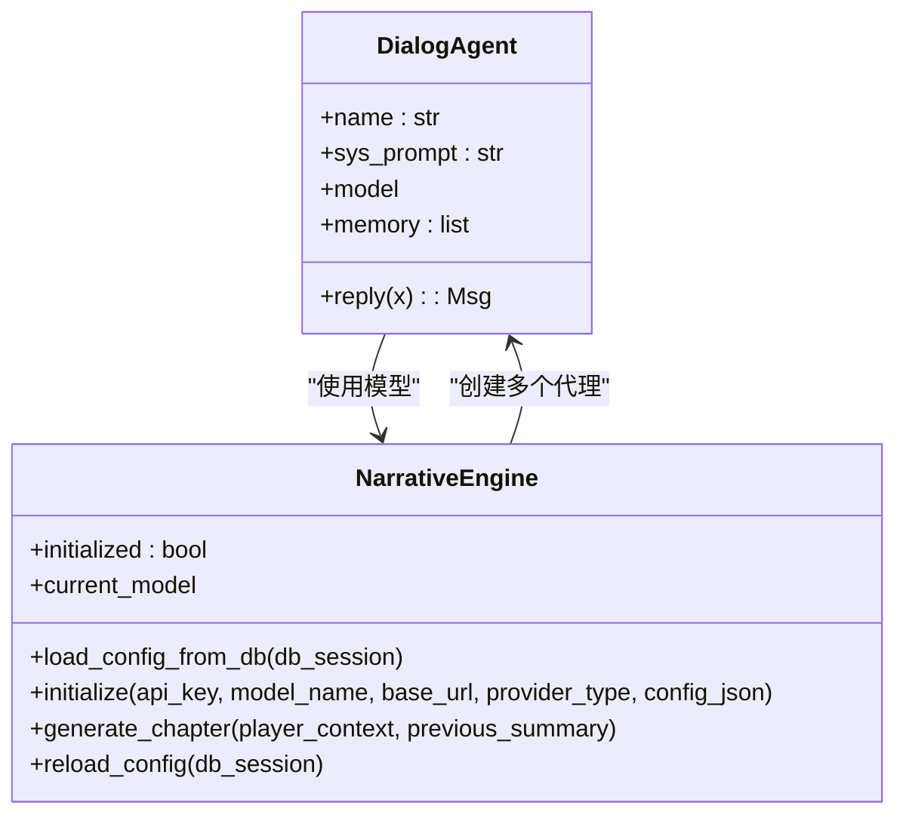
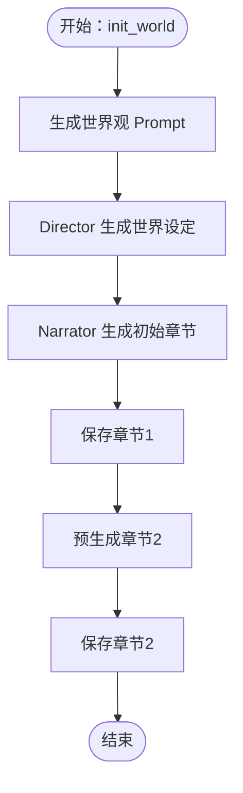
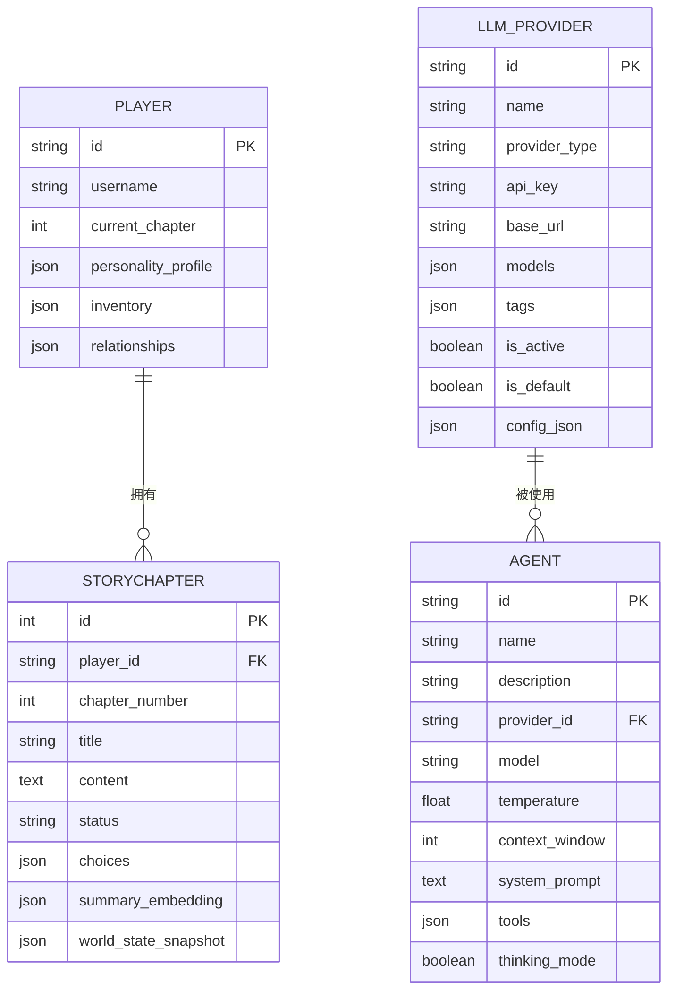
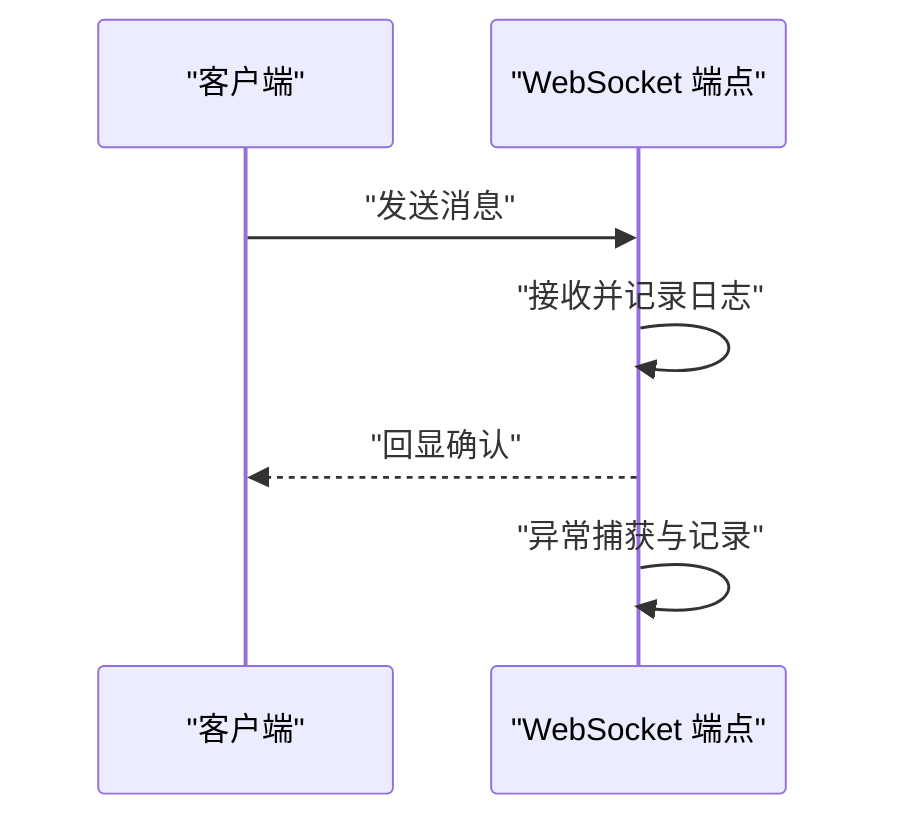
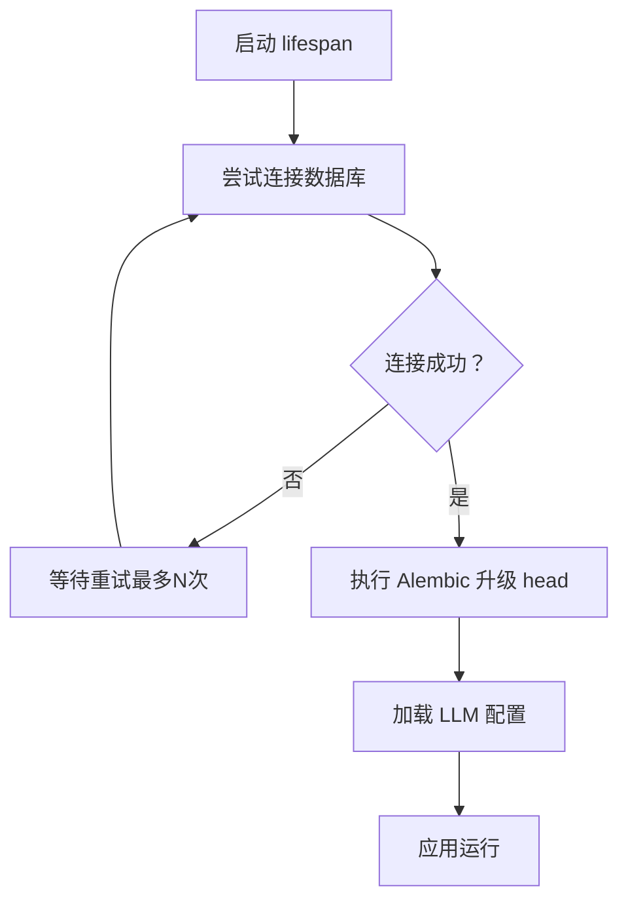
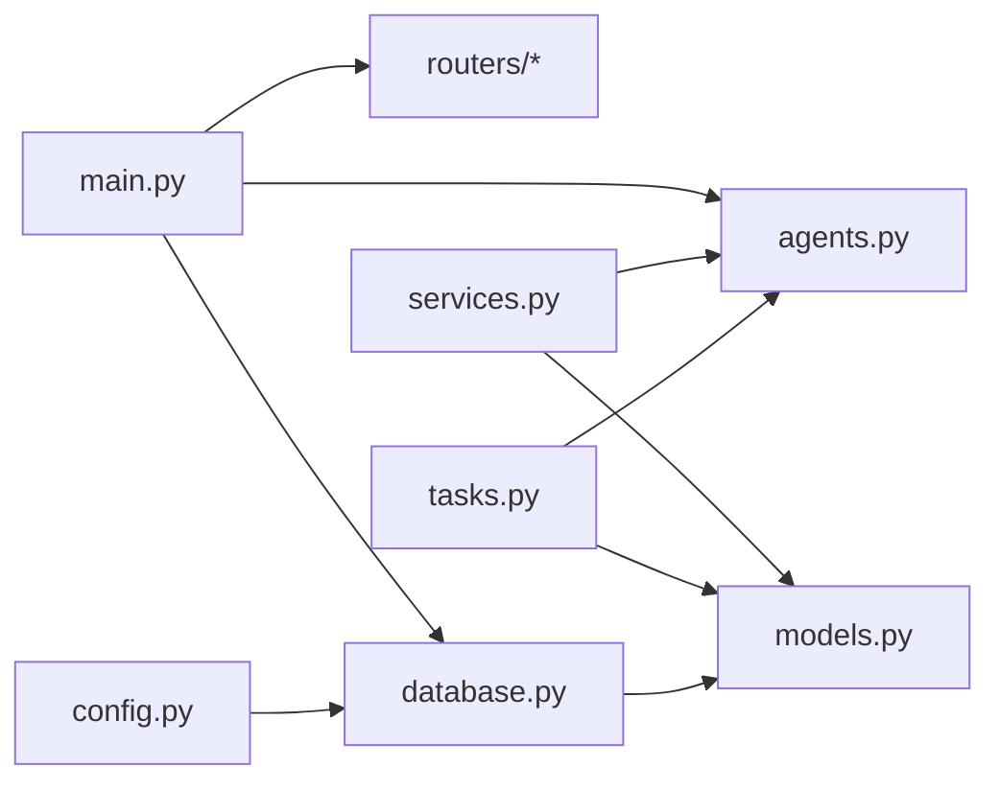

# 智能体调试工具

<cite>
**本文引用的文件**
- [backend/main.py](file://backend/main.py)
- [backend/agents.py](file://backend/agents.py)
- [backend/services.py](file://backend/services.py)
- [backend/models.py](file://backend/models.py)
- [backend/routers/agents.py](file://backend/routers/agents.py)
- [backend/config.py](file://backend/config.py)
- [backend/database.py](file://backend/database.py)
- [backend/schemas.py](file://backend/schemas.py)
- [backend/tasks.py](file://backend/tasks.py)
- [backend/manage_db.py](file://backend/manage_db.py)
</cite>

## 目录
1. [简介](#简介)
2. [项目结构](#项目结构)
3. [核心组件](#核心组件)
4. [架构总览](#架构总览)
5. [详细组件分析](#详细组件分析)
6. [依赖关系分析](#依赖关系分析)
7. [性能考量](#性能考量)
8. [故障排除指南](#故障排除指南)
9. [结论](#结论)
10. [附录](#附录)

## 简介
本指南面向“智能体调试工具”的使用者与维护者，聚焦于智能体状态监控、日志分析、性能追踪、内置调试接口、断点与消息流跟踪、生命周期检查、内存使用监控、并发问题诊断、调试脚本模板、日志过滤技巧、错误堆栈分析方法，以及智能体测试框架、单元测试与集成测试策略。文档基于后端代码库进行深入分析，帮助快速定位与解决智能体运行中的常见问题。

## 项目结构
后端采用 FastAPI + SQLAlchemy 异步 ORM 架构，围绕“叙事引擎”与“剧场服务”两大核心模块组织业务逻辑；数据库通过 Alembic 进行迁移管理；前端采用 Next.js（不在本指南重点范围内）。调试相关的入口包括：
- 应用启动与生命周期：FastAPI 的 lifespan 钩子负责数据库连接与迁移、叙事引擎初始化
- 调试接口：WebSocket 端点用于消息流跟踪与交互
- 内置日志：统一的日志配置与日志级别控制
- 数据模型：玩家、章节、LLM 提供商等实体定义
- 任务与后台生成：章节预生成与资源生成任务

图表来源
- [backend/main.py](file://backend/main.py#L45-L81)
- [backend/agents.py](file://backend/agents.py#L43-L191)
- [backend/services.py](file://backend/services.py#L8-L59)
- [backend/models.py](file://backend/models.py#L9-L122)
- [backend/database.py](file://backend/database.py#L1-L31)
- [backend/config.py](file://backend/config.py#L1-L34)
- [backend/tasks.py](file://backend/tasks.py#L1-L62)

章节来源
- [backend/main.py](file://backend/main.py#L1-L173)
- [backend/agents.py](file://backend/agents.py#L1-L196)
- [backend/services.py](file://backend/services.py#L1-L66)
- [backend/models.py](file://backend/models.py#L1-L122)
- [backend/database.py](file://backend/database.py#L1-L31)
- [backend/config.py](file://backend/config.py#L1-L34)
- [backend/tasks.py](file://backend/tasks.py#L1-L62)

## 核心组件
- 应用与生命周期
  - FastAPI 应用在 lifespan 中执行数据库连接与迁移、叙事引擎配置加载
  - 启动时关闭 SQLAlchemy 与 Uvicorn 访问日志，仅保留应用日志，便于调试
- 叙事引擎与对话代理
  - NarrativeEngine 负责从数据库或默认设置加载 LLM 配置，按提供商类型初始化模型，并创建多个对话代理
  - DialogAgent 维护对话记忆，封装消息格式化与模型调用
- 剧场服务
  - TheaterService 将世界构建、初始章节生成与后续章节预生成串联起来，调用叙事引擎并持久化结果
- 数据层
  - 定义 Player、StoryChapter、LLMProvider、Agent、ChatSession、ChatMessage 等模型，支撑智能体状态与消息流存储
- 路由与调试接口
  - 提供 /ws/{player_id} WebSocket 端点，便于实时观察消息往返与状态变化
- 任务与后台生成
  - tasks.py 实现章节预生成与资源生成的异步任务，支持并发扩展

章节来源
- [backend/main.py](file://backend/main.py#L13-L28)
- [backend/agents.py](file://backend/agents.py#L43-L191)
- [backend/services.py](file://backend/services.py#L8-L59)
- [backend/models.py](file://backend/models.py#L9-L122)
- [backend/routers/agents.py](file://backend/routers/agents.py#L1-L141)
- [backend/tasks.py](file://backend/tasks.py#L1-L62)

## 架构总览
下图展示从请求到智能体生成内容的完整链路，包括日志与错误处理路径：

图表来源
- [backend/main.py](file://backend/main.py#L128-L170)
- [backend/services.py](file://backend/services.py#L19-L59)
- [backend/agents.py](file://backend/agents.py#L154-L191)
- [backend/models.py](file://backend/models.py#L24-L44)

## 详细组件分析

### 组件一：叙事引擎与对话代理
- 设计要点
  - 使用 AgentScope 初始化不同提供商的模型（如 OpenAI、DashScope）
  - 通过 DialogAgent 维护记忆与消息格式化，确保系统提示、用户与助手角色正确映射
  - NarrativeEngine 支持从数据库动态加载配置，实现“热切换”
- 调试建议
  - 在 initialize 与 _fetch_and_init 中增加更详细的日志，记录提供商类型、模型名、基础 URL
  - 对对话代理的 memory 进行周期性快照，便于回放与一致性检查
  - 在 generate_chapter 中对每个阶段的结果进行结构化日志输出

图表来源
- [backend/agents.py](file://backend/agents.py#L11-L191)

章节来源
- [backend/agents.py](file://backend/agents.py#L11-L191)

### 组件二：剧场服务与章节生成
- 设计要点
  - init_world 先生成世界观，再生成初始章节与下一章节草稿
  - generate_chapter 通过三个代理协作完成大纲、正文与 NPC 更新
- 调试建议
  - 在每次代理调用前后记录输入上下文与输出摘要，便于定位异常阶段
  - 对数据库写入操作增加事务回滚与重试策略，避免部分失败导致状态不一致

图表来源
- [backend/services.py](file://backend/services.py#L19-L59)

章节来源
- [backend/services.py](file://backend/services.py#L8-L59)

### 组件三：数据模型与状态监控
- 设计要点
  - Player、StoryChapter、LLMProvider、Agent 等模型定义了智能体状态与消息流的关键字段
  - StoryChapter 的 status 字段可用于监控章节生成进度
- 调试建议
  - 增加章节状态机校验，防止并发写入导致的状态冲突
  - 对敏感字段（如 NPC 关系）进行变更审计日志

图表来源
- [backend/models.py](file://backend/models.py#L9-L122)

章节来源
- [backend/models.py](file://backend/models.py#L9-L122)

### 组件四：WebSocket 调试接口与消息流跟踪
- 设计要点
  - /ws/{player_id} 接受文本消息并回显，便于实时观察消息往返
- 调试建议
  - 在接收与发送处增加结构化日志，记录时间戳、消息长度与摘要
  - 对异常进行捕获并记录堆栈，避免连接中断

图表来源
- [backend/main.py](file://backend/main.py#L157-L169)

章节来源
- [backend/main.py](file://backend/main.py#L157-L169)

### 组件五：数据库连接与迁移
- 设计要点
  - 异步引擎与连接池配置，SQLite/PostgreSQL 双模式支持
  - 管理脚本 manage_db.py 提供迁移命令封装
- 调试建议
  - 在 lifespan 中增加连接失败重试与告警
  - 使用 Alembic 升级 head 前先备份数据库

图表来源
- [backend/main.py](file://backend/main.py#L45-L81)
- [backend/manage_db.py](file://backend/manage_db.py#L20-L38)

章节来源
- [backend/database.py](file://backend/database.py#L1-L31)
- [backend/manage_db.py](file://backend/manage_db.py#L1-L67)

## 依赖关系分析
- 组件耦合
  - main.py 作为入口，依赖 agents.py 的 narrative_engine、routers/* 的路由与 database.py 的 get_db
  - services.py 依赖 agents.py 的 narrative_engine 与 models.py 的数据模型
  - tasks.py 依赖 agents.py 与 models.py
- 外部依赖
  - AgentScope、SQLAlchemy、FastAPI、Uvicorn、Alembic
- 潜在风险
  - 生命周期中数据库与迁移失败可能导致应用不可用
  - WebSocket 异常未捕获可能造成连接泄漏

图表来源
- [backend/main.py](file://backend/main.py#L30-L102)
- [backend/agents.py](file://backend/agents.py#L1-L10)
- [backend/services.py](file://backend/services.py#L1-L6)
- [backend/tasks.py](file://backend/tasks.py#L1-L5)
- [backend/database.py](file://backend/database.py#L1-L31)
- [backend/config.py](file://backend/config.py#L1-L34)

章节来源
- [backend/main.py](file://backend/main.py#L30-L102)
- [backend/agents.py](file://backend/agents.py#L1-L10)
- [backend/services.py](file://backend/services.py#L1-L6)
- [backend/tasks.py](file://backend/tasks.py#L1-L5)
- [backend/database.py](file://backend/database.py#L1-L31)
- [backend/config.py](file://backend/config.py#L1-L34)

## 性能考量
- 日志开销控制
  - 已关闭 SQLAlchemy 与 Uvicorn 访问日志，仅保留应用日志，降低 I/O 干扰
- 数据库连接池
  - 连接池大小与溢出配置可按负载调整，避免高并发下的连接争用
- 异步与并发
  - 使用 asyncio 与异步 ORM，章节生成与资源生成可并发执行
- 缓存与预生成
  - 通过 tasks.py 预生成下一章节，减少用户等待时间

章节来源
- [backend/main.py](file://backend/main.py#L13-L28)
- [backend/database.py](file://backend/database.py#L8-L23)
- [backend/tasks.py](file://backend/tasks.py#L1-L62)

## 故障排除指南

### 一、智能体状态监控
- 监控点
  - Player.current_chapter、StoryChapter.status、Agent.system_prompt/temperature 等关键字段
- 建议
  - 在每次章节生成后记录状态变更与摘要
  - 对 NPC 关系与玩家偏好进行定期快照，便于回溯

章节来源
- [backend/models.py](file://backend/models.py#L16-L22)
- [backend/models.py](file://backend/models.py#L33-L41)
- [backend/schemas.py](file://backend/schemas.py#L43-L73)

### 二、日志分析与过滤
- 日志级别
  - 应用日志 INFO，SQL 与访问日志 WARNING，便于聚焦业务异常
- 过滤技巧
  - 使用关键词过滤（如“AgentScope”、“NarrativeEngine”、“WebSocket error”）
  - 结合时间窗口与玩家 ID 过滤特定会话日志
- 建议
  - 在关键函数入口与出口增加结构化日志，包含 trace_id 或 correlation_id

章节来源
- [backend/main.py](file://backend/main.py#L13-L28)

### 三、性能追踪
- 方法
  - 在 generate_chapter 的每个阶段（Director/Narrator/NPC）记录耗时
  - 监控数据库查询耗时与连接池占用率
- 工具
  - 使用 Python 的 time/clock 计时或性能分析器
  - 结合数据库慢查询日志与连接池指标

章节来源
- [backend/agents.py](file://backend/agents.py#L154-L191)
- [backend/database.py](file://backend/database.py#L8-L23)

### 四、内置调试接口使用
- WebSocket
  - 连接 /ws/{player_id}，发送任意文本消息，观察回显
  - 记录消息往返时间与异常堆栈
- HTTP 接口
  - POST /players/ 创建玩家，观察响应与数据库写入
  - POST /story/init/{player_id} 触发故事初始化，关注后台任务状态

章节来源
- [backend/main.py](file://backend/main.py#L128-L170)

### 五、断点与消息流跟踪
- 断点位置
  - DialogAgent.reply 开始与结束
  - NarrativeEngine.initialize/_fetch_and_init
  - TheaterService.init_world/generate_chapter
- 跟踪要点
  - 记录 memory 变化、messages 数组与模型返回内容
  - 对协程调用进行 await 前后对比

章节来源
- [backend/agents.py](file://backend/agents.py#L19-L41)
- [backend/agents.py](file://backend/agents.py#L101-L129)
- [backend/services.py](file://backend/services.py#L19-L59)

### 六、智能体生命周期检查
- 启动阶段
  - 检查数据库连接与迁移是否成功
  - 校验 LLM 提供商配置是否加载
- 运行阶段
  - 监控章节状态机推进与 NPC 关系更新
- 停止阶段
  - 确保 WebSocket 连接正常关闭，无悬挂任务

章节来源
- [backend/main.py](file://backend/main.py#L45-L81)
- [backend/agents.py](file://backend/agents.py#L49-L75)

### 七、内存使用监控与并发诊断
- 内存
  - 监控对话记忆长度与序列化大小，必要时截断或落盘
- 并发
  - 使用 asyncio.gather 并发章节生成时，注意数据库事务隔离
  - 对 WebSocket 连接数与消息队列长度进行上限控制

章节来源
- [backend/agents.py](file://backend/agents.py#L17-L21)
- [backend/tasks.py](file://backend/tasks.py#L37-L52)

### 八、调试脚本模板
- 快速验证 WebSocket
  - 建立连接 → 发送测试消息 → 校验回显 → 记录耗时与异常
- 快速验证章节生成
  - 创建玩家 → 触发初始化 → 查询章节状态 → 校验内容完整性
- 快速验证 LLM 配置
  - 读取 LLMProvider → 调用 initialize → 执行一次对话代理测试

章节来源
- [backend/main.py](file://backend/main.py#L128-L170)
- [backend/services.py](file://backend/services.py#L19-L59)
- [backend/agents.py](file://backend/agents.py#L101-L129)

### 九、错误堆栈分析方法
- 分层定位
  - WebSocket 层：接收/发送异常
  - 服务层：init_world/generate_chapter 抛出的业务异常
  - 引擎层：AgentScope 初始化与模型调用异常
- 建议
  - 捕获异常并记录上下文参数（如 player_id、章节号、消息摘要）
  - 对重复错误进行去重统计与告警

章节来源
- [backend/main.py](file://backend/main.py#L160-L169)
- [backend/agents.py](file://backend/agents.py#L123-L125)

### 十、测试框架与策略
- 单元测试
  - 测试 DialogAgent.reply 的消息格式化与 memory 行为
  - 测试 NarrativeEngine.initialize 的提供商类型分支
- 集成测试
  - 测试 /players/ 与 /story/init/{player_id} 的端到端流程
  - 测试 WebSocket 的消息往返与异常恢复
- 数据层测试
  - 测试章节状态机推进与 NPC 关系更新
- 路由测试
  - 测试 /api/agents/ 的增删改查与模型可用性校验

章节来源
- [backend/routers/agents.py](file://backend/routers/agents.py#L15-L55)
- [backend/routers/agents.py](file://backend/routers/agents.py#L81-L126)
- [backend/models.py](file://backend/models.py#L24-L44)

## 结论
通过统一的日志策略、结构化的调试接口与完善的测试体系，可以有效提升智能体系统的可观测性与稳定性。建议在生产环境中持续优化日志过滤与性能指标采集，并建立自动化回归测试以保障变更质量。

## 附录
- 常用调试命令
  - 启动应用：python backend/main.py
  - 数据库迁移：python backend/manage_db.py upgrade
  - 创建迁移：python backend/manage_db.py migrate "描述"
- 关键日志关键词
  - “AgentScope initialized”、“NarrativeEngine”、“WebSocket error”、“AUDIT”