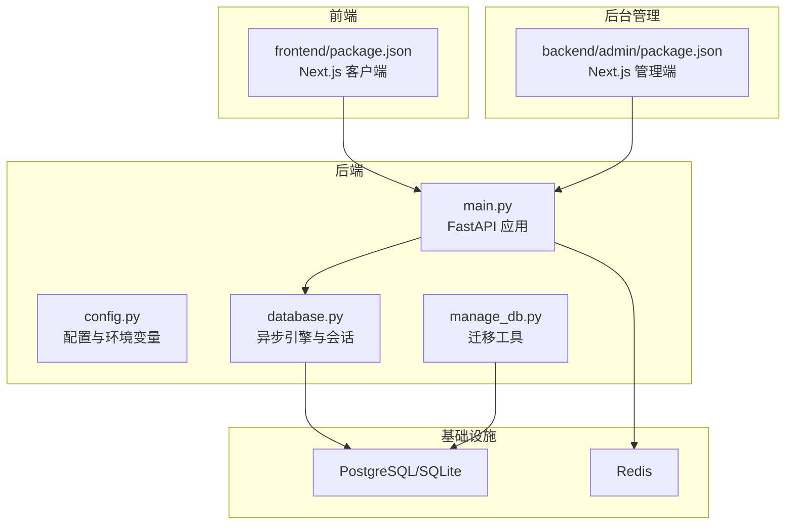
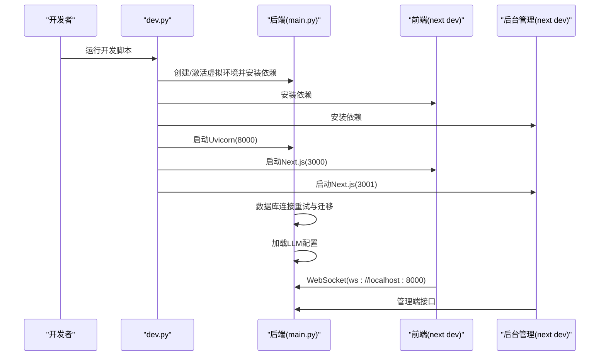
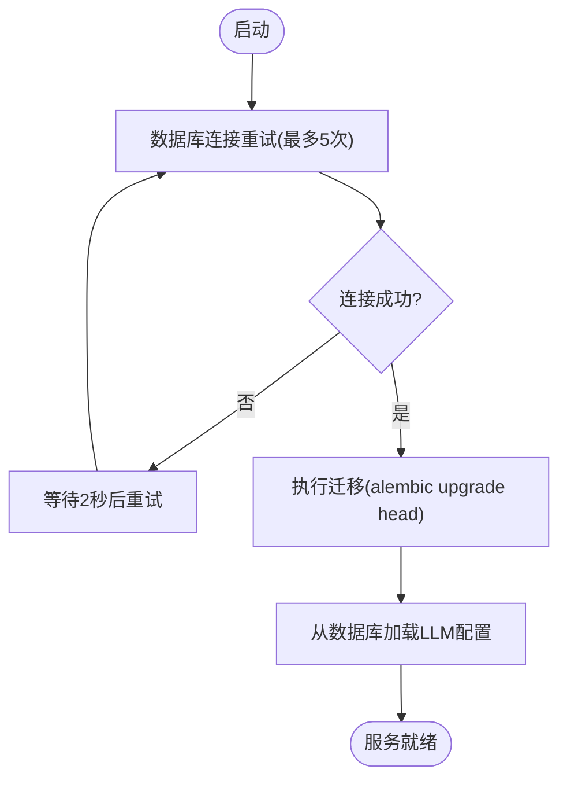
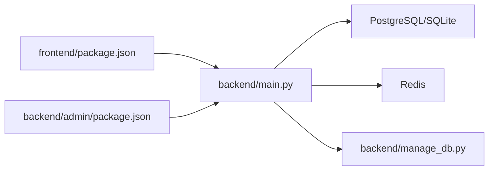

# 系统启动问题

<cite>
**本文引用的文件**
- [README.md](file://README.md)
- [dev.py](file://dev.py)
- [backend/.env.example](file://backend/.env.example)
- [backend/requirements.txt](file://backend/requirements.txt)
- [backend/main.py](file://backend/main.py)
- [backend/config.py](file://backend/config.py)
- [backend/database.py](file://backend/database.py)
- [backend/manage_db.py](file://backend/manage_db.py)
- [frontend/package.json](file://frontend/package.json)
- [backend/admin/package.json](file://backend/admin/package.json)
- [docs/wiki/Backend-Guide.md](file://docs/wiki/Backend-Guide.md)
- [docs/wiki/Frontend-Guide.md](file://docs/wiki/Frontend-Guide.md)
- [docs/wiki/Deployment.md](file://docs/wiki/Deployment.md)
</cite>

## 目录
1. [简介](#简介)
2. [项目结构](#项目结构)
3. [核心组件](#核心组件)
4. [架构总览](#架构总览)
5. [详细组件分析](#详细组件分析)
6. [依赖关系分析](#依赖关系分析)
7. [性能考虑](#性能考虑)
8. [故障排除指南](#故障排除指南)
9. [结论](#结论)
10. [附录](#附录)

## 简介
本指南聚焦于系统启动阶段的常见问题与排障流程，覆盖后端服务启动失败、前端开发服务器无法启动、后台管理系统无法访问等场景。针对Python虚拟环境配置错误、Node.js版本不兼容、端口占用冲突、环境变量配置错误、依赖包安装失败、数据库连接初始化超时等问题，提供根因分析与修复步骤，并给出启动顺序指导、服务健康检查方法与日志分析技巧。同时包含Windows/Linux/macOS平台特有问题的解决方案。

## 项目结构
系统采用前后端分离架构：
- 后端：FastAPI + 异步SQLAlchemy + Uvicorn，提供REST与WebSocket接口，支持动态LLM配置与多智能体叙事引擎。
- 前端：Next.js 16（App Router）游戏客户端，负责渲染与WebSocket通信。
- 后台管理：Next.js 16管理端，独立端口运行，提供可视化配置与监控。
- 数据库：PostgreSQL（异步驱动）或SQLite（本地回退），配合Alembic迁移管理。
- 缓存与消息：Redis（连接字符串可配置）。

图表来源
- [backend/main.py](file://backend/main.py#L30-L100)
- [backend/config.py](file://backend/config.py#L7-L34)
- [backend/database.py](file://backend/database.py#L1-L31)
- [backend/manage_db.py](file://backend/manage_db.py#L1-L67)
- [frontend/package.json](file://frontend/package.json#L1-L35)
- [backend/admin/package.json](file://backend/admin/package.json#L1-L72)

章节来源
- [README.md](file://README.md#L34-L51)
- [docs/wiki/Backend-Guide.md](file://docs/wiki/Backend-Guide.md#L1-L21)
- [docs/wiki/Frontend-Guide.md](file://docs/wiki/Frontend-Guide.md#L1-L21)

## 核心组件
- 后端入口与生命周期：应用在启动时进行数据库连接重试与迁移执行，随后加载LLM配置；提供REST与WebSocket接口。
- 配置与环境变量：通过Pydantic Settings从.env文件加载，支持SQLite回退与Redis连接。
- 数据库连接：异步引擎与连接池配置，启用pool_pre_ping与溢出连接数控制。
- 迁移管理：独立脚本封装Alembic命令，便于在不同环境下执行升级/降级。
- 前端与后台管理：各自维护独立的package.json与端口配置，开发模式下分别监听不同端口。

章节来源
- [backend/main.py](file://backend/main.py#L45-L82)
- [backend/config.py](file://backend/config.py#L7-L34)
- [backend/database.py](file://backend/database.py#L1-L31)
- [backend/manage_db.py](file://backend/manage_db.py#L20-L63)
- [frontend/package.json](file://frontend/package.json#L1-L35)
- [backend/admin/package.json](file://backend/admin/package.json#L1-L10)

## 架构总览
系统启动涉及三个主要进程：后端API、前端客户端、后台管理端。它们通过独立端口对外提供服务，后端与数据库、Redis交互，前端与后端通过WebSocket通信。

图表来源
- [dev.py](file://dev.py#L91-L147)
- [backend/main.py](file://backend/main.py#L45-L82)
- [frontend/package.json](file://frontend/package.json#L5-L10)
- [backend/admin/package.json](file://backend/admin/package.json#L5-L10)

## 详细组件分析

### 后端启动流程与健康检查
- 生命周期钩子：启动时进行数据库连接重试与迁移执行，最后尝试从数据库加载LLM配置。
- 端口与主机：默认监听127.0.0.1:8000，Windows上使用asyncio事件循环策略与UTF-8输出修复。
- 健康检查建议：
  - GET /：确认应用存活。
  - WebSocket /ws/{player_id}：建立连接并发送测试消息，观察回显。
  - 管理端接口：访问后台管理端3001端口，确认静态资源与路由可用。

图表来源
- [backend/main.py](file://backend/main.py#L45-L82)

章节来源
- [backend/main.py](file://backend/main.py#L45-L82)
- [backend/main.py](file://backend/main.py#L171-L173)

### 配置与环境变量
- 默认回退：若未配置DATABASE_URL，则回退到SQLite（绝对路径），便于本地开发。
- Redis连接：默认本地Redis，可通过REDIS_URL调整。
- 环境变量示例：OPENAI_API_KEY、DATABASE_URL、REDIS_URL。
- 依赖清单：后端使用FastAPI、Uvicorn、SQLAlchemy异步ORM、asyncpg、Redis、AgentScope、OpenAI等。

章节来源
- [backend/config.py](file://backend/config.py#L7-L34)
- [backend/.env.example](file://backend/.env.example#L1-L4)
- [backend/requirements.txt](file://backend/requirements.txt#L1-L20)

### 数据库连接与迁移
- 引擎配置：开启pool_pre_ping，设置连接池大小与溢出连接数；SQLite场景设置线程检查参数。
- 迁移工具：封装migrate/upgrade/downgrade命令，便于在不同环境执行。
- 启动迁移：main.py中通过subprocess调用alembic，避免与异步上下文冲突。

章节来源
- [backend/database.py](file://backend/database.py#L1-L31)
- [backend/manage_db.py](file://backend/manage_db.py#L20-L63)
- [backend/main.py](file://backend/main.py#L59-L65)

### 前端与后台管理端
- 前端：Next.js 16，开发端口3000，依赖包含React、Pixi.js、Socket.IO客户端等。
- 后台管理：Next.js 16，开发端口3001，依赖包含Radix UI、Monaco编辑器、Zod等。
- 启动脚本：dev.py统一安装依赖并并行启动三类服务。

章节来源
- [frontend/package.json](file://frontend/package.json#L1-L35)
- [backend/admin/package.json](file://backend/admin/package.json#L1-L10)
- [dev.py](file://dev.py#L91-L147)

## 依赖关系分析
- 后端对数据库与Redis的直接依赖；对AgentScope与OpenAI等第三方AI服务的间接依赖。
- 前端与后台管理端通过HTTP/WS与后端交互。
- 迁移工具与后端共享同一Python环境，确保依赖一致。

图表来源
- [frontend/package.json](file://frontend/package.json#L1-L35)
- [backend/admin/package.json](file://backend/admin/package.json#L1-L72)
- [backend/main.py](file://backend/main.py#L30-L43)
- [backend/manage_db.py](file://backend/manage_db.py#L1-L67)

章节来源
- [frontend/package.json](file://frontend/package.json#L1-L35)
- [backend/admin/package.json](file://backend/admin/package.json#L1-L72)
- [backend/main.py](file://backend/main.py#L30-L43)
- [backend/manage_db.py](file://backend/manage_db.py#L1-L67)

## 性能考虑
- 异步I/O：后端采用异步数据库与WebSocket，适合高并发低延迟场景。
- 连接池：合理设置pool_size与max_overflow，避免连接争用。
- 日志级别：关闭SQLAlchemy与Uvicorn访问日志，降低IO开销。
- 资源加载：前端组件使用动态导入，避免SSR期间加载重型库。

章节来源
- [backend/database.py](file://backend/database.py#L8-L23)
- [backend/main.py](file://backend/main.py#L14-L28)
- [docs/wiki/Frontend-Guide.md](file://docs/wiki/Frontend-Guide.md#L54-L58)

## 故障排除指南

### 一、后端服务启动失败
- 症状
  - Uvicorn无法启动或立即退出。
  - 控制台出现数据库连接错误或迁移失败。
  - Windows平台出现事件循环或编码异常。
- 根因定位
  - Python虚拟环境未正确激活或依赖安装失败。
  - DATABASE_URL或REDIS_URL配置错误。
  - 数据库服务未启动或凭据不匹配。
  - Alembic迁移失败导致启动中断。
  - Windows平台事件循环策略或终端编码问题。
- 诊断步骤
  - 确认虚拟环境Python路径与pip安装路径一致。
  - 手动运行依赖安装命令，检查requirements.txt语法与网络可达性。
  - 手动连接数据库（psql或pgAdmin），验证连接字符串与权限。
  - 手动执行迁移命令，查看具体错误信息。
  - 在Windows上确认事件循环策略与UTF-8输出修复是否生效。
- 修复步骤
  - 重新创建并激活虚拟环境，确保pip与python指向同一环境。
  - 按示例文件复制.env并填写正确的DATABASE_URL、REDIS_URL与API密钥。
  - 启动PostgreSQL与Redis服务，确保端口开放。
  - 使用迁移工具执行升级，必要时先执行一次autogenerate再upgrade。
  - 在Windows上使用dev.py脚本启动，避免直接调用uvicorn导致事件循环问题。
- 健康检查
  - 访问根路径与WebSocket端点，观察响应与连接状态。
  - 查看后端日志，确认数据库连接与迁移完成标志。

章节来源
- [dev.py](file://dev.py#L19-L42)
- [backend/requirements.txt](file://backend/requirements.txt#L1-L20)
- [backend/.env.example](file://backend/.env.example#L1-L4)
- [backend/config.py](file://backend/config.py#L11-L20)
- [backend/database.py](file://backend/database.py#L8-L17)
- [backend/manage_db.py](file://backend/manage_db.py#L30-L38)
- [backend/main.py](file://backend/main.py#L6-L11)
- [backend/main.py](file://backend/main.py#L45-L82)

### 二、前端开发服务器无法启动
- 症状
  - npm install卡住或报错。
  - next dev启动后无法访问或热更新异常。
- 根因定位
  - Node.js版本不满足要求（18+）。
  - 依赖包损坏或网络受限。
  - 端口3000被占用。
- 诊断步骤
  - 检查Node.js版本是否符合要求。
  - 清理node_modules与package-lock.json后重装依赖。
  - 更换端口或释放占用端口。
- 修复步骤
  - 安装Node.js 18+，使用nvm管理版本。
  - 删除node_modules与lock文件，重新执行npm install。
  - 修改next.config.ts或环境变量指定不同端口。
- 健康检查
  - 访问http://localhost:3000，确认页面渲染与WebSocket连接。
  - 查看控制台错误与网络面板，定位资源加载失败。

章节来源
- [README.md](file://README.md#L55-L60)
- [frontend/package.json](file://frontend/package.json#L5-L10)
- [docs/wiki/Frontend-Guide.md](file://docs/wiki/Frontend-Guide.md#L59-L69)

### 三、后台管理系统无法访问
- 症状
  - 访问http://localhost:3001返回空白或404。
- 根因定位
  - 未安装后台管理依赖或依赖冲突。
  - 端口3001被占用。
- 诊断步骤
  - 在backend/admin目录执行npm install，观察错误。
  - 检查端口占用情况并释放。
- 修复步骤
  - 在backend/admin目录执行npm install，解决依赖问题。
  - 更改package.json中的端口或释放占用端口。
- 健康检查
  - 访问后台管理端，确认页面与接口路由正常。

章节来源
- [backend/admin/package.json](file://backend/admin/package.json#L5-L10)
- [dev.py](file://dev.py#L98-L105)

### 四、Python虚拟环境配置错误
- 症状
  - pip找不到、安装失败或安装到错误路径。
- 根因定位
  - 未创建或未激活虚拟环境。
  - Python解释器与pip路径不一致。
- 诊断步骤
  - 确认venv目录存在，检查Scripts/bin下的python与pip路径。
  - 使用绝对路径执行pip安装。
- 修复步骤
  - 使用标准方式创建虚拟环境并激活。
  - 在后端目录执行pip安装，确保cwd正确。
- 健康检查
  - 查看已安装包列表，确认依赖完整。

章节来源
- [dev.py](file://dev.py#L19-L42)
- [README.md](file://README.md#L61-L84)

### 五、Node.js版本不兼容
- 症状
  - npm install报错或运行时报语法错误。
- 根因定位
  - Node.js版本低于18。
- 诊断步骤
  - 查看Node.js版本，确认满足要求。
- 修复步骤
  - 使用nvm安装并切换至18+版本。
- 健康检查
  - 重新安装依赖并启动开发服务器。

章节来源
- [README.md](file://README.md#L55-L60)
- [frontend/package.json](file://frontend/package.json#L16-L16)
- [backend/admin/package.json](file://backend/admin/package.json#L36-L36)

### 六、端口占用冲突
- 症状
  - 后端/前端/后台管理端启动失败或立即退出。
- 根因定位
  - 8000/3000/3001端口被占用。
- 诊断步骤
  - 使用netstat/lsof查看占用进程。
- 修复步骤
  - 终止占用进程或更改端口。
- 健康检查
  - 确认端口释放后再次启动成功。

章节来源
- [backend/main.py](file://backend/main.py#L171-L173)
- [frontend/package.json](file://frontend/package.json#L6-L6)
- [backend/admin/package.json](file://backend/admin/package.json#L6-L6)

### 七、环境变量配置错误
- 症状
  - 数据库连接失败、Redis连接失败、LLM配置加载异常。
- 根因定位
  - .env文件缺失或字段为空。
- 诊断步骤
  - 复制.env.example为.env并逐项核对。
  - 检查DATABASE_URL、REDIS_URL、OPENAI_API_KEY等。
- 修复步骤
  - 填写正确的数据库与Redis连接串及API密钥。
- 健康检查
  - 启动后观察日志中数据库连接与迁移完成信息。

章节来源
- [backend/.env.example](file://backend/.env.example#L1-L4)
- [backend/config.py](file://backend/config.py#L11-L20)
- [docs/wiki/Deployment.md](file://docs/wiki/Deployment.md#L26-L33)

### 八、依赖包安装失败
- 症状
  - pip/npm安装卡住或报SSL/网络错误。
- 根因定位
  - 网络受限或镜像源不可用。
- 诊断步骤
  - 切换国内镜像源或代理。
- 修复步骤
  - 配置pip与npm镜像源，重试安装。
- 健康检查
  - 确认依赖安装完成，无缺失模块。

章节来源
- [backend/requirements.txt](file://backend/requirements.txt#L1-L20)
- [dev.py](file://dev.py#L36-L40)
- [dev.py](file://dev.py#L56-L61)

### 九、数据库连接初始化超时
- 症状
  - 启动时反复重试连接，最终失败。
- 根因定位
  - PostgreSQL未启动、凭据错误、网络不通。
- 诊断步骤
  - 手动连接数据库，验证服务状态与凭据。
  - 检查防火墙与网络策略。
- 修复步骤
  - 启动PostgreSQL服务，修正连接串与权限。
- 健康检查
  - 启动后观察迁移完成与LLM配置加载日志。

章节来源
- [backend/main.py](file://backend/main.py#L45-L82)
- [backend/database.py](file://backend/database.py#L8-L17)
- [docs/wiki/Deployment.md](file://docs/wiki/Deployment.md#L14-L22)

### 十、启动顺序与健康检查
- 启动顺序
  - 后端：创建/激活虚拟环境 → 安装依赖 → 启动Uvicorn（8000）。
  - 前端：安装依赖 → 启动Next.js（3000）。
  - 后台管理：安装依赖 → 启动Next.js（3001）。
- 健康检查
  - 后端：GET /、WebSocket /ws/{player_id}、管理端接口。
  - 前端：页面渲染、WebSocket连接、资源加载。
  - 后台管理：页面与路由可用性。

章节来源
- [dev.py](file://dev.py#L91-L147)
- [backend/main.py](file://backend/main.py#L128-L170)
- [docs/wiki/Frontend-Guide.md](file://docs/wiki/Frontend-Guide.md#L59-L69)

### 十一、平台特定问题
- Windows
  - 事件循环策略与UTF-8输出修复已在后端入口处理。
  - 使用dev.py脚本启动，避免直接调用uvicorn导致事件循环问题。
- Linux/macOS
  - 确保Python与Node.js版本满足要求。
  - 如遇权限问题，使用chmod赋予脚本执行权限。

章节来源
- [backend/main.py](file://backend/main.py#L6-L11)
- [dev.py](file://dev.py#L133-L146)
- [docs/wiki/Deployment.md](file://docs/wiki/Deployment.md#L1-L13)

## 结论
系统启动问题多源于环境配置、依赖安装与端口占用。遵循本文提供的诊断与修复步骤，结合健康检查与日志分析，可快速定位并解决问题。建议在开发前统一版本与环境变量，使用dev.py脚本并行启动各组件，并在Windows/Linux/macOS平台上关注平台差异。

## 附录
- 快速对照表
  - 后端端口：8000；前端端口：3000；后台管理端口：3001。
  - 关键环境变量：DATABASE_URL、REDIS_URL、OPENAI_API_KEY。
  - 迁移命令：migrate/upgrade/downgrade。
  - 前端依赖：Next.js 16、React、Socket.IO客户端、Pixi.js。
  - 后台管理依赖：Next.js 16、Radix UI、Monaco编辑器、Zod。