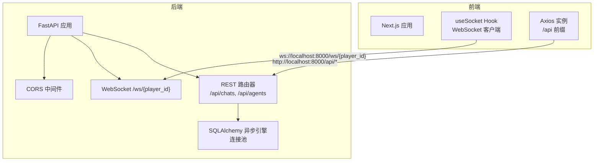
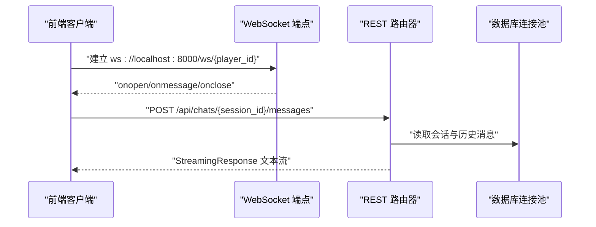
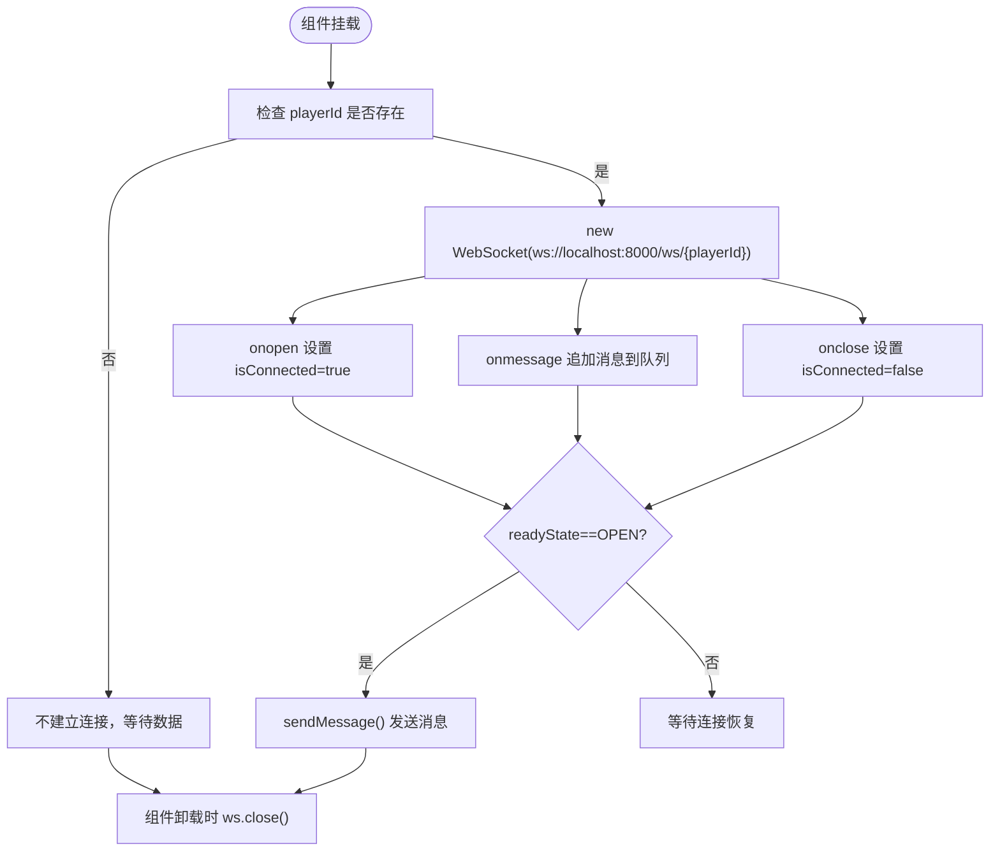
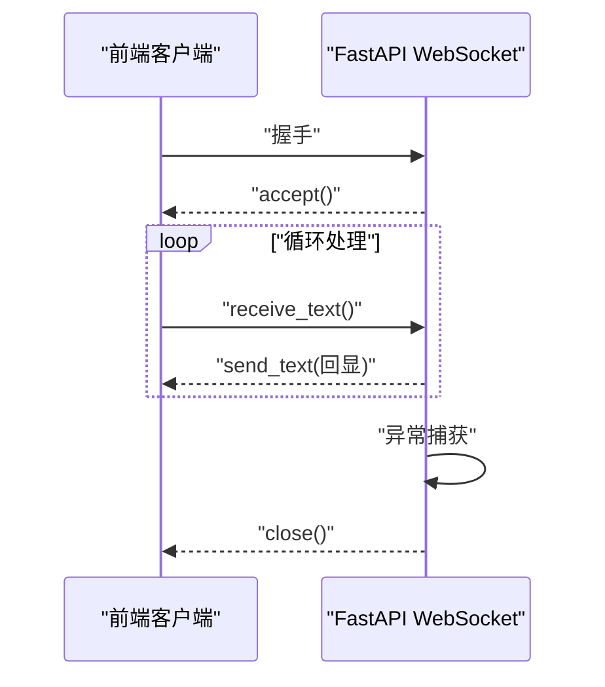
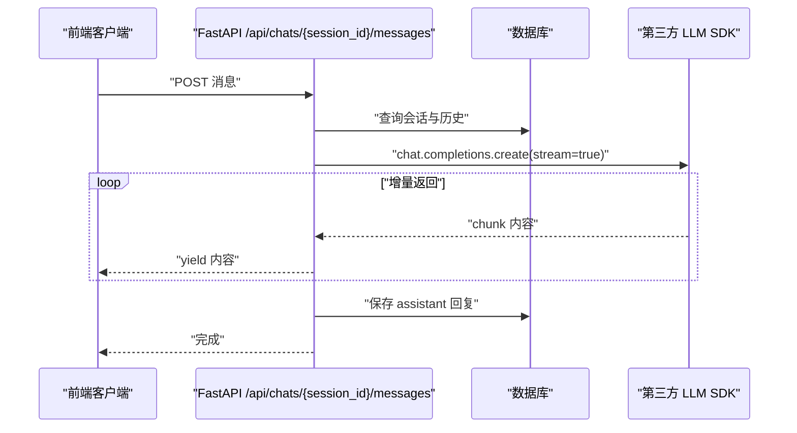
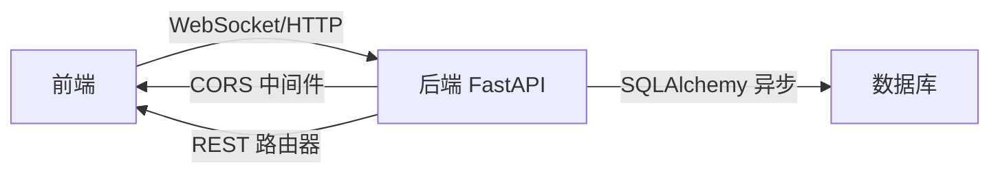
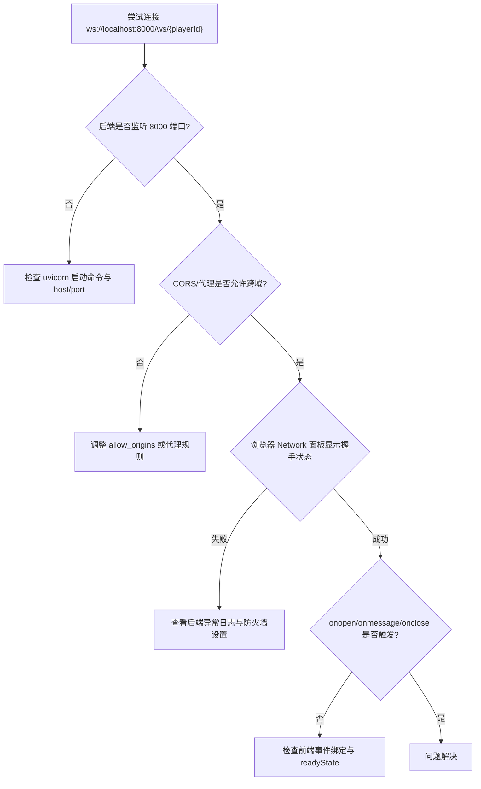

# 网络通信问题

<cite>
**本文引用的文件**
- [frontend/src/hooks/useSocket.ts](file://frontend/src/hooks/useSocket.ts)
- [backend/main.py](file://backend/main.py)
- [backend/routers/chats.py](file://backend/routers/chats.py)
- [backend/admin/src/lib/axios.ts](file://backend/admin/src/lib/axios.ts)
- [backend/config.py](file://backend/config.py)
- [backend/database.py](file://backend/database.py)
- [backend/models.py](file://backend/models.py)
- [backend/schemas.py](file://backend/schemas.py)
- [frontend/package.json](file://frontend/package.json)
- [frontend/next.config.ts](file://frontend/next.config.ts)
- [backend/requirements.txt](file://backend/requirements.txt)
</cite>

## 目录
1. [简介](#简介)
2. [项目结构](#项目结构)
3. [核心组件](#核心组件)
4. [架构总览](#架构总览)
5. [详细组件分析](#详细组件分析)
6. [依赖关系分析](#依赖关系分析)
7. [性能考虑](#性能考虑)
8. [故障排除指南](#故障排除指南)
9. [结论](#结论)
10. [附录](#附录)

## 简介
本文件聚焦于网络通信问题的系统化故障排除，覆盖以下场景：
- WebSocket 连接失败：症状包括无法建立连接、连接断开、消息未达等
- HTTP 请求超时：症状包括接口响应慢或无响应、流式响应中断
- 跨域问题（CORS）：症状包括浏览器控制台报跨域错误、预检失败
- 网络中断与重连：症状包括连接抖动、消息丢失、状态异常
- 生产环境网络监控与性能优化：包括连接池、超时参数、代理与防火墙配置、SSL/CORS 策略

本指南结合前端 WebSocket 客户端与后端 FastAPI 服务的实际实现，提供可操作的诊断步骤、可视化图示与调优建议。

## 项目结构
该项目采用前后端分离架构：
- 前端使用 Next.js 与 React Hooks，通过自定义 Hook 管理 WebSocket 连接
- 后端使用 FastAPI 提供 REST 接口与 WebSocket 端点，并内置 CORS 中间件
- 数据访问层基于 SQLAlchemy 异步引擎与连接池
- 管理后台使用 Axios 发起 API 请求，通过反向代理转发到后端

图表来源
- [frontend/src/hooks/useSocket.ts](file://frontend/src/hooks/useSocket.ts#L1-L43)
- [backend/main.py](file://backend/main.py#L83-L91)
- [backend/main.py](file://backend/main.py#L157-L170)
- [backend/routers/chats.py](file://backend/routers/chats.py#L16-L20)
- [backend/admin/src/lib/axios.ts](file://backend/admin/src/lib/axios.ts#L3-L8)
- [backend/database.py](file://backend/database.py#L8-L17)

章节来源
- [frontend/src/hooks/useSocket.ts](file://frontend/src/hooks/useSocket.ts#L1-L43)
- [backend/main.py](file://backend/main.py#L83-L91)
- [backend/main.py](file://backend/main.py#L157-L170)
- [backend/routers/chats.py](file://backend/routers/chats.py#L16-L20)
- [backend/admin/src/lib/axios.ts](file://backend/admin/src/lib/axios.ts#L3-L8)
- [backend/database.py](file://backend/database.py#L8-L17)

## 核心组件
- 前端 WebSocket 客户端：负责建立与后端的实时连接、接收消息、发送消息、清理资源
- 后端 WebSocket 端点：接受连接、处理文本消息、异常捕获与关闭
- REST 流式接口：支持长文本/流式响应，适合大模型输出
- CORS 中间件：允许指定源访问后端 API
- 数据库连接池：异步引擎配置连接池参数，提升并发与稳定性
- 管理后台 Axios：统一的 API 客户端，集中处理错误

章节来源
- [frontend/src/hooks/useSocket.ts](file://frontend/src/hooks/useSocket.ts#L1-L43)
- [backend/main.py](file://backend/main.py#L157-L170)
- [backend/routers/chats.py](file://backend/routers/chats.py#L112-L258)
- [backend/main.py](file://backend/main.py#L85-L91)
- [backend/database.py](file://backend/database.py#L8-L17)
- [backend/admin/src/lib/axios.ts](file://backend/admin/src/lib/axios.ts#L3-L8)

## 架构总览
下图展示从前端到后端的关键交互路径与中间件：

图表来源
- [frontend/src/hooks/useSocket.ts](file://frontend/src/hooks/useSocket.ts#L11-L32)
- [backend/main.py](file://backend/main.py#L157-L170)
- [backend/routers/chats.py](file://backend/routers/chats.py#L72-L258)
- [backend/database.py](file://backend/database.py#L8-L17)

## 详细组件分析

### WebSocket 客户端（前端）
- 连接建立：使用本地回环地址与固定端口，确保开发环境一致性
- 事件处理：打开、消息、关闭分别记录状态与消息队列
- 发送控制：仅在连接处于 OPEN 状态时发送
- 清理：组件卸载时主动关闭连接，避免悬挂

图表来源
- [frontend/src/hooks/useSocket.ts](file://frontend/src/hooks/useSocket.ts#L8-L33)
- [frontend/src/hooks/useSocket.ts](file://frontend/src/hooks/useSocket.ts#L35-L39)

章节来源
- [frontend/src/hooks/useSocket.ts](file://frontend/src/hooks/useSocket.ts#L1-L43)

### WebSocket 端点（后端）
- 接受连接：直接 accept，无鉴权
- 循环处理：持续 receive_text/send_text，异常捕获后关闭
- 主机绑定：监听所有接口端口，便于容器/外部访问

图表来源
- [backend/main.py](file://backend/main.py#L157-L170)

章节来源
- [backend/main.py](file://backend/main.py#L157-L170)

### REST 流式接口（聊天消息）
- 功能：创建会话、列出会话、查询消息、发送消息并流式返回
- 流式生成：根据不同提供商类型选择对应的 SDK，逐块返回增量内容
- 错误处理：捕获异常并返回错误信息；保存助手回复与更新会话时间戳
- 数据访问：异步会话管理，避免阻塞

图表来源
- [backend/routers/chats.py](file://backend/routers/chats.py#L72-L258)

章节来源
- [backend/routers/chats.py](file://backend/routers/chats.py#L72-L258)

### CORS 与代理配置
- CORS：允许来自前端开发端口的跨域请求
- 管理后台 Axios：baseURL 使用 /api，通过反向代理转发至后端
- 前端 Next 配置：当前为空配置，如需代理可在后续扩展

章节来源
- [backend/main.py](file://backend/main.py#L85-L91)
- [backend/admin/src/lib/axios.ts](file://backend/admin/src/lib/axios.ts#L3-L8)
- [frontend/next.config.ts](file://frontend/next.config.ts#L1-L8)

### 数据库连接池
- 异步引擎：启用 pool_pre_ping、设定 pool_size 与 max_overflow
- 适用场景：高并发请求与流式响应，降低连接竞争与超时风险

章节来源
- [backend/database.py](file://backend/database.py#L8-L17)

## 依赖关系分析
- 前端依赖：React、Next.js、socket.io-client（用于 WebSocket）、axios（用于 REST）
- 后端依赖：FastAPI、Uvicorn、SQLAlchemy 异步、websockets、pydantic、alembic 等
- 数据模型：玩家、故事章节、资产、LLM 提供商、聊天会话与消息
- 路由器：聊天与智能体相关接口

图表来源
- [frontend/package.json](file://frontend/package.json#L11-L23)
- [backend/requirements.txt](file://backend/requirements.txt#L1-L20)
- [backend/models.py](file://backend/models.py#L9-L122)
- [backend/schemas.py](file://backend/schemas.py#L1-L102)

章节来源
- [frontend/package.json](file://frontend/package.json#L11-L23)
- [backend/requirements.txt](file://backend/requirements.txt#L1-L20)
- [backend/models.py](file://backend/models.py#L9-L122)
- [backend/schemas.py](file://backend/schemas.py#L1-L102)

## 性能考虑
- 连接池参数
  - pool_pre_ping：自动探测失效连接，提升稳定性
  - pool_size/max_overflow：平衡并发与资源占用
- 超时与重试
  - WebSocket：前端应实现指数退避重连与心跳保活
  - HTTP：对流式接口设置合理的读取超时与分块消费
- 日志与监控
  - 后端开启关键模块日志级别，避免过量输出影响性能
  - 前端记录连接状态变化与错误码，辅助定位问题
- 资源释放
  - 组件卸载时及时关闭 WebSocket，避免内存泄漏

章节来源
- [backend/database.py](file://backend/database.py#L8-L17)
- [frontend/src/hooks/useSocket.ts](file://frontend/src/hooks/useSocket.ts#L30-L33)

## 故障排除指南

### 一、WebSocket 连接失败
常见症状
- 无法建立连接：握手失败、端口不可达
- 连接断开：偶发或周期性断线
- 消息未达：发送成功但无回显或延迟严重

排查步骤
1. 确认后端 WebSocket 端点已启动并监听
   - 查看后端启动日志与端口绑定
   - 参考：[backend/main.py](file://backend/main.py#L171-L173)
2. 检查前端连接 URL 与后端主机/端口是否一致
   - 参考：[frontend/src/hooks/useSocket.ts](file://frontend/src/hooks/useSocket.ts#L11)
3. 验证 CORS 与代理是否正确转发
   - 参考：[backend/main.py](file://backend/main.py#L85-L91)
4. 观察浏览器开发者工具 Network/WebSocket 面板
   - 关注握手状态、帧类型、断线原因
5. 在后端增加连接日志与异常捕获
   - 参考：[backend/main.py](file://backend/main.py#L157-L170)
6. 前端实现重连与心跳
   - 参考：[frontend/src/hooks/useSocket.ts](file://frontend/src/hooks/useSocket.ts#L35-L39)

图表来源
- [frontend/src/hooks/useSocket.ts](file://frontend/src/hooks/useSocket.ts#L11-L32)
- [backend/main.py](file://backend/main.py#L85-L91)
- [backend/main.py](file://backend/main.py#L157-L170)
- [backend/main.py](file://backend/main.py#L171-L173)

章节来源
- [frontend/src/hooks/useSocket.ts](file://frontend/src/hooks/useSocket.ts#L1-L43)
- [backend/main.py](file://backend/main.py#L85-L91)
- [backend/main.py](file://backend/main.py#L157-L170)
- [backend/main.py](file://backend/main.py#L171-L173)

### 二、HTTP 请求超时与流式响应中断
常见症状
- 接口长时间无响应
- 流式响应中途断开
- 大文本/多轮对话导致超时

排查步骤
1. 检查后端流式接口的异常处理与日志
   - 参考：[backend/routers/chats.py](file://backend/routers/chats.py#L211-L215)
2. 确认数据库连接池参数合理
   - 参考：[backend/database.py](file://backend/database.py#L8-L17)
3. 前端对流式响应进行分块消费，避免阻塞
   - 参考：[backend/routers/chats.py](file://backend/routers/chats.py#L169-L173)
4. 设置合理的超时与重试策略
   - 对于长耗时任务，考虑后台任务与轮询或 SSE/WS 推送
5. 后端日志级别优化，避免过多 IO 干扰
   - 参考：[backend/main.py](file://backend/main.py#L14-L28)

章节来源
- [backend/routers/chats.py](file://backend/routers/chats.py#L112-L258)
- [backend/database.py](file://backend/database.py#L8-L17)
- [backend/main.py](file://backend/main.py#L14-L28)

### 三、跨域问题（CORS）
常见症状
- 浏览器控制台报跨域错误
- 预检请求（OPTIONS）失败

排查步骤
1. 确认 CORS 允许的源列表包含前端开发地址
   - 参考：[backend/main.py](file://backend/main.py#L85-L91)
2. 管理后台 Axios 使用 /api 前缀，确保代理转发
   - 参考：[backend/admin/src/lib/axios.ts](file://backend/admin/src/lib/axios.ts#L3-L8)
3. 如部署到生产，补充生产域名与安全头
4. 使用浏览器网络面板确认实际请求与响应头

章节来源
- [backend/main.py](file://backend/main.py#L85-L91)
- [backend/admin/src/lib/axios.ts](file://backend/admin/src/lib/axios.ts#L3-L8)

### 四、网络中断与消息丢失
常见症状
- 连接抖动频繁
- 消息未送达或重复
- 状态异常（如未连接）

排查步骤
1. 前端实现指数退避重连与去重
   - 参考：[frontend/src/hooks/useSocket.ts](file://frontend/src/hooks/useSocket.ts#L35-L39)
2. 后端异常捕获与优雅关闭
   - 参考：[backend/main.py](file://backend/main.py#L166-L169)
3. 前端记录消息 ID 与时间戳，便于审计
4. 必要时引入消息确认与持久化

章节来源
- [frontend/src/hooks/useSocket.ts](file://frontend/src/hooks/useSocket.ts#L35-L39)
- [backend/main.py](file://backend/main.py#L166-L169)

### 五、防火墙、代理与 SSL/CORS 策略
- 防火墙
  - 开放后端监听端口（默认 8000），限制来源 IP
- 代理
  - Nginx/Ingress 将 /api 前缀转发到后端
  - WebSocket 升级需支持 ws/wss
- SSL
  - 生产环境启用 HTTPS，确保证书链完整
- CORS
  - 严格白名单，避免通配符带来的安全风险

章节来源
- [backend/main.py](file://backend/main.py#L85-L91)
- [backend/admin/src/lib/axios.ts](file://backend/admin/src/lib/axios.ts#L3-L8)

### 六、网络抓包分析与连接池调优
- 抓包建议
  - 使用浏览器 Network 面板与 Wireshark 抓取 WebSocket 握手与数据帧
  - 分析 HTTP/1.1 vs HTTP/2 的差异与性能
- 连接池参数调优
  - pool_pre_ping：提升连接可用性
  - pool_size/max_overflow：依据并发与资源上限调整
  - connect_args：SQLite 场景下避免线程限制
- 超时参数
  - WebSocket：心跳间隔与重连间隔
  - HTTP：连接超时、读取超时、流式消费超时

章节来源
- [backend/database.py](file://backend/database.py#L8-L17)
- [frontend/src/hooks/useSocket.ts](file://frontend/src/hooks/useSocket.ts#L35-L39)

### 七、生产环境网络监控与性能优化
- 监控指标
  - WebSocket 连接数、消息吞吐、错误率
  - HTTP 响应时间、错误码分布、流式耗时
  - 数据库连接池利用率、等待时间
- 优化建议
  - 合理拆分服务与缓存层
  - 使用连接池与异步 I/O
  - 启用压缩与合理的缓存策略
  - 对外暴露最小权限的 API 与严格的鉴权

章节来源
- [backend/database.py](file://backend/database.py#L8-L17)
- [backend/routers/chats.py](file://backend/routers/chats.py#L112-L258)

## 结论
本指南从代码实现出发，系统梳理了 WebSocket、HTTP、CORS、连接池与流式响应等关键环节的故障排除方法。建议在开发阶段即建立完善的日志与监控，在生产阶段强化安全与性能配置，以获得稳定可靠的网络通信体验。

## 附录
- 关键实现位置索引
  - WebSocket 客户端：[frontend/src/hooks/useSocket.ts](file://frontend/src/hooks/useSocket.ts#L1-L43)
  - WebSocket 端点：[backend/main.py](file://backend/main.py#L157-L170)
  - REST 流式接口：[backend/routers/chats.py](file://backend/routers/chats.py#L72-L258)
  - CORS 配置：[backend/main.py](file://backend/main.py#L85-L91)
  - Axios 客户端：[backend/admin/src/lib/axios.ts](file://backend/admin/src/lib/axios.ts#L3-L8)
  - 数据库连接池：[backend/database.py](file://backend/database.py#L8-L17)
  - 依赖清单：[frontend/package.json](file://frontend/package.json#L11-L23)、[backend/requirements.txt](file://backend/requirements.txt#L1-L20)