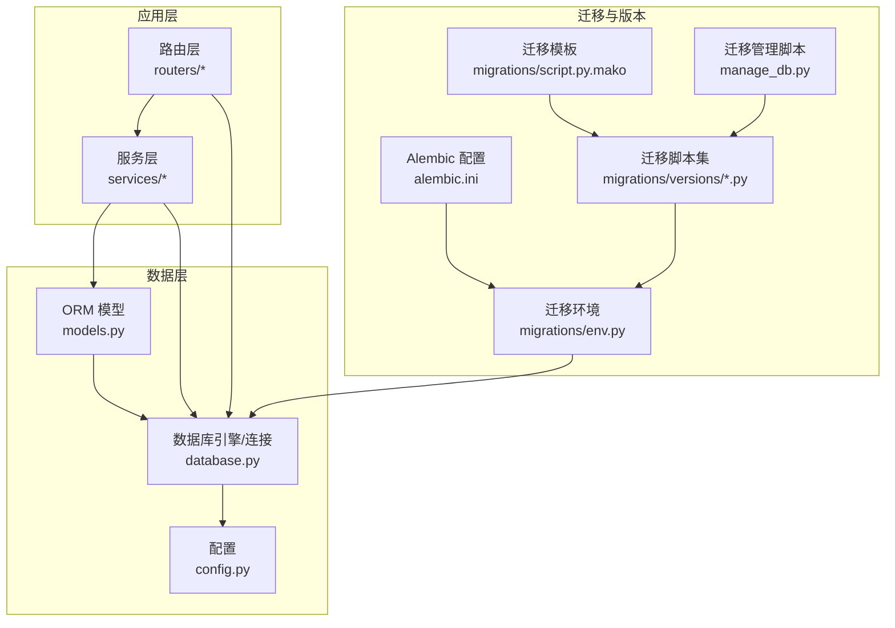
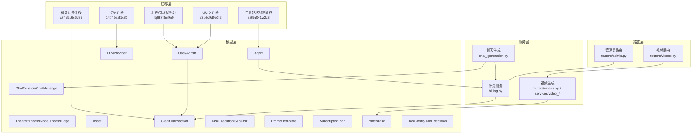
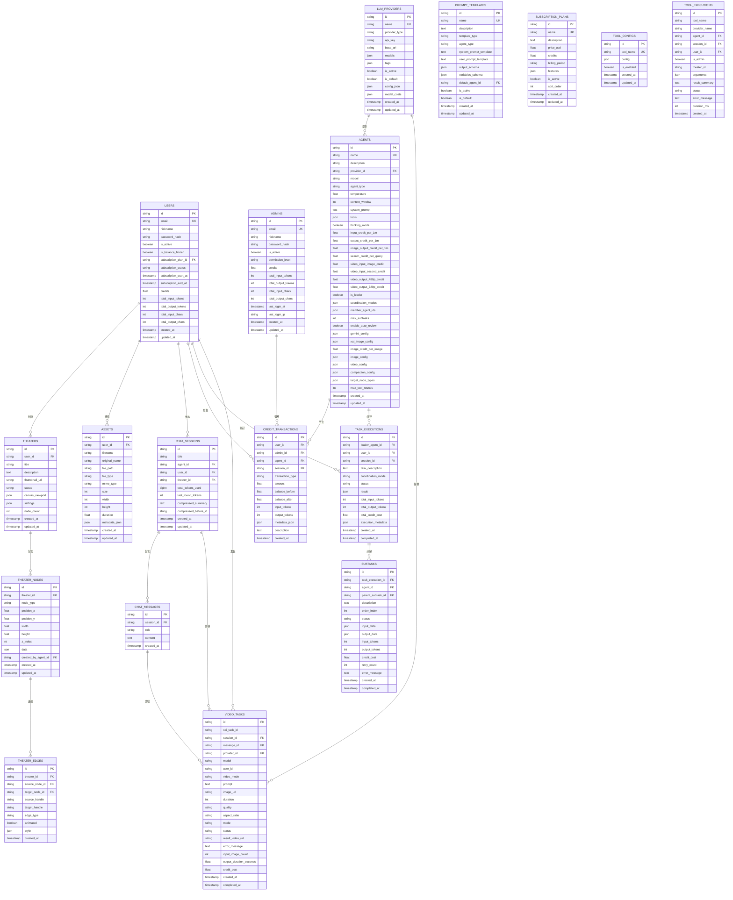
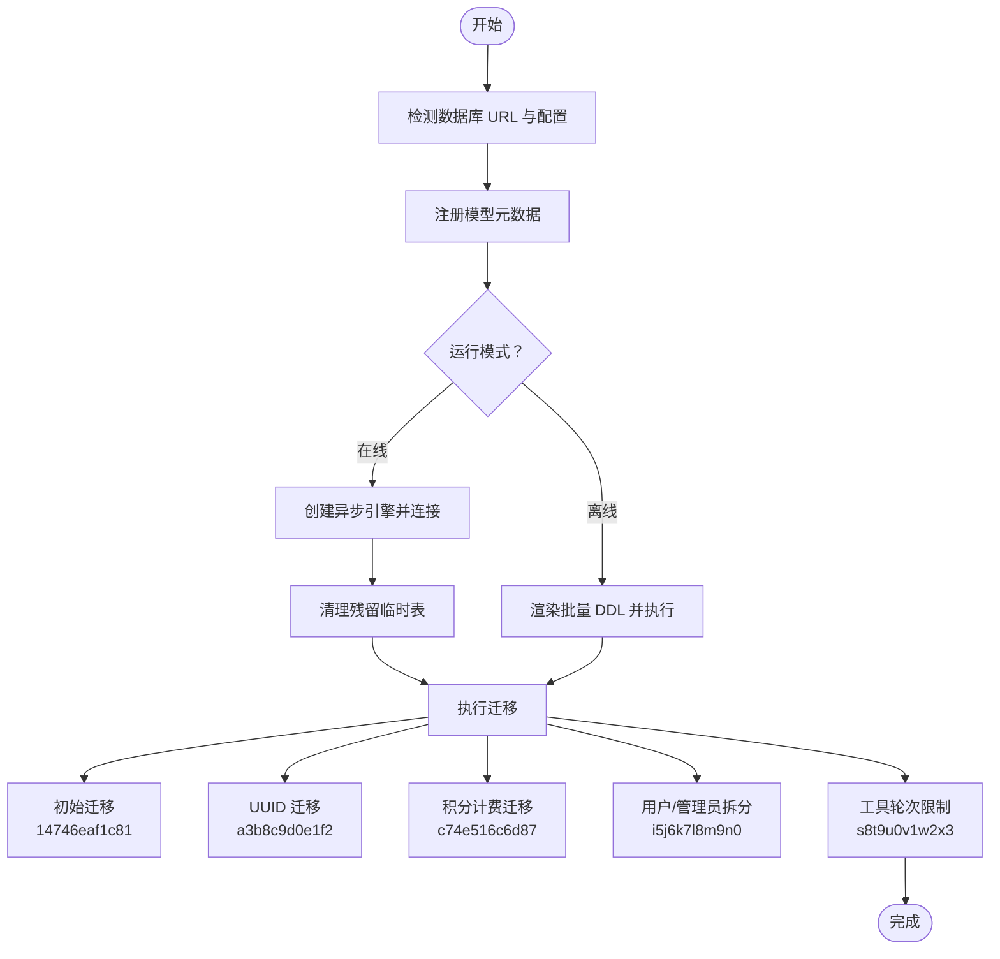
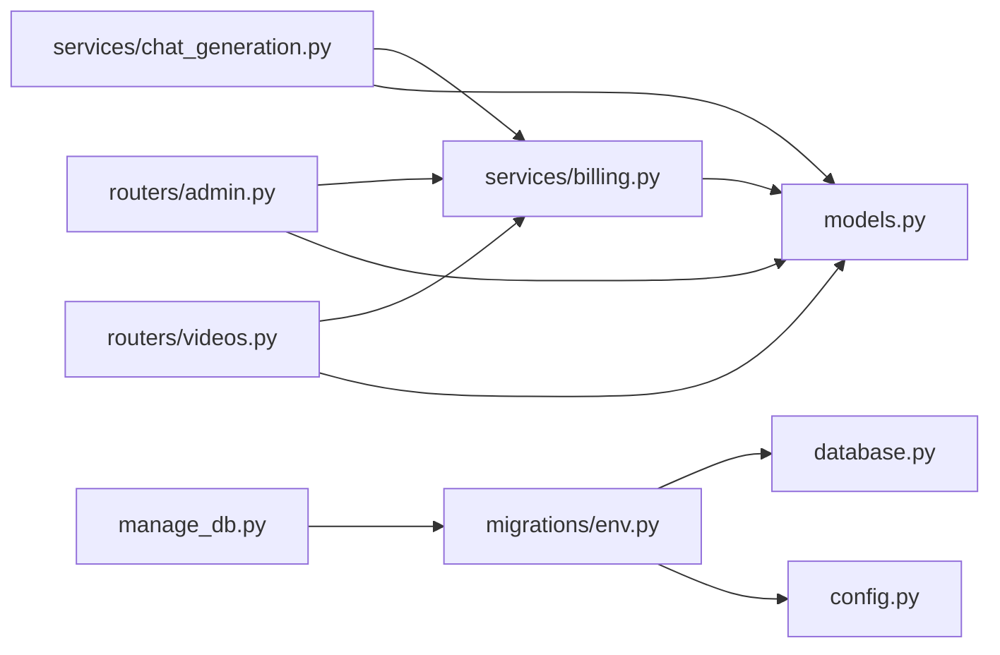

# 数据库设计

<cite>
**本文引用的文件**
- [database.py](file://backend/database.py)
- [models.py](file://backend/models.py)
- [schemas.py](file://backend/schemas.py)
- [config.py](file://backend/config.py)
- [alembic.ini](file://backend/alembic.ini)
- [migrations/env.py](file://backend/migrations/env.py)
- [migrations/script.py.mako](file://backend/migrations/script.py.mako)
- [migrations/versions/14746eaf1c81_initial.py](file://backend/migrations/versions/14746eaf1c81_initial.py)
- [migrations/versions/a3b8c9d0e1f2_convert_ids_to_uuid.py](file://backend/migrations/versions/a3b8c9d0e1f2_convert_ids_to_uuid.py)
- [migrations/versions/c74e516c6d87_add_credit_billing_system.py](file://backend/migrations/versions/c74e516c6d87_add_credit_billing_system.py)
- [migrations/versions/i5j6k7l8m9n0_split_user_admin_tables.py](file://backend/migrations/versions/i5j6k7l8m9n0_split_user_admin_tables.py)
- [migrations/versions/s8t9u0v1w2x3_add_max_tool_rounds_to_agent.py](file://backend/migrations/versions/s8t9u0v1w2x3_add_max_tool_rounds_to_agent.py)
- [manage_db.py](file://backend/manage_db.py)
- [seed_db.py](file://backend/seed_db.py)
- [services/billing.py](file://backend/services/billing.py)
- [services/chat_generation.py](file://backend/services/chat_generation.py)
- [routers/admin.py](file://backend/routers/admin.py)
- [routers/videos.py](file://backend/routers/videos.py)
</cite>

## 目录
1. [简介](#简介)
2. [项目结构](#项目结构)
3. [核心组件](#核心组件)
4. [架构总览](#架构总览)
5. [详细组件分析](#详细组件分析)
6. [依赖分析](#依赖分析)
7. [性能考量](#性能考量)
8. [故障排查指南](#故障排查指南)
9. [结论](#结论)
10. [附录](#附录)

## 简介
本文件面向 KunFlix 的数据库设计，系统性梳理实体关系模型、表结构与字段定义，明确主键/外键关系、索引与约束；给出数据库模式图与示例数据；阐述数据访问模式、缓存策略与性能优化；说明数据生命周期、保留与归档策略；解释数据迁移路径、版本管理与 Alembic 迁移机制；并覆盖数据安全、隐私与访问控制要点，最后提供数据库优化建议与监控指标。

## 项目结构
数据库相关的核心文件分布于 backend 目录，包括：
- 连接与引擎配置：database.py
- ORM 模型定义：models.py
- Pydantic 数据模型（API 层）：schemas.py
- 应用配置（含数据库 URL）：config.py
- 迁移框架配置与环境：alembic.ini、migrations/env.py、migrations/script.py.mako
- 迁移脚本：migrations/versions/*.py
- 迁移管理脚本：manage_db.py
- 初始化种子数据：seed_db.py
- 业务服务（计费、聊天生成、视频生成等）：services/*
- API 路由（管理员、视频等）：routers/*

图表来源
- [database.py:1-45](file://backend/database.py#L1-L45)
- [models.py:1-506](file://backend/models.py#L1-L506)
- [config.py:1-43](file://backend/config.py#L1-L43)
- [alembic.ini:1-115](file://backend/alembic.ini#L1-L115)
- [migrations/env.py:1-120](file://backend/migrations/env.py#L1-L120)
- [migrations/script.py.mako:1-27](file://backend/migrations/script.py.mako#L1-L27)
- [manage_db.py:1-80](file://backend/manage_db.py#L1-L80)

章节来源
- [database.py:1-45](file://backend/database.py#L1-L45)
- [models.py:1-506](file://backend/models.py#L1-L506)
- [config.py:1-43](file://backend/config.py#L1-L43)
- [alembic.ini:1-115](file://backend/alembic.ini#L1-L115)
- [migrations/env.py:1-120](file://backend/migrations/env.py#L1-L120)
- [migrations/script.py.mako:1-27](file://backend/migrations/script.py.mako#L1-L27)
- [manage_db.py:1-80](file://backend/manage_db.py#L1-L80)

## 核心组件
- 异步数据库引擎与会话工厂：基于 SQLAlchemy Asyncio，支持 SQLite/WAL 优化与 PostgreSQL。
- ORM 模型：涵盖用户、管理员、剧场、节点、边、资产、LLM 提供商、聊天会话/消息、智能体、积分交易、任务执行、子任务、提示词模板、订阅计划、视频任务、工具配置与执行日志等。
- 迁移体系：Alembic + 自定义 manage_db.py，支持在线/离线迁移、自动检测残留临时表清理。
- 计费与审计：统一的积分计费计算与原子扣费/退款，CreditTransaction 记录审计。
- 数据访问模式：FastAPI 路由 + SQLAlchemy 异步会话 + Pydantic 模型。

章节来源
- [database.py:1-45](file://backend/database.py#L1-L45)
- [models.py:1-506](file://backend/models.py#L1-L506)
- [services/billing.py:1-388](file://backend/services/billing.py#L1-L388)
- [routers/admin.py:1-501](file://backend/routers/admin.py#L1-L501)
- [routers/videos.py:1-344](file://backend/routers/videos.py#L1-L344)

## 架构总览
KunFlix 数据库采用"模型-服务-路由-迁移"分层架构：
- 模型层：定义实体与关系，统一使用字符串 UUID 主键，JSON 字段承载动态配置。
- 服务层：封装业务逻辑（计费、聊天、视频生成），负责原子事务与审计。
- 路由层：暴露 REST API，进行权限校验与数据序列化。
- 迁移层：基于 Alembic 的版本化演进，支持批量 DDL 渲染与回滚。

图表来源
- [models.py:1-506](file://backend/models.py#L1-L506)
- [services/billing.py:1-388](file://backend/services/billing.py#L1-L388)
- [services/chat_generation.py:1-449](file://backend/services/chat_generation.py#L1-L449)
- [routers/admin.py:1-501](file://backend/routers/admin.py#L1-L501)
- [routers/videos.py:1-344](file://backend/routers/videos.py#L1-L344)
- [migrations/versions/14746eaf1c81_initial.py:1-56](file://backend/migrations/versions/14746eaf1c81_initial.py#L1-L56)
- [migrations/versions/a3b8c9d0e1f2_convert_ids_to_uuid.py:1-335](file://backend/migrations/versions/a3b8c9d0e1f2_convert_ids_to_uuid.py#L1-L335)
- [migrations/versions/c74e516c6d87_add_credit_billing_system.py:1-67](file://backend/migrations/versions/c74e516c6d87_add_credit_billing_system.py#L1-L67)
- [migrations/versions/i5j6k7l8m9n0_split_user_admin_tables.py:1-97](file://backend/migrations/versions/i5j6k7l8m9n0_split_user_admin_tables.py#L1-L97)
- [migrations/versions/s8t9u0v1w2x3_add_max_tool_rounds_to_agent.py:1-29](file://backend/migrations/versions/s8t9u0v1w2x3_add_max_tool_rounds_to_agent.py#L1-L29)

## 详细组件分析

### 实体关系模型与表结构
- 用户与管理员
  - users：用户表，包含积分余额、订阅状态与令牌用量统计。
  - admins：管理员表，与用户分离，具备权限等级与登录统计。
- 剧场与画布
  - theaters：用户创建的创意项目，支持草稿/发布/归档状态。
  - theater_nodes：画布节点，支持脚本、角色、分镜、视频等类型。
  - theater_edges：节点间连接，支持样式与动画配置。
- 资产与媒体
  - assets：用户媒体资源，账号级共享，跨剧场通用。
- LLM 提供商
  - llm_providers：模型提供商配置，含 API Key、模型清单、费率映射等。
- 聊天与智能体
  - chat_sessions：聊天会话，支持上下文压缩摘要与累计 token。
  - chat_messages：消息记录，支持多模态内容序列化。
  - agents：智能体配置，含供应商绑定、工具、思考模式、定价与上下文压缩配置，**新增工具调用轮次限制字段**。
- 计费与审计
  - credit_transactions：积分交易流水，记录余额前后值、明细与描述。
- 多智能体编排
  - task_executions：多智能体任务执行记录。
  - subtasks：子任务，支持层级与重试。
- 提示词模板
  - prompt_templates：模板化提示词，支持变量与默认智能体绑定。
- 订阅计划
  - subscription_plans：订阅套餐，含价格、积分包与周期。
- 视频生成
  - video_tasks：视频生成任务跟踪，含外部任务 ID、质量、时长与计费。
- 工具与执行
  - tool_configs：工具全局配置。
  - tool_executions：工具调用日志，记录耗时与状态。

章节来源
- [models.py:10-506](file://backend/models.py#L10-L506)

### 主键/外键关系与索引
- 主键
  - 所有表主键均为字符串 UUID（长度 36），统一使用 String(36)。
- 外键
  - users.id → theater_nodes/theater_edges/theaters.user_id
  - theaters.id → theater_edges.theater_id（级联删除）
  - theater_nodes.id → theater_edges.source_node_id/target_node_id（级联删除）
  - users.id → credit_transactions.user_id
  - admins.id → credit_transactions.admin_id
  - agents.id → credit_transactions.agent_id
  - chat_sessions.id → credit_transactions.session_id
  - users.id → task_executions.user_id
  - agents.id → task_executions.leader_agent_id
  - task_executions.id → subtasks.task_execution_id
  - agents.id → subtasks.agent_id
  - users.id → video_tasks.user_id
  - llm_providers.id → video_tasks.provider_id
  - chat_sessions.id → video_tasks.session_id
  - chat_messages.id → video_tasks.message_id
- 索引
  - 所有主键列均建立索引。
  - 多处字段建立唯一/普通索引：users.email、admins.email、llm_providers.name、video_tasks.xai_task_id、subscription_plans.name 等。
- 约束
  - 多数字段非空；credits 默认 0；状态枚举字段使用固定取值集合；JSON 字段默认空字典/数组。

章节来源
- [models.py:10-506](file://backend/models.py#L10-L506)

### 数据模式图

图表来源
- [models.py:10-506](file://backend/models.py#L10-L506)

### 示例数据
- 默认 LLM 提供商（OpenAI）
  - name: OpenAI
  - provider_type: openai_chat
  - models: ["gpt-4-turbo", "gpt-3.5-turbo"]
  - is_active: True
  - is_default: True
- 默认管理员
  - email: admin@example.com
  - nickname: SuperAdmin
  - permission_level: super_admin
  - password_hash: bcrypt 哈希（seed_db.py）

章节来源
- [seed_db.py:18-57](file://backend/seed_db.py#L18-L57)

### 数据访问模式
- 异步会话：通过 database.get_db 提供的 AsyncSessionLocal 管理会话生命周期。
- 路由层：API 路由使用 Depends(get_db) 注入会话，结合 Pydantic 模型进行请求/响应序列化。
- 服务层：封装复杂业务流程（如聊天生成、视频生成、计费），在单个事务内完成读写与审计。
- 原子操作：计费服务使用 UPDATE ... WHERE ... 原子更新余额并记录交易，避免并发问题。

章节来源
- [database.py:42-45](file://backend/database.py#L42-L45)
- [routers/admin.py:1-501](file://backend/routers/admin.py#L1-L501)
- [routers/videos.py:1-344](file://backend/routers/videos.py#L1-L344)
- [services/chat_generation.py:1-449](file://backend/services/chat_generation.py#L1-L449)
- [services/billing.py:178-308](file://backend/services/billing.py#L178-L308)

### 缓存策略与性能
- 连接池与预热：连接池大小与溢出配置，pre_ping 自动重连。
- SQLite 优化：WAL 模式、busy_timeout、synchronous=NORMAL 平衡性能与一致性。
- 索引策略：对高频过滤/关联字段建立索引（如 users.email、video_tasks.xai_task_id）。
- 批量查询：视频任务列表一次性获取 provider 名称映射，减少 N+1 查询。
- 写入优化：CreditTransaction 作为审计与计费的最终落盘点，避免重复计算。

章节来源
- [database.py:9-37](file://backend/database.py#L9-L37)
- [routers/videos.py:63-72](file://backend/routers/videos.py#L63-L72)

### 数据生命周期、保留与归档
- 剧场与节点：草稿/发布/归档状态，归档后仍保留以支持审计。
- 聊天会话与消息：按会话维度存储，支持压缩摘要与累计 token 统计。
- 视频任务：完成后保留结果 URL 与计费信息；失败/超时任务可删除（终态）。
- 订阅与积分：订阅到期后状态更新，积分余额持久化。
- 归档建议：对历史会话与任务可定期导出至冷存储，清理短期临时数据。

章节来源
- [models.py:75-91](file://backend/models.py#L75-L91)
- [models.py:178-197](file://backend/models.py#L178-L197)
- [models.py:411-442](file://backend/models.py#L411-L442)
- [models.py:389-409](file://backend/models.py#L389-L409)

### 数据迁移路径与版本管理
- 迁移框架：Alembic + env.py 动态注册模型元数据，支持在线/离线迁移。
- 自动清理：迁移环境在执行前清理残留 _alembic_tmp_* 临时表。
- 迁移脚本：按功能演进拆分，如初始表、UUID 迁移、积分计费、用户/管理员拆分、**工具调用轮次限制**。
- 管理命令：manage_db.py 提供 migrate/upgrade/downgrade/seed 子命令，便于本地开发与 CI。

**更新** 新增工具调用轮次限制迁移：s8t9u0v1w2x3

图表来源
- [migrations/env.py:39-114](file://backend/migrations/env.py#L39-L114)
- [migrations/versions/14746eaf1c81_initial.py:21-56](file://backend/migrations/versions/14746eaf1c81_initial.py#L21-L56)
- [migrations/versions/a3b8c9d0e1f2_convert_ids_to_uuid.py:22-230](file://backend/migrations/versions/a3b8c9d0e1f2_convert_ids_to_uuid.py#L22-L230)
- [migrations/versions/c74e516c6d87_add_credit_billing_system.py:21-67](file://backend/migrations/versions/c74e516c6d87_add_credit_billing_system.py#L21-L67)
- [migrations/versions/i5j6k7l8m9n0_split_user_admin_tables.py:21-97](file://backend/migrations/versions/i5j6k7l8m9n0_split_user_admin_tables.py#L21-L97)
- [migrations/versions/s8t9u0v1w2x3_add_max_tool_rounds_to_agent.py:1-29](file://backend/migrations/versions/s8t9u0v1w2x3_add_max_tool_rounds_to_agent.py#L1-L29)
- [manage_db.py:20-77](file://backend/manage_db.py#L20-L77)

章节来源
- [migrations/env.py:1-120](file://backend/migrations/env.py#L1-L120)
- [migrations/script.py.mako:1-27](file://backend/migrations/script.py.mako#L1-L27)
- [manage_db.py:1-80](file://backend/manage_db.py#L1-L80)

### 数据安全、隐私与访问控制
- 身份认证：JWT 密钥与算法配置在 config.py 中集中管理。
- 权限控制：管理员路由 require_admin，用户/管理员区分；视频任务按行级隔离查询。
- 敏感字段：LLM 提供商 API Key 明文存储（注释建议加密），管理员密码使用 bcrypt。
- 数据最小化：仅在必要字段上建立索引，避免泄露冗余信息。

章节来源
- [config.py:26-30](file://backend/config.py#L26-L30)
- [routers/videos.py:34-43](file://backend/routers/videos.py#L34-L43)
- [models.py:152-176](file://backend/models.py#L152-L176)

## 依赖分析
- 路由依赖服务：管理员路由依赖计费与订阅服务；视频路由依赖视频生成与计费服务。
- 服务依赖模型：计费服务依赖 User/Admin/CreditTransaction；聊天生成依赖 Agent/LLMProvider/ChatSession/ChatMessage；视频路由依赖 VideoTask/LLMProvider。
- 迁移依赖配置：env.py 依赖 config.settings.DATABASE_URL；manage_db.py 依赖 Alembic CLI。

图表来源
- [routers/admin.py:1-501](file://backend/routers/admin.py#L1-L501)
- [routers/videos.py:1-344](file://backend/routers/videos.py#L1-L344)
- [services/billing.py:1-388](file://backend/services/billing.py#L1-L388)
- [services/chat_generation.py:1-449](file://backend/services/chat_generation.py#L1-L449)
- [models.py:1-506](file://backend/models.py#L1-L506)
- [migrations/env.py:15-32](file://backend/migrations/env.py#L15-L32)
- [manage_db.py:26-38](file://backend/manage_db.py#L26-L38)

章节来源
- [routers/admin.py:1-501](file://backend/routers/admin.py#L1-L501)
- [routers/videos.py:1-344](file://backend/routers/videos.py#L1-L344)
- [services/billing.py:1-388](file://backend/services/billing.py#L1-L388)
- [services/chat_generation.py:1-449](file://backend/services/chat_generation.py#L1-L449)
- [models.py:1-506](file://backend/models.py#L1-L506)
- [migrations/env.py:1-120](file://backend/migrations/env.py#L1-L120)
- [manage_db.py:1-80](file://backend/manage_db.py#L1-L80)

## 性能考量
- 连接池与超时：合理设置 pool_size/max_overflow，SQLite 使用 WAL 降低锁冲突。
- 查询优化：对高频过滤字段建立索引；批量 IN 查询获取关联名称；避免 N+1。
- 写入优化：原子更新余额 + 单条交易记录，减少锁竞争。
- 缓存：Redis URL 配置预留，可用于热点数据与会话缓存（当前实现主要依赖数据库）。
- 监控：建议采集慢查询、连接池利用率、DDL 执行耗时与计费异常告警。

章节来源
- [database.py:9-37](file://backend/database.py#L9-L37)
- [routers/videos.py:63-72](file://backend/routers/videos.py#L63-L72)
- [config.py:18-19](file://backend/config.py#L18-L19)

## 故障排查指南
- 迁移失败
  - 现象：迁移执行报错或卡住。
  - 排查：确认 DATABASE_URL 正确；检查 Alembic 配置；查看 env.py 是否清理残留临时表；使用 manage_db.py 的 downgrade/upgrade 子命令逐步定位。
- 连接问题（SQLite）
  - 现象：database is locked。
  - 排查：确认 WAL 模式已启用、busy_timeout 设置合理；避免长时间事务；检查并发写入。
- 计费异常
  - 现象：余额不足或冻结导致扣费失败。
  - 排查：检查 User/Admin 的 credits 与 is_balance_frozen；核对 CreditTransaction 记录；确认费率映射正确。
- 视频任务状态不更新
  - 现象：pending 状态长时间不变。
  - 排查：检查供应商 API Key 与任务 ID；确认轮询逻辑与超时保护；查看 error_message 与 completed_at。
- **工具调用轮次限制异常**
  - 现象：工具调用超过预期轮次或无法达到预期轮次。
  - 排查：检查 agents 表中的 max_tool_rounds 字段值；验证 schemas.py 中的字段验证范围（10-200）；确认 chat_generation.py 中的轮次计算逻辑。

章节来源
- [migrations/env.py:67-87](file://backend/migrations/env.py#L67-L87)
- [database.py:23-31](file://backend/database.py#L23-L31)
- [services/billing.py:45-84](file://backend/services/billing.py#L45-L84)
- [routers/videos.py:180-233](file://backend/routers/videos.py#L180-L233)
- [services/chat_generation.py:177-186](file://backend/services/chat_generation.py#L177-L186)

## 结论
本数据库设计围绕"统一 UUID 主键、JSON 承载动态配置、严格的外键与索引、完善的迁移体系与审计流水"展开，满足多智能体协作、画布创作、视频生成与计费审计等核心业务需求。通过异步连接池、SQLite WAL 优化与批量查询策略，兼顾性能与可靠性。**新增的工具调用轮次限制功能**进一步增强了系统的可控性和安全性，通过 max_tool_rounds 字段实现了对工具调用轮次的精细化控制。建议在生产环境中强化敏感字段加密、引入 Redis 缓存与更细粒度的监控告警。

## 附录
- 迁移命令示例
  - 创建迁移：python manage_db.py migrate "描述变更"
  - 应用迁移：python manage_db.py upgrade
  - 回滚迁移：python manage_db.py downgrade
  - 初始化种子：python manage_db.py seed
- 配置项
  - DATABASE_URL：数据库连接串（默认 SQLite，可切换 PostgreSQL）
  - REDIS_URL：Redis 连接串（预留）
  - JWT_SECRET_KEY/JWT_ALGORITHM：认证密钥与算法
  - RUN_MIGRATIONS：启动时是否自动运行迁移

**更新** 工具调用轮次限制相关配置
- max_tool_rounds 字段：整数类型，默认值 100，范围 10-200
- 在 chat_generation.py 中用于控制工具调用轮次上限
- 在 schemas.py 中进行字段验证和默认值设置

章节来源
- [manage_db.py:20-77](file://backend/manage_db.py#L20-L77)
- [config.py:11-30](file://backend/config.py#L11-L30)
- [models.py:271-272](file://backend/models.py#L271-L272)
- [schemas.py:278-279](file://backend/schemas.py#L278-L279)
- [services/chat_generation.py:177-186](file://backend/services/chat_generation.py#L177-L186)