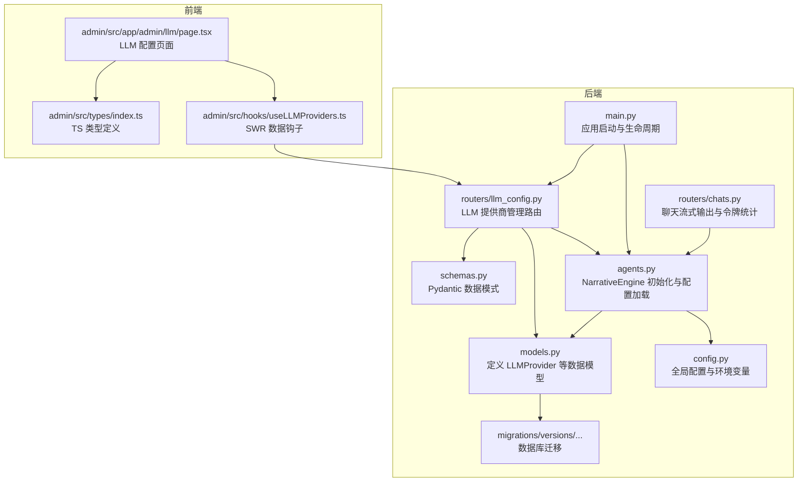
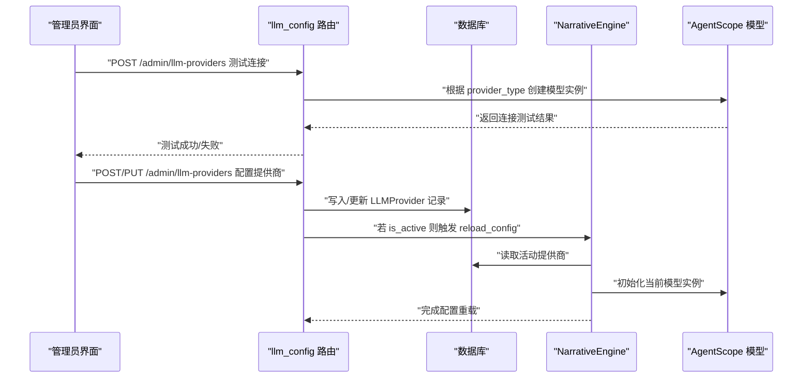
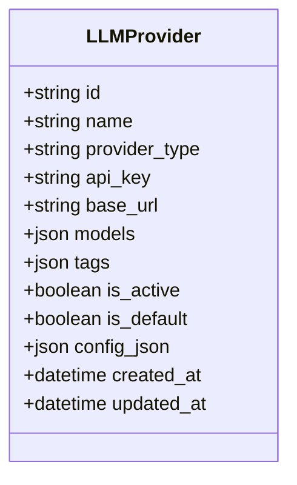
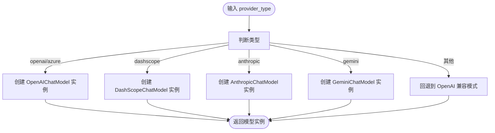
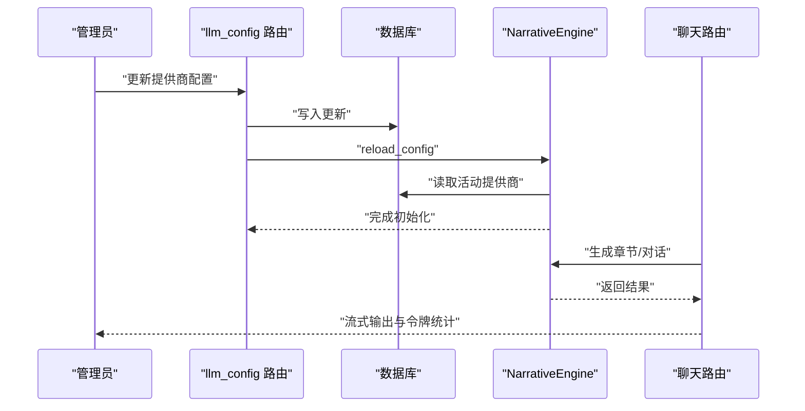
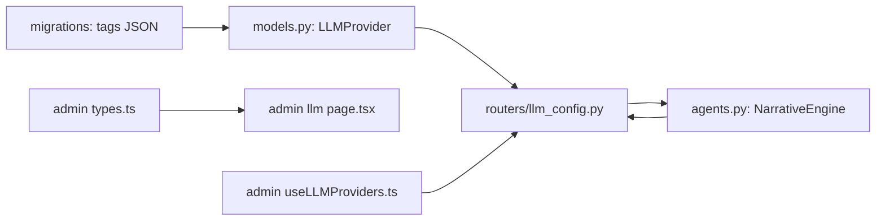

# 大模型提供商模型

<cite>
**本文档引用的文件**
- [backend/models.py](file://backend/models.py)
- [backend/schemas.py](file://backend/schemas.py)
- [backend/routers/llm_config.py](file://backend/routers/llm_config.py)
- [backend/agents.py](file://backend/agents.py)
- [backend/main.py](file://backend/main.py)
- [backend/config.py](file://backend/config.py)
- [backend/admin/src/types/index.ts](file://backend/admin/src/types/index.ts)
- [backend/admin/src/hooks/useLLMProviders.ts](file://backend/admin/src/hooks/useLLMProviders.ts)
- [backend/admin/src/app/admin/llm/page.tsx](file://backend/admin/src/app/admin/llm/page.tsx)
- [backend/routers/chats.py](file://backend/routers/chats.py)
- [backend/migrations/versions/14746eaf1c81_initial.py](file://backend/migrations/versions/14746eaf1c81_initial.py)
</cite>

## 目录
1. [简介](#简介)
2. [项目结构](#项目结构)
3. [核心组件](#核心组件)
4. [架构总览](#架构总览)
5. [详细组件分析](#详细组件分析)
6. [依赖关系分析](#依赖关系分析)
7. [性能考量](#性能考量)
8. [故障排查指南](#故障排查指南)
9. [结论](#结论)
10. [附录](#附录)

## 简介
本文件面向大模型提供商数据模型，围绕 LLMProvider 类的字段结构、配置管理、提供商类型体系、安全与可扩展性、以及动态切换与故障转移等能力进行全面说明。重点涵盖以下方面：
- LLMProvider 的字段设计与用途
- 提供商类型（provider_type）的分类与扩展机制
- API 密钥、基础 URL、模型列表与标签的配置与安全策略
- 激活状态（is_active）、默认提供商（is_default）与配置 JSON 的灵活扩展
- 动态切换、连接测试、故障转移与性能监控的实现思路

## 项目结构
本项目采用前后端分离架构，后端以 FastAPI 为核心，结合 SQLAlchemy ORM 定义数据模型，前端使用 Next.js 管理员界面进行配置与运维。

**图表来源**
- [backend/models.py](file://backend/models.py#L58-L79)
- [backend/schemas.py](file://backend/schemas.py#L4-L34)
- [backend/routers/llm_config.py](file://backend/routers/llm_config.py#L1-L203)
- [backend/agents.py](file://backend/agents.py#L43-L195)
- [backend/config.py](file://backend/config.py#L1-L34)
- [backend/main.py](file://backend/main.py#L83-L127)
- [backend/routers/chats.py](file://backend/routers/chats.py#L180-L209)
- [backend/migrations/versions/14746eaf1c81_initial.py](file://backend/migrations/versions/14746eaf1c81_initial.py#L21-L42)
- [backend/admin/src/types/index.ts](file://backend/admin/src/types/index.ts#L16-L21)
- [backend/admin/src/hooks/useLLMProviders.ts](file://backend/admin/src/hooks/useLLMProviders.ts#L1-L17)
- [backend/admin/src/app/admin/llm/page.tsx](file://backend/admin/src/app/admin/llm/page.tsx#L1-L200)

**章节来源**
- [backend/models.py](file://backend/models.py#L58-L79)
- [backend/schemas.py](file://backend/schemas.py#L4-L34)
- [backend/routers/llm_config.py](file://backend/routers/llm_config.py#L1-L203)
- [backend/agents.py](file://backend/agents.py#L43-L195)
- [backend/main.py](file://backend/main.py#L83-L127)
- [backend/config.py](file://backend/config.py#L1-L34)
- [backend/routers/chats.py](file://backend/routers/chats.py#L180-L209)
- [backend/migrations/versions/14746eaf1c81_initial.py](file://backend/migrations/versions/14746eaf1c81_initial.py#L21-L42)
- [backend/admin/src/types/index.ts](file://backend/admin/src/types/index.ts#L16-L21)
- [backend/admin/src/hooks/useLLMProviders.ts](file://backend/admin/src/hooks/useLLMProviders.ts#L1-L17)
- [backend/admin/src/app/admin/llm/page.tsx](file://backend/admin/src/app/admin/llm/page.tsx#L1-L200)

## 核心组件
- LLMProvider 数据模型：定义提供商的标识、类型、密钥、基础 URL、模型列表、标签、激活与默认状态、扩展配置等字段，并提供时间戳字段用于审计。
- Pydantic 模式：LLMProviderBase/LLMProviderCreate/LLMProviderUpdate/LLMProviderResponse 定义了请求与响应的数据结构，确保前后端一致。
- 管理路由：提供创建、查询、更新、删除与连接测试接口；支持默认提供商的互斥设置与运行时配置重载。
- 叙述引擎：负责从数据库加载活动提供商配置，初始化 AgentScope 模型实例，并在配置变更时重新构建代理。
- 前端管理：管理员界面提供表单、列表展示、连接测试与实时状态过滤。

**章节来源**
- [backend/models.py](file://backend/models.py#L58-L79)
- [backend/schemas.py](file://backend/schemas.py#L4-L34)
- [backend/routers/llm_config.py](file://backend/routers/llm_config.py#L112-L202)
- [backend/agents.py](file://backend/agents.py#L43-L195)
- [backend/admin/src/app/admin/llm/page.tsx](file://backend/admin/src/app/admin/llm/page.tsx#L1-L200)

## 架构总览
下图展示了 LLMProvider 在系统中的角色与交互路径：前端通过管理员界面提交配置，后端路由持久化到数据库，叙述引擎按需加载并初始化模型，聊天路由在运行时使用当前配置进行推理与流式输出。

**图表来源**
- [backend/routers/llm_config.py](file://backend/routers/llm_config.py#L20-L111)
- [backend/routers/llm_config.py](file://backend/routers/llm_config.py#L112-L202)
- [backend/agents.py](file://backend/agents.py#L49-L130)

## 详细组件分析

### LLMProvider 数据模型与字段语义
- 标识与元数据
  - id：UUID 主键，唯一标识提供商
  - name：字符串，唯一索引，便于识别与引用
  - created_at/updated_at：自动记录创建与更新时间
- 配置核心
  - provider_type：字符串，标识提供商类型，如 openai_chat、dashscope_chat、post_api_chat 等
  - api_key：字符串，存储密钥（建议加密存储）
  - base_url：可选字符串，覆盖默认基础 URL
  - models：JSON 数组或字符串，存储可用模型名列表或序列化后的列表
  - tags：JSON 数组，默认空数组，用于分类与筛选
- 状态控制
  - is_active：布尔值，默认 True，控制是否参与运行时选择
  - is_default：布尔值，默认 False，互斥设置，仅允许一个默认提供商
- 扩展配置
  - config_json：JSON 对象，默认空对象，用于传递额外参数（如超时、并发等）

**图表来源**
- [backend/models.py](file://backend/models.py#L58-L79)

**章节来源**
- [backend/models.py](file://backend/models.py#L58-L79)

### 提供商类型（provider_type）分类与扩展机制
- 分类依据
  - 基于 provider_type 字符串前缀或关键字匹配，如 openai、azure、dashscope、anthropic、gemini 等
  - 通过连接测试路由与叙述引擎初始化逻辑进行分发
- 扩展机制
  - 新增提供商类型时，在连接测试与初始化逻辑中添加对应分支
  - config_json 为通用扩展点，可承载各提供商特有的参数
  - 建议通过统一的映射表或注册中心管理类型与适配器，避免硬编码分支膨胀

**图表来源**
- [backend/routers/llm_config.py](file://backend/routers/llm_config.py#L26-L87)
- [backend/agents.py](file://backend/agents.py#L109-L120)

**章节来源**
- [backend/routers/llm_config.py](file://backend/routers/llm_config.py#L26-L87)
- [backend/agents.py](file://backend/agents.py#L109-L120)

### API 密钥管理、基础 URL 与模型列表维护
- API 密钥管理
  - 存储在 api_key 字段，当前未做加密处理；建议在生产环境引入密钥管理服务（KMS）或加密存储
  - 管理端表单支持密码输入，连接测试会临时使用该密钥验证连通性
- 基础 URL 配置
  - base_url 可选，用于覆盖默认网关地址，适用于自建网关或代理场景
- 模型列表维护
  - models 支持数组或字符串两种形式，叙述引擎会解析首个可用模型名
  - 管理端表单支持多模型输入与校验，确保至少有一个模型

**章节来源**
- [backend/models.py](file://backend/models.py#L65-L68)
- [backend/routers/llm_config.py](file://backend/routers/llm_config.py#L35-L36)
- [backend/agents.py](file://backend/agents.py#L80-L91)
- [backend/admin/src/app/admin/llm/page.tsx](file://backend/admin/src/app/admin/llm/page.tsx#L63-L81)

### 标签系统（tags）与激活状态（is_active）管理策略
- 标签系统
  - tags 字段为 JSON 数组，默认为空；可用于标记提供商能力（如 llm、audio、image）或环境（如 dev、prod）
  - 前端可通过过滤器按标签筛选活动提供商
- 激活状态
  - is_active 控制提供商是否参与运行时选择
  - 叙述引擎优先选择 is_active=True 的记录，并按 is_default 降序排序，确保默认提供商优先级最高

**章节来源**
- [backend/models.py](file://backend/models.py#L70-L72)
- [backend/agents.py](file://backend/agents.py#L61-L64)
- [backend/admin/src/types/index.ts](file://backend/admin/src/types/index.ts#L16-L21)
- [backend/admin/src/hooks/useLLMProviders.ts](file://backend/admin/src/hooks/useLLMProviders.ts#L5-L16)

### 默认提供商设置（is_default）与配置 JSON 扩展
- 默认提供商互斥
  - 创建或更新时，若设置 is_default，则自动将其他记录的 is_default 置为 False
  - 叙述引擎按 is_default 降序选择活动提供商
- 配置 JSON 扩展
  - config_json 用于传递额外参数（如超时、并发、重试策略等），在连接测试与模型初始化阶段透传给底层客户端
  - 管理端表单对 JSON 格式进行校验，确保可被正确解析

**章节来源**
- [backend/routers/llm_config.py](file://backend/routers/llm_config.py#L122-L126)
- [backend/routers/llm_config.py](file://backend/routers/llm_config.py#L173-L177)
- [backend/routers/llm_config.py](file://backend/routers/llm_config.py#L30-L31)
- [backend/admin/src/app/admin/llm/page.tsx](file://backend/admin/src/app/admin/llm/page.tsx#L70-L78)

### 动态切换、故障转移与性能监控实现
- 动态切换
  - 当提供商状态变化（如 is_active 或 is_default）或新增/更新记录时，管理路由会触发 narrative_engine.reload_config，使后续请求使用新配置
- 故障转移
  - 叙述引擎在数据库无活动提供商时，会尝试使用配置文件中的默认密钥与模型进行回退初始化
  - 管理端提供“测试连接”接口，可在启用前验证提供商可用性
- 性能监控
  - 聊天路由对部分提供商（如 DashScope）支持增量输出与令牌用量统计，便于监控与计费
  - 建议在叙述引擎层增加调用耗时与错误率指标，结合日志系统进行观测

**图表来源**
- [backend/routers/llm_config.py](file://backend/routers/llm_config.py#L133-L137)
- [backend/routers/llm_config.py](file://backend/routers/llm_config.py#L184-L187)
- [backend/agents.py](file://backend/agents.py#L150-L152)
- [backend/agents.py](file://backend/agents.py#L61-L75)
- [backend/routers/chats.py](file://backend/routers/chats.py#L180-L209)

**章节来源**
- [backend/routers/llm_config.py](file://backend/routers/llm_config.py#L133-L137)
- [backend/routers/llm_config.py](file://backend/routers/llm_config.py#L184-L187)
- [backend/agents.py](file://backend/agents.py#L61-L75)
- [backend/agents.py](file://backend/agents.py#L150-L152)
- [backend/routers/chats.py](file://backend/routers/chats.py#L180-L209)

## 依赖关系分析
- 数据模型与路由
  - LLMProvider 模型被 llm_config 路由直接使用，支撑 CRUD 与测试连接
- 路由与叙述引擎
  - 管理路由在状态变更时调用 narrative_engine.reload_config，驱动配置重载
- 前端与后端
  - 管理端页面通过 SWR 获取活动提供商列表，配合 is_active 过滤
- 数据库迁移
  - tags 字段从 TEXT 迁移为 JSON，提升结构化查询与前端渲染能力

**图表来源**
- [backend/models.py](file://backend/models.py#L58-L79)
- [backend/routers/llm_config.py](file://backend/routers/llm_config.py#L1-L203)
- [backend/agents.py](file://backend/agents.py#L43-L195)
- [backend/admin/src/types/index.ts](file://backend/admin/src/types/index.ts#L16-L21)
- [backend/admin/src/hooks/useLLMProviders.ts](file://backend/admin/src/hooks/useLLMProviders.ts#L1-L17)
- [backend/migrations/versions/14746eaf1c81_initial.py](file://backend/migrations/versions/14746eaf1c81_initial.py#L23-L28)

**章节来源**
- [backend/models.py](file://backend/models.py#L58-L79)
- [backend/routers/llm_config.py](file://backend/routers/llm_config.py#L1-L203)
- [backend/agents.py](file://backend/agents.py#L43-L195)
- [backend/admin/src/types/index.ts](file://backend/admin/src/types/index.ts#L16-L21)
- [backend/admin/src/hooks/useLLMProviders.ts](file://backend/admin/src/hooks/useLLMProviders.ts#L1-L17)
- [backend/migrations/versions/14746eaf1c81_initial.py](file://backend/migrations/versions/14746eaf1c81_initial.py#L23-L28)

## 性能考量
- 连接测试
  - 使用最小化消息进行快速连通性验证，避免长耗时请求
- 模型初始化
  - 将初始化过程封装在 reload_config 中，仅在配置变更时触发，减少重复初始化开销
- 流式输出
  - 部分提供商支持增量输出与令牌统计，有助于降低首字延迟并监控资源消耗
- 缓存与重试
  - 建议在叙述引擎层引入调用缓存与指数退避重试策略，提升稳定性

[本节为通用指导，无需特定文件引用]

## 故障排查指南
- “未找到活动提供商”
  - 检查数据库是否存在 is_active=True 的记录；若无，确认是否设置了 is_default 回退
  - 查看启动日志与 narrative_engine 初始化流程
- “连接测试失败”
  - 核对 provider_type 是否受支持；检查 api_key、base_url 与模型名
  - 确认 config_json 格式有效且不包含不被支持的键
- “默认提供商未生效”
  - 确认仅有一个 is_default=True 的记录；创建/更新时是否正确清除了其他记录
- “模型列表解析异常”
  - 确认 models 字段为数组或合法的 JSON 字符串；叙述引擎会优先取第一个模型

**章节来源**
- [backend/agents.py](file://backend/agents.py#L66-L75)
- [backend/routers/llm_config.py](file://backend/routers/llm_config.py#L122-L126)
- [backend/routers/llm_config.py](file://backend/routers/llm_config.py#L173-L177)
- [backend/agents.py](file://backend/agents.py#L80-L91)

## 结论
LLMProvider 模型通过结构化的字段设计与灵活的扩展配置，为多提供商、多模型的运行时选择提供了坚实基础。结合连接测试、动态切换与回退机制，系统能够在保证安全性的同时实现高可用与可观测性。建议在生产环境中强化密钥管理、引入指标监控与告警，并持续扩展提供商类型与配置项，以满足不断演进的业务需求。

[本节为总结性内容，无需特定文件引用]

## 附录

### 字段与模式对照表
- 数据模型字段
  - id、name、provider_type、api_key、base_url、models、tags、is_active、is_default、config_json、created_at、updated_at
- Pydantic 模式
  - LLMProviderBase：定义创建与更新的基础字段
  - LLMProviderCreate：继承自 LLMProviderBase，用于创建
  - LLMProviderUpdate：可选字段集合，支持部分更新
  - LLMProviderResponse：包含 id、created_at、updated_at 的响应模型
  - TestConnectionRequest：连接测试请求体

**章节来源**
- [backend/models.py](file://backend/models.py#L58-L79)
- [backend/schemas.py](file://backend/schemas.py#L4-L34)
- [backend/schemas.py](file://backend/schemas.py#L15-L27)
- [backend/schemas.py](file://backend/schemas.py#L29-L34)
- [backend/schemas.py](file://backend/schemas.py#L36-L41)