# 剧场编辑器模型

<cite>
**本文档引用的文件**
- [m9n0o1p2q3r4_add_theater_system.py](file://backend/migrations/versions/m9n0o1p2q3r4_add_theater_system.py)
- [models.py](file://backend/models.py)
- [schemas.py](file://backend/schemas.py)
- [theaters.py](file://backend/routers/theaters.py)
- [theater.py](file://backend/services/theater.py)
- [theaterApi.ts](file://frontend/src/lib/theaterApi.ts)
- [useCanvasStore.ts](file://frontend/src/store/useCanvasStore.ts)
- [ScriptNode.tsx](file://frontend/src/components/canvas/ScriptNode.tsx)
- [CharacterNode.tsx](file://frontend/src/components/canvas/CharacterNode.tsx)
- [StoryboardNode.tsx](file://frontend/src/components/canvas/StoryboardNode.tsx)
</cite>

## 目录
1. [简介](#简介)
2. [项目结构](#项目结构)
3. [核心组件](#核心组件)
4. [架构概览](#架构概览)
5. [详细组件分析](#详细组件分析)
6. [依赖关系分析](#依赖关系分析)
7. [性能考虑](#性能考虑)
8. [故障排除指南](#故障排除指南)
9. [结论](#结论)

## 简介

本文档为无限叙事游戏中的剧场编辑器系统提供全面的技术文档。该系统是整个创作工具链的核心数据结构，负责存储和管理用户创建的创意项目（剧场）、画布节点和连接关系，支持可视化脚本编写、角色管理、故事板设计和视频生成等功能。

剧场编辑器系统基于 SQLAlchemy ORM 构建，采用异步数据库连接，支持实时画布编辑、节点类型管理、连接关系处理以及云端同步等功能。该系统通过与前端画布组件的紧密集成，实现了完整的可视化创作体验。

## 项目结构

本项目采用分层架构设计，剧场编辑器系统位于后端服务层，与数据库层、API路由层和前端画布组件协同工作。

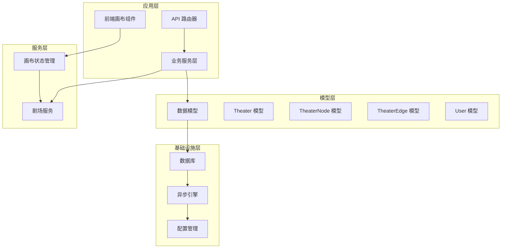

**图表来源**
- [models.py:75-126](file://backend/models.py#L75-L126)
- [theaters.py:1-110](file://backend/routers/theaters.py#L1-L110)
- [useCanvasStore.ts:178-421](file://frontend/src/store/useCanvasStore.ts#L178-L421)

**章节来源**
- [models.py:1-408](file://backend/models.py#L1-L408)
- [theaters.py:1-110](file://backend/routers/theaters.py#L1-L110)
- [useCanvasStore.ts:1-421](file://frontend/src/store/useCanvasStore.ts#L1-L421)

## 核心组件

### 剧场系统概述

剧场编辑器系统由三个核心数据模型组成，形成了完整的创作工具链：

#### 主要字段结构

| 字段名 | 数据类型 | 默认值 | 描述 | 约束 |
|--------|----------|--------|------|------|
| id | String(36) | - | 剧场唯一标识符 | 主键, UUID |
| user_id | String(36) | - | 关联用户的 UUID | 外键, users.id |
| title | String(200) | "未命名剧场" | 剧场标题 | - |
| description | Text | - | 剧场描述 | - |
| thumbnail_url | String | - | 缩略图 URL | - |
| status | String(20) | "draft" | 剧场状态 | draft/published/archived |
| canvas_viewport | JSON | {} | 画布视口状态 | - |
| settings | JSON | {} | 剧场配置设置 | - |
| node_count | Integer | 0 | 节点数量统计 | - |

#### 外键关联关系

剧场系统与用户模型建立了一对多的外键关联关系：
- `user_id` -> `users.id`
- 支持级联删除：当用户被删除时，其所有剧场也会被删除

**章节来源**
- [models.py:75-91](file://backend/models.py#L75-L91)
- [m9n0o1p2q3r4_add_theater_system.py:22-36](file://backend/migrations/versions/m9n0o1p2q3r4_add_theater_system.py#L22-L36)

### 节点系统概述

TheaterNode 模型定义了画布上的各种节点类型，支持不同的创作需求：

#### 节点类型设计

| 节点类型 | 数据结构 | 用途 | 特殊字段 |
|----------|----------|------|----------|
| script | ScriptNodeData | 文本脚本编辑 | title, description, content, tags |
| character | CharacterNodeData | 角色头像管理 | name, description, avatar, imageUrl |
| storyboard | StoryboardNodeData | 故事板设计 | shotNumber, description, duration, pivotConfig |
| video | VideoNodeData | 视频内容管理 | name, description, videoUrl, uploading |

#### 节点数据结构

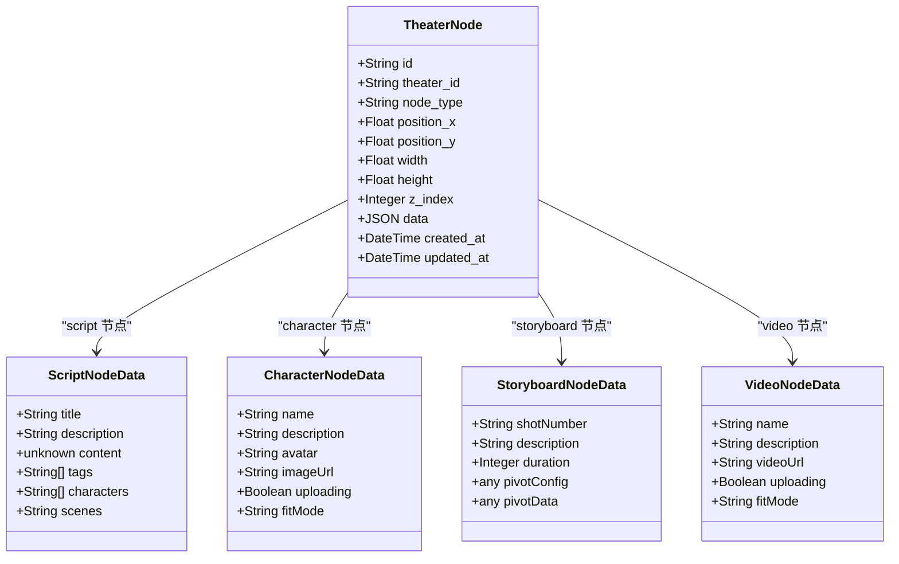

**图表来源**
- [models.py:93-108](file://backend/models.py#L93-L108)
- [useCanvasStore.ts:26-61](file://frontend/src/store/useCanvasStore.ts#L26-L61)

**章节来源**
- [models.py:93-126](file://backend/models.py#L93-L126)
- [useCanvasStore.ts:26-61](file://frontend/src/store/useCanvasStore.ts#L26-L61)

### 连接系统概述

TheaterEdge 模型定义了节点之间的连接关系，支持可视化的故事流程设计：

#### 边连接设计

| 字段名 | 数据类型 | 默认值 | 描述 |
|--------|----------|--------|------|
| id | String(36) | - | 边唯一标识符 |
| theater_id | String(36) | - | 关联剧场的 UUID |
| source_node_id | String(36) | - | 源节点 ID |
| target_node_id | String(36) | - | 目标节点 ID |
| source_handle | String(50) | - | 源节点句柄 |
| target_handle | String(50) | - | 目标节点句柄 |
| edge_type | String(20) | "custom" | 边类型 |
| animated | Boolean | True | 是否动画显示 |
| style | JSON | {} | 边样式配置 |

#### 连接约束

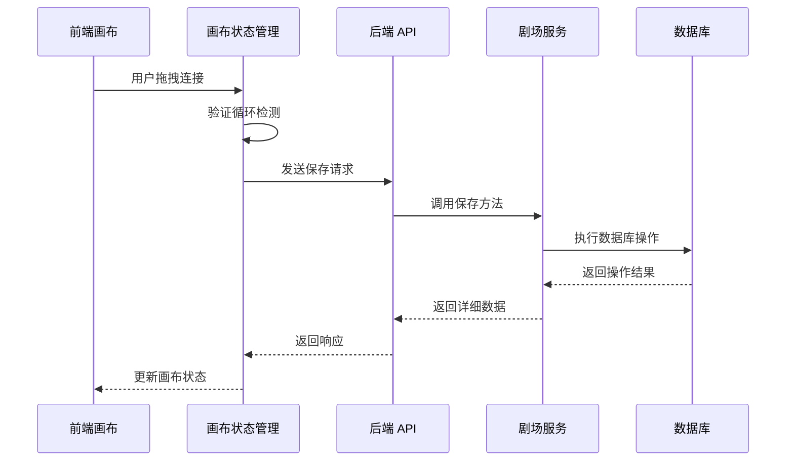

**图表来源**
- [useCanvasStore.ts:208-224](file://frontend/src/store/useCanvasStore.ts#L208-L224)
- [theater.py:108-228](file://backend/services/theater.py#L108-L228)

**章节来源**
- [models.py:111-126](file://backend/models.py#L111-L126)
- [useCanvasStore.ts:208-224](file://frontend/src/store/useCanvasStore.ts#L208-L224)

## 架构概览

剧场编辑器系统在整个应用中扮演着核心创作工具的角色，连接着多个关键组件：

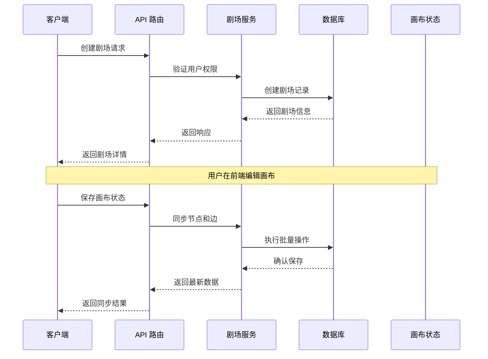

**图表来源**
- [theaters.py:20-28](file://backend/routers/theaters.py#L20-L28)
- [theater.py:17-31](file://backend/services/theater.py#L17-L31)
- [useCanvasStore.ts:359-386](file://frontend/src/store/useCanvasStore.ts#L359-L386)

## 详细组件分析

### 剧场状态管理系统

#### 状态生命周期

剧场系统遵循严格的状态管理流程：

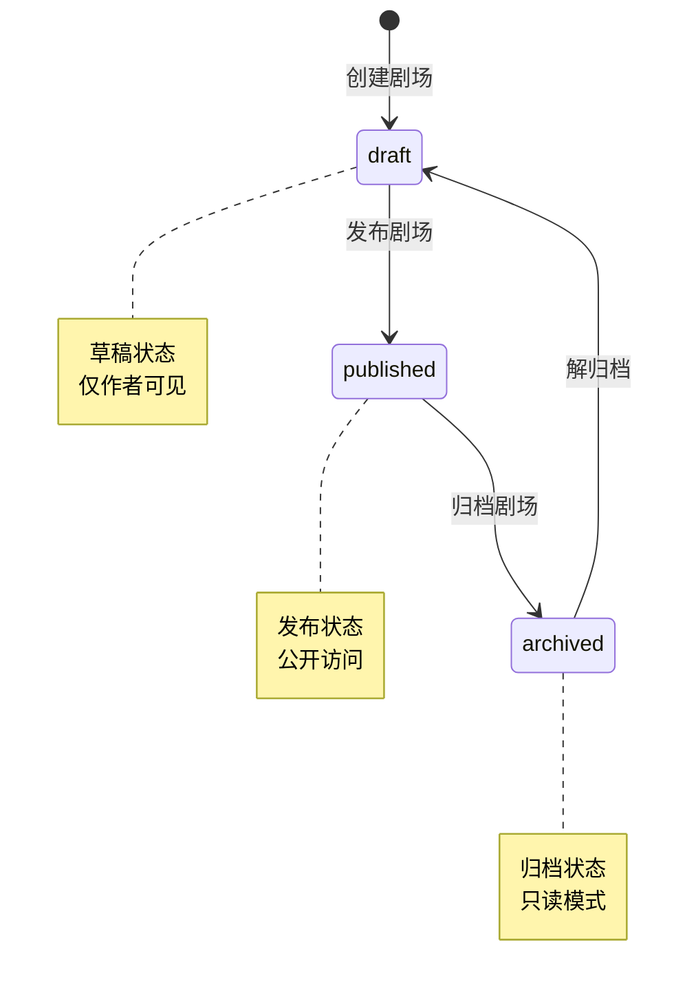

**图表来源**
- [models.py:84-84](file://backend/models.py#L84-L84)
- [schemas.py:688-688](file://backend/schemas.py#L688-L688)

#### 状态转换规则

1. **draft 状态**
   - 新创建的剧场默认状态
   - 仅创建者可以访问
   - 支持编辑和发布

2. **published 状态**
   - 通过发布流程激活
   - 公开可见
   - 支持分享和协作

3. **archived 状态**
   - 通过归档流程激活
   - 只读模式
   - 仍可恢复

**章节来源**
- [models.py:84-84](file://backend/models.py#L84-L84)
- [schemas.py:688-688](file://backend/schemas.py#L688-L688)

### 画布节点管理系统

#### 节点类型设计

节点系统支持四种主要类型，每种都有特定的数据结构和交互方式：

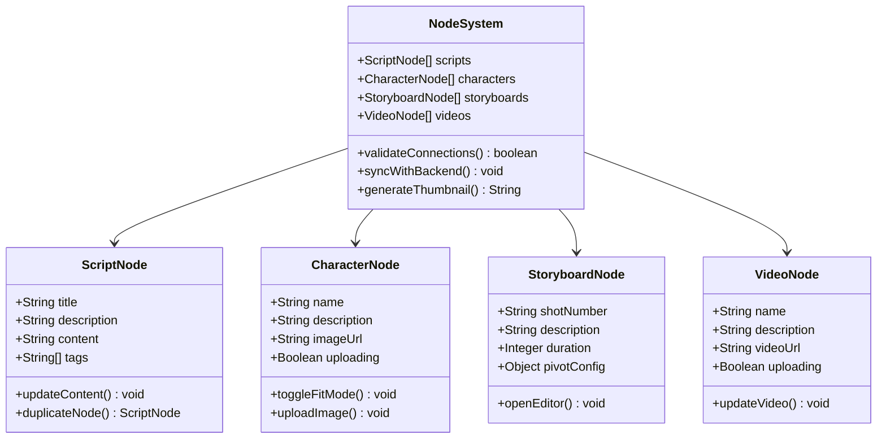

**图表来源**
- [useCanvasStore.ts:26-61](file://frontend/src/store/useCanvasStore.ts#L26-L61)
- [ScriptNode.tsx:11-341](file://frontend/src/components/canvas/ScriptNode.tsx#L11-L341)
- [CharacterNode.tsx:12-660](file://frontend/src/components/canvas/CharacterNode.tsx#L12-L660)
- [StoryboardNode.tsx:11-308](file://frontend/src/components/canvas/StoryboardNode.tsx#L11-L308)

#### 节点操作机制

1. **节点创建**
   - 支持拖拽创建不同类型节点
   - 自动生成唯一 ID
   - 设置初始位置和尺寸

2. **节点编辑**
   - 双击进入编辑模式
   - 实时保存更改
   - 支持撤销重做

3. **节点复制**
   - 支持一键复制节点
   - 自动调整位置避免重叠
   - 保持数据完整性

**章节来源**
- [useCanvasStore.ts:226-258](file://frontend/src/store/useCanvasStore.ts#L226-L258)
- [ScriptNode.tsx:80-100](file://frontend/src/components/canvas/ScriptNode.tsx#L80-L100)

### 连接关系管理系统

#### 边连接设计

连接系统支持多种连接模式和视觉效果：

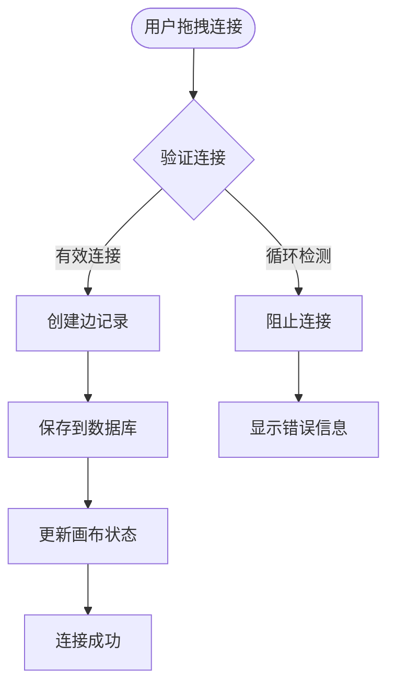

**图表来源**
- [useCanvasStore.ts:214-224](file://frontend/src/store/useCanvasStore.ts#L214-L224)
- [theater.py:186-218](file://backend/services/theater.py#L186-L218)

#### 连接约束机制

1. **循环检测**
   - 防止创建循环依赖
   - 实时验证连接有效性
   - 提供视觉反馈

2. **重复连接**
   - 防止重复创建相同连接
   - 自动去重处理
   - 保持数据一致性

3. **连接验证**
   - 验证源目标节点存在性
   - 检查节点类型兼容性
   - 确保句柄匹配

**章节来源**
- [useCanvasStore.ts:214-224](file://frontend/src/store/useCanvasStore.ts#L214-L224)
- [theater.py:186-218](file://backend/services/theater.py#L186-L218)

### 云端同步机制

#### 全量同步策略

剧场系统采用全量同步策略，确保数据一致性：

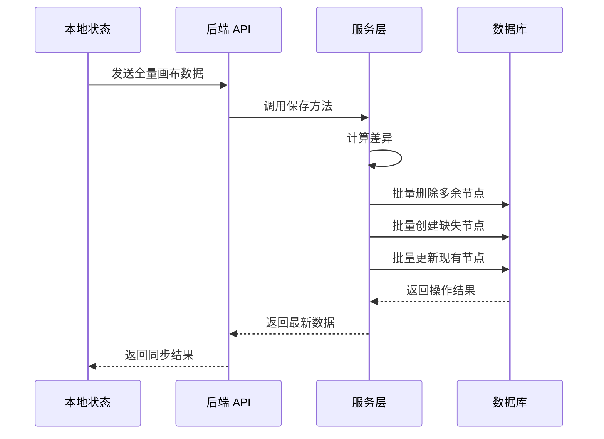

**图表来源**
- [theater.py:108-228](file://backend/services/theater.py#L108-L228)
- [useCanvasStore.ts:368-386](file://frontend/src/store/useCanvasStore.ts#L368-L386)

#### 同步优化策略

1. **集合运算**
   - 使用集合差集计算差异
   - 减少数据库往返次数
   - 提高同步效率

2. **批量操作**
   - 批量删除多余节点
   - 批量创建缺失节点
   - 批量更新现有节点

3. **状态管理**
   - 维护本地历史状态
   - 支持撤销重做
   - 实时脏状态检测

**章节来源**
- [theater.py:108-228](file://backend/services/theater.py#L108-L228)
- [useCanvasStore.ts:294-335](file://frontend/src/store/useCanvasStore.ts#L294-L335)

### 剧场与用户的关联关系

#### 外键约束

剧场系统与用户之间建立了严格的外键约束：

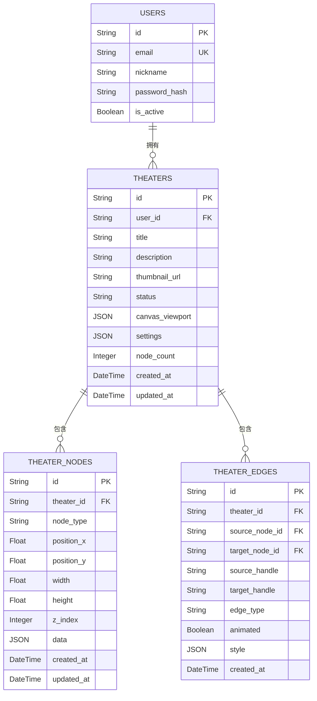

**图表来源**
- [models.py:35-73](file://backend/models.py#L35-L73)
- [models.py:75-126](file://backend/models.py#L75-L126)

#### 级联操作

- **级联删除**：当删除用户时，自动删除其所有相关剧场
- **级联更新**：用户 ID 变更时，自动更新相关剧场的外键
- **级联清理**：剧场删除时，自动清理其所有节点和边

**章节来源**
- [models.py:79-79](file://backend/models.py#L79-L79)
- [m9n0o1p2q3r4_add_theater_system.py:104-106](file://backend/migrations/versions/m9n0o1p2q3r4_add_theater_system.py#L104-L106)

## 依赖关系分析

### 数据库连接管理

系统使用异步 SQLAlchemy 连接池管理数据库连接：

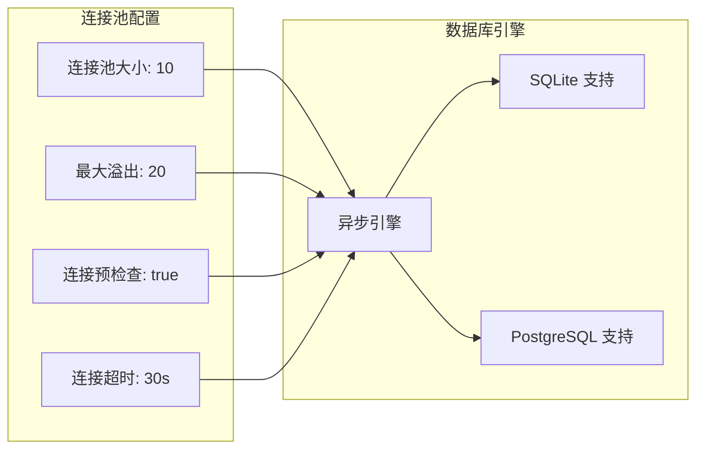

**图表来源**
- [models.py:1-408](file://backend/models.py#L1-L408)

### 依赖注入模式

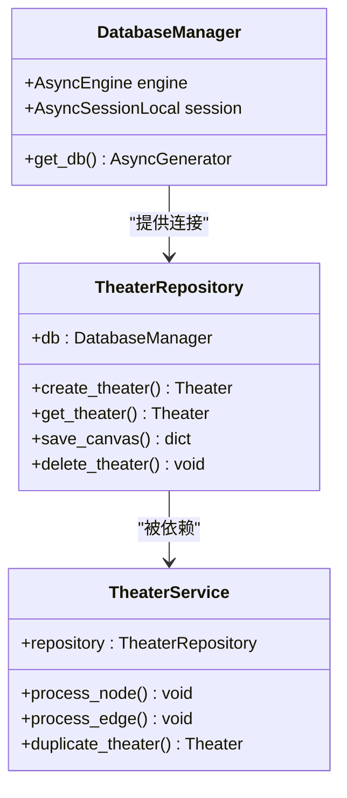

**图表来源**
- [models.py:1-408](file://backend/models.py#L1-L408)
- [theater.py:13-16](file://backend/services/theater.py#L13-L16)

**章节来源**
- [models.py:1-408](file://backend/models.py#L1-L408)
- [theater.py:13-16](file://backend/services/theater.py#L13-L16)

## 性能考虑

### 存储策略优化

1. **索引优化**
   - 剧场 ID 建立主键索引
   - 用户 ID 建立外键索引
   - 状态字段建立索引以支持快速查询

2. **数据类型选择**
   - 使用 String(36) 存储 UUID，确保唯一性
   - 使用 JSON 字段存储动态数据结构
   - 使用 Float 存储坐标和尺寸信息

3. **缓存策略**
   - 画布状态缓存最近编辑的剧场
   - 节点数据缓存常用配置
   - 连接关系缓存常用查询结果

### 查询优化

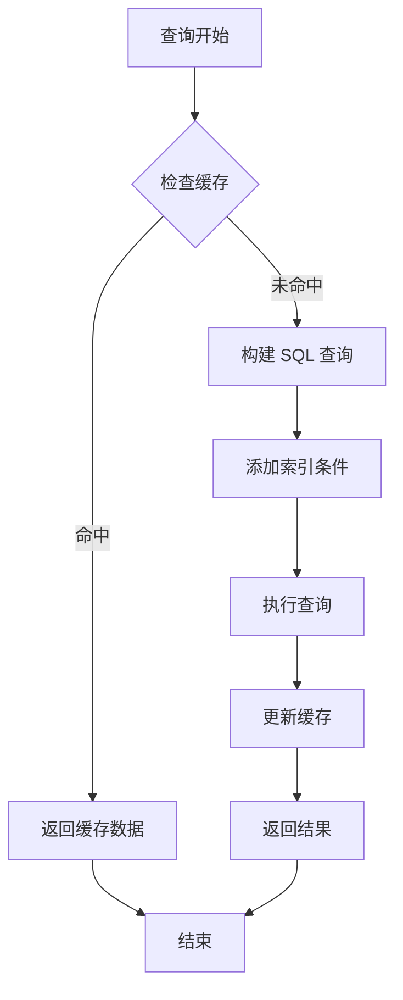

**图表来源**
- [theater.py:46-60](file://backend/services/theater.py#L46-L60)
- [theater.py:62-89](file://backend/services/theater.py#L62-L89)

### 一致性保证机制

1. **事务管理**
   - 所有剧场操作都在事务中执行
   - 支持回滚操作确保数据一致性
   - 异步事务支持防止死锁

2. **并发控制**
   - 使用连接池管理并发连接
   - 避免同时修改同一剧场
   - 支持读写分离

3. **数据完整性**
   - 外键约束确保引用完整性
   - 级联操作自动维护数据关系
   - 状态验证防止无效数据

**章节来源**
- [models.py:1-408](file://backend/models.py#L1-L408)
- [theater.py:103-106](file://backend/services/theater.py#L103-L106)

## 故障排除指南

### 常见问题诊断

#### 剧场状态异常

**问题症状**：剧场状态无法正常切换
**解决方案**：
1. 检查用户权限验证
2. 验证数据库连接状态
3. 查看后台任务队列状态

#### 画布同步失败

**问题症状**：节点或边无法正确保存
**解决方案**：
1. 检查网络连接状态
2. 验证 API 服务可用性
3. 查看数据库事务状态

#### 节点操作异常

**问题症状**：节点创建或编辑失败
**解决方案**：
1. 检查前端状态管理
2. 验证节点类型兼容性
3. 查看浏览器控制台错误

### 错误处理机制

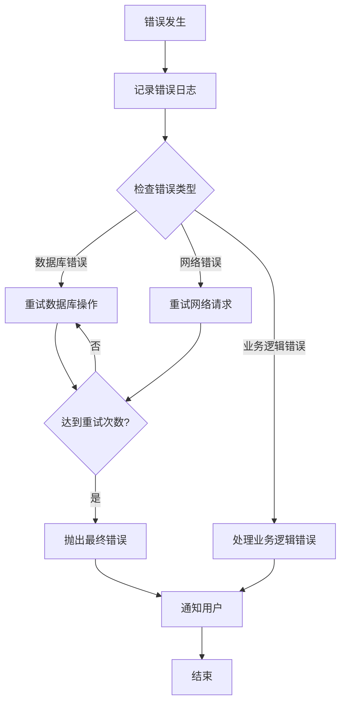

**图表来源**
- [theater.py:103-106](file://backend/services/theater.py#L103-L106)
- [useCanvasStore.ts:381-385](file://frontend/src/store/useCanvasStore.ts#L381-L385)

**章节来源**
- [theater.py:103-106](file://backend/services/theater.py#L103-L106)
- [useCanvasStore.ts:381-385](file://frontend/src/store/useCanvasStore.ts#L381-L385)

## 结论

剧场编辑器系统为无限叙事游戏提供了强大的创作工具框架。通过精心设计的三层数据模型、完善的节点管理系统和智能的同步机制，该系统能够支持复杂的可视化创作体验。

### 主要优势

1. **模块化设计**：清晰的职责分离和依赖关系
2. **扩展性强**：支持多种节点类型和连接模式
3. **性能优化**：异步处理和缓存策略
4. **数据安全**：完善的约束和一致性保证

### 未来改进方向

1. **实时协作**：实现多用户实时编辑功能
2. **版本管理**：增强版本控制和历史记录
3. **插件系统**：支持第三方节点类型扩展
4. **性能监控**：增强系统监控和故障预警能力

该系统为整个创作工具链奠定了坚实的基础，通过持续的优化和改进，将为用户提供更加丰富和高效的创作体验。