# 故事章节模型

<cite>
**本文档引用的文件**
- [models.py](file://backend/models.py)
- [tasks.py](file://backend/tasks.py)
- [services.py](file://backend/services.py)
- [agents.py](file://backend/agents.py)
- [database.py](file://backend/database.py)
- [config.py](file://backend/config.py)
- [a3b8c9d0e1f2_convert_ids_to_uuid.py](file://backend/migrations/versions/a3b8c9d0e1f2_convert_ids_to_uuid.py)
</cite>

## 目录
1. [简介](#简介)
2. [项目结构](#项目结构)
3. [核心组件](#核心组件)
4. [架构概览](#架构概览)
5. [详细组件分析](#详细组件分析)
6. [依赖关系分析](#依赖关系分析)
7. [性能考虑](#性能考虑)
8. [故障排除指南](#故障排除指南)
9. [结论](#结论)

## 简介

本文档为无限叙事剧场中的故事章节数据模型提供全面的技术文档。该模型是整个叙事引擎的核心数据结构，负责存储和管理玩家故事的各个章节内容、状态管理和智能生成机制。

故事章节模型基于 SQLAlchemy ORM 构建，采用异步数据库连接，支持动态章节生成、状态管理、选择分支处理以及世界状态快照等功能。该模型通过与其他组件的紧密集成，实现了完整的叙事体验闭环。

## 项目结构

本项目采用分层架构设计，故事章节模型位于后端服务层，与数据库层、任务调度层和代理服务层协同工作。

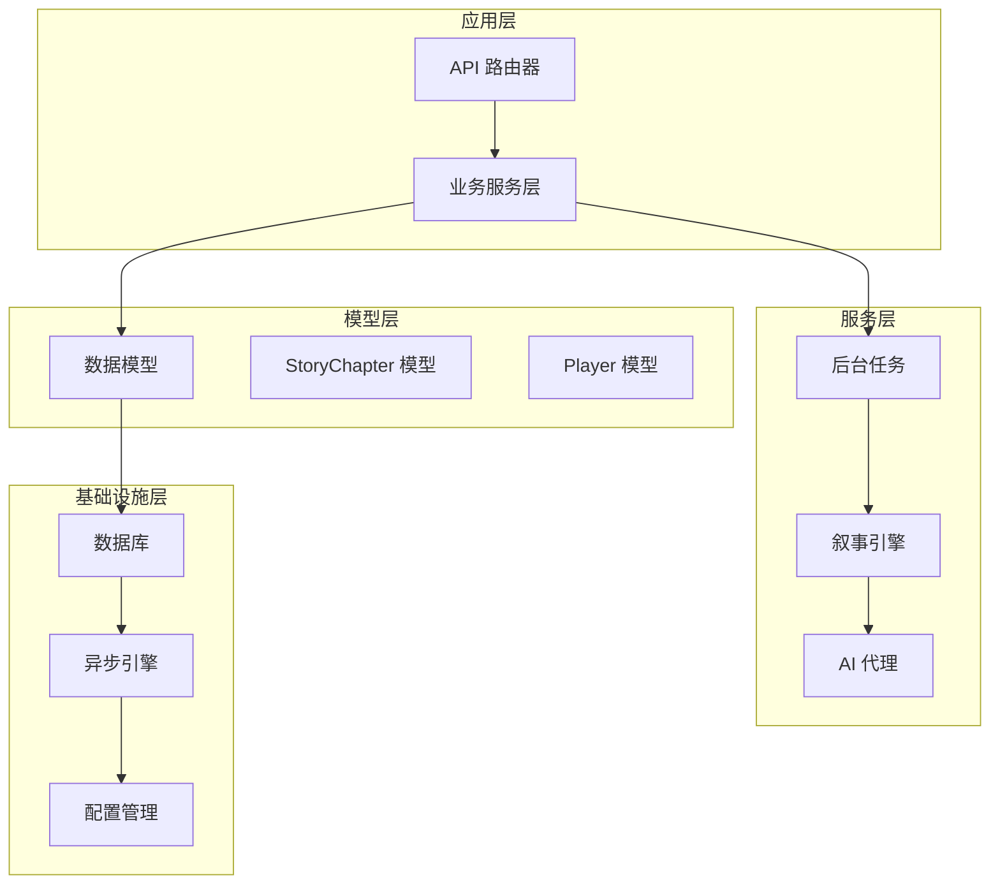

**图表来源**
- [models.py](file://backend/models.py#L24-L43)
- [database.py](file://backend/database.py#L1-L31)
- [config.py](file://backend/config.py#L1-L34)

**章节来源**
- [models.py](file://backend/models.py#L1-L122)
- [database.py](file://backend/database.py#L1-L31)
- [config.py](file://backend/config.py#L1-L34)

## 核心组件

### StoryChapter 类概述

StoryChapter 是故事章节数据模型的核心类，继承自 SQLAlchemy 的 Base 类，定义了完整的章节数据结构和业务逻辑。

#### 主要字段结构

| 字段名 | 数据类型 | 默认值 | 描述 | 约束 |
|--------|----------|--------|------|------|
| id | Integer | - | 章节唯一标识符 | 主键, 自增 |
| player_id | String(36) | - | 关联玩家的 UUID | 外键, players.id |
| chapter_number | Integer | - | 章节序号 | - |
| title | String | - | 章节标题 | - |
| content | Text | - | 章节主要内容 | - |
| status | String | "pending" | 章节状态 | - |
| choices | JSON | [] | 可选分支列表 | - |
| summary_embedding | JSON | - | 摘要向量表示 | - |
| world_state_snapshot | JSON | - | 世界状态快照 | - |
| created_at | DateTime | 当前时间 | 创建时间戳 | - |

#### 外键关联关系

StoryChapter 与 Player 模型建立了一对多的外键关联关系：
- `player_id` -> `players.id`
- 支持级联删除：当玩家被删除时，其所有章节也会被删除

**章节来源**
- [models.py](file://backend/models.py#L24-L43)
- [a3b8c9d0e1f2_convert_ids_to_uuid.py](file://backend/migrations/versions/a3b8c9d0e1f2_convert_ids_to_uuid.py#L131-L146)

## 架构概览

故事章节模型在整个系统中扮演着核心数据枢纽的角色，连接着多个关键组件：

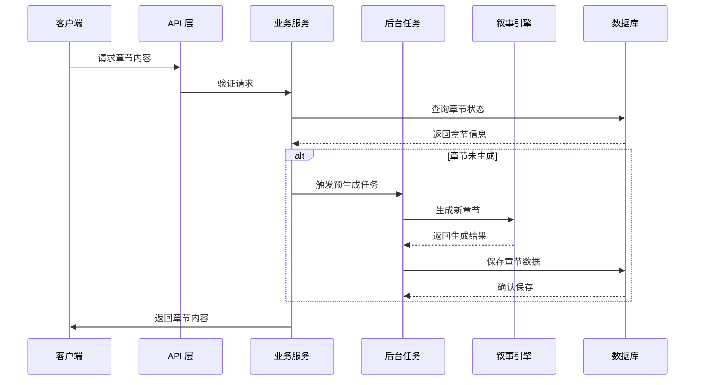

**图表来源**
- [services.py](file://backend/services.py#L31-L65)
- [tasks.py](file://backend/tasks.py#L7-L55)
- [agents.py](file://backend/agents.py#L154-L191)

## 详细组件分析

### 章节状态管理系统

#### 状态生命周期

故事章节的状态管理遵循严格的生命周期流程：

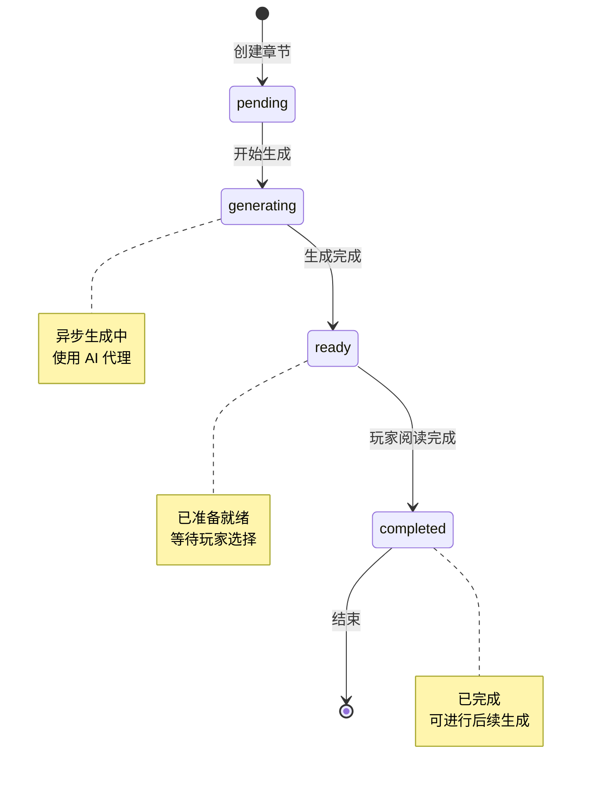

**图表来源**
- [models.py](file://backend/models.py#L33-L34)
- [tasks.py](file://backend/tasks.py#L43-L52)

#### 状态转换规则

1. **pending 状态**
   - 新创建的章节默认状态
   - 表示章节已创建但尚未开始生成

2. **generating 状态**
   - 内部状态，用于标记正在生成过程中
   - 不直接对外暴露给客户端

3. **ready 状态**
   - 章节生成完成，内容可用
   - 可以被玩家访问和阅读

4. **completed 状态**
   - 玩家已完成阅读当前章节
   - 可触发后续章节的预生成

**章节来源**
- [models.py](file://backend/models.py#L33-L34)
- [services.py](file://backend/services.py#L34-L55)

### 选择分支数据结构

#### choices 字段设计

选择分支使用 JSON 格式存储，支持动态生成和扩展：

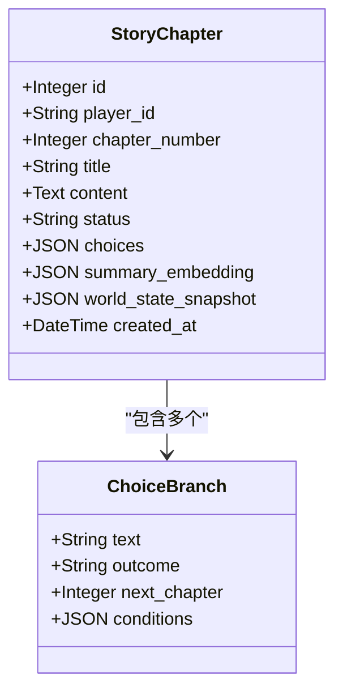

**图表来源**
- [models.py](file://backend/models.py#L24-L43)

#### 动态生成机制

选择分支通过以下流程动态生成：

1. **内容分析**：分析当前章节的内容和上下文
2. **分支预测**：AI 代理预测可能的剧情发展方向
3. **选项生成**：生成具有吸引力的选择项
4. **条件绑定**：为每个选择绑定相应的触发条件

**章节来源**
- [models.py](file://backend/models.py#L37-L37)
- [agents.py](file://backend/agents.py#L166-L185)

### 摘要嵌入向量系统

#### summary_embedding 字段

摘要嵌入向量用于章节内容的向量化表示，支持：

- **一致性检查**：验证章节内容的连贯性
- **相似度计算**：比较不同章节的相似程度
- **推荐系统**：为玩家推荐相关内容

#### 实现原理

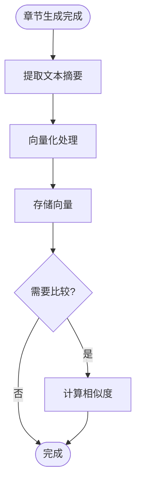

**图表来源**
- [models.py](file://backend/models.py#L40-L40)

**章节来源**
- [models.py](file://backend/models.py#L39-L41)

### 世界状态快照系统

#### world_state_snapshot 字段

世界状态快照记录章节生成时的世界状态，包括：

- **NPC 关系状态**：角色之间的关系变化
- **环境变量**：场景和环境的当前状态
- **玩家状态**：玩家的属性和进度

#### 快照机制

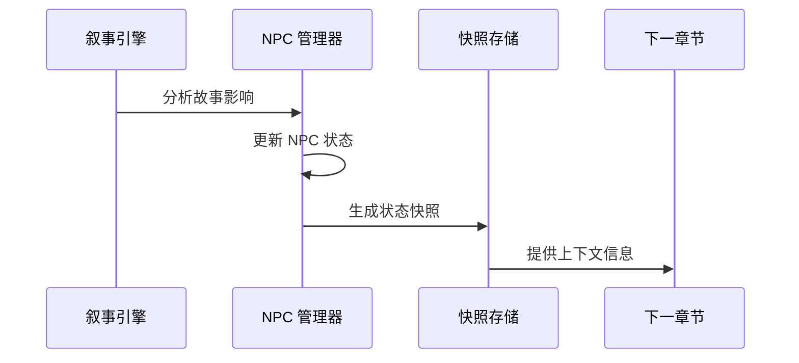

**图表来源**
- [services.py](file://backend/services.py#L39-L40)
- [tasks.py](file://backend/tasks.py#L49-L49)

**章节来源**
- [models.py](file://backend/models.py#L41-L41)
- [services.py](file://backend/services.py#L39-L40)

### 章节与玩家的关联关系

#### 外键约束

StoryChapter 与 Player 之间建立了严格的外键约束：

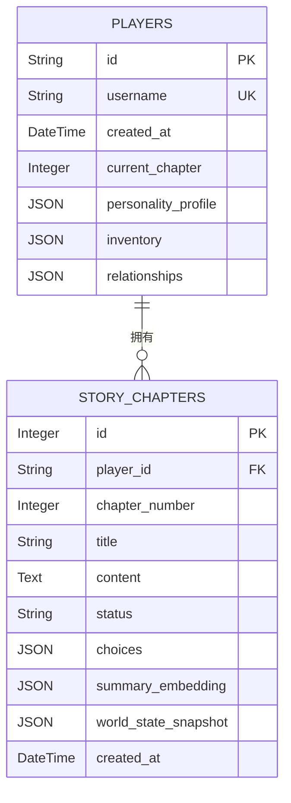

**图表来源**
- [models.py](file://backend/models.py#L9-L22)
- [models.py](file://backend/models.py#L24-L43)

#### 级联操作

- **级联删除**：当删除玩家时，自动删除其所有相关章节
- **级联更新**：玩家 ID 变更时，自动更新相关章节的外键

**章节来源**
- [models.py](file://backend/models.py#L28-L28)
- [a3b8c9d0e1f2_convert_ids_to_uuid.py](file://backend/migrations/versions/a3b8c9d0e1f2_convert_ids_to_uuid.py#L142-L142)

## 依赖关系分析

### 数据库连接管理

系统使用异步 SQLAlchemy 连接池管理数据库连接：

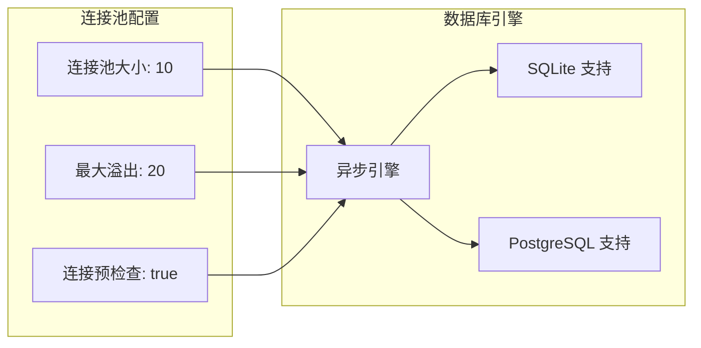

**图表来源**
- [database.py](file://backend/database.py#L8-L23)
- [config.py](file://backend/config.py#L15-L15)

### 依赖注入模式

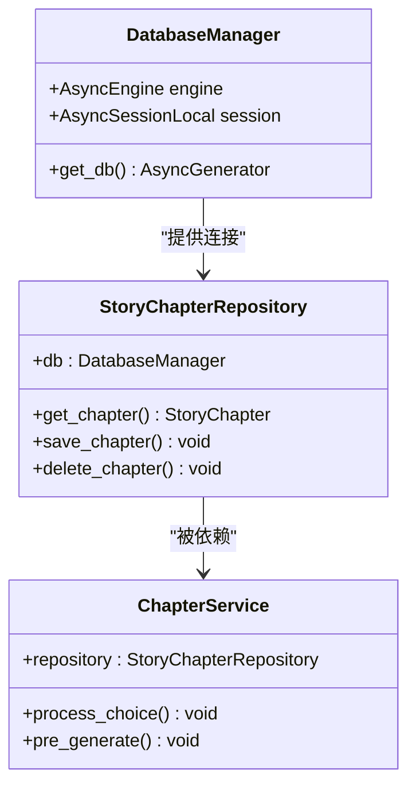

**图表来源**
- [database.py](file://backend/database.py#L1-L31)
- [models.py](file://backend/models.py#L24-L43)

**章节来源**
- [database.py](file://backend/database.py#L1-L31)
- [models.py](file://backend/models.py#L24-L43)

## 性能考虑

### 存储策略优化

1. **索引优化**
   - 章节 ID 建立普通索引
   - 玩家 ID 建立外键索引
   - 章节号建立索引以支持快速查询

2. **数据类型选择**
   - 使用 Integer 类型存储章节号，提高查询效率
   - 使用 Text 类型存储长文本内容
   - 使用 JSON 类型存储动态数据结构

3. **缓存策略**
   - 章节内容缓存最近访问的章节
   - 状态信息缓存常用查询结果
   - 向量数据缓存相似度计算结果

### 查询优化

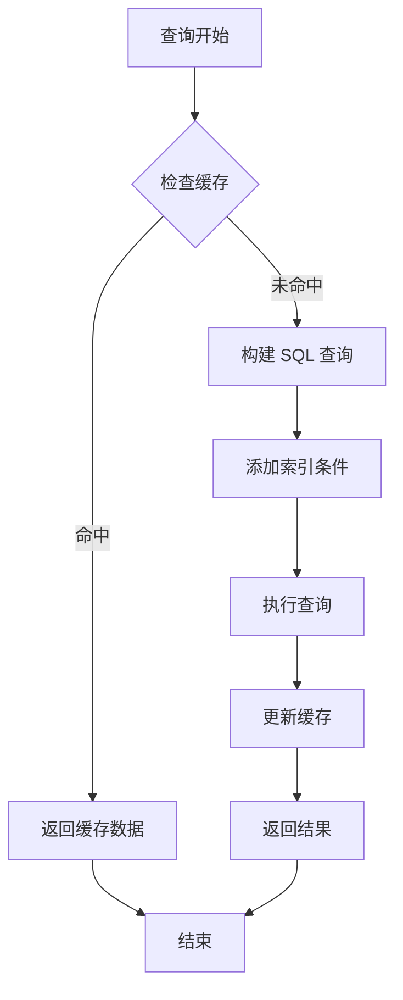

**图表来源**
- [tasks.py](file://backend/tasks.py#L10-L16)
- [services.py](file://backend/services.py#L34-L42)

### 一致性保证机制

1. **事务管理**
   - 所有章节操作都在事务中执行
   - 支持回滚操作确保数据一致性
   - 异步事务支持防止死锁

2. **并发控制**
   - 使用连接池管理并发连接
   - 避免同时修改同一章节
   - 支持读写分离

3. **数据完整性**
   - 外键约束确保引用完整性
   - 约束检查防止无效数据
   - 级联操作自动维护数据关系

**章节来源**
- [database.py](file://backend/database.py#L8-L23)
- [models.py](file://backend/models.py#L24-L43)

## 故障排除指南

### 常见问题诊断

#### 章节状态异常

**问题症状**：章节状态卡在 generating 或 pending 状态
**解决方案**：
1. 检查 AI 代理服务是否正常运行
2. 验证数据库连接状态
3. 查看后台任务队列状态

#### 选择分支生成失败

**问题症状**：章节无法生成选择分支
**解决方案**：
1. 检查 narrative_engine 配置
2. 验证 LLM 提供商设置
3. 查看代理服务日志

#### 数据库连接问题

**问题症状**：无法连接到数据库或查询超时
**解决方案**：
1. 检查 DATABASE_URL 配置
2. 验证连接池设置
3. 查看数据库服务器状态

### 错误处理机制

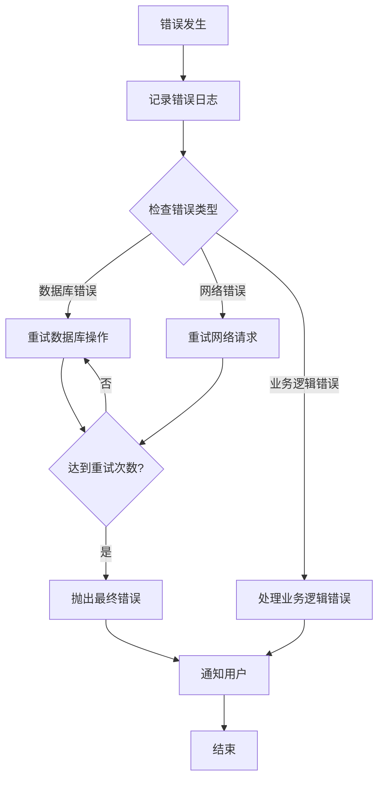

**图表来源**
- [database.py](file://backend/database.py#L8-L23)
- [config.py](file://backend/config.py#L15-L15)

**章节来源**
- [database.py](file://backend/database.py#L1-L31)
- [config.py](file://backend/config.py#L1-L34)

## 结论

故事章节数据模型为无限叙事剧场提供了强大的数据支撑框架。通过精心设计的字段结构、完善的状态管理和智能的生成机制，该模型能够支持复杂的叙事体验。

### 主要优势

1. **模块化设计**：清晰的职责分离和依赖关系
2. **扩展性强**：支持动态内容生成和状态管理
3. **性能优化**：异步处理和缓存策略
4. **数据安全**：完善的约束和一致性保证

### 未来改进方向

1. **向量搜索优化**：实现更高效的相似度计算
2. **分布式部署**：支持多实例部署和负载均衡
3. **监控告警**：增强系统监控和故障预警能力
4. **API 文档**：完善接口文档和示例代码

该模型为整个叙事引擎奠定了坚实的基础，通过持续的优化和改进，将为玩家提供更加丰富和沉浸式的叙事体验。