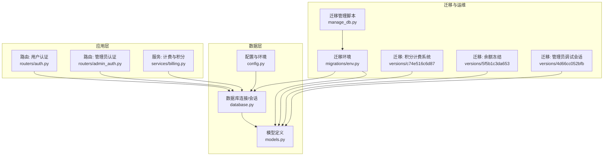
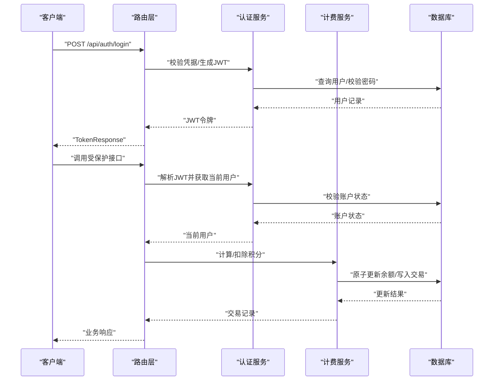
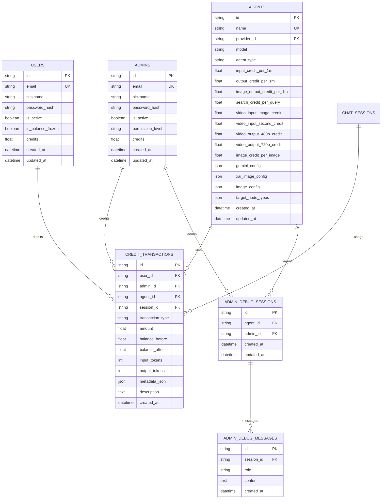
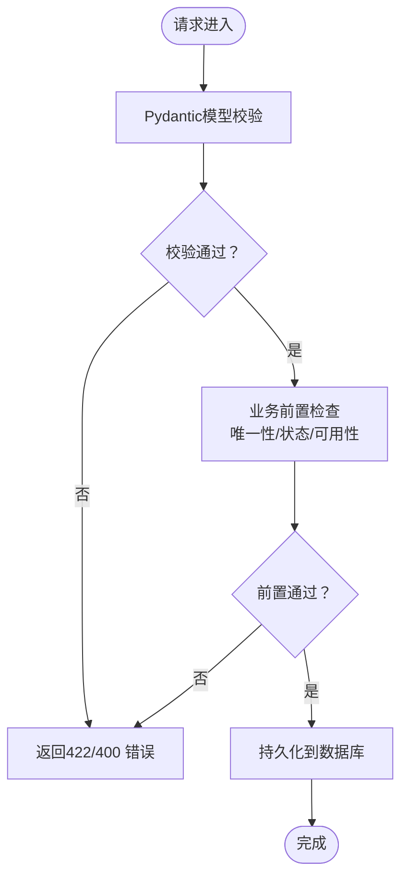
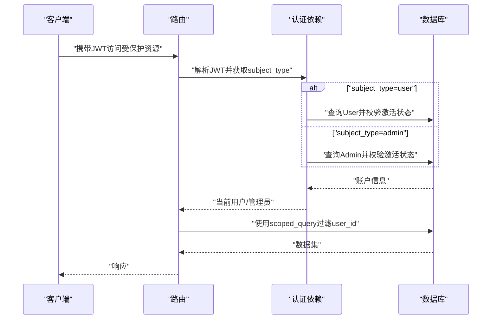
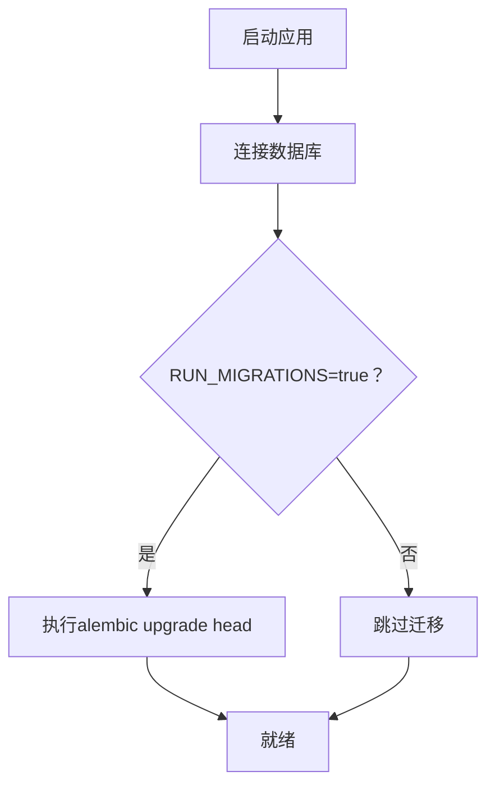
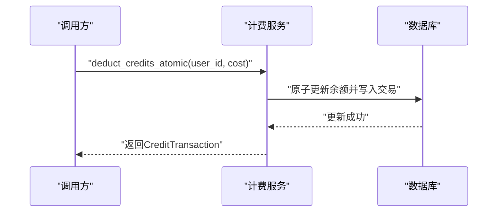
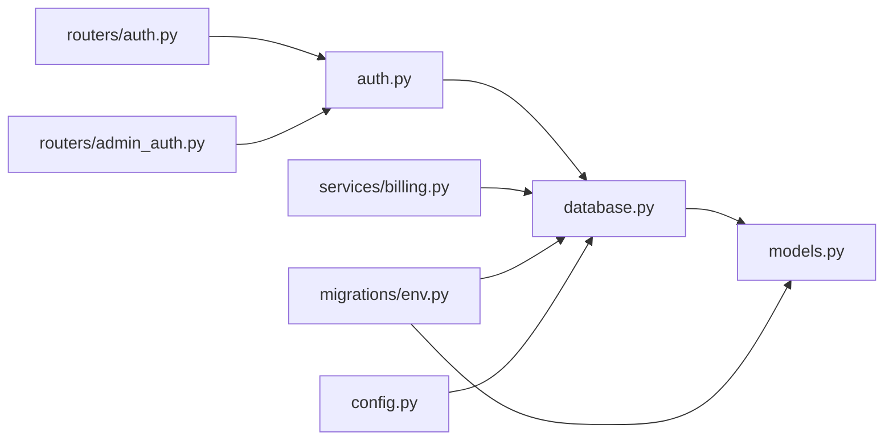

# 数据完整性与安全

<cite>
**本文引用的文件**
- [models.py](file://backend/models.py)
- [database.py](file://backend/database.py)
- [config.py](file://backend/config.py)
- [auth.py](file://backend/auth.py)
- [schemas.py](file://backend/schemas.py)
- [routers/auth.py](file://backend/routers/auth.py)
- [routers/admin_auth.py](file://backend/routers/admin_auth.py)
- [services/billing.py](file://backend/services/billing.py)
- [main.py](file://backend/main.py)
- [manage_db.py](file://backend/manage_db.py)
- [migrations/env.py](file://backend/migrations/env.py)
- [migrations/versions/c74e516c6d87_add_credit_billing_system.py](file://backend/migrations/versions/c74e516c6d87_add_credit_billing_system.py)
- [migrations/versions/5f5b1c3da653_add_user_balance_frozen_status.py](file://backend/migrations/versions/5f5b1c3da653_add_user_balance_frozen_status.py)
- [migrations/versions/4d66cc052bfb_add_admin_debug_sessions.py](file://backend/migrations/versions/4d66cc052bfb_add_admin_debug_sessions.py)
</cite>

## 目录
1. [简介](#简介)
2. [项目结构](#项目结构)
3. [核心组件](#核心组件)
4. [架构总览](#架构总览)
5. [详细组件分析](#详细组件分析)
6. [依赖分析](#依赖分析)
7. [性能考量](#性能考量)
8. [故障排查指南](#故障排查指南)
9. [结论](#结论)
10. [附录](#附录)

## 简介
本文件面向Infinite Game项目，围绕“数据完整性与安全”主题，系统梳理数据库约束机制、数据验证策略、加密与隐私保护、访问控制（含行级隔离）、备份与恢复、审计与变更追踪，以及合规与最佳实践。内容以仓库现有实现为基础，结合数据库迁移脚本与服务层逻辑，给出可操作的安全建议与实施路径。

## 项目结构
后端采用FastAPI + SQLAlchemy异步ORM + Alembic迁移的典型架构。数据库连接通过异步引擎管理，模型定义集中于models.py，路由集中在routers目录，业务服务位于services目录，配置与环境变量由config.py提供，迁移脚本位于migrations目录。

图示来源
- [main.py:138-152](file://backend/main.py#L138-L152)
- [database.py:1-31](file://backend/database.py#L1-L31)
- [models.py:1-447](file://backend/models.py#L1-L447)
- [migrations/env.py:1-120](file://backend/migrations/env.py#L1-L120)

章节来源
- [main.py:138-152](file://backend/main.py#L138-L152)
- [database.py:1-31](file://backend/database.py#L1-L31)
- [models.py:1-447](file://backend/models.py#L1-L447)
- [migrations/env.py:1-120](file://backend/migrations/env.py#L1-L120)

## 核心组件
- 数据模型与约束：通过SQLAlchemy列定义实现NOT NULL、UNIQUE、外键约束及索引；迁移脚本补充新增字段与索引。
- 数据验证：Pydantic模型在路由层进行字段类型、长度、枚举与范围校验；bcrypt进行密码哈希。
- 访问控制：JWT令牌承载主体类型与角色，依赖注入解析当前用户/管理员；行级隔离通过scoped_query对非管理员实体强制user_id过滤。
- 审计与追踪：计费服务记录CreditTransaction；管理员调试会话与消息独立表隔离；日志中间件辅助调试。
- 备份与恢复：Alembic迁移提供版本化演进；SQLite路径固定便于备份；迁移管理脚本支持升级/降级/种子数据。

章节来源
- [models.py:10-447](file://backend/models.py#L10-L447)
- [schemas.py:1-859](file://backend/schemas.py#L1-L859)
- [auth.py:1-229](file://backend/auth.py#L1-L229)
- [services/billing.py:1-388](file://backend/services/billing.py#L1-L388)
- [migrations/versions/c74e516c6d87_add_credit_billing_system.py:1-67](file://backend/migrations/versions/c74e516c6d87_add_credit_billing_system.py#L1-L67)
- [migrations/versions/5f5b1c3da653_add_user_balance_frozen_status.py:1-44](file://backend/migrations/versions/5f5b1c3da653_add_user_balance_frozen_status.py#L1-L44)
- [migrations/versions/4d66cc052bfb_add_admin_debug_sessions.py:1-68](file://backend/migrations/versions/4d66cc052bfb_add_admin_debug_sessions.py#L1-L68)

## 架构总览
下图展示认证、计费与数据模型之间的交互关系，以及迁移与配置对数据层的影响。

图示来源
- [routers/auth.py:63-99](file://backend/routers/auth.py#L63-L99)
- [auth.py:83-114](file://backend/auth.py#L83-L114)
- [services/billing.py:178-308](file://backend/services/billing.py#L178-L308)

## 详细组件分析

### 数据库约束与完整性
- NOT NULL：大量字段声明nullable=False，如用户邮箱、昵称、密码哈希、积分余额、代理类型、订阅状态等，确保关键业务字段必填。
- UNIQUE：邮箱、管理员邮箱、OAuth第三方ID、UUID主键等，保证唯一性。
- FOREIGN KEY：多处外键关联，如users.id、agents.id、chat_sessions.id、subscription_plans.id等，维护引用完整性。
- CHECK：代码层面通过Pydantic字段校验（如ge/le、枚举限定、长度范围）实现CHECK效果；数据库层未见显式CHECK约束定义。
- 索引：常见字段建立索引（如email、id、user_id、agent_id、session_id等），提升查询性能与约束生效效率。
- 迁移增强：新增积分交易表、余额冻结字段、管理员调试会话/消息表等，均通过Alembic批处理添加列与索引。

图示来源
- [models.py:10-447](file://backend/models.py#L10-L447)
- [migrations/versions/c74e516c6d87_add_credit_billing_system.py:22-41](file://backend/migrations/versions/c74e516c6d87_add_credit_billing_system.py#L22-L41)
- [migrations/versions/4d66cc052bfb_add_admin_debug_sessions.py:23-47](file://backend/migrations/versions/4d66cc052bfb_add_admin_debug_sessions.py#L23-L47)

章节来源
- [models.py:10-447](file://backend/models.py#L10-L447)
- [migrations/versions/c74e516c6d87_add_credit_billing_system.py:21-67](file://backend/migrations/versions/c74e516c6d87_add_credit_billing_system.py#L21-L67)
- [migrations/versions/5f5b1c3da653_add_user_balance_frozen_status.py:21-44](file://backend/migrations/versions/5f5b1c3da653_add_user_balance_frozen_status.py#L21-L44)
- [migrations/versions/4d66cc052bfb_add_admin_debug_sessions.py:21-68](file://backend/migrations/versions/4d66cc052bfb_add_admin_debug_sessions.py#L21-L68)

### 数据验证策略
- Pydantic字段验证：路由层接收请求体后，使用Pydantic模型进行强类型与范围校验，如最小/最大长度、数值范围、枚举集合、JSON结构等。
- 密码哈希：bcrypt对明文密码进行哈希存储，降低泄露风险。
- 业务规则验证：路由层在数据库操作前执行业务前置检查（如邮箱唯一、账户激活状态、模型可用性等）。

图示来源
- [routers/auth.py:36-60](file://backend/routers/auth.py#L36-L60)
- [schemas.py:13-26](file://backend/schemas.py#L13-L26)
- [auth.py:19-24](file://backend/auth.py#L19-L24)

章节来源
- [routers/auth.py:36-60](file://backend/routers/auth.py#L36-L60)
- [schemas.py:13-26](file://backend/schemas.py#L13-L26)
- [auth.py:19-24](file://backend/auth.py#L19-L24)

### 加密与隐私保护
- 密码哈希：bcrypt用于密码存储，避免明文泄露。
- 敏感数据存储：LLM提供商API Key在模型中以字符串字段存储，注释提示应加密存储，当前实现为明文（需后续加固）。
- 传输安全：项目未显式启用HTTPS/TLS配置，建议在生产环境强制TLS与安全头。

章节来源
- [auth.py:19-24](file://backend/auth.py#L19-L24)
- [models.py:153-154](file://backend/models.py#L153-L154)

### 访问控制机制
- JWT令牌：用户与管理员分别使用独立的subject_type与角色字段，路由依赖解析当前用户或管理员。
- 行级安全：scoped_query对非管理员实体强制user_id过滤，管理员实体绕过过滤，实现“用户仅可见自身数据”的隔离策略。
- 管理员专用路由：独立的管理员认证路由与依赖，确保后台功能严格受控。

图示来源
- [auth.py:83-114](file://backend/auth.py#L83-L114)
- [auth.py:221-229](file://backend/auth.py#L221-L229)
- [routers/admin_auth.py:130-136](file://backend/routers/admin_auth.py#L130-L136)

章节来源
- [auth.py:83-114](file://backend/auth.py#L83-L114)
- [auth.py:221-229](file://backend/auth.py#L221-L229)
- [routers/admin_auth.py:130-136](file://backend/routers/admin_auth.py#L130-L136)

### 数据备份与恢复
- 迁移驱动：Alembic提供版本化迁移，支持升级/降级，确保数据库结构演进可控。
- SQLite路径：配置中使用绝对路径，便于备份与迁移。
- 运维脚本：manage_db.py封装迁移命令，便于CI/CD集成。

图示来源
- [main.py:49-108](file://backend/main.py#L49-L108)
- [manage_db.py:30-38](file://backend/manage_db.py#L30-L38)
- [migrations/env.py:110-120](file://backend/migrations/env.py#L110-L120)

章节来源
- [main.py:49-108](file://backend/main.py#L49-L108)
- [manage_db.py:30-38](file://backend/manage_db.py#L30-L38)
- [migrations/env.py:110-120](file://backend/migrations/env.py#L110-L120)

### 审计日志与数据变更追踪
- 计费审计：CreditTransaction记录每次积分变动的前后余额、类型、描述与元数据，便于对账与回溯。
- 管理员调试：独立的admin_debug_sessions与admin_debug_messages表，隔离调试会话与消息，避免影响生产数据。
- 日志中间件：调试中间件记录Authorization头与Origin，辅助定位鉴权问题。

图示来源
- [services/billing.py:178-308](file://backend/services/billing.py#L178-L308)
- [models.py:261-281](file://backend/models.py#L261-L281)
- [migrations/versions/c74e516c6d87_add_credit_billing_system.py:22-41](file://backend/migrations/versions/c74e516c6d87_add_credit_billing_system.py#L22-L41)

章节来源
- [services/billing.py:178-308](file://backend/services/billing.py#L178-L308)
- [models.py:261-281](file://backend/models.py#L261-L281)
- [migrations/versions/c74e516c6d87_add_credit_billing_system.py:22-41](file://backend/migrations/versions/c74e516c6d87_add_credit_billing_system.py#L22-L41)
- [migrations/versions/4d66cc052bfb_add_admin_debug_sessions.py:23-47](file://backend/migrations/versions/4d66cc052bfb_add_admin_debug_sessions.py#L23-L47)
- [main.py:119-127](file://backend/main.py#L119-L127)

### 数据安全合规性指南与最佳实践
- 强制HTTPS与安全头：生产环境启用TLS与安全响应头，防止中间人攻击与信息泄露。
- 敏感字段加密：API Key等敏感信息应加密存储，定期轮换密钥。
- 最小权限原则：管理员路由与数据仅授予必要人员，定期审查权限。
- 审计留痕：对关键操作（登录、余额调整、模型切换）记录审计日志，保留至少90天以上。
- 数据脱敏：导出数据时对邮箱、IP等个人数据进行脱敏处理。
- 定期备份：基于Alembic迁移的结构与数据备份策略，确保可恢复性与一致性。

## 依赖分析
- 组件耦合：路由层依赖认证与计费服务；计费服务依赖模型与数据库；迁移环境依赖配置与模型元数据。
- 外部依赖：bcrypt（密码哈希）、JWTS（令牌解析）、Alembic（迁移）、SQLAlchemy（ORM/异步）。
- 循环依赖：认证模块延迟导入模型以避免循环。

图示来源
- [routers/auth.py:1-136](file://backend/routers/auth.py#L1-L136)
- [routers/admin_auth.py:1-136](file://backend/routers/admin_auth.py#L1-L136)
- [auth.py:1-229](file://backend/auth.py#L1-L229)
- [services/billing.py:1-388](file://backend/services/billing.py#L1-L388)
- [database.py:1-31](file://backend/database.py#L1-L31)
- [models.py:1-447](file://backend/models.py#L1-L447)
- [migrations/env.py:1-120](file://backend/migrations/env.py#L1-L120)
- [config.py:1-43](file://backend/config.py#L1-L43)

章节来源
- [routers/auth.py:1-136](file://backend/routers/auth.py#L1-L136)
- [routers/admin_auth.py:1-136](file://backend/routers/admin_auth.py#L1-L136)
- [auth.py:1-229](file://backend/auth.py#L1-L229)
- [services/billing.py:1-388](file://backend/services/billing.py#L1-L388)
- [database.py:1-31](file://backend/database.py#L1-L31)
- [models.py:1-447](file://backend/models.py#L1-L447)
- [migrations/env.py:1-120](file://backend/migrations/env.py#L1-L120)
- [config.py:1-43](file://backend/config.py#L1-L43)

## 性能考量
- 连接池与预检：异步引擎启用pool_pre_ping与连接池参数，提升稳定性与复用效率。
- 索引策略：对高频查询字段建立索引（如email、id、user_id、agent_id等），减少全表扫描。
- 原子操作：计费服务使用UPDATE ... WHERE条件与事务，避免竞态与脏读。
- 日志级别：关闭SQLAlchemy与Uvicorn访问日志噪声，保留应用日志，降低I/O开销。

章节来源
- [database.py:8-23](file://backend/database.py#L8-L23)
- [models.py:14-16](file://backend/models.py#L14-L16)
- [services/billing.py:214-224](file://backend/services/billing.py#L214-L224)
- [main.py:16-30](file://backend/main.py#L16-L30)

## 故障排查指南
- 登录失败：检查邮箱是否存在、密码哈希是否匹配、账户是否激活；查看路由层HTTP 401/403响应与日志。
- 余额不足：确认estimated_cost与当前credits，检查is_balance_frozen标志；核对CreditTransaction记录。
- 权限问题：确认JWT中的subject_type与角色，确保使用正确的依赖（get_current_user vs get_current_admin）。
- 迁移异常：查看Alembic残留临时表清理逻辑与错误堆栈；必要时手动清理后重试。
- 调试会话：通过admin_debug_sessions与admin_debug_messages表定位问题，避免污染生产数据。

章节来源
- [routers/auth.py:63-99](file://backend/routers/auth.py#L63-L99)
- [services/billing.py:45-84](file://backend/services/billing.py#L45-L84)
- [auth.py:119-151](file://backend/auth.py#L119-L151)
- [migrations/env.py:67-77](file://backend/migrations/env.py#L67-L77)
- [migrations/versions/4d66cc052bfb_add_admin_debug_sessions.py:21-51](file://backend/migrations/versions/4d66cc052bfb_add_admin_debug_sessions.py#L21-L51)

## 结论
本项目在数据完整性与安全方面具备良好基础：通过SQLAlchemy约束与Alembic迁移保障结构一致性，借助Pydantic与bcrypt强化输入验证与密码安全，利用JWT与行级隔离实现访问控制，通过计费审计与调试隔离完善追踪能力。建议在生产环境中进一步强化传输加密、敏感字段加密与权限审计，形成闭环的安全体系。

## 附录
- 配置项要点：DATABASE_URL、JWT_SECRET_KEY、ACCESS_TOKEN_EXPIRE_MINUTES、REFRESH_TOKEN_EXPIRE_DAYS、RUN_MIGRATIONS。
- 迁移命令：migrate、upgrade、downgrade、seed，便于自动化部署与回滚。

章节来源
- [config.py:7-42](file://backend/config.py#L7-L42)
- [manage_db.py:40-77](file://backend/manage_db.py#L40-L77)