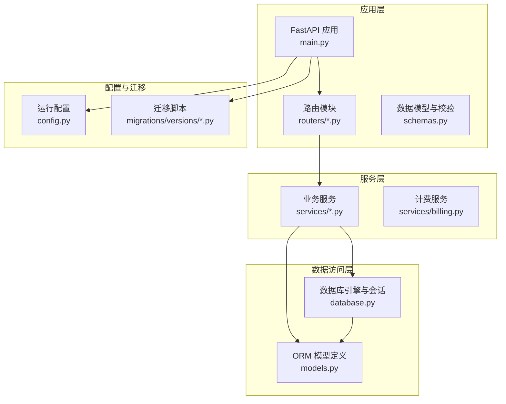
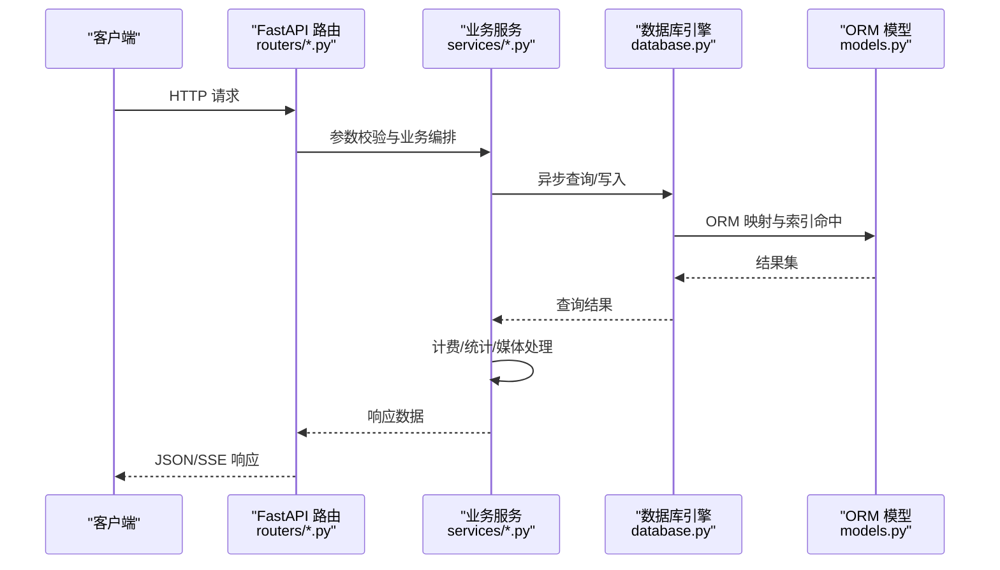
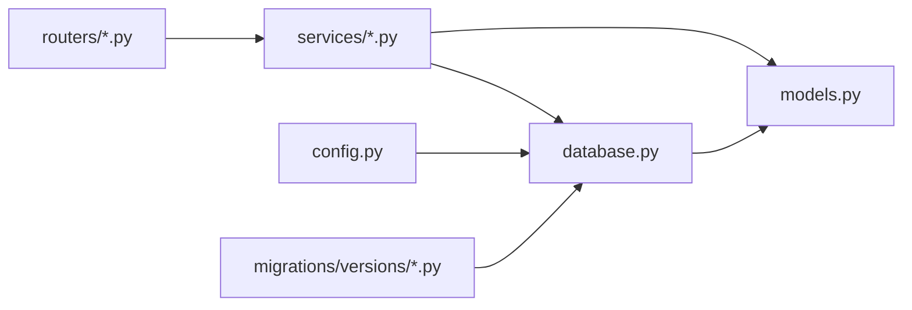

# 数据库性能优化

<cite>
**本文引用的文件**
- [backend/database.py](file://backend/database.py)
- [backend/models.py](file://backend/models.py)
- [backend/config.py](file://backend/config.py)
- [backend/main.py](file://backend/main.py)
- [backend/routers/admin.py](file://backend/routers/admin.py)
- [backend/routers/agents.py](file://backend/routers/agents.py)
- [backend/routers/chats.py](file://backend/routers/chats.py)
- [backend/routers/theaters.py](file://backend/routers/theaters.py)
- [backend/routers/videos.py](file://backend/routers/videos.py)
- [backend/services/billing.py](file://backend/services/billing.py)
- [backend/schemas.py](file://backend/schemas.py)
- [backend/migrations/versions/a3b8c9d0e1f2_convert_ids_to_uuid.py](file://backend/migrations/versions/a3b8c9d0e1f2_convert_ids_to_uuid.py)
</cite>

## 目录
1. [简介](#简介)
2. [项目结构](#项目结构)
3. [核心组件](#核心组件)
4. [架构总览](#架构总览)
5. [详细组件分析](#详细组件分析)
6. [依赖分析](#依赖分析)
7. [性能考量](#性能考量)
8. [故障排查指南](#故障排查指南)
9. [结论](#结论)
10. [附录](#附录)

## 简介
本文件面向 Infinite Game 的数据库性能优化，围绕索引设计策略、查询优化技术、连接池与连接复用、缓存策略、分页与大数据量处理、监控与调优工具以及典型业务场景的最佳实践展开。文档基于仓库现有代码进行分析，结合 SQLAlchemy 异步 ORM、FastAPI 路由与服务层实现，给出可操作的优化建议与可视化图示。

## 项目结构
后端采用 FastAPI + SQLAlchemy 异步 ORM 架构，数据库连接通过 asyncpg/aiosqlite 驱动，模型定义集中在 models.py，路由集中在 routers/*，业务逻辑分布在 services/*，配置位于 config.py，数据库初始化与生命周期管理在 main.py。

图表来源
- [backend/main.py:49-108](file://backend/main.py#L49-L108)
- [backend/database.py:1-31](file://backend/database.py#L1-L31)
- [backend/models.py:1-447](file://backend/models.py#L1-L447)
- [backend/config.py:1-43](file://backend/config.py#L1-L43)

章节来源
- [backend/main.py:49-108](file://backend/main.py#L49-L108)
- [backend/database.py:1-31](file://backend/database.py#L1-L31)
- [backend/models.py:1-447](file://backend/models.py#L1-L447)
- [backend/config.py:1-43](file://backend/config.py#L1-L43)

## 核心组件
- 数据库引擎与会话
  - 使用异步引擎与 async_sessionmaker，开启 pool_pre_ping、设置连接池大小与溢出连接数，支持 SQLite/PostgreSQL。
- ORM 模型
  - 定义了用户、管理员、剧场、节点、边、资产、会话、消息、智能体、订阅、视频任务、计费交易等表，大量字段带索引或唯一约束。
- 路由与查询
  - 路由层广泛使用 offset/limit 实现分页；部分查询使用 count(*) 统计总数；部分涉及多表 join 与过滤。
- 计费与事务
  - 计费服务提供原子扣费与退款，使用 UPDATE ... WHERE 并发安全检查，避免余额超支与冻结账户误扣。

章节来源
- [backend/database.py:1-31](file://backend/database.py#L1-L31)
- [backend/models.py:10-447](file://backend/models.py#L10-L447)
- [backend/routers/admin.py:53-83](file://backend/routers/admin.py#L53-L83)
- [backend/routers/agents.py:66-81](file://backend/routers/agents.py#L66-L81)
- [backend/routers/chats.py:123-143](file://backend/routers/chats.py#L123-L143)
- [backend/routers/videos.py:26-71](file://backend/routers/videos.py#L26-L71)
- [backend/services/billing.py:178-308](file://backend/services/billing.py#L178-L308)

## 架构总览
下图展示了请求从路由到服务再到数据库的典型链路，以及计费与媒体处理的关键节点。

图表来源
- [backend/routers/chats.py:202-258](file://backend/routers/chats.py#L202-L258)
- [backend/services/billing.py:310-350](file://backend/services/billing.py#L310-L350)
- [backend/database.py:28-31](file://backend/database.py#L28-L31)
- [backend/models.py:196-252](file://backend/models.py#L196-L252)

## 详细组件分析

### 索引设计策略
- 主键索引
  - 所有表主键均为 String(36) UUID 或 Integer，UUID 主键在 models.py 中广泛使用，适合分布式与幂等写入。
- 唯一索引
  - 用户邮箱、管理员邮箱、Google/GitHub 第三方 ID、LLM 提供商名称、智能体名称、订阅套餐名称等字段设置唯一索引，保障业务一致性。
- 复合索引与选择性
  - 会话与消息按 user_id、agent_id、theater_id 等进行过滤，建议在这些列上建立合适的复合索引以提升 JOIN 与过滤效率。
  - 计费交易按 user_id/admin_id/agent_id/session_id 建立索引，便于审计与统计。
- 建议
  - 对高频过滤列（如 user_id、status、created_at）建立组合索引，遵循“选择性高 + 前缀匹配”的原则。
  - 对外键列（如 theater_id、user_id、agent_id）建立索引，减少 JOIN 开销。
  - 对于全文检索需求，考虑使用数据库内置全文索引（如 PostgreSQL tsvector）或外部搜索引擎。

章节来源
- [backend/models.py:10-447](file://backend/models.py#L10-L447)
- [backend/migrations/versions/a3b8c9d0e1f2_convert_ids_to_uuid.py:22-229](file://backend/migrations/versions/a3b8c9d0e1f2_convert_ids_to_uuid.py#L22-L229)

### 查询优化技术
- 分页与总数
  - 路由层普遍使用 offset/limit，同时对 count(*) 进行统计，避免一次性加载全量数据。
- 过滤与排序
  - 使用 scoped_query 对用户/管理员实体进行行级隔离，结合 order_by 降序排列，提升用户体验。
- 多表查询
  - 在视频任务列表中，先查询任务再批量获取提供商名称，减少 N+1 查询风险。
- 建议
  - 对高频查询添加 EXPLAIN/ANALYZE 分析，识别慢查询与索引缺失。
  - 使用 LIMIT 控制单页规模，避免深度分页导致的性能退化。
  - 对复杂查询使用物化视图或缓存中间结果。

章节来源
- [backend/routers/admin.py:53-83](file://backend/routers/admin.py#L53-L83)
- [backend/routers/agents.py:66-81](file://backend/routers/agents.py#L66-L81)
- [backend/routers/chats.py:123-143](file://backend/routers/chats.py#L123-L143)
- [backend/routers/videos.py:26-71](file://backend/routers/videos.py#L26-L71)

### 数据库连接池配置与连接复用
- 连接池参数
  - pool_pre_ping：自动重连，提升稳定性。
  - pool_size/max_overflow：SQLite 默认使用，生产环境建议使用 PostgreSQL 并根据并发峰值调整。
  - connect_args：SQLite 场景关闭线程校验，避免不必要的开销。
- 生命周期与重试
  - 应用启动时进行数据库连接重试与迁移，确保服务可用性。
- 建议
  - 生产环境使用 PostgreSQL，合理设置 pool_size 与 max_overflow，结合连接泄漏监控。
  - 使用连接池回收策略，避免长时间占用连接。

章节来源
- [backend/database.py:8-23](file://backend/database.py#L8-L23)
- [backend/main.py:49-97](file://backend/main.py#L49-L97)

### 缓存策略设计
- 查询结果缓存
  - 对静态配置、提供商列表、模板等低频变更数据进行进程内缓存，减少数据库压力。
- 热点数据缓存
  - 对用户积分、订阅状态、活跃剧场数量等热点数据进行短期缓存（Redis），并设置合理过期时间。
- 缓存失效机制
  - 写操作（如扣费、订阅变更）主动失效相关缓存键，保证一致性。
- 建议
  - 使用 Redis 作为缓存层，结合 TTL 与 LRU 策略。
  - 对强一致场景采用“写后失效”，对最终一致场景采用“写后更新”。

章节来源
- [backend/config.py:18-19](file://backend/config.py#L18-L19)
- [backend/services/billing.py:178-308](file://backend/services/billing.py#L178-L308)

### 分页查询优化与大数据量处理
- 分页实现
  - 使用 offset/limit 与 count(*) 组合，支持页码与页大小控制。
- 大数据量处理
  - 对历史消息、视频任务等长列表查询，建议使用游标分页（基于上次记录的 created_at/id）替代深度 offset。
  - 对统计类查询（如仪表盘）使用物化视图或定期聚合表。
- 建议
  - 限制最大页大小，防止滥用。
  - 对高频统计使用缓存与后台定时刷新。

章节来源
- [backend/routers/admin.py:53-83](file://backend/routers/admin.py#L53-L83)
- [backend/routers/videos.py:26-71](file://backend/routers/videos.py#L26-L71)

### 数据库监控指标与性能调优工具
- 指标建议
  - 连接池利用率、等待时间、超时次数、慢查询比例、索引命中率、锁等待时间。
- 工具建议
  - 使用数据库自带的 EXPLAIN/EXPLAIN ANALYZE 分析执行计划。
  - 配置慢查询日志与性能分析工具（如 pg_stat_statements）。
  - 结合应用日志（SQLAlchemy engine/pool 日志级别）定位瓶颈。
- 建议
  - 在开发环境降低日志级别，生产环境适度开启性能分析。
  - 定期巡检索引使用情况，清理冗余索引。

章节来源
- [backend/main.py:16-30](file://backend/main.py#L16-L30)
- [backend/database.py:8-23](file://backend/database.py#L8-L23)

### 针对不同业务场景的性能优化案例与最佳实践
- 管理后台统计
  - 使用 count(*) 聚合用户、剧场、资产等基础统计，避免全表扫描。
  - 对高频统计项引入缓存与定时刷新。
- 智能体与会话管理
  - 对会话与消息列表查询，按 user_id 过滤并使用 created_at 降序，必要时添加复合索引。
  - 对工具调用与技能加载，尽量减少多轮次查询，合并为单次流式处理。
- 视频任务与计费
  - 视频任务列表使用 scoped_query 行级隔离，批量获取提供商名称，减少多次查询。
  - 计费采用原子扣费，失败时快速回滚，避免脏数据。
- 剧场与画布
  - 剧场节点与边的增删改查，建议按 theater_id 建立复合索引，配合批量写入优化。
- 最佳实践清单
  - 为高频过滤列建立索引；避免 SELECT *；使用 LIMIT 控制结果集；对复杂查询使用物化视图；写操作后主动失效缓存；定期分析执行计划与慢查询。

章节来源
- [backend/routers/admin.py:29-47](file://backend/routers/admin.py#L29-L47)
- [backend/routers/chats.py:123-143](file://backend/routers/chats.py#L123-L143)
- [backend/routers/videos.py:26-71](file://backend/routers/videos.py#L26-L71)
- [backend/services/billing.py:178-308](file://backend/services/billing.py#L178-L308)

## 依赖分析
- 路由依赖服务层，服务层依赖数据库引擎与模型定义。
- 计费服务依赖模型与事务，确保并发安全。
- 配置与迁移贯穿应用生命周期，影响数据库初始化与演进。

图表来源
- [backend/routers/chats.py:12-16](file://backend/routers/chats.py#L12-L16)
- [backend/services/billing.py:5-8](file://backend/services/billing.py#L5-L8)
- [backend/database.py:1-31](file://backend/database.py#L1-L31)
- [backend/config.py:1-43](file://backend/config.py#L1-L43)

章节来源
- [backend/routers/chats.py:12-16](file://backend/routers/chats.py#L12-L16)
- [backend/services/billing.py:5-8](file://backend/services/billing.py#L5-L8)
- [backend/database.py:1-31](file://backend/database.py#L1-L31)
- [backend/config.py:1-43](file://backend/config.py#L1-L43)

## 性能考量
- 索引策略
  - 高选择性列优先；复合索引遵循“前缀匹配”；避免过多索引导致写入放大。
- 查询优化
  - 使用 EXPLAIN 分析执行计划；避免 N+1 查询；对统计类查询使用物化视图。
- 连接池
  - 合理设置 pool_size 与 max_overflow；启用 pool_pre_ping；监控连接泄漏。
- 缓存
  - 热点数据短时缓存；写后失效；区分强一致与最终一致场景。
- 分页
  - 游标分页优于深度 offset；限制最大页大小；对长列表使用后台聚合。

## 故障排查指南
- 连接失败与迁移问题
  - 应用启动阶段进行数据库连接重试与迁移，若失败尝试清理临时表后重试。
- 计费异常
  - 余额不足或冻结时抛出特定异常，需在路由层捕获并返回明确错误。
- 慢查询定位
  - 通过日志与 EXPLAIN 分析，确认索引缺失或过滤列未命中。
- 缓存一致性
  - 写操作后主动失效相关缓存键，避免脏读。

章节来源
- [backend/main.py:49-97](file://backend/main.py#L49-L97)
- [backend/services/billing.py:37-43](file://backend/services/billing.py#L37-L43)
- [backend/routers/chats.py:714-731](file://backend/routers/chats.py#L714-L731)

## 结论
通过对索引、查询、连接池、缓存、分页与监控等方面的系统化优化，Infinite Game 可在高并发与大数据量场景下保持稳定与高性能。建议结合业务增长趋势持续迭代索引策略与缓存方案，并建立完善的性能监控与回归测试流程。

## 附录
- 术语
  - 索引：加速查询的数据结构。
  - 复合索引：在多个列上建立的索引。
  - 慢查询：执行时间过长的 SQL。
  - 连接池：维护多个数据库连接以复用的技术。
  - 原子操作：不可分割的操作，常用于计费与余额更新。
- 参考实现路径
  - [数据库引擎与会话:1-31](file://backend/database.py#L1-L31)
  - [ORM 模型定义:10-447](file://backend/models.py#L10-L447)
  - [路由与分页查询:53-83](file://backend/routers/admin.py#L53-L83)
  - [计费与原子扣费:178-308](file://backend/services/billing.py#L178-308)
  - [应用生命周期与迁移:49-97](file://backend/main.py#L49-97)