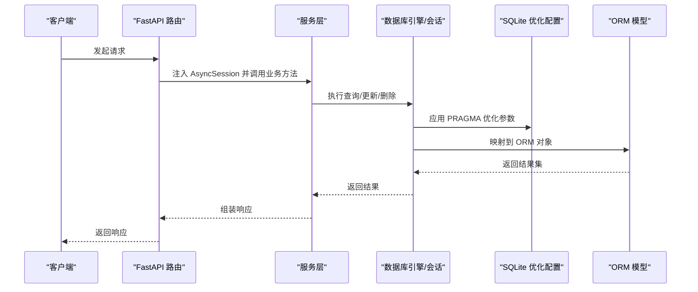
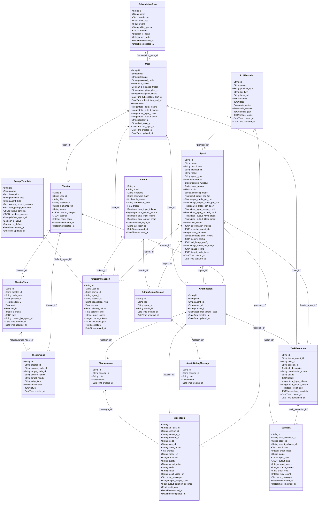
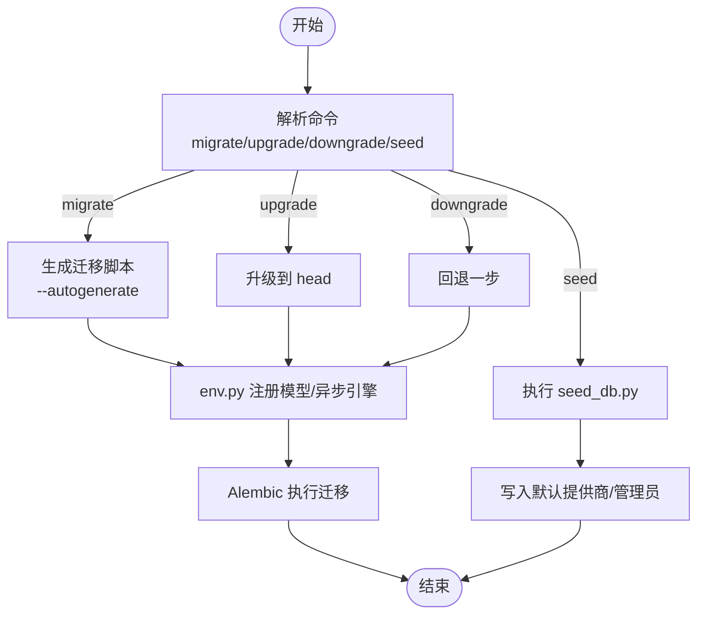
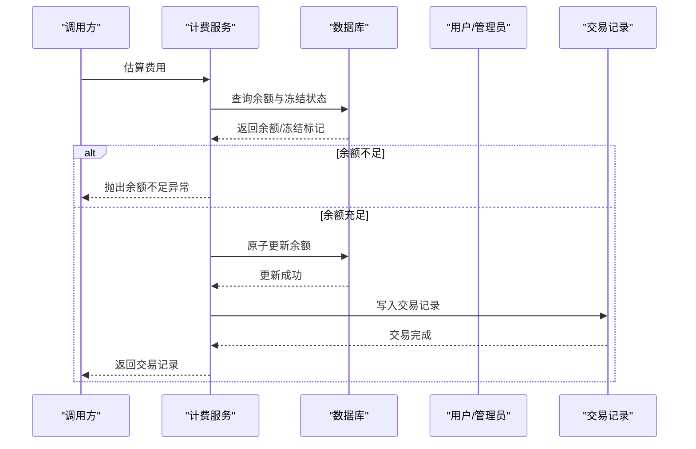
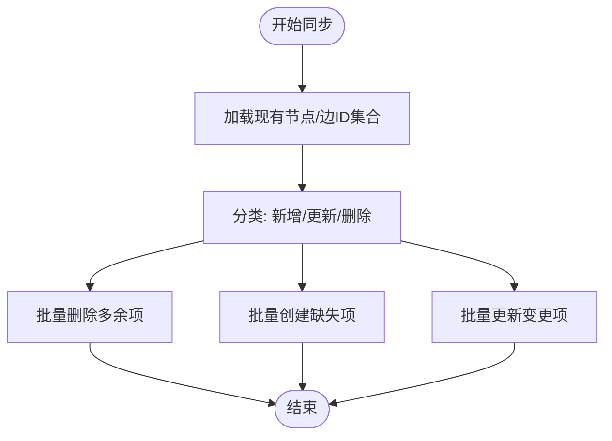
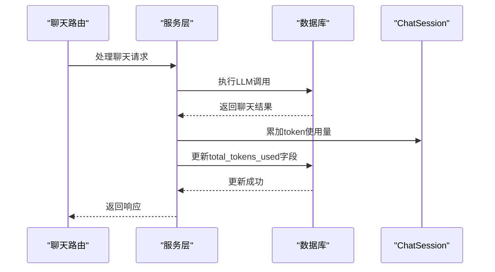
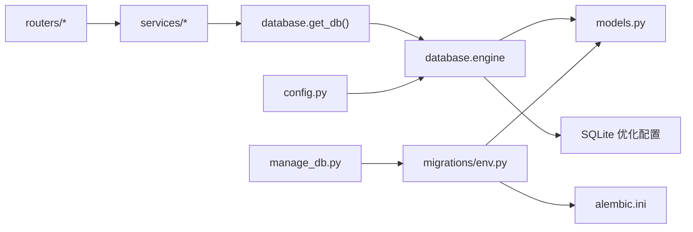

# 数据库设计

<cite>
**本文引用的文件**
- [backend/database.py](file://backend/database.py)
- [backend/models.py](file://backend/models.py)
- [backend/config.py](file://backend/config.py)
- [backend/alembic.ini](file://backend/alembic.ini)
- [backend/migrations/env.py](file://backend/migrations/env.py)
- [backend/manage_db.py](file://backend/manage_db.py)
- [backend/migrations/versions/14746eaf1c81_initial.py](file://backend/migrations/versions/14746eaf1c81_initial.py)
- [backend/migrations/versions/a3b8c9d0e1f2_convert_ids_to_uuid.py](file://backend/migrations/versions/a3b8c9d0e1f2_convert_ids_to_uuid.py)
- [backend/migrations/versions/c74e516c6d87_add_credit_billing_system.py](file://backend/migrations/versions/c74e516c6d87_add_credit_billing_system.py)
- [backend/migrations/versions/n1o2p3q4r5s6_add_total_tokens_used_to_chat_sessions.py](file://backend/migrations/versions/n1o2p3q4r5s6_add_total_tokens_used_to_chat_sessions.py)
- [backend/services/billing.py](file://backend/services/billing.py)
- [backend/services/theater.py](file://backend/services/theater.py)
- [backend/routers/theaters.py](file://backend/routers/theaters.py)
- [backend/routers/admin.py](file://backend/routers/admin.py)
- [backend/seed_db.py](file://backend/seed_db.py)
</cite>

## 更新摘要
**变更内容**
- 新增数据库迁移n1o2p3q4r5s6_add_total_tokens_used_to_chat_sessions.py，为chat_sessions表添加total_tokens_used字段，支持持久化token使用跟踪
- 更新聊天会话模型定义，添加total_tokens_used字段的ORM映射
- 增强token使用统计功能，支持会话级别的token累计跟踪
- 完善计费与统计系统的数据完整性

## 目录
1. [简介](#简介)
2. [项目结构](#项目结构)
3. [核心组件](#核心组件)
4. [架构总览](#架构总览)
5. [详细组件分析](#详细组件分析)
6. [依赖关系分析](#依赖关系分析)
7. [性能考虑](#性能考虑)
8. [故障排查指南](#故障排查指南)
9. [结论](#结论)
10. [附录](#附录)

## 简介
本文件面向 Infinite Game 数据库设计，围绕后端数据库模型、迁移策略、性能优化、安全与隐私、备份与恢复以及运维监控等方面进行系统化梳理。重点覆盖用户、剧场、节点、智能体等核心实体的数据模型关系与约束设计，解释 Alembic 迁移的使用方式与版本控制流程，并给出可落地的优化与运维建议。

**更新** 新增聊天会话token使用跟踪功能，通过total_tokens_used字段实现持久化的token使用统计。

## 项目结构
后端数据库相关的关键位置与职责如下：
- 数据库引擎与会话：通过异步 SQLAlchemy 引擎与会话工厂提供连接池与生命周期管理，包含SQLite专用优化配置。
- ORM 模型：集中定义在 models.py 中，包含用户、剧场、节点、智能体、聊天会话、计费、订阅、视频任务等。
- 迁移框架：Alembic 配置与环境脚本位于 migrations/*，提供离线/在线迁移执行能力。
- 运维工具：manage_db.py 提供命令行封装，便于执行迁移、降级与初始化种子数据。
- 服务层：billing.py 实现计费与积分原子化扣减/退款；theater.py 实现剧场画布的批量同步。
- 路由层：routers/* 展示如何注入数据库会话并调用服务层逻辑。

```mermaid
graph TB
subgraph "应用层"
R1["路由层<br/>routers/theaters.py"]
R2["路由层<br/>routers/admin.py"]
end
subgraph "服务层"
S1["服务层<br/>services/theater.py"]
S2["服务层<br/>services/billing.py"]
end
subgraph "数据层"
M["ORM 模型<br/>models.py"]
D["数据库引擎/会话<br/>database.py"]
D2["SQLite 优化配置<br/>WAL + PRAGMA"]
END
subgraph "迁移与运维"
A["Alembic 配置<br/>alembic.ini"]
E["迁移环境<br/>migrations/env.py"]
MD["迁移管理器<br/>manage_db.py"]
V1["初始迁移<br/>versions/14746eaf1c81_initial.py"]
V2["UUID 迁移<br/>versions/a3b8c9d0e1f2_convert_ids_to_uuid.py"]
V3["计费系统迁移<br/>versions/c74e516c6d87_add_credit_billing_system.py"]
V4["Token跟踪迁移<br/>versions/n1o2p3q4r5s6_add_total_tokens_used_to_chat_sessions.py"]
end
R1 --> S1
R2 --> S2
S1 --> D
S2 --> D
D --> M
D --> D2
MD --> E
E --> A
E --> M
V1 --> E
V2 --> E
V3 --> E
V4 --> E
```

**图表来源**
- [backend/routers/theaters.py:1-110](file://backend/routers/theaters.py#L1-L110)
- [backend/routers/admin.py:1-200](file://backend/routers/admin.py#L1-L200)
- [backend/services/theater.py:1-200](file://backend/services/theater.py#L1-L200)
- [backend/services/billing.py:1-200](file://backend/services/billing.py#L1-L200)
- [backend/database.py:1-45](file://backend/database.py#L1-L45)
- [backend/models.py:1-447](file://backend/models.py#L1-L447)
- [backend/alembic.ini:1-115](file://backend/alembic.ini#L1-L115)
- [backend/migrations/env.py:1-120](file://backend/migrations/env.py#L1-L120)
- [backend/manage_db.py:1-80](file://backend/manage_db.py#L1-L80)
- [backend/migrations/versions/14746eaf1c81_initial.py:1-56](file://backend/migrations/versions/14746eaf1c81_initial.py#L1-L56)
- [backend/migrations/versions/a3b8c9d0e1f2_convert_ids_to_uuid.py:1-335](file://backend/migrations/versions/a3b8c9d0e1f2_convert_ids_to_uuid.py#L1-L335)
- [backend/migrations/versions/c74e516c6d87_add_credit_billing_system.py:1-67](file://backend/migrations/versions/c74e516c6d87_add_credit_billing_system.py#L1-L67)
- [backend/migrations/versions/n1o2p3q4r5s6_add_total_tokens_used_to_chat_sessions.py:1-33](file://backend/migrations/versions/n1o2p3q4r5s6_add_total_tokens_used_to_chat_sessions.py#L1-L33)

**章节来源**
- [backend/database.py:1-45](file://backend/database.py#L1-L45)
- [backend/models.py:1-447](file://backend/models.py#L1-L447)
- [backend/alembic.ini:1-115](file://backend/alembic.ini#L1-L115)
- [backend/migrations/env.py:1-120](file://backend/migrations/env.py#L1-L120)
- [backend/manage_db.py:1-80](file://backend/manage_db.py#L1-L80)

## 核心组件
本节聚焦核心实体及其字段、主键/外键、索引与约束的设计原则与用途。

- 用户（users）
  - 主键：字符串 UUID（默认生成，带索引）
  - 唯一索引：邮箱、第三方登录标识
  - 状态与订阅：角色字段已废弃，保留兼容；新增订阅计划外键与状态时间戳
  - 统计与计费：累计输入/输出 token/字符数、积分余额、注册与登录 IP/时间
  - 时间戳：创建/更新自动填充

- 管理员（admins）
  - 主键：字符串 UUID
  - 唯一索引：邮箱
  - 权限等级：普通/超级管理员
  - 统计与计费：同用户一致，用于调试积分规则

- 剧场（theaters）
  - 主键：字符串 UUID
  - 外键：user_id → users.id（非空，带索引）
  - 状态：草稿/发布/归档
  - 配置：画布视口与剧场级设置（JSON）

- 剧场节点（theater_nodes）
  - 主键：字符串 UUID
  - 外键：theater_id → theaters.id（CASCADE 删除）
  - 类型：脚本/角色/故事板/视频
  - 位置与层级：坐标、宽高、z-index
  - 数据：业务数据 JSON
  - 可选：创建者智能体外键

- 剧场边（theater_edges）
  - 主键：字符串 UUID
  - 外键：theater_id → theaters.id（CASCADE 删除）
  - 连接：源/目标节点（CASCADE 删除）
  - 边属性：类型、动画、样式 JSON

- 智能体（agents）
  - 主键：字符串 UUID
  - 外键：provider_id → llm_providers.id
  - 类型：文本/图像/多模态/视频
  - 参数：温度、上下文窗口、系统提示
  - 工具与思考模式：启用工具列表、思维模式开关
  - 计费：按 1M tokens 的输入/输出/图像输出/搜索/图像生成费率
  - 协作：领导者配置（协调模式、成员列表、最大子任务、自动复核）
  - 配置：Gemini 与 xAI 图像生成配置，统一图像配置优先级

- LLM 提供商（llm_providers）
  - 主键：字符串 UUID
  - 唯一索引：名称
  - 配置：提供商类型、API 密钥、基础地址、模型清单、标签、激活/默认标志、额外配置 JSON、模型成本 JSON

- 聊天会话（chat_sessions）
  - 主键：字符串 UUID
  - 外键：agent_id → agents.id；user_id → users.id（可空，带索引）；theater_id → theaters.id（可空，带索引）
  - **新增**：total_tokens_used 字段，用于持久化记录会话累计使用的token数量

- 聊天消息（chat_messages）
  - 主键：字符串 UUID
  - 外键：session_id → chat_sessions.id（带索引）

- 订阅计划（subscription_plans）
  - 主键：字符串 UUID
  - 唯有索引：名称
  - 字段：价格、积分数、计费周期、功能列表、激活状态、排序

- 计费交易（credit_transactions）
  - 主键：字符串 UUID
  - 外键：user_id → users.id；admin_id → admins.id；agent_id → agents.id；session_id → chat_sessions.id
  - 字段：交易类型、金额、余额前后值、token 数、元数据 JSON、描述

- 多智能体任务（task_executions 与 subtasks）
  - 主键：字符串 UUID
  - 外键：leader_agent_id → agents.id；user_id → users.id；session_id → chat_sessions.id
  - 状态：待执行/运行中/完成/失败
  - 结果与统计：结果 JSON、token 与积分消耗、执行元数据

- 提示词模板（prompt_templates）
  - 主键：字符串 UUID
  - 唯一索引：名称
  - 字段：模板类型、适用智能体类型、系统/用户提示模板、输出模式、变量定义、默认智能体、激活/默认标志

- 视频任务（video_tasks）
  - 主键：字符串 UUID
  - 外键：session_id → chat_sessions.id；message_id → chat_messages.id；provider_id → llm_providers.id
  - 字段：模式、提示、输入图片、时长、质量、横纵比、风格、状态、结果、错误、计费统计

- 管理员调试会话/消息（admin_debug_sessions/admin_debug_messages）
  - 主键：字符串 UUID
  - 外键：agent_id → agents.id；admin_id → admins.id

**章节来源**
- [backend/models.py:10-447](file://backend/models.py#L10-L447)

## 架构总览
下图展示了数据库层与上层服务/路由的交互关系，以及迁移与运维工具对模型变更的支撑。



**图表来源**
- [backend/routers/theaters.py:1-110](file://backend/routers/theaters.py#L1-L110)
- [backend/services/theater.py:1-200](file://backend/services/theater.py#L1-L200)
- [backend/database.py:1-45](file://backend/database.py#L1-L45)
- [backend/models.py:1-447](file://backend/models.py#L1-L447)

## 详细组件分析

### 数据模型类图


**图表来源**
- [backend/models.py:10-447](file://backend/models.py#L10-L447)

**章节来源**
- [backend/models.py:10-447](file://backend/models.py#L10-L447)

### 迁移策略与版本控制
- Alembic 配置
  - script_location 挌向 migrations 目录
  - prepend_sys_path 允许在 migrations 环境中导入项目模块
  - 日志级别与处理器配置
- 迁移环境
  - 在 env.py 中注册 Base.metadata，并在在线模式下通过异步引擎执行迁移
  - 提供清理残留 Alembic 临时表的辅助函数
- 迁移管理器
  - manage_db.py 封装 migrate/upgrade/downgrade/seed 子命令
  - migrate 使用 autogenerate 基于模型差异生成迁移
  - upgrade 应用到 head，downgrade 回退一步
  - seed 调用 seed_db.py 初始化默认提供商与管理员
- 历史迁移示例
  - 初始迁移：创建 llm_providers 表（含 JSON 列与索引）
  - UUID 迁移：将玩家、提供商、智能体等整表重建，保持外键关系
  - 计费系统迁移：引入 credit_transactions 表与用户/智能体计费字段
  - **新增** Token跟踪迁移：为 chat_sessions 表添加 total_tokens_used 字段



**图表来源**
- [backend/manage_db.py:20-80](file://backend/manage_db.py#L20-L80)
- [backend/migrations/env.py:39-120](file://backend/migrations/env.py#L39-L120)
- [backend/seed_db.py:21-64](file://backend/seed_db.py#L21-L64)

**章节来源**
- [backend/alembic.ini:1-115](file://backend/alembic.ini#L1-L115)
- [backend/migrations/env.py:1-120](file://backend/migrations/env.py#L1-L120)
- [backend/manage_db.py:1-80](file://backend/manage_db.py#L1-L80)
- [backend/migrations/versions/14746eaf1c81_initial.py:1-56](file://backend/migrations/versions/14746eaf1c81_initial.py#L1-L56)
- [backend/migrations/versions/a3b8c9d0e1f2_convert_ids_to_uuid.py:1-335](file://backend/migrations/versions/a3b8c9d0e1f2_convert_ids_to_uuid.py#L1-L335)
- [backend/migrations/versions/c74e516c6d87_add_credit_billing_system.py:1-67](file://backend/migrations/versions/c74e516c6d87_add_credit_billing_system.py#L1-L67)
- [backend/migrations/versions/n1o2p3q4r5s6_add_total_tokens_used_to_chat_sessions.py:1-33](file://backend/migrations/versions/n1o2p3q4r5s6_add_total_tokens_used_to_chat_sessions.py#L1-L33)
- [backend/seed_db.py:1-64](file://backend/seed_db.py#L1-L64)

### 计费与积分流程
- 计费维度映射表：按输入/文本输出/图像输出/搜索/图像生成等维度映射到智能体费率字段与缩放因子
- 余额检查：支持用户与管理员余额检查，冻结状态校验
- 原子扣费/退款：通过 UPDATE ... WHERE 确保并发安全，同时写入交易流水
- 退款流程：先更新余额，再写入交易记录，支持管理员与用户两种主体



**图表来源**
- [backend/services/billing.py:45-200](file://backend/services/billing.py#L45-L200)

**章节来源**
- [backend/services/billing.py:1-200](file://backend/services/billing.py#L1-L200)

### 剧场画布批量同步流程
- 通过集合运算区分新增/更新/删除，实现全量同步
- 节点与边分别处理，保证一致性
- 生成缺失的节点 ID（UUID），并按需更新/删除



**图表来源**
- [backend/services/theater.py:108-200](file://backend/services/theater.py#L108-L200)

**章节来源**
- [backend/services/theater.py:1-200](file://backend/services/theater.py#L1-L200)

### Token使用跟踪功能
**新增** 会话级别的token使用统计功能，通过total_tokens_used字段实现持久化跟踪：

- 字段定义：BigInteger类型，默认值为0，支持大数值token统计
- 数据来源：从聊天结果对象中提取input_tokens和output_tokens字段
- 更新机制：每次聊天完成后累加到现有值，确保数据完整性
- 应用场景：会话级别的token使用统计、计费审计、性能监控



**图表来源**
- [backend/routers/chats.py:801-806](file://backend/routers/chats.py#L801-L806)
- [backend/models.py:181-182](file://backend/models.py#L181-L182)

**章节来源**
- [backend/routers/chats.py:801-806](file://backend/routers/chats.py#L801-L806)
- [backend/models.py:181-182](file://backend/models.py#L181-L182)

## 依赖关系分析
- 路由层依赖数据库会话注入与认证中间件，调用服务层执行业务逻辑
- 服务层依赖 ORM 模型与数据库会话，实现数据持久化与事务控制
- 迁移层通过 Alembic 环境脚本注册模型元数据，支持在线/离线迁移
- 配置层提供数据库 URL、Redis URL、密钥等运行时参数



**图表来源**
- [backend/routers/theaters.py:1-110](file://backend/routers/theaters.py#L1-L110)
- [backend/routers/admin.py:1-200](file://backend/routers/admin.py#L1-L200)
- [backend/services/theater.py:1-200](file://backend/services/theater.py#L1-L200)
- [backend/services/billing.py:1-200](file://backend/services/billing.py#L1-L200)
- [backend/database.py:1-45](file://backend/database.py#L1-L45)
- [backend/migrations/env.py:1-120](file://backend/migrations/env.py#L1-L120)
- [backend/alembic.ini:1-115](file://backend/alembic.ini#L1-L115)
- [backend/config.py:1-43](file://backend/config.py#L1-L43)

**章节来源**
- [backend/routers/theaters.py:1-110](file://backend/routers/theaters.py#L1-L110)
- [backend/routers/admin.py:1-200](file://backend/routers/admin.py#L1-L200)
- [backend/services/theater.py:1-200](file://backend/services/theater.py#L1-L200)
- [backend/services/billing.py:1-200](file://backend/services/billing.py#L1-L200)
- [backend/database.py:1-45](file://backend/database.py#L1-L45)
- [backend/migrations/env.py:1-120](file://backend/migrations/env.py#L1-L120)
- [backend/alembic.ini:1-115](file://backend/alembic.ini#L1-L115)
- [backend/config.py:1-43](file://backend/config.py#L1-L43)

## 性能考虑
- 连接池与并发
  - 异步引擎配置连接池大小与溢出数量，启用 pre_ping 保障连接有效性
  - SQLite 场景关闭线程限制以适配异步运行时，增加连接超时参数（30秒）
  - **新增** SQLite 专用优化：启用 WAL 模式允许读写并发，显著减少 "database is locked" 错误
- 索引与查询
  - 为高频过滤/关联字段建立索引（如用户邮箱、剧场 user_id、节点 theater_id、消息 session_id 等）
  - 使用批量操作（批量插入/删除/更新）降低往返次数
  - **新增** 为total_tokens_used字段建立索引，支持token使用量的高效查询与统计
- 事务与锁
  - 计费采用原子更新与交易记录，避免竞态条件
  - 画布同步使用集合运算与批量 DML，减少锁竞争
  - **新增** token使用统计采用原子累加操作，确保并发安全性
- 缓存策略
  - 结合 Redis（已配置）缓存热点数据与会话信息，减轻数据库压力
- 监控与日志
  - Alembic/SQLAlchemy 日志级别按需配置，生产环境建议降低日志级别

**更新** 新增SQLite特定优化配置，包括WAL模式、busy_timeout和synchronous PRAGMA设置，显著提升并发性能。

**章节来源**
- [backend/database.py:8-31](file://backend/database.py#L8-L31)
- [backend/config.py:18-20](file://backend/config.py#L18-L20)
- [backend/services/billing.py:178-200](file://backend/services/billing.py#L178-L200)
- [backend/services/theater.py:108-200](file://backend/services/theater.py#L108-L200)

## 故障排查指南
- 迁移相关
  - 在线迁移失败：检查 Alembic 环境脚本是否正确注册模型与异步引擎
  - 临时表残留：env.py 提供清理残留临时表的辅助逻辑
  - 版本冲突：使用 downgrade 回退一步后再 upgrade
  - **新增** Token跟踪迁移问题：确认total_tokens_used字段已正确添加到chat_sessions表
- 计费异常
  - 余额不足：确认用户/管理员余额与冻结状态
  - 并发扣费：确保使用原子更新与交易记录
- 数据一致性
  - 画布同步：若出现节点/边不一致，检查集合运算与批量 DML 的执行顺序
  - **新增** Token统计不准确：检查聊天路由中的token累加逻辑是否正确执行
- 运维工具
  - 使用 manage_db.py 的 migrate/upgrade/downgrade/seed 子命令快速定位问题
- **新增** SQLite 特定故障排查
  - "database is locked" 错误：确认 WAL 模式已启用且 busy_timeout 设置为30秒
  - 连接超时：检查 SQLite 连接超时参数（30秒）是否合理
  - PRAGMA 配置验证：通过数据库连接验证 WAL 模式、busy_timeout 和 synchronous 设置

**更新** 新增SQLite特定故障排查指南，涵盖WAL模式、busy_timeout和synchronous PRAGMA配置的验证与故障排除。

**章节来源**
- [backend/migrations/env.py:67-87](file://backend/migrations/env.py#L67-L87)
- [backend/manage_db.py:20-80](file://backend/manage_db.py#L20-L80)
- [backend/services/billing.py:45-200](file://backend/services/billing.py#L45-L200)
- [backend/services/theater.py:108-200](file://backend/services/theater.py#L108-L200)

## 结论
Infinite Game 的数据库设计以清晰的实体关系与严格的约束为基础，配合 Alembic 迁移体系与服务层原子化操作，实现了可演进、可维护、可监控的数据库架构。通过合理的索引、批量操作与缓存策略，可在保证数据一致性的前提下提升整体性能。

**更新** 新增的SQLite特定优化配置显著提升了数据库的并发性能，通过WAL模式、busy_timeout和synchronous PRAGMA设置有效减少了'database is locked'错误，为高并发场景提供了更好的稳定性。新增的聊天会话token使用跟踪功能增强了系统的可观测性，为计费审计和性能监控提供了可靠的数据支持。建议在生产环境中进一步完善权限控制、审计日志与备份恢复方案，持续优化查询与事务设计。

## 附录
- 配置要点
  - 数据库 URL 默认指向本地 SQLite 文件，使用绝对路径确保一致性
  - SQLite 默认配置：WAL 模式、30秒 busy_timeout、NORMAL synchronous 级别
  - Redis URL 默认指向本地实例，可用于缓存与会话存储
  - 运行迁移开关可在启动时自动执行迁移
- 种子数据
  - 初始化默认 LLM 提供商与管理员账号，便于开发与测试
- **新增** SQLite 优化配置详情
  - WAL 模式：启用写-ahead logging，允许多个读取器同时访问数据库
  - busy_timeout：设置数据库锁定等待时间为30秒，避免立即抛出锁定错误
  - synchronous：设置为 NORMAL 级别，在性能与数据安全之间取得平衡
  - 连接超时：SQLite 连接超时设置为30秒，适应异步连接池需求
- **新增** Token使用跟踪配置
  - total_tokens_used字段：BigInteger类型，支持大数值token统计
  - 默认值：0，表示新会话的初始状态
  - 累加机制：每次聊天完成后自动累加input_tokens和output_tokens
  - 索引优化：建议为该字段建立索引以支持高效的查询与统计

**章节来源**
- [backend/config.py:11-43](file://backend/config.py#L11-L43)
- [backend/seed_db.py:21-64](file://backend/seed_db.py#L21-L64)
- [backend/database.py:21-31](file://backend/database.py#L21-L31)
- [backend/migrations/versions/n1o2p3q4r5s6_add_total_tokens_used_to_chat_sessions.py:23-24](file://backend/migrations/versions/n1o2p3q4r5s6_add_total_tokens_used_to_chat_sessions.py#L23-L24)
- [backend/models.py:181-182](file://backend/models.py#L181-L182)