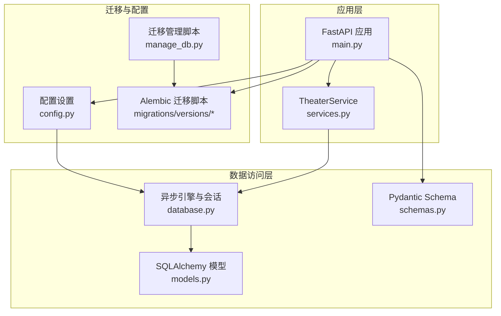
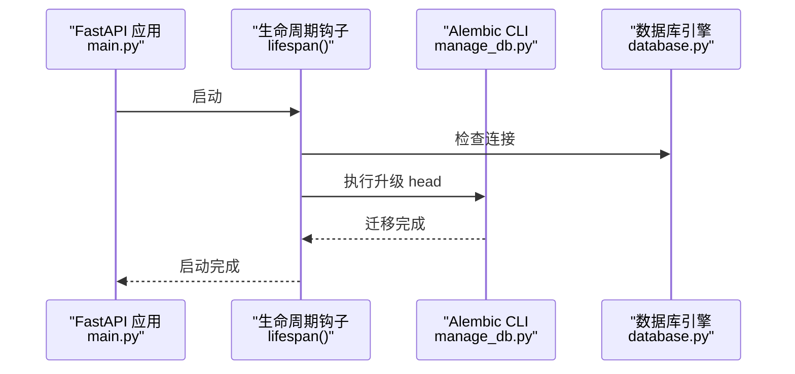
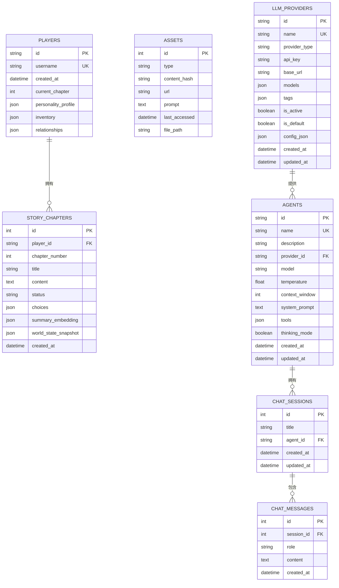
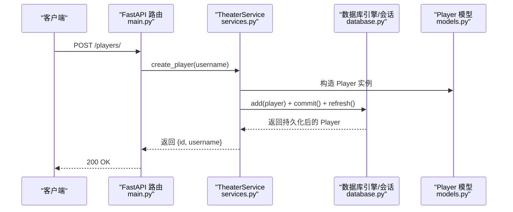
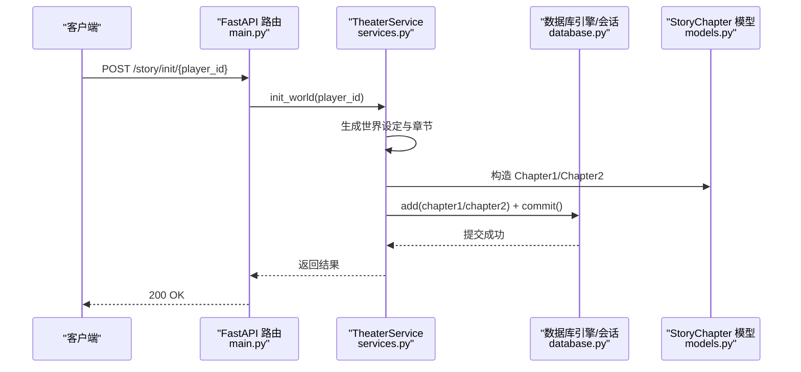
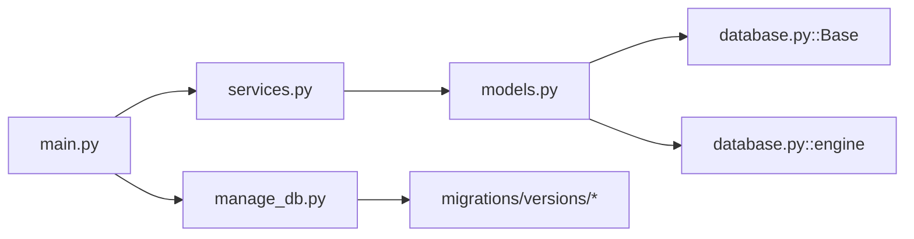
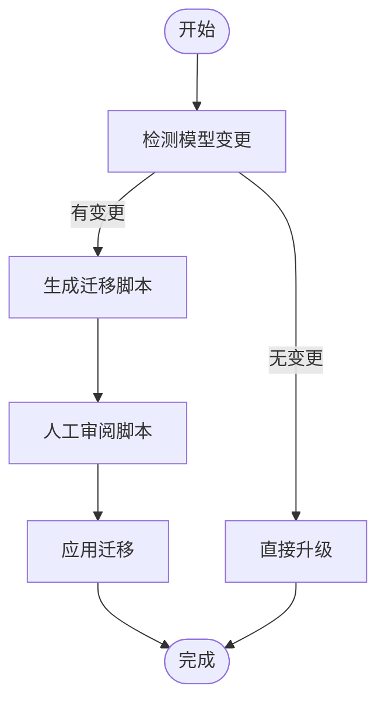

# 数据库设计

<cite>
**本文引用的文件**
- [backend/models.py](file://backend/models.py)
- [backend/database.py](file://backend/database.py)
- [backend/schemas.py](file://backend/schemas.py)
- [backend/config.py](file://backend/config.py)
- [backend/migrations/versions/14746eaf1c81_initial.py](file://backend/migrations/versions/14746eaf1c81_initial.py)
- [backend/migrations/versions/82e927e1cf80_add_agent_model.py](file://backend/migrations/versions/82e927e1cf80_add_agent_model.py)
- [backend/migrations/versions/a3b8c9d0e1f2_convert_ids_to_uuid.py](file://backend/migrations/versions/a3b8c9d0e1f2_convert_ids_to_uuid.py)
- [backend/migrations/versions/f1580ee10d5e_add_chat_models.py](file://backend/migrations/versions/f1580ee10d5e_add_chat_models.py)
- [backend/manage_db.py](file://backend/manage_db.py)
- [backend/main.py](file://backend/main.py)
- [backend/services.py](file://backend/services.py)
- [docs/wiki/Database-Migration.md](file://docs/wiki/Database-Migration.md)
</cite>

## 目录
1. [简介](#简介)
2. [项目结构与数据库相关模块](#项目结构与数据库相关模块)
3. [核心数据模型](#核心数据模型)
4. [架构总览](#架构总览)
5. [详细组件分析](#详细组件分析)
6. [依赖关系分析](#依赖关系分析)
7. [性能与并发特性](#性能与并发特性)
8. [数据访问与缓存策略](#数据访问与缓存策略)
9. [数据完整性与约束](#数据完整性与约束)
10. [数据生命周期与归档](#数据生命周期与归档)
11. [迁移路径与版本管理](#迁移路径与版本管理)
12. [安全与隐私](#安全与隐私)
13. [故障排查](#故障排查)
14. [结论](#结论)

## 简介
本文件面向数据库设计与实现，基于后端代码库中的 SQLAlchemy 模型、异步数据库引擎、Pydantic 数据校验层以及 Alembic 迁移体系，系统化梳理实体关系、字段定义、索引与约束、数据访问模式、缓存策略、性能优化、数据生命周期与迁移管理，并给出可视化图示与实践建议。目标读者包括开发者、运维与产品人员。

## 项目结构与数据库相关模块
- 数据模型层：SQLAlchemy ORM 映射类，定义表结构与字段类型。
- 数据库引擎层：异步 SQLAlchemy 引擎与会话工厂，支持连接池与自动重连。
- 数据校验层：Pydantic 模型，用于请求/响应数据的序列化与校验。
- 迁移与版本管理：Alembic 迁移脚本与封装的迁移管理工具。
- 启动与集成：FastAPI 应用在启动阶段执行迁移，确保数据库结构与代码一致。



图表来源
- [backend/main.py](file://backend/main.py#L45-L81)
- [backend/database.py](file://backend/database.py#L1-L31)
- [backend/models.py](file://backend/models.py#L1-L122)
- [backend/schemas.py](file://backend/schemas.py#L1-L102)
- [backend/config.py](file://backend/config.py#L1-L34)
- [backend/manage_db.py](file://backend/manage_db.py#L1-L67)

章节来源
- [backend/main.py](file://backend/main.py#L45-L81)
- [backend/database.py](file://backend/database.py#L1-L31)
- [backend/config.py](file://backend/config.py#L1-L34)

## 核心数据模型
本项目采用 SQLAlchemy 定义的核心实体包括：玩家、故事章节、资产、LLM 提供商、聊天会话与消息、智能体。各实体的字段与类型、索引与约束如下。

- 玩家（Players）
  - 主键：字符串（UUID，长度 36）
  - 索引：用户名唯一索引
  - 字段：用户名、创建时间、当前章节、个性画像（JSON）、背包（JSON）、关系映射（JSON）
  - 约束：用户名唯一；创建时间默认值

- 故事章节（StoryChapters）
  - 主键：整数
  - 外键：玩家 ID（UUID，指向 players.id）
  - 字段：章节号、标题、内容（文本）、状态（字符串，默认 pending）、选择分支（JSON）、摘要向量（JSON）、世界快照（JSON）、创建时间
  - 约束：状态枚举化（pending/generating/ready/completed）

- 资产（Assets）
  - 主键：整数
  - 字段：类型（图片/音频/语音）、内容哈希（用于去重）、URL、提示词、最后访问时间、文件路径
  - 索引：内容哈希

- LLM 提供商（LLMProviders）
  - 主键：字符串（UUID，长度 36）
  - 索引：名称唯一索引
  - 字段：提供商名称、提供商类型、API 密钥、基础 URL、模型列表（JSON）、标签（JSON）、是否启用、是否默认、额外配置（JSON）、创建/更新时间
  - 约束：名称唯一；布尔开关；JSON 字段默认空结构

- 智能体（Agents）
  - 主键：字符串（UUID，长度 36）
  - 外键：提供商 ID（UUID，指向 llm_providers.id）
  - 字段：名称（唯一）、描述、提供商 ID、模型名、温度、上下文窗口、系统提示、工具列表（JSON）、思考模式、创建/更新时间
  - 约束：名称唯一；数值范围校验（温度、上下文窗口）

- 聊天会话（ChatSessions）
  - 主键：整数
  - 外键：智能体 ID（UUID，指向 agents.id）
  - 字段：标题、创建/更新时间
  - 索引：会话 ID

- 聊天消息（ChatMessages）
  - 主键：整数
  - 外键：会话 ID（指向 chat_sessions.id）
  - 字段：角色（用户/助手/系统）、内容（文本）、创建时间
  - 索引：消息 ID、会话 ID

章节来源
- [backend/models.py](file://backend/models.py#L9-L122)

## 架构总览
数据库层由异步 SQLAlchemy 引擎驱动，结合 Alembic 迁移与 Pydantic 校验，形成“模型-迁移-校验-应用”的闭环。启动时自动执行迁移，确保数据库结构与代码一致。



图表来源
- [backend/main.py](file://backend/main.py#L45-L81)
- [backend/manage_db.py](file://backend/manage_db.py#L30-L38)
- [backend/database.py](file://backend/database.py#L1-L31)

章节来源
- [backend/main.py](file://backend/main.py#L45-L81)
- [backend/manage_db.py](file://backend/manage_db.py#L1-L67)

## 详细组件分析

### 实体关系图（ERD）


图表来源
- [backend/models.py](file://backend/models.py#L9-L122)

章节来源
- [backend/models.py](file://backend/models.py#L9-L122)

### 类与字段关系图（代码级）
```mermaid
classDiagram
class Player {
+string id
+string username
+datetime created_at
+int current_chapter
+json personality_profile
+json inventory
+json relationships
}
class StoryChapter {
+int id
+string player_id
+int chapter_number
+string title
+text content
+string status
+json choices
+json summary_embedding
+json world_state_snapshot
+datetime created_at
}
class Asset {
+int id
+string type
+string content_hash
+string url
+text prompt
+datetime last_accessed
+string file_path
}
class LLMProvider {
+string id
+string name
+string provider_type
+string api_key
+string base_url
+json models
+json tags
+boolean is_active
+boolean is_default
+json config_json
+datetime created_at
+datetime updated_at
}
class Agent {
+string id
+string name
+string description
+string provider_id
+string model
+float temperature
+int context_window
+text system_prompt
+json tools
+boolean thinking_mode
+datetime created_at
+datetime updated_at
}
class ChatSession {
+int id
+string title
+string agent_id
+datetime created_at
+datetime updated_at
}
class ChatMessage {
+int id
+int session_id
+string role
+text content
+datetime created_at
}
Player "1" o--o{ StoryChapter : "拥有"
LLMProvider "1" o--o{ Agent : "提供"
Agent "1" o--o{ ChatSession : "拥有"
ChatSession "1" o--o{ ChatMessage : "包含"
```

图表来源
- [backend/models.py](file://backend/models.py#L9-L122)

章节来源
- [backend/models.py](file://backend/models.py#L9-L122)

### 数据访问流程（新增玩家）


图表来源
- [backend/main.py](file://backend/main.py#L138-L146)
- [backend/services.py](file://backend/services.py#L12-L17)
- [backend/database.py](file://backend/database.py#L28-L31)
- [backend/models.py](file://backend/models.py#L9-L23)

章节来源
- [backend/main.py](file://backend/main.py#L138-L146)
- [backend/services.py](file://backend/services.py#L12-L17)
- [backend/database.py](file://backend/database.py#L28-L31)
- [backend/models.py](file://backend/models.py#L9-L23)

### 数据生成与保存流程（初始化世界）


图表来源
- [backend/main.py](file://backend/main.py#L147-L156)
- [backend/services.py](file://backend/services.py#L19-L59)
- [backend/database.py](file://backend/database.py#L28-L31)
- [backend/models.py](file://backend/models.py#L24-L44)

章节来源
- [backend/main.py](file://backend/main.py#L147-L156)
- [backend/services.py](file://backend/services.py#L19-L59)
- [backend/database.py](file://backend/database.py#L28-L31)
- [backend/models.py](file://backend/models.py#L24-L44)

## 依赖关系分析
- 模型依赖：各模型继承自统一的 DeclarativeBase，使用异步引擎与会话工厂。
- 外键依赖：StoryChapter.player_id → Players.id；Agent.provider_id → LLMProviders.id；ChatSessions.agent_id → Agents.id；ChatMessages.session_id → ChatSessions.id。
- 索引依赖：模型中显式声明索引，提升查询效率。
- 运行时依赖：启动时通过 Alembic 升级数据库；服务层通过 Pydantic 校验输入参数。



图表来源
- [backend/models.py](file://backend/models.py#L1-L4)
- [backend/database.py](file://backend/database.py#L25-L26)
- [backend/services.py](file://backend/services.py#L1-L7)
- [backend/main.py](file://backend/main.py#L37-L42)
- [backend/manage_db.py](file://backend/manage_db.py#L1-L67)

章节来源
- [backend/models.py](file://backend/models.py#L1-L4)
- [backend/database.py](file://backend/database.py#L1-L31)
- [backend/services.py](file://backend/services.py#L1-L7)
- [backend/main.py](file://backend/main.py#L37-L42)
- [backend/manage_db.py](file://backend/manage_db.py#L1-L67)

## 性能与并发特性
- 异步引擎：使用 SQLAlchemy 异步引擎与会话工厂，降低阻塞，提升高并发下的吞吐。
- 连接池：配置预检与溢出连接，适应突发流量。
- 索引：在高频查询字段（如用户名、内容哈希、会话 ID）建立索引，减少扫描成本。
- 时间戳：服务器默认时间戳与更新时间，便于审计与统计。

章节来源
- [backend/database.py](file://backend/database.py#L8-L23)
- [backend/models.py](file://backend/models.py#L12-L13)
- [backend/models.py](file://backend/models.py#L49-L50)
- [backend/models.py](file://backend/models.py#L94-L95)

## 数据访问与缓存策略
- 缓存位置：资产表包含“最后访问时间”字段，可用于缓存淘汰与热点识别。
- 缓存策略建议：
  - 内容去重：基于内容哈希（content_hash）进行重复内容识别与复用。
  - 访问频率：根据 last_accessed 统计热点资源，优先驻留内存或 CDN。
  - 会话缓存：聊天会话与消息可按会话维度缓存近期数据，降低数据库压力。
- 会话管理：异步会话工厂在应用生命周期内复用，避免频繁创建销毁带来的开销。

章节来源
- [backend/models.py](file://backend/models.py#L54-L56)
- [backend/database.py](file://backend/database.py#L19-L23)

## 数据完整性与约束
- 主键/外键：严格定义主键与外键，确保引用完整性。
- 唯一性：用户名、提供商名称、智能体名称均设唯一索引。
- 默认值：创建时间使用服务器默认值；状态默认为“待处理”等。
- JSON 字段：使用 JSON 类型存储结构化数据（如配置、关系映射），默认空结构。
- 数值范围：温度与上下文窗口在 Pydantic 层设置范围校验，保障参数合理性。

章节来源
- [backend/models.py](file://backend/models.py#L12-L13)
- [backend/models.py](file://backend/models.py#L61-L62)
- [backend/models.py](file://backend/models.py#L103-L104)
- [backend/schemas.py](file://backend/schemas.py#L43-L52)
- [backend/schemas.py](file://backend/schemas.py#L57-L66)

## 数据生命周期与归档
- 生命周期阶段：玩家创建 → 章节生成 → 会话与消息交互 → 资产生成与缓存。
- 归档建议：
  - 会话与消息：按时间窗口归档（如超过 90 天未访问），保留摘要与必要元数据。
  - 章节：历史章节可压缩存储，仅保留关键字段与摘要向量。
  - 资产：基于访问频率与内容哈希去重，长期未访问资源可降级存储。
- 保留策略：结合业务需求设置保留期限，定期清理过期数据，释放存储空间。

（本节为通用实践建议，不直接分析具体文件）

## 迁移路径与版本管理
- 迁移工具：Alembic + 封装脚本 manage_db.py。
- 版本演进：
  - 初始版本：引入 llm_providers 表，调整 tags 字段类型为 JSON。
  - 添加智能体模型：创建 agents 表并建立索引。
  - 转换主键为 UUID：对 players、llm_providers、agents 的主键进行转换，同时维护外键关系。
  - 添加聊天模型：创建 chat_sessions 与 chat_messages 表并建立索引。
- 启动时自动迁移：应用启动阶段调用 Alembic 升级至最新版本，确保数据库结构与代码一致。
- 常见问题与处理：
  - SQLite 限制：部分 ALTER 操作受限，Alembic 使用批处理模式模拟复杂变更，需人工审阅生成脚本。
  - 多人协作：若出现多个 head，需手动调整 down_revision 串接版本链。



图表来源
- [docs/wiki/Database-Migration.md](file://docs/wiki/Database-Migration.md#L30-L51)
- [backend/manage_db.py](file://backend/manage_db.py#L20-L38)

章节来源
- [backend/migrations/versions/14746eaf1c81_initial.py](file://backend/migrations/versions/14746eaf1c81_initial.py#L21-L30)
- [backend/migrations/versions/82e927e1cf80_add_agent_model.py](file://backend/migrations/versions/82e927e1cf80_add_agent_model.py#L21-L43)
- [backend/migrations/versions/a3b8c9d0e1f2_convert_ids_to_uuid.py](file://backend/migrations/versions/a3b8c9d0e1f2_convert_ids_to_uuid.py#L22-L221)
- [backend/migrations/versions/f1580ee10d5e_add_chat_models.py](file://backend/migrations/versions/f1580ee10d5e_add_chat_models.py#L21-L48)
- [docs/wiki/Database-Migration.md](file://docs/wiki/Database-Migration.md#L1-L85)
- [backend/manage_db.py](file://backend/manage_db.py#L1-L67)
- [backend/main.py](file://backend/main.py#L59-L65)

## 安全与隐私
- API 密钥存储：LLM 提供商表包含 API 密钥字段，建议在生产环境中以加密方式存储或通过密钥管理服务注入。
- 访问控制：当前未在数据库层实现细粒度权限控制，可在应用层通过认证与授权中间件实现 RBAC。
- 数据最小化：仅存储必要的字段，避免敏感信息冗余；对 JSON 字段进行白名单校验。
- 传输安全：建议使用 HTTPS 与 TLS，确保数据库连接安全。

章节来源
- [backend/models.py](file://backend/models.py#L65-L66)
- [backend/config.py](file://backend/config.py#L18-L19)

## 故障排查
- 数据库未升级：启动时报“数据库未达到最新版本”，执行升级命令或重启应用。
- SQLite 限制：复杂 ALTER 操作失败，检查生成的迁移脚本，必要时手动修正。
- 连接问题：检查 DATABASE_URL 配置与连接池参数，确认 SQLite 文件路径与权限。
- 迁移冲突：出现多个 head，手动调整 down_revision 并合并脚本。

章节来源
- [docs/wiki/Database-Migration.md](file://docs/wiki/Database-Migration.md#L71-L85)
- [backend/config.py](file://backend/config.py#L14-L16)
- [backend/database.py](file://backend/database.py#L14-L16)

## 结论
本数据库设计围绕异步 SQLAlchemy 与 Alembic 迁移，构建了从模型到迁移再到应用的完整闭环。通过明确的实体关系、索引与约束、数据访问流程与缓存策略，能够支撑叙事驱动的无限剧场场景。建议在生产环境中强化密钥管理、引入细粒度权限控制，并持续优化迁移脚本与监控告警，确保数据一致性与系统稳定性。