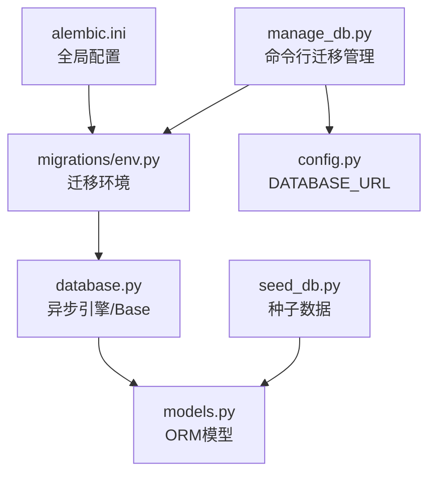
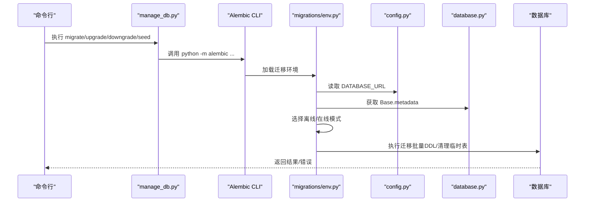
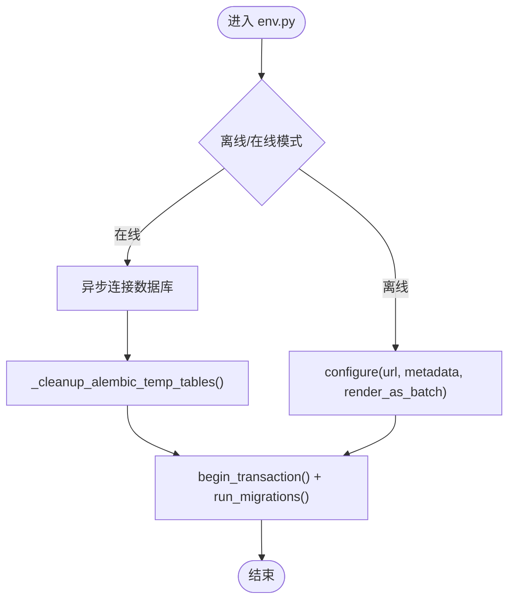
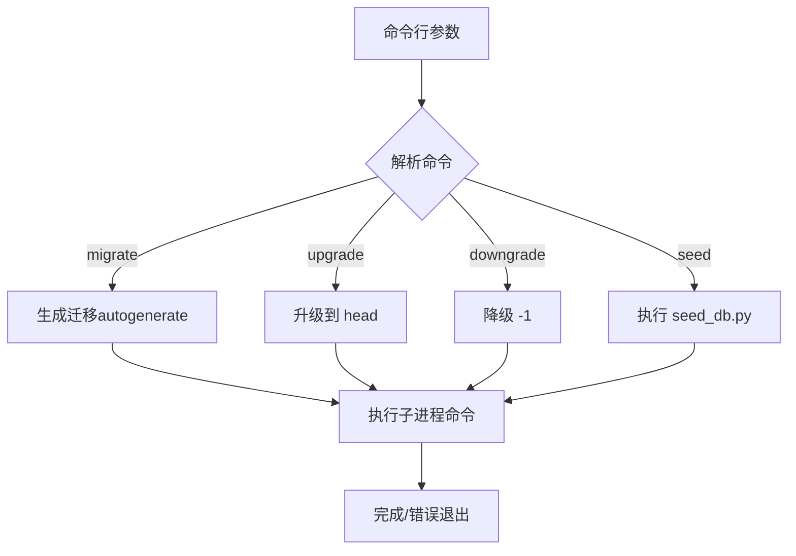
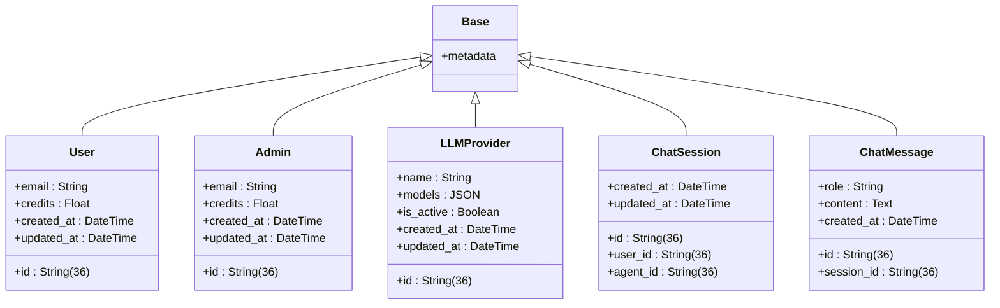
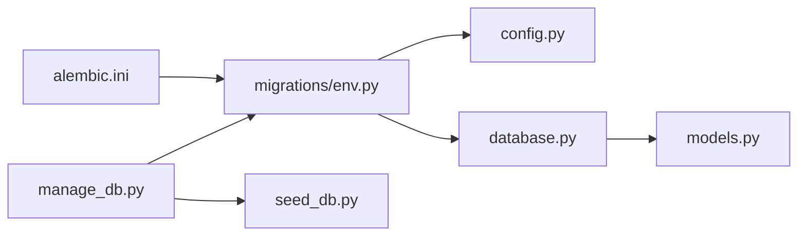

# 数据库迁移管理

<cite>
**本文引用的文件**
- [alembic.ini](file://backend/alembic.ini)
- [env.py](file://backend/migrations/env.py)
- [manage_db.py](file://backend/manage_db.py)
- [database.py](file://backend/database.py)
- [config.py](file://backend/config.py)
- [models.py](file://backend/models.py)
- [seed_db.py](file://backend/seed_db.py)
- [14746eaf1c81_initial.py](file://backend/migrations/versions/14746eaf1c81_initial.py)
- [a3b8c9d0e1f2_convert_ids_to_uuid.py](file://backend/migrations/versions/a3b8c9d0e1f2_convert_ids_to_uuid.py)
- [cc40fa02de06_migrate_credits_to_decimal_and_atomic_.py](file://backend/migrations/versions/cc40fa02de06_migrate_credits_to_decimal_and_atomic_.py)
</cite>

## 目录
1. [简介](#简介)
2. [项目结构](#项目结构)
3. [核心组件](#核心组件)
4. [架构总览](#架构总览)
5. [详细组件分析](#详细组件分析)
6. [依赖分析](#依赖分析)
7. [性能考虑](#性能考虑)
8. [故障排除指南](#故障排除指南)
9. [结论](#结论)
10. [附录](#附录)

## 简介
本文件面向Infinite Game项目的数据库迁移管理，围绕Alembic迁移框架的配置与使用、迁移文件生成与执行、版本控制策略、模式变更最佳实践、常见迁移场景操作、回滚与故障排除以及生产环境安全策略进行系统化说明。文档以仓库现有实现为基础，结合迁移脚本与配置文件，帮助开发者在不同环境下正确、安全地推进数据库演进。

## 项目结构
Infinite Game后端采用异步SQLAlchemy + Alembic的数据库方案，迁移相关文件集中在backend/migrations目录，核心配置与入口如下：
- 配置与入口
  - alembic.ini：Alembic全局配置，指定脚本位置、路径前缀、日志级别等
  - migrations/env.py：迁移执行环境，负责加载数据库URL、模型元数据、离线/在线迁移流程
  - manage_db.py：命令行迁移管理器，封装迁移、升级、降级、种子数据等常用操作
- 数据库与模型
  - database.py：异步引擎与Base基类定义
  - models.py：ORM模型定义（含UUID主键、JSON字段、外键等）
  - config.py：数据库URL、运行参数等配置
  - seed_db.py：初始化种子数据（LLM Provider、Admin等）

图表来源
- [alembic.ini](file://backend/alembic.ini)
- [env.py](file://backend/migrations/env.py)
- [manage_db.py](file://backend/manage_db.py)
- [database.py](file://backend/database.py)
- [models.py](file://backend/models.py)
- [config.py](file://backend/config.py)
- [seed_db.py](file://backend/seed_db.py)

章节来源
- [alembic.ini](file://backend/alembic.ini)
- [env.py](file://backend/migrations/env.py)
- [manage_db.py](file://backend/manage_db.py)
- [database.py](file://backend/database.py)
- [config.py](file://backend/config.py)
- [models.py](file://backend/models.py)
- [seed_db.py](file://backend/seed_db.py)

## 核心组件
- Alembic配置与环境
  - alembic.ini：设置脚本位置、路径前缀、日志级别、PostgreSQL/SQLite兼容等
  - migrations/env.py：加载settings.DATABASE_URL、注册Base.metadata、支持离线/在线迁移、批量DDL渲染
- 数据库与模型
  - database.py：异步引擎、会话工厂、Base基类
  - models.py：定义用户、管理员、剧场、节点、边、资产、LLM Provider、聊天会话与消息等模型
- 迁移管理器
  - manage_db.py：封装迁移生成、升级、降级、种子数据导入等命令
- 配置与种子
  - config.py：DATABASE_URL（默认SQLite）、运行迁移开关等
  - seed_db.py：创建默认LLM Provider与管理员账户

章节来源
- [alembic.ini](file://backend/alembic.ini)
- [env.py](file://backend/migrations/env.py)
- [database.py](file://backend/database.py)
- [models.py](file://backend/models.py)
- [manage_db.py](file://backend/manage_db.py)
- [config.py](file://backend/config.py)
- [seed_db.py](file://backend/seed_db.py)

## 架构总览
下图展示了从命令行到数据库的迁移执行链路，包括离线/在线两种模式、临时表清理与批量DDL渲染。

图表来源
- [manage_db.py](file://backend/manage_db.py)
- [env.py](file://backend/migrations/env.py)
- [config.py](file://backend/config.py)
- [database.py](file://backend/database.py)

## 详细组件分析

### Alembic配置与环境（env.py）
- 离线模式：通过目标URL与target_metadata渲染SQL，使用批量渲染避免引擎连接
- 在线模式：异步连接数据库，先清理残留临时表，再执行迁移事务
- 批量渲染：render_as_batch=True，提升跨数据库兼容性
- 临时表清理：扫描表名前缀，自动DROP残留临时表，降低迁移失败风险

图表来源
- [env.py](file://backend/migrations/env.py)

章节来源
- [env.py](file://backend/migrations/env.py)

### 迁移管理器（manage_db.py）
- migrate：基于autogenerate生成新迁移，要求提供变更描述
- upgrade：应用所有待定迁移至head
- downgrade：回退最近一次迁移
- seed：调用seed_db.py导入初始数据

图表来源
- [manage_db.py](file://backend/manage_db.py)

章节来源
- [manage_db.py](file://backend/manage_db.py)

### 数据库与模型（database.py、models.py）
- 异步引擎：支持SQLite与PostgreSQL，连接池参数与预检
- Base：DeclarativeBase，作为所有模型的元数据根
- 模型：用户、管理员、剧场、节点、边、资产、LLM Provider、聊天会话与消息等，广泛使用String(36)主键、JSON字段、外键约束、索引等

图表来源
- [database.py](file://backend/database.py)
- [models.py](file://backend/models.py)

章节来源
- [database.py](file://backend/database.py)
- [models.py](file://backend/models.py)

### 迁移历史与关键案例
- 初始迁移（14746eaf1c81）：首次创建基础表，若表已存在则仅做列类型调整
- UUID迁移（a3b8c9d0e1f2）：将玩家、LLM Provider、Agent等整表重建，保留外键关系与索引；降级为破坏性操作
- 精度迁移（cc40fa02de06）：将用户/管理员/交易表的余额与金额字段从Float迁移到DECIMAL(18,4)，并修复FK映射与临时表清理

章节来源
- [14746eaf1c81_initial.py](file://backend/migrations/versions/14746eaf1c81_initial.py)
- [a3b8c9d0e1f2_convert_ids_to_uuid.py](file://backend/migrations/versions/a3b8c9d0e1f2_convert_ids_to_uuid.py)
- [cc40fa02de06_migrate_credits_to_decimal_and_atomic_.py](file://backend/migrations/versions/cc40fa02de06_migrate_credits_to_decimal_and_atomic_.py)

## 依赖分析
- 配置依赖
  - alembic.ini：指定脚本位置、路径前缀、日志级别
  - env.py：依赖config.settings.DATABASE_URL与database.Base.metadata
- 运行时依赖
  - manage_db.py：调用Alembic CLI与seed_db.py
  - seed_db.py：依赖AsyncSessionLocal与models

图表来源
- [alembic.ini](file://backend/alembic.ini)
- [env.py](file://backend/migrations/env.py)
- [config.py](file://backend/config.py)
- [database.py](file://backend/database.py)
- [models.py](file://backend/models.py)
- [manage_db.py](file://backend/manage_db.py)
- [seed_db.py](file://backend/seed_db.py)

章节来源
- [alembic.ini](file://backend/alembic.ini)
- [env.py](file://backend/migrations/env.py)
- [config.py](file://backend/config.py)
- [database.py](file://backend/database.py)
- [models.py](file://backend/models.py)
- [manage_db.py](file://backend/manage_db.py)
- [seed_db.py](file://backend/seed_db.py)

## 性能考虑
- 连接池与预检：异步引擎启用pool_pre_ping与合理连接池参数，减少断连与重试开销
- 批量DDL：render_as_batch=True提升跨数据库兼容性，避免逐条DDL导致的锁竞争
- 临时表清理：迁移前清理残留临时表，降低DDL反射与锁等待
- 大表重建：UUID迁移采用“读取-重建-回填”策略，注意事务边界与索引重建成本

章节来源
- [env.py](file://backend/migrations/env.py)
- [database.py](file://backend/database.py)
- [a3b8c9d0e1f2_convert_ids_to_uuid.py](file://backend/migrations/versions/a3b8c9d0e1f2_convert_ids_to_uuid.py)

## 故障排除指南
- 迁移失败与临时表残留
  - 现象：迁移报错或DDL反射失败
  - 处理：env.py内置清理残留临时表逻辑，可在迁移前自动DROP；必要时手动清理
- SQLite与DECIMAL类型差异
  - 现象：ALTER COLUMN修改类型不生效或精度丢失
  - 处理：在模型定义中明确使用DECIMAL(18,4)，并通过Alembic生成迁移；若自动生成未触发，需手动添加alter_column
- 外键约束与表结构变更
  - 现象：FK指向缺失表或约束名称未知
  - 处理：在迁移中显式重建表结构或手动执行SQL修正；参考cc40fa02de06迁移中的外键修复策略
- 降级破坏性风险
  - 现象：UUID迁移降级为整数ID重建
  - 处理：降级不可逆，需提前备份；仅在测试环境验证

章节来源
- [env.py](file://backend/migrations/env.py)
- [cc40fa02de06_migrate_credits_to_decimal_and_atomic_.py](file://backend/migrations/versions/cc40fa02de06_migrate_credits_to_decimal_and_atomic_.py)
- [a3b8c9d0e1f2_convert_ids_to_uuid.py](file://backend/migrations/versions/a3b8c9d0e1f2_convert_ids_to_uuid.py)

## 结论
Infinite Game的数据库迁移体系以Alembic为核心，结合异步SQLAlchemy与批量DDL渲染，实现了对SQLite与PostgreSQL的兼容支持，并通过管理器封装了常见的迁移操作。项目在关键迁移中体现了对数据完整性、外键一致性与临时表清理的重视。建议在生产环境中遵循严格的版本控制、回滚策略与备份机制，确保迁移过程可控、可追溯、可恢复。

## 附录

### 常见迁移场景操作指南
- 生成迁移
  - 步骤：修改models.py后，执行迁移管理器的migrate命令并提供变更描述
  - 参考：[manage_db.py](file://backend/manage_db.py)
- 应用迁移
  - 步骤：执行upgrade命令，将数据库升级到最新版本
  - 参考：[manage_db.py](file://backend/manage_db.py)
- 回退迁移
  - 步骤：执行downgrade命令，回退最近一次迁移
  - 参考：[manage_db.py](file://backend/manage_db.py)
- 导入种子数据
  - 步骤：执行seed命令，导入默认LLM Provider与管理员账户
  - 参考：[manage_db.py](file://backend/manage_db.py)、[seed_db.py](file://backend/seed_db.py)

### 版本控制与历史管理
- 迁移历史
  - 初始版本：创建基础表与索引
  - UUID版本：整表重建并保留外键与索引
  - 精度版本：将余额与金额字段迁移到DECIMAL(18,4)，修复FK映射
- 分支合并与冲突解决
  - 建议：优先在测试环境验证迁移；如出现冲突，优先通过显式DDL修复外键与索引
  - 参考：[14746eaf1c81_initial.py](file://backend/migrations/versions/14746eaf1c81_initial.py)、[a3b8c9d0e1f2_convert_ids_to_uuid.py](file://backend/migrations/versions/a3b8c9d0e1f2_convert_ids_to_uuid.py)、[cc40fa02de06_migrate_credits_to_decimal_and_atomic_.py](file://backend/migrations/versions/cc40fa02de06_migrate_credits_to_decimal_and_atomic_.py)

### 数据库模式变更最佳实践
- 向后兼容性
  - 使用JSON字段承载可扩展配置，避免频繁ALTER TABLE
  - 保留废弃字段并在后续版本移除，确保查询兼容
- 数据迁移脚本
  - 大规模重建采用“读取-重建-回填”策略，注意事务边界与索引重建
  - 参考：[a3b8c9d0e1f2_convert_ids_to_uuid.py](file://backend/migrations/versions/a3b8c9d0e1f2_convert_ids_to_uuid.py)
- 索引优化
  - 主键与唯一索引优先；复合索引按查询热点设计
  - 参考：models.py中各表的索引定义

### 生产环境迁移安全策略
- 环境隔离
  - 严格区分开发、测试、预发布与生产环境
- 备份与回滚
  - 迁移前备份数据库；准备降级脚本与数据快照
- 低峰时段
  - 选择业务低峰时段执行迁移，缩短锁表时间
- 监控与日志
  - 启用Alembic与SQLAlchemy日志，记录迁移过程
  - 参考：[alembic.ini](file://backend/alembic.ini)

章节来源
- [manage_db.py](file://backend/manage_db.py)
- [seed_db.py](file://backend/seed_db.py)
- [14746eaf1c81_initial.py](file://backend/migrations/versions/14746eaf1c81_initial.py)
- [a3b8c9d0e1f2_convert_ids_to_uuid.py](file://backend/migrations/versions/a3b8c9d0e1f2_convert_ids_to_uuid.py)
- [cc40fa02de06_migrate_credits_to_decimal_and_atomic_.py](file://backend/migrations/versions/cc40fa02de06_migrate_credits_to_decimal_and_atomic_.py)
- [alembic.ini](file://backend/alembic.ini)