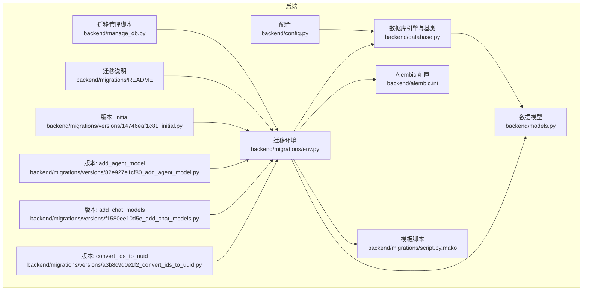
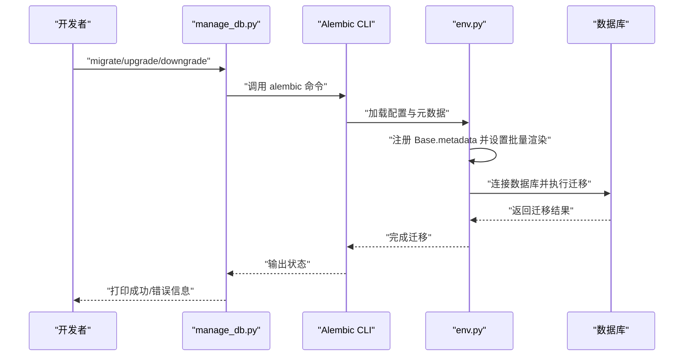
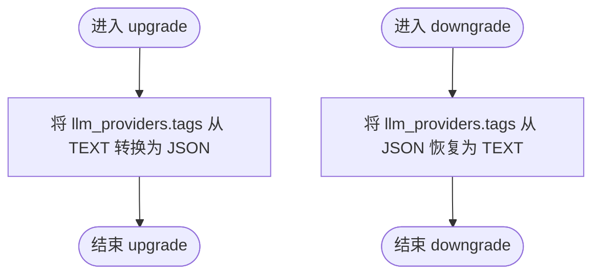
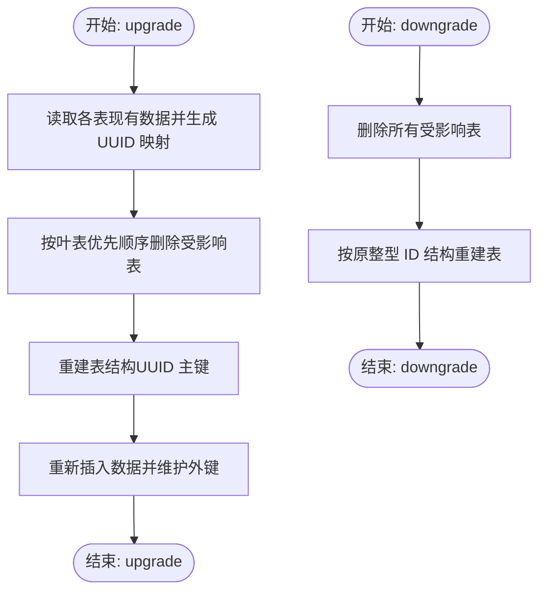
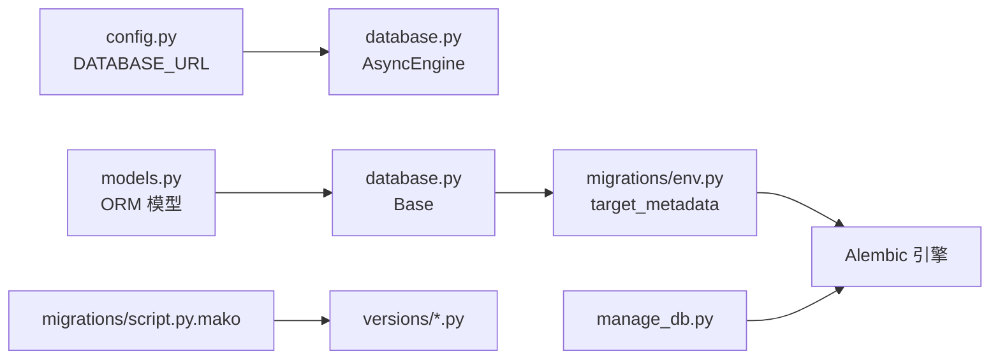

# 数据库迁移管理

<cite>
**本文档引用的文件**
- [backend/alembic.ini](file://backend/alembic.ini)
- [backend/migrations/env.py](file://backend/migrations/env.py)
- [backend/migrations/script.py.mako](file://backend/migrations/script.py.mako)
- [backend/migrations/README](file://backend/migrations/README)
- [backend/manage_db.py](file://backend/manage_db.py)
- [backend/models.py](file://backend/models.py)
- [backend/database.py](file://backend/database.py)
- [backend/config.py](file://backend/config.py)
- [backend/migrations/versions/14746eaf1c81_initial.py](file://backend/migrations/versions/14746eaf1c81_initial.py)
- [backend/migrations/versions/82e927e1cf80_add_agent_model.py](file://backend/migrations/versions/82e927e1cf80_add_agent_model.py)
- [backend/migrations/versions/f1580ee10d5e_add_chat_models.py](file://backend/migrations/versions/f1580ee10d5e_add_chat_models.py)
- [backend/migrations/versions/a3b8c9d0e1f2_convert_ids_to_uuid.py](file://backend/migrations/versions/a3b8c9d0e1f2_convert_ids_to_uuid.py)
- [docs/wiki/Database-Migration.md](file://docs/wiki/Database-Migration.md)
</cite>

## 目录
1. [简介](#简介)
2. [项目结构](#项目结构)
3. [核心组件](#核心组件)
4. [架构总览](#架构总览)
5. [详细组件分析](#详细组件分析)
6. [依赖关系分析](#依赖关系分析)
7. [性能考量](#性能考量)
8. [故障排查指南](#故障排查指南)
9. [结论](#结论)
10. [附录](#附录)

## 简介
本文件系统性梳理本项目的数据库迁移管理体系，围绕 Alembic 迁移框架的配置与使用流程展开，重点覆盖：
- 迁移版本命名规范与版本链管理
- 变更记录与回滚策略
- 初始数据库结构（14746eaf1c81_initial.py）及后续版本演进
- 数据模型变更的自动化检测与迁移脚本生成机制
- 生产环境迁移的安全策略、备份恢复与版本控制最佳实践
- 迁移失败的诊断方法与手动修复指南

## 项目结构
本项目采用单数据库、异步数据库 API 的 Alembic 配置，迁移脚本位于 migrations 目录，版本文件位于 versions 子目录。迁移执行通过 manage_db.py 提供的命令封装，底层由 Alembic 的 env.py 驱动。

图表来源
- [backend/alembic.ini](file://backend/alembic.ini#L1-L115)
- [backend/migrations/env.py](file://backend/migrations/env.py#L1-L105)
- [backend/migrations/script.py.mako](file://backend/migrations/script.py.mako#L1-L27)
- [backend/migrations/README](file://backend/migrations/README#L1-L1)
- [backend/manage_db.py](file://backend/manage_db.py#L1-L67)
- [backend/models.py](file://backend/models.py#L1-L122)
- [backend/database.py](file://backend/database.py#L1-L31)
- [backend/config.py](file://backend/config.py#L1-L34)
- [backend/migrations/versions/14746eaf1c81_initial.py](file://backend/migrations/versions/14746eaf1c81_initial.py#L1-L43)
- [backend/migrations/versions/82e927e1cf80_add_agent_model.py](file://backend/migrations/versions/82e927e1cf80_add_agent_model.py#L1-L54)
- [backend/migrations/versions/f1580ee10d5e_add_chat_models.py](file://backend/migrations/versions/f1580ee10d5e_add_chat_models.py#L1-L63)
- [backend/migrations/versions/a3b8c9d0e1f2_convert_ids_to_uuid.py](file://backend/migrations/versions/a3b8c9d0e1f2_convert_ids_to_uuid.py#L1-L327)

章节来源
- [backend/alembic.ini](file://backend/alembic.ini#L1-L115)
- [backend/migrations/env.py](file://backend/migrations/env.py#L1-L105)
- [backend/migrations/script.py.mako](file://backend/migrations/script.py.mako#L1-L27)
- [backend/migrations/README](file://backend/migrations/README#L1-L1)
- [backend/manage_db.py](file://backend/manage_db.py#L1-L67)
- [backend/models.py](file://backend/models.py#L1-L122)
- [backend/database.py](file://backend/database.py#L1-L31)
- [backend/config.py](file://backend/config.py#L1-L34)

## 核心组件
- Alembic 配置与模板
  - alembic.ini：定义脚本位置、路径前缀、版本位置分隔符、日志级别等；通过 sqlalchemy.url 提供数据库连接信息。
  - script.py.mako：迁移脚本模板，定义版本标识、上下文导入、upgrade/downgrade 函数占位。
- 迁移环境与元数据
  - env.py：加载配置 settings.DATABASE_URL，注册 Base.metadata，支持离线/在线两种迁移模式；启用批量渲染以兼容 SQLite 的 ALTER 限制。
- 迁移管理脚本
  - manage_db.py：封装 alembic 命令，提供 migrate/upgrade/downgrade 子命令，便于在 backend 目录内统一执行。
- 数据模型与引擎
  - models.py：定义 SQLAlchemy 模型，作为 Alembic 自动检测的目标元数据。
  - database.py：定义异步引擎与 Base，供 env.py 注册 target_metadata。
  - config.py：提供 DATABASE_URL，默认指向 SQLite 文件，支持通过 .env 覆盖。

章节来源
- [backend/alembic.ini](file://backend/alembic.ini#L1-L115)
- [backend/migrations/script.py.mako](file://backend/migrations/script.py.mako#L1-L27)
- [backend/migrations/env.py](file://backend/migrations/env.py#L1-L105)
- [backend/manage_db.py](file://backend/manage_db.py#L1-L67)
- [backend/models.py](file://backend/models.py#L1-L122)
- [backend/database.py](file://backend/database.py#L1-L31)
- [backend/config.py](file://backend/config.py#L1-L34)

## 架构总览
下图展示从模型变更到迁移应用的完整流程，包括 Alembic 自动检测、脚本生成、批量渲染与数据库应用。

图表来源
- [backend/manage_db.py](file://backend/manage_db.py#L1-L67)
- [backend/migrations/env.py](file://backend/migrations/env.py#L1-L105)
- [backend/alembic.ini](file://backend/alembic.ini#L1-L115)

## 详细组件分析

### 迁移版本命名规范与版本链
- 版本文件命名
  - 默认模板为 “%(rev)s_%(slug)s”，可通过配置项调整；当前仓库未启用带日期时间前缀的模板。
- 版本链管理
  - 每个版本文件包含 revision、down_revision、branch_labels、depends_on 等元信息，形成线性或分支链路。
  - 示例版本链：initial → add_agent_model → add_chat_models → convert_ids_to_uuid。
- 版本生成流程
  - 通过 manage_db.py 的 migrate 子命令触发 alembic revision --autogenerate，基于 models.py 的变更生成脚本。

章节来源
- [backend/alembic.ini](file://backend/alembic.ini#L7-L9)
- [backend/migrations/versions/14746eaf1c81_initial.py](file://backend/migrations/versions/14746eaf1c81_initial.py#L1-L43)
- [backend/migrations/versions/82e927e1cf80_add_agent_model.py](file://backend/migrations/versions/82e927e1cf80_add_agent_model.py#L1-L54)
- [backend/migrations/versions/f1580ee10d5e_add_chat_models.py](file://backend/migrations/versions/f1580ee10d5e_add_chat_models.py#L1-L63)
- [backend/migrations/versions/a3b8c9d0e1f2_convert_ids_to_uuid.py](file://backend/migrations/versions/a3b8c9d0e1f2_convert_ids_to_uuid.py#L1-L327)
- [backend/manage_db.py](file://backend/manage_db.py#L20-L28)

### 初始数据库结构与演进（14746eaf1c81_initial.py）
- 初始版本目标
  - 将 llm_providers 表的 tags 字段从 TEXT 改为 JSON，并保留默认值。
- 影响范围
  - 仅涉及单表单列变更，回滚时恢复为 TEXT 类型。
- 设计要点
  - 使用批量渲染以适配 SQLite 的 ALTER 限制。
  - 通过 op.batch_alter_table 安全地执行列类型转换。

图表来源
- [backend/migrations/versions/14746eaf1c81_initial.py](file://backend/migrations/versions/14746eaf1c81_initial.py#L21-L42)

章节来源
- [backend/migrations/versions/14746eaf1c81_initial.py](file://backend/migrations/versions/14746eaf1c81_initial.py#L1-L43)

### 后续版本演进
- 添加 Agent 模型（82e927e1cf80_add_agent_model.py）
  - 创建 agents 表，包含名称、描述、提供商关联、模型参数、工具集、思考模式等字段。
  - 建立索引与外键约束，确保查询效率与数据一致性。
- 添加聊天模型（f1580ee10d5e_add_chat_models.py）
  - 新增 chat_sessions 与 chat_messages 表，建立会话与消息的关系。
  - 为关键字段建立索引，提升查询性能。
- ID 类型转换为 UUID（a3b8c9d0e1f2_convert_ids_to_uuid.py）
  - 该版本为破坏性变更，需谨慎执行。
  - 步骤概览：读取现有数据构建 UUID 映射 → 以叶表优先顺序删除受影响表 → 重建表结构（UUID 主键）→ 重新插入数据 → 维护外键关系。
  - 回滚策略：删除所有受影响表并按原整型 ID 结构重建，UUID 无法映射回原始整数。

图表来源
- [backend/migrations/versions/a3b8c9d0e1f2_convert_ids_to_uuid.py](file://backend/migrations/versions/a3b8c9d0e1f2_convert_ids_to_uuid.py#L22-L327)

章节来源
- [backend/migrations/versions/82e927e1cf80_add_agent_model.py](file://backend/migrations/versions/82e927e1cf80_add_agent_model.py#L1-L54)
- [backend/migrations/versions/f1580ee10d5e_add_chat_models.py](file://backend/migrations/versions/f1580ee10d5e_add_chat_models.py#L1-L63)
- [backend/migrations/versions/a3b8c9d0e1f2_convert_ids_to_uuid.py](file://backend/migrations/versions/a3b8c9d0e1f2_convert_ids_to_uuid.py#L1-L327)

### 数据模型变更的自动化检测与迁移生成机制
- 自动检测原理
  - env.py 注册 Base.metadata 为目标元数据，Alembic 在 autogenerate 模式下比较 models.py 的当前状态与历史版本，生成差异脚本。
- 生成流程
  - manage_db.py 调用 alembic revision --autogenerate -m "描述"，在 versions 目录生成新版本文件。
- 批量渲染与 SQLite 兼容
  - env.py 设置 render_as_batch=True，规避 SQLite 对复杂 ALTER 的限制，通过“建新表-复制数据-删旧表-改名”策略实现列类型变更与索引重建。

章节来源
- [backend/migrations/env.py](file://backend/migrations/env.py#L28-L32)
- [backend/migrations/env.py](file://backend/migrations/env.py#L67-L71)
- [backend/migrations/env.py](file://backend/migrations/env.py#L95-L98)
- [backend/migrations/script.py.mako](file://backend/migrations/script.py.mako#L1-L27)
- [backend/manage_db.py](file://backend/manage_db.py#L20-L28)

### 迁移执行与回滚策略
- 执行入口
  - manage_db.py 提供 upgrade 与 downgrade 子命令，分别对应 alembic upgrade head 与 alembic downgrade -1。
- 回滚策略
  - 对于非破坏性版本（如 initial、add_agent_model、add_chat_models），可安全回滚至上一版本。
  - 对于破坏性版本（如 convert_ids_to_uuid），回滚会删除并重建为整型 ID 结构，UUID 数据无法映射回原整数，需谨慎评估风险。

章节来源
- [backend/manage_db.py](file://backend/manage_db.py#L30-L38)
- [backend/migrations/versions/a3b8c9d0e1f2_convert_ids_to_uuid.py](file://backend/migrations/versions/a3b8c9d0e1f2_convert_ids_to_uuid.py#L223-L327)

## 依赖关系分析
- 配置与引擎
  - config.py 提供 DATABASE_URL，database.py 基于该 URL 创建异步引擎，env.py 通过 settings.DATABASE_URL 获取连接字符串。
- 模型与元数据
  - models.py 定义 ORM 模型，database.py 的 Base 作为元数据基类；env.py 注册 Base.metadata 供 Alembic 比较。
- 迁移脚本与模板
  - script.py.mako 为版本脚本模板，versions 下的每个版本文件遵循该模板结构。
- 环境与执行
  - env.py 决定迁移模式（离线/在线）、批量渲染与连接生命周期；manage_db.py 作为用户入口封装命令。

图表来源
- [backend/config.py](file://backend/config.py#L15-L16)
- [backend/database.py](file://backend/database.py#L1-L31)
- [backend/models.py](file://backend/models.py#L1-L122)
- [backend/migrations/env.py](file://backend/migrations/env.py#L32-L40)
- [backend/migrations/script.py.mako](file://backend/migrations/script.py.mako#L1-L27)
- [backend/manage_db.py](file://backend/manage_db.py#L1-L67)

章节来源
- [backend/config.py](file://backend/config.py#L1-L34)
- [backend/database.py](file://backend/database.py#L1-L31)
- [backend/models.py](file://backend/models.py#L1-L122)
- [backend/migrations/env.py](file://backend/migrations/env.py#L1-L105)
- [backend/migrations/script.py.mako](file://backend/migrations/script.py.mako#L1-L27)
- [backend/manage_db.py](file://backend/manage_db.py#L1-L67)

## 性能考量
- 连接池与异步引擎
  - database.py 使用异步引擎，配置 pool_pre_ping、pool_size、max_overflow，提升连接稳定性与吞吐能力。
- 批量渲染与 SQLite 兼容
  - env.py 启用 render_as_batch=True，规避 SQLite 的 ALTER 限制，但大批量数据复制会带来额外 IO 与时间成本，建议在低频窗口执行。
- 索引与外键
  - 新增表与字段时应同步建立必要索引，避免迁移后查询性能下降；外键约束有助于数据一致性，但需注意级联删除/更新策略。

章节来源
- [backend/database.py](file://backend/database.py#L8-L23)
- [backend/migrations/env.py](file://backend/migrations/env.py#L67-L71)
- [backend/migrations/versions/82e927e1cf80_add_agent_model.py](file://backend/migrations/versions/82e927e1cf80_add_agent_model.py#L39-L42)
- [backend/migrations/versions/f1580ee10d5e_add_chat_models.py](file://backend/migrations/versions/f1580ee10d5e_add_chat_models.py#L32-L46)

## 故障排查指南
- 常见问题与处理
  - 目标数据库未更新：执行 upgrade 以应用所有未应用的迁移。
  - SQLite 限制：复杂 ALTER 可能失败，建议检查生成脚本是否使用批量渲染；避免删除列、修改列约束等高风险操作。
  - 多人协作冲突：出现多个 head 版本时，手动调整 down_revision 指向，或将内容合并为单一链路。
- 迁移失败诊断步骤
  - 检查 manage_db.py 输出与 Alembic 日志级别；确认 DATABASE_URL 是否正确。
  - 审核生成的版本文件，确认 upgrade/downgrade 逻辑符合预期。
  - 对于破坏性迁移（如 UUID 转换），先在测试环境验证，再制定回滚方案。
- 手动修复建议
  - 若自动检测遗漏字段或类型变更，可在版本文件中手动补充 op.batch_alter_table 或 op.create_table/op.drop_table。
  - 对于 UUID 转换等破坏性操作，若回滚不可逆，需准备数据导出/导入流程以保障业务连续性。

章节来源
- [docs/wiki/Database-Migration.md](file://docs/wiki/Database-Migration.md#L71-L85)
- [backend/manage_db.py](file://backend/manage_db.py#L10-L18)
- [backend/migrations/versions/a3b8c9d0e1f2_convert_ids_to_uuid.py](file://backend/migrations/versions/a3b8c9d0e1f2_convert_ids_to_uuid.py#L223-L327)

## 结论
本项目基于 Alembic 实现了完整的数据库迁移体系：通过 manage_db.py 封装命令、env.py 注册元数据与批量渲染、以及明确的版本链管理，实现了从模型变更到数据库应用的自动化与可追溯性。对于 SQLite 环境，批量渲染有效规避了 ALTER 限制；对于破坏性变更（如 UUID 转换），需严格评估风险并制定回滚与数据迁移策略。建议在团队内统一迁移规范、加强版本审查与测试，确保生产环境的稳定与安全。

## 附录
- 命令参考
  - 生成迁移：在 backend 目录执行 python manage_db.py migrate "描述"
  - 应用迁移：python manage_db.py upgrade
  - 回滚迁移：python manage_db.py downgrade
- 版本文件位置
  - backend/migrations/versions/
- 配置文件
  - backend/alembic.ini
  - backend/config.py（DATABASE_URL）

章节来源
- [docs/wiki/Database-Migration.md](file://docs/wiki/Database-Migration.md#L63-L70)
- [backend/manage_db.py](file://backend/manage_db.py#L40-L67)
- [backend/alembic.ini](file://backend/alembic.ini#L1-L115)
- [backend/config.py](file://backend/config.py#L15-L16)