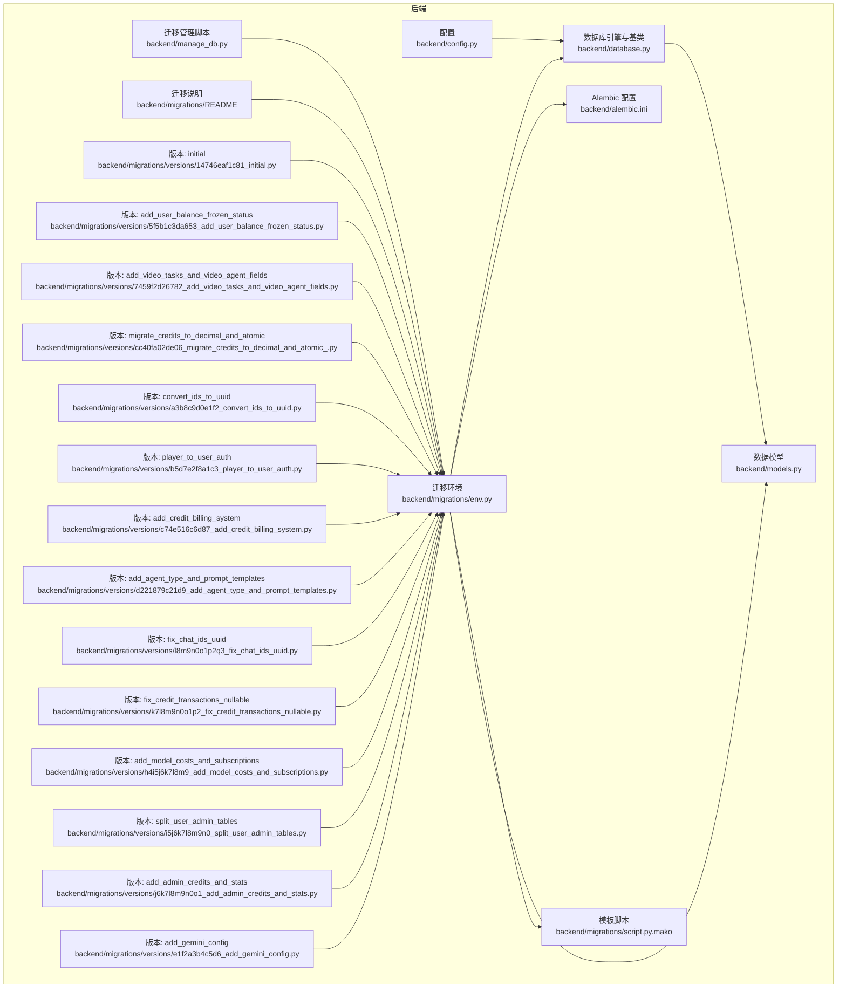
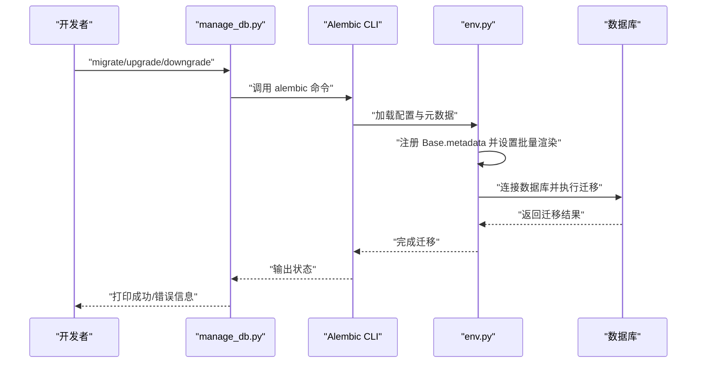
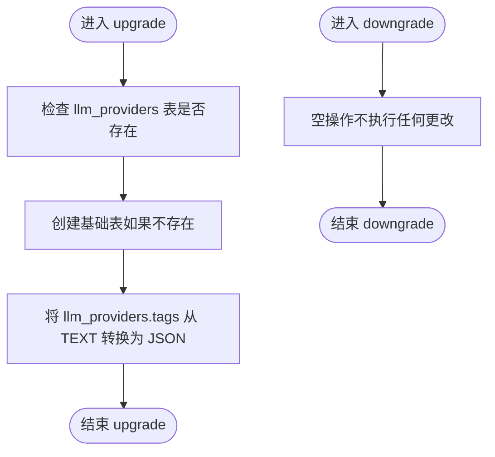
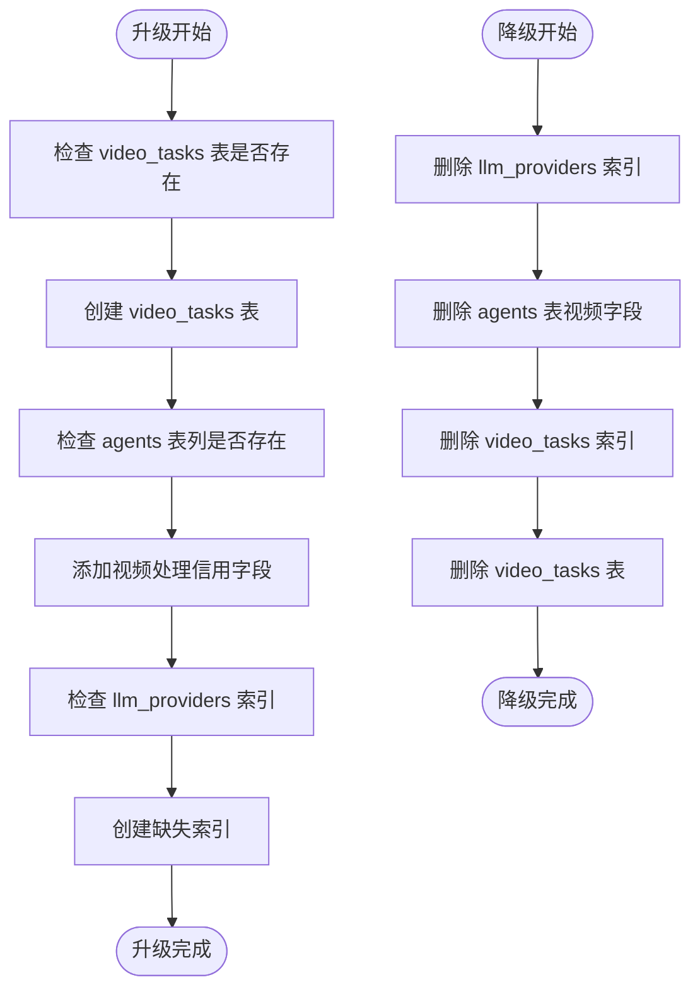
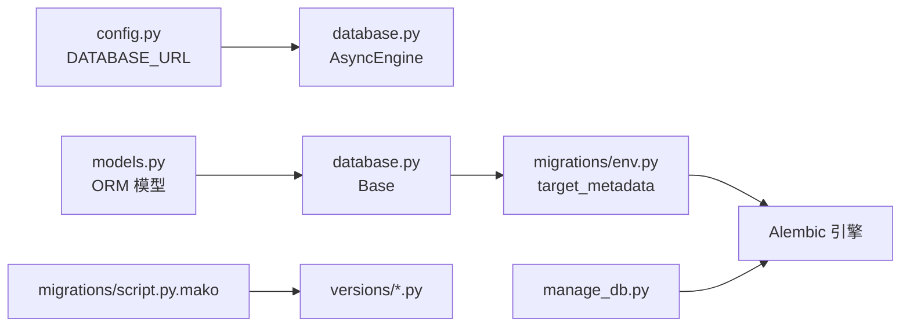

# 数据库迁移管理

<cite>
**本文档引用的文件**
- [backend/alembic.ini](file://backend/alembic.ini)
- [backend/migrations/env.py](file://backend/migrations/env.py)
- [backend/migrations/script.py.mako](file://backend/migrations/script.py.mako)
- [backend/migrations/README](file://backend/migrations/README)
- [backend/manage_db.py](file://backend/manage_db.py)
- [backend/models.py](file://backend/models.py)
- [backend/database.py](file://backend/database.py)
- [backend/config.py](file://backend/config.py)
- [backend/migrations/versions/14746eaf1c81_initial.py](file://backend/migrations/versions/14746eaf1c81_initial.py)
- [backend/migrations/versions/5f5b1c3da653_add_user_balance_frozen_status.py](file://backend/migrations/versions/5f5b1c3da653_add_user_balance_frozen_status.py)
- [backend/migrations/versions/7459f2d26782_add_video_tasks_and_video_agent_fields.py](file://backend/migrations/versions/7459f2d26782_add_video_tasks_and_video_agent_fields.py)
- [backend/migrations/versions/cc40fa02de06_migrate_credits_to_decimal_and_atomic_.py](file://backend/migrations/versions/cc40fa02de06_migrate_credits_to_decimal_and_atomic_.py)
- [backend/migrations/versions/a3b8c9d0e1f2_convert_ids_to_uuid.py](file://backend/migrations/versions/a3b8c9d0e1f2_convert_ids_to_uuid.py)
- [backend/migrations/versions/b5d7e2f8a1c3_player_to_user_auth.py](file://backend/migrations/versions/b5d7e2f8a1c3_player_to_user_auth.py)
- [backend/migrations/versions/c74e516c6d87_add_credit_billing_system.py](file://backend/migrations/versions/c74e516c6d87_add_credit_billing_system.py)
- [backend/migrations/versions/d221879c21d9_add_agent_type_and_prompt_templates.py](file://backend/migrations/versions/d221879c21d9_add_agent_type_and_prompt_templates.py)
- [backend/migrations/versions/l8m9n0o1p2q3_fix_chat_ids_uuid.py](file://backend/migrations/versions/l8m9n0o1p2q3_fix_chat_ids_uuid.py)
- [backend/migrations/versions/k7l8m9n0o1p2_fix_credit_transactions_nullable.py](file://backend/migrations/versions/k7l8m9n0o1p2_fix_credit_transactions_nullable.py)
- [backend/migrations/versions/h4i5j6k7l8m9_add_model_costs_and_subscriptions.py](file://backend/migrations/versions/h4i5j6k7l8m9_add_model_costs_and_subscriptions.py)
- [backend/migrations/versions/i5j6k7l8m9n0_split_user_admin_tables.py](file://backend/migrations/versions/i5j6k7l8m9n0_split_user_admin_tables.py)
- [backend/migrations/versions/j6k7l8m9n0o1_add_admin_credits_and_stats.py](file://backend/migrations/versions/j6k7l8m9n0o1_add_admin_credits_and_stats.py)
- [backend/migrations/versions/e1f2a3b4c5d6_add_gemini_config.py](file://backend/migrations/versions/e1f2a3b4c5d6_add_gemini_config.py)
</cite>

## 目录
1. [简介](#简介)
2. [项目结构](#项目结构)
3. [核心组件](#核心组件)
4. [架构总览](#架构总览)
5. [详细组件分析](#详细组件分析)
6. [依赖关系分析](#依赖关系分析)
7. [性能考量](#性能考量)
8. [故障排查指南](#故障排查指南)
9. [结论](#结论)
10. [附录](#附录)

## 简介
本文件系统性梳理本项目的数据库迁移管理体系，围绕 Alembic 迁移框架的配置与使用流程展开，重点覆盖：
- 迁移版本命名规范与版本链管理
- 变更记录与回滚策略
- 初始数据库结构（14746eaf1c81_initial.py）及后续版本演进
- 数据模型变更的自动化检测与迁移脚本生成机制
- 生产环境迁移的安全策略、备份恢复与版本控制最佳实践
- 迁移失败的诊断方法与手动修复指南

**更新** 新增视频任务表、UUID转换、原子信用交易等迁移功能，扩展了完整的数据库演进历程

## 项目结构
本项目采用单数据库、异步数据库 API 的 Alembic 配置，迁移脚本位于 migrations 目录，版本文件位于 versions 子目录。迁移执行通过 manage_db.py 提供的命令封装，底层由 Alembic 的 env.py 驱动。

**图表来源**
- [backend/alembic.ini:1-115](file://backend/alembic.ini#L1-L115)
- [backend/migrations/env.py:1-105](file://backend/migrations/env.py#L1-L105)
- [backend/migrations/script.py.mako:1-27](file://backend/migrations/script.py.mako#L1-L27)
- [backend/migrations/README:1-1](file://backend/migrations/README#L1-L1)
- [backend/manage_db.py:1-67](file://backend/manage_db.py#L1-L67)
- [backend/models.py:1-122](file://backend/models.py#L1-L122)
- [backend/database.py:1-31](file://backend/database.py#L1-L31)
- [backend/config.py:1-34](file://backend/config.py#L1-L34)
- [backend/migrations/versions/14746eaf1c81_initial.py:1-56](file://backend/migrations/versions/14746eaf1c81_initial.py#L1-L56)
- [backend/migrations/versions/5f5b1c3da653_add_user_balance_frozen_status.py:1-44](file://backend/migrations/versions/5f5b1c3da653_add_user_balance_frozen_status.py#L1-L44)
- [backend/migrations/versions/7459f2d26782_add_video_tasks_and_video_agent_fields.py:1-114](file://backend/migrations/versions/7459f2d26782_add_video_tasks_and_video_agent_fields.py#L1-L114)
- [backend/migrations/versions/cc40fa02de06_migrate_credits_to_decimal_and_atomic_.py:1-289](file://backend/migrations/versions/cc40fa02de06_migrate_credits_to_decimal_and_atomic_.py#L1-L289)
- [backend/migrations/versions/a3b8c9d0e1f2_convert_ids_to_uuid.py:1-327](file://backend/migrations/versions/a3b8c9d0e1f2_convert_ids_to_uuid.py#L1-L327)
- [backend/migrations/versions/b5d7e2f8a1c3_player_to_user_auth.py:1-150](file://backend/migrations/versions/b5d7e2f8a1c3_player_to_user_auth.py#L1-L150)
- [backend/migrations/versions/c74e516c6d87_add_credit_billing_system.py:1-67](file://backend/migrations/versions/c74e516c6d87_add_credit_billing_system.py#L1-L67)
- [backend/migrations/versions/d221879c21d9_add_agent_type_and_prompt_templates.py:1-149](file://backend/migrations/versions/d221879c21d9_add_agent_type_and_prompt_templates.py#L1-L149)
- [backend/migrations/versions/l8m9n0o1p2q3_fix_chat_ids_uuid.py:1-159](file://backend/migrations/versions/l8m9n0o1p2q3_fix_chat_ids_uuid.py#L1-L159)
- [backend/migrations/versions/k7l8m9n0o1p2_fix_credit_transactions_nullable.py:1-27](file://backend/migrations/versions/k7l8m9n0o1p2_fix_credit_transactions_nullable.py#L1-L27)
- [backend/migrations/versions/h4i5j6k7l8m9_add_model_costs_and_subscriptions.py:1-54](file://backend/migrations/versions/h4i5j6k7l8m9_add_model_costs_and_subscriptions.py#L1-L54)
- [backend/migrations/versions/i5j6k7l8m9n0_split_user_admin_tables.py:1-97](file://backend/migrations/versions/i5j6k7l8m9n0_split_user_admin_tables.py#L1-L97)
- [backend/migrations/versions/j6k7l8m9n0o1_add_admin_credits_and_stats.py:1-67](file://backend/migrations/versions/j6k7l8m9n0o1_add_admin_credits_and_stats.py#L1-L67)
- [backend/migrations/versions/e1f2a3b4c5d6_add_gemini_config.py:1-41](file://backend/migrations/versions/e1f2a3b4c5d6_add_gemini_config.py#L1-L41)

**章节来源**
- [backend/alembic.ini:1-115](file://backend/alembic.ini#L1-L115)
- [backend/migrations/env.py:1-105](file://backend/migrations/env.py#L1-L105)
- [backend/migrations/script.py.mako:1-27](file://backend/migrations/script.py.mako#L1-L27)
- [backend/migrations/README:1-1](file://backend/migrations/README#L1-L1)
- [backend/manage_db.py:1-67](file://backend/manage_db.py#L1-L67)
- [backend/models.py:1-122](file://backend/models.py#L1-L122)
- [backend/database.py:1-31](file://backend/database.py#L1-L31)
- [backend/config.py:1-34](file://backend/config.py#L1-L34)

## 核心组件
- Alembic 配置与模板
  - alembic.ini：定义脚本位置、路径前缀、版本位置分隔符、日志级别等；通过 sqlalchemy.url 提供数据库连接信息。
  - script.py.mako：迁移脚本模板，定义版本标识、上下文导入、upgrade/downgrade 函数占位。
- 迁移环境与元数据
  - env.py：加载配置 settings.DATABASE_URL，注册 Base.metadata，支持离线/在线两种迁移模式；启用批量渲染以兼容 SQLite 的 ALTER 限制。
- 迁移管理脚本
  - manage_db.py：封装 alembic 命令，提供 migrate/upgrade/downgrade 子命令，便于在 backend 目录内统一执行。
- 数据模型与引擎
  - models.py：定义 SQLAlchemy 模型，作为 Alembic 自动检测的目标元数据。
  - database.py：定义异步引擎与 Base，供 env.py 注册 target_metadata。
  - config.py：提供 DATABASE_URL，默认指向 SQLite 文件，支持通过 .env 覆盖。

**章节来源**
- [backend/alembic.ini:1-115](file://backend/alembic.ini#L1-L115)
- [backend/migrations/script.py.mako:1-27](file://backend/migrations/script.py.mako#L1-L27)
- [backend/migrations/env.py:1-105](file://backend/migrations/env.py#L1-L105)
- [backend/manage_db.py:1-67](file://backend/manage_db.py#L1-L67)
- [backend/models.py:1-122](file://backend/models.py#L1-L122)
- [backend/database.py:1-31](file://backend/database.py#L1-L31)
- [backend/config.py:1-34](file://backend/config.py#L1-L34)

## 架构总览
下图展示从模型变更到迁移应用的完整流程，包括 Alembic 自动检测、脚本生成、批量渲染与数据库应用。

**图表来源**
- [backend/manage_db.py:1-67](file://backend/manage_db.py#L1-L67)
- [backend/migrations/env.py:1-105](file://backend/migrations/env.py#L1-L105)
- [backend/alembic.ini:1-115](file://backend/alembic.ini#L1-L115)

## 详细组件分析

### 迁移版本命名规范与版本链
- 版本文件命名
  - 默认模板为 "%(rev)s_%(slug)s"，可通过配置项调整；当前仓库未启用带日期时间前缀的模板。
- 版本链管理
  - 每个版本文件包含 revision、down_revision、branch_labels、depends_on 等元信息，形成线性或分支链路。
  - 当前版本链：initial → add_user_balance_frozen_status → add_video_tasks_and_video_agent_fields → migrate_credits_to_decimal_and_atomic → convert_ids_to_uuid → player_to_user_auth → add_credit_billing_system → add_agent_type_and_prompt_templates → fix_chat_ids_uuid → fix_credit_transactions_nullable → add_model_costs_and_subscriptions → split_user_admin_tables → add_admin_credits_and_stats → add_gemini_config。
- 版本生成流程
  - 通过 manage_db.py 的 migrate 子命令触发 alembic revision --autogenerate，基于 models.py 的变更生成脚本。

**章节来源**
- [backend/alembic.ini:7-9](file://backend/alembic.ini#L7-L9)
- [backend/migrations/versions/14746eaf1c81_initial.py:1-56](file://backend/migrations/versions/14746eaf1c81_initial.py#L1-L56)
- [backend/migrations/versions/5f5b1c3da653_add_user_balance_frozen_status.py:1-44](file://backend/migrations/versions/5f5b1c3da653_add_user_balance_frozen_status.py#L1-L44)
- [backend/migrations/versions/7459f2d26782_add_video_tasks_and_video_agent_fields.py:1-114](file://backend/migrations/versions/7459f2d26782_add_video_tasks_and_video_agent_fields.py#L1-L114)
- [backend/migrations/versions/cc40fa02de06_migrate_credits_to_decimal_and_atomic_.py:1-289](file://backend/migrations/versions/cc40fa02de06_migrate_credits_to_decimal_and_atomic_.py#L1-L289)
- [backend/migrations/versions/a3b8c9d0e1f2_convert_ids_to_uuid.py:1-327](file://backend/migrations/versions/a3b8c9d0e1f2_convert_ids_to_uuid.py#L1-L327)
- [backend/migrations/versions/b5d7e2f8a1c3_player_to_user_auth.py:1-150](file://backend/migrations/versions/b5d7e2f8a1c3_player_to_user_auth.py#L1-L150)
- [backend/migrations/versions/c74e516c6d87_add_credit_billing_system.py:1-67](file://backend/migrations/versions/c74e516c6d87_add_credit_billing_system.py#L1-L67)
- [backend/migrations/versions/d221879c21d9_add_agent_type_and_prompt_templates.py:1-149](file://backend/migrations/versions/d221879c21d9_add_agent_type_and_prompt_templates.py#L1-L149)
- [backend/migrations/versions/l8m9n0o1p2q3_fix_chat_ids_uuid.py:1-159](file://backend/migrations/versions/l8m9n0o1p2q3_fix_chat_ids_uuid.py#L1-L159)
- [backend/migrations/versions/k7l8m9n0o1p2_fix_credit_transactions_nullable.py:1-27](file://backend/migrations/versions/k7l8m9n0o1p2_fix_credit_transactions_nullable.py#L1-L27)
- [backend/migrations/versions/h4i5j6k7l8m9_add_model_costs_and_subscriptions.py:1-54](file://backend/migrations/versions/h4i5j6k7l8m9_add_model_costs_and_subscriptions.py#L1-L54)
- [backend/migrations/versions/i5j6k7l8m9n0_split_user_admin_tables.py:1-97](file://backend/migrations/versions/i5j6k7l8m9n0_split_user_admin_tables.py#L1-L97)
- [backend/migrations/versions/j6k7l8m9n0o1_add_admin_credits_and_stats.py:1-67](file://backend/migrations/versions/j6k7l8m9n0o1_add_admin_credits_and_stats.py#L1-L67)
- [backend/migrations/versions/e1f2a3b4c5d6_add_gemini_config.py:1-41](file://backend/migrations/versions/e1f2a3b4c5d6_add_gemini_config.py#L1-L41)
- [backend/manage_db.py:20-28](file://backend/manage_db.py#L20-L28)

### 初始数据库结构与演进（14746eaf1c81_initial.py）
- 初始版本目标
  - 将 llm_providers 表的 tags 字段从 TEXT 改为 JSON，并保留默认值。
- 影响范围
  - 仅涉及单表单列变更，回滚时恢复为 TEXT 类型。
- 设计要点
  - 使用批量渲染以适配 SQLite 的 ALTER 限制。
  - 通过 op.batch_alter_table 安全地执行列类型转换。

**图表来源**
- [backend/migrations/versions/14746eaf1c81_initial.py:21-56](file://backend/migrations/versions/14746eaf1c81_initial.py#L21-L56)

**章节来源**
- [backend/migrations/versions/14746eaf1c81_initial.py:1-56](file://backend/migrations/versions/14746eaf1c81_initial.py#L1-L56)

### 用户余额冻结状态迁移（5f5b1c3da653_add_user_balance_frozen_status.py）
- 迁移目标
  - 为 users 表添加 is_balance_frozen 布尔字段，用于控制用户余额冻结状态。
- 实现细节
  - 使用批量渲染添加新列，设置默认值为 True。
  - 通过注释说明 SQLite 执行限制，采用服务器默认值策略。

**章节来源**
- [backend/migrations/versions/5f5b1c3da653_add_user_balance_frozen_status.py:1-44](file://backend/migrations/versions/5f5b1c3da653_add_user_balance_frozen_status.py#L1-L44)

### 视频任务与代理字段迁移（7459f2d26782_add_video_tasks_and_video_agent_fields.py）
- 迁移目标
  - 创建 video_tasks 表支持视频生成任务管理。
  - 为 agents 表添加视频处理相关的信用费率字段。
  - 为 llm_providers 表添加缺失的索引。
- 核心功能
  - video_tasks 表包含任务状态、输入输出参数、信用消耗等字段。
  - 代理视频处理字段：video_input_image_credit、video_input_second_credit、video_output_480p_credit、video_output_720p_credit。
  - 建立外键约束和复合索引提升查询性能。

**图表来源**
- [backend/migrations/versions/7459f2d26782_add_video_tasks_and_video_agent_fields.py:21-114](file://backend/migrations/versions/7459f2d26782_add_video_tasks_and_video_agent_fields.py#L21-L114)

**章节来源**
- [backend/migrations/versions/7459f2d26782_add_video_tasks_and_video_agent_fields.py:1-114](file://backend/migrations/versions/7459f2d26782_add_video_tasks_and_video_agent_fields.py#L1-L114)

### 信用系统迁移（cc40fa02de06_migrate_credits_to_decimal_and_atomic_.py）
- 迁移目标
  - 将用户和管理员的 credits 字段从 Float 迁移到 DECIMAL(18, 4)。
  - 重构 credit_transactions 表支持原子信用交易。
  - 创建 assets 表支持媒体资产管理。
- 核心特性
  - 支持精确的小数计算，避免浮点数精度问题。
  - 实现原子信用扣减，确保交易一致性。
  - 新增资产表支持图片、视频等多媒体资源管理。

**章节来源**
- [backend/migrations/versions/cc40fa02de06_migrate_credits_to_decimal_and_atomic_.py:1-289](file://backend/migrations/versions/cc40fa02de06_migrate_credits_to_decimal_and_atomic_.py#L1-L289)

### ID 类型转换为 UUID（a3b8c9d0e1f2_convert_ids_to_uuid.py）
- 迁移目标
  - 将 players、llm_providers、agents 等表的主键从整型转换为 UUID。
- 实现策略
  - 分步骤执行：数据读取 → 表删除 → 结构重建 → 数据重插入。
  - 按叶表优先顺序删除，确保外键完整性。
  - 使用批量渲染兼容 SQLite 的 ALTER 限制。

**图表来源**
- [backend/migrations/versions/a3b8c9d0e1f2_convert_ids_to_uuid.py:22-327](file://backend/migrations/versions/a3b8c9d0e1f2_convert_ids_to_uuid.py#L22-L327)

**章节来源**
- [backend/migrations/versions/a3b8c9d0e1f2_convert_ids_to_uuid.py:1-327](file://backend/migrations/versions/a3b8c9d0e1f2_convert_ids_to_uuid.py#L1-L327)

### 用户认证系统迁移（b5d7e2f8a1c3_player_to_user_auth.py）
- 迁移目标
  - 将 players 表替换为 users 表，引入完整的用户认证系统。
  - 添加密码哈希、角色权限、登录统计等字段。
- 核心功能
  - 支持邮箱注册和第三方登录（Google、GitHub）。
  - 实现用户角色分离，支持多租户架构。
  - 迁移现有玩家数据到新的用户结构。

**章节来源**
- [backend/migrations/versions/b5d7e2f8a1c3_player_to_user_auth.py:1-150](file://backend/migrations/versions/b5d7e2f8a1c3_player_to_user_auth.py#L1-L150)

### 信用计费系统迁移（c74e516c6d87_add_credit_billing_system.py）
- 迁移目标
  - 创建 credit_transactions 表支持完整的信用交易记录。
  - 为 agents 表添加输入输出信用费率字段。
  - 为 users 表添加 credits 余额字段。
- 功能特性
  - 记录每次信用交易的详细信息。
  - 支持按令牌数量和字符数计算费用。
  - 提供交易审计和统计功能。

**章节来源**
- [backend/migrations/versions/c74e516c6d87_add_credit_billing_system.py:1-67](file://backend/migrations/versions/c74e516c6d87_add_credit_billing_system.py#L1-L67)

### 代理类型与提示模板迁移（d221879c21d9_add_agent_type_and_prompt_templates.py）
- 迁移目标
  - 创建 prompt_templates 表支持提示词模板管理。
  - 为 agents 表添加 agent_type 字段。
  - 重构信用系统字段类型。
- 核心功能
  - 支持不同类型代理的专用提示模板。
  - 提供模板版本管理和默认模板设置。
  - 简化代理配置和部署流程。

**章节来源**
- [backend/migrations/versions/d221879c21d9_add_agent_type_and_prompt_templates.py:1-149](file://backend/migrations/versions/d221879c21d9_add_agent_type_and_prompt_templates.py#L1-L149)

### 聊天会话 UUID 修复迁移（l8m9n0o1p2q3_fix_chat_ids_uuid.py）
- 迁移目标
  - 将 chat_sessions 和 chat_messages 表的主键从整型转换为 UUID。
- 实现策略
  - 使用禁用外键约束的方式进行表重建。
  - 通过 Python 字典维护整型到 UUID 的映射关系。
  - 更新引用表中的外键值以保持数据完整性。

**章节来源**
- [backend/migrations/versions/l8m9n0o1p2q3_fix_chat_ids_uuid.py:1-159](file://backend/migrations/versions/l8m9n0o1p2q3_fix_chat_ids_uuid.py#L1-L159)

### 信用交易可空性修复（k7l8m9n0o1p2_fix_credit_transactions_nullable.py）
- 迁移目标
  - 修复 credit_transactions 表中 user_id 字段的可空性设置。
- 实现方式
  - 使用批量渲染的 recreate 模式强制重新创建表结构。
  - 解决 SQLite 对列属性修改的限制。

**章节来源**
- [backend/migrations/versions/k7l8m9n0o1p2_fix_credit_transactions_nullable.py:1-27](file://backend/migrations/versions/k7l8m9n0o1p2_fix_credit_transactions_nullable.py#L1-L27)

### 模型成本与订阅计划迁移（h4i5j6k7l8m9_add_model_costs_and_subscriptions.py）
- 迁移目标
  - 为 llm_providers 表添加 model_costs 字段。
  - 创建 subscription_plans 表支持订阅服务。
- 功能特性
  - 支持不同模型的成本定价。
  - 提供灵活的订阅计划管理。
  - 支持按月计费和信用充值。

**章节来源**
- [backend/migrations/versions/h4i5j6k7l8m9_add_model_costs_and_subscriptions.py:1-54](file://backend/migrations/versions/h4i5j6k7l8m9_add_model_costs_and_subscriptions.py#L1-L54)

### 用户与管理员表分离迁移（i5j6k7l8m9n0_split_user_admin_tables.py）
- 迁移目标
  - 将用户和管理员功能分离到独立的表结构。
  - 为用户表添加订阅相关字段。
- 架构改进
  - 实现清晰的职责分离。
  - 支持多层级权限管理。
  - 提供订阅状态跟踪功能。

**章节来源**
- [backend/migrations/versions/i5j6k7l8m9n0_split_user_admin_tables.py:1-97](file://backend/migrations/versions/i5j6k7l8m9n0_split_user_admin_tables.py#L1-L97)

### 管理员信用与统计迁移（j6k7l8m9n0o1_add_admin_credits_and_stats.py）
- 迁移目标
  - 为 admins 表添加统计和信用管理字段。
  - 为 credit_transactions 表添加 admin_id 字段。
  - 修复 chat_sessions 表的外键约束。
- 功能增强
  - 支持管理员级别的信用额度管理。
  - 提供详细的使用统计和审计功能。
  - 实现跨表的数据关联和查询优化。

**章节来源**
- [backend/migrations/versions/j6k7l8m9n0o1_add_admin_credits_and_stats.py:1-67](file://backend/migrations/versions/j6k7l8m9n0o1_add_admin_credits_and_stats.py#L1-L67)

### Gemini 配置迁移（e1f2a3b4c5d6_add_gemini_config.py）
- 迁移目标
  - 为 agents 表添加 gemini_config JSON 字段。
  - 迁移现有 thinking_mode 设置到新的配置格式。
- 技术升级
  - 支持 Gemini AI 的高级配置选项。
  - 提供更灵活的思维模式设置。
  - 保持向后兼容性。

**章节来源**
- [backend/migrations/versions/e1f2a3b4c5d6_add_gemini_config.py:1-41](file://backend/migrations/versions/e1f2a3b4c5d6_add_gemini_config.py#L1-L41)

### 数据模型变更的自动化检测与迁移生成机制
- 自动检测原理
  - env.py 注册 Base.metadata 为目标元数据，Alembic 在 autogenerate 模式下比较 models.py 的当前状态与历史版本，生成差异脚本。
- 生成流程
  - manage_db.py 调用 alembic revision --autogenerate -m "描述"，在 versions 目录生成新版本文件。
- 批量渲染与 SQLite 兼容
  - env.py 设置 render_as_batch=True，规避 SQLite 对复杂 ALTER 的限制，通过"建新表-复制数据-删旧表-改名"策略实现列类型变更与索引重建。

**章节来源**
- [backend/migrations/env.py:28-32](file://backend/migrations/env.py#L28-L32)
- [backend/migrations/env.py:67-71](file://backend/migrations/env.py#L67-L71)
- [backend/migrations/env.py:95-98](file://backend/migrations/env.py#L95-L98)
- [backend/migrations/script.py.mako:1-27](file://backend/migrations/script.py.mako#L1-L27)
- [backend/manage_db.py:20-28](file://backend/manage_db.py#L20-L28)

### 迁移执行与回滚策略
- 执行入口
  - manage_db.py 提供 upgrade 与 downgrade 子命令，分别对应 alembic upgrade head 与 alembic downgrade -1。
- 回滚策略
  - 对于非破坏性版本（如 initial、add_user_balance_frozen_status、add_video_tasks_and_video_agent_fields），可安全回滚至上一版本。
  - 对于破坏性版本（如 convert_ids_to_uuid、fix_chat_ids_uuid），回滚会删除并重建为整型 ID 结构，UUID 数据无法映射回原整数，需谨慎评估风险。
  - 对于信用系统迁移，支持精确的类型转换和数据迁移。

**章节来源**
- [backend/manage_db.py:30-38](file://backend/manage_db.py#L30-L38)
- [backend/migrations/versions/a3b8c9d0e1f2_convert_ids_to_uuid.py:223-327](file://backend/migrations/versions/a3b8c9d0e1f2_convert_ids_to_uuid.py#L223-L327)
- [backend/migrations/versions/l8m9n0o1p2q3_fix_chat_ids_uuid.py:151-159](file://backend/migrations/versions/l8m9n0o1p2q3_fix_chat_ids_uuid.py#L151-L159)

## 依赖关系分析
- 配置与引擎
  - config.py 提供 DATABASE_URL，database.py 基于该 URL 创建异步引擎，env.py 通过 settings.DATABASE_URL 获取连接字符串。
- 模型与元数据
  - models.py 定义 ORM 模型，database.py 的 Base 作为元数据基类；env.py 注册 Base.metadata 供 Alembic 比较。
- 迁移脚本与模板
  - script.py.mako 为版本脚本模板，versions 下的每个版本文件遵循该模板结构。
- 环境与执行
  - env.py 决定迁移模式（离线/在线）、批量渲染与连接生命周期；manage_db.py 作为用户入口封装命令。

**图表来源**
- [backend/config.py:15-16](file://backend/config.py#L15-L16)
- [backend/database.py:1-31](file://backend/database.py#L1-L31)
- [backend/models.py:1-122](file://backend/models.py#L1-L122)
- [backend/migrations/env.py:32-40](file://backend/migrations/env.py#L32-L40)
- [backend/migrations/script.py.mako:1-27](file://backend/migrations/script.py.mako#L1-L27)
- [backend/manage_db.py:1-67](file://backend/manage_db.py#L1-L67)

**章节来源**
- [backend/config.py:1-34](file://backend/config.py#L1-L34)
- [backend/database.py:1-31](file://backend/database.py#L1-L31)
- [backend/models.py:1-122](file://backend/models.py#L1-L122)
- [backend/migrations/env.py:1-105](file://backend/migrations/env.py#L1-L105)
- [backend/migrations/script.py.mako:1-27](file://backend/migrations/script.py.mako#L1-L27)
- [backend/manage_db.py:1-67](file://backend/manage_db.py#L1-L67)

## 性能考量
- 连接池与异步引擎
  - database.py 使用异步引擎，配置 pool_pre_ping、pool_size、max_overflow，提升连接稳定性与吞吐能力。
- 批量渲染与 SQLite 兼容
  - env.py 启用 render_as_batch=True，规避 SQLite 的 ALTER 限制，但大批量数据复制会带来额外 IO 与时间成本，建议在低频窗口执行。
- 索引与外键
  - 新增表与字段时应同步建立必要索引，避免迁移后查询性能下降；外键约束有助于数据一致性，但需注意级联删除/更新策略。
- UUID 性能影响
  - UUID 主键相比整型 ID 占用更多存储空间，但提供更好的分布式安全性。
  - 建议为 UUID 字段建立适当的索引以优化查询性能。

**章节来源**
- [backend/database.py:8-23](file://backend/database.py#L8-L23)
- [backend/migrations/env.py:67-71](file://backend/migrations/env.py#L67-L71)
- [backend/migrations/versions/7459f2d26782_add_video_tasks_and_video_agent_fields.py:56-82](file://backend/migrations/versions/7459f2d26782_add_video_tasks_and_video_agent_fields.py#L56-L82)
- [backend/migrations/versions/a3b8c9d0e1f2_convert_ids_to_uuid.py:107-130](file://backend/migrations/versions/a3b8c9d0e1f2_convert_ids_to_uuid.py#L107-L130)

## 故障排查指南
- 常见问题与处理
  - 目标数据库未更新：执行 upgrade 以应用所有未应用的迁移。
  - SQLite 限制：复杂 ALTER 可能失败，建议检查生成脚本是否使用批量渲染；避免删除列、修改列约束等高风险操作。
  - 多人协作冲突：出现多个 head 版本时，手动调整 down_revision 指向，或将内容合并为单一链路。
  - UUID 迁移失败：检查是否有残留的临时表，清理后重新执行迁移。
  - 信用系统异常：验证 DECIMAL 精度设置，确保小数点后四位的精度要求。
- 迁移失败诊断步骤
  - 检查 manage_db.py 输出与 Alembic 日志级别；确认 DATABASE_URL 是否正确。
  - 审核生成的版本文件，确认 upgrade/downgrade 逻辑符合预期。
  - 对于破坏性迁移（如 UUID 转换），先在测试环境验证，再制定回滚方案。
  - 检查版本链的完整性，确保所有前置依赖都已正确应用。
- 手动修复建议
  - 若自动检测遗漏字段或类型变更，可在版本文件中手动补充 op.batch_alter_table 或 op.create_table/op.drop_table。
  - 对于 UUID 转换等破坏性操作，若回滚不可逆，需准备数据导出/导入流程以保障业务连续性。
  - 对于信用系统迁移，确保数据库支持 DECIMAL(18,4) 类型，SQLite 可能需要特殊处理。

**章节来源**
- [backend/manage_db.py:10-18](file://backend/manage_db.py#L10-L18)
- [backend/migrations/versions/a3b8c9d0e1f2_convert_ids_to_uuid.py:223-327](file://backend/migrations/versions/a3b8c9d0e1f2_convert_ids_to_uuid.py#L223-L327)
- [backend/migrations/versions/cc40fa02de06_migrate_credits_to_decimal_and_atomic_.py:21-31](file://backend/migrations/versions/cc40fa02de06_migrate_credits_to_decimal_and_atomic_.py#L21-L31)

## 结论
本项目基于 Alembic 实现了完整的数据库迁移体系：通过 manage_db.py 封装命令、env.py 注册元数据与批量渲染、以及明确的版本链管理，实现了从模型变更到数据库应用的自动化与可追溯性。当前版本链涵盖了从基础表结构到完整用户认证、信用计费、视频处理、订阅管理等核心功能的演进历程。

对于 SQLite 环境，批量渲染有效规避了 ALTER 限制；对于破坏性变更（如 UUID 转换），需严格评估风险并制定回滚与数据迁移策略。新增的视频任务表、原子信用交易、管理员分离等功能显著提升了系统的功能完整性和可扩展性。

建议在团队内统一迁移规范、加强版本审查与测试，确保生产环境的稳定与安全。特别要注意信用系统的精度要求和 UUID 迁移的完整性和一致性。

## 附录
- 命令参考
  - 生成迁移：在 backend 目录执行 python manage_db.py migrate "描述"
  - 应用迁移：python manage_db.py upgrade
  - 回滚迁移：python manage_db.py downgrade
- 版本文件位置
  - backend/migrations/versions/
- 配置文件
  - backend/alembic.ini
  - backend/config.py（DATABASE_URL）
- 版本链总结
  - 初始基础结构 → 用户余额冻结 → 视频任务支持 → 信用系统重构 → UUID 转换 → 用户认证 → 信用计费 → 代理管理 → 聊天会话修复 → 订阅系统 → 管理员分离 → 统计功能 → Gemini 配置

**章节来源**
- [backend/manage_db.py:40-67](file://backend/manage_db.py#L40-L67)
- [backend/alembic.ini:1-115](file://backend/alembic.ini#L1-L115)
- [backend/config.py:15-16](file://backend/config.py#L15-L16)