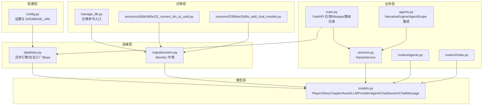
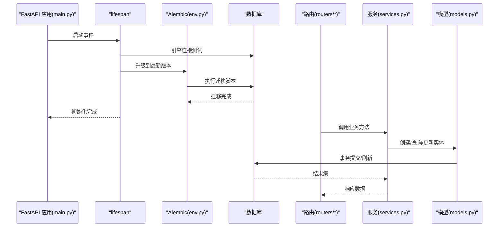
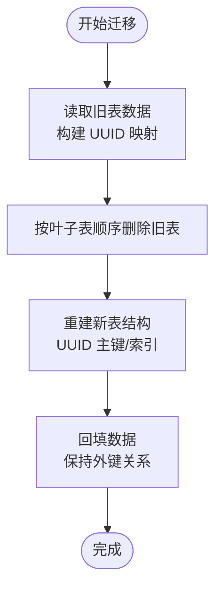
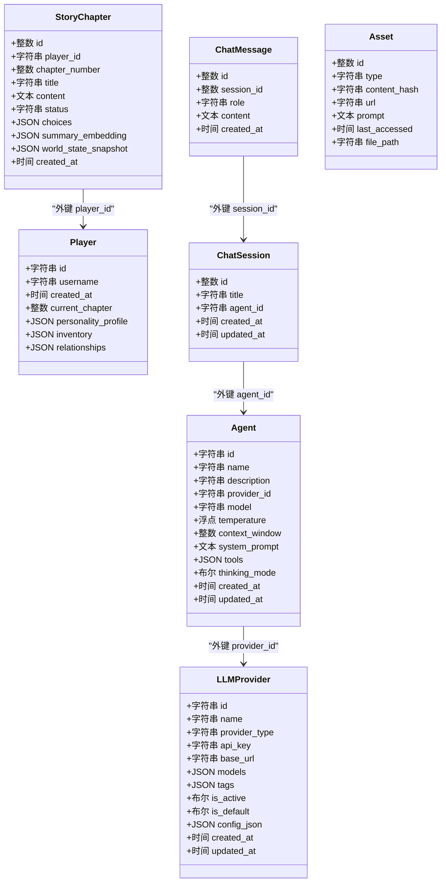
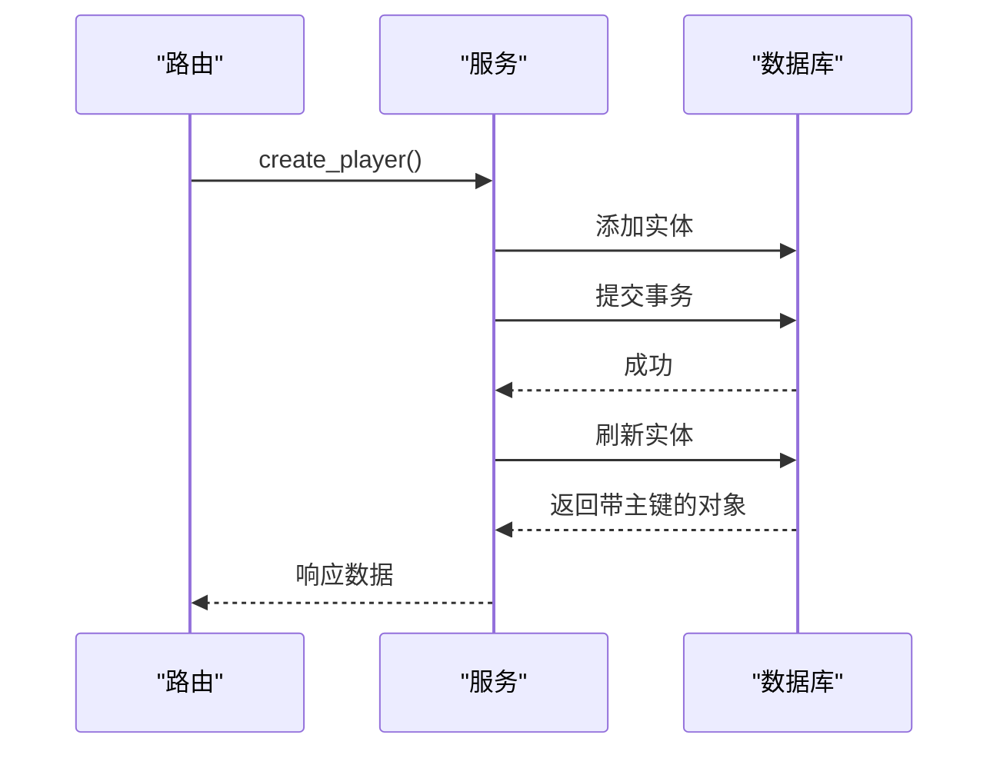
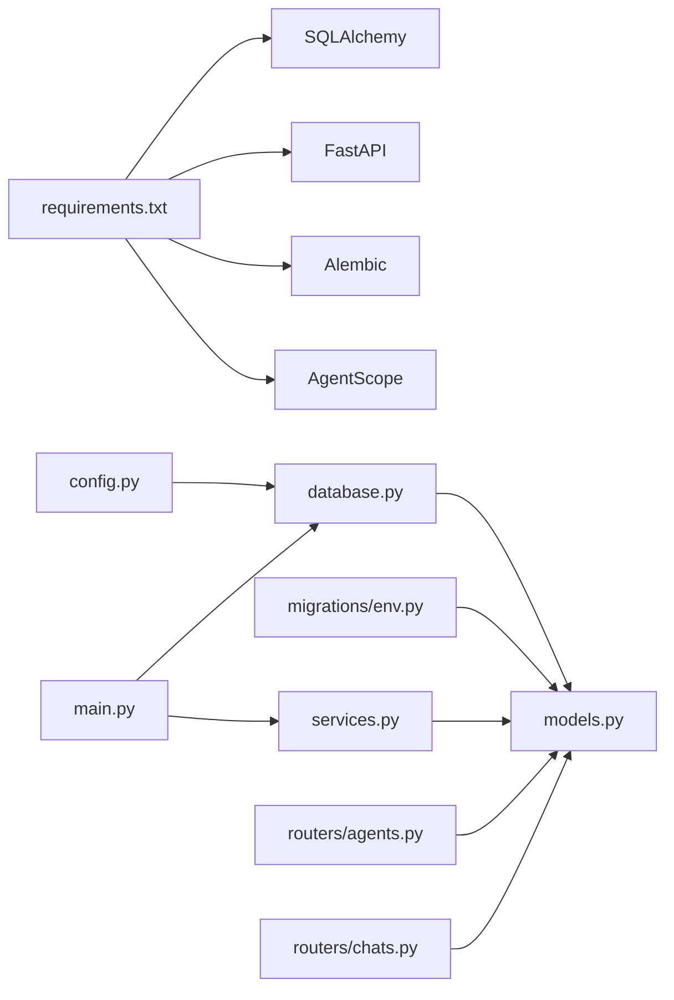

# 数据模型概览

<cite>
**本文档引用的文件**
- [backend/models.py](file://backend/models.py)
- [backend/database.py](file://backend/database.py)
- [backend/config.py](file://backend/config.py)
- [backend/main.py](file://backend/main.py)
- [backend/manage_db.py](file://backend/manage_db.py)
- [backend/migrations/env.py](file://backend/migrations/env.py)
- [backend/migrations/versions/a3b8c9d0e1f2_convert_ids_to_uuid.py](file://backend/migrations/versions/a3b8c9d0e1f2_convert_ids_to_uuid.py)
- [backend/migrations/versions/f1580ee10d5e_add_chat_models.py](file://backend/migrations/versions/f1580ee10d5e_add_chat_models.py)
- [backend/routers/agents.py](file://backend/routers/agents.py)
- [backend/routers/chats.py](file://backend/routers/chats.py)
- [backend/services.py](file://backend/services.py)
- [backend/agents.py](file://backend/agents.py)
- [backend/requirements.txt](file://backend/requirements.txt)
</cite>

## 目录
1. [简介](#简介)
2. [项目结构](#项目结构)
3. [核心组件](#核心组件)
4. [架构总览](#架构总览)
5. [详细组件分析](#详细组件分析)
6. [依赖关系分析](#依赖关系分析)
7. [性能考虑](#性能考虑)
8. [故障排除指南](#故障排除指南)
9. [结论](#结论)
10. [附录](#附录)

## 简介
本文件面向数据模型与数据库层，系统性阐述以下内容：
- 整体设计理念：以异步 SQLAlchemy ORM 为核心，采用 UUID 主键统一标识，结合 Alembic 迁移管理演进。
- ORM 映射策略：统一的 Declarative 基类、表名与索引策略、字段约束与默认值规范。
- 模型层次与关系：玩家、章节、资产、LLM 提供商、代理、聊天会话与消息之间的外键与依赖关系。
- 连接配置、会话管理与事务处理：异步引擎、连接池、依赖注入式会话、提交与刷新流程。
- 元数据与命名规范：表名映射、索引策略、字段约束与时间戳管理。
- 使用示例与最佳实践：路由层调用、服务层封装、迁移工具链。

## 项目结构
后端采用分层组织：配置层（设置与数据库 URL）、连接层（异步引擎与会话工厂）、模型层（ORM 定义）、迁移层（Alembic 版本化管理）、业务层（服务与路由）。

图表来源
- [backend/config.py](file://backend/config.py#L1-L34)
- [backend/database.py](file://backend/database.py#L1-L31)
- [backend/migrations/env.py](file://backend/migrations/env.py#L1-L105)
- [backend/models.py](file://backend/models.py#L1-L122)
- [backend/main.py](file://backend/main.py#L1-L173)
- [backend/services.py](file://backend/services.py#L1-L66)
- [backend/routers/agents.py](file://backend/routers/agents.py#L1-L141)
- [backend/routers/chats.py](file://backend/routers/chats.py#L1-L275)
- [backend/agents.py](file://backend/agents.py#L1-L196)
- [backend/manage_db.py](file://backend/manage_db.py#L1-L67)
- [backend/migrations/versions/a3b8c9d0e1f2_convert_ids_to_uuid.py](file://backend/migrations/versions/a3b8c9d0e1f2_convert_ids_to_uuid.py#L1-L327)
- [backend/migrations/versions/f1580ee10d5e_add_chat_models.py](file://backend/migrations/versions/f1580ee10d5e_add_chat_models.py#L1-L63)

章节来源
- [backend/config.py](file://backend/config.py#L1-L34)
- [backend/database.py](file://backend/database.py#L1-L31)
- [backend/migrations/env.py](file://backend/migrations/env.py#L1-L105)
- [backend/models.py](file://backend/models.py#L1-L122)
- [backend/main.py](file://backend/main.py#L1-L173)

## 核心组件
- 异步数据库引擎与会话
  - 使用异步引擎与会话工厂，支持连接池与自动重连；SQLite 在特定条件下禁用多线程检查。
  - 提供依赖注入式会话生成器，确保路由与服务层按需获取会话。
- 统一的 ORM 基类
  - 所有模型继承自同一 Declarative Base，保证元数据一致与迁移扫描范围。
- 模型定义与字段规范
  - 主键策略：UUID 字符串主键用于核心实体，整型主键用于中间/从属表。
  - 索引策略：主键列与常用查询列建立索引；JSON 字段用于去重与缓存。
  - 时间戳：统一使用服务器默认时间与更新时间回调。
  - 外键约束：通过 ForeignKey 明确关联关系，确保参照完整性。
- 迁移与版本管理
  - Alembic 环境读取配置与模型元数据，支持离线与在线迁移。
  - 迁移脚本记录演进历史，包含 UUID 主键转换与聊天模型添加等关键步骤。

章节来源
- [backend/database.py](file://backend/database.py#L1-L31)
- [backend/models.py](file://backend/models.py#L1-L122)
- [backend/migrations/env.py](file://backend/migrations/env.py#L1-L105)

## 架构总览
下图展示应用启动时的数据库生命周期与迁移执行流程，以及模型与路由/服务层的交互。

图表来源
- [backend/main.py](file://backend/main.py#L45-L81)
- [backend/migrations/env.py](file://backend/migrations/env.py#L74-L104)
- [backend/models.py](file://backend/models.py#L1-L122)
- [backend/services.py](file://backend/services.py#L1-L66)

## 详细组件分析

### SQLAlchemy 基础模型设计原则
- 统一基类与元数据
  - 所有模型继承自同一 Base 类，确保 Alembic 可扫描到全部模型。
- 表名映射
  - 模型通过 __tablename__ 显式声明表名，遵循复数形式与清晰语义。
- 字段约束与默认值
  - 主键：UUID 字符串或整型，部分表启用索引。
  - 唯一约束：用户名、提供商名称等关键字段唯一。
  - JSON 字段：用于存储动态结构（如配置、关系、快照），便于扩展。
  - 时间戳：创建与更新时间使用服务器默认值与更新回调。
- 外键关系
  - 明确的外键指向父表主键，保证引用一致性。

章节来源
- [backend/models.py](file://backend/models.py#L1-L122)

### UUID 主键生成机制与索引策略
- UUID 生成
  - 通过辅助函数生成 UUID 字符串作为主键，默认值直接赋给主键列。
- 索引策略
  - 主键列自动建立索引；常用查询列（如用户名、提供商名称、会话 ID）建立索引。
  - JSON 字段用于内容哈希与缓存，避免重复存储。
- 迁移中的 UUID 转换
  - 迁移脚本读取现有整型 ID，生成新 UUID 映射，重建表结构并回填数据，同时维护外键关系。

图表来源
- [backend/migrations/versions/a3b8c9d0e1f2_convert_ids_to_uuid.py](file://backend/migrations/versions/a3b8c9d0e1f2_convert_ids_to_uuid.py#L22-L221)

章节来源
- [backend/models.py](file://backend/models.py#L6-L7)
- [backend/migrations/versions/a3b8c9d0e1f2_convert_ids_to_uuid.py](file://backend/migrations/versions/a3b8c9d0e1f2_convert_ids_to_uuid.py#L1-L327)

### 数据模型层次结构与继承关系
- 实体层次
  - 根实体：Player、LLMProvider、Agent
  - 关联实体：StoryChapter（属于 Player）、ChatSession（属于 Agent）、ChatMessage（属于 ChatSession）
  - 辅助实体：Asset（资源缓存）
- 关系图

图表来源
- [backend/models.py](file://backend/models.py#L9-L122)

章节来源
- [backend/models.py](file://backend/models.py#L1-L122)

### 数据库连接配置、会话管理与事务处理
- 连接配置
  - 通过配置模块读取 DATABASE_URL，支持 SQLite 与 PostgreSQL。
  - 异步引擎参数：连接池大小、溢出连接、连接前校验、SQLite 线程限制。
- 会话管理
  - 会话工厂绑定引擎，支持依赖注入；关闭提交行为由框架控制。
- 事务处理
  - 服务层在创建实体后执行提交与刷新，确保返回持久化后的对象。
  - 路由层在长耗时任务中使用独立会话，避免阻塞主请求会话。

图表来源
- [backend/routers/agents.py](file://backend/routers/agents.py#L15-L55)
- [backend/services.py](file://backend/services.py#L12-L17)
- [backend/database.py](file://backend/database.py#L28-L31)

章节来源
- [backend/config.py](file://backend/config.py#L1-L34)
- [backend/database.py](file://backend/database.py#L1-L31)
- [backend/services.py](file://backend/services.py#L1-L66)
- [backend/routers/agents.py](file://backend/routers/agents.py#L1-L141)

### 模型元数据、表名映射与字段约束规范
- 元数据扫描
  - Alembic 环境导入 Base 与 models，扫描所有模型元数据进行迁移。
- 表名与索引
  - 表名统一为复数形式；索引覆盖主键与常用过滤/排序列。
- 字段约束
  - 唯一性：用户名、提供商名称。
  - 可空性：部分字段允许为空（如提供商基础地址）。
  - 默认值：JSON 字段默认空结构；时间戳默认服务器时间。
- 时间戳管理
  - 创建时间使用服务器默认值；更新时间使用更新回调。

章节来源
- [backend/migrations/env.py](file://backend/migrations/env.py#L15-L32)
- [backend/models.py](file://backend/models.py#L1-L122)

### 使用示例与最佳实践
- 创建玩家
  - 路由接收用户名，服务层创建 Player 实体并提交，返回带 UUID 的对象。
- 初始化故事世界
  - 服务层调用叙事引擎生成章节内容，保存到 StoryChapter 并提交。
- 聊天会话与消息流式响应
  - 路由创建会话与用户消息，流式调用 LLM 提供商生成回复，最后保存助手消息。
- 迁移管理
  - 使用迁移工具创建、升级与降级版本，确保数据库结构与模型同步。

章节来源
- [backend/routers/agents.py](file://backend/routers/agents.py#L15-L55)
- [backend/services.py](file://backend/services.py#L19-L59)
- [backend/routers/chats.py](file://backend/routers/chats.py#L72-L258)
- [backend/manage_db.py](file://backend/manage_db.py#L20-L63)

## 依赖关系分析
- 外部依赖
  - SQLAlchemy 2.x、Pydantic、FastAPI、Alembic、AgentScope 等。
- 内部依赖
  - 配置 → 引擎 → 模型 → 路由/服务 → 迁移环境。
- 循环依赖规避
  - 迁移环境延迟导入模型，避免循环导入；路由与服务通过依赖注入解耦。

图表来源
- [backend/requirements.txt](file://backend/requirements.txt#L1-L20)
- [backend/config.py](file://backend/config.py#L1-L34)
- [backend/database.py](file://backend/database.py#L1-L31)
- [backend/migrations/env.py](file://backend/migrations/env.py#L12-L17)
- [backend/models.py](file://backend/models.py#L1-L122)
- [backend/main.py](file://backend/main.py#L37-L40)
- [backend/services.py](file://backend/services.py#L1-L66)
- [backend/routers/agents.py](file://backend/routers/agents.py#L1-L8)
- [backend/routers/chats.py](file://backend/routers/chats.py#L1-L12)

章节来源
- [backend/requirements.txt](file://backend/requirements.txt#L1-L20)
- [backend/migrations/env.py](file://backend/migrations/env.py#L12-L17)

## 性能考虑
- 连接池与自动重连
  - 合理设置连接池大小与溢出数量，提升并发吞吐；开启连接前校验降低无效连接。
- 索引优化
  - 对主键与高频查询列建立索引；避免对大文本字段建立索引。
- 异步 I/O
  - 使用异步引擎与会话，减少阻塞；长耗时操作使用独立会话避免阻塞主线程。
- JSON 字段
  - 控制 JSON 字段大小与复杂度，必要时拆分为单独表或使用向量索引。

## 故障排除指南
- 迁移失败
  - 检查 Alembic 环境是否正确导入模型与配置；确认数据库 URL 可访问。
- 连接异常
  - 核对连接池参数与数据库类型；SQLite 场景注意线程限制。
- 会话未提交
  - 确保在服务层执行提交与刷新；路由层长任务使用独立会话。
- UUID 转换问题
  - 检查迁移脚本映射与外键关系；确认回填数据完整性。

章节来源
- [backend/migrations/env.py](file://backend/migrations/env.py#L39-L104)
- [backend/database.py](file://backend/database.py#L8-L23)
- [backend/services.py](file://backend/services.py#L14-L17)
- [backend/routers/chats.py](file://backend/routers/chats.py#L237-L257)

## 结论
本项目以异步 SQLAlchemy ORM 为基础，采用 UUID 主键统一标识与 Alembic 迁移管理，建立了清晰的模型层次与外键关系。通过依赖注入式会话与严格的字段约束规范，实现了可扩展、可维护的数据层架构。配合路由与服务层的最佳实践，能够稳定支撑叙事驱动的交互式游戏场景。

## 附录
- 快速参考
  - 数据库 URL：来自配置模块，支持 SQLite 与 PostgreSQL。
  - 引擎参数：连接池、溢出、连接前校验、SQLite 线程限制。
  - 迁移命令：创建、升级、降级版本。
  - 模型字段：主键、唯一、JSON、时间戳、外键。

章节来源
- [backend/config.py](file://backend/config.py#L15-L16)
- [backend/database.py](file://backend/database.py#L8-L23)
- [backend/manage_db.py](file://backend/manage_db.py#L20-L63)
- [backend/models.py](file://backend/models.py#L1-L122)