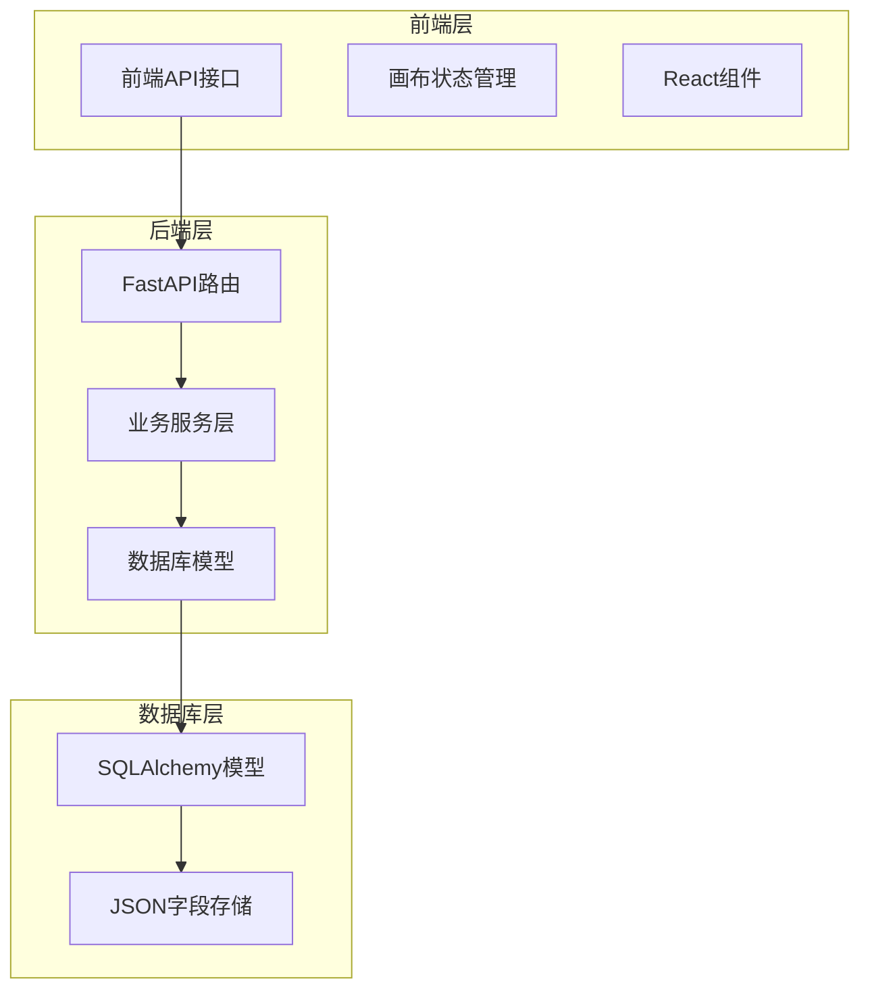
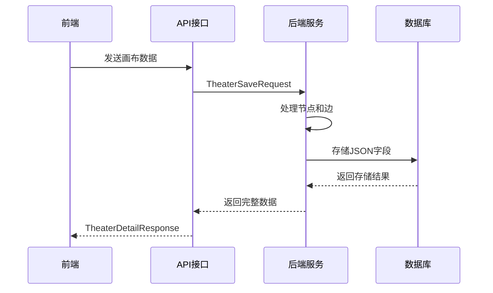
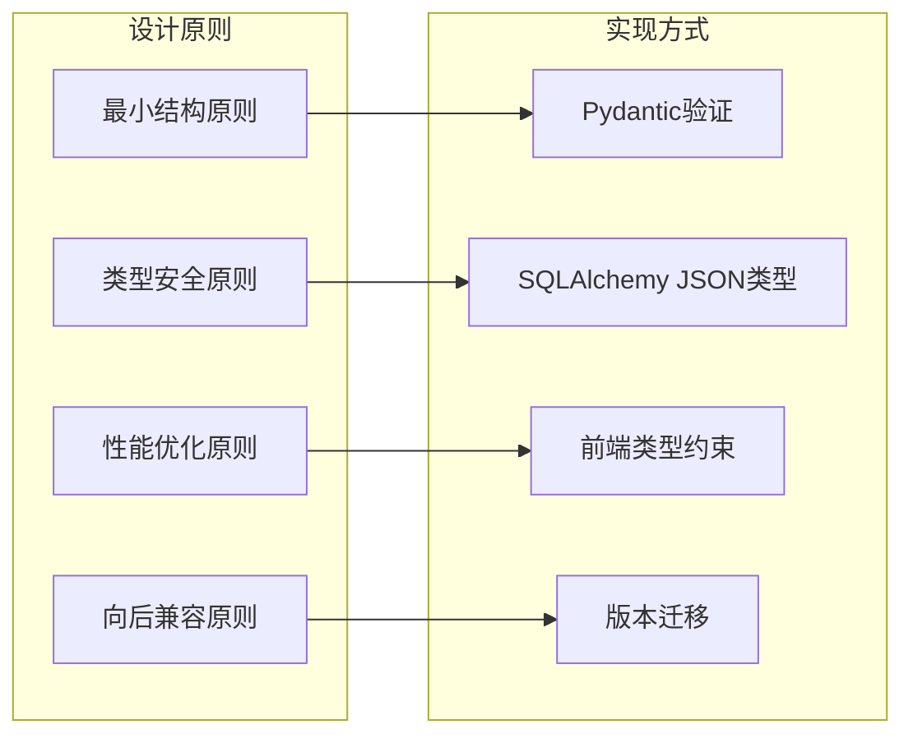
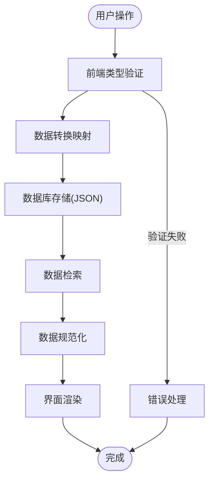
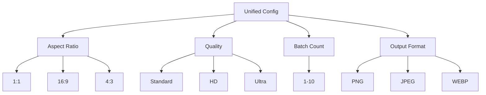
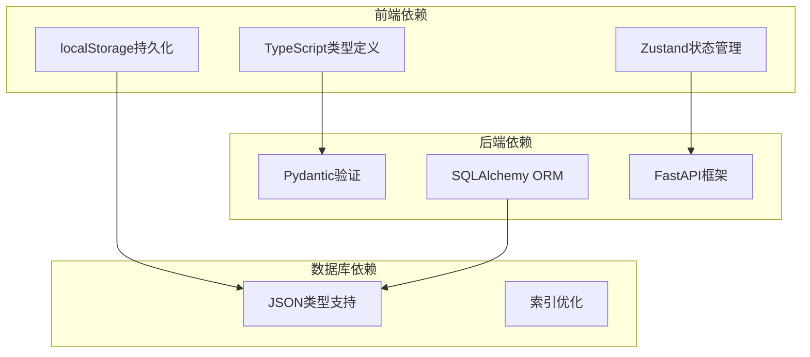
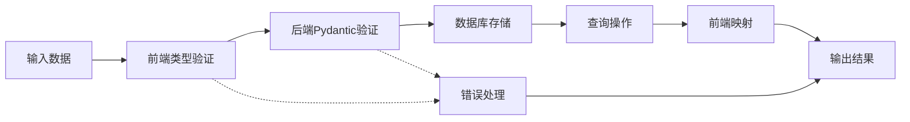
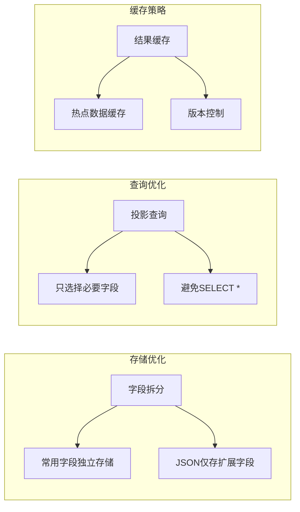

# JSON字段设计

<cite>
**本文档引用的文件**
- [models.py](file://backend/models.py)
- [schemas.py](file://backend/schemas.py)
- [theaterApi.ts](file://frontend/src/lib/theaterApi.ts)
- [useCanvasStore.ts](file://frontend/src/store/useCanvasStore.ts)
- [theaters.py](file://backend/routers/theaters.py)
- [theater.py](file://backend/services/theater.py)
</cite>

## 目录
1. [简介](#简介)
2. [项目结构](#项目结构)
3. [核心组件](#核心组件)
4. [架构概览](#架构概览)
5. [详细组件分析](#详细组件分析)
6. [依赖分析](#依赖分析)
7. [性能考虑](#性能考虑)
8. [故障排除指南](#故障排除指南)
9. [结论](#结论)

## 简介

Infinite Game项目中的JSON字段设计是一个关键的架构决策，它为系统的扩展性和灵活性提供了基础。本文档深入分析了canvas_viewport、settings、data、config_json等JSON字段在各个实体中的使用场景和数据结构设计，解释了JSON字段的查询限制和性能考虑，并阐述了动态配置和扩展性设计的原则。

## 项目结构

项目采用前后端分离的架构设计，JSON字段主要分布在以下层次：

**图表来源**
- [models.py:75-130](file://backend/models.py#L75-L130)
- [theaters.py:14-110](file://backend/routers/theaters.py#L14-L110)

**章节来源**
- [models.py:1-447](file://backend/models.py#L1-L447)
- [schemas.py:1-859](file://backend/schemas.py#L1-L859)

## 核心组件

### JSON字段实体分布

系统中JSON字段主要分布在以下实体中：

| 实体名称 | JSON字段 | 数据类型 | 描述 |
|---------|---------|---------|------|
| Theater | canvas_viewport | JSON | 画布视口配置，包含{x, y, zoom} |
| Theater | settings | JSON | 剧场级别扩展配置 |
| TheaterNode | data | JSON | 节点业务数据，如title、content、imageUrl等 |
| TheaterEdge | style | JSON | 边样式配置 |
| LLMProvider | config_json | JSON | 提供商额外配置 |
| Agent | image_config | JSON | 统一图像生成配置 |
| PromptTemplate | output_schema | JSON | 输出格式定义 |
| PromptTemplate | variables_schema | JSON | 变量定义说明 |

**章节来源**
- [models.py:75-130](file://backend/models.py#L75-L130)
- [models.py:146-170](file://backend/models.py#L146-L170)
- [models.py:196-253](file://backend/models.py#L196-L253)
- [models.py:332-367](file://backend/models.py#L332-L367)

### 前后端数据映射

**图表来源**
- [theaterApi.ts:82-101](file://frontend/src/lib/theaterApi.ts#L82-L101)
- [theaters.py:84-99](file://backend/routers/theaters.py#L84-L99)
- [theater.py:108-229](file://backend/services/theater.py#L108-L229)

## 架构概览

### JSON字段设计原则

系统采用"结构化存储 + 动态扩展"的设计理念：

### 数据流架构

**图表来源**
- [schemas.py:694-800](file://backend/schemas.py#L694-L800)
- [useCanvasStore.ts:170-183](file://frontend/src/store/useCanvasStore.ts#L170-L183)

## 详细组件分析

### Theater实体的JSON字段设计

#### canvas_viewport字段

canvas_viewport字段用于存储画布的视口状态，是用户界面交互的重要数据载体。

**数据结构定义**：
- 类型：JSON对象
- 默认值：空对象{}
- 必要字段：x(number)、y(number)、zoom(number)

**前端使用场景**：
- 画布缩放和平移状态
- 用户界面布局记忆
- 分享和恢复画布状态

**后端存储策略**：
- 直接存储原始JSON对象
- 不进行字段级验证（保持灵活性）
- 支持增量更新

**章节来源**
- [models.py:85](file://backend/models.py#L85)
- [schemas.py:770](file://backend/schemas.py#L770)
- [useCanvasStore.ts:176](file://frontend/src/store/useCanvasStore.ts#L176)

#### settings字段

settings字段提供剧场级别的扩展配置能力，支持动态功能开关和参数调整。

**设计特点**：
- 完全动态的键值对结构
- 支持任意深度嵌套
- 无固定schema限制
- 便于功能渐进式发布

**典型应用场景**：
- 实验性功能开关
- 用户偏好设置
- 系统配置参数
- A/B测试配置

**章节来源**
- [models.py:86](file://backend/models.py#L86)
- [schemas.py:771](file://backend/schemas.py#L771)

### TheaterNode实体的data字段

#### 数据结构设计

data字段是节点业务数据的核心容器，支持不同类型节点的特定数据需求。

**通用字段**：
- title(string): 节点标题
- content(text): 节点内容
- imageUrl(string): 图片URL

**类型特定字段**：
- Script节点：scriptContent、tags、duration
- Character节点：personality、appearance、dialogueStyle
- Storyboard节点：sceneDescription、cameraAngle、lighting
- Video节点：videoUrl、duration、quality

**章节来源**
- [models.py:105](file://backend/models.py#L105)
- [schemas.py:704](file://backend/schemas.py#L704)

### TheaterEdge实体的style字段

#### 样式配置系统

style字段提供边的视觉样式配置，支持复杂的图形渲染需求。

**样式属性**：
- stroke(string): 边的颜色
- strokeWidth(number): 边的宽度
- dashPattern(array): 虚线模式
- arrowHead(boolean): 是否显示箭头
- curvature(number): 曲率系数

**动态样式支持**：
- 基于节点状态的样式变化
- 连接关系的视觉反馈
- 动画效果配置

**章节来源**
- [models.py:126](file://backend/models.py#L126)
- [schemas.py:745](file://backend/schemas.py#L745)

### LLMProvider实体的config_json字段

#### 外部系统集成

config_json字段为第三方AI提供商提供灵活的配置接口。

**配置结构**：
- api_key(string): API密钥
- base_url(string): API基础URL
- timeout(number): 请求超时时间
- headers(object): 自定义请求头
- rate_limit(object): 速率限制配置

**扩展性设计**：
- 支持任意提供商特定配置
- 无需修改数据库结构即可添加新配置项
- 便于提供商切换和迁移

**章节来源**
- [models.py:163](file://backend/models.py#L163)
- [schemas.py:135](file://backend/schemas.py#L135)

### Agent实体的image_config字段

#### 统一配置抽象

image_config字段提供跨提供商的统一图像生成配置。

**配置层次**：

**图表来源**
- [models.py:246](file://backend/models.py#L246)
- [schemas.py:220](file://backend/schemas.py#L220)

## 依赖分析

### 前后端依赖关系

**图表来源**
- [useCanvasStore.ts:511-538](file://frontend/src/store/useCanvasStore.ts#L511-L538)
- [models.py:1-4](file://backend/models.py#L1-L4)

### 数据一致性保证

系统通过多层次的验证机制确保JSON数据的一致性和完整性：

**图表来源**
- [schemas.py:694-800](file://backend/schemas.py#L694-L800)
- [theaterApi.ts:107-159](file://frontend/src/lib/theaterApi.ts#L107-L159)

**章节来源**
- [theater.py:108-229](file://backend/services/theater.py#L108-L229)
- [models.py:75-130](file://backend/models.py#L75-L130)

## 性能考虑

### 查询限制和优化

#### JSON字段查询限制

由于JSON字段的动态性质，系统在查询时面临以下限制：

1. **索引限制**：JSON字段无法直接建立传统索引
2. **查询复杂度**：复杂JSON查询可能导致性能问题
3. **存储开销**：重复的JSON结构增加存储空间

#### 性能优化策略

**章节来源**
- [theater.py:46-60](file://backend/services/theater.py#L46-L60)
- [theater.py:108-229](file://backend/services/theater.py#L108-L229)

### 缓存和持久化

系统采用多层次的缓存策略来优化JSON字段的访问性能：

1. **前端缓存**：使用localStorage存储画布状态
2. **后端缓存**：数据库层面的查询结果缓存
3. **CDN缓存**：静态资源和配置文件缓存

**章节来源**
- [useCanvasStore.ts:511-538](file://frontend/src/store/useCanvasStore.ts#L511-L538)

## 故障排除指南

### 常见JSON字段问题

#### 数据类型不匹配

**问题表现**：
- 前端类型验证失败
- 后端Pydantic验证异常
- 数据库存储错误

**解决方案**：
1. 检查前后端类型定义是否一致
2. 验证JSON字段的结构完整性
3. 实施数据迁移脚本

#### 数据完整性问题

**问题表现**：
- JSON字段为空或null
- 结构不完整导致功能异常
- 数据丢失或损坏

**解决方案**：
1. 实施默认值策略
2. 添加数据验证规则
3. 建立数据备份机制

#### 性能问题诊断

**诊断步骤**：
1. 监控JSON字段的查询频率
2. 分析数据库存储大小
3. 评估前端渲染性能

**优化建议**：
1. 实施字段拆分策略
2. 添加适当的索引
3. 优化查询语句

**章节来源**
- [schemas.py:1-800](file://backend/schemas.py#L1-L800)
- [useCanvasStore.ts:507-510](file://frontend/src/store/useCanvasStore.ts#L507-L510)

## 结论

Infinite Game项目的JSON字段设计体现了现代Web应用对灵活性和扩展性的需求。通过合理的架构设计和严格的验证机制，系统在保持高度灵活性的同时，也确保了数据的一致性和系统的稳定性。

### 设计优势

1. **高度灵活性**：JSON字段支持动态扩展，无需频繁修改数据库结构
2. **强类型保障**：前后端双重类型验证确保数据质量
3. **性能优化**：多层次缓存和查询优化策略
4. **向后兼容**：版本化的数据结构设计

### 最佳实践总结

1. **明确字段职责**：区分必需字段和可选字段
2. **实施验证机制**：前后端双重验证确保数据完整性
3. **优化查询性能**：合理使用索引和缓存策略
4. **版本化管理**：为JSON字段提供版本控制机制
5. **错误处理**：建立完善的错误处理和恢复机制

通过遵循这些原则和实践，Infinite Game项目成功地实现了JSON字段的高效管理和使用，为未来的功能扩展奠定了坚实的基础。