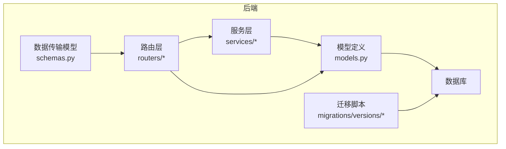
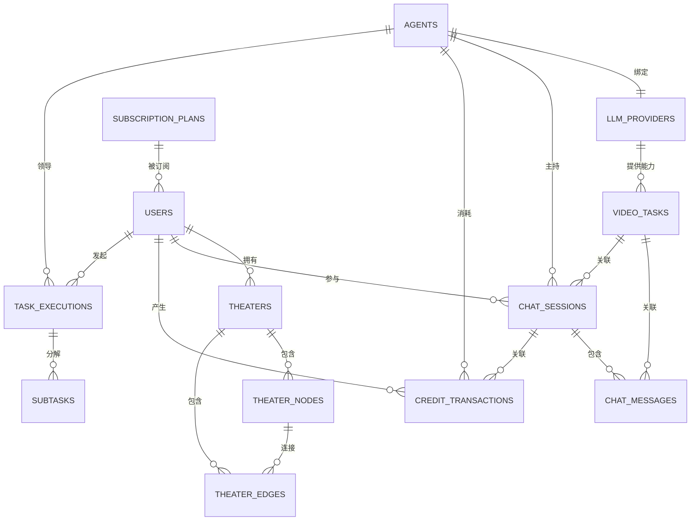
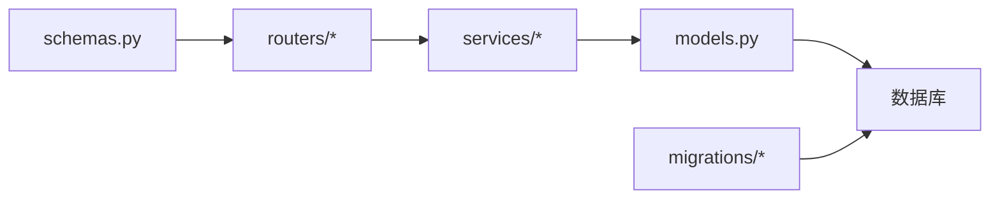

# 实体关系映射

<cite>
**本文引用的文件**
- [models.py](file://backend/models.py)
- [database.py](file://backend/database.py)
- [migrations/versions/a3b8c9d0e1f2_convert_ids_to_uuid.py](file://backend/migrations/versions/a3b8c9d0e1f2_convert_ids_to_uuid.py)
- [migrations/versions/c74e516c6d87_add_credit_billing_system.py](file://backend/migrations/versions/c74e516c6d87_add_credit_billing_system.py)
- [migrations/versions/d8e9f0a1b2c3_add_multi_agent_collaboration.py](file://backend/migrations/versions/d8e9f0a1b2c3_add_multi_agent_collaboration.py)
- [migrations/versions/i5j6k7l8m9n0_split_user_admin_tables.py](file://backend/migrations/versions/i5j6k7l8m9n0_split_user_admin_tables.py)
- [routers/agents.py](file://backend/routers/agents.py)
- [routers/chats.py](file://backend/routers/chats.py)
- [routers/theaters.py](file://backend/routers/theaters.py)
- [services/theater.py](file://backend/services/theater.py)
- [schemas.py](file://backend/schemas.py)
</cite>

## 目录
1. [简介](#简介)
2. [项目结构](#项目结构)
3. [核心组件](#核心组件)
4. [架构总览](#架构总览)
5. [详细组件分析](#详细组件分析)
6. [依赖分析](#依赖分析)
7. [性能考虑](#性能考虑)
8. [故障排查指南](#故障排查指南)
9. [结论](#结论)
10. [附录](#附录)

## 简介
本文件面向 Infinite Game 的数据库实体关系映射，系统性梳理各实体之间的关系设计（一对一、一对多、多对多）、外键约束与业务逻辑、复合主键与唯一约束、级联删除/更新策略，并结合迁移脚本与路由/服务层代码，给出关系图与 ER 图，以及关系查询最佳实践与性能优化建议。目标是帮助开发者与产品/运维人员快速理解数据模型与业务耦合点，指导后续扩展与维护。

## 项目结构
后端采用 SQLAlchemy ORM + FastAPI，数据库连接通过异步引擎管理；模型定义集中在 models.py，迁移脚本位于 migrations/versions 下，路由层负责对外暴露 API 并调用服务层，服务层封装业务逻辑并操作数据库。



图表来源
- [models.py:1-447](file://backend/models.py#L1-L447)
- [database.py:1-31](file://backend/database.py#L1-L31)
- [migrations/versions/a3b8c9d0e1f2_convert_ids_to_uuid.py:1-335](file://backend/migrations/versions/a3b8c9d0e1f2_convert_ids_to_uuid.py#L1-L335)

章节来源
- [models.py:1-447](file://backend/models.py#L1-L447)
- [database.py:1-31](file://backend/database.py#L1-L31)

## 核心组件
- 用户与管理员：用户表与管理员表分离，便于权限与审计区分。
- 智能体与供应商：智能体绑定供应商与模型，支持多供应商接入。
- 剧场与画布：剧场承载用户创作的“画布”，画布由节点与边组成，支持复制、全量同步。
- 会话与消息：聊天会话与消息表，支持多模态内容与工具调用。
- 订阅与计费：订阅计划、积分交易与多智能体协作任务执行。
- 视频任务：异步视频生成任务追踪与计费。

章节来源
- [models.py:10-447](file://backend/models.py#L10-L447)
- [schemas.py:1-859](file://backend/schemas.py#L1-L859)

## 架构总览
下图展示核心实体与关系，标注主键、外键、唯一约束与级联策略。



图表来源
- [models.py:35-447](file://backend/models.py#L35-L447)

## 详细组件分析

### 用户(User)与管理员(Admin)
- 设计要点
  - 主键：UUID 字符串
  - 唯一约束：邮箱唯一
  - 分离设计：用户与管理员表分离，便于权限与审计区分
- 业务逻辑
  - 用户具备订阅状态、积分余额、登录统计等
  - 管理员具备权限等级、登录统计等
- 级联策略
  - 无直接外键约束，删除用户不影响管理员，反之亦然
- 关系图

```mermaid
classDiagram
class User {
+id : String
+email : String
+nickname : String
+password_hash : String
+role : String
+is_active : Boolean
+is_balance_frozen : Boolean
+subscription_plan_id : String
+subscription_status : String
+subscription_start_at : DateTime
+subscription_end_at : DateTime
+credits : Float
+register_ip : String
+last_login_at : DateTime
+last_login_ip : String
+total_input_tokens : BigInteger
+total_output_tokens : BigInteger
+total_input_chars : BigInteger
+total_output_chars : BigInteger
+created_at : DateTime
+updated_at : DateTime
}
class Admin {
+id : String
+email : String
+nickname : String
+password_hash : String
+permission_level : String
+is_active : Boolean
+credits : Float
+total_input_tokens : BigInteger
+total_output_tokens : BigInteger
+total_input_chars : BigInteger
+total_output_chars : BigInteger
+last_login_at : DateTime
+last_login_ip : String
+created_at : DateTime
+updated_at : DateTime
}
class SubscriptionPlan {
+id : String
+name : String
+description : Text
+price_usd : Float
+credits : Float
+billing_period : String
+features : JSON
+is_active : Boolean
+sort_order : Integer
+created_at : DateTime
+updated_at : DateTime
}
User ||--o{ SubscriptionPlan : "订阅"
```

图表来源
- [models.py:35-100](file://backend/models.py#L35-L100)
- [models.py:369-389](file://backend/models.py#L369-L389)

章节来源
- [models.py:35-100](file://backend/models.py#L35-L100)
- [models.py:369-389](file://backend/models.py#L369-L389)
- [migrations/versions/i5j6k7l8m9n0_split_user_admin_tables.py:21-97](file://backend/migrations/versions/i5j6k7l8m9n0_split_user_admin_tables.py#L21-L97)

### 剧场(Theater)与画布节点/边
- 设计要点
  - 主键：UUID 字符串
  - 外键：user_id 指向 users.id
  - 级联删除：节点与边均定义 ondelete="CASCADE"，删除剧场时级联删除其节点与边
- 业务逻辑
  - 剧场作为用户创作的容器，包含画布视口、设置、节点计数等
  - 节点与边构成画布拓扑，支持复制、全量同步
- 关系图

```mermaid
classDiagram
class Theater {
+id : String
+user_id : String
+title : String
+description : Text
+thumbnail_url : String
+status : String
+canvas_viewport : JSON
+settings : JSON
+node_count : Integer
+created_at : DateTime
+updated_at : DateTime
}
class TheaterNode {
+id : String
+theater_id : String
+node_type : String
+position_x : Float
+position_y : Float
+width : Float
+height : Float
+z_index : Integer
+data : JSON
+created_by_agent_id : String
+created_at : DateTime
+updated_at : DateTime
}
class TheaterEdge {
+id : String
+theater_id : String
+source_node_id : String
+target_node_id : String
+source_handle : String
+target_handle : String
+edge_type : String
+animated : Boolean
+style : JSON
+created_at : DateTime
}
Theater "1" --o{ TheaterNode : "包含"
Theater "1" --o{ TheaterEdge : "包含"
TheaterNode "1" --o{ TheaterEdge : "连接"
```

图表来源
- [models.py:75-130](file://backend/models.py#L75-L130)

章节来源
- [models.py:75-130](file://backend/models.py#L75-L130)
- [services/theater.py:108-229](file://backend/services/theater.py#L108-L229)
- [routers/theaters.py:78-81](file://backend/routers/theaters.py#L78-L81)

### 智能体(Agent)与供应商(LLMProvider)
- 设计要点
  - 主键：UUID 字符串
  - 外键：provider_id 指向 llm_providers.id
  - 唯一约束：name 唯一
- 业务逻辑
  - 智能体绑定供应商与模型，支持多模态、图像生成、视频生成等定价
  - 提供统一图像配置与供应商特定配置
- 关系图

```mermaid
classDiagram
class LLMProvider {
+id : String
+name : String
+provider_type : String
+api_key : String
+base_url : String
+models : JSON
+tags : JSON
+is_active : Boolean
+is_default : Boolean
+config_json : JSON
+model_costs : JSON
+created_at : DateTime
+updated_at : DateTime
}
class Agent {
+id : String
+name : String
+description : String
+provider_id : String
+model : String
+agent_type : String
+temperature : Float
+context_window : Integer
+system_prompt : Text
+tools : JSON
+thinking_mode : Boolean
+input_credit_per_1m : Float
+output_credit_per_1m : Float
+image_output_credit_per_1m : Float
+search_credit_per_query : Float
+video_input_image_credit : Float
+video_input_second_credit : Float
+video_output_480p_credit : Float
+video_output_720p_credit : Float
+is_leader : Boolean
+coordination_modes : JSON
+member_agent_ids : JSON
+max_subtasks : Integer
+enable_auto_review : Boolean
+gemini_config : JSON
+xai_image_config : JSON
+image_credit_per_image : Float
+image_config : JSON
+target_node_types : JSON
+created_at : DateTime
+updated_at : DateTime
}
LLMProvider "1" --o{ Agent : "提供"
```

图表来源
- [models.py:146-253](file://backend/models.py#L146-L253)

章节来源
- [models.py:146-253](file://backend/models.py#L146-L253)
- [routers/agents.py:16-64](file://backend/routers/agents.py#L16-L64)

### 会话(ChatSession)与消息(ChatMessage)
- 设计要点
  - 主键：UUID 字符串
  - 外键：agent_id 指向 agents.id；user_id 可为空（管理员会话）
  - 外键：theater_id 指向 theaters.id（可选）
- 业务逻辑
  - 会话承载一次或多轮对话，消息支持多模态内容与工具调用
  - 支持多智能体协作模式下的消息流式输出与计费
- 关系图

```mermaid
classDiagram
class ChatSession {
+id : String
+title : String
+agent_id : String
+user_id : String
+theater_id : String
+created_at : DateTime
+updated_at : DateTime
}
class ChatMessage {
+id : String
+session_id : String
+role : String
+content : Text
+created_at : DateTime
}
ChatSession "1" --o{ ChatMessage : "包含"
```

图表来源
- [models.py:172-195](file://backend/models.py#L172-L195)

章节来源
- [models.py:172-195](file://backend/models.py#L172-L195)
- [routers/chats.py:100-121](file://backend/routers/chats.py#L100-L121)

### 订阅计划(SubscriptionPlan)与用户
- 设计要点
  - 主键：UUID 字符串
  - 唯一约束：name 唯一
  - 外键：users.subscription_plan_id 指向 subscription_plans.id
- 业务逻辑
  - 用户可订阅套餐，获得积分包与有效期
- 关系图

```mermaid
classDiagram
class SubscriptionPlan {
+id : String
+name : String
+description : Text
+price_usd : Float
+credits : Float
+billing_period : String
+features : JSON
+is_active : Boolean
+sort_order : Integer
+created_at : DateTime
+updated_at : DateTime
}
class User {
+id : String
+email : String
+nickname : String
+password_hash : String
+role : String
+is_active : Boolean
+is_balance_frozen : Boolean
+subscription_plan_id : String
+subscription_status : String
+subscription_start_at : DateTime
+subscription_end_at : DateTime
+credits : Float
+register_ip : String
+last_login_at : DateTime
+last_login_ip : String
+total_input_tokens : BigInteger
+total_output_tokens : BigInteger
+total_input_chars : BigInteger
+total_output_chars : BigInteger
+created_at : DateTime
+updated_at : DateTime
}
SubscriptionPlan "1" --o{ User : "被订阅"
```

图表来源
- [models.py:369-389](file://backend/models.py#L369-L389)
- [models.py:54-58](file://backend/models.py#L54-L58)

章节来源
- [models.py:369-389](file://backend/models.py#L369-L389)
- [models.py:54-58](file://backend/models.py#L54-L58)
- [migrations/versions/i5j6k7l8m9n0_split_user_admin_tables.py:48-74](file://backend/migrations/versions/i5j6k7l8m9n0_split_user_admin_tables.py#L48-L74)

### 多智能体协作(TaskExecution/SubTask)
- 设计要点
  - 主键：UUID 字符串
  - 外键：leader_agent_id 指向 agents.id；user_id 指向 users.id；session_id 指向 chat_sessions.id
  - 子任务支持父子关系（parent_subtask_id）
- 业务逻辑
  - 领导者智能体协调多个成员智能体完成复杂任务
- 关系图

```mermaid
classDiagram
class TaskExecution {
+id : String
+leader_agent_id : String
+user_id : String
+session_id : String
+task_description : Text
+coordination_mode : String
+status : String
+result : JSON
+total_input_tokens : Integer
+total_output_tokens : Integer
+total_credit_cost : Float
+execution_metadata : JSON
+created_at : DateTime
+completed_at : DateTime
}
class SubTask {
+id : String
+task_execution_id : String
+agent_id : String
+parent_subtask_id : String
+description : Text
+order_index : Integer
+status : String
+input_data : JSON
+output_data : JSON
+input_tokens : Integer
+output_tokens : Integer
+credit_cost : Float
+retry_count : Integer
+error_message : Text
+created_at : DateTime
+completed_at : DateTime
}
class Agent {
+id : String
+name : String
+description : String
+provider_id : String
+model : String
+agent_type : String
+is_leader : Boolean
+member_agent_ids : JSON
+created_at : DateTime
+updated_at : DateTime
}
class User {
+id : String
+email : String
+nickname : String
+password_hash : String
+role : String
+is_active : Boolean
+is_balance_frozen : Boolean
+credits : Float
+created_at : DateTime
+updated_at : DateTime
}
TaskExecution "1" --o{ SubTask : "分解"
Agent "1" --o{ TaskExecution : "领导"
User "1" --o{ TaskExecution : "发起"
```

图表来源
- [models.py:283-330](file://backend/models.py#L283-L330)
- [models.py:196-253](file://backend/models.py#L196-L253)

章节来源
- [models.py:283-330](file://backend/models.py#L283-L330)
- [models.py:196-253](file://backend/models.py#L196-L253)
- [migrations/versions/d8e9f0a1b2c3_add_multi_agent_collaboration.py:21-104](file://backend/migrations/versions/d8e9f0a1b2c3_add_multi_agent_collaboration.py#L21-L104)

### 计费与积分(CreditTransaction)
- 设计要点
  - 主键：UUID 字符串
  - 外键：user_id 指向 users.id；admin_id 指向 admins.id；agent_id 指向 agents.id；session_id 指向 chat_sessions.id
  - 业务字段：交易类型、金额、余额前后、token 统计、元数据
- 业务逻辑
  - 记录用户/管理员与智能体交互产生的积分变动，支持原子扣费
- 关系图

```mermaid
classDiagram
class CreditTransaction {
+id : String
+user_id : String
+admin_id : String
+agent_id : String
+session_id : String
+transaction_type : String
+amount : Float
+balance_before : Float
+balance_after : Float
+input_tokens : Integer
+output_tokens : Integer
+metadata_json : JSON
+description : Text
+created_at : DateTime
}
class User {
+id : String
+email : String
+nickname : String
+password_hash : String
+role : String
+is_active : Boolean
+is_balance_frozen : Boolean
+credits : Float
+created_at : DateTime
+updated_at : DateTime
}
class Admin {
+id : String
+email : String
+nickname : String
+password_hash : String
+permission_level : String
+is_active : Boolean
+credits : Float
+created_at : DateTime
+updated_at : DateTime
}
class Agent {
+id : String
+name : String
+description : String
+provider_id : String
+model : String
+created_at : DateTime
+updated_at : DateTime
}
class ChatSession {
+id : String
+title : String
+agent_id : String
+user_id : String
+theater_id : String
+created_at : DateTime
+updated_at : DateTime
}
User "1" --o{ CreditTransaction : "产生"
Admin "1" --o{ CreditTransaction : "产生"
Agent "1" --o{ CreditTransaction : "消耗"
ChatSession "1" --o{ CreditTransaction : "关联"
```

图表来源
- [models.py:261-281](file://backend/models.py#L261-L281)
- [models.py:35-100](file://backend/models.py#L35-L100)
- [models.py:10-33](file://backend/models.py#L10-L33)
- [models.py:172-183](file://backend/models.py#L172-L183)

章节来源
- [models.py:261-281](file://backend/models.py#L261-L281)
- [migrations/versions/c74e516c6d87_add_credit_billing_system.py:21-67](file://backend/migrations/versions/c74e516c6d87_add_credit_billing_system.py#L21-L67)

### 视频任务(VideoTask)
- 设计要点
  - 主键：UUID 字符串
  - 外键：session_id 指向 chat_sessions.id；message_id 指向 chat_messages.id；provider_id 指向 llm_providers.id
  - 业务字段：视频模式、提示词、输入图片、时长、质量、计费统计
- 业务逻辑
  - 异步视频生成任务追踪，支持文本到视频、图片到视频、编辑模式
- 关系图

```mermaid
classDiagram
class VideoTask {
+id : String
+xai_task_id : String
+session_id : String
+message_id : String
+provider_id : String
+model : String
+user_id : String
+video_mode : String
+prompt : Text
+image_url : String
+duration : Integer
+quality : String
+aspect_ratio : String
+mode : String
+status : String
+result_video_url : String
+error_message : Text
+input_image_count : Integer
+output_duration_seconds : Float
+credit_cost : Float
+created_at : DateTime
+completed_at : DateTime
}
class ChatSession {
+id : String
+title : String
+agent_id : String
+user_id : String
+theater_id : String
+created_at : DateTime
+updated_at : DateTime
}
class ChatMessage {
+id : String
+session_id : String
+role : String
+content : Text
+created_at : DateTime
}
class LLMProvider {
+id : String
+name : String
+provider_type : String
+api_key : String
+base_url : String
+models : JSON
+tags : JSON
+is_active : Boolean
+is_default : Boolean
+config_json : JSON
+model_costs : JSON
+created_at : DateTime
+updated_at : DateTime
}
ChatSession "1" --o{ VideoTask : "关联"
ChatMessage "1" --o{ VideoTask : "关联"
LLMProvider "1" --o{ VideoTask : "提供"
```

图表来源
- [models.py:391-422](file://backend/models.py#L391-L422)
- [models.py:172-195](file://backend/models.py#L172-L195)
- [models.py:146-170](file://backend/models.py#L146-L170)

章节来源
- [models.py:391-422](file://backend/models.py#L391-L422)
- [migrations/versions/7459f2d26782_add_video_tasks_and_video_agent_fields.py:1-200](file://backend/migrations/versions/7459f2d26782_add_video_tasks_and_video_agent_fields.py#L1-L200)

### ID 设计与迁移演进
- UUID 主键迁移
  - 从整型 ID 迁移到 UUID 字符串 ID，提升分布式安全性与可移植性
  - 迁移脚本包含数据映射与重建流程
- 计费系统迁移
  - 新增积分交易表，为智能体与用户消费建立统一账本
- 多智能体协作迁移
  - 新增任务执行与子任务表，支持领导者模式
- 用户/管理员分离迁移
  - 将管理员从用户表中拆分，保留角色字段兼容

章节来源
- [migrations/versions/a3b8c9d0e1f2_convert_ids_to_uuid.py:22-235](file://backend/migrations/versions/a3b8c9d0e1f2_convert_ids_to_uuid.py#L22-L235)
- [migrations/versions/c74e516c6d87_add_credit_billing_system.py:21-67](file://backend/migrations/versions/c74e516c6d87_add_credit_billing_system.py#L21-L67)
- [migrations/versions/d8e9f0a1b2c3_add_multi_agent_collaboration.py:21-104](file://backend/migrations/versions/d8e9f0a1b2c3_add_multi_agent_collaboration.py#L21-L104)
- [migrations/versions/i5j6k7l8m9n0_split_user_admin_tables.py:21-97](file://backend/migrations/versions/i5j6k7l8m9n0_split_user_admin_tables.py#L21-L97)

## 依赖分析
- 路由层依赖服务层与模型层，服务层封装业务并操作数据库
- 模型层定义实体与关系，迁移脚本确保数据库结构演进
- 计费与多智能体协作通过服务层与路由层协同实现



图表来源
- [routers/agents.py:1-151](file://backend/routers/agents.py#L1-L151)
- [routers/chats.py:1-807](file://backend/routers/chats.py#L1-L807)
- [routers/theaters.py:1-110](file://backend/routers/theaters.py#L1-L110)
- [services/theater.py:1-285](file://backend/services/theater.py#L1-L285)
- [models.py:1-447](file://backend/models.py#L1-L447)
- [schemas.py:1-859](file://backend/schemas.py#L1-L859)

章节来源
- [routers/agents.py:1-151](file://backend/routers/agents.py#L1-L151)
- [routers/chats.py:1-807](file://backend/routers/chats.py#L1-L807)
- [routers/theaters.py:1-110](file://backend/routers/theaters.py#L1-L110)
- [services/theater.py:1-285](file://backend/services/theater.py#L1-L285)
- [models.py:1-447](file://backend/models.py#L1-L447)
- [schemas.py:1-859](file://backend/schemas.py#L1-L859)

## 性能考虑
- 索引与查询
  - 在常用过滤字段上建立索引（如 users.email、theaters.user_id、chat_sessions.agent_id、video_tasks.user_id 等）
  - 对于高并发写入场景，使用异步会话池与连接池参数优化（已在数据库配置中设置）
- 级联删除策略
  - 剧场删除时级联删除节点与边，避免悬挂数据；但需注意批量删除对锁与 IO 的影响
- 计费与统计
  - 计费发生在消息保存之后，使用原子事务保证一致性
  - 对高频统计字段（token、字符数、积分）进行批量更新，减少锁竞争
- 多智能体协作
  - 子任务表支持父子关系，查询时应避免深度递归，必要时使用迭代或分页
- 视频任务
  - 异步任务状态查询应按状态与时间范围分页，避免全表扫描

[本节为通用性能建议，无需具体文件引用]

## 故障排查指南
- 外键约束错误
  - 现象：插入/更新时报外键约束错误
  - 排查：确认关联实体是否存在（如 agents.provider_id、chat_sessions.agent_id、theaters.user_id 等）
- 级联删除异常
  - 现象：删除父实体后子实体未删除
  - 排查：检查 ondelete 策略与迁移脚本是否生效
- 计费失败
  - 现象：消息保存成功但未扣费
  - 排查：检查计费计算逻辑、余额状态、冻结状态与事务提交顺序
- 多智能体协作
  - 现象：子任务状态异常或丢失
  - 排查：确认 leader_agent 配置、成员 agent_ids 与任务执行状态流转
- 视频任务
  - 现象：任务状态不更新或结果缺失
  - 排查：检查外部 provider 回调、任务状态机与结果落库逻辑

章节来源
- [routers/chats.py:236-239](file://backend/routers/chats.py#L236-L239)
- [routers/theaters.py:78-81](file://backend/routers/theaters.py#L78-L81)
- [models.py:283-330](file://backend/models.py#L283-L330)
- [models.py:391-422](file://backend/models.py#L391-L422)

## 结论
Infinite Game 的实体关系以用户为中心，围绕剧场、智能体、会话、计费与多智能体协作展开，采用 UUID 主键与严格的外键约束保障一致性。迁移脚本清晰记录了从整型 ID 到 UUID、从基础聊天到计费系统、再到多智能体协作与用户/管理员分离的演进过程。通过合理的索引、级联策略与原子事务，系统在功能扩展的同时兼顾了数据完整性与性能表现。

[本节为总结性内容，无需具体文件引用]

## 附录

### 关系查询最佳实践
- 剧场详情查询
  - 先查询剧场，再分别查询节点与边，避免 N+1 查询
  - 使用批量查询与映射，减少往返次数
- 会话消息查询
  - 按时间升序返回消息，注意多模态内容的序列化/反序列化
  - 对历史消息进行分页，避免一次性加载过多数据
- 多智能体任务
  - 先查询任务执行，再查询子任务，按状态与时间范围筛选
  - 对 leader_agent 与 member_agent_ids 进行白名单校验
- 计费与统计
  - 使用原子事务更新余额与计费记录，避免并发问题
  - 对高频统计字段进行批量更新，减少锁竞争

章节来源
- [services/theater.py:46-60](file://backend/services/theater.py#L46-L60)
- [routers/chats.py:160-199](file://backend/routers/chats.py#L160-L199)
- [models.py:283-330](file://backend/models.py#L283-L330)
- [models.py:261-281](file://backend/models.py#L261-L281)