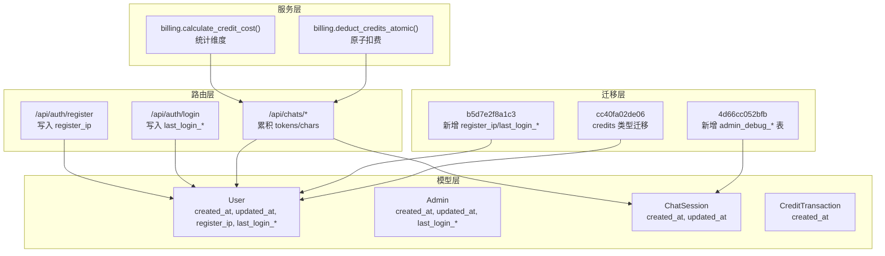
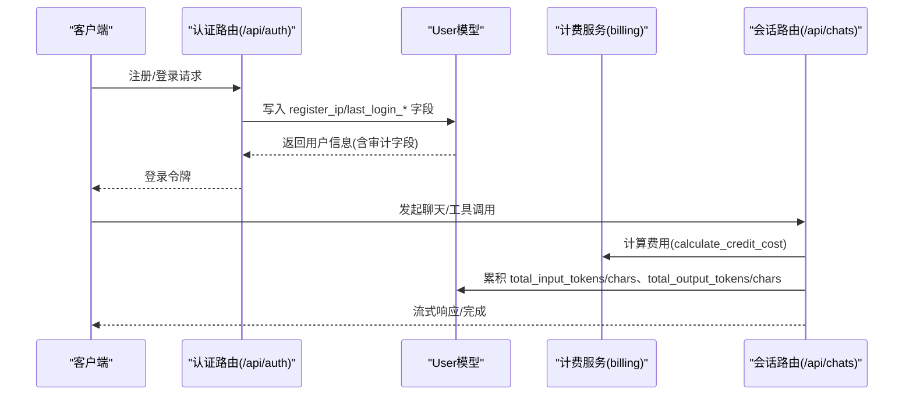
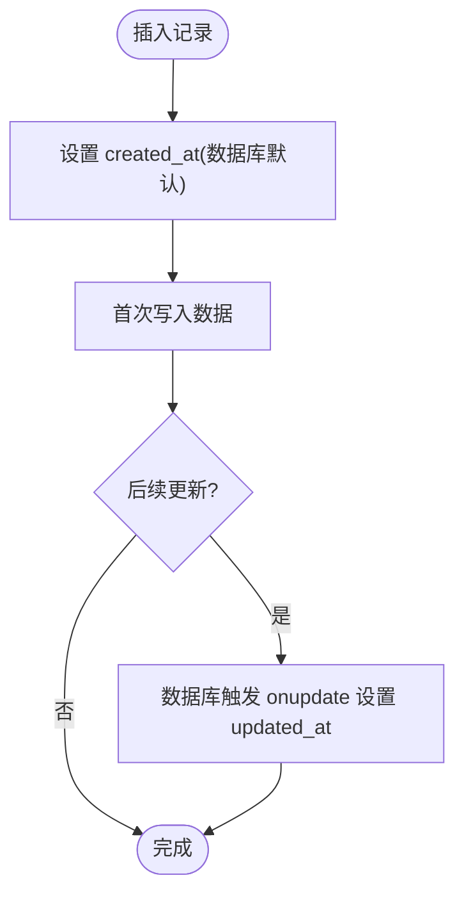
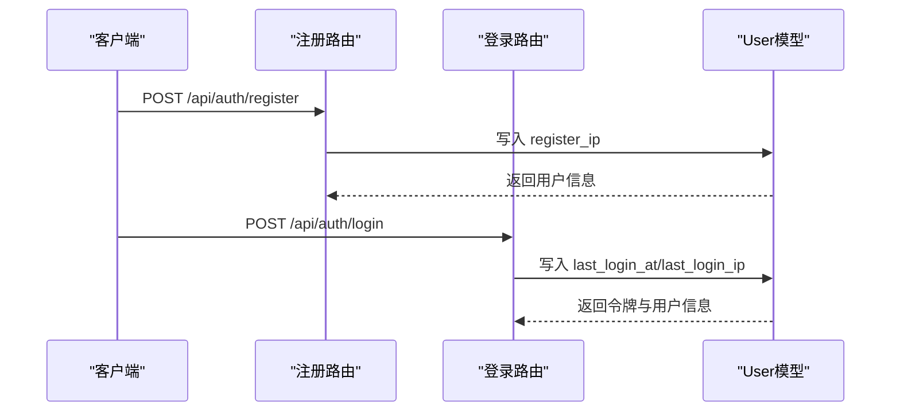
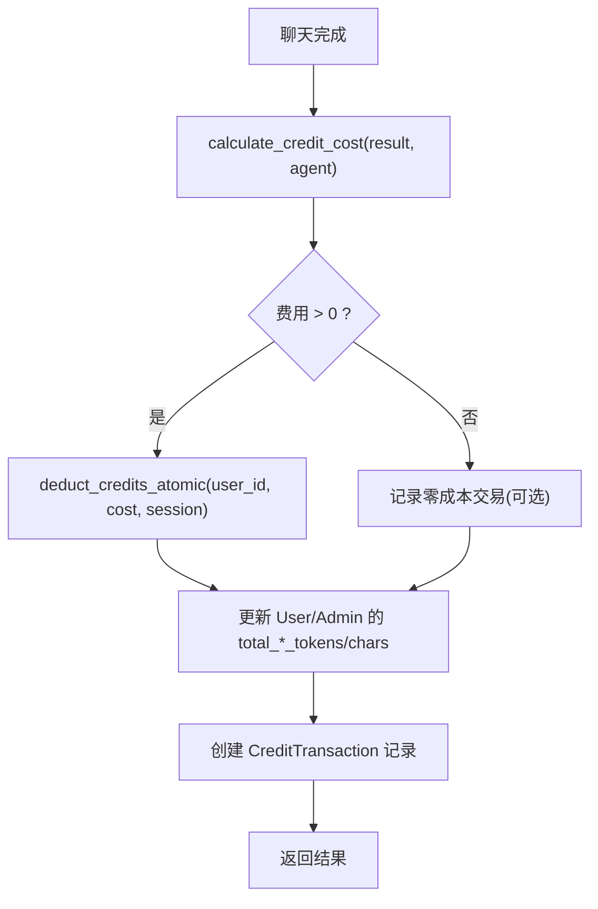
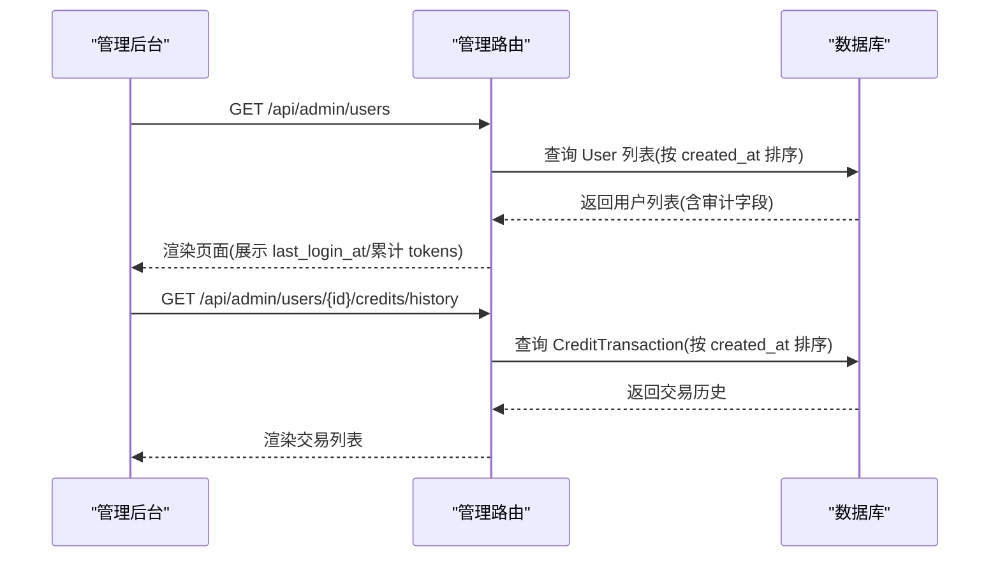
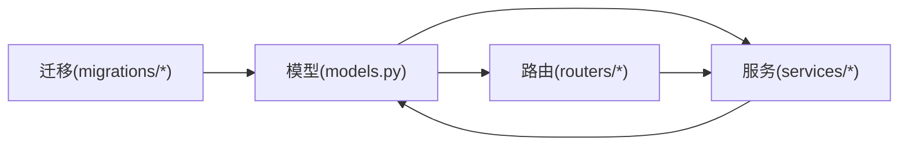

# 审计追踪字段

<cite>
**本文引用的文件**
- [models.py](file://backend/models.py)
- [schemas.py](file://backend/schemas.py)
- [auth.py](file://backend/routers/auth.py)
- [admin.py](file://backend/routers/admin.py)
- [chats.py](file://backend/routers/chats.py)
- [billing.py](file://backend/services/billing.py)
- [b5d7e2f8a1c3_player_to_user_auth.py](file://backend/migrations/versions/b5d7e2f8a1c3_player_to_user_auth.py)
- [4d66cc052bfb_add_admin_debug_sessions.py](file://backend/migrations/versions/4d66cc052bfb_add_admin_debug_sessions.py)
- [cc40fa02de06_migrate_credits_to_decimal_and_atomic_.py](file://backend/migrations/versions/cc40fa02de06_migrate_credits_to_decimal_and_atomic_.py)
- [page.tsx](file://backend/admin/src/app/admin/users/page.tsx)
</cite>

## 目录
1. [简介](#简介)
2. [项目结构](#项目结构)
3. [核心组件](#核心组件)
4. [架构概览](#架构概览)
5. [详细组件分析](#详细组件分析)
6. [依赖分析](#依赖分析)
7. [性能考量](#性能考量)
8. [故障排查指南](#故障排查指南)
9. [结论](#结论)
10. [附录](#附录)

## 简介
本文件聚焦于 Infinite Game 后端的审计追踪字段设计与实现，涵盖以下主题：
- 时间戳字段 created_at、updated_at 的设计与用途
- server_default 与 onupdate 的使用场景与实现原理
- 用户行为追踪字段 register_ip、last_login_ip 的设计考虑
- 统计数据字段 total_input_tokens、total_output_tokens 的累积机制
- 审计日志的生成与查询示例
- 数据完整性与一致性保障措施

## 项目结构
审计追踪字段主要分布在以下位置：
- 数据模型层：定义字段、默认值与更新策略
- 路由层：注册与登录时写入行为追踪字段；聊天结束时累积统计
- 服务层：计费计算与原子扣费，触发统计更新
- 迁移脚本：历史数据迁移与字段演进
- 管理后台：展示审计字段与统计数据

**图表来源**
- [models.py](file://backend/models.py)
- [auth.py](file://backend/routers/auth.py)
- [chats.py](file://backend/routers/chats.py)
- [billing.py](file://backend/services/billing.py)
- [b5d7e2f8a1c3_player_to_user_auth.py](file://backend/migrations/versions/b5d7e2f8a1c3_player_to_user_auth.py)
- [4d66cc052bfb_add_admin_debug_sessions.py](file://backend/migrations/versions/4d66cc052bfb_add_admin_debug_sessions.py)
- [cc40fa02de06_migrate_credits_to_decimal_and_atomic_.py](file://backend/migrations/versions/cc40fa02de06_migrate_credits_to_decimal_and_atomic_.py)

**章节来源**
- [models.py](file://backend/models.py)
- [auth.py](file://backend/routers/auth.py)
- [chats.py](file://backend/routers/chats.py)
- [billing.py](file://backend/services/billing.py)
- [b5d7e2f8a1c3_player_to_user_auth.py](file://backend/migrations/versions/b5d7e2f8a1c3_player_to_user_auth.py)
- [4d66cc052bfb_add_admin_debug_sessions.py](file://backend/migrations/versions/4d66cc052bfb_add_admin_debug_sessions.py)
- [cc40fa02de06_migrate_credits_to_decimal_and_atomic_.py](file://backend/migrations/versions/cc40fa02de06_migrate_credits_to_decimal_and_atomic_.py)

## 核心组件
- 时间戳字段
  - created_at：记录实体创建时间，使用 server_default 指定数据库默认值，确保插入即有值。
  - updated_at：记录实体最后更新时间，使用 onupdate 指定数据库自动更新策略，简化 ORM 层逻辑。
- 用户行为追踪字段
  - register_ip：注册时记录客户端 IP，便于审计与风控。
  - last_login_at、last_login_ip：登录时记录最近一次登录的时间与 IP，用于安全监控与用户画像。
- 统计数据字段
  - total_input_tokens、total_output_tokens：累计输入/输出 token 数，配合计费模块进行原子扣费与交易记录。
  - total_input_chars、total_output_chars：累计输入/输出字符数，作为额外统计维度。
- 审计日志与查询
  - 管理后台展示用户统计数据与最近登录时间。
  - 计费服务计算费用并生成交易记录，记录 tokens 维度与元数据。

**章节来源**
- [models.py](file://backend/models.py)
- [schemas.py](file://backend/schemas.py)
- [auth.py](file://backend/routers/auth.py)
- [admin.py](file://backend/routers/admin.py)
- [page.tsx](file://backend/admin/src/app/admin/users/page.tsx)

## 架构概览
审计追踪贯穿“模型定义 → 路由处理 → 服务计算 → 数据持久化”的全链路。

**图表来源**
- [auth.py](file://backend/routers/auth.py)
- [chats.py](file://backend/routers/chats.py)
- [billing.py](file://backend/services/billing.py)
- [models.py](file://backend/models.py)

## 详细组件分析

### 时间戳字段：created_at 与 updated_at
- 设计要点
  - created_at 使用 server_default 指定数据库默认值，确保插入即有时间戳，避免空值。
  - updated_at 使用 onupdate 指定数据库自动更新策略，简化 ORM 层更新逻辑，减少重复代码。
- 实现位置
  - User/Admin/Theater/Agent/ChatSession 等模型均包含上述字段。
- 使用场景
  - 列表排序、导出审计报告、合规要求的时间线追溯。

**图表来源**
- [models.py](file://backend/models.py)
- [b5d7e2f8a1c3_player_to_user_auth.py](file://backend/migrations/versions/b5d7e2f8a1c3_player_to_user_auth.py)

**章节来源**
- [models.py](file://backend/models.py)
- [b5d7e2f8a1c3_player_to_user_auth.py](file://backend/migrations/versions/b5d7e2f8a1c3_player_to_user_auth.py)

### server_default 与 onupdate 的使用场景与实现原理
- server_default
  - 场景：确保记录创建时具备时间戳，无需应用层显式赋值。
  - 实现：SQLAlchemy 在列定义中指定 server_default，数据库在插入时填充默认值。
- onupdate
  - 场景：自动维护“最后修改时间”，避免遗漏更新。
  - 实现：SQLAlchemy 在列定义中指定 onupdate，数据库在更新行时自动刷新该列。
- 迁移一致性
  - 历史迁移脚本中对 created_at/updated_at 的定义与现有模型保持一致，确保数据一致性。

**章节来源**
- [models.py](file://backend/models.py)
- [4d66cc052bfb_add_admin_debug_sessions.py](file://backend/migrations/versions/4d66cc052bfb_add_admin_debug_sessions.py)

### 用户行为追踪字段：register_ip 与 last_login_ip
- 设计考虑
  - register_ip：记录注册时客户端 IP，便于识别异常注册与风控策略。
  - last_login_at/last_login_ip：记录最近一次登录时间与 IP，用于安全审计与异常登录检测。
- 写入时机
  - 注册：在注册路由中将 request.client.host 写入 register_ip。
  - 登录：在登录路由中将当前时间与客户端 IP 写入 last_login_* 字段。
- 展示与查询
  - 管理后台用户列表展示 last_login_at 与累计 tokens，便于运营与风控分析。

**图表来源**
- [auth.py](file://backend/routers/auth.py)
- [models.py](file://backend/models.py)
- [page.tsx](file://backend/admin/src/app/admin/users/page.tsx)

**章节来源**
- [auth.py](file://backend/routers/auth.py)
- [models.py](file://backend/models.py)
- [page.tsx](file://backend/admin/src/app/admin/users/page.tsx)

### 统计数据字段：total_input_tokens 与 total_output_tokens 的累积机制
- 累积维度
  - tokens：input_tokens、output_tokens
  - 文本字符：total_input_chars、total_output_chars
- 累积触发点
  - 聊天完成时，根据结果对象的统计维度累加至 User/Admin 实体，并记录 CreditTransaction。
  - 计费服务 calculate_credit_cost 会解析不同模态的 tokens（如 text_output、image_output），并汇总到总费用。
- 原子扣费
  - deduct_credits_atomic 使用 UPDATE ... WHERE ... 语句确保并发安全，避免余额不足或竞态条件导致的错误。

**图表来源**
- [chats.py](file://backend/routers/chats.py)
- [billing.py](file://backend/services/billing.py)
- [models.py](file://backend/models.py)

**章节来源**
- [chats.py](file://backend/routers/chats.py)
- [billing.py](file://backend/services/billing.py)
- [models.py](file://backend/models.py)

### 审计日志的生成与查询示例
- 生成
  - 登录成功后写入 last_login_at/last_login_ip。
  - 聊天结束时累积 tokens/chars 并创建 CreditTransaction。
- 查询
  - 管理后台用户列表展示 total_input_tokens/total_output_tokens、last_login_at。
  - 管理后台提供用户积分历史接口，查询 CreditTransaction。

**图表来源**
- [admin.py](file://backend/routers/admin.py)
- [page.tsx](file://backend/admin/src/app/admin/users/page.tsx)
- [models.py](file://backend/models.py)

**章节来源**
- [admin.py](file://backend/routers/admin.py)
- [page.tsx](file://backend/admin/src/app/admin/users/page.tsx)
- [models.py](file://backend/models.py)

### 数据完整性与一致性保证
- 外键约束与迁移
  - 历史迁移脚本修复了 story_chapters 的外键从 players 到 users 的映射，确保引用完整性。
  - 在某些平台（如 SQLite）通过重建表的方式修正外键约束，避免反射失败导致的迁移错误。
- 并发安全
  - 原子扣费 deduct_credits_atomic 使用 UPDATE ... WHERE ... 语句，确保余额不会因并发而出现负值或竞态。
- 字段类型与默认值
  - credits 字段在迁移中从浮点类型转换为 DECIMAL(18, 4)，并在模型中设置 server_default，提升计费精度与一致性。
- 时间戳一致性
  - created_at 使用数据库默认值，updated_at 使用 onupdate，确保时间戳始终与数据库时钟同步。

**章节来源**
- [cc40fa02de06_migrate_credits_to_decimal_and_atomic_.py](file://backend/migrations/versions/cc40fa02de06_migrate_credits_to_decimal_and_atomic_.py)
- [l8m9n0o1p2q3_fix_chat_ids_uuid.py](file://backend/migrations/versions/l8m9n0o1p2q3_fix_chat_ids_uuid.py)
- [models.py](file://backend/models.py)
- [billing.py](file://backend/services/billing.py)

## 依赖分析
审计追踪字段在模型、路由与服务层之间形成清晰的依赖关系：
- 模型层定义字段与默认值
- 路由层在注册/登录与聊天完成时写入审计字段
- 服务层负责计费与原子扣费，联动统计字段
- 迁移层确保历史数据与外键约束的一致性

**图表来源**
- [models.py](file://backend/models.py)
- [auth.py](file://backend/routers/auth.py)
- [chats.py](file://backend/routers/chats.py)
- [billing.py](file://backend/services/billing.py)
- [b5d7e2f8a1c3_player_to_user_auth.py](file://backend/migrations/versions/b5d7e2f8a1c3_player_to_user_auth.py)

**章节来源**
- [models.py](file://backend/models.py)
- [auth.py](file://backend/routers/auth.py)
- [chats.py](file://backend/routers/chats.py)
- [billing.py](file://backend/services/billing.py)
- [b5d7e2f8a1c3_player_to_user_auth.py](file://backend/migrations/versions/b5d7e2f8a1c3_player_to_user_auth.py)

## 性能考量
- 数据库默认值与自动更新
  - 使用 server_default/onupdate 减少应用层写入开销，降低网络往返与 ORM 层逻辑复杂度。
- 原子扣费
  - 单条 UPDATE 语句即可完成余额校验与更新，避免多次查询与锁竞争。
- 统计维度
  - 仅在必要时（聊天完成）进行累积，避免频繁写入带来的 I/O 压力。

## 故障排查指南
- 登录后未更新 last_login_* 字段
  - 检查登录路由是否正确写入 last_login_at/last_login_ip，并确认数据库事务提交成功。
- 累积统计不准确
  - 确认聊天完成流程是否调用统计更新逻辑，核对 result 对象是否包含 input_tokens/output_tokens。
- 余额扣费异常
  - 检查原子扣费函数是否被调用，确认并发场景下 UPDATE 语句的 WHERE 条件是否满足。
- 历史数据迁移问题
  - 若外键约束缺失或指向旧表，参考迁移脚本中的重建表与外键修复逻辑。

**章节来源**
- [auth.py](file://backend/routers/auth.py)
- [chats.py](file://backend/routers/chats.py)
- [billing.py](file://backend/services/billing.py)
- [l8m9n0o1p2q3_fix_chat_ids_uuid.py](file://backend/migrations/versions/l8m9n0o1p2q3_fix_chat_ids_uuid.py)

## 结论
审计追踪字段通过“模型默认值 + 路由写入 + 服务累积 + 原子扣费”的协同机制，实现了高一致性与可审计性：
- created_at/updated_at 保障时间线完整
- register_ip/last_login_* 提升安全可观测性
- total_*_tokens/chars 与 CreditTransaction 构建完整的计费与审计闭环
- 迁移与外键约束确保历史数据与引用完整性

## 附录
- 相关字段定义与默认值可参考模型文件
- 审计字段在管理后台的展示与查询可参考管理路由与前端页面

**章节来源**
- [models.py](file://backend/models.py)
- [admin.py](file://backend/routers/admin.py)
- [page.tsx](file://backend/admin/src/app/admin/users/page.tsx)